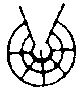

 
 

<!-- "Under construction": 

  U-ci pagina du gene stru.  Id ne pa gene fini a-nu. 
 
  

 
 
 

--> 

 

<I> 
  [Ex bibli "Espa&ntilde;ol Glosa&nbsp;1000" ex Richard Burrows,
  Wendy Ashby e Ron Clark, &copy; GEO, Richmond UK 1992, 
  ISBN&nbsp;0&nbsp;946540&nbsp;18&nbsp;7.  

  Tu pote merka u bibli ex: Glosa Education Organisation,
  35 Wingfield Road; Kingston Upon Thames; Surrey KT2 5LR;
  ENGLAND.   

  HTML-versio ex Ma&#114;&#99;e&#108; &#83;p&#114;&#105;nger, 2004.]

<!-- English: 
  [From the book "Espa&ntilde;ol Glosa&nbsp;1000" by Richard Burrows,
  Wendy Ashby and Ron Clark, &copy; GEO, Richmond UK 1992, 
  ISBN&nbsp;0&nbsp;946540&nbsp;18&nbsp;7.  

  You can buy the book from: Glosa Education Organisation,
  35 Wingfield Road; Kingston Upon Thames; Surrey KT2 5LR;
  ENGLAND.   

  HTML-version by Ma&#114;&#99;e&#108; &#83;p&#114;&#105;nger, 2004.  
  Many thanks to ... 
  for his help with the Spanish language.]
--> 
<!-- Spanish: 
  [Del libro "Espa&ntilde;ol Glosa&nbsp;1000" de Richard Burrows, 
  Wendy Ashby y Ron Clark, &copy; GEO, Richmond UK 1992, 
  ISBN&nbsp;0&nbsp;946540&nbsp;18&nbsp;7.  

  ... 
--> 

</I>
 
 
 
 

<I>portada:</I>
 

<TABLE BGCOLOR="Yellow" WIDTH=80% BORDER=0>
<TR>
  <TD ALIGN=CENTER>
     
     
     ESPA&Ntilde;OL  
     
    <B> GLOSA&nbsp;1000 </B>  
     
     
  </TD>
</TR>
</TABLE>

 
 

<I>
  [U titula-pagina monstra uno exempla de Glosa-verba ko mu Español 
  kognati-verba.  Tu pote vide mu 
    <A HREF="esintra.htm#exempla">infra.</A>]

<!-- English: 
  [The title page shows some examples of Glosa words with their
  Spanish cognates.  You can see them  
  <A HREF="#exempla">below.</A>]
--> 

</I>
 
 
 

<I>p. 1-2:</I>
 

 Escrito por Richard Burrows, MIL   
Redactado por Wendy Ashby & Ron Clark 
 
 
 

 
 
Glosa Education Organisation   
35&nbsp;Wingfield Road  
Kingston Upon Thames  
Surrey KT2&nbsp;5LR  
ENGLAND 

 
 

Primera edici&oacute;n:&nbsp;1992   
&copy; Richard Burrows & Wendy Ashby 1992  
ISBN&nbsp;0&nbsp;946540&nbsp;18&nbsp;7

 
 

<I>p. 3:</I>
 

<H1>GLOSA</H1> 

<H3>&iexcl;EL&nbsp; IDIOMA&nbsp; INTERNACIONAL&nbsp; QUE&nbsp;
YA&nbsp; SABES!</H3>  

<UL>
<LI> Las comunicaciones modernas est&aacute;n cambiando este mundo en
  que vivimos.  Se transforma en un 'Pueblo Mundial' - y a los
  habitantes, nada m&aacute;s seguro de que les hace falta un Idioma
  Universal.  

<LI> Este idioma se llama GLOSA.  <B>&iexcl;Es tan f&aacute;cil!
  &iexcl;Es tan rico!</B>  Aprender&aacute;s como hablarlo y
  escribirlo dentro de una hora.  S&iacute;, en una hora.  

<LI> Luego, lo hablar&aacute;s y escribir&aacute;s lenta pero
  verdaderamente sobre cualquier tema, <B>porque no hay nada realmente
  nuevo para ti en GLOSA.</B>  

<LI> <B>GLOSA tiene miles de palabras que se originaron en el
  lat&iacute;n y el griego cl&aacute;sicos...</B> igual que
  espa&ntilde;ol.  La misma palabra GLOSA se ve en la palabra
  espa&ntilde;ola 'GLOSArio', entre otras.  En un vocabulario de
  palabras de la mayor utilidad.  GLOSA&nbsp;1000 consta de la
  m&aacute;s b&aacute;sicas de &eacute;stas, cuidadosamente elegidas.
  Combin&aacute;ndolas, hablar&aacute;s y escribir&aacute;s en la vida
  cotidiana, o bien de la ciencia, la tecnolog&iacute;a, las
  letras.  

<LI> Las palabras de <B>GLOSA&nbsp;1000</B> son generalmente bastante
  cortas, ya que carecen de todas aquellas terminaciones gramaticales
  que 'adornaban' los idiomas antiguos pero que hoy, en un idioma
  internacional, no sirven para nada.  Por lo tanto, GLOSA se puede
  hablar y escribir con facilidad y rapidez... muy importantes en el
  mundo de hoy.  

<LI> <B>Y cuando decimos 'internacional', no queremos decir
  s&oacute;lo para los pa&iacute;ses europeos.</B>  Ni mucho menos.
  &iquest;Sab&iacute;as que la naci&oacute;n quiz&aacute;s m&aacute;s
  avanzada del mundo oriental, los japoneses, ha integrado en su
  lengua unas diez mil palabras de origen griego-latin?  Lo mismo
  ocurrir&aacute; en los dem&aacute;s idiomas, naturalmente.  
</UL> 
 
 

<I>p. 4:</I>
 

<H2>FINALIDADES&nbsp; DE&nbsp; GLOSA</H2> 

 Glosa simplifica, mejora y facilita la comunicaci&oacute;n
internacional.  Se puede representar gr&aacute;ficamente cada palabra,
y lo aprenden tan f&aacute;cilmente en los pueblos del Tercer Mundo
como en las ciudades industrializadas de los pa&iacute;ses
desarrollados. 
 

 GLOSA es el idioma auxiliar adecuado para los cient&iacute;ficos y
t&eacute;cnicos, los ordenadores, los turistas y finalmente para la
Comunidad Europea y las Naciones Unidas. 
 

 GLOSA se ense&ntilde;ar&aacute; en los colegios del mundo entero,
de modo que los j&oacute;venes&nbsp;- chicas no menos que
chicos&nbsp;- aprendan a comunicarse e intercambiar opiniones e
ideas. 
  

 GLOSA posee un vocabulario m&aacute;s amplio que ning&uacute;n
idioma natural (o sea, nacional) y es capaz de utilizarse en cualquier
circunstancia.  NO debe ser s&oacute;lo el lenguaje de turismo de los
adinerados, SINO el idioma realmente universal del Hombre. 
 
 
 

<H2>GLOSA&nbsp; ES&nbsp; EDUCATIVO</H2> 

 No s&oacute;lo para la comunicaci&oacute;n internacional se
utilizan los recursos de GLOSA.  Adem&aacute;s es divertid&iacute;simo
y educativo para todos los que tengan afici&oacute;n al estudio de las
palabras y su significado.  Y en el mundo de hoy, todos debemos saber
algo del enorme vocabulario tecnol&oacute;gico que pasa con tanta
rapidez a formar parte de la lectura diaria en los peri&oacute;dicos y
revistas y de aqu&iacute; a entrar en el habla normal.  Veamos unos
ejemplos de palabras Glosas (en MAY&Uacute;SCULAS) y su
relaci&oacute;n con palabras espa&ntilde;olas. 
 

 FE en Glosa siginifica 'ella', como se comprender&aacute; en
seguida considerando palabras como 'FEmenino', 'FEminidad',
'FEminismo'. 
 

 GRAFI&nbsp;= 'escribir' y FOTO&nbsp;= 'luz', que se combinan en
espa&ntilde;ol en la forma de 'fotografia'.  Las mismas ra&iacute;ces
se encuentran en muchas palabras, p. ej. 'grafica', 'ortografia',
'caligrafia', 'fot&oacute;grafo', siempre con el mismo significado.
Fotograf&iacute;a es en efecto 'escritura con luz'. 
 
 

<I>p. 5:</I>
 

 U en Glosa quiere decir 'singular', es decir 'UNo', 'UNidad' etc.
Por eufon&iacute;a, U se convierte en UN delante de vocal. 
 

 De la misma manera, PLU quiere decir 'plural'.  Entonces, en la
pr&aacute;ctica, U(N)&nbsp;= 'un', 'una', 'el', 'la' (singular), y 
PLU&nbsp;= 'los', 'las' (plural). 
 

STORI&nbsp;='HISTORIa'.   
DE&nbsp;= de, igual que en espa&ntilde;ol. 
 

 AUTO&nbsp;= 's&iacute; mismo/a', que se ve en muchas palabras
modernas:  
&nbsp;&nbsp;&nbsp;'AUTOm&oacute;vil' (se mueve por su propria fuerza),
     
&nbsp;&nbsp;&nbsp;'AUTOservicio' (donde se sirve a s&iacute; misma)
    
&nbsp;&nbsp;&nbsp;'AUTOdidacto' (instruido por s&iacute; mismo)   
&nbsp;&nbsp;&nbsp;'AUT&Oacute;nomo' (se vale)  
&nbsp;&nbsp;&nbsp;'AUTOsuficiencia',   
&nbsp;&nbsp;&nbsp;'AUTOgiro',   
&nbsp;&nbsp;&nbsp;'AUTOdeterminacion'. 
 

 BIO&nbsp;= 'vida', como en 'BIOlog&iacute;a' (estudio de seres y
animales vivos). 
 

 &iexcl;Ya hemos compuesto una frase entera en GLOSA, sin darnos
cuenta!  
&nbsp;&nbsp;&nbsp;FE&nbsp; GRAFO&nbsp; U&nbsp; STORI&nbsp; DE&nbsp;
  AUTO&nbsp; BIO.    
&nbsp;&nbsp;&nbsp;Ella escribe la historia de su vida. 
 
 

<H3>CARACTER&Iacute;STICAS&nbsp; DE&nbsp; GLOSA</H3> 

<H4>Vocabulario</H4> 

 Ya sabes la mayor&iacute;a de las palabras Glosas.  S&iacute;, de
verdad.  Por ejemplo, para expresar el concepto de 'higiene' o
'sanidad' en GLOSA, nada m&aacute;s f&aacute;cil; se dice HIGIE o
SANI.  Este no es un ejemplo aislado, ni mucho menos.  ES
T&Iacute;PICO, ya que el vocabulario Glosa se construye a base de
ra&iacute;ces comunes a todos los importantes idiomas europeos.  De
este modo, el idioma internacional GLOSA es f&aacute;cil de aprender
para todos los que hablan o saben espa&ntilde;ol, ingl&eacute;s,
alem&aacute;n, franc&eacute;s, ruso, y un largo etc&eacute;tera.
Utilizando el mismo ejemplo, se ven: 
 

<TABLE Align="Center" border="1">
<TR>
  <TD>Espa&ntilde;ol&nbsp;&nbsp; </TD>
  <TD>HIGIEne&nbsp;&nbsp; </TD> 
  <TD>SANIdad&nbsp;&nbsp; </TD> 
</TR>
<TR> 
  <TD>Ingl&eacute;s&nbsp;&nbsp; </TD> 
  <TD>HYGIEne&nbsp;&nbsp; </TD> 
  <TD>SANItary&nbsp;&nbsp; </TD> 
</TR> 
<TR>
  <TD>Alem&aacute;n&nbsp;&nbsp; </TD> 
  <TD>HYGIEnisch&nbsp;&nbsp; </TD> 
  <TD>SANIt&auml;r&nbsp;&nbsp; </TD> 
</TR>
<TR>
  <TD>Franc&eacute;s&nbsp;&nbsp; </TD> 
  <TD>HYGIEne&nbsp;&nbsp; </TD> 
  <TD>SANItaire&nbsp;&nbsp; </TD> 
</TR>
<TR>
  <TD>Ruso&nbsp;&nbsp; </TD> 
  <TD>GIGIEnicheski&nbsp;&nbsp; </TD> 
  <TD>SANItarni&nbsp;&nbsp; </TD> 
</TR>
<TR>
  <TD>GLOSA&nbsp;&nbsp; </TD> 
  <TD>HIGIE&nbsp;&nbsp; </TD> 
  <TD>SANI&nbsp;&nbsp; </TD> 
</TR>
</TABLE>

 A las palabras nacionales, se les quitan las terminaciones
particulares, y quedan la parte com&uacute;n e internacional - la
palabra GLOSA. 
 

 Lo mismo sucede con la mayor&iacute;a de los conceptos que tengan
algo que ver con el mundo moderno, no s&oacute;lo en el campo
cient&iacute;fico-tecnologico, sino tambi&eacute;n en lo que se
refiere a la vida cotidiana. 
 
 
 

<!--------------------------------->

<I>
  [Plu exempla de titula-pagina:] 

<!-- English: 
  [Examples from the title page:]
--> 

</I>
 

<TABLE BGCOLOR="Yellow" WIDTH=80% BORDER=0>
<TR><TD>&nbsp;</TD><TD></TD><TD></TD></TR> 
<TR>
  <TD Align="Center">
    <B>RODO&nbsp;&nbsp;DENDRO</B>&nbsp;&nbsp;&nbsp;  
    <!-- original was: RHODO DENDRO --> 
    &nbsp;&nbsp;rosa&nbsp;&nbsp;&nbsp;&aacute;rbol&nbsp;&nbsp;&nbsp;&nbsp;  </TD>
  <TD Align="Center">
    <B>&nbsp;AKRO&nbsp;&nbsp;POLIS</B> 
    cumbre&nbsp;&nbsp;ciudad </TD>
  <TD Align="Center"><B>KLI&nbsp;nik</B> 
    cama&nbsp;&nbsp;&nbsp;&nbsp;&nbsp; </TD>
</TR>
<TR><TD>&nbsp;</TD><TD></TD><TD></TD></TR> 
<TR>
  <TD Align="Center"><B>TERMO&nbsp;&nbsp;METRI</B>  
    <!-- original was: THERMO METRI --> 
    &nbsp;&nbsp;&nbsp;&nbsp;calor&nbsp;&nbsp;medir </TD>
  <TD Align="Center"><B>&nbsp;&nbsp;SATIs&nbsp;&nbsp;FACEr</B> 
      <!-- original was "SATIsfy", but it is no Spanish sample --> 
    suficiente&nbsp;&nbsp;hacer&nbsp;&nbsp; </TD>
      <!-- original was only "suficiente" --> 
  <TD Align="Center"><B>kas&nbsp;KADE</B> 
    &nbsp;&nbsp;&nbsp;&nbsp;&nbsp;&nbsp;caer </TD>
</TR>
<TR><TD>&nbsp;</TD><TD></TD><TD></TD></TR> 
<TR>
  <TD Align="Center"><B>&nbsp;&nbsp;&nbsp;DIA&nbsp;&nbsp;METRI</B> 
    a&nbsp;traves&nbsp;&nbsp;&nbsp;medir&nbsp;&nbsp;&nbsp;&nbsp; </TD>
  <TD Align="Center"><B>&nbsp;&nbsp;&nbsp;&nbsp;&nbsp;SKI&nbsp;ence</B> 
    conocimientos </TD>
  <TD Align="Center"><B>URBA</B> 
    ciudad </TD>
</TR>
<TR><TD>&nbsp;</TD><TD></TD><TD></TD></TR> 
<TR>
  <TD Align="Center"><B>RURA</B> 
    campo </TD>
  <TD Align="Center"><B>&nbsp;&nbsp;&nbsp;&nbsp;&nbsp;TELE&nbsp;&nbsp;SKOPE</B> 
    distante&nbsp;&nbsp;&nbsp;&nbsp;mirar </TD>
  <TD Align="Center"><B>AGRI&nbsp;cultur</B> 
    terreno&nbsp;&nbsp;&nbsp;&nbsp;&nbsp;&nbsp;&nbsp;&nbsp;&nbsp; </TD>
</TR>
<TR><TD>&nbsp;</TD><TD></TD><TD></TD></TR> 
<TR>
  <TD Align="Center"><B>HORTI&nbsp;culture</B> 
    jard&iacute;n&nbsp;&nbsp;&nbsp;&nbsp;&nbsp;&nbsp;&nbsp;&nbsp;&nbsp;&nbsp;&nbsp; </TD>
  <TD Align="Center"><B>GLOSA&nbsp;rio</B> 
    lengua&nbsp;&nbsp;&nbsp;&nbsp;&nbsp; </TD>
  <TD Align="Center"><B>&nbsp;&nbsp;&nbsp;AFRO&nbsp;&nbsp;&nbsp;DITE</B> 
    espuma&nbsp;&nbsp;nacer </TD>
</TR>
<TR><TD>&nbsp;</TD><TD></TD><TD></TD></TR> 
<TR>
  <TD Align="Center"><B>PAN&nbsp;&nbsp;ORAMA</B>  
    toda&nbsp;&nbsp;&nbsp;&nbsp;<B>VISTA</B>&nbsp;&nbsp;&nbsp; </TD> 
    <!-- original was toda vista --> 
  <TD Align="Center"><B>DEMO&nbsp;&nbsp;KRATI&nbsp;&nbsp;</B> 
    gente&nbsp;&nbsp;gobernar </TD>
  <TD Align="Center"><B>&nbsp;&nbsp;&nbsp;&nbsp;&nbsp;KALI&nbsp;&nbsp;EIDO&nbsp;&nbsp;SKOPE</B> 
    <!-- original was KAL EIDO SKOPE --> 
    hermosas&nbsp;&nbsp;formas&nbsp;&nbsp;mirar </TD>
</TR>
<TR><TD>&nbsp;</TD><TD></TD><TD></TD></TR> 
<TR>
  <TD Align="Center"><B>TELE&nbsp;&nbsp;&nbsp;FONO</B>  
    <!-- original was: TELE FONE --> 
    distante&nbsp;&nbsp;sonido</TD>
  <TD Align="Center"><B>PERI&nbsp;&nbsp;&nbsp;SKOPE</B> 
    alrededor&nbsp;&nbsp;mirar </TD>
  <TD Align="Center"><B>AUTO&nbsp;BIO&nbsp;GRAFI</B> 
    propia&nbsp;&nbsp;vida&nbsp;&nbsp;escribir </TD>
</TR>
<TR><TD>&nbsp;</TD><TD></TD><TD></TD></TR> 
<TR>
  <TD Align="Center"><B>&nbsp;&nbsp;TRI&nbsp;&nbsp;GONO&nbsp;&nbsp;METRI</B> 
    tres&nbsp;&nbsp;&aacute;ngulas&nbsp;&nbsp;medir</TD>
  <TD Align="Center"><B>&nbsp;&nbsp;PA&nbsp;st</B> 
    pasado&nbsp; </TD>
  <TD Align="Center"><B>&nbsp;&nbsp;FU&nbsp;tur</B> 
    futuro&nbsp; </TD>
</TR>
<TR><TD>&nbsp;</TD><TD></TD><TD></TD></TR> 
<TR>
  <TD Align="Center"><B>DEINO&nbsp;&nbsp;SAURUS</B>  
    <!-- original was: DEINO SAUR --> 
    terrible&nbsp;&nbsp;&nbsp;lagarto</TD>
  <TD Align="Center"><B>GINA&nbsp;eco&nbsp;LOGI</B> 
    mujeres&nbsp;&nbsp;&nbsp;comprender </TD>
  <TD Align="Center"><B>PAR&nbsp;&nbsp;&nbsp;&nbsp;&nbsp;ALELO&nbsp;&nbsp;&nbsp;</B> 
    junto&nbsp;&nbsp;&nbsp;uno&nbsp;al&nbsp;otro </TD>
</TR>
<TR><TD>&nbsp;</TD><TD></TD><TD></TD></TR> 
<TR>
  <TD Align="Center"><B>MIKRO&nbsp;&nbsp;SKOPE</B> 
    peque&ntilde;o&nbsp;&nbsp;&nbsp;mirar</TD>
  <TD Align="Center"><B>&nbsp;&nbsp;&nbsp;EPI&nbsp;&nbsp;DERMA</B> 
    <!-- original was: EPI DERMIS --> 
    sobre&nbsp;&nbsp;&nbsp;&nbsp;piel </TD>
  <TD Align="Center"><B>MIRA&nbsp;culo</B> 
    milagro&nbsp;&nbsp;&nbsp;&nbsp;&nbsp;&nbsp; </TD>
</TR>
<TR><TD>&nbsp;</TD><TD></TD><TD></TD></TR> 
<TR>
  <TD Align="Center"><B>FILO&nbsp;&nbsp;&nbsp;&nbsp;SOFI&nbsp;</B> 
    amar&nbsp;&nbsp;sabidur&iacute;a</TD>
  <TD Align="Center"><B>&nbsp;&nbsp;POLI&nbsp;&nbsp;TEKNO</B>  
    <!-- original was: POLI TEKNIK --> 
    muchas&nbsp;&nbsp;destrezas </TD>
  <TD Align="Center"><B>SEISMO&nbsp;&nbsp;&nbsp;&nbsp;LOGI&nbsp;&nbsp;&nbsp;&nbsp;&nbsp;</B> 
    terremoto&nbsp;&nbsp;comprender </TD>
</TR>
<TR><TD>&nbsp;</TD><TD></TD><TD></TD></TR> 
</TABLE>

 
 

<!-- 

<TR>
  <TD Align="Center"><B>&nbsp;</B> 
    &nbsp;</TD>
  <TD Align="Center"><B>&nbsp;</B> 
    &nbsp; </TD>
  <TD Align="Center"><B>&nbsp;</B> 
    &nbsp; </TD>
</TR>

--> 
<!--------------------------------->

<I>p. 6:</I>
 

<H3>GRAMATICA&nbsp;- &iexcl;NO! </H3> 

 Las dos cosas que m&aacute;s desaniman a los estudiantes de
idiomas son: 
 

<UL>
<LI> la <B>declinaci&oacute;n</B> (=&nbsp;cambios en la forma de los
  nombres y adjectivos para indicar su 'caso' gramatical), y  
<LI> la <B>conjugaci&oacute;n</B> (=&nbsp;cambios en la forma de los
  verbos para indicar la 'persona', el n&uacute;mero, el tiempo, el
  modo, y otras nociones). 
</UL> 

 Consideremos los idiomas europeos en estos aspectos: 
 

<TABLE Align="Center" Border="0"> 
<TR>
  <TD> </TD> 
  <TD><B>DECLINACI&Oacute;N</B> </TD> 
  <TD><B>CONJUGACI&Oacute;N</B> </TD> 
</TR>
<TR>
  <TD>Espa&ntilde;ol&nbsp;&nbsp;&nbsp; </TD> 
  <TD>Casi nada (s&oacute;lo plural)&nbsp;&nbsp;&nbsp; </TD> 
  <TD>Much&iacute;sima </TD> 
</TR>
<TR>
  <TD>Franc&eacute;s&nbsp;&nbsp;&nbsp; </TD> 
  <TD>Casi nada (s&oacute;lo plural) </TD> 
  <TD>Much&iacute;sima  </TD> 
</TR>
<TR>
  <TD>Ingl&eacute;s </TD> 
  <TD>Casi nada (s&oacute;lo plural) </TD> 
  <TD>Muy poca </TD> 
</TR>
<TR>
  <TD>Alem&aacute;n&nbsp;&nbsp;&nbsp; </TD> 
  <TD>Bastante </TD> 
  <TD>Bastante </TD> 
</TR>
<TR>
  <TD>Ruso </TD> 
  <TD>Much&iacute;sima  </TD> 
  <TD>Much&iacute;sima  </TD> 
</TR>
<TR>
  <TD>GLOSA&nbsp;&nbsp;&nbsp; </TD> 
  <TD>NADA </TD> 
  <TD>NADA </TD> 
</TR>
</TABLE> 

<B><I> Est&aacute; claro que no hay la m&aacute;s m&iacute;nima
dificultad en cuanto a esto. </I></B>
 
 
 

<H3>ESTRUCTURA&nbsp;- S&Iacute; </H3> 

<B>Orden de Palabras.</B> Para expresar nuestras ideas clara y
l&oacute;gicamente sin recurso a aquellas nociones casi
prehist&oacute;ricas que son la declinaci&oacute;n y la
conjugaci&oacute;n, hay que tener siempre presente dos reglas
sencillas... 
 

<OL>
<LI> las partes de la oraci&oacute;n vienen en el orden fijo
  S&nbsp;V&nbsp;O (Sujeto&nbsp;- Verbo&nbsp;- Objeto); y 
<LI> los adjetivos vienen siempre delante del nombre que modifican, en
  el orden Aj&nbsp;N. 
</OL> 
 

<B>Palabras funcionales.</B> Para expresar las dem&aacute;s y
m&aacute;s variadas relaciones, existen en GLOSA una veintena de
palabrecitas invariables (&iexcl;como no!) que reemplazan toda la
gram&aacute;tica tradicional y aburrida que heredamos del latin y del
griego.   

Se encuentran estas palabras funcionales en los ejemplos,
p&aacute;gs. 10 a&nbsp;13. 
 

<B>POR&nbsp; TODO&nbsp; LO&nbsp; EXPUESTO,&nbsp; YA&nbsp; VES&nbsp;
QUE&nbsp; NO&nbsp; HAY&nbsp; CASI&nbsp; NADA&nbsp; QUE&nbsp;
APRENDER,&nbsp; VAYA.&nbsp; </B>
 
 
 

<I>p. 7:</I>
 

<H2>PRONUNCIACI&Oacute;N&nbsp; Y&nbsp; ALFABETO </H2> 

El Alfabeto Glosa consta de las siguientes 24&nbsp;letras 
A B C D E F G H I J K L M N O P Q R S T U V X Z.  
Cada uno de estos s&iacute;mbolos escritos es la representaci&oacute;n
gr&aacute;fica de un &uacute;nico sonido en la lengua hablada.  Estos
sonidos se dividen en:  
5&nbsp;vocales A E I O U;   
19&nbsp;consonantes B C D F G H J K L M N P Q R S T V X Z

 

<B>Pronunciaci&oacute;n de las Vocales</B>  
Igual que en espa&ntilde;ol.   
Cuando dos vocales consecutivas ocurren en una palabra, pueden formar
o bien un hiato o bien un diptongo.  Es un <B>hiato</B> si las dos
vocales se pronuncian separadamente, de modo que constituyen dos
s&iacute;labas.  Esto es generalmente lo que pasa si las dos vocales
son A, E, O.  Pero hay dos importantes excepciones.  Por razones 
hist&oacute;rico-etimol&oacute;gicas, las combinaciones AE y OE no son
hiatos, sino diptongos.  Es un <B>diptongo</B> si dos vocales seguidas
se unen para formar una sola s&iacute;laba.  Esto ocurre generalmente
cuando una or dos de las vocales es I o U.  Adem&aacute;s, por
excepci&oacute;n, las combinaciones AE y OE son diptongos, Y se
pronuncian igual que AI y OI, respectivamente.  En resumen: 
 

<B>diptongos (a) cualquier combinaci&oacute;n de dos vocales donde
al menos una de ellas es I o U;   
(b) AE se pronuncia como si fuera AI, y OE como si fuera OI; </B>
 

<B>hiatos</B> cualquier combinaci&oacute;n de dos vocales que no
contenga ni I ni U, menos AE y OE. 
 

<B>Pronunciaci&oacute;n de las Consonantes</B>  
Igual que en espa&ntilde;ol: D F K L M N P R T   
Parecidas al espa&ntilde;ol: 
 

<UL>
<LI> B (=&nbsp;P sonora) siempre bilabial 
<LI> V (=&nbsp;F sonora) siempre labiodental 
<LI> S siempre sorda (de 'sosa') 
<LI> Z (=&nbsp;S sonora) (de 'mismo') 
<LI> G (=&nbsp;K sonora) (de 'ganga' nunca como la jota) 
<LI> Q como 'cu' seguida de vocal (de 'cuando'); 
<LI> H sola representa una ligera aspiraci&oacute;n
      (pronunciaci&oacute;n antigua o gitana de 'hondo'); 
<LI> X se dice siempre como 'ks' (algo dif&iacute;cil en
      posici&oacute;n inicial); 
<LI> J es casi una semiconsonante, y tiene el sonido de 'hi' en
      posici&oacute;n inicial (de 'hielo'). 
</UL> 

 Mucho cuidado con: C, que es igual que la 'ch' espa&ntilde;ola. 

 
 

<I>p. 8:</I>
 

<B>Acento t&oacute;nico</B>  
Por lo general, las palabras que contienen dos o m&aacute;s vocales
recibir&aacute;n un ligero &eacute;nfasis en una de dichas vocales en
el idioma hablado.   
Este &eacute;nfasis se llama 'acento t&oacute;nico'.  En
espa&ntilde;ol, las palabras pueden clasificarse seg&uacute;n la
s&iacute;laba en que cae el acento t&oacute;nico, de la siguiente
manera: 
 

 palabras agudas, si la s&iacute;laba acentuada es la
&uacute;ltima;   
palabras llanas, si la s&iacute;laba acentuada es la pen&uacute;ltima;
  
palabras esdr&uacute;julas, si la s&iacute;laba acentuada es la
antepen&uacute;ltima. 
 

 En GLOSA, la inmensa mayor&iacute;a de las palabras son llanas.
Sin embargo, hay unas palabras esdr&uacute;julas que terminan por un
hiato y tienen al menos una vocal anterior a la ultima consonante.  No
existen palabras agudas.  Conforme con estas reglas, se ver&aacute;
que las palabras que terminan por una consonante (son una veintena)
son llanas. 
 

<B>Entre Palabras: hiato s&iacute;, sinalefa no</B>  
Puesto que la casi totalidad de las palabras glosas terminan por vocal
y alrededor del 18&nbsp;% de ellas empiezean por vocal, es de suponer
que muchas veces encontraremos dos vocales seguidas&nbsp;- la
&uacute;ltima de una palabra y la primera de la palabra siguiente.
Cuando ocurra esto, se pronuncian estas vocales con hiato, y nunca con
la t&iacute;pica sinalefa espa&ntilde;ola.  Esto para evitar
confusiones y malentendimientos. 
 

<B>Ejemplos de Pronunciaci&oacute;n</B>  
En la representac&oacute;n figurada espa&ntilde;ola, que no puede ser
m&aacute;s que una aproximaci&oacute;n, las s&iacute;labas acentuadas
est&aacute;n subrayadas.  Como es normal, escribimos las palabras
glosas en MAY&Uacute;SCULAS, y la representaci&oacute;n
fon&eacute;tica entre un par de rayitas oblicuas /.../. 
 

 
BIO&nbsp;= /&nbsp;b&iacute;o&nbsp;/, 
CENT&nbsp;= /&nbsp;chent&nbsp;/, 
CIANO&nbsp;= /&nbsp;chano&nbsp;/, 
ELEUTERO&nbsp;= /&nbsp;eleutero&nbsp;/, 
FORUM&nbsp;= /&nbsp;f&oacute;rum&nbsp;/, 
GRAFO&nbsp;= /&nbsp;grafo&nbsp;/, 
GIMNO&nbsp;= /&nbsp;guimno&nbsp;/, 
HIAO&nbsp;= /&nbsp;jiao&nbsp;/ (la jota muy muy suave), 
KORTEX&nbsp;= /&nbsp;c&oacute;rtex&nbsp;/, 
JACE&nbsp;= /&nbsp;yache&nbsp;/, 
LIQE&nbsp;= /&nbsp;licue&nbsp;/, 
MIO&nbsp;= /&nbsp;m&iacute;o&nbsp;/, 
PALAEO&nbsp;= /&nbsp;PALAYO&nbsp;/, 
QADRA&nbsp;= /&nbsp;cuadra&nbsp;/, 
QI&nbsp;= /&nbsp;cui&nbsp;/, 
QO&nbsp;= /&nbsp;cuo&nbsp;/, 
TEKA&nbsp;= /&nbsp;teka&nbsp;/, 
VIA&nbsp;= /&nbsp;v&iacute;a&nbsp;/. 

 

 
MI&nbsp; PA&nbsp; AKUSTI&nbsp; U&nbsp; RADIO&nbsp;= 
  /&nbsp;mi pa acusti u radio&nbsp;/;    
MU&nbsp; EKO&nbsp; INTRA&nbsp; U-CI&nbsp; DOMI&nbsp;= 
  /&nbsp;mu eco intra uchi domi&nbsp;/. 

 
 
 

<B>Resumen de Cosas importantes</B>  
Vocales: son ditongos AE&nbsp;= /ai/, OE&nbsp;=/oi/.   
Consonantes: sordas P, B; T, D; K, G; F, V; S, Z   
H&nbsp;= /&nbsp;h&nbsp;/ inglesa (ligera aspiraci&oacute;n de aire);
    
J&nbsp;= /&nbsp;y&nbsp;/ inicial tambi&eacute;n bastante suave;   
Q&nbsp;= /&nbsp;kw&nbsp;/ =&nbsp;/&nbsp;cu&nbsp;/ inicial
  espa&ntilde;ola;   
X&nbsp;= /&nbsp;ks&nbsp;/   
Mucho cuidado con los pares; B (bilabial)&nbsp;= V (labiodental)   
&nbsp;&nbsp;&nbsp;... S (sorda)&nbsp;= Z (sonora)   
MUCHISIMO CUIDADO con: C&nbsp;= /&nbsp;ch&nbsp;/. 

 
 
 

<I>p. 9:</I>
 

<H2>17&nbsp;&nbsp;GEN&Eacute;RICOS&nbsp; T&Eacute;RMINOS </H2> 

<TABLE Align="Center" Border="0"> 
<TR> 
  <TD> </TD> 
  <TD> </TD> 
  <TD> </TD> 
  <TD> </TD> 
  <TD Align="Center" Colspan="2">ejemplos </TD> 
</TR> 
<TR> 
  <TD Colspan="2">gen&eacute;ricos &nbsp;</TD> 
  <TD>significado &nbsp; </TD> 
  <TD> </TD> 
  <TD>Glosa </TD> 
  <TD>Espa&ntilde;ol </TD> 
</TR> 
<TR> 
  <TD><B>-BO&nbsp;&nbsp;&nbsp;</B></TD> 
  <TD>BOteka </TD> 
  <TD>tienda </TD> 
  <TD>BOtica </TD> 
  <TD><B>pani-bo</B> </TD> 
  <TD>panader&iacute;a </TD> 
</TR> 
<TR> 
  <TD><B>-DO</B></TD> 
  <TD>DOmi </TD> 
  <TD>casa </TD> 
  <TD>DOmicilio </TD> 
  <TD><B>agri-do </B></TD> 
  <TD>granja </TD> 
</TR> 
<TR> 
  <TD><B>-FA </B></TD> 
  <TD>FAsci </TD> 
  <TD>fajo, haz </TD> 
  <TD>FAsc&iacute;culo </TD> 
  <TD><B>flori-fa </B></TD> 
  <TD>ramo de flores </TD> 
</TR> 
<TR> 
  <TD><B>-FI </B></TD> 
  <TD>FIlamenta </TD> 
  <TD>hilo </TD> 
  <TD>FIlamento </TD> 
  <TD><B>kupra-fi </B></TD> 
  <TD>alambre de cobre </TD> 
</TR> 
<TR> 
  <TD><B>-KA </B></TD> 
  <TD>KAmera </TD> 
  <TD>habitaci&oacute;n </TD> 
  <TD>C&Aacute;mara </TD> 
  <TD><B>kuko-ka </B></TD> 
  <TD>cocina </TD> 
</TR> 
<TR> 
  <TD><B>-LI </B></TD> 
  <TD>LIto </TD> 
  <TD>piedra </TD> 
  <TD>LItograf&iacute;a </TD> 
  <TD><B>lamina-li </B></TD> 
  <TD>pizarra </TD> 
</TR> 
<TR> 
  <TD><B>-LO </B></TD> 
  <TD>LOka </TD> 
  <TD>lugar </TD> 
  <TD>LOcalista </TD> 
  <TD><B>panto-lo </B></TD> 
  <TD>en todas partes </TD> 
</TR> 
<TR> 
  <TD><B>-MA </B></TD> 
  <TD>MAteria </TD> 
  <TD>materia </TD> 
  <TD>MAteria </TD> 
  <TD><B>geo-ma </B></TD> 
  <TD>mineral </TD> 
</TR> 
<TR> 
  <TD><B>-ME </B></TD> 
  <TD>MEkani </TD> 
  <TD>MEcanismo </TD> 
  <TD>MEcanismo </TD> 
  <TD><B>puta-me </B></TD> 
  <TD>computadora </TD> 
</TR> 
<TR> 
  <TD><B>-MO </B></TD> 
  <TD>MObili </TD> 
  <TD>MObiliario </TD> 
  <TD>MObiliario </TD> 
  <TD><B>grafo-mo&nbsp;&nbsp;&nbsp; </B></TD> 
  <TD>escritorio </TD> 
</TR> 
<TR> 
  <TD><B>-PE </B></TD> 
  <TD>PErsona </TD> 
  <TD>PErsona </TD> 
  <TD>PErsona </TD> 
  <TD><B>mari-pe </B></TD> 
  <TD>marinero </TD> 
</TR> 
<TR> 
  <TD><B>-RA </B></TD> 
  <TD>ReAl </TD> 
  <TD>ReAl </TD> 
  <TD>ReAl </TD> 
  <TD><B>bio-ra </B></TD> 
  <TD>organismo </TD> 
</TR> 
<TR> 
  <TD><B>-RU </B></TD> 
  <TD>instRUmenta&nbsp;&nbsp;&nbsp; </TD> 
  <TD>herramienta&nbsp;&nbsp;&nbsp; </TD> 
  <TD>instRUmento&nbsp;&nbsp;&nbsp; </TD> 
  <TD><B>fora-ru </B></TD> 
  <TD>taladro </TD> 
</TR> 
<TR> 
  <TD><B>-TE </B></TD> 
  <TD>TExtili </TD> 
  <TD>TExtil </TD> 
  <TD>TExtil </TD> 
  <TD><B>nasa-te </B></TD> 
  <TD>pa&ntilde;uelo </TD> 
</TR> 
<TR> 
  <TD><B>-VA </B></TD> 
  <TD>VAsa </TD> 
  <TD>recipiente </TD> 
  <TD>VAscular </TD> 
  <TD><B>soma-va&nbsp;&nbsp;&nbsp; </B></TD> 
  <TD>ba&ntilde;o </TD> 
</TR> 
<TR> 
  <TD><B>-VE </B></TD> 
  <TD>VEsti </TD> 
  <TD>VEsti </TD> 
  <TD>VEstir </TD> 
  <TD><B>pedi-ve </B></TD> 
  <TD>zapato </TD> 
</TR> 
<TR> 
  <TD><B>-ZO </B></TD> 
  <TD>ZOna </TD> 
  <TD>anular, aro </TD> 
  <TD>ZOna </TD> 
  <TD><B>meso-zo </B></TD> 
  <TD>cintur&oacute;n </TD> 
</TR> 
</TABLE>
 
 

<H2>LOS&nbsp; N&Uacute;MEROS</H2> 

<TABLE>
<TR>
  <TD VALIGN="Top">Espa&ntilde;ol &nbsp; </TD> 
  <TD VALIGN="Top">Glosa &nbsp; </TD> 
</TR>
<TR>
  <TD>1 </TD> 
  <TD>mo </TD> 
</TR> 
<TR>
  <TD>2 </TD> 
  <TD>bi </TD> 
</TR> 
<TR>
  <TD>3 </TD> 
  <TD>tri </TD> 
</TR> 
<TR>
  <TD>4 </TD> 
  <TD>(tet o) tetra </TD> 
</TR> 
<TR>
  <TD>5 </TD> 
  <TD>(pen o) penta </TD> 
</TR> 
<TR>
  <TD>6 </TD> 
  <TD>(six o) sixa  </TD> 
</TR> 
<TR> 
  <TD>7 </TD> 
  <TD>seti (o septi) </TD> 
</TR> 
<TR> 
  <TD>8 </TD> 
  <TD>(ok o) okto </TD> 
</TR> 
<TR> 
  <TD>9 </TD> 
  <TD>nona </TD> 
</TR> 
<TR> 
  <TD>10 </TD> 
  <TD>deka </TD> 
</TR> 
<TR> 
  <TD>0 </TD> 
  <TD>ze o zero </TD> 
</TR> 
<TR> 
  <TD>11 </TD> 
  <TD>mo mo </TD> 
</TR> 
<TR> 
  <TD>12 </TD> 
  <TD>mo bi </TD> 
</TR> 
<TR> 
  <TD>20 </TD> 
  <TD>bi ze </TD> 
</TR> 
<TR> 
  <TD>50 </TD> 
  <TD>penta ze <!-- original was: pen ze --> </TD> 
</TR> 
<TR> 
  <TD>92 </TD> 
  <TD>nona bi </TD> 
</TR> 
<TR> 
  <TD>100 </TD> 
  <TD>mo hekto <!-- original was: mo centi --> </TD> 
</TR> 
<TR> 
  <TD>1000 </TD> 
  <TD>mo kilo </TD> 
</TR> 
<TR> 
  <TD>mill&oacute;n </TD> 
  <TD>miliona </TD> 
</TR> 
<TR> 
  <TD>10 elevado al 6&nbsp;&nbsp;&nbsp; </TD> 
  <TD>deka a sixa <!-- original was: dek a six --> </TD> 
</TR> 
<TR> 
  <TD>5/8, 5 sobre 8 </TD> 
  <TD>penta supra okto <!-- original was: pen su ok --> </TD> 
</TR> 
<TR> 
  <TD>3,2 </TD> 
  <TD>tri koma bi </TD> 
</TR> 
<TR> 
  <TD>+ </TD> 
  <TD>plus </TD> 
</TR> 
<TR> 
  <TD>- </TD> 
  <TD>minus </TD> 
</TR> 
<TR> 
  <TD>*, por </TD> 
  <TD>para </TD> 
</TR> 
<TR> 
  <TD>3 * 4 = 12 </TD> 
  <TD>tri para tetra <!-- original was: tet --> eqa mo bi  </TD> 
</TR> 
<TR> 
  <TD>dividir </TD> 
  <TD>divide </TD> 
</TR> 
<TR> 
  <TD>5 libros </TD> 
  <TD>penta bibli </TD> 
</TR> 
<TR> 
  <TD>el 5to libro </TD> 
  <TD>u bibli penta </TD> 
</TR> 
<TR> 
  <TD>3 veces </TD> 
  <TD>tri kron </TD> 
</TR> 
<TR> 
  <TD>cada uno </TD> 
  <TD>singu pe habe </TD> 
</TR> 
<TR> 
  <TD>tiene 2 </TD> 
  <TD>bi ra </TD> 
</TR> 
<TR> 
  <TD>&iquest;cu&aacute;ntos? </TD> 
  <TD>Qo numera? alo Qanto? </TD> 
</TR> 
<TR> 
  <TD>cu&eacute;ntelos </TD> 
  <TD>Numera mu </TD> 
</TR> 
<TR> 
  <TD>el 8 de junio </TD> 
  <TD>di okto, <!-- original was: ok --> 
      meno sixa <!-- original was: six --> 
      </TD> 
</TR> 
<TR> 
  <TD>lunes </TD> 
  <TD>di bi </TD> 
</TR> 
<TR> 
  <TD>fecha </TD> 
  <TD>datu </TD> 
</TR> 
</TABLE>
 
 

<I>p. 10:</I>
 

<H2>EJEMPLOS&nbsp; PR&Aacute;CTICOS</H2> 

Estudia cuidadosamente los ejemplos de GLOSA que se encuentran en
esta p&aacute;gina y la siguiente.  Muestran el uso pr&aacute;ctico
del idioma, e iluminan varios puntos did&aacute;cticos y
ling&uuml;&iacute;sticos importantes. 
 

 Cada palabra Glosa expresa una idea o concepto&nbsp;- por lo tanto
se puede equiparar con muchas palabras espa&ntilde;olas casi
sin&oacute;nimas. 
 

 La mayor&iacute;a de las palabras Glosas pueden funcionar como
Cualquier parte de la oraci&oacute;n gramatical. 
 
 
 

<TABLE>
<TR>
  <TD VALIGN="Top">El muro&nbsp;/ un muro </TD>
  <TD VALIGN="Top">U&nbsp; MURA </TD> 
</TR> 
<TR>
  <TD VALIGN="Top">Un ave&nbsp;/ las aves </TD>
  <TD VALIGN="Top">UN&nbsp; AVI&nbsp;/ PLU&nbsp; AVI </TD> 
</TR> 
<TR>
  <TD VALIGN="Top">Aqu&iacute;&nbsp;/ all&iacute; </TD>
  <TD VALIGN="Top">CI&nbsp;/ LA </TD> 
</TR> 
<TR>
  <TD VALIGN="Top">Esto (=&nbsp;lo de aqu&iacute;) </TD>
  <TD VALIGN="Top">U-CI </TD> 
</TR> 
<TR>
  <TD VALIGN="Top">Aquellos (=&nbsp;los de all&iacute;) </TD>
  <TD VALIGN="Top">PLU-LA </TD> 
</TR> 
<TR>
  <TD VALIGN="Top">Las aves en aquella muralla </TD>
  <TD VALIGN="Top">PLU&nbsp; AVI&nbsp; EPI&nbsp; U-LA&nbsp; MURA </TD> 
</TR> 
<TR><TD>&nbsp;</TD><TD></TD></TR> 

<TR>
  <TD ALIGN="Center" Colspan="2">
    <B>PASADO,&nbsp; PRESENTE&nbsp; Y&nbsp; FUTURO</B>
  </TD>  
</TR> 
<TR>
  <TD VALING="Top">Ella estudia (habitualmente) </TD> 
  <TD VALING="Top">FE&nbsp; STUDE </TD> 
</TR> 
<TR>
  <TD VALING="Top">Est&aacute; estudiando (ahora
  mismo)&nbsp;&nbsp;&nbsp; </TD>  
  <TD VALING="Top">FE&nbsp; NU&nbsp; STUDE </TD> 
</TR> 
<TR>
  <TD VALING="Top">(Ella) estudi&oacute;&nbsp;/ estudiar&aacute; </TD> 
  <TD VALING="Top">FE&nbsp; PA&nbsp; STUDE&nbsp;/ FE&nbsp; FU&nbsp;
  STUDE </TD>  
</TR> 
<TR>
  <TD VALING="Top">(Ella) estudiaba (sol&iacute;a
  estudiar)&nbsp;&nbsp;&nbsp; </TD>  
  <TD VALING="Top">FE&nbsp; PA&nbsp; DU&nbsp; STUDE </TD> 
</TR> 
<TR>
  <TD VALING="Top">(Ella) iba a cantar </TD> 
  <TD VALING="Top">FE&nbsp; PA&nbsp; FU&nbsp; KANTA </TD> 
</TR> 
<TR>
  <TD VALING="Top">(Ella) habr&aacute; estudiado </TD> 
  <TD VALING="Top">FE&nbsp; FU&nbsp; PA&nbsp; STUDE </TD> 
</TR> 
<TR>
  <TD VALING="Top">Acaba de sentarse </TD> 
  <TD VALING="Top">FE&nbsp; NU-PA&nbsp; SEDI </TD> 
</TR> 
<TR>
  <TD VALING="Top">Est&aacute; para cantar </TD> 
  <TD VALING="Top">FE&nbsp; NU-FU&nbsp; KANTA </TD> 
</TR> 

<TR><TD>&nbsp;</TD><TD></TD></TR> 
<TR>
  <TD ALIGN="Center" Colspan="2">
    <B>NEGACI&Oacute;N</B>
  </TD>  
</TR> 
<TR>
  <TD VALING="Top">Ella no sabe cantar </TD> 
  <TD VALING="Top">FE&nbsp; NE&nbsp; POTE&nbsp; KANTA. </TD> 
</TR> 
<TR>
  <TD VALING="Top">Muchos libros.  Ning&uacute;n libro </TD> 
  <TD VALING="Top">POLI&nbsp; BIBLI.&nbsp;&nbsp;  ZERO&nbsp;
  BIBLI. </TD>  
</TR> 
<TR>
  <TD VALING="Top">No lo quiero. </TD> 
  <TD VALING="Top">MI&nbsp; NE&nbsp; AMO&nbsp; ID. </TD> 
</TR> 
<TR>
  <TD VALING="Top">No lo quiero en absoluto. </TD> 
  <TD VALING="Top">MI&nbsp; ZERO&nbsp; AMO&nbsp; ID. </TD> 
</TR> 
<TR>
  <TD VALING="Top">Nada.  Nadie </TD> 
  <TD VALING="Top">ZERO-RA.&nbsp;&nbsp;  ZERO-PE. </TD> 
</TR> 
<TR>
  <TD VALING="Top">Por ning&uacute;n lado. </TD> 
  <TD VALING="Top">ZERO-LO. </TD> 
</TR> 
<TR><TD>&nbsp;</TD><TD></TD></TR> 

<TR>
  <TD ALIGN="Center" Colspan="2">
    <B>PREGUNTAS</B>
  </TD>  
</TR> 
<TR>
  <TD VALING="Top">&iquest;Estudiar&aacute; (ella)? </TD> 
  <TD VALING="Top">QE&nbsp; FE&nbsp; FU&nbsp; STUDE? </TD> 
</TR> 
<TR>
  <TD VALING="Top">&iquest;Cant&oacute; ella? </TD> 
  <TD VALING="Top">QE&nbsp; FE&nbsp; PA&nbsp; KANTA? </TD> 
</TR> 
<TR>
  <TD VALING="Top">&iquest;Qu&eacute; pasa aqu&iacute;? </TD> 
  <TD VALING="Top">QO&nbsp; ACIDE&nbsp; CI? </TD> 
</TR> 
<TR>
  <TD VALING="Top">&iquest;Qu&eacute; hora es? </TD> 
  <TD VALING="Top">QO&nbsp; HORO? </TD> 
</TR> 
<TR>
  <TD VALING="Top">&iquest;A qui&eacute;n has visto? </TD> 
  <TD VALING="Top">QO-PE&nbsp; TU&nbsp; PA&nbsp; VIDE? </TD> 
</TR> 
<TR>
  <TD VALING="Top">&iquest;Por qu&eacute; fuiste? </TD> 
  <TD VALING="Top">QO-KA&nbsp; TU&nbsp; PA&nbsp; KI? </TD> 
</TR> 
<TR>
  <TD VALING="Top">&iquest;Para qu&eacute; ir&aacute;s? </TD> 
  <TD VALING="Top">QO-TE&nbsp; TU&nbsp; FU&nbsp; KI? </TD> 
</TR> 
</TABLE> 
 

<I>p. 11:</I>
 

<TABLE>
<TR>
  <TD ALIGN="Center" Colspan="2">
    <B>EL&nbsp; RELATIVO</B>
  </TD>  
</TR> 
<TR>
  <TD VALING="Top">El hombre que da la vuelta a la
  esquina&nbsp;&nbsp;&nbsp; </TD>  
  <TD VALING="Top">UN&nbsp; ANDRO;&nbsp; QI&nbsp; KI&nbsp; PERI&nbsp;
  GONO. </TD>  
</TR> 
<TR>
  <TD VALING="Top">La mujer que (=&nbsp;a quien) vio (&eacute;l) </TD> 
  <TD VALING="Top">U&nbsp; GINA;&nbsp; AN&nbsp; PA&nbsp; VIDE </TD> 
</TR> 
</TABLE> 

<B>N&oacute;tese</B> 
Como se indica en este ejemplo, el relativo suele omitirse cuando se
refiere al objeto de la frase (es decir, cuando se refiere al ser o a
la cosa que recibe la acci&oacute;n del verbo). 
 
 

<TABLE>
<TR>
  <TD ALIGN="Center" Colspan="2">
    <B>COMPARACI&Oacute;N</B>
  </TD>  
</TR> 
<TR>
  <TD VALING="Top">M&aacute;s o menos </TD> 
  <TD VALING="Top">MA&nbsp; ALO&nbsp; MEI </TD> 
</TR> 
<TR>
  <TD VALING="Top">M&aacute;s tiempo y menos trabajo </TD> 
  <TD VALING="Top">MA&nbsp; TEM&nbsp; E&nbsp; MEI&nbsp; ERGO </TD> 
</TR> 
<TR>
  <TD VALING="Top">Esta casa posee m&aacute;s habitaciones que
    aquella.&nbsp;&nbsp;&nbsp; </TD>  
  <TD VALING="Top">U-CI&nbsp; DOMI&nbsp; HABE&nbsp; MA&nbsp;
  KAMERA&nbsp; DE&nbsp; U-LA </TD>  
</TR> 
<TR>
  <TD VALING="Top">Este &aacute;rbol no es tan alto que aquellos. </TD> 
  <TD VALING="Top">U-CI&nbsp; DENDRO&nbsp; NE&nbsp; ES&nbsp; ISO&nbsp;
  ALTI&nbsp; DE&nbsp; PLU-LA. </TD>  
</TR> 
<TR>
  <TD VALING="Top">Precio </TD> 
  <TD VALING="Top">PRECI. </TD> 
</TR> 
<TR>
  <TD VALING="Top">Caro (=&nbsp;costoso)&nbsp;/ car&iacute;simo </TD> 
  <TD VALING="Top">MA&nbsp;/ MAXI&nbsp; PRECI. </TD> 
</TR> 
<TR>
  <TD VALING="Top">Barato&nbsp;/ baratisimo </TD> 
  <TD VALING="Top">MEI&nbsp;/ MINI&nbsp; PRECI. </TD> 
</TR> 
<TR>
  <TD VALING="Top">M&aacute;s de diez </TD> 
  <TD VALING="Top">MA&nbsp; DE&nbsp; DEKA. </TD> 
</TR> 
<TR>
  <TD VALING="Top">Menos que cien </TD> 
  <TD VALING="Top">MEI&nbsp; DE&nbsp; HEKTO 
  <!-- original was: CENTI --> 
  </TD> 
</TR> 
<TR><TD>&nbsp;</TD><TD></TD></TR> 

<TR>
  <TD ALIGN="Center" Colspan="2">
    <B>RECEPCI&Oacute;N</B>
  </TD>  
</TR> 
<TR>
  <TD VALING="Top">Yo recib&iacute; la carta </TD> 
  <TD VALING="Top">MI&nbsp; PA&nbsp; GENE&nbsp; U&nbsp; GRAMA </TD> 
</TR> 
<TR>
  <TD VALING="Top">Yo recibir&eacute; las cartas </TD> 
  <TD VALING="Top">MI&nbsp; FU&nbsp; GENE&nbsp; PLU&nbsp; GRAMA </TD> 
</TR> 
<TR>
  <TD VALING="Top">Empieza a hacer calor. </TD> 
  <TD VALING="Top">ID&nbsp; GENE&nbsp; TERMO. </TD> 
</TR> 
<TR>
  <TD VALING="Top">La cosa se rompi&oacute; </TD> 
  <TD VALING="Top">ID&nbsp; PA&nbsp; GENE&nbsp; FRAKTI </TD> 
</TR> 
<TR>
  <TD VALING="Top">La cosa est&aacute; rota </TD> 
  <TD VALING="Top">ID&nbsp; ES&nbsp; GE-FRAKTI </TD> 
</TR> 
<TR>
  <TD VALING="Top">Caliente&nbsp;/ calentado </TD> 
  <TD VALING="Top">GE-TERMO </TD> 
</TR> 
<TR><TD>&nbsp;</TD><TD></TD></TR> 

<TR>
  <TD ALIGN="Center" Colspan="2">
    <B>REFLEXIVO</B>
  </TD>  
</TR> 
<TR>
  <TD VALING="Top">El ni&ntilde;o se lava ya </TD> 
  <TD VALING="Top">UN&nbsp; INFANTI&nbsp; LAVA&nbsp; SE&nbsp;
  NU. </TD>  
</TR> 
<TR>
  <TD VALING="Top">Ella se ve en el espejo </TD> 
  <TD VALING="Top">FE&nbsp; VIDE&nbsp; SE&nbsp; IN&nbsp;
  SPEKULA. </TD>  
</TR> 
<TR>
  <TD VALING="Top">Ellos se ayuden </TD> 
  <TD VALING="Top">MU&nbsp; AUXI&nbsp; ALELO. </TD> 
</TR> 
<TR>
  <TD VALING="Top">Ella misma lo oy&oacute; </TD> 
  <TD VALING="Top">FE&nbsp; AUTO&nbsp; PA&nbsp; AUDI&nbsp; ID. </TD> 
</TR> 
</TABLE> 

<B>N&oacute;tese.</B> 
Cuando el pronombre reflexivo 'se' tiene el significado de 'el uno al
otro', se traduce por ALELO, que no por SE que tiene m&aacute;s bien
el significado de 'a s&iacute; mismo/a'.  Cuando el uso de 'mismo' es
enf&aacute;tico, se traduce por AUTO. 
 
 
  

<I>p. 12:</I>
 

<H3>LO&nbsp; QUE&nbsp; ACABA&nbsp; DE&nbsp; DECIRSE</H3> 

En cualquier conversaci&oacute;n, sea charla entre amigos o
discusi&oacute;n entre cient&iacute;ficos, es frecuente que hace falta
referirse a lo dicho anteriormente, y sobre todo a lo que se acaba de
decir.  Para esto, usamos la palabrecita -CO que equivale m&aacute; o
menos a 'esto' y que se une con varias otras palabras glosas.  Por
ejemplo: 
 

<TABLE>
<TR>
  <TD VALING="Top">Adem&aacute;s de todo esto...</TD> 
  <TD VALING="Top">PLUS-CO,...</TD> 
</TR> 
<TR>
  <TD VALING="Top">Y al contrario...</TD> 
  <TD VALING="Top">KONTRA-CO,...</TD> 
</TR> 
<TR>
  <TD VALING="Top">Despu&eacute;s de eso...</TD> 
  <TD VALING="Top">PO-CO,...</TD> 
</TR> 
<TR>
  <TD VALING="Top">Pero, con todo esto,...</TD> 
  <TD VALING="Top">KLU-CO,...</TD> 
</TR> 
<TR>
  <TD VALING="Top">A prop&oacute;sito,...</TD> 
  <TD VALING="Top">PARA-CO,...</TD> 
</TR> 
<TR>
  <TD VALING="Top">Sin embargo&nbsp;/ No
  obstante...&nbsp;&nbsp;&nbsp;</TD>  
  <TD VALING="Top">ANTI-CO,...</TD> 
</TR> 
<TR>
  <TD VALING="Top">A prop&oacute;sito, &iquest;la has
    visto?&nbsp;&nbsp;&nbsp;</TD>  
  <TD VALING="Top">PARA-CO,&nbsp; QE&nbsp; TU&nbsp; PA&nbsp;
  VIDE&nbsp; FE?</TD>  
</TR> 
</TABLE> 
 
 

<H3>Y&nbsp; AHORA&nbsp; T&Uacute;;&nbsp; &iexcl;ECHA&nbsp; A&nbsp;
HABLAR!</H3>  

Usando lo expuesto en las p&aacute;ginas&nbsp;5 a&nbsp;17
m&aacute;s el Diccionario (p&aacute;ginas&nbsp;18 a&nbsp;43),
t&uacute; mismo/a sabr&aacute;s lo suficiente para empezar a hablar, a
escribir, a COMUNICAR el GLOSA, el idioma internacional moderno. 
 
 
 

<H2>EL&nbsp; S&Iacute;MBOLO&nbsp; GLOSISTA&nbsp;

</H2> 

<B>El s&iacute;mbolo representa la red mundial de las
comunicaciones electr&oacute;nicas: tel&eacute;fono, radio, TV,
sat&eacute;lites, ... </B>
 

Estas maravillas pierden la mitad de su eficacia, debido a la
existencia de un sinn&uacute;mero de lenguas 'prehist&oacute;ricas' y
dif&iacute;ciles de aprender. 
 

Los puntos de intersecci&oacute;n en el s&iacute;mbolo son los
variados aparatos de comunicaci&oacute;n.  La circunferecia interior
es el vocabulario fundamental de GLOSA 1000, y la circunferencia
exterior es el de 
 

<B>MEGA-GLOSA</B> que incluir&aacute; todas las ra&iacute;ces del
vocabulario cient&iacute;fico-tecnol&oacute;gico de uso com&uacute;n
en los idiomas modernos. 
 

El s&iacute;mbolo es abierto hacia arriba para se&ntilde;alar que
los GLOSISTAS aceptaremos ideas nuevas, y la letra c&eacute;ntrica PSI
representa la psique humana&nbsp;- que siempre domina, y nunca
est&aacute; dominada. 
 
 
 

<I>p. 13:</I>
 

<H2>MANEJO&nbsp; DEL&nbsp; DICCIONARIO</H2> 

<H3>USO&nbsp; DE&nbsp; S&Iacute;MBOLOS&nbsp; DE&nbsp;
PUNTUACI&Oacute;N</H3>  

<I>

  [In ur-bibli, ci epi pagina 13, il es kapitula "MANEJO
  DEL DICCIONARIO, USO DE S&Iacute;MBOLOS DE PUNTUACI&Oacute;N"; qi
  habe relatio a verba-lista de pagina 18 a 43.

  U verba lista minus in u-ci dokumenta, sed tu pote detekti u ge-ergo
  versio de id epi 
  <A HREF="../gid/index.html">http://www.glosa.org/gid</A>.

  U bibli textu seqe: ...] 

<!-- English: 
  [In the original book, here on page 13, there is the section "MANEJO
  DEL DICCIONARIO, USO DE S&Iacute;MBOLOS DE PUNTUACI&Oacute;N"
  concerning the word list of p. 18-43. 

  The word list is missing in this document, but you will find a
  redacted version of it on  
  <A HREF="../gid/index.html">http://www.glosa.org/gid</A>.

  The book continues: ...]
--> 

</I>
  

Estas part&iacute;culas no aparacen en la secci&oacute;n
Espa&ntilde;ol-Glosa.  Aqu&iacute; hay una relaci&oacute;n de ellas;

 

<TABLE>
<TR>
  <TD Valign="Top">concepto opuesto&nbsp;&nbsp;&nbsp; </TD> 
  <TD Valign="Top">NO(N)  </TD> 
</TR>
<TR>
  <TD Valign="Top">modo condicional&nbsp;&nbsp;&nbsp; </TD> 
  <TD Valign="Top">SIO  </TD> 
</TR>
<TR>
  <TD Valign="Top">participio pasado&nbsp;&nbsp;&nbsp; </TD> 
  <TD Valign="Top">GE-  </TD> 
</TR>
<TR>
  <TD Valign="Top">plural  </TD> 
  <TD Valign="Top">PLU  </TD> 
</TR>
<TR>
  <TD Valign="Top">posibilidad  </TD> 
  <TD Valign="Top">POSI  </TD> 
</TR>
<TR>
  <TD Valign="Top">preguntar  </TD> 
  <TD Valign="Top">QE  </TD> 
</TR>
<TR>
  <TD Valign="Top">tiempo continuo  </TD> 
  <TD Valign="Top">DU  </TD> 
</TR>
<TR>
  <TD Valign="Top">tiempo futuro  </TD> 
  <TD Valign="Top">FU  </TD> 
</TR>
<TR>
  <TD Valign="Top">tiempo pasado  </TD> 
  <TD Valign="Top">PA  </TD> 
</TR>
<TR>
  <TD Valign="Top">tiempo p. anterior&nbsp;&nbsp;&nbsp; </TD> 
  <TD Valign="Top">PRA  </TD> 
</TR>
</TABLE>
 

 El gui&oacute;n (-) en las columnas de palabras GLOSAS se usa para
unir las partes de palabras compuestas.  Ya que GLOSA es un idioma
anal&iacute;tico (que no posee ni declinaciones ni conjugaciones),
tales palabras ocurren con frecuencia, y se pueden inventar
f&aacute;cilmente. 
 
 
 

<I>p. 14:</I>
 

<H2>EL&nbsp; SOMBRERO&nbsp; DE&nbsp; TRES&nbsp; PICOS</H2> 

<I>
  Un ur-bibli monstra ci epi pagina&nbsp;14 mero de kapitula&nbsp;28
  de bibli "El sombrero de tres picos" ex P. A. de Alarcón, 1874.  U
  textu habe bi paraleli kolumna Español e Glosa.  Id es in inter-reti a
    <A HREF="estextu.htm#sombrero">
    http://www.glosa.org/brevi/estextu.htm#sombrero</A>.] 

<!-- English: 
  [The original book shows here on page&nbsp;14 a part of chapter 28
  of the book "El sombrero de tres picos" by Pedro Antonio de
  Alarc&oacute;n,&nbsp;1874.  The text is in two parallel columns
  Spanish and Glosa.  It is online available at  
    <A HREF="estextu.htm#sombrero">
    http://www.glosa.org/brevi/estextu.htm#sombrero</A>.] 
--> 

</I>
 
 
 

<I>p. 15:</I>
 

<H2>SALMO&nbsp;&nbsp;23</H2> 

<I>
  Un ur-bibli monstra ci epi pagina&nbsp;15 "Psalmus&nbsp;23" in bi
  paraleli kolumna Espa&nbsp;ol e Glosa.  U textu es in inter-reti a 
    <A HREF="estextu.htm#psalmus">
    http://www.glosa.org/brevi/estextu.htm#psalmus</A>.]  

<!-- English: 
  [The original book shows here on page&nbsp;15 "Salmo&nbsp;23" in two 
  parallel columns Spanish and Glosa.  The text is online available at 
    <A HREF="estextu.htm#psalmus">
    http://www.glosa.org/brevi/estextu.htm#psalmus</A>.]  
--> 

</I>

   

<I>p. 16:</I>
 

<H2>GLOSA&nbsp;&nbsp;1000</H2> 

 es un organiza de 1000&nbsp;internatio Latin e Greko radi ad-in
expresi e eufoni Internatio Auxi Lingua (IAL). 
 

 Glosa es u mikro modifi de "Interglossa" ex Prof. Lancelot Hogben;
Pelikan Books&nbsp;1943. 
 

 In <B>jurnala "Plu Glosa Nota"</B> pe monstra; per uti 1000-ci
radi id es delekta facili de traduce ali tema, skience, tekno alo
literari. 
 

 Glosa du expande trans munda; plu diktionari es in plu biblioteka;
e plu gram-ami kambio plu grama e plu kaseta.  Plura persona es
nexu-pe pro mu regio. 
 

<B>Glosa Education Organisation (GEO)</B>
 

Ge-registra karita numera 298237 tende: 
 

Publika u lingua.  Provide info de id inter plu persona, plu
studenta e plu eduka-pe in holo munda.  E de sti u doci de Glosa in
plu eduka-do. 
 

U GEO jurnala ge-nima <B>"Eduka-Glosa"</B> emfasi; Glosa es un IAL;
sed plus id auxi u logi de internatio skience terminologi; e sti
rapidi u logi de plu Latin e Greko vokabulari. 
 

Na invita plu qestio e plu sugesti pro publika e pro gene valuta
pro GEO. 
  E <!-- original book: "GEO.; e" --> 
pro ma info de Glosa grafo; 
 

 

R. CLARK & W. ASHBY  
  GLOSA 
  35&nbsp;Wingfield Road  
  Kingston Upon Thames  
  Surrey KT2&nbsp;5LR  
  ENGLAND 
  <!-- original book: "P.O. Box 18 ... TW9 2AU" -->  

 

 
 

<I>p. 17:</I>
 

<H2>ESPA&Ntilde;OL&nbsp;- GLOSA&nbsp;1000</H2> 

El n&uacute;mero de radicales grecolatinos en el l&eacute;xico de
todos los idiomas europeos, incluyendo el ruso y los dem&aacute;s
idiomas eslavos, es considerable, y en aumento continuo.  El
catedr&aacute;tico ingles Lancelot Hogben afirma: 
 

<BLOCKQUOTE>"El vocabulario cient&iacute;fico es la mejor
aproximaci&oacute;n a un verdadero idioma mundial que jam&aacute;s
haya concebido el ser humano.  Obtiene sus palabras de dos idiomas
cl&aacute;sicos: el lat&iacute;n, y hoy en d&iacute;a casi
exclusivemente del griego." 
</BLOCKQUOTE>

Simeon Potter, catedr&aacute;tico de ingl&eacute;s, est&aacute; de
acuerdo: 
 

<BLOCKQUOTE>"En este creciente vocabulario cient&iacute;fico,
encontramos el esbozo del idioma internacional del futuro."
</BLOCKQUOTE> 

Pues bien, estos radicales grecolatinos poseen la capacidad de
cumplir lo que ser&aacute; hasta la fecha su papel m&aacute;s
importante: proporcionar el vocabulario para un idioma universal. 
 

<B>Glosa&nbsp;1000</B> es una forma desarrolada y simplificada del
"Interglossa", del catedr&aacute;tico Hogben, editado en 1943 por
Pelican Books.  Consiste en mil radicales grecolatinos. 
 

Con estos, y sin ahogarte en lo absurdo y lo irregular de la
prescindible gram&aacute;tica tradicional, se est&aacute; demostrando
que gentes de todos pa&iacute;ses pueden comunicar (por escrito y
hablando) con exactitud y facilidad cualquier asunto. 
 

<I>
  [Plu seqe stria habe relatio a verba-lista pagina&nbsp;18 a&nbsp;43. 

  U verba lista minus in u-ci dokumenta, sed tu pote detekti u ge-ergo
  versio de id epi 
  <A HREF="../gid/index.html">http://www.glosa.org/gid</A>.] 

<!-- English: 
  [The following lines belong to the the word list p. 18-43.  

  The word list is missing in this document, but you will find a 
  redacted version of it on   
    <A HREF="../gid/index.html">http://www.glosa.org/gid</A>.]
--> 

</I>
 

<B>Este diccionario</B> expresa las 2000&nbsp;palabras
espa&ntilde;olas m&aacute;s &uacute;tiles en el vocabulario
fundamental del Glosa&nbsp;1000. 
 

En la columna de Glosa, las palabras que vienen detr&aacute;s del
asterisco (*) muestran el radical glosa en una palabra normal
espa&ntilde;ola. 
 
 
 

<I>p. 18-43:</I>
 

<I>
  [In ur-bibli, ci epi pagina&nbsp;18 a&nbsp;43 il es verba-lista
  Espa&ntilde;ol-Glosa.

  U verba lista minus in u-ci dokumenta, sed tu pote detekti u ge-ergo
  versio de id epi 
    <A HREF="../gid/index.html">http://www.glosa.org/gid</A>.] 

<!-- English: 
  [In the original book, on page 18 to 43 there is the word list
  Spanish-Glosa.  

  The word list is missing in this document, but you will find a 
  redacted version of it on   
    <A HREF="../gid/index.html">http://www.glosa.org/gid</A>.] 
--> 

</I>
 
 
 

<I>p. 43:</I>
 

<H2>GLOSA&nbsp; PUBLICATIONS</H2> 

<H3>
  <A HREF="../en/g18s.htm">18&nbsp;&nbsp;STEPS&nbsp; TO&nbsp;
  FLUENCY&nbsp; IN&nbsp; EURO-GLOSA</A> 
</H3> 

(18&nbsp;Lecciones para Hablar Glosa con Soltura)
 

Escrito por: Wendy Ashby & Ron Clark.  Publicado&nbsp;1992 
ISBN&nbsp;0&nbsp;946540&nbsp;15&nbsp;2.  108&nbsp;p&aacute;ginas,
r&uacute;stica. 
 

<B>Contenido:</B> Cada lecci&oacute;n tiene textos paralelos que
ense&ntilde;an c&oacute;mo utilizar las estructuras del Glosa.  Muchos
  ejercicios <!-- original was: ejericios --> 
para practicar la traducci&oacute;n directa e indirecta.
Ejemplos de cartas familiares y frases &uacute;tiles sobre temas
variados.  Dibujos did&aacute;cticos se encuentran a lo largo del
libro.  Se incluyen dos vocabularios: Glosa&nbsp;1000 en
ingl&eacute;s; y las 2000&nbsp;palabras inglesas m&aacute;s
&uacute;tiles en el vocabulario fundamental del Glosa&nbsp;1000. 
 

<B>Lectores:</B> los que prefieren trabajar sistem&aacute;ticamente
con ejercicios; a partir de los 12&nbsp;a&ntilde;os, y mayores. 
 
 

<H3>INTRODUCING EURO-GLOSA</H3> 

Contiene 16&nbsp;textos paralelos en Glosa e Ingl&eacute;s sobre
lenguaje y comunicaci&oacute;n, temas ecol&oacute;gicos, prosa, y un
cuento breve. 
 

<H3>CASSETTE</H3> 

Para acompa&ntilde;ar "Introducing Euro-Glosa".  60&nbsp;minutos;
contiene los textos del libro. 
 
 

<H3>CONJUNTO</H3> 

 Para el estudio del Glosa. 
 

Consta de: "18&nbsp;lecciones para hablar Glosa con soltura",
"Introducci&oacute;n al Euro-Glosa" (libro m&aacute;s cassette),
"Resumen del Glosa", y ejemplar suelto de "Plu Glosa Nota".  Todo
contenido en un elegante estuche pl&aacute;stico con cremallera. 
 
 

<I>p. 44:</I>
 

<H3>GLOSA&nbsp;6000</H3> 

<B>6000&nbsp;Greek and Latin Words and Roots which occur in the
Euro-languages and International Scientific Terminology</B>
 

Escrito por: Wendy Ashby & Ron Clark.  Publicado 1992  
ISBN&nbsp;0&nbsp;946540&nbsp;14&nbsp;4. 132&nbsp;p&aacute;ginas,
r&uacute;stica.
 

<B>Contenido:</B> Se incluyen dos vocabularios: Glosa&nbsp;1000 en
ingl&eacute;s, Glosa&nbsp;6000 en ingl&eacute;s; y las
2000&nbsp;palabras inglesas m&aacute;s &uacute;tiles en el vocabulario
fundamental del Glosa&nbsp;1000.  Incluye estructura y ejemplos. 
 
 

<H3>PLU&nbsp; GLOSA&nbsp; NOTA</H3> 

ISSN&nbsp;0265-6892
  <!-- original was: ISBN --> 

 

 Este bolet&iacute;n mantiene los contactos entre los 'Glosistas',
inform&aacute;ndoles de las publiciones, actividades y progresos.
Art&iacute;culos lingu&iacute;sticos, cient&iacute;ficos,
t&eacute;cnicos y did&aacute;cticos.  Asuntos tercermundistas y
ecol&oacute;gicos, traducciones, cartas, amistades por correo, juegos
de palabras. 
 

"Plu Glosa Nota" es una ayuda hacia la facilidad en Glosa, y es
adecuado para principiantes as&iacute; como estudiantes m&aacute;s
avanzados del idioma. 
 
 
 

<H3>GLOSA&nbsp; EDUCATION&nbsp; ORGANISATION&nbsp; (GEO)</H3> 

La GEO, organizaci&oacute;n sin beneficios economic&oacute;s,
numero de registro&nbsp;298237 en Gran Breta&ntilde;a, pretende
promocionar este idioma, informando al p&uacute;blico y al profesorado
mundial, y promover la ense&ntilde;anza del Glosa en todos los
&aacute;mbitos educativos.  La correspondiente revista
<B>EDUKA-GLOSA</B> hace hincapi&eacute; en que, lejos de ser solamente
un idioma internacional, el Glosa aporta una contribuci&oacute;n
significante a la promoci&oacute;n del entendimiento de la
terminolog&iacute;a cient&iacute;fica y la asimilaci&oacute;n
r&aacute;pida de los idiomas europeos. 
 
 
 

 Para informaci&oacute;n m&aacute;s detallada, escribir a 
 

R. CLARK & W. ASHBY  
  GLOSA 
  35&nbsp;Wingfield Road  
  Kingston Upon Thames  
  Surrey KT2&nbsp;5LR  
  ENGLAND 
  <!-- original book: "P.O. Box 18 ... TW9 2AU" -->  

 
 

<I>

  Poste deku-pagina:  

<!-- English: 
  Backside cover:
--> 

</I>
 
 
 
 
 

<B>TODOS&nbsp; LOS&nbsp; RADICALES&nbsp; GRECOLATINOS&nbsp;
DE&nbsp; GLOSA&nbsp; YA&nbsp; SE&nbsp; CONOCEN&nbsp;
INTERNACIONALMENTE,&nbsp; PUESTO&nbsp; QUE&nbsp; LA&nbsp;
MEDICINA,&nbsp; LA&nbsp; CIENCIA&nbsp; Y&nbsp; LA&nbsp;
TECNOLOG&Iacute;A&nbsp; MODERNAS&nbsp; LOS&nbsp; DIFUNDEN&nbsp;
POR&nbsp; TODAS&nbsp; PARTES&nbsp; DEL&nbsp; MUNDO. </B>
 

<UL> 
<LI> En la 
       <A HREF="esintra.htm#exempla">portada</A> 
     aparecen cincuenta radicales grecolatinos de Glosa. 
<LI> Seguro que est&aacute;s de acuerdo: los aprender&aacute;s con
     facilidad. 
<LI> En Glosa&nbsp;1000 s&oacute;lo hay mil palabras, todas tan
     f&aacute;cilmente memorizables como estas cincuenta. 
<LI> Dichas mil palabras bastan para conversar sobre cualquier tema,
     desde lo m&aacute;s corriente hasta lo m&aacute;s literario y
     cient&iacute;fico. 
</UL> 
 
 

ISBN&nbsp;0&nbsp;946540&nbsp;18&nbsp;7
 
 
 
 
 

  <A HREF="../index.html">www.glosa.org</A>,
2004-02-28&nbsp;... 2011-05-12

