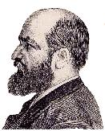
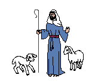

<TABLE BORDER="0" WIDTH="100%" CELLSPACING="0" CELLPADDING="0"> <COLGROUP><COL WIDTH="45%"><COL WIDTH="10%"><COL WIDTH="45%"></COLGROUP>  
<TR>   <TD><I>Glosa      </I></TD>   <TD>   </TD>   <TD><I>Español     </I></TD> </TR>   
<TR><TD>     </TD><TD></TD><TD></TD></TR>   
<TR>   <TD><H1>Glosa-Español paraleli textu </H1>      </TD>   <TD>   </TD>   <TD><H1>Glosa-Español, texto en paralelo</H1>      </TD> </TR> 
<TR><TD>     </TD><TD></TD><TD></TD></TR>  <!-- ************************************************************ -->  
</TABLE>

<TABLE BORDER="0" WIDTH="100%" CELLSPACING="0" CELLPADDING="0"> <COLGROUP><COL WIDTH="45%"><COL WIDTH="10%"><COL WIDTH="45%"></COLGROUP>
<TR>   <TD><H2>Indexi</H2></TD>   <TD>   </TD>   <TD><H2>Índice</H2></TD> </TR> 
<TR><TD>  </TD><TD></TD><TD></TD></TR> 
<TR>   <TD>     <A HREF="estextu.htm#igor">De Glosa</A>     </TD>   <TD>   </TD>   <TD>     <A HREF="estextu.htm#igor">Del Glosa</A>     </TD> </TR> 
<TR>   <TD>     <A HREF="estextu.htm#sombrero">U kefa-ve ko tri akro</A>     </TD>   <TD>   </TD>   <TD>     <A HREF="estextu.htm#sombrero">El sombrero de tres picos</A>     </TD> </TR> 
<TR>   <TD>     <A HREF="estextu.htm#psalmus">Psalmus 23</A>     </TD>   <TD>   </TD>   <TD>     <A HREF="estextu.htm#psalmus">Salmo 23</A></TD> </TR> 
<TR>   <TD>     <A HREF="estextu.htm#logika">U Logika</A>     </TD>   <TD>   </TD>   <TD>     <A HREF="estextu.htm#logika">La razón</A></TD> </TR> 
<TR><TD>     </TD><TD></TD><TD></TD></TR>  <!-- ************************************************************ -->    
</TABLE>

<TABLE BORDER="0" WIDTH="100%" CELLSPACING="0" CELLPADDING="0"> <COLGROUP><COL WIDTH="45%"><COL WIDTH="10%"><COL WIDTH="45%"></COLGROUP>
<TR>   <TD><H2>De Glosa</H2></TD>   <TD>   </TD>   <TD><H2>Del Glosa</H2></TD> </TR> 
<TR><TD>  </TD><TD></TD><TD></TD></TR>  
<TR>   <TD><I>(Ge-bali ad Glosalist ex Igor Wasilewski, 2004.     Ge-translati ad-in Glosa ex Mario Montijo.) </I></TD>   <TD>   </TD>   <TD><I>(Original de Igor Wasilewski, 2004, enviado      al grupo "Glosalista"; traducción de Mario Montijo)     </I></TD>  </TR> 
<TR><TD>  </TD><TD></TD><TD></TD></TR> 
<TR>   <TD><B>Glosa      es u fo idio lingua intra u grega de ge-face lingua.  Tem pleisto     mu habe un aglutina alo inflekti morfo, Glosa habe kompleti     "isola" morfo.  Id es klu interese, qo-ka panto IAL-krea-pe pa     more krea un aglutina alo inflekti morfo, sed proxi zero-tem un     "isola" morfo. Plu solo excepti es Glosa        <!-- original text: "..., Lingua Franca Nova e oligo hetero       projekti homo Sona alo Sasxsek." has been changed by Igor to:       -->      e oligo hetero projekti. </B></TD>   <TD>   </TD>   <TD>Glosa      es un lenguaje muy específico entre el universo de     lenguajes planificados.  Mientras que la mayoría de estos     lenguajes tienen estructuras aglutinantes o de inflexiónes,     Glosa tiene una estructura completamente "aislante".  Es incluso     interesante el por qué todos los creadores de lenguajes     artificiales acostumbran hacerlos con estructuras aglutinantes o     de inflexiones. Únicas excepciones son Glosa       <!-- original text: "..., Lingua Franca Nova y alguos otros       proyectos como Sona o sasxsek." has been changed by Igor to: -->     y algunos otros proyectos. </TD> </TR> 
<TR><TD>  </TD><TD></TD><TD></TD></TR> 
<TR>   <TD><B>Glosa,      homo u Zhung Kuo-lingua alo Viet Nam-lingua es ge-face     de plu verba; qi monstra plu idea.  Singu verba in Glosa monstra     ge-lisi idea minus ali precise de qe id es u nima-verba,     akti-verba, deskribe-verba alo adverba.  Nu u buta es; loka plu-ci     verba ko kura in u frase te forma u logika e klari expresi.     </B></TD>    <TD>   </TD>   <TD>Glosa,      como el chino o el vietnamese están hechos de palabras que      muestran ideas. Cada palabra en Glosa muestra una idea aislada sin     precisar si es un sustantivo, verbo, adjetivo o adverbio.  La     cuestión está en ubicar las palabras con cuidado en     el enunciado para formar una expresión lógica y     clara. </TD> </TR> 
<TR><TD>  </TD><TD></TD><TD></TD></TR> 
<TR><TD><B>Mi    doxo; u sucede pende ex u mode; tu loka plu verba in u frase. Homo   exempla, si na dice:    "Mi auxi..."   id pote habe signifi "I help..." alo "My help...".    Te logi id ko korekti, na nece vide; per qo mode plu verba es   ge-loka simul.    Si na dice:   "Mi auxi es boni" - id es toto klari; na volu dice "My help is   good".    Si na volu dice "I help them", id es boni de loka plu verba so:    "Mi dona auxi a mu". "Dona auxi" es u boni mode te expresi un idea.     Mi pa nota; oligo Glosa-dice-pe hedo uti u-ci struktura; ko-co mi   doxo; id es u fo boni idea. </B></TD> <TD>   </TD>   <TD>El    éxito depende del modo en que se ubiquen las palabras en el   enunciado. como ejemplo, si se dice:    -<I>Mi auxi...</I>-   -Puede tener el significado de -Yo ayudo...- o -Mi ayuda...-    -Para comprender esto con correción es necesario ver de que   modo las palabras son ubicadas en su conjunto.    Si se quiere decir:   "<I>Mi auxi es boni</I>" - es totalmente claro que se quiere decir     -Mi ayuda es buena-.    Si se quiere decir -Yo los ayudo-, es bueno colocar las palabras   asi:    -<I>Mi "dona" auxi a mu.</I>- -<I>"Dona" auxi</I>- es una buena   manera de expresar una idea.    Es notable que algunos glosistas gustan utilizar esta estructura la   cual es una buena idea.    </TD></TR> 
<TR><TD>  </TD><TD></TD><TD></TD></TR> 
<TR><TD><B>Oligo    hetero exempla: </B></TD> <TD>   </TD>   <TD>Algunos    otros ejemplos:   </TD></TR> 
<TR><TD><B>      "dice u petitio" - to ask for something </B></TD> <TD>   </TD>   <TD>      -<I>"dice" u petitio</I>- -hacer una petición   </TD></TR> 
<TR><TD><B>      "dice u qestio" - to ask about something </B></TD> <TD>   </TD>   <TD>      -<I>"dice" u qestio</I>-  -expresar un questionamiento   </TD></TR> 
<TR><TD><B>      "akti adi" - to add </B></TD> <TD>   </TD>   <TD>      -<I>"akti" adi</I>- -hacer una inclusión   </TD></TR> 
<TR><TD><B>vice    "petitio", "qestio" alo "adi"; qi sio pote es plus   nima-verba. </B></TD>  <TD>   </TD>   <TD>-en    vez de <I>petitio</I> (pedir), <I>qestio</I> (cuestionar) o   <I>adi</I> (incluir), que pueden ser también nombres   (petición, cuestión, inclusión).     </TD></TR> 
<TR><TD>  </TD><TD></TD></TR> 
<TR><TD><B>Glosa    es u facili lingua, anti-co mi doxo; id es veri importa de stru u   frase ko kura te      evita <!-- original was "vita", certainly typing error -->    plu ambi-sensi.  Si na volu; un audi-pe alo   lekto-pe logi id ko korekti, u dice-pe alo      grafo-pe <!-- original was "rafo-pe", certainly typing error -->    nece memo de u korekti e klari verba-taxo. </B> </TD><TD>   </TD> <TD>Glosa es un lenguaje fácil, sin embrago, es   importante estructurar los enunciados con cuidado para evitar   ambigüedades.    Si se quiere que un oyente o un lector comprenda con   correción, el hablante o el que escribe debe recordar el   órden correcto y claro de las palabras.   </TD></TR> </TABLE>       <!-- ************************************************************ -->   
   P. A. de Alarcón 
    <TABLE BORDER="0" WIDTH="100%" CELLSPACING="0" CELLPADDING="0"> <COLGROUP><COL WIDTH="45%"><COL WIDTH="10%"><COL WIDTH="45%"></COLGROUP> 
</TABLE>

<TABLE BORDER="0" WIDTH="100%" CELLSPACING="0" CELLPADDING="0"> <COLGROUP><COL WIDTH="45%"><COL WIDTH="10%"><COL WIDTH="45%"></COLGROUP>
<TR><TD><H2>U    kefa-ve ko tri akro </H2>    </TD><TD>   </TD> <TD><H2>El    sombrero de tres picos</H2>   </TD></TR> 
<TR><TD>  </TD><TD></TD></TR>  
<TR><TD><I>(Kapitula 28    de "El sombrero de tres picos" ex Pedro Antonio de Alarcón,   1874.    Ex bibli "Español Glosa 1000" ex Richard Burrows, Wendy   Ashby e Ron Clark, © GEO, Richmond UK 1992, pagina 14) </I>   </TD><TD>   </TD> <TD><I>(Cápitulo 28 de "El Sombrero de tres   Picos", de Pedro Antonio de Alarcón, 1874.  Del libro   "Español Glosa 1000" de Richard Burrows, Wendy Ashby y   Ron Clark, © GEO, Richmond UK 1992, página 14)   </I>   </TD></TR> 
<TR><TD>  </TD><TD></TD></TR>  <!-- The original text could be read at   http://aix1.uottawa.ca/~jmruano/sombrero5.html -->  
<TR><TD><B>Ave    Maria Purisima!  Mo bi e semi horo, e u qietu noktu!"  </B></TD><TD>   </TD>   <TD>¡Ave    María Purísima!  ¡Las doce y media y sereno!   </TD></TR> 
<TR><TD>  </TD><TD></TD></TR> 
<TR><TD><B>U    noktu-guarda; qi pa nece voci u-ci dia plu via de urba; pa du akti   u-ci, kron u gina de mila-pe e u Korregidor, epi asini de mila-pe,   Senor Juan Lopez epi auto mula, e bi gresi polica-an, veni a porta   de Korregidora domi.   </B></TD><TD>   </TD>   <TD>Así    gritaba por las calles de la cuidad quien tenía   facultades para tanto, cuando la      Molinera <!-- Glosa book: molinera -->    y el Corregidor, cada cual en una de las burras del molino, el      señor <!-- Glosa book: Sr. -->    Juan López en      su <!-- Glosa book: mu -->    mula, y los dos alguaciles andando, llegaron a la puerta del   Corregimiento.     </TD></TR> 
<TR><TD>  </TD><TD></TD></TR> 
<TR><TD><B>U    porta pa es ge-klude.  </B></TD><TD>   </TD>   <TD>La    puerta estaba cerrada.     </TD></TR> 
<TR><TD>  </TD><TD></TD></TR> 
<TR><TD><B>Id    pa feno komo si panto-ra es ge-fini pro di, pro krati e pro demo.     </B></TD><TD>   </TD>   <TD>Dijérase    que para el Gobierno, lo mismo que para los gobernandos,   había concluido todo por aquel día.     </TD></TR> 
<TR><TD>  </TD><TD></TD></TR> 
<TR><TD><B>"U-ci    es mali" puta Garduna.   </B></TD><TD>   </TD>   <TD>-¡Malo!-      <!-- Glosa book without "-"s -->    pensó Garduña.     </TD></TR> 
<TR><TD>  </TD><TD></TD></TR> 
<TR><TD><B>E    an pa tipo u porta bi alo tri kron.   </B></TD><TD>   </TD>   <TD>Y    llamó con aldabón dos o tres veces.     </TD></TR> 
<TR><TD>  </TD><TD></TD></TR> 
<TR><TD><B>Pa    es u longi pausa, sed nuli-pe pa aperi u porta alo reakti a tipo.   </B></TD><TD>   </TD>   <TD>Pasó    mucho tiempo, y ni abrieron ni contestaron.     </TD></TR> 
<TR><TD>  </TD><TD></TD></TR> 
<TR><TD><B>Sena   Frasquita pa esce fo palida.   </B></TD><TD>   </TD>   <TD>La      señá <!-- Glosa book Señá -->    Frasquita estaba más amarilla que la cera.     </TD></TR> 
<TR><TD>  </TD><TD></TD></TR> 
<TR><TD><B>U    Koregidora pa morda panto digi ungu kausa an emotio.   </B></TD><TD>   </TD>   <TD>El    Corregidor se había comido ya todas las uñas de ambas    manos.    </TD></TR> 
<TR><TD>  </TD><TD></TD></TR> 
<TR><TD><B>Nuli-pe    pa dice mo verba.   </B></TD><TD>   </TD>   <TD>Nadie    decía una palabra.    </TD></TR> 
<TR><TD>  </TD><TD></TD></TR> 
<TR><TD><B>Pum!    Pum! Pum!  Bi-la polica-an e Senor Juan Lopez tipo itera epi   Koregidora porta.  Nuli-ra pa acide.  Nuli-pe pa reakti.  U      porta <!-- original text says "puerta", obviously typing error -->    pa resta ge-klude.  Ne klu u muska pa kine.     U solo soni pa es u-la de kade aqa in fonta in korta intra domi.     </B></TD><TD>   </TD>   <TD>¡Pum!...       ¡Pum!... ¡Pum!...;      <!-- Glosa book without "..."s and ";" -->    golpes y más golpes a la puerta del Corregimiento      (aplicados <!-- Glosa book "," instead of "(" -->    sucesivamente por los dos alguaciles y por el      señor <!-- Glosa book "Sr." -->    Juan      López)...  <!-- Glosa book without "..." -->    ¡Y nada!  ¡No respondía nadie!  ¡No   abrían!  ¡No se movía una mosca!       ¡Solo <!-- Glosa book "Sólo" without ¡ -->    se oía el claro rumor de los caños de una fuente que   había en el patio de la casa.    </TD></TR> 
<TR><TD>  </TD><TD></TD></TR> 
<TR><TD><B>Plu   minuta pasa, pa feno komo fo-longi tem.    </B></TD><TD>   </TD>   <TD>Y    de esta manera transcurrían minutos, largos como eternidades.    </TD></TR> 
<TR><TD>  </TD><TD></TD></TR> 
<TR><TD><B>A    fini, cirka mo horo, u mikro fenestra epi pedi-lo bi aperi, e u gina   voka dice:    </B></TD><TD>   </TD>   <TD>Al    fin, cerca de la una, abrióse un ventanillo del piso segundo,   y dijo una voz      femenina: <!-- Glosa book without ":" -->    </TD></TR> 
<TR><TD>  </TD><TD></TD></TR> 
<TR><TD><B>"Id    es qo-pe?"    </B></TD><TD>   </TD>   <TD>-¿Quién?      <!-- Glosa book without "-" -->    </TD></TR> 
<TR><TD>  </TD><TD></TD></TR> 
<TR><TD><B>"U-la    es kura-fe de plu infanti" murmuro Garduna.    </B></TD><TD>   </TD>   <TD>-Es    la voz del ama de      leche...- <!-- Glosa book without "..." -->    murmuró Garduña.    </TD></TR> 
<TR><TD>  </TD><TD></TD></TR> 
<TR><TD><B>"Id    es mi!" responde Don Eugenio de Zuniga.  "Aperi u porta!"   </B></TD><TD>   </TD>   <TD>-¡Yo!-      <!-- Glosa book without first "-" -->    respondió      don <!-- glosa book: D. -->    Eugenio de      Zúñiga-. <!-- Glosa book: Zúniga-. -->    ¡Abrid!    </TD></TR> 
<TR><TD>  </TD><TD></TD></TR> 
<TR><TD><B>Pa    es u brevi pausa.    </B></TD><TD>   </TD>   <TD>Pasó    un instante en silencio.    </TD></TR> 
<TR><TD>  </TD><TD></TD></TR> 
<TR><TD><B>"E    tu es qo-pe?" repli u kura-fe.    </B></TD><TD>   </TD>   <TD>-¿Y      <!-- Glosa book without "-" -->    quién es      usted?- <!-- Glosa book: Vd? -->      replicó <!-- Glosa book: replico -->    luego la nodriza.    </TD></TR> 
<TR><TD>  </TD><TD></TD></TR> 
<TR><TD><B>"Qe,    tu ne pote audi mi?  Mi es u maestro de domi, u Koregidora!"    Pa es u plus pausa.    </B></TD><TD>   </TD>   <TD>-¿Pues      <!-- Glosa book without "-" -->    no me está      usted <!-- Glosa book Vd -->    oyendo?  ¡Soy el      amo!... <!-- Glosa book without "..." -->    ¡El      Corregidor!... <!-- Glosa book without "..." -->    Hubo otra pausa.    </TD></TR> 
<TR><TD>  </TD><TD></TD></TR> 
<TR><TD><B>"Ki    ab, e boni noktu a tu!" repli u boni gina.  "Mi maestro pa veni in   domi mo horo retro; e pa ki imedia a kli.  Tu plus kli se; e sopo ab   vina, tu es ple de!"    </B></TD><TD>   </TD>   <TD>-¡Vaya      usted <!-- Glosa book: Vd -->    mucho con Dios!- repuso la buena mujer. -Mi amo vino hace una hora,   y se acostó en seguida.  ¡Acuéstense      ustedes <!-- Glosa book: Vds -->    también, y duerman el vino que tendrán en el cuerpo!    </TD></TR> 
<TR><TD>  </TD><TD></TD></TR> 
<TR><TD><B>E    fe pa klude viole u fenestra.    </B></TD><TD>   </TD>   <TD>Y    la ventana se cerró de golpe.    </TD></TR> 
<TR><TD>  </TD><TD></TD></TR>   
<TR><TD>   <I>[Ci    u textu in Glosa bibli habe fini.]    </I></TD><TD>   </TD>   <TD><I>   [Aqui termina el texto del   libro en Glosa.]</I>    </TD></TR> 
<TR><TD>  </TD><TD></TD></TR>   
<TR><TD><B>    </B></TD><TD>   </TD>   <TD>La    señá Frasquita se cubrió el rostro con las   manos.    </TD></TR> 
<TR><TD>  </TD><TD></TD></TR> 
<TR><TD><B>    </B></TD><TD>   </TD>   <TD>-¡Ama!-    tronó el Corregidor, fuera de sí. -¿No oye   usted que le digo que abra la puerta? ¿No oye usted que soy   yo? ¿Quiere usted que la ahorque también?    </TD></TR> 
<TR><TD>  </TD><TD></TD></TR> 
<TR><TD><B>    </B></TD><TD>   </TD>   <TD>La    ventana volvió a abrirse.   </TD></TR> 
<TR><TD>  </TD><TD></TD></TR> 
<TR><TD><B>    </B></TD><TD>   </TD>   <TD>-Pero    vamos a ver...- expuso el ama. -¿Quién es usted para   dar esos gritos?    </TD></TR> 
<TR><TD>  </TD><TD></TD></TR> 
<TR><TD><B>    </B></TD><TD>   </TD>   <TD>-¡Soy    el Corregidor!   </TD></TR> 
<TR><TD>  </TD><TD></TD></TR> 
<TR><TD><B>    </B></TD><TD>   </TD>   <TD>-¡Dale,    bola! ¿No le digo a usted que el señor Corregidor vino   antes de las doce..., y que yo lo vi con mis propios ojos encerrarse   en las habitaciones de la Señora? ¿Se quiere usted   divertir conmigo?  ¡Pues espere usted... y verá lo que   le pasa!    </TD></TR> 
<TR><TD>  </TD><TD></TD></TR> 
<TR><TD><B>    </B></TD><TD>   </TD>   <TD>Al    mismo tiempo se abrió repentinamente la puerta y una nube de   criados y ministriles, provistos de sendos garrotes, se lanzó   sobre los de afuera, exclamando furiosamente:    </TD></TR> 
<TR><TD>  </TD><TD></TD></TR> 
<TR><TD><B>    </B></TD><TD>   </TD>   <TD>-¡A    ver! ¿Dónde está ese que dice que es el   Corregidor? ¿Dónde está ese chusco?   ¿Dónde está ese borracho?    </TD></TR> 
<TR><TD>  </TD><TD></TD></TR> 
<TR><TD><B>    </B></TD><TD>   </TD>   <TD>Y    se armo un lío de todos los demonios en medio de la   oscuridad, sin que nadie pudiera entenderse, y no dejando de recibir   algunos palos el Corregidor, Garduña, el señor Juan   López y Toñuelo.    </TD></TR> 
<TR><TD>  </TD><TD></TD></TR> 
<TR><TD><B>    </B></TD><TD>   </TD>   <TD>Era    la segunda paliza que le costaba a don Eugenio su aventura de   aquella noche, ademas del remojón que se dio en el caz del   molino.    </TD></TR> 
<TR><TD>  </TD><TD></TD></TR> 
<TR><TD><B>    </B></TD><TD>   </TD>   <TD>La    señá Frasquita, apartada de aquel laberinto, lloraba   por la primera vez de su vida...    </TD></TR> 
<TR><TD>  </TD><TD></TD></TR> 
<TR><TD><B>    </B></TD><TD>   </TD>   <TD>-¡Lucas!    ¡Lucas!- decía. -¡Y has podido dudar de mí!   ¡Y has podido estrechar en tus brazos a otra! ¡Ah!   ¡Nuestra desventura no tiene ya remedio!    </TD></TR> </TABLE>       <!-- ************************************************************ -->    
    
  <TABLE BORDER="0" WIDTH="100%" CELLSPACING="0" CELLPADDING="0"> <COLGROUP><COL WIDTH="45%"><COL WIDTH="10%"><COL WIDTH="45%"></COLGROUP> 
</TABLE>

<TABLE BORDER="0" WIDTH="100%" CELLSPACING="0" CELLPADDING="0"> <COLGROUP><COL WIDTH="45%"><COL WIDTH="10%"><COL WIDTH="45%"></COLGROUP>
<TR><TD><H2>Psalmus 23 </H2>    </TD><TD>   </TD> <TD><H2>Salmo 23 </H2>   </TD></TR> 
<TR><TD>  </TD><TD></TD></TR>  
<TR><TD><I>(Ex    bibli "Español Glosa 1000" ex Richard Burrows, Wendy   Ashby e Ron Clark, Richmond UK © 1992, pagina 15.) </I>   </TD><TD>   </TD> <TD><I>(Del libro "Español Glosa 1000" de   Richard Burrows, Wendy Ashby y Ron Clark, Richmond UK © 1992,   página 15.) </I>   </TD></TR> 
<TR><TD>  </TD><TD></TD></TR>  
<TR><TD><B>U    Teo es mi pastora.  Mi ne fu fam.    </B></TD><TD>   </TD>   <TD>Jehová    es mi pastor; nada me faltará.    </TD></TR> 
<TR><TD><B>An    don a mi u kli in kloro agri.    </B></TD><TD>   </TD>   <TD>En    lugares de delicados pastos me hará descansar;    </TD></TR> 
<TR><TD><B>An    duce mi para plu paci aqa;    </B></TD><TD>   </TD>   <TD>Junot    a aguas de reposo me pastoreará;    </TD></TR> 
<TR><TD><B>An    fresko mi spiritu.    </B></TD><TD>   </TD>   <TD>Confortará    mi alma;    </TD></TR> 
<TR><TD><B>An    duce mi in plu via de veri, pro an nima.    </B></TD><TD>   </TD>   <TD>Me    guiará por sendas de justicia por amor de su nombre.    </TD></TR> 
<TR><TD><B>Klu    kron mi gresi dia vali de umbra de morta.     </B></TD><TD>   </TD>   <TD>Aunque    ande en valle de sombra de muerte,    </TD></TR> 
<TR><TD><B> Mi    fobo nuli kako; ka tu es ko mi.    </B></TD><TD>   </TD>   <TD>No    temeré mal alguno, porque tu estarás conmigo;    </TD></TR> 
<TR><TD><B>Tu    baci e Tu ovi-ru konsola mi.    </B></TD><TD>   </TD>   <TD>Tu    vara y tu cayado me infundirán aliento.    </TD></TR> 
<TR><TD><B>Tu    prepar u tabla pro mi kontra mi plu anti-pe.    </B></TD><TD>   </TD>   <TD>Aderezas mesa delante de mí en presencia de   mis angustiadores;    </TD></TR> 
<TR><TD><B>Tu    flu olea epi mi kefa; mi kalici supra flu.    </B></TD><TD>   </TD>   <TD>Unges    mi cabeza con aceite; mi copa está rebosando.    </TD></TR> 
<TR><TD><B>Sura,    agata e pardo fu seqe mi panto di de vita;    </B></TD><TD>   </TD>   <TD>Ciertamente    el bien y la misericordia me seguirán todos los días   de mi vida,    </TD></TR> 
<TR><TD><B>E    mi fu eko in domi de Teo holo tem.    </B></TD><TD>   </TD>   <TD>Y    en la casa de Jehová moraré por largos días.   
<TR><TD>  </TD><TD></TD></TR> </TABLE>      <!-- ************************************************************ -->    
    
  <TABLE BORDER="0" WIDTH="100%" CELLSPACING="0" CELLPADDING="0"> <COLGROUP><COL WIDTH="45%"><COL WIDTH="10%"><COL WIDTH="45%"></COLGROUP> 
</TABLE>

<TABLE BORDER="0" WIDTH="100%" CELLSPACING="0" CELLPADDING="0"> <COLGROUP><COL WIDTH="45%"><COL WIDTH="10%"><COL WIDTH="45%"></COLGROUP>
<TR><TD><H2>U Logika</H2>    </TD><TD>   </TD> <TD><H2>La razón </H2>   </TD></TR> 
<TR><TD>  </TD><TD></TD></TR>  
<TR>   <TD><I>(Ex plu ge-medita-ra de Tao-filosofi.  Ge-bali     ad Glosalist 2004.  Glosa translati ex Mario Montijo.) </I></TD>   <TD>   </TD>   <TD><I>(De "meditaciones taoistas". Enviado      al grupo "Glosalista" 2004; traducción de Mario Montijo)     </I></TD>  </TR> 
<TR><TD>  </TD><TD></TD></TR>  <!--    Fonta de Espanol textu pa es      http://www.geocities.com/rociocatte/index/meditaciones_taoistas.htm -->   
<TR>   <TD><B>U      paleo sofi-pe pa ambula       <!-- Wendy pa adi ";" ci, sed mi puta, id habe ero. -->       ko tri        de <!-- Mario pa grafo: "ex" -->      an stude-pe        in un <!-- Mario pa grafo "epi u" -->      horti        de <!-- Mario pa grafo "ex" -->      an viki.</B></TD>   <TD>   </TD>   <TD>Un      anciano sabio se paseaba con tres de sus discípulos en el     jardín de su pueblo.      </TD>  </TR>  
<TR><TD>  </TD><TD></TD></TR> 
<TR>   <TD><B>Du      vide u        vermi; <!-- Mario ne pa grafo ";" -->      qi pa vora u vegeta, mo ex        plu <!-- Mario pa grafo "u" -->      stude-pe pa cide id        per <!-- Mario pa grafo "ko" -->      an pedi. </B></TD>   <TD>   </TD>   <TD>Viendo      un limaco que devora una lechuga el primer discípulo lo     aplasta con el pie. </TD>  </TR>  
<TR><TD>  </TD><TD></TD></TR> 
<TR>   <TD><B>U      persona bi dice po-co; "sko-pe, qe ne es        un <!-- Mario pa grafo "u" -->      mali-akti de cide u-ci vive-ra?" </B></TD>    <TD>   </TD>   <TD>El      segundo dice entonces: -Maestro, ¿no es pecado aplastar     esta criatura? </TD>  </TR>  
<TR><TD>  </TD><TD></TD></TR> 
<TR>   <TD><B>U      sko-pe reakti: "Tu habe logika, veri id es." - </B></TD>   <TD>   </TD>   <TD>El      maestro le responde: -Tienes razón, así es. </TD>  </TR>  
<TR><TD>  </TD><TD></TD></TR> 
<TR>   <TD><B>"Sed      id pa vora na sito", dice u        stude-pe mo, <!-- Mario pa grafo "mo stude-pe," -->      "qe mi ne pa        akti <!-- Mario pa grafo "face" -->      bene?" </B></TD>    <TD>   </TD>   <TD>-Pero      el comía nuestro alimento, ¿no he hecho bien? </TD>  </TR>  
<TR><TD>  </TD><TD></TD></TR> 
<TR>   <TD><B>U      sko-pe reakti: "Tu habe logika." -</B></TD>   <TD>   </TD>   <TD>El      maestro le responde: -Tienes razón. </TD>  </TR>  
<TR><TD>  </TD><TD></TD></TR> 
<TR>   <TD><B>U        stude-pe tri <!-- Mario pa grafo "tri stude-pe" -->      dice: "ambi dice kontra-ra;        ambi ne pote <!-- Mario pa grafo "ne u bi pote" -->      habe logika!" </B></TD>    <TD>   </TD>   <TD>El      tercero dice: -Ambos dicen cosas contradictorias, no pueden los     dos tener la razón. </TD>  </TR>  
<TR><TD>  </TD><TD></TD></TR> 
<TR>   <TD><B>E      u sko-pe reakti: "Tu habe logika." </B></TD>   <TD>   </TD>   <TD>Y      el maestro le responde: -Tienes razón. </TD>  </TR>  
<TR><TD>  </TD><TD></TD></TR>  </TABLE>
