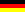

   Glosa, brevi info   a.leiste {text-decoration:none} a.leiste:hover {background-color:#33ff33}   

[![[Glosa-logo]](../pic/logo0707.png)](../index.html)

 

Brevi info in plu hetero lingua 

 [ Cefa-pagina in Glosa](../gl/index.html) 

 [ Mainpage in English](../en/index.html) 

 [ Hauptseite auf Deutsch](../dt/index.html)  

 

 

  

# Glosa, – brevi info

  
[Castellano (Español)](espanjol.htm) (Spanish)  
[English](english.htm)  
[Français](francais.htm) (French)  
[Italiano](italiano.htm) (Italian)  
[Magyar](magyar.htm) (Hungarian)  
[Nederlands](nederlands.htm) (Dutch)  
[Ruski](ruski.htm) (Russian)  
  
Retro a [proto](../index.html).  
  

* * *

Marcel Springer, [www.glosa.org](../index.html), ultima ge-muta 2008-01-01.
