*Русская версия*

> Некоторые части еще не переведены на русский.
> Этот файл - сокарщенная версия киниги "18 Steps to Fluency in Euro-Glosa, 1992, GEO".
> Включены все примеры и правила, но полностью приведены только шаги 1—3, 5, 9, 13, 16—18.
> Доступна [немецкая версия](../dt/g18s.htm)

<SMALL><I> - обложка - </I></SMALL>
 

<TABLE BGCOLOR="Yellow" WIDTH="80%" BORDER=0>
<TR>
<TD ALIGN=CENTER>
 
 
18 ШАГОВ  
к БЕГЛОСТИ в  
 
<B> ЕВРО-ГЛОСА </B>  
 
 МЕЖЪЯЗЫК  
ДЛЯ ЕВРОПЫ И МИРА   
 
ЛЕГКО УЧИТСЯ ЗА НЕСКОЛЬКО ДНЕЙ   
СЛОВАРЬ ИЗ 1000 ГРЕЧЕСКИХ И ЛАТИНСКИХ КОРНЕЙ   
ОБЩИХ ДЛЯ ВСЕХ ЕВРОПЕЙСКИХ ЯЗЫКОВ   
ВКЛЮЧАЯ РУССКИЙ   
И ОГРОМНЫЙ НАУЧНЫЙ СЛОВАРЬ.   
ФОНЕТИЧЕСКАЯ ОРФОГРАФИЯ.   
НЕТ НЕЛОГИЧНОЙ СКУЧОЙ ГРАММАТИКИ.   
ШИРОКО РАСШИРЯЕМЫЙ   
ЧТОБЫ ПОДХОДИТЬ ДЛЯ НАУЧНОГО ИСПОЛЬЗОВАНИЯ.   
КАЖДОЕ СЛОВО В ГЛОСЕ ИСПОЛЬЗУЕТСЯ ДЛЯ ВЫРАЖЕНИЯ ТОЛЬКО ОДНОЙ КОНЦЕПЦИИ.   
GLOSA 1000 ЛЕГКО ОХВАТЫВЫЕТ ВСЕ ПРЕДМЕТЫ   
НАУКУ, ТЕХНИКУ, КОММЕРЦИЮ И ЛИТЕРАТУРУ.   
ПОМОГАЕТ ИЗУЧАТЬ ЯЗЫКИ ЕВРОПЫ.   
ИДЕАЛЕН ДЛЯ ОБРАЗОВАНИЯ ИНТЕЛЛИГЕНТНОГО ТУРИЗМА И   
КОМПЬЮТЕРЗАЦИИ.   
 
 
</TD>
</TR>
</TABLE>

 
 

<!-- ============================================================= -->

<SMALL><I> - стр. 3 - </I></SMALL>

<H2> Содержание </H2> 

<I>[Примичание: многие из списков слов и иллюстраций перечисленных в содержании не содержатся в HTML-версии.]</I>

<TABLE BORDER="0" CELLSPACING="0" CELLPADDING="0">
<COLGROUP><COL><COL><COL></COLGROUP>
<TR>
  <TD> &nbsp; </TD>
  <TD> The <A HREF="ru18s.htm#S01">Глобальный язык</A> для глобального мира </TD> 
  <TD ALIGN="RIGHT"> &nbsp;...&nbsp; стр.&nbsp;&nbsp;4</TD>
</TR>
<TR>
  <TD> &nbsp; </TD>
  <TD> <A HREF="ru18s.htm#S02">Произношение, Алфавит, Пунктуация</A>  </TD> 
  <TD ALIGN="RIGHT"> &nbsp;...&nbsp; стр.&nbsp;&nbsp;5  </TD>
</TR>
<TR>
  <TD><A HREF="ru18s.htm#S1">Шаг &nbsp;1</A>: &nbsp;&nbsp;&nbsp; </TD>
  <TD>"Артикль"; Настоящее и прошедшее время; </TD>
  <TD ALIGN="RIGHT"> &nbsp;...&nbsp; стр.&nbsp;&nbsp;6</TD>
</TR>
<TR>
  <TD> &nbsp; </TD>
  <TD> числительные, -co, кроссворд. </TD>
  <TD ALIGN="RIGHT"> &nbsp;...&nbsp; стр.&nbsp;&nbsp;7</TD>
</TR>
<TR>
  <TD><A HREF="ru18s.htm#S2">Шаг &nbsp;2</A>:</TD>
  <TD> бы, если </TD>
  <TD ALIGN="RIGHT"> &nbsp;...&nbsp; стр.&nbsp;&nbsp;9</TD>
</TR>
<TR>
  <TD> &nbsp; </TD>
  <TD> профессии, цвета, места (слова и рисунок) </TD>
  <TD> &nbsp;...&nbsp; стр.&nbsp;10</TD>
</TR>
<TR>
  <TD><A HREF="ru18s.htm#S3">Шаг &nbsp;3</A>:</TD>
  <TD> не, отрицание.  Магазины.  Живые вещи. Строения.</TD>
  <TD> &nbsp;...&nbsp; стр.&nbsp;12</TD>
</TR>
<TR>
  <TD><A HREF="ru18s.htm#S4">Шаг &nbsp;4</A>:</TD>
  <TD> Создание вопросов; </TD>
  <TD> &nbsp;...&nbsp; стр.&nbsp;15</TD>
</TR>
<TR>
  <TD> &nbsp; </TD>
  <TD> Части тела; Кольца и вещи. Сосуды. Мебель. </TD>
  <TD> &nbsp;...&nbsp; стр.&nbsp;16</TD>
</TR>
<TR>
  <TD><A HREF="ru18s.htm#S5">Шаг &nbsp;5</A>:</TD>
  <TD> Что?  Который?  Поздравления, Устройства. </TD>
  <TD> &nbsp;...&nbsp; стр.&nbsp;18</TD>
</TR>
<TR>
  <TD><A HREF="ru18s.htm#S6">Шаг &nbsp;6</A>:</TD>
  <TD> Этот и тот. Эти и те; </TD>
  <TD> &nbsp;...&nbsp; стр.&nbsp;21</TD>
</TR>
<TR>
  <TD> &nbsp; </TD>
  <TD> Места.  Материалы.  Наборы.  Thread.  Stone; Things to eat 
  (picture page and phrases). &nbsp;&nbsp;&nbsp;
 </TD>
  <TD VALIGN="bottom"> &nbsp;...&nbsp; стр.&nbsp;22</TD>
</TR>
<TR>
  <TD><A HREF="ru18s.htm#S7">Шаг &nbsp;7</A>:</TD>
  <TD> Get. Become. Got;;  </TD>
  <TD> &nbsp;...&nbsp; стр.&nbsp;24</TD>
</TR>
<TR>
  <TD> &nbsp; </TD>
  <TD> Opposites. Get & got.  Clothes.  Cloths; </TD>
  <TD> &nbsp;...&nbsp; стр.&nbsp;25</TD>
</TR>
<TR>
  <TD> &nbsp; </TD>
  <TD> Travel (picture & phrases). </TD>
  <TD> &nbsp;...&nbsp; стр.&nbsp;26</TD>
</TR>
<TR>
  <TD><A HREF="ru18s.htm#S8">Шаг &nbsp;8</A>:</TD>
  <TD> May, perhaps, must, have to; </TD>
  <TD> &nbsp;...&nbsp; стр.&nbsp;28</TD>
</TR>
<TR>
  <TD> &nbsp; </TD>
  <TD> The house (picture & phrases). </TD>
  <TD> &nbsp;...&nbsp; стр.&nbsp;29</TD>
</TR>
<TR>
  <TD><A HREF="ru18s.htm#S9">Шаг &nbsp;9</A>:</TD>
  <TD> Time, during; </TD>
  <TD> &nbsp;...&nbsp; стр.&nbsp;31</TD>
</TR>
<TR>
  <TD> &nbsp; </TD>
  <TD> Street scene (picture & text); </TD>
  <TD> &nbsp;...&nbsp; стр.&nbsp;32</TD>
</TR>
<TR>
  <TD> &nbsp; </TD>
  <TD> Psalm 23 (parallel text). </TD>
  <TD> &nbsp;...&nbsp; стр.&nbsp;33</TD>
</TR>
<TR>
  <TD><A HREF="ru18s.htm#S10">Шаг 10</A>:</TD>
  <TD> Very, intense; </TD>
  <TD> &nbsp;...&nbsp; стр.&nbsp;34</TD>
</TR>
<TR>
  <TD> &nbsp; </TD>
  <TD> Hospital (picture & phrases). </TD>
  <TD> &nbsp;...&nbsp; стр.&nbsp;35</TD>
</TR>
<TR>
  <TD><A HREF="ru18s.htm#S11">Шаг 11</A>:</TD>
  <TD> Ought to, should; </TD>
  <TD> &nbsp;...&nbsp; стр.&nbsp;37</TD>
</TR>
<TR>
  <TD> &nbsp; </TD>
  <TD> Communications (picture & phrases). </TD>
  <TD> &nbsp;...&nbsp; стр.&nbsp;38</TD>
</TR>
<TR>
  <TD><A HREF="ru18s.htm#S12">Шаг 12</A>:</TD>
  <TD> More than, less than, as big as; </TD>
  <TD> &nbsp;...&nbsp; стр.&nbsp;40</TD>
</TR>
<TR>
  <TD> &nbsp; </TD>
  <TD> Tools (picture & phrases). </TD>
  <TD> &nbsp;...&nbsp; стр.&nbsp;41</TD>
</TR>
<TR>
  <TD><A HREF="ru18s.htm#S13">Шаг 13</A>:</TD>
  <TD> Oneself. One's own; </TD>
  <TD> &nbsp;...&nbsp; стр.&nbsp;43</TD>
</TR>
<TR>
  <TD> &nbsp; </TD>
  <TD> Post Office (picture & phrases). </TD>
  <TD> &nbsp;...&nbsp; стр.&nbsp;44</TD>
</TR>
<TR>
  <TD><A HREF="ru18s.htm#S14">Шаг 14</A>:</TD>
  <TD> Most, -est; </TD>
  <TD> &nbsp;...&nbsp; стр.&nbsp;46</TD>
</TR>
<TR>
  <TD> &nbsp; </TD>
  <TD> Camping (picture & phrases). </TD>
  <TD> &nbsp;...&nbsp; стр.&nbsp;47</TD>
</TR>
<TR>
  <TD><A HREF="ru18s.htm#S15">Шаг 15</A>:</TD>
  <TD> ..., who.  ..., which; </TD>
  <TD> &nbsp;...&nbsp; стр.&nbsp;49</TD>
</TR>
<TR>
  <TD> &nbsp; </TD>
  <TD> Apiculture (picture & phrases). </TD>
  <TD> &nbsp;...&nbsp; стр.&nbsp;50</TD>
</TR>
<TR>
  <TD><A HREF="ru18s.htm#S16">Шаг 16</A>:</TD>
  <TD> Cause, make, switch on; </TD>
  <TD> &nbsp;...&nbsp; стр.&nbsp;52</TD>
</TR>
<TR>
  <TD> &nbsp; </TD>
  <TD> Tri Andro in Navi (parallel text). </TD>
  <TD> &nbsp;...&nbsp; стр.&nbsp;53</TD>
</TR>
<TR>
  <TD><A HREF="ru18s.htm#S17">Шаг 17</A>:</TD>
  <TD> Near Future.  Recent Past; </TD>
  <TD> &nbsp;...&nbsp; стр.&nbsp;55</TD>
</TR>
<TR>
  <TD> &nbsp; </TD>
  <TD> Shakespeare (parallel text). </TD>
  <TD> &nbsp;...&nbsp; стр.&nbsp;56</TD>
</TR>
<TR>
  <TD><A HREF="ru18s.htm#S18">Шаг 18</A>:</TD>
  <TD> Continue, -ing, still; </TD>
  <TD> &nbsp;...&nbsp; стр.&nbsp;58</TD>
</TR>
<TR>
  <TD> &nbsp; </TD>
  <TD> Some English idioms.  Mega Glosa.   </TD>
  <TD> &nbsp;...&nbsp; стр.&nbsp;59  </TD>
</TR>
<TR>
  <TD> &nbsp; </TD>
  <TD> <A HREF="ru18s.htm#Mechanics">Glosa Mechanics</A>. </TD>
  <TD> &nbsp;...&nbsp; стр.&nbsp;60</TD>
</TR>
<TR>
  <TD> &nbsp; </TD>
  <TD> Glosa&nbsp;1000&nbsp;- English Vocabulary </TD>
  <TD> &nbsp;...&nbsp; стр.&nbsp;61</TD>
</TR>
<TR>
  <TD> &nbsp; </TD>
  <TD> English&nbsp;- Glosa&nbsp;1000 Vocabulary </TD>
  <TD> &nbsp;...&nbsp; стр.&nbsp;88</TD>
</TR>
</TABLE>

  
  

 

<!-- ============================================================= -->

<SMALL><I> - стр. 4 - </I></SMALL>

<H2> Глобальный язык для глобального мира </H2> 

 Подлинный Международный Вспомогательный язык должен
 быть легок для изучения людьми, который этого хотят где-угодно.
Он не должен стать только праздничным языком для довольных жителей Запада.
 

 Он должен быть так же легок для жителя деревни Третьего Мира, как и для западного ученого и поэта.
Точно такой язык - это Глоса, которая упрощает, улучшает и экономизирует международное общение
 

 Глоса - идеальное устное дополнение к электронной Технологической Революции. 
 

 Все старые языки предстают перед изучающим со списком странно-выглядящих слов, которые должны быть тщательно выучены вместе со сложной грамматикой. 
 

 Напротив, все слова Глосы уже международно известны и используются вживую ужедневно не только в Европе,
 но и везде, куда проникла медицина и наука 
 

 Профессор Ланселот Хогбен заметил, что "Мировой научный словарный запас - это самая близкая вещь
к лексикону действительного Глобального Языка, который человечество уже достигло. Он берет свои слова из
двух мертвых языков - латыни и сейчас почти исключительно греческого" 

 Хотя Глоса имеет очень большой Mega словарь, его сердце, его центр состоит только из 1000 слов, которые могут легко быть соотнесены с любым видом
интеллигентного общения аккуратно и благозвучно. 
 

 Механика Глосы четко суммирована на одной 
  <A HREF="ru18s.htm#Mechanics">странице</A>, показывающей как 20 маленьких слов из 1000 легко работают со Временем, 
сравнением, числительными и т.д.

 

 Есть 18 уроков, каждый с упражнениями для перевода с английского на Глосу и наоборот
<I>[В этом файле, упражнения и переводы сойдинены вместе как параллельные столбцы.]</I>. 
Каждый урок содержит параллельные английские и Глосские предложения. Простые информирующие письма представленые в черудющихся уроках и полезные фразы. 
 

 Много информативных изображений <I>[Многих из них нет в этом файле]</I>. 
 

 Словари в заднем списке Glosa 1000 на английский и 2000 слов с английского на Глосу 1000<I>[Не в этом файле.]</I>. 
 

 Каждое слово в Глосе определяет только одну концепцию, почти как в тезаурусе Роджета. 
 

 Каждое слово Глосы может выступать как любая часть речи, как в китайском и фактически в английском.
Изучающий Глосу быстро обнаружит, что существует много цвета и поэтичности в греческих и латинских корнях научно-технической терминологии
и они скоро составят сеть яркий ассоциаций.
Каждое слово в Глосе - это маленькое солнце, от которого подобно лучам распространяются производные
во всех Евро-языках, включая немецкий и русский. 
 

 
 

<SMALL><I> - стр. 5 - </I></SMALL>

<H2> Вступительные примечания</H2> 

<H3> Произношение </H3> 

 Каждая буква произносится (забудьте об английском и французском произношениях)   
5 <U>глсаных</U> как в испанском, итальянском, в русской транслитерации A=А; E=Э; I=И; O=О (всегда четко, никогда как "А", иногда можно как ОУ); U=У    
<U>Дифтонги</U>.  Гласные произносятся раздельно.   
<U>Согласные</U> Как в английском, немецком, латыни, французском:   
&nbsp;&nbsp;<B>C</B> всегда как Ч в Человек.  
&nbsp;&nbsp;<B>J</B> й в Йога.  
&nbsp;&nbsp;<B>R</B> желательно раскатывать.  
&nbsp;&nbsp;<B>G</B> г в Гость, но всегда четко, никогда как в южнорусском произношении.  
&nbsp;&nbsp;<B>H</B> как английское H, южнорусское, украинское Г, как Г в Ага.  
&nbsp;&nbsp;<B>Q</B> как КВ в квакать, или (лучше) в QU английском quick.  
&nbsp;&nbsp;<B>SC</B> ш в Шаге 
  <I>(- но также можно С-Ч )</I>. 

<I>(Дополнительно, см. книгу "Glosa 6000", стр. 17:)</I>
Если греческое слово начинается на PS
<B>P</B>. 
 
<I> Analogously, <B>X</B> in the beginning of a word could be pronounced 
like <B>S</B>, but pronouncing it <B>KS</B> would be better. </I> 

<U>Accent</U>  gently on vowel before last consonant. 

<PRE>
            Glosa     pronounciation

instead    <B> vice </B>     veechay 
meat       <B> karni </B>    kahrrnee 
blue       <B> ciano </B>    cheeahnaw 
wood       <B> xilo </B>     ksilaw or zeelaw 
machine    <B> makina </B>   mahkeenah 
light      <B> lumi </B>     loomee 
question   <B> qestio </B>   kwaysteeaw <I>(ошибка в оригинале: "questio")</I> 
swing      <B> osci </B>     awshee 
white      <B> leuko </B>    layookaw 

</PRE>

<H3> Орфография </H3> 

 Орфография фанетическая.  Греческое PH замещается на F, CH на K, Y на I, TH
на T. 
 
 

<H3> Alphabet </H3> 

 The letters are named as follows
<I>(Показывает русское произношение)</I>:  
А, Бэ ( "B"), Чэ ("C"), Дэ (D), Э (E), фэ (F), Гэ (G),
Хэ (H, like English H), И (I), Е (J), Кэ (K), Лэ (L), Мэ (M), Нэ (N),
О, Пэ (P), Квэ или Куэ (Q), Рэ (R), Сэ (S), Тэ, У (U), Вэ (V),
Дипло Вэ (W,  произносится  между У и В  ), Экс (X), И Грэк (Y),
Зэта (Z). 

  

<H3> Punctuation </H3> 

Colon precedes items of a catalogue. 
<B>Fe stude: biologi, kemi.</B> 
Comma separates items from each other.   
Semi-colon separates clauses, principal and subordinate.   
A clause is a group of words containing a finite verb.   
There are plenty of examples in the book. 
 
  

<!-- ============================================================= -->

  
  

(To steps: 
<A HREF="ru18s.htm#S1">1</A>, 
<A HREF="ru18s.htm#S2">2</A>, 
<A HREF="ru18s.htm#S3">3</A>, 
<A HREF="ru18s.htm#S4">4</A>, 
<A HREF="ru18s.htm#S5">5</A>, 
<A HREF="ru18s.htm#S6">6</A>, 
<A HREF="ru18s.htm#S7">7</A>, 
<A HREF="ru18s.htm#S8">8</A>, 
<A HREF="ru18s.htm#S9">9</A>, 
<A HREF="ru18s.htm#S10">10</A>, 
<A HREF="ru18s.htm#S11">11</A>, 
<A HREF="ru18s.htm#S12">12</A>, 
<A HREF="ru18s.htm#S13">13</A>, 
<A HREF="ru18s.htm#S14">14</A>, 
<A HREF="ru18s.htm#S15">15</A>, 
<A HREF="ru18s.htm#S16">16</A>, 
<A HREF="ru18s.htm#S17">17</A>,  
<A HREF="ru18s.htm#S18">18</A>)

 

<SMALL><I> - стр. 6 - </I></SMALL>

<H2> Шаг 1 </H2>

<TABLE BORDER="0" WIDTH="100%" CELLSPACING="0" CELLPADDING="0">
<COLGROUP><COL WIDTH="45%"><COL WIDTH="55%"></COLGROUP>
<TR><TD VALIGN="top"><B> u&nbsp; </B></TD>
  <TD VALIGN="top"> Один (как любой артикль перед существительными
  в ед. ч.) </TD></TR>
<TR><TD><B> plu&nbsp; </B></TD><TD> Больше чем один </TD></TR>
<TR><TD><B> pa&nbsp; </B></TD>
  <TD> Прошедшее время (ал в сказАЛ) </TD></TR>
<TR><TD><B> fu&nbsp; </B></TD>
  <TD> (Будущее время ( я БУДУ говорить)) </TD></TR>
<TR><TD></TD><TD> </TD></TR>
<TR><TD></TD><TD> </TD></TR>

<TR><TD><B> Mi grafo poesi.&nbsp; </B></TD>
  <TD> Я пишу поэзию . </TD></TR>
<TR><TD><B> Mi sporta tenis.&nbsp; </B></TD>
  <TD> Я играю в теннис. </TD></TR>
<TR><TD><B> Mi amo skope televisio.&nbsp; </B></TD>
  <TD> Я люблю смотреть телевидение. </TD></TR>
<TR><TD><B> Mi amo visita u teatra&nbsp; </B></TD>
  <TD> Я люблю ходить в театр. </TD></TR>
<TR><TD><B> Mi amo lekto.&nbsp; </B></TD>
  <TD> Я люблю читать. </TD></TR>
<TR><TD><B> Mi lekto e grafo.&nbsp; </B></TD>
  <TD> Я читаю и пишу. </TD></TR>
<TR><TD><B> Mi lekto u bibli.&nbsp; </B></TD>
  <TD> Я читаю книгу. </TD></TR>
<TR><TD><B> Mi fu lekto u bibli.&nbsp; </B></TD>
  <TD> Я буду читать книгу. </TD></TR>
<TR><TD><B> Mi fu gene sko de Glosa.&nbsp; </B></TD>
  <TD> Я буду учить Глосу. </TD></TR>
<TR><TD><B> Mi amo gene sko de plu lingua.&nbsp; </B></TD>
  <TD> Я люблю учить языки. </TD></TR>
<TR><TD><B> Mi fu lekto plu bibli.&nbsp; </B></TD>
  <TD> Я буду читать книги. </TD></TR>
<TR><TD><B> Mi fu ki ana monti.&nbsp; </B></TD>
  <TD> Я буду взбираться (идти) на гору. </TD></TR>
<TR><TD><B> Mi pa lekto plu bibli.&nbsp; </B></TD>
  <TD> Я прочел книги. </TD></TR>
<TR><TD><B> Mi pa visita u teatra.&nbsp; </B></TD>
  <TD> Я ходил в театр. </TD></TR>
<TR><TD><B> Mi pa audi u radio.&nbsp; </B></TD>
  <TD> Я слушал радио. </TD></TR>
</TABLE>
 
 

<I> Словарь </I>

<TABLE BORDER="0" WIDTH="100%" CELLSPACING="0" CELLPADDING="0">
<COLGROUP><COL WIDTH="25%"><COL WIDTH="75%"></COLGROUP>
<TR><TD><B>drama&nbsp; </B></TD><TD> действие </TD></TR>
<TR><TD><B>musika&nbsp; </B></TD><TD> музыка </TD></TR>
<TR><TD><B>kulti plu fito&nbsp; </B></TD>
  <TD> Выращивать растения  </TD></TR>
<TR><TD><B>grafo poesi / plu grama&nbsp; </B></TD>
  <TD> Писать стихи / письма </TD></TR>
<TR><TD><B>gresi&nbsp; </B></TD><TD> прогулка </TD></TR>
<TR><TD><B>nekto&nbsp; </B></TD><TD> плавание </TD></TR>
<TR><TD><B>viagia&nbsp; </B></TD><TD> путешествие </TD></TR>
<TR><TD><B>e&nbsp; </B></TD><TD> и </TD></TR>
<TR><TD><B>kanta&nbsp; </B></TD><TD> пение </TD></TR>
<TR><TD><B>kore&nbsp; </B></TD><TD> танец </TD></TR>
<TR><TD><B>kapti plu piski&nbsp; </B></TD>
  <TD> Ловить рыбу </TD></TR>
<TR><TD><B>face plu kerami vasa&nbsp; </B></TD>
  <TD> Изготавливать керамические вазы </TD></TR>
<TR><TD><B>kolekti plu moneta&nbsp; </B></TD>
  <TD> Собирать монеты </TD></TR>
<TR><TD><B>kolekti plu posta karta&nbsp; </B></TD>
  <TD> Собирать открытки </TD></TR>
<TR><TD><B>lekto plu bibli&nbsp; </B></TD><TD> Читать книги </TD></TR>
<TR><TD><B>fotografi&nbsp; </B></TD><TD> фотографировать </TD></TR>
<TR><TD><B>internexu&nbsp; </B></TD><TD> Работать по сети </TD></TR>
<TR><TD><B>audi u radio&nbsp; </B></TD>
  <TD> Слушать радио </TD></TR>
<TR><TD><B>kambio plu grama&nbsp; </B></TD>
  <TD> Обмениваться письмами </TD></TR>
<TR><TD><B>gene sko de plu lingua&nbsp; </B></TD>
  <TD> Учить языки </TD></TR>
<TR><TD><B>skope televisio&nbsp; </B></TD>
  <TD> Смотреть телевизор </TD></TR>
<TR><TD><B>sporta tenis&nbsp; </B></TD>
  <TD> Играть в теннис </TD></TR>
<TR><TD><B>plu gram-ami&nbsp; </B></TD>
  <TD> Друзья по переписке </TD></TR>
<TR><TD><B>visita u teatra / plu ami&nbsp; </B></TD>
  <TD> Посещать театр / друзей </TD></TR>
<TR><TD><B>trikota e sue&nbsp; </B></TD>
  <TD> вязать и шить </TD></TR>
<TR><TD><B>soni u piano&nbsp; </B></TD>
  <TD> Играть на пианино (фортепиано) </TD></TR>
<TR><TD><B>amo&nbsp; </B></TD>
  <TD> Любить (также в значении нравиться) </TD></TR>
<TR><TD><B>de&nbsp; </B></TD>
  <TD> относительно </TD></TR>
<TR><TD><B>plu enigma&nbsp; </B></TD><TD> головоломки </TD></TR>
<TR><TD><B>kuko&nbsp; </B></TD><TD> готовля </TD></TR>
<TR><TD><B>plu puta-me ludi&nbsp; </B></TD>
  <TD> Компьютерные игры </TD></TR>
<TR><TD><B>habe&nbsp; </B></TD><TD> Иметь, владеть </TD></TR>
</TABLE>
 

<SMALL><I> - стр. 7 - </I></SMALL>

<H3> Числительное </H3>

<TABLE BORDER="0" CELLSPACING="0" CELLPADDING="0">
<COLGROUP><COL><COL></COLGROUP>
<TR><TD>1 </TD><TD><B> mo </B></TD></TR> 
<TR><TD>2 </TD><TD><B> bi </B></TD></TR> 
<TR><TD>3 </TD><TD><B> tri </B></TD></TR> 
<TR><TD>4 </TD><TD><B> tet </B> или <B> tetra </B></TD></TR>
<TR><TD>5 </TD><TD><B> pen </B> или <B> penta </B></TD></TR>
<TR><TD>6 </TD><TD><B> six </B> <I>(или <B>sixa</B>)</I></TD></TR>
<TR><TD>7 </TD><TD><B> seti </B> или <B> septi </B></TD></TR>
<TR><TD>8 </TD><TD><B> ok </B> или <B> okto </B></TD></TR>
<TR><TD>9 </TD><TD><B> nona </B></TD></TR> 
<TR><TD>10 </TD><TD><B> deka </B></TD></TR> 
<TR><TD>0 </TD><TD><B> ze </B> или <B> zero </B></TD></TR>
<TR><TD>11 </TD><TD><B> mo mo </B></TD></TR> 
<TR><TD>12 </TD><TD><B> mo bi </B></TD></TR> 
<TR><TD>20 </TD><TD><B> bi ze </B></TD></TR> 
<TR><TD>50 </TD><TD><B> pen ze </B></TD></TR> 
<TR><TD VALIGN="top">100 </TD>
  <TD VALIGN="top"><B> mo hekto</B>
  <I>(оригинально <B>mo centi</B>, но <B>centi</B> лучше
  для&quot;1/100&quot;)</I></TD></TR>
<TR><TD>1000 </TD><TD><B> mo kilo </B></TD></TR> 
<TR><TD>миллион </TD><TD><B> miliona </B></TD></TR>
<TR><TD>92 </TD><TD><B> nona bi </B></TD></TR> 
<TR><TD>10 в 6 степени&nbsp;&nbsp;&nbsp; </TD>
  <TD><B> dek a six </B></TD></TR> 
<TR><TD>5/8, 5 на 8&nbsp; </TD><TD><B> pen su ok </B></TD></TR>
<TR><TD>3,2 </TD><TD><B> tri koma bi </B></TD></TR> 
<TR><TD>+ </TD><TD><B> plus </B></TD></TR> 
<TR><TD>- </TD><TD><B> minus </B></TD></TR> 
<TR><TD>x, умножить на</TD><TD><B> para </B></TD></TR>
<TR><TD>3 x 4 = 12 </TD><TD><B> tri para tet eqa mo bi </B></TD></TR> 
<TR><TD>делить </TD><TD><B> divide </B></TD></TR>
<TR><TD>5 книг </TD><TD><B> penta bibli </B></TD></TR>
<TR><TD>5ая книга&nbsp; </TD><TD><B> u bibli penta </B></TD></TR>
<TR><TD>трижды </TD><TD><B> tri kron </B></TD></TR>
<TR><TD>Каждый имеет по два&nbsp;&nbsp;&nbsp; </TD>
  <TD><B> singu pe habe bi ra </B></TD></TR> 
<TR><TD>Сколько? </TD><TD><B> Qo numera?</B> or<B> Qanto? </B></TD></TR>
<TR><TD>Сосчитай их  </TD><TD><B> Numera mu! </B></TD></TR>
<TR><TD>8 июня </TD><TD><B> di ok, meno six </B></TD></TR>
<TR><TD>понедельник </TD><TD><B> di bi </B></TD></TR>
<TR><TD>дата </TD><TD><B> datu </B></TD></TR>
</TABLE>
 
 
 

<H3> -co </H3> 

Это форма в Глосе итальянского слова ci&ograve;, которое значит
«то, что я только что сказал».

Это помогает делать очень полезные Логические соединители,
перечисленные ниже. Глоса – язык, основанный на семантике, итак если
группа слов имеет общий элемент значения это определяет форму кажого
слова.

В таких старых языках, как русский, англ. или фр. этот элемент не
имеет выражения.

Если вы  изучите этот список, вы быстр.о увидите полезность
<B>–co</B> и поймете, что это легко создавать много других.

<TABLE BORDER="0" WIDTH="100%" CELLSPACING="0" CELLPADDING="0">
<COLGROUP><COL WIDTH="25%"><COL WIDTH="75%"></COLGROUP> 
<TR><TD><B>po-co&nbsp; </B></TD><TD> После этого </TD></TR>
<TR><TD><B>plus-co&nbsp; </B></TD><TD> кроме того </TD></TR>
<TR><TD><B>homo-co&nbsp; </B></TD><TD> так же</TD></TR>
<TR><TD><B>para-co&nbsp; </B></TD><TD> кстати </TD></TR>
<TR><TD><B>suma-co&nbsp; </B></TD><TD> итого </TD></TR>
<TR><TD><B>fini-co&nbsp; </B></TD><TD> в заключение </TD></TR>
<TR><TD><B>seqe-co&nbsp; </B></TD><TD> следовательно </TD></TR>
<TR><TD><B>kontra-co&nbsp; </B></TD><TD> наоборот </TD></TR>
<TR><TD><B>ko-co&nbsp; </B></TD><TD> также </TD></TR>
<TR><TD><B>klu-co&nbsp; </B></TD><TD> Даже так </TD></TR>
<TR><TD><B>akorda-co&nbsp; </B></TD><TD> таким образом </TD></TR>
<TR><TD><B>hetero-co&nbsp; </B></TD><TD> по-другому, иначе </TD></TR>
<TR><TD><B>per-co&nbsp; </B></TD><TD> В таком сучае </TD></TR>
<TR><TD><B>tem-co&nbsp; </B></TD><TD> между тем </TD></TR>
<TR><TD><B>anti-co&nbsp; </B></TD><TD> однако </TD></TR>
<TR><TD><B>metri-co&nbsp; </B></TD><TD> В этом отношении </TD></TR>
<TR><TD><B>no-klu-co&nbsp; </B></TD><TD> В стороне от этого </TD></TR>
<TR><TD><B>ex-co&nbsp; </B></TD><TD> Из всего этого  </TD></TR>
</TABLE>
 
 
 

<SMALL><I> - стр. 8 - </I></SMALL>

<I>Задание 1 </I>

<TABLE BORDER="0" WIDTH="100%" CELLSPACING="0" CELLPADDING="0">
<COLGROUP><COL WIDTH="45%"><COL WIDTH="55%"></COLGROUP>
<TR><TD><B> Mi kolekti plu moneta.&nbsp; </B></TD>
  <TD> Я собираю монеты. </TD></TR>
<TR><TD><B> Mi amo lekto e grafo.&nbsp; </B></TD>
  <TD> Я люблю писать и читать. </TD></TR>
<TR><TD><B> Mi grafo plu kanta e poesi.&nbsp; </B></TD>
  <TD> Я пишу песни и стихи. </TD></TR>
<TR><TD><B> Mi fu visita u teatra.&nbsp; </B></TD>
  <TD> Я хожу в театр. </TD></TR>
<TR><TD><B> Mi fu skope u televisio.&nbsp; </B></TD>
  <TD> Я буду смотреть ТВ. </TD></TR>
<TR><TD><B> Mi fu audi u kanta.&nbsp; </B></TD>
  <TD> Я буду слушать пение. </TD></TR>
<TR><TD><B> Mi pa audi u musika.&nbsp; </B></TD>
  <TD> Я слушал музыку </TD></TR>
<TR><TD><B> Mi pa lekto u grama.&nbsp; </B></TD>
  <TD> Я прочел письмо (Я читал) </TD></TR>
<TR><TD><B> Mi pa visita bi ami.&nbsp; </B></TD>
  <TD> Я посетил двух друзей </TD></TR>
<TR><TD></TD><TD> </TD></TR>

<TR><TD><B> Mi habe tri bibli.&nbsp; </B></TD>
  <TD> У меня есть (Я имею) три книги. </TD></TR>
<TR><TD><B> Mi lekto u lingua bibli.&nbsp; </B></TD>
  <TD> Я читаю книгу о языке. </TD></TR>
<TR><TD><B> U bibli de plu fito.&nbsp; </B></TD>
  <TD> Книга о растениях </TD></TR>
<TR><TD><B> Mi amo sue.&nbsp; </B></TD>
  <TD> Я люблю шить. </TD></TR>
<TR><TD><B> Mi pa nekto.&nbsp; </B></TD>
  <TD> Я плыл. </TD></TR>
<TR><TD><B> Mi fu nekto.&nbsp; </B></TD>
  <TD> Я буду плавать.  </TD></TR>
<TR><TD><B> Mi amo soni u piano.&nbsp; </B></TD>
  <TD> Я люблю играть на пианино. </TD></TR>
<TR><TD><B> Mi pa grafo tri grama.&nbsp; </B></TD>
  <TD> Я написал три письма. </TD></TR>
<TR><TD><B> U bibli de plu enigma.&nbsp; </B></TD>
  <TD> Книга головоломок. </TD></TR>
</TABLE>
 
  

<U><B>Pikto-Verba</B></U>

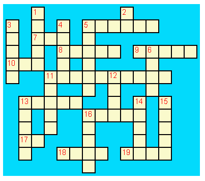 

 

<B>Kata:</B>  
1:&nbsp;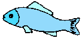&nbsp;&nbsp;&nbsp;&nbsp;&nbsp;&nbsp;&nbsp;&nbsp;&nbsp; 

2:&nbsp;<B>2</B>&nbsp;&nbsp;&nbsp;&nbsp;&nbsp;&nbsp;&nbsp;&nbsp;&nbsp;

3:&nbsp;&nbsp;&nbsp;&nbsp;&nbsp;&nbsp;&nbsp;&nbsp;&nbsp;&nbsp;

4:&nbsp;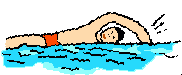
 

5:&nbsp;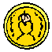&nbsp;&nbsp;&nbsp;&nbsp;&nbsp;&nbsp;&nbsp;&nbsp;&nbsp; 

6:&nbsp;<B>8</B>&nbsp;&nbsp;&nbsp;&nbsp;&nbsp;&nbsp;&nbsp;&nbsp;&nbsp;
 
 

9:  
<B> 
Mo, bi, tri,  
dice Glosa ko mi.   
Lekto, graf e ludi;   
dice Glosa nu-di.  
</B>

11:&nbsp;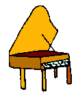&nbsp;&nbsp;&nbsp;&nbsp;&nbsp;&nbsp;&nbsp;&nbsp;&nbsp; 

12:&nbsp;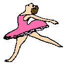&nbsp;&nbsp;&nbsp;&nbsp;&nbsp;&nbsp;&nbsp;&nbsp;&nbsp; 

13:&nbsp;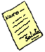 
 
 

14:&nbsp;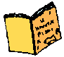&nbsp;&nbsp;&nbsp;&nbsp;&nbsp;&nbsp;&nbsp;&nbsp;&nbsp;

15:&nbsp;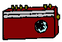&nbsp;&nbsp;&nbsp;&nbsp;&nbsp;&nbsp;&nbsp;&nbsp;&nbsp;

16:&nbsp;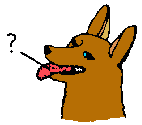&nbsp;&nbsp;&nbsp;&nbsp;&nbsp;&nbsp;&nbsp;&nbsp;&nbsp;
 
 
 
 
 
 

<B>Trans:</B>  

5:&nbsp;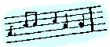&nbsp;&nbsp;&nbsp;&nbsp;&nbsp;&nbsp;&nbsp;&nbsp;&nbsp;

7:&nbsp;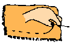
 

8:&nbsp;&nbsp;&nbsp;&nbsp;&nbsp;&nbsp;&nbsp;&nbsp;&nbsp;&nbsp;

9:&nbsp;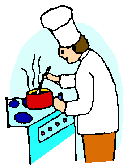&nbsp;&nbsp;&nbsp;&nbsp;&nbsp;&nbsp;&nbsp;&nbsp;&nbsp;

10:&nbsp;<B>3</B>
 

11:&nbsp;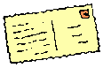&nbsp;&nbsp;&nbsp;&nbsp;&nbsp;&nbsp;&nbsp;&nbsp;&nbsp;

13:&nbsp;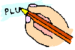&nbsp;&nbsp;&nbsp;&nbsp;&nbsp;&nbsp;&nbsp;&nbsp;&nbsp;

16:&nbsp;
 

17:&nbsp;<B>1</B>&nbsp;&nbsp;&nbsp;&nbsp;&nbsp;&nbsp;&nbsp;&nbsp;&nbsp;

18:&nbsp;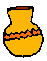&nbsp;&nbsp;&nbsp;&nbsp;&nbsp;&nbsp;&nbsp;&nbsp;&nbsp;

19:&nbsp;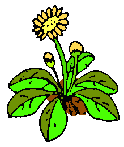

Пожалуйста нажмите
  <A HREF="ru18s.htm#Key1">здесь</A>
для ответа. 

<!-- ============================================================= -->

  
  

 

<SMALL><I> - стр. 9 - </I></SMALL>

<H2> Шаг 2 </H2>

<TABLE BORDER="0" WIDTH="100%" CELLSPACING="0" CELLPADDING="0">
<COLGROUP><COL WIDTH="45%"><COL WIDTH="55%"></COLGROUP>
<TR><TD><B> sio &nbsp; </B></TD><TD> бы (условные предложения)  
<TR><TD></TD><TD> </TD></TR>
<TR><TD></TD><TD> </TD></TR>

<TR><TD><B> Fe nima es Iris.&nbsp; </B></TD>
  <TD> Ее имя Ирис (Ее зовут Ирис). </TD></TR>
<TR><TD><B> Fe habe tetra anua.&nbsp; </B></TD>
  <TD> Ей четыре года. </TD></TR>
<TR><TD><B> An nima es George.&nbsp; </B></TD>
  <TD> Его имя Джордж. </TD></TR>
<TR><TD><B> An habe tri anua.&nbsp; </B></TD>
  <TD> Ему три года. </TD></TR>
<TR><TD><B> Mi amo kolekti plu moneta.&nbsp; </B></TD>
  <TD> Я люблю собирать монеты. </TD></TR>
<TR><TD><B> Mi sio amo grafo u bibli.&nbsp; </B></TD>
  <TD>Я хотел бы написать книгу. </TD></TR>
<TR><TD><B> Mi matri ergo in domi.&nbsp; </B></TD>
  <TD> Моя мама работает дома (в доме). </TD></TR>
<TR><TD><B> Mi patri-matri soni u piano.&nbsp; </B></TD>
  <TD> Моя бабушка играет на фортепиано. </TD></TR>
<TR><TD><B> Fe sio amo viagia.&nbsp; </B></TD>
  <TD> Ей понравилось бы путешествовать. </TD></TR>
<TR><TD><B> Mi patri ergo in pato-do.&nbsp; </B></TD>
  <TD> Мой отец работает в больнице. </TD></TR>
<TR><TD><B> An amo audi musika.&nbsp; </B></TD>
  <TD> Она любит слушать музыку. </TD></TR>
<TR><TD><B> An es u medika-pe.&nbsp; </B></TD>
  <TD> Он - врач. </TD></TR>
<TR><TD><B> Mi fratri eko in Paris.&nbsp; </B></TD>
  <TD> Мой брат живет в Париже. </TD></TR>
<TR><TD><B> Mi sorori eko extra Paris.&nbsp; </B></TD>
  <TD> Моя сестра живет за пределами Парижа. </TD></TR>
<TR><TD VALIGN="top"><B> Place. Gratia. Penite. </B>
  <I>(Ошибки в оригинале: <B>Gratio. </B> и <B>Penito</B>.)</I>&nbsp;
  </TD>
  <TD VALIGN="top"> Пожалуйста.  Спасибо.  Извините.
  </TD></TR>
<TR><TD VALIGN="top"><B> Mi spe gene tu reakti.&nbsp; </B></TD>
  <TD VALIGN="top"> Я хочу получить вашу реакцию. (Услышать ваше
  мнение). </TD></TR>
</TABLE>
 
 

<I> Словарь </I>

<TABLE BORDER="0" WIDTH="100%" CELLSPACING="0" CELLPADDING="0">
<COLGROUP><COL WIDTH="25%"><COL WIDTH="75%"></COLGROUP>
<TR><TD VALIGN="top"><B>es&nbsp; </B></TD>
  <TD VALIGN="top"> быть, есть (часто опускается в русском, например,
  Кошка - это млекопитающее = Кошка есть млекопиатющее) </TD></TR>
<TR><TD><B>Karo ...&nbsp; </B></TD><TD> Дорогой ... </TD></TR>
<TR><TD><B>tu&nbsp; </B></TD><TD> вы, ваш </TD></TR>
<TR><TD><B>nima&nbsp; </B></TD><TD> имя </TD></TR>
<TR><TD><B>in&nbsp; </B></TD><TD> внутри, в </TD></TR>
<TR><TD><B>extra&nbsp; </B></TD>
  <TD> вне (иногда: не дома, на улице) </TD></TR>
<TR><TD><B>anua&nbsp; </B></TD><TD> год, годовой </TD></TR>
<TR><TD><B>eko&nbsp; </B></TD><TD> жить, проживать </TD></TR>
<TR><TD><B>matri&nbsp; </B></TD><TD> мать </TD></TR>
<TR><TD><B>patri&nbsp; </B></TD><TD> отец </TD></TR>
<TR><TD><B>fratri&nbsp; </B></TD><TD> брат </TD></TR>
<TR><TD><B>sorori&nbsp; </B></TD><TD> сестра </TD></TR>
<TR><TD><B>ergo&nbsp; </B></TD><TD> работать </TD></TR>
<TR><TD><B>domi; -do&nbsp; </B></TD><TD> дом, строение </TD></TR>
<TR><TD><B>pato&nbsp; </B></TD><TD> болеть;болезнь </TD></TR>
<TR><TD><B>andro&nbsp; </B></TD><TD> человек </TD></TR>
<TR><TD><B>an&nbsp; </B></TD><TD> он, его </TD></TR>
<TR><TD><B>gina&nbsp; </B></TD><TD> женщина </TD></TR>
<TR><TD><B>fe&nbsp; </B></TD><TD> она, ее </TD></TR>
<TR><TD VALIGN="top"><B>persona; pe&nbsp; </B></TD>
  <TD VALIGN="top"> персона, человек (часто в абстрактных фразах:
  человек имеет право на жизнь и.т.п.) </TD></TR>
<TR><TD><B>meno&nbsp; </B></TD><TD> месяц </TD></TR>
<TR><TD><B>gene&nbsp; </B></TD><TD> получить </TD></TR>
</TABLE>
 
 
 

<U>Обмен письмам</U>

 Тепер вы можете начать переписываться на Глосе. Напишите о вашей
семье и интересах.  Вот пример. 

 

<B> Karo Andrew! </B>
 

<B> Mi pa lekto tu nima in &ldquo;Plu Glosa Nota&rdquo;; e mi sio
amo kambio plu grama ko tu. </B>
 

<B> Mi habe deka anua.  Mi eko ko mi matri, patri e fratri.  Mi matri
ergo in domi; e mi patri ergo 
  </B><I>(ошибка в оригинале <B>eko</B>)</I><B>
in pato-do.  An es u medika-pe.  Mi fratri
habe tri anua.  An nima es George.  Mi amo lekto, grafo, musika, nekto,
kuko, e kolekti plu posta-karta.  Mi spe gene tu reakti.  Plu Saluta
</B>
 

<B> Irene </B>
 
 
 

<SMALL><I> - стр. 10 - </I></SMALL>

<H3> Plu Profesio </H3>

 Многие из главных удовольствий цивилизованной жизни попадают в
18&nbsp;классов, которые в Глосе могут быть легко обозначены двумя
буквами. Комбинируя их со словами представляющими занятия, вы можете
построить очень большой словарный запас легко напрягая лишь немного
памяти.
<B>-pe</B> - аббревиатура для <B>пе</B>рсоны, может легко сочетаться
со словами, которые вы уже выучили.  

<TABLE BORDER="0" WIDTH="100%" CELLSPACING="0" CELLPADDING="0">
<COLGROUP><COL WIDTH="25%"><COL WIDTH="75%"></COLGROUP>
<TR><TD><B>medika-pe&nbsp; </B></TD><TD> врач, доктор </TD></TR>
<TR><TD><B>medika-fe&nbsp; </B></TD><TD> женщина-врач </TD></TR>
<TR><TD><B>medika-an&nbsp; </B></TD><TD> мужчина-врач </TD></TR>
<TR><TD><B>piski-pe&nbsp; </B></TD><TD> рыбак </TD></TR>
<TR><TD><B>posta-pe&nbsp; </B></TD><TD> почтальон </TD></TR>
<TR><TD><B>kore-pe&nbsp; </B></TD><TD> танцор </TD></TR>
<TR><TD><B>kuko-pe&nbsp; </B></TD><TD> повар </TD></TR>
<TR><TD><B>drama-fe&nbsp; </B></TD><TD> актриса </TD></TR>
<TR><TD><B>gresi-pe&nbsp; </B></TD>
  <TD> гуляющий, путешественник </TD></TR>
<TR><TD><B>sko-pe&nbsp; </B></TD><TD> инструктор, учитель </TD></TR>
<TR><TD><B>stude-pe&nbsp; </B></TD><TD> ученик, студент </TD></TR>
<TR><TD><B>musika-pe&nbsp; </B></TD><TD> музыкант </TD></TR>
<TR><TD><B>Italia-pe&nbsp; </B></TD><TD> Итальянец </TD></TR>
<TR><TD><B>ergo-pe&nbsp; </B></TD><TD> рабочий </TD></TR>
<TR><TD VALIGN="top"><B>nuli-ergo-pe&nbsp; </B></TD>
  <TD VALIGN="top"> безработный
  <I>(другие предложения <B>nul-ergo-pe</B> или <B>ne-ergo-pe</B>.
  Оригинально было<B>minus ergo-pe</B>, но это больше похоже на
  "неполно занятый".)</I>
  </TD></TR>
<TR><TD><B>plu ergo-pe&nbsp; </B></TD><TD> рабочие </TD></TR>
<TR><TD><B>eko-pe&nbsp; </B></TD><TD> житель </TD></TR>
<TR><TD><B>habe-pe&nbsp; </B></TD><TD> владетель, хозяин </TD></TR>
<TR><TD><B>pato-pe&nbsp; </B></TD><TD> пациент, больной </TD></TR>
<TR><TD><B>grafo-pe&nbsp; </B></TD><TD> автор, писатель </TD></TR>
<TR><TD><B>viagia-pe&nbsp; </B></TD><TD> путешественник </TD></TR>
<TR><TD><B>plu kanta-pe&nbsp; </B></TD><TD> певец </TD></TR>
<TR><TD><B>plu audi-pe&nbsp; </B></TD><TD> аудитория </TD></TR>
<TR><TD><B>nekto-pe&nbsp; </B></TD><TD> пловец </TD></TR>
<TR><TD><B>monti-pe&nbsp; </B></TD><TD> скалолаз </TD></TR>
<TR><TD><B>plu skope-pe&nbsp; </B></TD><TD> очевидцы </TD></TR>
</TABLE>
 
 

 Когда возможно используйте местные географические названия
например Швеция <B>Sverige</B>, Германия <B>Deutschland</B>, Рим
<B>Roma</B>. 

 
 

<H3> Цвета </H3>

<TABLE BORDER="0" WIDTH="100%" CELLSPACING="0" CELLPADDING="0">
<COLGROUP><COL WIDTH="25%"><COL WIDTH="75%"></COLGROUP>
<TR><TD><B>leuko&nbsp; </B></TD><TD> белый </TD></TR>
<TR><TD><B>melano&nbsp; </B></TD><TD> черный </TD></TR>
<TR><TD><B>polio&nbsp; </B></TD><TD> серый </TD></TR>
<TR><TD><B>xanto&nbsp; </B></TD><TD> желтый </TD></TR>
<TR><TD><B>rubi&nbsp; </B></TD><TD> красный </TD></TR>
<TR><TD><B>ciano&nbsp; </B></TD><TD> синий, голубой </TD></TR>
<TR><TD><B>bruno&nbsp; </B></TD><TD> коричневый </TD></TR>
<TR><TD><B>leuko-bruno&nbsp; </B></TD><TD> бежевый </TD></TR>
<TR><TD><B>polio-bruno&nbsp; </B></TD><TD> желтовато-коричневый </TD></TR>
<TR><TD><B>purpuro&nbsp; </B></TD><TD> пурпурный, фиолетовый </TD></TR>
<TR><TD><B>purpuro-rubi&nbsp; </B></TD><TD> малиновый </TD></TR>
<TR><TD><B>kloro&nbsp; </B></TD><TD> зеленый </TD></TR>
<TR><TD><B>leuko kloro&nbsp; </B></TD><TD> светло-зеленый </TD></TR>
<TR><TD><B>sub kloro&nbsp; </B></TD><TD> зеленоватый</TD></TR>
<TR><TD><B>fo-kloro&nbsp; </B></TD><TD> насыщенный зеленый </TD></TR>
<TR><TD><B>melano kloro&nbsp; </B></TD><TD> темный зеленый </TD></TR>
<TR><TD><B>rubi-xanto&nbsp; </B></TD><TD> оранжевый </TD></TR>
<TR><TD><B>minus kroma&nbsp; </B></TD><TD> безцветный </TD></TR>
</TABLE>
 
 

<I> Упражнение 2 </I>

<TABLE BORDER="0" WIDTH="100%" CELLSPACING="0" CELLPADDING="0">
<COLGROUP><COL WIDTH="45%"><COL WIDTH="55%"></COLGROUP>
<TR><TD><B> Mi habe okto anua.&nbsp; </B></TD>
  <TD> Мне 8 лет. </TD></TR>
<TR><TD><B> Mi gene sko de Glosa.&nbsp; </B></TD>
  <TD> Я учу Глосу. </TD></TR>
<TR><TD><B> Mi gina-matri es u grafo-fe.&nbsp; </B></TD>
  <TD> Моя теща - писательница. </TD></TR>
<TR><TD><B> Fe pa grafo penta bibli.&nbsp; </B></TD>
  <TD> Она написала 5 книг. </TD></TR>
<TR><TD><B>  Fe habe u puta-me.&nbsp; </B></TD>
  <TD> У нее есть компьютер. </TD></TR>
<TR><TD><B> Mi patri es u drama-pe.&nbsp; </B></TD>
  <TD> Мой отец - актер. </TD></TR>
<TR><TD><B> Plu audi-pe amo an.&nbsp; </B></TD>
  <TD> Аудитория любит его. </TD></TR>
<TR><TD><B> Mi matri es u sko-pe.&nbsp; </B></TD>
  <TD> Моя мать - учительница. </TD></TR>
<TR><TD><B> Mi eko in domi tri.&nbsp; </B></TD>
  <TD> Я живу в третьем доме. </TD></TR>
<TR><TD><B> Patri-patri.&nbsp; </B></TD>
  <TD> Дедушка (= папа папы) </TD></TR>
<TR><TD></TD><TD> </TD></TR>

<TR><TD><B> An habe bi-ze anua.&nbsp; </B></TD>
  <TD> Ему 20 лет. </TD></TR>
<TR><TD><B> Un an-piski habe mo anua&nbsp; </B></TD>
  <TD> Самцу рыбы один год. </TD></TR>
<TR><TD><B> Piski-an&nbsp; </B></TD>
  <TD> Рыбак. </TD></TR>
<TR><TD><B> Tu habe tri-ze moneta&nbsp; </B></TD>
  <TD> Ты имеешь 30 монет. </TD></TR>
<TR><TD><B> An kulti plu piski&nbsp; </B></TD>
  <TD> Он разводит рыб. </TD></TR>
<TR><TD><B> Mi pa gene okto grama&nbsp; </B></TD>
  <TD> Я получил 8 писем. </TD></TR>
<TR><TD><B> Mi pa posta six grama&nbsp; </B></TD>
  <TD> Я отправил 6 писем. </TD></TR>
<TR><TD><B> Mi amo audi plu kanta-pe&nbsp; </B></TD>
  <TD> Я люблю слушать хор. </TD></TR>
<TR><TD><B> Plu persona amo fe&nbsp; </B></TD>
  <TD> Люди любят ее. </TD></TR>
<TR><TD><B> Mi nima es Margaret.&nbsp; </B></TD>
  <TD> Меня зовут Маргарет. </TD></TR>
</TABLE>
 

<SMALL><I> - стр. 11 - </I></SMALL>

<U>Слова для обозначения мест</U>

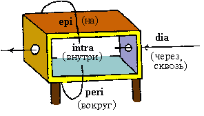
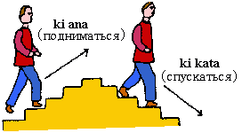
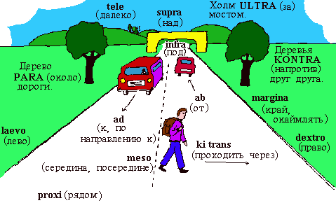

 Так как слово для места всегда следует за существительным, нет
необходимости ставить перед ним  <B>u(n)</B>, артикль. Например: 

<TABLE BORDER="0" WIDTH="100%" CELLSPACING="0" CELLPADDING="0">
<COLGROUP><COL WIDTH="45%"><COL WIDTH="55%"></COLGROUP>
<TR><TD><B> U verba-bibli es epi tabla.&nbsp; </B></TD>
  <TD> Словарь (лежит) на столе. </TD></TR>
<TR><TD><B> Fe pa du gresi longi ripa.&nbsp; </B></TD>
  <TD> Она прогуливалась по берегу. </TD></TR>
<TR><TD></TD><TD> </TD></TR>
<TR><TD></TD><TD> </TD></TR>
<TR><TD></TD><TD> </TD></TR>

<TR><TD><B> Sedi in gono&nbsp; </B></TD>
  <TD> сидеть в углу </TD></TR>
<TR><TD><B> Grafo poesi in Glosa&nbsp; </B></TD>
  <TD> писать стихи на Глосе </TD></TR>
<TR><TD><B> Loka id in teka&nbsp; </B></TD>
  <TD> Положите это в коробку </TD></TR>
<TR><TD><B> An eko kontra na&nbsp; </B></TD>
  <TD>Он живет напротив нас </TD></TR>
<TR><TD VALIGN="top"><B> In e peri urba
  </B><I>(оригинально <B>urbs</B>.)</I>
  &nbsp; </TD>
  <TD VALIGN="top"> В и вокруг города </TD></TR>
<TR><TD><B> Sti id pende a mura
  </B><I>(оригинально <B>Pend id epi mura</B>, что нормально тоже.
  Другие предлоги такж возможны: <B> Pend id a/de/epi/kata
  mura</B>)</I>&nbsp;
  </TD>
  <TD VALIGN="top"> Повесьте это на стену. </TD></TR>
<TR><TD VALIGN="top"><B> Registra epi flexi disko
  </B><I>(оригинально <B>diska</B>)</I>&nbsp; </TD>
  <TD VALIGN="top"> Записать на гибкий диск. </TD></TR>
<TR><TD VALIGN="top"><B> Fe pa loka u mantela epi
  </B><I>(оригинально <B>ep</B>)</I><B>
  se.&nbsp; </B></TD>
  <TD> Она надела свой пиджак </TD></TR>
<TR><TD VALIGN="top"><B> Skope u programa per
  </B><I>(OОригинально <B>epi</B>, что тоже нормально.  Также возможны
  другие предлоги: <B>Skope u programa
  per/ex/in/a/de/epi TV</B>)</I><B>
  TV&nbsp; </B></TD>
  <TD VALIGN="top"> Смотреть программу по ТВ </TD></TR>
<TR><TD VALIGN="top"><B> Viagia trans
  </B><I>(оригинально <B>dia</B>)</I><B>
  rura&nbsp; </B></TD>
  <TD VALIGN="top"> Путешествовать по сельской местности. </TD></TR>
<TR><TD VALIGN="top"><B> Kribri id.
  </B><I>(оригинально <B>Kribra id</B>.)</I>&nbsp; </TD>
  <TD VALIGN="top"> Просеить это. </TD></TR>
<TR><TD VALIGN="top"><B> Hidro flu dia tubi.&nbsp; </B></TD>
  <TD VALIGN="top"> Вода течет по трубе. </TD></TR>
<TR><TD VALIGN="top"><B> Un avi pa peti
  </B><I>(оригинально  <B>vola</B>)</I><B>
  supra dendro.&nbsp; </B></TD>
  <TD VALIGN="top"> Птица летела над деревом. </TD></TR>
<TR><TD><B> Ki infra ponti.&nbsp; </B></TD>
  <TD> Пройти под мостом. </TD></TR>
<TR><TD><B> An pa dromo trans via.&nbsp; </B></TD>
  <TD> Он бежал через дорогу. </TD></TR>
<TR><TD><B> Fe es supra.&nbsp; </B></TD>
  <TD>Она наверху. </TD></TR>
<TR><TD><B> Fe es infra.&nbsp; </B></TD>
  <TD> Она внизу. </TD></TR>
</TABLE>
 

<!-- ============================================================= -->

 
 

(К другим шагам:
<A HREF="ru18s.htm#S1">1</A>,
<A HREF="ru18s.htm#S2">2</A>,
<A HREF="ru18s.htm#S3">3</A>,
<A HREF="ru18s.htm#S4">4</A>,
<A HREF="ru18s.htm#S5">5</A>,
<A HREF="ru18s.htm#S6">6</A>,
<A HREF="ru18s.htm#S7">7</A>,
<A HREF="ru18s.htm#S8">8</A>,
<A HREF="ru18s.htm#S9">9</A>,
<A HREF="ru18s.htm#S10">10</A>,
<A HREF="ru18s.htm#S11">11</A>,
<A HREF="ru18s.htm#S12">12</A>,
<A HREF="ru18s.htm#S13">13</A>,
<A HREF="ru18s.htm#S14">14</A>,
<A HREF="ru18s.htm#S15">15</A>,
<A HREF="ru18s.htm#S16">16</A>,
<A HREF="ru18s.htm#S17">17</A>,
<A HREF="ru18s.htm#S18">18</A>)

<SMALL><I> - стр. 12 - </I></SMALL>

<H2> Шаг 3 </H2>

<TABLE BORDER="0" WIDTH="100%" CELLSPACING="0" CELLPADDING="0">
<COLGROUP><COL WIDTH="45%"><COL WIDTH="55%"></COLGROUP>
<TR><TD><B> ne&nbsp; </B></TD><TD> не, отрицание </TD></TR>
<TR><TD></TD><TD> </TD></TR>
<TR><TD></TD><TD> </TD></TR>

<TR><TD><B> Mi patri ne sporta tenis.&nbsp; </B></TD>
  <TD> Мой отец не играет в теннис. </TD></TR>
<TR><TD><B> An ne amo sporta tenis.&nbsp; </B></TD>
  <TD> Он не любит играть в теннис. </TD></TR>
<TR><TD><B> An ne lekto.&nbsp; </B></TD>
  <TD> Он не читает. </TD></TR>
<TR><TD><B> An ne amo lekto.&nbsp; </B></TD>
  <TD> Он не любит читать. </TD></TR>
<TR><TD><B> Mi ne amo skope televisio.&nbsp; </B></TD>
  <TD> Я не люблю смотреть ТВ. </TD></TR>
<TR><TD><B> An ergo in musika-bo.&nbsp; </B></TD>
  <TD> Он работает в музыкальном магазине. </TD></TR>
<TR><TD><B> An ne ergo in pato-do.&nbsp; </B></TD>
  <TD> Он не работает в больнице. </TD></TR>
<TR><TD><B> An ne pa sporta tenis pa-di.&nbsp; </B></TD>
  <TD> Он не играл в теннис вчера. </TD></TR>
<TR><TD><B> Fe ne pa visita plu boteka.&nbsp; </B></TD>
  <TD> Она не ходила в магазины. </TD></TR>
<TR><TD><B> An ne pa visita fe di-tri.&nbsp; </B></TD>
  <TD> Он не посещал ее во вторник. </TD></TR>
<TR><TD><B> Na fu visita fe fu-di.&nbsp; </B></TD>
  <TD> Мы посетим ее завтра. </TD></TR>
<TR><TD><B> An pa kapti bi piski nu-di.&nbsp; </B></TD>
  <TD> Он поймал две рыбы сегодня. </TD></TR>
<TR><TD><B> Mi patri ne pa ergo pa-di.&nbsp; </B></TD>
  <TD> Мой отец не работал вчера. </TD></TR>
<TR><TD><B> An ne ergo nu.&nbsp; </B></TD>
  <TD> Он не работает чейчас. </TD></TR>
<TR><TD><B> An es minus ergo.&nbsp; </B></TD>
  <TD> Он безработный (см. примечание в Шаге 1). </TD></TR>
<TR><TD><B> Mi nu lekto u bibli.&nbsp; </B></TD>
  <TD> Я сейчас читаю книгу. </TD></TR>
<TR><TD><B> Fu-di na visita na matri-patri.&nbsp; </B></TD>
  <TD> Завтра мы посетим нашего дедушку. </TD></TR>
<TR><TD><B> Di-tetra an pa visita na.&nbsp; </B></TD>
  <TD> В среду он посетил нас. </TD></TR>
<TR><TD><B> Fu anua mi visita Paris e Roma.&nbsp; </B></TD>
  <TD> В следующем году я посещу Париж и Рим. </TD></TR>
<TR><TD><B> Di-penta mana. Di-mo vespera.&nbsp; </B></TD>
  <TD> Утро четверга. Вечер воскресенья. </TD></TR>
</TABLE>
 
 

<I> Словарь </I>

<TABLE BORDER="0" WIDTH="100%" CELLSPACING="0" CELLPADDING="0">
<COLGROUP><COL WIDTH="25%"><COL WIDTH="75%"></COLGROUP>
<TR><TD><B>nu&nbsp; </B></TD><TD> сейчас; настоящее время </TD></TR>
<TR><TD><B>religio&nbsp; </B></TD><TD> религия </TD></TR>
<TR><TD><B>boteka; -bo&nbsp; </B></TD><TD> магазин </TD></TR>
<TR><TD><B>di&nbsp; </B></TD><TD> день </TD></TR>
<TR><TD><B>pa-di&nbsp; </B></TD><TD> вчера </TD></TR>
<TR><TD><B>nu-di&nbsp; </B></TD><TD> сегодня </TD></TR>
<TR><TD><B>fu-di&nbsp; </B></TD><TD> завтра </TD></TR>
<TR><TD><B>mana&nbsp; </B></TD><TD> утро </TD></TR>
<TR><TD><B>di-mo&nbsp; </B></TD><TD> воскресенье </TD></TR>
<TR><TD><B>di-bi&nbsp; </B></TD><TD> понедельник </TD></TR>
<TR><TD><B>horti&nbsp; </B></TD><TD> сад  </TD></TR>
<TR><TD><B>na&nbsp; </B></TD><TD> мы, наш, нас </TD></TR>
<TR><TD><B>mega&nbsp; </B></TD><TD> большой, много </TD></TR>
<TR><TD><B>mo-tetra di&nbsp; </B></TD><TD> две недели </TD></TR>
<TR><TD><B>setimana&nbsp; </B></TD><TD> неделя </TD></TR>
<TR><TD><B>vespera&nbsp; </B></TD><TD> вечер </TD></TR>
</TABLE>
 
 

 <B>Pa</B> и <B>fu</B> могут быть заменены каким-либо другим словом
как 'вчера' фиксирующем время, например, 

<TABLE BORDER="0" WIDTH="100%" CELLSPACING="0" CELLPADDING="0">
<COLGROUP><COL WIDTH="45%"><COL WIDTH="55%"></COLGROUP>
<TR><TD><B> Fu-di mi visita London.&nbsp; </B></TD>
  <TD> Завтра я посещу Лондон. </TD></TR>
</TABLE>
 
 

<H3> Магазины </H3>

<TABLE BORDER="0" WIDTH="100%" CELLSPACING="0" CELLPADDING="0">
<COLGROUP><COL WIDTH="25%"><COL WIDTH="75%"></COLGROUP>
<TR><TD><B>pani-bo&nbsp; </B></TD><TD> булочная </TD></TR>
<TR><TD><B>bibli-bo&nbsp; </B></TD><TD> книжный магазин </TD></TR>
<TR><TD><B>karni-bo&nbsp; </B></TD><TD> мясная лавка</TD></TR>
<TR><TD VALIGN="top"><B>medika-ma-bo </B>
  <I>(или <B>farmako-bo</B>. Оригинально <B>kemi-bo</B>)</I>&nbsp;
  </TD>
  <TD VALIGN="top"> аптека </TD></TR>
<TR><TD><B>flori-bo&nbsp; </B></TD><TD> цветочный магазин </TD></TR>
<TR><TD><B>frukti-bo&nbsp; </B></TD><TD> фруктовый магазин </TD></TR>
<TR><TD VALIGN="top"><B>sito-fito-bo </B>
  <I>(oоригинально  <B>kloro-bo</B>)</I>&nbsp; </TD>
  <TD VALIGN="top"> зеленая баклея</TD></TR>
<TR><TD><B>sani-bo&nbsp; </B></TD><TD> аптека (не обязат. химия) </TD></TR>
<TR><TD><B>gema-bo&nbsp; </B></TD><TD> ювелирный магазин</TD></TR>
<TR><TD><B>piski-bo&nbsp; </B></TD><TD> рыбный магазин </TD></TR>
<TR><TD><B>musika-bo&nbsp; </B></TD><TD> музыкальный магазин </TD></TR>
<TR><TD><B>grafo-bo&nbsp; </B></TD><TD> канц. товары </TD></TR>
<TR><TD><B>viagia-bo&nbsp; </B></TD><TD> туристическое агенство </TD></TR>
</TABLE>
 
 

<SMALL><I> - стр. 13 - </I></SMALL>

<H3> Живые вещи </H3>

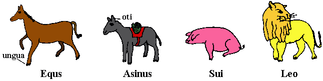
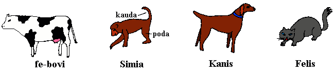
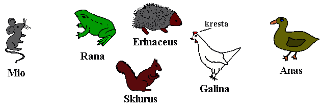
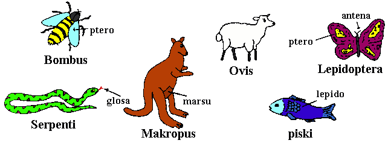
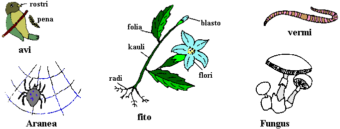

 
 
 

<SMALL><I> - стр. 14 - </I></SMALL>

<I> Упражнение 3 </I>

<TABLE BORDER="0" WIDTH="100%" CELLSPACING="0" CELLPADDING="0">
<COLGROUP><COL WIDTH="45%"><COL WIDTH="55%"></COLGROUP>
<TR><TD><B> Mi ne amo ergo in domi.&nbsp; </B></TD>
  <TD> Я не люблю работать дома. </TD></TR>
<TR><TD><B> Mi ne amo grafo plu grama.&nbsp; </B></TD>
  <TD> Я не люблю писать письмя. </TD></TR>
<TR><TD><B> Fu anua fe visita France.&nbsp; </B></TD>
  <TD> В следующем году она посетит Францию. </TD></TR>
<TR><TD><B> Pa anua mi es in pato-do.&nbsp; </B></TD>
  <TD> В прошлом году я был в больнице. </TD></TR>
<TR><TD><B> Pa-di na visita plu boteka.&nbsp; </B></TD>
  <TD> Вчера мы отправились за покупками (шопинг). </TD></TR>
<TR><TD><B> Di-bi na visita u regi-do.&nbsp; </B></TD>
  <TD> Мы посещаем храм в понедельник. </TD></TR>
<TR><TD><B> Plu kanta-pe pa kanta in religio-do.&nbsp; </B></TD>
  <TD> Хор пел в церкви. </TD></TR>
<TR><TD><B> Fe habe nuli horti.&nbsp; </B></TD>
  <TD> У нее нет сада. </TD></TR>
<TR><TD><B> An ne amo nekto.&nbsp; </B></TD>
  <TD> Он не любит плавать. </TD></TR>
<TR><TD><B> Fratri-gina.&nbsp; </B></TD>
  <TD> Сестра брата </TD></TR>
<TR><TD><B> Plu lekto-pe.&nbsp; </B></TD>
  <TD> Читатели. </TD></TR>
<TR><TD></TD><TD> </TD></TR>

<TR><TD><B> Na ne visita u religio-do.&nbsp; </B></TD>
  <TD> Мы не ходим в церковь. </TD></TR>
<TR><TD><B> Mu nu kanta.&nbsp; </B></TD>
  <TD> Они поют сейчас. </TD></TR>
<TR><TD><B> Fu setimana mi visita Nice.&nbsp; </B></TD>
  <TD> На следующей неделе я посещу Найс. </TD></TR>
<TR><TD><B> Fe ne fu visita u sporta-do.&nbsp; </B></TD>
  <TD> Она не будет посещать гимнастический зал. </TD></TR>
<TR><TD><B> An habe u di-bibli.&nbsp; </B></TD>
  <TD> У нее есть дневник. </TD></TR>
<TR><TD><B> An ne pa es in domi.&nbsp; </B></TD>
  <TD> Его не было дома. </TD></TR>
<TR><TD><B> Na pa sporta in mega horti.&nbsp; </B></TD>
  <TD> Мы играли в большом саду. </TD></TR>
<TR><TD><B> Plu mega boteka.&nbsp; </B></TD>
  <TD> Большие магазины/универмаги. </TD></TR>
<TR><TD><B> Dora es u domi-fe.&nbsp; </B></TD>
  <TD> Дора - домохозяйка. </TD></TR>
<TR><TD><B> sani-sito-bo.&nbsp; </B></TD>
  <TD> Магазин здоровой пищи. </TD></TR>
</TABLE>
 
 
 

<B>domi</B>&nbsp;
  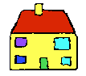 
  &nbsp;

<H3> Здания </H3>

<TABLE BORDER="0" WIDTH="100%" CELLSPACING="0" CELLPADDING="0">
<COLGROUP><COL WIDTH="25%"><COL WIDTH="75%"></COLGROUP>
<TR><TD><B>apis-do&nbsp; </B></TD><TD> пчелиный улей </TD></TR>
<TR><TD><B>bibli-do&nbsp; </B></TD><TD> библиотека </TD></TR>
<TR><TD><B>bovi-do&nbsp; </B></TD><TD> коровник </TD></TR>
<TR><TD><B>religio-do&nbsp; </B></TD><TD> церковь, храм </TD></TR>
<TR><TD><B>lakti-do&nbsp; </B></TD><TD> молочная ферма </TD></TR>
<TR><TD><B>agri-do&nbsp; </B></TD><TD> жилой дом на ферме </TD></TR>
<TR><TD><B>face-do&nbsp; </B></TD><TD> фабрика</TD></TR>
<TR><TD><B>milita-do&nbsp; </B></TD><TD> форт </TD></TR>
<TR><TD><B>vagona-do&nbsp; </B></TD><TD> гараж </TD></TR>
<TR><TD><B>sperma-do&nbsp; </B></TD><TD> зернохранилище, больница </TD></TR>
<TR><TD><B>kanis-do&nbsp; </B></TD>
  <TD> конура, птомник <I>(для собак)</I></TD></TR>
<TR><TD><B>puni-do&nbsp; </B></TD><TD> тюрьма </TD></TR>
<TR><TD><B>fago-do&nbsp; </B></TD><TD> ресторан </TD></TR>
<TR><TD><B>ge-frakti-do&nbsp; </B></TD><TD> руины </TD></TR>
<TR><TD><B>sko-do&nbsp; </B></TD><TD> школа </TD></TR>
<TR><TD><B>equs-do&nbsp; </B></TD><TD> конюшня</TD></TR>
<TR><TD><B>mega tena-do&nbsp; </B></TD><TD>большой товарный склад </TD></TR>
</TABLE>
 
 
 

<U>Plu Glosa Nota</U>, ISSN&nbsp;0265-6892: Этот журнал держит тех,
кто говорит на Глосе в контакте друг с другом, дает детали о
публикациях, событиях и прогрессе Глосы.  
Статьи: лингвистика, наука, техника, образование, проблемы и
сохранение Третьего Мира, переводы, письма, объявления о друзьях по
переписке и игры со словами.  
PGN помогает беглости в Глосе и подходит одинаково для начинающи и
продвинутых. 

<U>Eduka-Glosa</U>, ISSN&nbsp;0959-8251: Официальный журнал Glosa
Education Organisation (GEO) Registered Charity Number&nbsp;298237.  
Eduka-Glosa ставит ударение, что отдельно от легкости и аккуратности в
междуродном общении Глоса делает большой вклад в образование, дает
значения тысячам научных и технических терминов и многим евро-словарям.

 

 

<SMALL><I> - стр. 15 - </I></SMALL>

<H2> Шаг 4 </H2>

 <B>Qe?</B>&nbsp;&nbsp; Начинает вопрос; и "ли ...". 

<TABLE BORDER="0" WIDTH="100%" CELLSPACING="0" CELLPADDING="0">
<COLGROUP><COL WIDTH="45%"><COL WIDTH="55%"></COLGROUP>
<TR><TD><B> Qe tu lekto u bibli?&nbsp; </B></TD>
  <TD> Вы читаете книгу? </TD></TR> 
<TR><TD><B> Ja! mi lekto u bibli.&nbsp; </B></TD>
  <TD> Да, я читаю книгу. </TD></TR> 
<TR><TD><B> Qe tu pa sporta tenis?&nbsp; </B></TD>
  <TD> Вы играли в теннис? </TD></TR> 
<TR><TD><B> Qe tu fu grafo u grama?&nbsp; </B></TD>
  <TD> Вы напишите письмо? </TD></TR> 
<TR><TD><B> Qe tu gene sko de Glosa?&nbsp; </B></TD>
  <TD> Вы учите Глосу? </TD></TR> 
<TR><TD><B> Qe tu eko in Britain alo Suomi?&nbsp; </B></TD>
  <TD> В живете в Британии или Финляндии? </TD></TR> 
<TR><TD><B> Qe tu visita u sko-do?&nbsp; </B></TD>
  <TD> Вы ходите в школу? </TD></TR> 
<TR><TD><B> No. Mi nu ergo in bibli-do.&nbsp; </B></TD>
  <TD> Нет. Сейчас я работаю в библиотеке. </TD></TR> 
<TR><TD><B> Qe tu dice poli lingua?&nbsp; </B></TD>
  <TD> Ты говоришь на многих языках? </TD></TR> 
<TR><TD VALIGN="top"><B> Mi dice tri lingua; France-lingua, 
  suomi-lingua e Glosa.&nbsp; </B></TD>
  <TD VALIGN="top"> Я говорю на трех языках: французский, финский и Глоса. </TD></TR> 
<TR><TD><B> Qe tu es Suomi-pe?&nbsp; </B></TD>
  <TD> Вы финн? </TD></TR> 
<TR><TD><B> Qe Glosa es tu lingua bi? </B> or <B> Qe Glosa es u lingua 
  bi de tu? </B></TD>
  <TD VALIGN="top"> Глоса твой второй язык? </TD></TR> 
<TR><TD VALIGN="top"><B> Tu dice bi lingua, qe?&nbsp; </B></TD>
  <TD> Ты говоришь на двух языках, не правда ли? </TD></TR> 
</TABLE>
 
 

<I> ... [пропущено: Vocabulary] </I>
 

 
Примечание: Животные и растения имеют свои международные имена. 
Имя вида начинается с Заглавной буквы. 
Название языка = название страны + <B>lingua</B>; или вы можете использовать самоназвание. 
Пример: <B>England-lingua</B> или <B>English</B>. 

 
 

<U>Письмо</U>

<B> Karo Irene, </B>
 

<B> Poli gratia de tu grama.  Ja, mi sio amo kambio plu grama ko tu.
  
Mi habe mo-tetra anua.  E mi habe bi fratri.  Leo habe mo-bi anua, e
Peter habe dek anua.  Mi matri es u sko-fe; e mi patri es u grafo-pe. 
An grafo plu bibli de viagia, ekologi, auto-auxi, e
agrikultura. </B>
  

<B> Mi amo lekto, musika, plu sporta, ekologi, gresi e viagia.  Mi ne
amo kuko.  Qe tu amo plu zoa e fito?  Qe tu habe u Felis alo Kanis?  Mi
habe u melano Felis. </B>
 

<B> Plu saluta ex </B>
 

<B> Andrew </B>
 
 
 

<SMALL><I> - стр. 16 - </I></SMALL>

<I> Задание 4 </I>

<TABLE BORDER="0" WIDTH="100%" CELLSPACING="0" CELLPADDING="0">
<COLGROUP><COL WIDTH="45%"><COL WIDTH="55%"></COLGROUP>
<TR><TD><B> Qe tu visita u sko-do?&nbsp; </B></TD>
  <TD> Вы ходите в школу? </TD></TR> 
<TR><TD><B> Qe tu pa visita u sito-bo?&nbsp; </B></TD>
  <TD> Вы посетли бакалею? </TD></TR> 
<TR><TD><B> Qe fe eko in Deutschland?&nbsp; </B></TD>
  <TD> Она живет в Германии? </TD></TR> 
<TR><TD><B> Qe an amo plu zoa?&nbsp; </B></TD>
  <TD> Он любит животных? </TD></TR> 
<TR><TD><B> Qe an pa ergo in horti?&nbsp; </B></TD>
  <TD> Он работал в саду? </TD></TR> 
<TR><TD><B> Gratia de u kuko-bibli.&nbsp; </B></TD>
  <TD> Спасибо за кулинарную книгу. </TD></TR> 
<TR><TD><B> Qe tu pa visita Afrika?&nbsp; </B></TD>
  <TD> Вы были в Африке? </TD></TR> 
<TR><TD><B> Qe tu amo kulti plu fito?&nbsp; </B></TD>
  <TD> Вам нравится выращивать растения? </TD></TR> 
<TR><TD><B> Qe il es poli persona in domi?&nbsp; </B></TD>
  <TD> В этом здании много людей? </TD></TR> 
<TR><TD><B> Tu es suomi-pe, qe?&nbsp; </B></TD>
  <TD> Вы - финн, не правда ли? </TD></TR> 
<TR><TD></TD><TD> </TD></TR>

<TR><TD><B> U sko-pe pa dice de ekologi.&nbsp; </B></TD>
  <TD> Учитель говорил об экологии. </TD></TR> 
<TR><TD><B> Poli kanis ne amo plu felis.&nbsp; </B></TD>
  <TD> Многие собаки не любят кошек. </TD></TR> 
<TR><TD><B> Qe an ergo nu-di?&nbsp; </B></TD>
  <TD> Он сегодня работает? </TD></TR> 
<TR><TD><B> Qe mi fu visita u musika-bo?&nbsp; </B></TD>
  <TD> Я посещу музыкальный магазин? </TD></TR> 
<TR><TD><B> U bibli de plu avi&nbsp; </B></TD>
  <TD> Книга о птицах. </TD></TR> 
<TR><TD><B> Qe tu amo visita Helas?&nbsp; </B></TD>
  <TD> Вам нравится посещать Грецию? </TD></TR> 
<TR><TD><B> Mi amo Afrika musika.&nbsp; </B></TD>
  <TD> Я люблю африканскую музыку. </TD></TR> 
<TR><TD><B> Qe tu habe un avi-do?&nbsp; </B></TD>
  <TD> У вас есть птичник? </TD></TR> 
<TR><TD><B> Qe il pa es mega soni?&nbsp; </B></TD>
  <TD> Было много шума? </TD></TR> 
<TR><TD><B> Tu pa noku tu pedi, qe?&nbsp; </B></TD>
  <TD> Вы ушибли ногу, не правда ли? </TD></TR> 
<TR><TD><B> Mi eko-lo es ... &nbsp; </B></TD>
  <TD> Мой адрес: ... </TD></TR> 
</TABLE>
 

<I> ... [пропущено: части тела(изображение)] </I>  
<I> ... [пропущено: части тела(список слов)] </I>  

<SMALL><I> - стр. 17 - </I></SMALL>

<I> ... [пропущено: кольца и вещи (список слов, слова с -zo 
     и -ra)] </I>  
<I> ... [пропущено: сосуды (изображение с -va словами)] </I>  
<I> ... [пропущено: мебель (изображение с -mo словами)] </I>  

 

 

<SMALL><I> - стр. 18 - </I></SMALL>

<H2> Шаг 5 </H2>

<TABLE BORDER="0" WIDTH="100%" CELLSPACING="0" CELLPADDING="0">
<COLGROUP><COL WIDTH="45%"><COL WIDTH="55%"></COLGROUP>
<TR><TD><B> Qo?&nbsp; </B></TD><TD> Что? Какой? </TD></TR> 
<TR><TD></TD><TD> </TD></TR>
<TR><TD></TD><TD> </TD></TR>

<TR><TD><B> Qe tu amo plu zoa?&nbsp; </B></TD>
  <TD> Вы любите животных? </TD></TR> 
<TR><TD><B> Qo plu speci zoa?&nbsp; </B></TD>
  <TD> Какие животные? </TD></TR> 
<TR><TD><B> Tu ne amo qo plu speci zoa?&nbsp; </B></TD>
  <TD> Каких животных ты не любишь. </TD></TR> 
<TR><TD><B> Mi ne amo plu avi.&nbsp; </B></TD>
  <TD> Я не люблю птиц. </TD></TR> 
<TR><TD><B> Qo-ka tu ne amo plu avi?&nbsp; </B></TD>
  <TD> Почему ты не любишь птиц? </TD></TR> 
<TR><TD><B> Qo-horo tu visita fe?&nbsp; </B></TD>
  <TD> Когда (В какое время) ты посещаешб ее? </TD></TR> 
<TR><TD><B> Tu pa vide qo-pe?&nbsp; </B></TD>
  <TD> Кого вы видели? </TD></TR> 
<TR><TD><B> Qo-te tu pa visita fe?&nbsp; </B></TD>
  <TD> Почему ты посетил ее? </TD></TR> 
<TR><TD><B> Qo freqe tu visita an?&nbsp; </B></TD>
  <TD> Как часто ты посещаешь его? </TD></TR> 
<TR><TD><B> Qo-mode tu kuko plu plaka?&nbsp; </B></TD>
  <TD> Как ты готовишь кексы? </TD></TR> 
<TR><TD><B> Tu pa kuko qo numera plaka?&nbsp; </B></TD>
  <TD> Сколько кексов вы приготовили? </TD></TR> 
<TR><TD><B> Mi pa kuko bi-tetra plaka.&nbsp; </B></TD>
  <TD> Я испек 24 кекса. </TD></TR> 
<TR><TD><B> Tu kamera habe qo metri?&nbsp; </B></TD>
  <TD> Как велика твоя комната? </TD></TR> 
<TR><TD><B> U pusi kamera. U mega kamera.&nbsp; </B></TD>
  <TD> Маленькая комната. Большая комната. </TD></TR> 
<TR><TD><B> U teka habe qo masi?&nbsp; </B></TD>
  <TD> Как тяжела эта коробка? </TD></TR> 
<TR><TD VALIGN="top"><B> Tu habe qo numera disko </B>
  <I>(оригинально <B>diska</B>)</I><B>?&nbsp; </B></TD>
  <TD VALIGN="top"> Сколько тарелок у вас есть? </TD></TR> 
<TR><TD VALIGN="top"><B> U disko </B>
  <I>(оригинально <B>diska</B>)</I><B>
  habe qo metri?&nbsp; </B></TD>
  <TD VALIGN="top"> Как велика тарелка? </TD></TR> 
<TR><TD><B> Tu volu qo-ra?&nbsp; </B></TD>
  <TD> Чего ты хочешь? </TD></TR> 
<TR><TD><B> Tu eko qo-lo?&nbsp; </B></TD>
  <TD> Где ты живешь? </TD></TR> 
<TR><TD><B> Mi eko ci.  Tu eko la.&nbsp; </B></TD>
  <TD> Я живу здесь.  Ты живешь там. </TD></TR> 
</TABLE> 
 
 

<I> Словарь </I>

<TABLE BORDER="0" WIDTH="100%" CELLSPACING="0" CELLPADDING="0">
<COLGROUP><COL WIDTH="25%"><COL WIDTH="75%"></COLGROUP> 
<TR><TD><B>Qo speci?&nbsp; </B></TD><TD> Какой тип...? </TD></TR>
<TR><TD><B>Qo ka?&nbsp; </B></TD><TD> Почему? </TD></TR>
<TR><TD><B>Qo-pe?&nbsp; </B></TD><TD> Кто? </TD></TR>
<TR><TD><B>Qo-te?</B> (inTEnd)&nbsp;</TD><TD> Зачем? </TD></TR>
<TR><TD><B>Qo freqe?&nbsp; </B></TD><TD> Как часто? </TD></TR>
<TR><TD><B>Qo mode?&nbsp; </B></TD><TD> Каким способом? </TD></TR>
<TR><TD><B>Qo numera?&nbsp; </B></TD><TD> Сколько? </TD></TR>
<TR><TD><B>Qo metri?&nbsp; </B></TD><TD> Какой размер? </TD></TR>
<TR><TD><B>ci&nbsp; </B></TD><TD> здесь </TD></TR>
<TR><TD><B>la&nbsp; </B></TD><TD> там </TD></TR>
<TR><TD><B>Qo masi?&nbsp; </B></TD><TD> Как тяжело? </TD></TR>
<TR><TD><B>Qo-lo?&nbsp; </B></TD><TD> Где? </TD></TR>
<TR><TD><B>Qo-ra?&nbsp; </B></TD><TD> Какая вещь? </TD></TR>
<TR><TD><B>plaka&nbsp; </B></TD><TD> кекс </TD></TR>
<TR><TD><B>kamera&nbsp; </B></TD><TD> комната </TD></TR>
<TR><TD><B>teka&nbsp; </B></TD><TD> коробка </TD></TR>
<TR><TD><B>volu&nbsp; </B></TD><TD> хотеть, желать </TD></TR>
<TR><TD VALIGN="top"><B>disko</B>
  <I>(оригинально <B>diska</B>)</I>&nbsp; </TD>
  <TD VALIGN="top"> тарелка, диск </TD></TR>
<TR><TD><B>pusi&nbsp; </B></TD><TD> маленький </TD></TR>
</TABLE>
 
 

<I> Задание 5 </I>

<TABLE BORDER="0" WIDTH="100%" CELLSPACING="0" CELLPADDING="0">
<COLGROUP><COL WIDTH="45%"><COL WIDTH="55%"></COLGROUP>
<TR><TD><B> Tu dice qo-numera lingua?&nbsp; </B></TD>
  <TD> Сколько языков ты знаешь? </TD></TR> 
<TR><TD><B> Tu domi habe qo numera kamera?&nbsp; </B></TD>
  <TD> Сколько комнат в твоем доме? </TD></TR> 
<TR><TD><B> Tu visita mu qo-freqe?&nbsp; </B></TD>
  <TD> Как часто ты посещаешь их? </TD></TR> 
<TR><TD><B> Tu horti habe qo-metri?&nbsp; </B></TD>
  <TD> Как велик твой сад? </TD></TR> 
<TR><TD><B> Qo-horo tu nekto?&nbsp; </B></TD>
  <TD> Когда ты собираешься плавать? </TD></TR> 
<TR><TD><B> Qo-ka fe es in pato-do?&nbsp; </B></TD>
  <TD> Почему она в больнице? </TD></TR> 
<TR><TD><B> Qe an habe poli sporta-ra?&nbsp; </B></TD>
  <TD> у него много вещей? </TD></TR> 
<TR><TD VALIGN="top"><B> Qo-lo es u posta-teka?
  </B><I>(ошибка в оригинале <B>posta-tela</B>)</I>&nbsp; </TD> 
  <TD VALIGN="top"> Где почтовый ящик? </TD></TR> 
<TR><TD><B> Tu pa telefono a qo-pe?&nbsp; </B></TD>
  <TD> Кому ты звонил по телефону? </TD></TR> 
<TR><TD></TD><TD> </TD></TR>

<TR><TD><B> Mu domi habe qo-metri?&nbsp; </B></TD>
  <TD> Как велик их 
  <I>(ошибка в оригинале: "ваш") </I>
  дом? </TD></TR> 
<TR><TD><B> Tu domi es qo-lo?&nbsp; </B></TD>
  <TD> Где ваш дом? </TD></TR> 
<TR><TD><B> Qo-freqe tu nekto?&nbsp; </B></TD>
  <TD> Как часто ты плаваешь? </TD></TR> 
<TR><TD><B> Fe habe qo numera anua?&nbsp; </B></TD>
  <TD> Сколько ей лет? </TD></TR> 
<TR><TD><B> Qe id es ci? Id ne es la.&nbsp; </B></TD>
  <TD> Это здесь? Это не здесь. </TD></TR> 
<TR><TD><B> Qo-ka tu pa telefono an?&nbsp; </B></TD>
  <TD> Почему ты звонил ему? </TD></TR> 
<TR><TD VALIGN="top"><B> U disko 
  </B><I>(оригинально <B>diska</B>)</I><B>
  de plu pusi plaka&nbsp; </B></TD>
  <TD VALIGN="top">  Тарелка с маленькими кексами. </TD></TR> 
<TR><TD><B> Qe tu habe u mega horti?&nbsp; </B></TD>
  <TD> У вас есть большой сад? </TD></TR> 
<TR><TD><B> Qo-lo tu sio amo eko?&nbsp; </B></TD>
  <TD> Где бы ты хотел жить? </TD></TR> 
<TR><TD><B> Ave! Vale!&nbsp; </B></TD>
  <TD> Привет! Пока! </TD></TR> 
</TABLE>

<SMALL><I> - стр. 19 - </I></SMALL>

<U>Приветствия</U>
 

 Есть несколько альтернатив этим каждодневеным фразам и расширенные словари Глосы содержат эти синонимы для разнообразия.
 

<TABLE BORDER="0" WIDTH="100%" CELLSPACING="0" CELLPADDING="0">
<COLGROUP><COL WIDTH="45%"><COL WIDTH="55%"></COLGROUP>
<TR><TD><B> Boni di!&nbsp; </B></TD><TD> Добрый день! Здравствуйте! </TD></TR> 
<TR><TD><B> Boni mana!&nbsp; </B></TD><TD> Доброе утро! </TD></TR> 
<TR><TD><B> Boni vespera!&nbsp; </B></TD><TD> Добрый вечер! </TD></TR> 
<TR><TD><B> Boni nokti!&nbsp; </B></TD><TD> Спокойной ночи! </TD></TR> 
<TR><TD><B> Saluta!&nbsp; </B></TD><TD> Здравствуйте! </TD></TR> 
<TR><TD><B> Plu Saluta!&nbsp; </B></TD><TD> Приветствия! </TD></TR> 
<TR><TD><B> Komo tu?&nbsp; </B></TD><TD> Как вы поживаете? </TD></TR> 
<TR><TD VALIGN="top"><B> Qe tu habe sani? 
  </B><I>(оригнально <B>Qe tu es bene?</B>)</I>&nbsp; </TD>
  <TD VALIGN="top"> Вы здоровы? </TD></TR> 
<TR><TD><B> Ave!&nbsp; </B></TD><TD> Здравствуйте! </TD></TR> 
<TR><TD><B> Vale!&nbsp; </B></TD><TD> До свидания! </TD></TR> 
<TR><TD><B> A re-vide!&nbsp; </B></TD><TD> Au revoir! </TD></TR> 
<TR><TD><B> Hedo nati-di!&nbsp; </B></TD>
  <TD> С денм рожденья! </TD></TR> 
<TR><TD><B> Hedo Kristo-nati!&nbsp; </B></TD>
  <TD> Счастливого Рождества! </TD></TR> 
<TR><TD><B> Hedo Neo Anua!&nbsp; </B></TD>
  <TD> С новым годом! </TD></TR> 
<TR><TD><B> Plu kardia saluta!&nbsp; </B></TD>
  <TD> Наилучшие пожелания! </TD></TR> 
<TR><TD><B> Plu ami
  </B><I>(оригнально <B>amiko</B>)</I><B>
  saluta!&nbsp; </B></TD>
  <TD> Дружеския приветствия </TD></TR> 
<TR><TD><B> Plu gratula!&nbsp; </B></TD>
  <TD> Поздравления! </TD></TR> 
<TR><TD><B> Mi gratula tu!&nbsp; </B></TD>
  <TD> Я поздравляю вас! </TD></TR> 
<TR><TD><B> A tu sani!&nbsp; </B></TD>
  <TD> Будь здоровым! </TD></TR> 
<TR><TD><B> Boni Fortuna!&nbsp; </B></TD>
  <TD> Удачи!</TD></TR> 
<TR><TD><B> Mali fortuna!&nbsp; </B></TD>
  <TD> к несчастью </TD></TR> 
<TR><TD><B> Boni viagia!&nbsp; </B></TD>
  <TD> Хорошего путешествия! </TD></TR> 
<TR><TD><B> Komo deino!&nbsp; </B></TD>
  <TD> Какой ужас! </TD></TR> 
<TR><TD><B> Komo mira!&nbsp; </B></TD>
  <TD> Какой сюрприз! </TD></TR> 
<TR><TD><B> Bene!&nbsp; </B></TD><TD> хорошо! </TD></TR> 
<TR><TD><B> Place. Gratia de ...&nbsp; </B></TD>
  <TD> Пожалуйста! Спасибо за ... </TD></TR> 
<TR><TD><B> No! Ja!&nbsp; </B></TD><TD> Нет! Да! </TD></TR> 
<TR><TD><B> Penite! pardo!&nbsp; </B></TD>
  <TD> Простите! Извините! </TD></TR> 
<TR><TD><B> No-gravi!&nbsp; </B></TD>
  <TD>  Не важно! </TD></TR> 
<TR><TD VALIGN="top"><B> Siniora. Siniorina (Sa.)
  </B><I>(Аббревиатура <B>Sa.</B> кажется относится и к
  <B>Siniora</B> и к <B>Siniorina</B>. 
  Лучшее предложение было бы<B>Civi</B> 
  [гражданин], которое можно было бы использовать для всех полов или обозначить 
  <B>an-Civi, fe-Civi, ju-fe-Civi</B>, если необходимо.)</I>&nbsp; 
  </TD>
  <TD VALIGN="top"> Госпожа. Барышня </TD></TR> 
<TR><TD VALIGN="top"><B> Sinior (Sr.) 
  </B><I>(Лучшее предложение было бы<B>Civi</B> 
  [гражданин], которое можно было бы использовать для всех полов или обозначить 
  <B>an-Civi, fe-Civi, ju-fe-Civi</B>, если необходимо.)</I>&nbsp; 
  </TD>
  <TD VALIGN="top"> Господин. </TD></TR> 
<TR><TD><B> Qe?&nbsp; </B></TD><TD> Не так ли? </TD></TR> 
<TR><TD><B> Qe, veri?&nbsp; </B></TD><TD> Действительно? </TD></TR> 
<TR><TD VALIGN="top"><B> A tu sinceri
  </B><I>(<B>Saluta</B> предпочтительней для конца приветствий.)</I>&nbsp; </TD>
  <TD VALIGN="top"> Искренне ваш </TD></TR> 
</TABLE>

<SMALL><I> - стр. 20 - </I></SMALL>

<B>puta-me</B> 
 

<H3> Приборы </H3> 

<TABLE BORDER="0" WIDTH="100%" CELLSPACING="0" CELLPADDING="0">
<COLGROUP><COL WIDTH="25%"><COL WIDTH="75%"></COLGROUP> 
<TR><TD><B>sto-me&nbsp; </B></TD><TD> тормоз</TD></TR>
<TR><TD><B>pikto-me&nbsp; </B></TD><TD> камера</TD></TR>
<TR><TD><B>gira-me&nbsp; </B></TD><TD> центрифуга</TD></TR>
<TR><TD><B>puta-me&nbsp; </B></TD><TD> компьютер</TD></TR>
<TR><TD><B>horo-me&nbsp; </B></TD><TD> часы</TD></TR>
<TR><TD><B>fla-me&nbsp; </B></TD><TD> вентилятор </TD></TR>
<TR><TD><B>disko-me&nbsp; </B></TD><TD> дисковод </TD></TR>
<TR><TD><B>metri-me&nbsp; </B></TD><TD> измерительный прибор</TD></TR>
<TR><TD><B>termo-me&nbsp; </B></TD><TD> нагревательный прибор</TD></TR>
<TR><TD><B>glaci-me&nbsp; </B></TD><TD> камера замораживания</TD></TR>
<TR><TD><B>leva-me&nbsp; </B></TD><TD> рычаг </TD></TR>
<TR><TD><B>frigi-me&nbsp; </B></TD><TD> холодильник </TD></TR>
<TR><TD><B>sue-me&nbsp; </B></TD><TD> швейная машина </TD></TR>
<TR><TD><B>skizo-me&nbsp; </B></TD><TD> дробитель </TD></TR>
</TABLE>
 
 
 

<H3 Align="Center">
    
  Glosa&nbsp;1000 
</H3>

 es un organiza de&nbsp;1000 internatio Latin e Greko radi ad-in
expresi e eufoni Internatio Auxi Lingua (IAL). 
 

 Glosa es u mikro modifi de "Interglossa" ex Prof.
Lancelot Hogben; Pelikan Books&nbsp;1943. 
 

 In jurnala "Plu Glosa Nota" pe monstra; per uti 1000-ci
radi id es delekta facili de traduce ali tema, skience, tekno alo
literari. 
 

 Glosa du expande trans munda; plu diktionari es in plu biblioteka; e
plu gram-ami kambio plu grama e plu kaseta.  Plura persona es nexu-pe
pro mu regio. 
 

<U>Glosa Education Organisation (GEO)</U>, ge-registra karita
numera&nbsp;298237 tende: Publika u lingua. Provide info de id inter plu
persona, plu studenta e plu eduka-pe in holo munda.  E de sti u doci de
Glosa in plu eduka-do. 
 

 U GEO jurnala ge-nima "Eduka-Glosa" emfasi; Glosa es un
IAL; sed plus id auxi u logi de internatio skience terminologi; e sti 
rapidi u logi de plu Latin e Greko vokabulari. 
 
 
 

 

<SMALL><I> - стр. 21 - </I></SMALL>

<H2> Шаг 6 </H2>

<TABLE BORDER="0" WIDTH="100%" CELLSPACING="0" CELLPADDING="0">
<COLGROUP><COL WIDTH="45%"><COL WIDTH="55%"></COLGROUP>
<TR><TD><B> U-ci&nbsp; </B></TD><TD> этот </TD></TR>
<TR><TD><B> U-la&nbsp; </B></TD><TD> тот </TD></TR>
<TR><TD></TD><TD> </TD></TR>
<TR><TD></TD><TD> </TD></TR>

<TR><TD><B> U-ci bibli. U-la bibli.&nbsp; </B></TD>
  <TD> Эта книга. Та книга. </TD></TR> 
<TR><TD><B> Qe tu pa lekto u-ci bibli?&nbsp; </B></TD>
  <TD> Ты прочел эту книгу? </TD></TR> 
<TR><TD><B> No! Sed mi pa lekto u-la bibli.&nbsp; </B></TD>
  <TD> Нет! Но я прочел ту книгу. </TD></TR> 
<TR><TD><B> Mi fu grafo ad u-la gina.&nbsp; </B></TD>
  <TD> Я напишу той женщине. </TD></TR> 
<TR><TD><B> Fe pa grafo u-ci grama a mi.&nbsp; </B></TD>
  <TD> Она написала это письмо мне. </TD></TR> 
<TR><TD><B> Qe mu eko in u-la domi?&nbsp; </B></TD>
  <TD> Ты живешь в том доме? </TD></TR> 
<TR><TD VALIGN="top"><B> Fe pa don a mi plu-ci kali flori; e plu-la 
  fito.&nbsp; </B></TD>
  <TD VALIGN="top"> Она дала мне эти красивые цветы и те растения. </TD></TR> 
<TR><TD><B> An ergo in u-ci domi.&nbsp; </B></TD>
  <TD> Он работает в этом здании. </TD></TR> 
<TR><TD><B> Mi fu vora u-la plaka.&nbsp; </B></TD>
  <TD> Я съем этот кекс. </TD></TR> 
<TR><TD><B> U-ci plaka es mega.&nbsp; </B></TD>
  <TD> Кекс велик. </TD></TR> 
<TR><TD><B> Bi-ci plaka es mega.&nbsp; </B></TD>
  <TD> Эти два кекса велики. </TD></TR> 
<TR><TD><B> Bi-ci plaka habe mega.&nbsp; </B></TD>
  <TD> Эти два кекса велики. </TD></TR> 
<TR><TD><B> Mu pa skope a mi.&nbsp; </B></TD>
  <TD> Они смотрели на меня. </TD></TR> 
<TR><TD><B> An pa dice gratia a mi de u bibli.&nbsp; </B></TD>
  <TD> Он благодарил меня за книгу. </TD></TR> 
<TR><TD><B> Mi eko 3, Castle St. London.&nbsp; </B></TD>
  <TD> Я живу в Лондоне, ул. Castle St., 3. </TD></TR> 
<TR><TD><B> Mi nati-di es di bi-penta meno penta.&nbsp; </B></TD>
  <TD VALIGN="top"> Мой день рождения 25 Мая. </TD></TR> 
<TR><TD><B> Urba e rura.&nbsp; </B></TD>
  <TD> Город и деревня. </TD></TR> 
<TR><TD><B> France es u Euro-landa.&nbsp; </B></TD>
  <TD> Франция - европейская страна. </TD></TR> 
</TABLE>
 

<I> ... [пропущено: Словарь] </I>
 
 

<I> Задание 6 </I>

<TABLE BORDER="0" WIDTH="100%" CELLSPACING="0" CELLPADDING="0">
<COLGROUP><COL WIDTH="45%"><COL WIDTH="55%"></COLGROUP>
<TR><TD><B> U-ci avi kanta kali.&nbsp; </B></TD>
  <TD> Эта птица поет красиво. </TD></TR> 
<TR><TD VALIGN="top"><B> An fu gresi a fe domi fu-di..&nbsp; </B></TD>
  <TD VALIGN="top"> Он прогуляется к ее дому завтра. </TD></TR> 
<TR><TD><B> Mi pa posta u-la grama pa-di.&nbsp; </B></TD>
  <TD> Я отправил это письмо вчера. </TD></TR> 
<TR><TD VALIGN="top"><B> Mi pa grafo a fe pa setimana; sed fe ne pa 
  responde.&nbsp; </B></TD>
  <TD  VALIGN="top"> Я написал ей на прошлой неделе, но она не ответила. </TD></TR> 
<TR><TD><B> Tri-ci flori habe kali.&nbsp; </B></TD>
  <TD> Эти три цветка красивы. </TD></TR> 
<TR><TD><B> U medika-pe pa dice a pato-pe..&nbsp; </B></TD>
  <TD> Доктор сказал пациенту... </TD></TR> 
<TR><TD><B> Glosa es eu fono.&nbsp; </B></TD>
  <TD> Глоса хорошо звучит. </TD></TR> 
<TR><TD><B> Qe tu amo u-ci landa?.&nbsp; </B></TD>
  <TD> Вам нравится эта страна? </TD></TR> 
<TR><TD VALIGN="top"><B> Komo (= Qo-mode) tu Glosa u-la?&nbsp; </B></TD>
  <TD VALIGN="top"> Как ты переведешь это на Глосу? </TD></TR> 
<TR><TD VALIGN="top"><B> Nu-di vespera. Fu-di mana.&nbsp; </B></TD>
  <TD VALIGN="top"> Этот вечер.  Завтрашнее утро.  </TD></TR> 
<TR><TD></TD><TD> </TD></TR>

<TR><TD><B> Plu-ci avi es kali.&nbsp; </B></TD>
  <TD> Эти птицы красивы. </TD></TR> 
<TR><TD><B> Mi amo gene sko de u-ci lingua.&nbsp; </B></TD>
  <TD> Мне нравится учить этот язык. </TD></TR> 
<TR><TD><B> Mi fu dice Glosa.&nbsp; </B></TD>
  <TD> Я буду говорить на Глосе. </TD></TR> 
<TR><TD><B> Qe u-ci es tu domi?&nbsp; </B></TD>
  <TD> Это твой дом? </TD></TR> 
<TR><TD><B> Mi pa visita u mega kali religio-do in Paris.&nbsp; 
  </B></TD>
  <TD> Я посетил большой красивый храм в Париже. </TD></TR> 
<TR><TD><B> Tu dice qo plu lingua?&nbsp; </B></TD>
  <TD> На каких языках ты говоришь? </TD></TR> 
<TR><TD><B> Mi volu gene sko de u France-lingua.&nbsp; </B></TD>
  <TD> Я хочу учить французский. </TD></TR> 
<TR><TD><B> Qe tu habe u sko-bibli?&nbsp; </B></TD>
  <TD> У вас есть учебник? </TD></TR> 
<TR><TD><B> extra-landa&nbsp; </B></TD>
  <TD> заграница </TD></TR> 
<TR><TD><B> An pa dice qo?&nbsp; </B></TD>
  <TD> Что он сказал? </TD></TR> 
</TABLE>
 

<SMALL><I> - стр. 22 - </I></SMALL>

<I> ... [пропущено: Место (список с <B>-lo</B>-словами)]</I> 
<I> ... [пропущено: Материалы (список с <B>-ma</B>-словами)]</I>  
<I> ... [пропущено: Набор (список с <B>-fa</B>-словами)]</I> 
<I> ... [пропущено: fi (cписок с <B>-fi</B>-словами)]</I>  
<I> ... [пропущено: Камни (список с <B>-li</B>-словами)]</I> 

 
 

<U>Письмо</U>

<B> Karo Andrew, </B>
 

<B> Ja, mi amo plu zoa e plu fito.  Mi habe okto piski.  Il es poli
kali flori in na horti; e freqe mi ergo ko mi matri in horti. </B>
 

<B> U nima de tu felis es qo?  Tu amo qo speci sporta?  Qe tu dice poli
lingua?  Mi gene sko de Francais; e fu-anua mi visita France.  Qe tu pa
visita u-la landa?  Mi amo France; mi amo plu France-pe, u bio-mode, u
landa, e, sura France fago-ma. </B>
 

<B> Mi lekto plu bibli de viagia, kuko, plu manu-tekno e plu
zoa-histori.  Tu lekto qo plu speci bibli? </B>
 

<B> Poli saluta </B>
 

<B> Irene </B>
 
 
 

<SMALL><I> - стр. 23 - </I></SMALL>

<U> Съедобные вещи </U>

<I> ... [пропущено: Съедобные вещи (изображение)]</I> 

Съедобные вещи - <U>Несколько фраз</U>
 

<TABLE BORDER="0" WIDTH="100%" CELLSPACING="0" CELLPADDING="0">
<COLGROUP><COL WIDTH="45%"><COL WIDTH="55%"></COLGROUP>
<TR><TD VALIGN="top"><B> mixa u margarina
  </B><I>(оригинально <B>mix u margarin</B>)</I><B>
  e sukro-ma&nbsp; </B></TD>
  <TD VALIGN="top"> смешать маргарин и сахар </TD></TR>
<TR><TD><B> mixa bi ova&nbsp; </B></TD>
  <TD> разбить два яйца </TD></TR> 
<TR><TD><B> fria u kasea&nbsp; </B></TD>
  <TD> потереть сыр </TD></TR> 
<TR><TD><B> spora plu sperma supra&nbsp; </B></TD>
  <TD> сверху посыпать семена </TD></TR> 
<TR><TD><B> peli / lami u pomi&nbsp; </B></TD>
  <TD> кожуру/ ломтики яблока </TD></TR> 
<TR><TD VALIGN="top"><B> frakti / fria plu nuki
  </B><I>(оригинально <B>nuci</B>)</I>&nbsp; </TD>
  <TD VALIGN="top"> колоть / рубить орехи </TD></TR> 
<TR><TD><B> buli un oriza in ge-sali aqa&nbsp; </B></TD>
  <TD> вскипятить рис в соленой воде </TD></TR> 
<TR><TD><B> pande butiri epi pani&nbsp; </B></TD>
  <TD> намазать масло на хлеб </TD></TR> 
<TR><TD><B> lipo / vapo / gril u piski&nbsp; </B></TD>
  <TD> жарить/ парить/ жарить на гриле рыбу </TD></TR> 
<TR><TD><B> kuk e mixa plu ova&nbsp; </B></TD>
  <TD> приготовить яичницу-болтунью </TD></TR> 
<TR><TD><B> furna plu potato&nbsp; </B></TD>
  <TD> испечь картофель </TD></TR> 
<TR><TD><B> fusi sos epi pasta&nbsp; </B></TD>
  <TD> полить пасту (макароны) соусом </TD></TR> 
<TR><TD><B> kribri u farina&nbsp; </B></TD>
  <TD> просеять муку </TD></TR> 
</TABLE> 
 

 

<SMALL><I> - стр. 24 - </I></SMALL>

<H2> Шаг 7 </H2>

<TABLE BORDER="0" WIDTH="100%" CELLSPACING="0" CELLPADDING="0">
<COLGROUP><COL WIDTH="45%"><COL WIDTH="55%"></COLGROUP>
<TR><TD><B> gene&nbsp; </B></TD><TD> получать вещь или качество </TD></TR>
<TR><TD><B> ge-&nbsp; </B></TD><TD> страдательное слово, дословоно получать какое-то действие от кого-то, см. примеры </TD></TR>
<TR><TD></TD><TD> </TD></TR>
<TR><TD></TD><TD> </TD></TR>

<TR><TD><B> Mi es ge-nima Irene.&nbsp; </B></TD>
  <TD> Меня зовут Ирен. </TD></TR> 
<TR><TD><B> An pa frakti u fenestra.&nbsp; </B></TD>
  <TD> Он разбил окно. </TD></TR> 
<TR><TD><B> U fenestra pa gene frakti.&nbsp; </B></TD>
  <TD> Окно было разбито. </TD></TR> 
<TR><TD><B> u ge-frakti fenestra&nbsp; </B></TD>
  <TD> разбитое окно </TD></TR> 
<TR><TD><B> u bibli ge-grafo ex G. B. Shaw&nbsp; </B></TD>
  <TD> книга написан Шоу </TD></TR> 
<TR><TD><B> Fe pa gene six grama nu-di.&nbsp; </B></TD>
  <TD> Она получила 6 писем сегодня. </TD></TR> 
<TR><TD><B> Tu pa gene nati di okto, meno penta.&nbsp; </B></TD>
  <TD> Ты родился 8го Мая. </TD></TR> 
<TR><TD VALIGN="top"><B> mo nona septi okto 
  </B><I>(ошибка в оригинале <B>mo nona centi okto</B>)</I>&nbsp; </TD>
  <TD VALIGN="top"> 1978 </TD></TR> 
<TR><TD><B> U glacia pa gene liqi.&nbsp; </B></TD>
  <TD> Лед растаял. </TD></TR> 
<TR><TD><B> Glacia es ge-geli aqa.&nbsp; </B></TD>
  <TD> Лед - это замерзшая вода. </TD></TR> 
<TR><TD><B> Mi gene sko de Deutsch.&nbsp; </B></TD>
  <TD> Я учу немецкий. </TD></TR> 
<TR><TD><B> Gene sko de Glosa es fo facili.&nbsp; </B></TD>
  <TD> Учить Глосу легко. </TD></TR> 
<TR><TD><B> Gene sko de Russki es no-facili.&nbsp; </B></TD>
  <TD> Учить русский сложно. </TD></TR> 
<TR><TD><B> u kali fito &nbsp; </B></TD>
  <TD> красивое растение </TD></TR> 
<TR><TD><B> u no-mega avi&nbsp; </B></TD>
  <TD> маленькая птица </TD></TR> 
<TR><TD><B> u no-kali dom&nbsp; </B></TD>
  <TD> уродливое здание </TD></TR> 
<TR><TD VALIGN="top"><B> ne-ge-volu </B>
  <I>(оригинально <B>no-ge-volu</B>, но это скорее
  "ненавидеть")</I>&nbsp; </TD>
  <TD VALIGN="top"> нежелательный </TD></TR> 
<TR><TD><B> Fe pa face plu vasa tekno.&nbsp; </B></TD>
  <TD> Она сделала вазы искусно. </TD></TR> 
<TR><TD><B> An grafo no-tekno.&nbsp; </B></TD>
  <TD> Он пишет неуклюже. </TD></TR> 
<TR><TD><B> U piski pa gene kuko.&nbsp; </B></TD>
  <TD> Рыба приготовлена. </TD></TR> 
<TR><TD><B> u ge-kuko piski&nbsp; </B></TD>
  <TD> приготовленная рыба </TD></TR> 
<TR><TD VALIGN="top"><B> ne-ge-kuko
  </B><I>(оригинально <B>no-ge-kuko</B>, но это антоним
  <B>kuko</B> - это <B>geli</B>&nbsp;- замораживать)</I>&nbsp; </TD>
  <TD VALIGN="top"> необработанный, неприготовленный </TD></TR> 
<TR><TD><B> An pa ki ex domi&nbsp; </B></TD>
  <TD> Он вышел из дома. </TD></TR> 
<TR><TD><B> Fe pa ki ad-in religio-do.&nbsp; </B></TD>
  <TD> Он пошел в храм. </TD></TR> 
</TABLE> 
 
 

<I> ... [пропущено: словарь] </I>
 
 

<I> Задание 7 </I>

<TABLE BORDER="0" WIDTH="100%" CELLSPACING="0" CELLPADDING="0">
<COLGROUP><COL WIDTH="45%"><COL WIDTH="55%"></COLGROUP>
<TR><TD VALIGN="top"><B> Mi pa gene nati di penta, meno 
  mo-bi.&nbsp; </B></TD>
  <TD VALIGN="top"> Я родился пятого Декабря. </TD></TR> 
<TR><TD><B> Mega hidro.&nbsp; </B></TD>
  <TD> Много воды. </TD></TR> 
<TR><TD><B> Poli zoa.&nbsp; </B></TD>
  <TD> Много животных. </TD></TR> 
<TR><TD><B> Mu telefono ne funktio.&nbsp; </B></TD>
  <TD> Их телефон не работал. </TD></TR> 
<TR><TD><B> U kamera es no-foto; kausa u lampa ne funktio.&nbsp; </B></TD>
  <TD> Комната темна, потому что лампа не работает. </TD></TR> 
<TR><TD VALIGN="top"><B> Poli persona lose bio; kausa mu habe ne sati 
  sito e hidro.&nbsp; </B></TD>
  <TD VALIGN="top"> Многие люди умирают, потому что не имеют достаточно еды и воды. </TD></TR> 
<TR><TD></TD><TD> </TD></TR>

<TR><TD><B> Id gene no-foto.&nbsp; </B></TD>
  <TD> Темнеет. (Это становится темнее). </TD></TR> 
<TR><TD><B> Id gene termo.&nbsp; </B></TD>
  <TD> Теплеет. (Это становится теплее). </TD></TR> 
<TR><TD VALIGN="top"><B> U bibli ge-nima "The Artificial Language 
  Movement" ex Dr. Large; e ge-publika ex Blackwell 1986; tena mega 
  info de poli internatio auxi lingua.&nbsp; </B></TD>
  <TD VALIGN="top"> Книга, озаглавленная "The Artificial Language Movement" доктора Ларджа 
 и опубликованная Басилем Блаквеллом в 1986 году, имеет много информации а многих Международных Вспомогательных языках. </TD></TR> 
<TR><TD><B> Klari/ No-klari fotografi.&nbsp; </B></TD>
  <TD> Ясная (четкая)/ Неясная фотография. </TD></TR> 
</TABLE> 

<SMALL><I> - стр. 25 - </I></SMALL>

<I> ... [пропущено: NO- формы] </I>  
<I> ... [пропущено: <B>gene</B>, <B>ge-</B>] </I>  
<I> ... [пропущено: Одежда (<B>ve-</B> )] </I>  
<I> ... [пропущено: Одежда ( <B>te-</B> )] </I>

 

<SMALL><I> - стр. 26 - </I></SMALL>

<U>Путешествия</U>
 

<I> ... [пропущено: Путешествия 4 рис. со словами] </I>

 

<SMALL><I> - стр. 27 - </I></SMALL>

Путешествия - <U>Несколько фраз</U>
 

<TABLE BORDER="0" WIDTH="100%" CELLSPACING="0" CELLPADDING="0">
<COLGROUP><COL WIDTH="45%"><COL WIDTH="55%"></COLGROUP>
<TR><TD><B> Merka u bileta a ...&nbsp; </B></TD>
  <TD> Покупать билет на ... </TD></TR> 
<TR><TD VALIGN="top"><B> ab bileta, versi bileta, anua 
  bileta&nbsp; </B></TD>
  <TD VALIGN="top"> билет в один конец, билет в два конца, годовой билет
  </TD></TR> 
<TR><TD><B> Mi pa lose mi teka.&nbsp; </B></TD>
  <TD> Я потерял мой небольшой плоский чемодан. </TD></TR> 
<TR><TD VALIGN="top"><B> tena u 
  </B><I>(ошибка в оригинале: <B>a</B>)</I><B>
  sedi&nbsp; </B></TD>
  <TD VALIGN="top"> резервировать место </TD></TR> 
<TR><TD VALIGN="top"><B> ne-fumi-mero 
  </B><I>(оригинально <B>no-fumi-mero</B>)</I>&nbsp; </TD>
  <TD VALIGN="top"> отделение для некурящих </TD></TR> 
<TR><TD><B> qestio de plu ab-horo&nbsp; </B></TD>
  <TD> узнавть о времени отправления </TD></TR> 
<TR><TD><B> verifi u horo-tabula&nbsp; </B></TD>
  <TD> проверить табло со времинем </TD></TR> 
<TR><TD><B> Pro qo tem u-ci bilet habe valu?&nbsp; </B></TD>
  <TD> В течении какого времани это билет действителен? </TD></TR> 
<TR><TD VALIGN="top"><B> Tu trena ki ab plata tri a 14:00 
  horo.&nbsp; </B></TD>
  <TD VALIGN="top"> Твой поезд отправляется от платвормы 3 в 14:00 часов. </TD></TR> 
<TR><TD><B> Qo-lo na nece kambio?&nbsp; </B></TD>
  <TD> Где мы должны поменять? (поезд и т.д.) </TD></TR> 
<TR><TD VALIGN="top"><B> prima klasi, klasi bi 
  </B><I>(оригинально <B>sekunda klasi</B>)</I>&nbsp; </TD>
  <TD VALIGN="top"> первый класс, второй классс</TD></TR> 
<TR><TD><B> tako, lento&nbsp; </B></TD>
  <TD> быстро, медленно </TD></TR> 
<TR><TD VALIGN="top"><B> prima trena de di, ultima trena de di 
  </B><I>(оригинально <B> pre-kron trena, po-kron trena </B>)</I>&nbsp; 
  </TD>
  <TD VALIGN="top"> ранний поезд, поздний поезд</TD></TR> 
<TR><TD><B> ki per fu-trena a Paris&nbsp; </B></TD>
  <TD> поехать на следующем поезде в Париж</TD></TR> 
<TR><TD><B> Mi es in falsi trena.&nbsp; </B></TD>
  <TD> Я на не том поезде. </TD></TR> 
<TR><TD><B> Fe nece ki tako.&nbsp; </B></TD>
  <TD> Она должна идти быстро. </TD></TR> 
<TR><TD VALIGN="top"><B> Qe, u-ci trena sto
  </B><I>(оригнально <B>stop</B>)</I><B> a ...?&nbsp; </B></TD>
  <TD VALIGN="top"> Разве этот поезд останавливается в...? </TD></TR> 
<TR><TD><B> Mi pa lose u trena a ... &nbsp; </B></TD>
  <TD> Я пропустил поезд на ... </TD></TR> 
<TR><TD VALIGN="top"><B> Qo-lo u ge-lose ra ofici, place?&nbsp; </B></TD>
  <TD VALIGN="top"> Где находится бюро находок, пожалуйста? </TD></TR> 
<TR><TD><B> Qe, tu pote dic a mi u via a ...?&nbsp; </B></TD>
  <TD> Можете вы мне описать петь в ...? </TD></TR> 
<TR><TD VALIGN="top"><B> tropi a dextro/ laevo
  </B><I>(оригнально <B>levo</B>)</I>&nbsp; </TD>
  <TD VALIGN="top"> повернуться направо/ налево </TD></TR>
<TR><TD><B> ki rekti&nbsp; </B></TD>
  <TD> идти прямо вперед </TD></TR> 
<TR><TD><B> Prende na a bi horo.&nbsp; </B></TD>
  <TD> Забери нас в 2 часа. </TD></TR> 
<TR><TD><B> Mi pa gene sto in kongesti.&nbsp; </B></TD>
  <TD> Я был остановлен в пробке. </TD></TR> 
<TR><TD><B> Evita un akro horo.&nbsp; </B></TD>
  <TD> Избегать часа-пик </TD></TR> 
<TR><TD VALIGN="top"><B> Qe u garage funktio holo noktu? </B>
  <I>(оригинально <B>Qe, u garage es apri holo noktu?</B>)</I>&nbsp;
  </TD>
  <TD VALIGN="top"> Гараж открыт всю ночь? </TD></TR> 
<TR><TD><B> tem habe u vagona&nbsp; </B></TD>
  <TD> прокат машины </TD></TR> 
<TR><TD><B> Mi pa uti holo benzina.&nbsp; </B></TD>
  <TD> Я израсходовал весь бензин. </TD></TR> 
<TR><TD><B> U defekti. Mal-acide.&nbsp; </B></TD>
  <TD> Разрушение. Несчастный случай. </TD></TR> 
<TR><TD><B> kambio a tako tetra/ tri&nbsp; </B></TD>
  <TD> сменить передачу на 3-ю/4-ю </TD></TR> 
<TR><TD VALIGN="top"><B> Mi nece bus numera qo? 
  </B><I>(Оригинально <B>Qe, mi volu qo numera bus?</B>)</I>&nbsp; 
  </TD>
  <TD VALIGN="top"> Какой номер автобуса мне нужен? </TD></TR> 
<TR><TD VALIGN="top"><B> U plana es bi-ze minuta po-kron kausa 
  nebu/&nbsp;tempestu&nbsp; </B></TD>
  <TD VALIGN="top"> Самолет опоздал на 20 минут из-за тумана/&nbsp;шторма. </TD></TR> 
<TR><TD><B> Qo horo na landa?&nbsp; </B></TD>
  <TD> Где мы приземляемся? </TD></TR> 
<TR><TD><B> Na fu landa po deka minuta.&nbsp; </B></TD>
  <TD> Мы приземлимся через 10 минут. </TD></TR> 
<TR><TD><B> Sto plu cigareta; e fixa tu bio-zo place.&nbsp; </B></TD>
  <TD> Потушите сигареты и пристегните ремни, пожалуйста. </TD></TR> 
<TR><TD><B> ki dia fiska-do&nbsp; </B></TD><TD> пройти через таможню </TD></TR> 
<TR><TD><B> Apri u-ci teka, place.&nbsp; </B></TD>
  <TD> Откройте этот чемодан, пожалуйста. </TD></TR> 
<TR><TD><B> Mi habe zero de deklara.&nbsp; </B></TD>
  <TD> Мне нечего указывать в декларации. </TD></TR> 
<TR><TD><B> viagia-insura&nbsp; </B></TD>
  <TD> дорожная страховка </TD></TR> 
</TABLE>

 

<SMALL><I> - стр. 28 - </I></SMALL>

<H2> Шаг 8 </H2>

<TABLE BORDER="0" WIDTH="100%" CELLSPACING="0" CELLPADDING="0">
<COLGROUP><COL WIDTH="45%"><COL WIDTH="55%"></COLGROUP>
<TR><TD><B> posi&nbsp; </B></TD><TD> мочь, может быть </TD></TR>
<TR><TD><B> nece&nbsp; </B></TD><TD> должен </TD></TR>
<TR><TD></TD><TD> </TD></TR>
<TR><TD></TD><TD> </TD></TR>

<TR><TD><B> Mi fu posi sporta tenis.&nbsp; </B></TD>
  <TD> Я буду возможно играть в теннис. </TD></TR> 
<TR><TD><B> An habe u poesi-bibli.&nbsp; </B></TD>
  <TD> У него есть книга стихотворений. </TD></TR> 
<TR><TD><B> Posi an fu dona id a mi.&nbsp; </B></TD>
  <TD> Может быть он даст ее мне. </TD></TR> 
<TR><TD><B> Fe fu posi mite u grama a mi.&nbsp; </B></TD>
  <TD> Она сможет послать мне письмо. </TD></TR> 
<TR><TD><B> Mi nekto in termo hidro.&nbsp; </B></TD>
  <TD> Я плаваю в холодной воде. </TD></TR> 
<TR><TD><B> Un hidro es termo.&nbsp; </B></TD>
  <TD> Вода горячая. </TD></TR> 
<TR><TD><B> Un hidro habe termo.&nbsp; </B></TD>
  <TD>  Вода горячая. </TD></TR> 
<TR><TD><B> Panto fito nece gene foto.&nbsp; </B></TD>
  <TD> Всем растениям нужен свет. </TD></TR> 
<TR><TD><B> Mi nece ergo nu-di mana.&nbsp; </B></TD>
  <TD> Я должен работать в это утро. </TD></TR> 
<TR><TD><B> Mi pa nece visita u medika-pe.&nbsp; </B></TD>
  <TD> Я посетил доктора. </TD></TR> 
<TR><TD><B> Mi fu nece akti id.&nbsp; </B></TD>
  <TD> Я должен буду сделать . </TD></TR> 
<TR><TD><B> Panto plaka.  Un holo plaka.&nbsp; </B></TD>
  <TD> Все кексы. Весь кекс. </TD></TR> 
<TR><TD><B> Panto-di. Un holo di.&nbsp; </B></TD>
  <TD> Каждый день. Целый день. </TD></TR> 
<TR><TD><B> U pluso bibli.&nbsp; </B></TD>
  <TD> Другая (дополнительная) книга. </TD></TR> 
<TR><TD><B> Un hetero bibli.&nbsp; </B></TD>
  <TD> Другая (отличная от этой) книга. </TD></TR> 
<TR><TD><B> Mu eko alo London alo Paris.&nbsp; </B></TD>
  <TD> Ини живут или в Лондоне или в Париже. </TD></TR> 
<TR><TD><B> Il pa es poli avi in horti.&nbsp; </B></TD>
  <TD> В саде много птиц. . </TD></TR> 
<TR><TD VALIGN="top"><B> Qe tu ski u boni fago-do proxi ci?
  </B><I>(оригинально <B>... peri ci?</B>)</I>&nbsp; 
  </TD>
  <TD VALIGN="top"> Вы знаете (какой-нибудь) хороший ресторан сдесь поблизости? </TD></TR> 
</TABLE>
 
 

<I> ... [пропущено: Словарь] </I>
 
 

<I> Задание 8 </I>

<TABLE BORDER="0" WIDTH="100%" CELLSPACING="0" CELLPADDING="0">
<COLGROUP><COL WIDTH="45%"><COL WIDTH="55%"></COLGROUP>
<TR><TD><B> Posi mi visita France fu anua.&nbsp; </B></TD>
  <TD> Я смогу посетить Францию в следующем году. </TD></TR> 
<TR><TD><B> Posi na fu ki a bibli-bo.&nbsp; </B></TD>
  <TD> Мы можем идти в книжный магазин. </TD></TR> 
<TR><TD VALIGN="top"><B> Plu piski pa lose bio; kausa un hidro pa ki ex 
  piski-va.&nbsp; </B></TD>
  <TD VALIGN="top"> Рыбы погибли, потому что вода ушла из аквариума. </TD></TR> 
<TR><TD><B> Qe tu fu petitio fe de telefono mi?&nbsp; </B></TD>
  <TD> Вы попросите ее позвонить мне? </TD></TR> 
<TR><TD><B> Mi volu dic a fe de id.&nbsp; </B></TD>
  <TD> Я хочу сказать ей об этом. </TD></TR> 
<TR><TD><B> Tu nati-lingua es qo?&nbsp; </B></TD>
  <TD> Какй твой родной язык? </TD></TR> 
<TR><TD VALIGN="top"><B> Qo numera horo u telefono ne 
  funktio?&nbsp; </B></TD>
  <TD VALIGN="top"> Сколько часов телефон не работает? </TD></TR> 
<TR><TD><B> Na nece merka u neo-ra.&nbsp; </B></TD>
  <TD> Мы должны купить новый. </TD></TR> 
<TR><TD VALIGN="top"><B> Qo numera anua ex tu pa visita 
  Nice?&nbsp; </B></TD>
  <TD VALIGN="top"> Как давно ты посетил Найс? </TD></TR> 
<TR><TD></TD><TD> </TD></TR>

<TR><TD><B> Mi nece ki a Paris fu-setimana.&nbsp; </B></TD>
  <TD> Я должен ехать в Париж на следующей. </TD></TR> 
<TR><TD><B> Mi nece telefon a fe nu-di.&nbsp; </B></TD>
  <TD> Я должен позвонить ей сегодня. </TD></TR> 
<TR><TD><B> An pa nece ki ex domi.&nbsp; </B></TD>
  <TD> Он должен был выйти из дома. </TD></TR> 
<TR><TD><B> Posi mi fu skope televisio.&nbsp; </B></TD>
  <TD> Я смогу смотреть телевидиние. </TD></TR> 
<TR><TD><B> U-la es no-posi.&nbsp; </B></TD>
  <TD> Это невозможно. </TD></TR> 
<TR><TD><B> Tu Kanis habe qo kroma?&nbsp; </B></TD>
  <TD> Какого окраса твоя собака? </TD></TR> 
<TR><TD><B> An pa kroma u domi.&nbsp; </B></TD>
  <TD> Он покрасил дом. </TD></TR> 
<TR><TD><B> Mi nece qestio mu de id.&nbsp; </B></TD>
  <TD> Я должен спросить их об этом. </TD></TR> 
<TR><TD><B> Fe pa proto kanta.&nbsp; </B></TD>
  <TD> Она начала петь. </TD></TR> 
<TR><TD><B> Qo anua tu pa gene nati?&nbsp; </B></TD>
  <TD> Когда ты родилась? </TD></TR> 
<TR><TD><B> Qo horo tu pa proto ergo?&nbsp; </B></TD>
  <TD> Когда ты начал петь? </TD></TR> 
<TR><TD><B> Qo-freqe tu stude Glosa?&nbsp; </B></TD>
  <TD>  Как часто ты учишь Глосу? </TD></TR> 
</TABLE>

<SMALL><I> - стр. 29 - </I></SMALL>

<U>The House</U>
 

<I> ... [пропущено: The House - picture with words] </I>

 

<SMALL><I> - стр. 30 - </I></SMALL>

 Дом - <U>Несколько фраз</U>
 

<TABLE BORDER="0" WIDTH="100%" CELLSPACING="0" CELLPADDING="0">
<COLGROUP><COL WIDTH="45%"><COL WIDTH="55%"></COLGROUP>
<TR><TD><B> merka / vendo tu domi&nbsp; </B></TD>
  <TD> купить / продать твой дом </TD></TR> 
<TR><TD><B> eko in neo domi&nbsp; </B></TD>
  <TD> переехать в новый дом </TD></TR> 
<TR><TD><B> prende un hipoteka&nbsp; </B></TD>
  <TD> взять ипотеку </TD></TR> 
<TR><TD><B> tem-habe u domi&nbsp; </B></TD>
  <TD> снять дом </TD></TR> 
<TR><TD><B> Proprie-pe.  Tem eko-pe.&nbsp; </B></TD>
  <TD> Хозяин.  Арендатор. </TD></TR> 
<TR><TD><B> domi-fe&nbsp; </B></TD>
  <TD> домашняя хозяйка </TD></TR> 
<TR><TD><B> brosa kuko-ka pedi-lo&nbsp; </B></TD>
  <TD> подмести пол на кухне</TD></TR> 
<TR><TD><B> sistema u sedi-ka&nbsp; </B></TD>
  <TD> убрать гостинную </TD></TR> 
<TR><TD><B> puri u tape&nbsp; </B></TD>
  <TD> пропылесосить паркет </TD></TR> 
<TR><TD><B> re taxo plu mobili&nbsp; </B></TD>
  <TD> реконфигурация мебели </TD></TR> 
<TR><TD><B> in ante-ka / poste-ka&nbsp; </B></TD>
  <TD> в передней / задней комнате </TD></TR> 
<TR><TD><B> ki ana / kata&nbsp; </B></TD>
  <TD> подниматься/ опускаться </TD></TR> 
<TR><TD><B> klavi / no-klavi u porta&nbsp; </B></TD>
  <TD> запереть/ отпереть дверь </TD></TR> 
<TR><TD><B> soni u fronta porta kampani&nbsp; </B></TD>
  <TD> позвонить в переднюю дверь</TD></TR> 
<TR><TD><B> klude / apri u fenestra&nbsp; </B></TD>
  <TD> закрыть / открыть окно </TD></TR> 
<TR><TD><B> balno se&nbsp; </B></TD>
  <TD> принять ванну </TD></TR> 
<TR><TD><B> kuko u vespera vora&nbsp; </B></TD>
  <TD> готовить ужин </TD></TR> 
<TR><TD><B> Qo-lo tu eko?&nbsp; </B></TD>
  <TD> Где ты живешь? </TD></TR> 
<TR><TD><B> Qe Sr. / Sa. X es a domi?&nbsp; </B></TD>
  <TD> Г-н/Г-жа X дома? </TD></TR> 
<TR><TD><B> Place veni in.&nbsp; </B></TD>
  <TD> Пожалуйтся, входите. </TD></TR> 
<TR><TD><B> Senti a tu domi&nbsp; </B></TD>
  <TD> Чувствуйте себя как дома. </TD></TR> 
<TR><TD><B> Qe, tu fu resta ci u setimana?&nbsp; </B></TD>
  <TD> Ты останешься с нами на неделю?</TD></TR> 
<TR><TD><B> Ex tu kamera tu skope un horti.&nbsp; </B></TD>
  <TD> Из твоей комнаты виден сад. </TD></TR> 
<TR><TD><B> Mi spe; tu fu senti hedo ci.&nbsp; </B></TD>
  <TD> Я надеюсь, тебе будет удобно. </TD></TR> 
<TR><TD><B> Dic a mi; si tu volu ali-ra.&nbsp; </B></TD>
  <TD> Скажи если тебе что-нибудь понадобится. </TD></TR> 
<TR><TD><B> Na vora a seti horo.&nbsp; </B></TD>
  <TD> Мы едим в семь часов. </TD></TR> 
</TABLE>
 
 

<U>Письмо</U>

<B> Karo Irene, </B>
 

<B> Mi Felis es ge-nima Felix.  Plus, mi habe plu piski; sed mu ne
eko in horti.  Mu eko in piski-va in mi kamera.  Mu nece habe ge-termo 
hidro.  Mi habe mo-tri piski; e poli mu habe plu kali kroma.  Pa 
setimana mo piski pa lose bio.  Fu-di es mi nati-di.  Posi mi matri fu 
don a mi u pluso piski te vice id. </B>
 

<B> Mi ne dice u France-lingua.  Mi dice bi lingua; mi nati lingua 
Deutsch; e un Internatio Auxi Lingua Glosa.  Mi ne pa ki a France.  Mi 
pa visita Italia, Danemark, Cina e Espa&ntilde;a.  Posi mi fu ki ad 
India. </B>
 

<B> Mi amo lekto plu bibli de ekologi, viagia, sporta e plu histori.  
Mi amo sporta tenis e pedi-bola.  Mi ne skope televisio freqe; sed mi 
amo akusti u radio. </B>
 

<B> Qe tu kambio plu grama ko poli Glosa-pe?  Tu pa gene sko de Glosa 
pre qo numera anua?  Qo-ka tu pa proto uti Glosa?  Mi nece fini grafo 
u-ci grama; ka id es un horo de ki a sko-do. </B>
 

<B> Plu ami saluta, </B>

<B> Andrew </B>

 

 

<SMALL><I> - стр. 31 - </I></SMALL>

<H2> Шаг 9 </H2>

<TABLE BORDER="0" WIDTH="100%" CELLSPACING="0" CELLPADDING="0">
<COLGROUP><COL WIDTH="45%"><COL WIDTH="55%"></COLGROUP>
<TR><TD><B> tem&nbsp; </B></TD><TD> время, в течение </TD></TR>
<TR><TD><B> kron&nbsp; </B></TD><TD> короткое время </TD></TR>
<TR><TD></TD><TD> </TD></TR>
<TR><TD></TD><TD> </TD></TR>

<TR><TD><B> Qe tu habe un horo-me?&nbsp; </B></TD>
  <TD> У вас есть часы </TD></TR> 
<TR><TD><B> Qo horo?  Id es penta horo.&nbsp; </B></TD>
  <TD> Который час?  5 часов ровно. </TD></TR> 
<TR><TD><B> nona minuta po tri horo&nbsp; </B></TD>
  <TD> три часа девять минут </TD></TR> 
<TR><TD><B> tri-ze minuta po tetra horo&nbsp; </B></TD>
  <TD> 4:30  </TD></TR> 
<TR><TD><B> mo-six tri-ze&nbsp; </B></TD><TD> 16.30 </TD></TR> 
<TR><TD><B> bi-penta minuta pre sixa horo&nbsp; </B></TD>
  <TD> 25 минут шестого </TD></TR> 
<TR><TD><B> mo-seti tetra-bi&nbsp; </B></TD>
  <TD> 17.42 </TD></TR> 
<TR><TD><B> Meso-di. Meso-nokti.&nbsp; </B></TD>
  <TD> Полдень. Полночь. </TD></TR> 
<TR><TD><B> po meso-di&nbsp; </B></TD>
  <TD> после полудня </TD></TR> 
<TR><TD VALIGN="top"><B> Sixa-ze sekunda eqa mo minuta.&nbsp; </B></TD>
  <TD VALIGN="top"> 60 секунд еквивалентны одной минуте. </TD></TR> 
<TR><TD><B> Bi-tetra horo eqa mo di.&nbsp; </B></TD>
  <TD> 24 часа - один денб. </TD></TR> 
<TR><TD><B> Na pa ki a Roma tem meno tri.&nbsp; </B></TD>
  <TD> Мы ездили в Рим в Марте. </TD></TR> 
<TR><TD VALIGN="top"><B> Tem na pa ki ana monti; id pa proto 
  pluvi.&nbsp; </B></TD>
  <TD VALIGN="top"> Пока мы поднимались на гору, начался дождь. </TD></TR> 
<TR><TD><B> Mi pa telefono a fe bi kron.&nbsp; </B></TD>
  <TD> Я звонил ей дважды. </TD></TR> 
<TR><TD VALIGN="top"><B> tri kron singu 
  </B><I>(оригинально <B>kron un</B>)</I><B>
  anua / di&nbsp; </B></TD>
  <TD VALIGN="top"> три раза в год / день </TD></TR> 
<TR><TD><B> Fe pa eko in India tem mo anua.&nbsp; </B></TD>
  <TD> Она жила в Индии один год. </TD></TR> 
<TR><TD><B> Mi nu eko in Italia.&nbsp; </B></TD>
  <TD> Я сейчас живу в Италии. </TD></TR> 
<TR><TD><B> Mi eko Italia ex bi anua retro.&nbsp; </B></TD>
  <TD> Я жил в Италии два года. </TD></TR> 
<TR><TD VALIGN="top"><B> Mi pa veni ad Italia pre bi anua.&nbsp; </B></TD>
  <TD VALIGN="top"> Я приехал в Италию два года назад. </TD></TR> 
<TR><TD VALIGN="top"><B> Mi pa veni ad Italia bi anua retro.&nbsp; </B></TD>
  <TD VALIGN="top"> Я приехал в Италию два года назад. </TD></TR> 
<TR><TD><B> Blasto-tem. Termo-tem.&nbsp; </B></TD>
  <TD> Весна. Лето. </TD></TR> 
<TR><TD><B> Sperma-tem. Frigi-tem.&nbsp; </B></TD>
  <TD> Осень. Зима. </TD></TR> 
</TABLE> 
  
 

<I> Словарь </I>

<TABLE BORDER="0" WIDTH="100%" CELLSPACING="0" CELLPADDING="0">
<COLGROUP><COL WIDTH="25%"><COL WIDTH="75%"></COLGROUP> 
<TR><TD><B>minuta&nbsp; </B></TD><TD> минута </TD></TR>
<TR><TD><B>sekunda&nbsp; </B></TD><TD> секудна </TD></TR>
<TR><TD><B>po&nbsp; </B></TD><TD> после, пост- </TD></TR>
<TR><TD><B>pre&nbsp; </B></TD><TD> перед, пре-дыдущий</TD></TR>
<TR><TD><B>meso&nbsp; </B></TD><TD> середина, центр </TD></TR>
<TR><TD><B>pluvi&nbsp; </B></TD><TD> дождь </TD></TR>
<TR><TD><B>na&nbsp; </B></TD><TD> мы, нас, наш </TD></TR>
<TR><TD><B>blasto&nbsp; </B></TD><TD> почка</TD></TR>
<TR><TD><B>sperma&nbsp; </B></TD><TD> семя </TD></TR>
<TR><TD><B>veni&nbsp; </B></TD><TD> прибывать, входить </TD></TR>
</TABLE>
 
 

<I> Задание 9 </I>

<TABLE BORDER="0" WIDTH="100%" CELLSPACING="0" CELLPADDING="0">
<COLGROUP><COL WIDTH="45%"><COL WIDTH="55%"></COLGROUP>
<TR><TD><B> Qo horo u medika-pe pa veni?&nbsp; </B></TD>
  <TD> Когда пришел доктор? </TD></TR> 
<TR><TD VALIGN="top"><B> Id es nu tetra horo; e an ne es ci.&nbsp; </B></TD>
  <TD VALIGN="top"> Сейчас 4 часа, а он еще не прибыл. </TD></TR> 
<TR><TD><B> Kron an veni place dic a mi.&nbsp; </B></TD>
  <TD> Когда он придет, пожалуйста скажи мне. </TD></TR> 
<TR><TD><B> Tem meno-mo na pa ki a London.&nbsp; </B></TD>
  <TD> В течение Января мы ехали в Лондон. </TD></TR> 
<TR><TD VALIGN="top"><B> Tem na pa eko in Paris mu pa visita na bi 
  kron.&nbsp; </B></TD>
  <TD VALIGN="top"> Пока мы жили в Париже, они посещали нас дважды. </TD></TR> 
<TR><TD><B> Fe eko in domi bi.&nbsp; </B></TD>
  <TD> Она живет во втором доме. </TD></TR> 
<TR><TD><B> An pa ki in domi.&nbsp; </B></TD>
  <TD> Он вошел в дом. </TD></TR> 
<TR><TD></TD><TD> </TD></TR>

<TR><TD><B> Mi fu atende ci tem mo horo.&nbsp; </B></TD>
  <TD> Я буду ждать здесь один час. </TD></TR> 
<TR><TD><B> Mi pa veni meso-di.&nbsp; </B></TD>
  <TD> Я пришел в полдень. </TD></TR> 
<TR><TD VALIGN="top"><B> Mi fu eko in England tem deka anua.&nbsp; </B></TD>
  <TD VALIGN="top"> Я буду жить в Англии 10 лет. </TD></TR> 
<TR><TD><B> Telefon a mi; kron an veni.&nbsp; </B></TD>
  <TD> Позвони мне, когда он придет. </TD></TR> 
<TR><TD><B> Mi volu vide an; kron an veni.&nbsp; </B></TD>
  <TD> Я хочу увидеть его, когдао н придет. </TD></TR> 
<TR><TD VALIGN="top"><B> U bibli "Interglossa" ex Hogben pa gene 
  publika&nbsp;1943.&nbsp; </B></TD>
  <TD VALIGN="top"> Книга "Интерглосса" Хогбена была опубликована в&nbsp;1943. </TD></TR> 
</TABLE>
  

<SMALL><I> - стр. 32 - </I></SMALL>

<U>Уличная сцена</U>
 

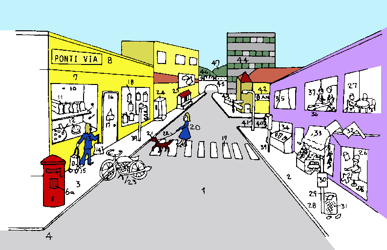

 

<B> U-ci es u strata-vista.  U longi rekti rota via 
</B><I>(1)</I><B> e bi pedi-via </B><I>(2)</I><B>. Prima, skop u laevo 
pedi-via </B><I>(3)</I><B>.</B> 
 

<B> A gono </B><I>(4)</I><B> es u posta-teka </B><I>(5)</I><B>.  U-ci 
hab u stoma </B><I>(6)</I><B> ad-in qi pe bali plu grama.  Infra stoma 
es un horo-tabula </B><I>(6a)</I><B>; qi indika plu kolekti-horo.  
Poste posta-teka es u pani-bo </B><I>(7)</I><B>; e supra u-ci u 
strata-nima ... Ponti via.  
Il es bi pla poste
  </B><I>(оригнально <B>intra</B>)</I><B>
fenestra </B><I>(10)</I><B>.  Epi supra pla es plu
pani </B><I>(11)</I><B>; e epi infra-pla es plu plaka 
</B><I>(12)</I><B>.  Ante boteka u gina </B><I>(13)</I><B> gresi longi 
pedi-via.  Fe fero u boteka-saka </B><I>(14)</I><B> in dextro manu; e 
per laevo manu fe trakto u rota-saka </B><I>(15)</I><B>.  Ma tele u 
porta </B><I>(16)</I><B> fero u karta </B><I>(17)</I><B>.  Ultra porta 
es u fenestra de bibli-bo </B><I>(18)</I><B>.  Prox u-ci es u 
pedi-kruci </B><I>(19)</I><B>; epi qi es u ju-fe </B><I>(20)</I><B> ko 
kanis </B><I>(21)</I><B> ge-liga a duce-fi </B><I>(22)</I><B>.  U ju-fe 
e u kanis nu-fu ki ad-epi pedi-via.  Ante pedi-kruci es ge-parka u moto 
cikla </B><I>(23)</I><B>.  Para bibli-bo es u 'fono-teka 
</B><I>(24)</I><B>; e, ma-tele, u kinema-porta </B><I>(25)</I><B>.</B>

 

<B> Nu, skop u dextro pedi-via </B><I>(2)</I><B>.  Prima, il es u 
vesti-bo </B><I>(26)</I><B>; e supra u-ci u fago-do </B><I>(27)</I><B>.  
Extra vesti-bo es u bus sto </B><I>(28)</I><B> e u 
sto-pali </B><I>(29)</I><B>; qi fero un horo-tabula </B><I>(30)</I><B>.  
A pedi de pali es u rudi-va </B><I>(31)</I><B>.  Supra boteka-fenestra 
es bi insignia </B><I>(32)</I><B>.  Il es bi plus boteka longi u-ci 
dextro latu, u sito-fito-bo
  </B><I>(оригнально <B>kloro-bo</B>)</I><B>
</B><I>(33)</I><B> e u piski-bo </B><I>(34)</I><B>.
Supra u-ci es u kamera-fa </B><I>(35)</I><B>; e supra
sito-fito-bo
  </B><I>(оригнально <B>kloro-bo</B>)</I><B>
es u
denti-ka </B><I>(36)</I><B>.  Pe vide u denti-pe </B><I>(37)</I><B> e u 
pato-pe </B><I>(38)</I><B>.  Extra piski-bo </B><I>(34)</I><B> 
  ad
  </B><I>(ошибка в оригинале <B>es</B>)</I><B>
u singu-fini de pedi-kruci </B><I>(19)</I><B> es plu 
sema-lampa </B><I>(39)</I><B>.  Ma-tele es u 
latu-via </B><I>(40)</I><B>; 
  a proxi 
  </B><I>(ошибка в оригинале <B>e proxo</B>)</I><B>
gono es u strata-lampa </B><I>(41)</I><B>.  A ma-tele gono es u 
banka </B><I>(42)</I><B> e u deiko-via </B><I>(43)</I><B>.  Poste banka 
es u mega domi </B><I>(44)</I><B>, u ponti </B><I>(45)</I><B>; epi qi 
es u trena </B><I>(46)</I><B>; e poste panto-ci es plu 
tele-buna </B><I>(47)</I><B>.</B> 
 
 

<SMALL><I> - стр. 33 - </I></SMALL>

<U>Psalm 23</U>
 

<TABLE BORDER="0" WIDTH="100%" CELLSPACING="0" CELLPADDING="0">
<COLGROUP><COL WIDTH="45%"><COL WIDTH="55%"></COLGROUP>
<TR><TD VALIGN="top"><B> U Teo es mi pastora.  Mi ne fu 
  fami;&nbsp; </B></TD>
  <TD VALIGN="top"> The Lord is my shepherd, I shall not want; </TD></TR>
<TR><TD VALIGN="top"><B> An don a mi u kli in kloro agri.&nbsp; </B></TD>
  <TD VALIGN="top"> He makes me lie down in green pastures. </TD></TR>
<TR><TD VALIGN="top"><B> An duce mi para plu paci aqa;&nbsp; </B></TD>
  <TD VALIGN="top"> He leads me beside still waters. </TD></TR>
<TR><TD VALIGN="top"><B> An fresko mi spiritu.&nbsp; </B></TD>
  <TD VALIGN="top"> He restores my soul. </TD></TR>
<TR><TD VALIGN="top"><B> An duce mi in plu via de veri, pro an 
  nima.&nbsp; </B></TD>
  <TD VALIGN="top"> He leads me in paths of righteousness for his name's 
  sake. </TD></TR>
<TR><TD VALIGN="top"><B> Klu kron mi gresi dia vali de umbra de morta, 
  mi fobo nuli kako;&nbsp; </B></TD>   
  <TD VALIGN="top"> Even though I walk through the valley of the shadow 
  of death, I fear no evil; </TD></TR>
<TR><TD VALIGN="top"><B> Ka Tu es ko mi;&nbsp; </B></TD>
  <TD VALIGN="top"> for Thou art with me; </TD></TR>
<TR><TD VALIGN="top"><B> Tu baci e Tu ovi-ru konsola mi&nbsp; </B></TD>
  <TD VALIGN="top"> Thy rod and Thy staff they comfort me </TD></TR>
<TR><TD VALIGN="top"><B> Tu prepar u tabla pro mi kontra mi plu 
  anti-pe;&nbsp; </B></TD>
  <TD VALIGN="top"> Thou preparest a table before me in the presence of 
  my enemies. </TD></TR>
<TR><TD VALIGN="top"><B> Tu flu olea epi mi kefa; &nbsp; </B></TD>
  <TD VALIGN="top"> Thou anointest my head with oil, </TD></TR>
<TR><TD VALIGN="top"><B> Mi kalici supra flu.&nbsp; </B></TD>
  <TD VALIGN="top"> my cup runneth over. </TD></TR>
<TR><TD VALIGN="top"><B> Sura, agata e pardo fu seqe mi panto di de 
  bio;&nbsp; </B></TD>
  <TD VALIGN="top"> Surely goodness and mercy shall follow me all the 
  days of my life; </TD></TR>
<TR><TD VALIGN="top"><B> E mi fu eko in domi de Teo holo tem.&nbsp; </B></TD>
  <TD VALIGN="top"> and I shall dwell in the house of the Lord for 
  ever. </TD></TR>
</TABLE>
 

<U>деривации</U>
 

<PRE>
<B>teo </B>         Бог               <I> G. ТЕОлогия </I> 
<B>pastora </B>     пастырь           <I> ПАСТыРь </I>
<B>habe </B>        иметь             <I> англ. HAVE, исп. HABER </I> 
<B>pan </B>         все               <I> ПАН-американский </I> 
<B>nece </B>        должен, нужен     <I> англ. NECEssary </I> 
<B>dona </B>        давать            <I> ДОНор </I> 
<B>kli </B>         кровать           <I> G. КЛИника</I> 
<B>duce </B>        возглавлять       <I> англ. introDUCE </I> 
<B>para </B>        около             <I> ПАРАллельный </I> 
<B>veri </B>        правда            <I> ВЕРА </I> 
<B>nima </B>        имя               <I> ИМЯ G. псевдоним  </I> 
<B>klu </B>         даже              <I> англ. inCLUding </I> 
<B>kron </B>        когда             <I> G. ХРОНология </I> 
<B>gresi </B>       гулять            <I> проГРЕСС </I> 
<B>umbra </B>       тень              <I> англ. UMBRella </I> 
<B>kako </B>        зло               <I> G. КАКОфония </I> 
<B>ka </B>          потому что        <I> казуальный </I> 
<B>baci </B>        прут              <I> бацилла</I> 
<B>ovis </B>        овца              <I> ОВца </I> 
<B>anti-pe </B>     враг              <I> АНТИ-ПЕрсона</I> 
<B>flu </B>         течь, лить        <I> англ. FLUent </I>  
<B>kefa </B>        голова            <I> G. CEPHAlic </I> 
<B>kalici </B>      чашка, кубок      <I> англ. CALYX </I> 
<B>agata </B>       добро             <I> G. АГАТА</I> 
<B>seqe </B>        следовать         <I> англ. conSEQUEnce </I> 
<B>pan(to) </B>     все               <I> G. ПАНТОмима</I> 
<B>eko </B>         проживать         <I> G. ЭКОномика</I> 
<B>domi, -do </B>   дом               <I> дом </I> 
<B>holo </B>        целый             <I> ХОЛОкост</I> 
<B>tem </B>         время             <I> англ. TEMporal </I> 

</PRE>

 

<SMALL><I> - стр. 34 - </I></SMALL>

<H2> Шаг 10 </H2>

<TABLE BORDER="0" WIDTH="100%" CELLSPACING="0" CELLPADDING="0">
<COLGROUP><COL WIDTH="45%"><COL WIDTH="55%"></COLGROUP>
<TR><TD><B> forti; fo-&nbsp; </B></TD><TD> очень, сильно </TD></TR>
<TR><TD></TD><TD> </TD></TR>
<TR><TD></TD><TD> </TD></TR>

<TR><TD><B> Id es u forti termo landa.&nbsp; </B></TD>
  <TD> Это очень жаркая страна. </TD></TR> 
<TR><TD><B> U textili habe forti kloro.&nbsp; </B></TD>
  <TD> Одежда глубоко зеленая. </TD></TR> 
<TR><TD><B> u forti interese bibli&nbsp; </B></TD>
  <TD> очень интересная книга </TD></TR> 
<TR><TD><B> Mi fo pa kogita de u-la bibli.&nbsp; </B></TD>
  <TD> Я с напряжением думал об этой книге. </TD></TR> 
<TR><TD><B> Mi fo volu visita Cina.&nbsp; </B></TD>
  <TD> Я очень сильно хочу посетить Китай. </TD></TR> 
<TR><TD VALIGN="top"><B> Mi doxo; id es u forti interese 
  landa.&nbsp; </B></TD>
  <TD VALIGN="top"> Я уверен, это очень интересная страна. </TD></TR> 
<TR><TD><B> Na pa eko forti proxi Paris.&nbsp; </B></TD>
  <TD> Мы жили очень близко от Парижа. </TD></TR> 
<TR><TD><B> An pa veni a Paris per trena.&nbsp; </B></TD>
  <TD> Он приехал в Париж на поезде.. </TD></TR> 
<TR><TD><B> An pa trena a Paris.&nbsp; </B></TD>
  <TD> Он "поезднился" в Париж. </TD></TR> 
<TR><TD><B> An pa trena ab London.&nbsp; </B></TD>
  <TD> Он выехал на поезде из Лондона. </TD></TR> 
<TR><TD><B> Na pa unio kon an a tri horo.&nbsp; </B></TD>
  <TD> Мы встретили (по договоренности) его в три часа. </TD></TR> 
<TR><TD VALIGN="top"><B> Na pa inkontra 
  </B><I>(оригинально <B>enkontra</B>)</I><B>
  fe a tri horo.&nbsp; </B></TD>
  <TD VALIGN="top"> Встретили ее (случайно) в три часа. </TD></TR> 
<TR><TD><B> Fe pa stude plu Glosa verba.&nbsp; </B></TD>
  <TD> Она изучала словарь Глосы. </TD></TR> 
<TR><TD VALIGN="top"><B> Per Glosa 1000 pe pote grafo alo dice de panto
    </B><I>(оригинально <B>de ali tema</B>)</I><B>
  tema.&nbsp; </B></TD>
  <TD VALIGN="top"> Используя Глосу 1000, ы можете писать или говорить на любую тему. </TD></TR> 
<TR><TD VALIGN="top"><B> Glosa es fo kongru pro plu puta-me.&nbsp; </B></TD>
  <TD VALIGN="top"> Глоса очень подходит для компьютеров. </TD></TR> 
<TR><TD VALIGN="top"><B> Plura Glosa-pe komunika per puta-me 
  nexu.&nbsp; </B></TD>
  <TD VALIGN="top"> Некоторые люди говорящие на Глосе общаются с помощью компьютерных сетей. </TD></TR> 
</TABLE> 
 

<I> ... [пропущено: Словарь] </I>

  

<I> Задание 10 </I>

<TABLE BORDER="0" WIDTH="100%" CELLSPACING="0" CELLPADDING="0">
<COLGROUP><COL WIDTH="45%"><COL WIDTH="55%"></COLGROUP>
<TR><TD><B> Tu veni ex qo landa?&nbsp; </B></TD>
  <TD> Из какой ты страный? </TD></TR> 
<TR><TD VALIGN="top"><B> Qe tu ski il es plura trena ab Roma a 
  Milano?&nbsp; </B></TD>
  <TD VALIGN="top"> Ты знаешь, что есть несколько поездов из Рима в Милан. </TD></TR> 
<TR><TD VALIGN="top"><B> In tu landa pe dice qo numera lingua?&nbsp; </B></TD>
  <TD VALIGN="top"> На скольких языках говорят в твоей стране? </TD></TR> 
<TR><TD><B> Na pa komunika per Glosa.&nbsp; </B></TD>
  <TD> Мы общаемся на Глосе. </TD></TR> 
<TR><TD VALIGN="top"><B> U munda auxi-lingua es nece pro munda 
  komunika.&nbsp; </B></TD>
  <TD VALIGN="top"> Мировой Вспомогательный Язык необходим для мирового общения. </TD></TR> 
<TR><TD VALIGN="top"><B> Plu Glosa verba es fo-facili de 
  memo.&nbsp; </B></TD>
  <TD VALIGN="top"> Слова Глосы очень легки для запоминания. </TD></TR> 
<TR><TD></TD><TD> </TD></TR>

<TR><TD><B> An pa trena a London.&nbsp; </B></TD>
  <TD> Он поехал в Лондон на поезде. </TD></TR> 
<TR><TD><B> Fe pa stude forti.&nbsp; </B></TD>
  <TD> Она учится усердно. </TD></TR> 
<TR><TD><B> Mu pa face musika per piano.&nbsp; </B></TD>
  <TD> Они делали музыку, используя фортепиано. </TD></TR> 
<TR><TD><B> Pe kuko per kuko-me.&nbsp; </B></TD>
  <TD> Мы готовим на плите. </TD></TR> 
<TR><TD><B> Mi pote dice Glosa fo facili.&nbsp; </B></TD>
  <TD> Я могу с большой легкостью говорить на Глосе. </TD></TR> 
<TR><TD VALIGN="top"><B> Pe pote facili komunika in Glosa per 
  puta-me.&nbsp; </B></TD>
  <TD VALIGN="top"> Люди могут легко общаться на Глосе при помощи компьюютеров. </TD></TR> 
<TR><TD VALIGN="top"><B> U-ci es kausa Glosa habe zero no-facili 
  gramatika; e singu verba habe solo mo semani.&nbsp; </B></TD> 
  <TD VALIGN="top"> Это потому, что Глоса не имеет запутанной грамматики и каждое слово имеет только одно значение. </TD></TR> 
<TR><TD><B> U-ci verba semani qo?&nbsp; </B></TD>
  <TD> Что значит это слово? </TD></TR> 
</TABLE> 

<SMALL><I> - стр. 35 - </I></SMALL>

<U>больница</U>
 

<I> ... [пропущено: picture with a hospital scene] </I> 
<I> ... [пропущено: word list to the hospital scene picture] </I> 

 

<SMALL><I> - стр. 36 - </I></SMALL>

Больница -  <U>Несколько Фраз</U>
 

<TABLE BORDER="0" WIDTH="100%" CELLSPACING="0" CELLPADDING="0">
<COLGROUP><COL WIDTH="45%"><COL WIDTH="55%"></COLGROUP>
<TR><TD><B> Mi ne este sani.&nbsp; </B></TD>
  <TD> Я не здоров. </TD></TR> 
<TR><TD><B> Ge-turba gastro. Kef algo.&nbsp; </B></TD>
  <TD> Расстройство желудка. Головная боль. </TD></TR> 
<TR><TD><B> Sito-toxi. Hipertermia.&nbsp; </B></TD>
  <TD> Пищевое отравление. Солнечный удар. </TD></TR> 
<TR><TD><B> Fe pa lose konski.&nbsp; </B></TD>
  <TD> Она упала в обморок. </TD></TR> 
<TR><TD><B> Il pa es u mal-acide.&nbsp; </B></TD>
  <TD> Был несчастный случай. </TD></TR> 
<TR><TD><B> Fe es mali ge-busti.&nbsp; </B></TD>
  <TD> Она ужасно обожглась. </TD></TR> 
<TR><TD><B> An habe u ge-frakti braki.&nbsp; </B></TD>
  <TD> У него сломана рука </TD></TR> 
<TR><TD><B> Place kla u pato-vagona.&nbsp; </B></TD>
  <TD> Пожалуйста вызовите "Скорую помощь".. </TD></TR> 
<TR><TD><B> Qe il es u medika-pe proxi ci?&nbsp; </B></TD>
  <TD> Есть здесь поблизости доктор? </TD></TR> 
<TR><TD><B> Qe, mi pote habe u visita kron?&nbsp; </B></TD>
  <TD> Могу я договориться о времени прихода? </TD></TR> 
<TR><TD><B> Qe, tu habe u bandage?&nbsp; </B></TD>
  <TD> У вас есть бинт? </TD></TR> 
<TR><TD VALIGN="top"><B> loka unktu-ma
  </B><I>(ошибка в оригинале <B>ungu-ma</B>)</I><B>
 epi vulne&nbsp; </B></TD>
  <TD VALIGN="top"> накладывайте мазь на рану</TD></TR> 
<TR><TD><B> Qe u-ci medika-ma funktio?&nbsp; </B></TD>
  <TD> Это лекарство эффективно? </TD></TR> 
<TR><TD><B> Seis u botilia pre uti.&nbsp; </B></TD>
  <TD> Встряхните бутылку перед употреблением.; "Перед употреблением встряхивать". </TD></TR> 
<TR><TD VALIGN="top"><B> Bibe bi spatula de medika-ma bi kron singu di. 
  </B><I>(оригинально <B>Bibe bi spatula-ple bi kron u di.</B>)</I>&nbsp; 
  </TD>
  <TD VALIGN="top"> Принимайте по полной ложке два раза в день. </TD></TR> 
<TR><TD><B> po / pre / tem vora&nbsp; </B></TD>
  <TD> после / перед / во время еды </TD></TR> 
<TR><TD VALIGN="top"><B> U maxi proxi medika-ma-bo es qo-lo? 
    </B><I>(оригинально <B>Qo-lo u maxi proxi kemi-bo?</B>)</I>&nbsp; 
    </TD>
  <TD VALIGN="top"> Где ближайшая аптека? </TD></TR> 
</TABLE>
 
 
 

<U>Письмо</U>
 

<B> Karo Andrew, </B>

<B> Qo anua tu fu ki ad India?  Mi doxo; India es u fo interese landa. 
Mi fo amo plu India textili; mu habe poli kroma.  Qo metri tem tu fu 
eko la?  E tu fu eko in qo urba? </B>
 

<B> Il es poli komunika problema in India; mu habe bi-penta duce-lingua; 
e plus-co 1,600 loka lingua.  Solo 40 % India-pe dice Hindi; qi es u 
duce-lingua de u-la landa. </B>
 

<B> Nu mi respone a plu qestio de tu: </B>
 

<B> Mi kambio plu grama ko tetra Glosa-pe; mo andro in Afrika, bi 
Cina-fe, e mo France gina.  Mi posi visita fe u prima kron fu anua. 
Fe eko fo proxi Paris. </B>
 

<B> Mi doxo; Glosa fu auxi munda kon-ergo e internatio komunika.  U 
Munda-lingua es fo-nece.  U-ci es u kausa; mi pa proto uti Glosa.  Il 
es poli kilo lingua in Munda; e pe ne pote gene ski de panto-mu!  Mi 
komunika per Glosa ex pre nona meno.  Solo mo di po mi pa gene 
Glosa&nbsp;1000 verba lista; mi pa proto kambio plu Glosa grama.  Po proxi 
bi meno mi pa proto stude Glosa&nbsp;6000; nu mi pote grafo, dice e lekto 
u-la lingua fo flu facili.  Mi amo id forti; e doxo; id es u fo eufoni 
lingua. </B>
 

<B> Poli saluta </B>
 

<B> Irene </B>
 
 

 

<SMALL><I> - стр. 37 - </I></SMALL>

<H2> Шаг 11 </H2>

<TABLE BORDER="0" WIDTH="100%" CELLSPACING="0" CELLPADDING="0">
<COLGROUP><COL WIDTH="45%"><COL WIDTH="55%"></COLGROUP>
<TR><TD><B> debi&nbsp; </B></TD><TD> следует, должен </TD></TR>
<TR><TD></TD><TD> </TD></TR>
<TR><TD></TD><TD> </TD></TR>

<TR><TD><B> Mi pa noku mi pedi.&nbsp; </B></TD>
  <TD> Я ударился ногой. </TD></TR> 
<TR><TD><B> Mi ne pote gresi.&nbsp; </B></TD>
  <TD> Я не могу гулять. </TD></TR> 
<TR><TD VALIGN="top"><B> Qe tu permito; mi habe u vitri-va 
  </B><I>(оригинально только <B>vitri</B>)</I><B>
  ?&nbsp; </B></TD>
  <TD VALIGN="top"> Могу я взять стакан? </TD></TR> 
<TR><TD><B> No! Mi ne permito; tu habe mo.&nbsp; </B></TD>
  <TD> Нет! У тебя есть один. </TD></TR> 
<TR><TD><B> Mi ne dona permito.&nbsp; </B></TD>
  <TD> Я не позволяю. </TD></TR> 
<TR><TD VALIGN="top"><B> Fe pa gene permito de resta in u-la landa tem 
  mo anua.&nbsp; </B></TD>
  <TD VALIGN="top"> Она получила разрешение, остаться в стране на один год. </TD></TR> 
<TR><TD VALIGN="top"><B> Mi pa debi visita fe.&nbsp; </B></TD>
  <TD VALIGN="top"> Я должен был посетить ее. </TD></TR> 
<TR><TD VALIGN="top"><B> Tu debi buli un hidro pre bibe id.&nbsp; </B></TD>
  <TD VALIGN="top"> Вы должны вскипятить воду, перед тем, как пить ее. </TD></TR> 
<TR><TD VALIGN="top"><B> Singu manu habe penta digi.&nbsp; </B></TD>
  <TD VALIGN="top"> На каждой руке есть 5 пальцев. </TD></TR> 
<TR><TD VALIGN="top"><B> Singu tabla 
  </B><I>(оригинально <B>Panto tabla</B>, но это было бы более точно: 
  "Все столы ... ")</I><B>
   habe tetra poda.&nbsp; </B></TD>
  <TD VALIGN="top"> Каждый стол имеет четыре ножки.  </TD></TR> 
<TR><TD VALIGN="top"><B> Solo mo persona pote dice Glosa.&nbsp; </B></TD>
  <TD VALIGN="top"> Только один человек может говорить на Глосе. </TD></TR> 
<TR><TD><B> U-la andro pote dice solo Glosa.&nbsp; </B></TD>
  <TD> Этот мужчина говорит только на ГлосеThat man can speak only Glosa. </TD></TR> 
<TR><TD VALIGN="top"><B> Na pa cerko panto-lo; sed ne pa pote detekti 
  mu.&nbsp; </B></TD>
  <TD VALIGN="top"> Мы смотрели везде, но не смогли найти их. </TD></TR> 
<TR><TD><B> Mu debi es in mi kamera.&nbsp; </B></TD>
  <TD> Они должны быть в моей комнате. </TD></TR> 
<TR><TD><B> Mi visita fe singu di-tri.&nbsp; </B></TD>
  <TD> Я посещаю ее каждый вторник. </TD></TR> 
<TR><TD><B> Mi visita an singu tri di.&nbsp; </B></TD>
  <TD> Я посещаю его каждые три дня. </TD></TR> 
</TABLE>
 
 

<I> ... [пропущено: Словарь] </I>

  

<I> Задание 11 </I>

<TABLE BORDER="0" WIDTH="100%" CELLSPACING="0" CELLPADDING="0">
<COLGROUP><COL WIDTH="45%"><COL WIDTH="55%"></COLGROUP>
<TR><TD><B> Qe tu pote dice Glosa?&nbsp; </B></TD>
  <TD> Вы можете говорить на Глосе? </TD></TR> 
<TR><TD VALIGN="top"><B> Dona bi karta a singu sporta-pe.&nbsp; </B></TD>
  <TD VALIGN="top"> Дайте две карты каждому играку. </TD></TR> 
<TR><TD VALIGN="top"><B> Qe tu pote lava bi-ci vitri-va 
  </B><I>(оригинально только <B>vitri</B>)</I><B>, 
  place?&nbsp; </B></TD>
  <TD VALIGN="top"> Пожалуйсте, можете вы помыть эти два стакана? </TD></TR> 
<TR><TD VALIGN="top"><B> Panto-pe debi bibe tri mega vitri-va
  </B><I>(оригинально только <B>vitri</B>)</I><B>
  de hidro singu di.&nbsp; </B></TD>
  <TD VALIGN="top"> Каждый должен выпивать три больших стакана воды каждый день. </TD></TR> 
<TR><TD VALIGN="top"><B> Qe tu permito mi sporta tenis nu-di?&nbsp; </B></TD>
  <TD VALIGN="top"> Могу я играть в теннис сегодня? </TD></TR> 
<TR><TD><B> Tu volu bibe qo-ma?&nbsp; </B></TD>
  <TD> Что бы ты хоткл выпить? </TD></TR> 
<TR><TD VALIGN="top"><B> Qe mi lice habe u tasa de tea, 
  place?&nbsp; </B></TD>
  <TD VALIGN="top"> Можно мне чашку чая, пожалуйста? </TD></TR> 
<TR><TD><B> Fe pa debi dice a tu de id.&nbsp; </B></TD>
  <TD> Она должна была сказать тебе об этом. </TD></TR> 
<TR><TD VALIGN="top"><B> Qe tu doxo; mi debi ki a medika-pe?&nbsp; </B></TD>
  <TD VALIGN="top"> Вы думаете, я должен идти к доктору? </TD></TR> 
<TR><TD VALIGN="top"><B> ge-va frukti 
  </B><I>(оригинально <B>va frukti</B>)</I>&nbsp; </TD>
  <TD VALIGN="top"> консервировать фрукты </TD></TR> 
<TR><TD></TD><TD> </TD></TR>

<TR><TD VALIGN="top"><B> An es pato; mi debi visita an.&nbsp; </B></TD>
  <TD VALIGN="top"> Он болен, я должен посетить его. </TD></TR> 
<TR><TD VALIGN="top"><B> U vitri-va 
  </B><I>(оригинально только <B>vitri</B>)</I><B>
  pa es ge-noku.&nbsp; </B></TD>
  <TD VALIGN="top"> Стакан разбился. </TD></TR> 
<TR><TD VALIGN="top"><B> Qe tu permito mi uti tu sue-me?&nbsp; </B></TD>
  <TD VALIGN="top"> Могу я использовать вашу швейную машину? </TD></TR> 
<TR><TD><B> U-ci tasa habe zero manu-ra.&nbsp; </B></TD>
  <TD> У этой чашки нет ручки. </TD></TR> 
<TR><TD><B> Id pa pluvi un holo di.&nbsp; </B></TD>
  <TD> Дождь шел целый день. </TD></TR> 
<TR><TD VALIGN="top"><B> Tem na pa es in France; id pa pluvi singu 
  di.&nbsp; </B></TD>
  <TD VALIGN="top"> Пока мы были во Франции дождь шел каждый день. </TD></TR> 
<TR><TD VALIGN="top"><B> Tu debi seka u-ci fito singu 
  sperma-tem.&nbsp; </B></TD>
  <TD VALIGN="top"> Ты должен подрезать это растение каждую осень. </TD></TR> 
<TR><TD><B> Tu ne pa debi bibe id.&nbsp; </B></TD>
  <TD> Тебе не следовало выпивать это. </TD></TR> 
<TR><TD><B> Id es mi debi de auxi tu.&nbsp; </B></TD>
  <TD> Это мой долг помочь тебе. </TD></TR> 
<TR><TD><B> Frukti-va. Ami-uti.&nbsp; </B></TD>
  <TD> Сосуд с фруктами. Дружески с пользователем. </TD></TR> 
</TABLE> 
 

<SMALL><I> - стр. 38 - </I></SMALL>

<U>Коммуникации</U>
 

<I> ... [пропущено: picture with things about communication] </I> 
<I> ... [пропущено: word list to the picture] </I> 

 

<SMALL><I> - стр. 39 - </I></SMALL>

Коммуникации-  <U>Несколько фраз</U>
 

<TABLE BORDER="0" WIDTH="100%" CELLSPACING="0" CELLPADDING="0">
<COLGROUP><COL WIDTH="45%"><COL WIDTH="55%"></COLGROUP>
<TR><TD><B> viagia peri munda&nbsp; </B></TD>
  <TD> путешествовать по миру </TD></TR> 
<TR><TD><B> demo transporta&nbsp; </B></TD>
  <TD> общественный транспорт </TD></TR> 
<TR><TD><B> bali u raketa&nbsp; </B></TD>
  <TD> запустить ракету </TD></TR> 
<TR><TD VALIGN="top"><B> petitio / mite info&nbsp; </B></TD>
  <TD VALIGN="top"> запросить
  <I>(оригинально "получить", но это было бы <B>gene</B>)</I>
   / отправить информацию</TD></TR> 
<TR><TD><B> skop u video&nbsp; </B></TD>
  <TD> смотреть видео </TD></TR> 
<TR><TD><B> registra epi kaseta&nbsp; </B></TD>
  <TD> записать на кассету </TD></TR> 
<TR><TD><B> telefono 
  </B><I>(оригинально <B>face u foni-kla</B>)</I>&nbsp; </TD>
  <TD> позвонить по телефону </TD></TR> 
<TR><TD><B> kompos u numera&nbsp; </B></TD>
  <TD> набирать номер </TD></TR> 
<TR><TD><B> komposi / kla toni&nbsp; </B></TD>
  <TD> набора/звонка тон </TD></TR> 
<TR><TD><B> line aktivi&nbsp; </B></TD>
  <TD> занятая линия </TD></TR> 
<TR><TD><B> pende&nbsp; </B></TD>
  <TD> повесить телефонную трубку </TD></TR> 
<TR><TD><B> ge-seka&nbsp; </B></TD>
  <TD> отрезать </TD></TR> 
<TR><TD><B> Inter-urba kla. Loka kla.&nbsp; </B></TD>
  <TD> Городской звонок. Местный звонок. </TD></TR> 
<TR><TD><B> Nexi-taba. Nexi-do.&nbsp; </B></TD>
  <TD> Селекторный стол. Обменный пункт. </TD></TR> 
<TR><TD><B> numera-ofici&nbsp; </B></TD>
  <TD> телефонный справочник </TD></TR> 
<TR><TD><B> linqi mesage epi repli-me&nbsp; </B></TD>
  <TD> оставить сообщение на автоответчик </TD></TR> 
<TR><TD><B> Dice po toni.&nbsp; </B></TD>
  <TD> Говорить после сигнала. </TD></TR> 
<TR><TD><B> ge-registra mesage&nbsp; </B></TD>
  <TD> записанное сообщение </TD></TR> 
<TR><TD VALIGN="top"><B> tabla-publika
  </B><I>(ошибка в оригинале: <B>taba-publika</B>)</I>&nbsp; </TD>
  <TD VALIGN="top"> настольная издательская система </TD></TR> 
<TR><TD><B> Klavi in. Printa ex.&nbsp; </B></TD>
  <TD> вводить с клавиатуры. распечатывать. </TD></TR> 
<TR><TD><B> format u disko 
 </B><I>(оригинально <B>diska</B>)</I>&nbsp; </TD>
  <TD> форматировать диск </TD></TR> 
<TR><TD><B> uti u programa&nbsp; </B></TD>
  <TD> запустить программу </TD></TR> 
<TR><TD><B> salva info&nbsp; </B></TD>
  <TD> сохранить информацию </TD></TR> 
<TR><TD><B> apri u dosie&nbsp; </B></TD>
  <TD> открыть файл </TD></TR> 
<TR><TD><B> bali fax a ...&nbsp; </B></TD>
  <TD> отправить факс (кому) ... </TD></TR> 
<TR><TD><B> sekuri kopi&nbsp; </B></TD>
  <TD> сделать резервную копию </TD></TR> 
<TR><TD><B> ma-dinami&nbsp; </B></TD>
  <TD> сделать апгрейд системы </TD></TR> 
<TR><TD><B> tele-konference&nbsp; </B></TD>
  <TD> принять участие в теле-конференции </TD></TR> 
<TR><TD><B> duce un publika kampania&nbsp; </B></TD>
  <TD> начать рекламную кампанию </TD></TR> 
<TR><TD VALIGN="top"><B> Place adi mi nima a tu posta 
  lista. &nbsp; </B></TD>
  <TD VALIGN="top"> Пожалуйста добавьте мое имя в ваш почтовый список. </TD></TR> 
<TR><TD VALIGN="top"><B> Plu norma ofici horo es ex ok tri-ze a 
  mo&nbsp;seti tri-ze.&nbsp; </B></TD>
  <TD VALIGN="top"> Нормальные оффисные часы с 8.30 до 17.30. </TD></TR> 
<TR><TD><B> Mi fu es in ofici holo di.&nbsp; </B></TD>
  <TD> Я буду в оффисе весь день. </TD></TR> 
</TABLE> 
 

 

<SMALL><I> - стр. 40 - </I></SMALL>

<H2> Шаг 12 </H2>

<TABLE BORDER="0" WIDTH="100%" CELLSPACING="0" CELLPADDING="0">
<COLGROUP><COL WIDTH="45%"><COL WIDTH="55%"></COLGROUP>
<TR><TD><B> ma ... de&nbsp; </B></TD><TD> более ... чем </TD></TR> 
<TR><TD><B> mei ... de&nbsp; </B></TD><TD> менее ... чем </TD></TR> 
<TR><TD></TD><TD> </TD></TR>
<TR><TD></TD><TD> </TD></TR>

<TR><TD><B> Fe pa lava plura tasa.&nbsp; </B></TD>
  <TD> Она вымыла несколько чашек. </TD></TR> 
<TR><TD><B> Mi habe mero plaka.&nbsp; </B></TD>
  <TD> У меня есть кусок пирога. </TD></TR> 
<TR><TD><B> Mi ma amo plu felis de plu kanis.&nbsp; </B></TD>
  <TD> Я предпочитаю кошек собакам. </TD></TR> 
<TR><TD><B> U-ci avi es ma mega de u-la.&nbsp; </B></TD>
  <TD> Эта птица больше, чем та. </TD></TR> 
<TR><TD><B> Id es ma-termo nu-di de pa-di.&nbsp; </B></TD>
  <TD>  Сегодня теплее, чем вчера. </TD></TR> 
<TR><TD><B> U-ci flori es ma-kali de u-la.&nbsp; </B></TD>
  <TD> Этот цветок красивее того. </TD></TR> 
<TR><TD><B> U-ci via es mei lati de u-la.&nbsp; </B></TD>
  <TD> Эта дорога уже той. </TD></TR> 
<TR><TD><B> Il pa es mei pluvi nu-di.&nbsp; </B></TD>
  <TD> Сегодня было меньше дождя. </TD></TR> 
<TR><TD VALIGN="top"><B> U-ci verba habe un iso semani de u-la 
  verba.&nbsp; </B></TD>
  <TD VALIGN="top"> Это слово имеет то же значение, что и то слово. </TD></TR> 
<TR><TD VALIGN="top"><B> An ne pa pote memo plu verba seqe-co an pa 
  merka u verba-bibli. </B></TD>
  <TD VALIGN="top"> Он не мог запомнить слова, поэтому он купил словарь. </TD></TR> 
<TR><TD VALIGN="top"><B> Fe ne pa ki ex; vice-co fe pa resta 
  intra.&nbsp; </B></TD>
  <TD VALIGN="top">Она не ушла. Наоборот, она осталась внутри.  </TD></TR> 
<TR><TD VALIGN="top"><B> Un hidro pa habe fo frigi; anti-co an pa ki 
  nekto.&nbsp; </B></TD>
  <TD VALIGN="top"> Вода была очень холодна, однако он отправился плавать. </TD></TR> 
<TR><TD VALIGN="top"><B> Fe volu komunika ko poli persona in poli 
  hetero landa; seqe-co fe stude e uti Glosa.&nbsp; </B></TD>
  <TD VALIGN="top"> Она хочет общаться со многими людьми во многих странах, поэтому она учит и использует Глосу. </TD></TR> 
<TR><TD><B> Il es ma de 5000&nbsp;lingua. &nbsp; </B></TD>
  <TD> Существует более 5000&nbsp;языков. </TD></TR> 
<TR><TD><B> U deino di!&nbsp; </B></TD>
  <TD> Что за ужасный день! </TD></TR> 
<TR><TD><B> Qe tu habe mero grafo-liqi?&nbsp; </B></TD>
  <TD> У тебя есть чернила? </TD></TR> 
<TR><TD><B> Penite, mi habe zero.&nbsp; </B></TD>
  <TD> Извините, совсем нет. </TD></TR> 
</TABLE> 
 

<I> ... [пропущено: Vocabulary] </I>

  

<I> Задание 12 </I>

<TABLE BORDER="0" WIDTH="100%" CELLSPACING="0" CELLPADDING="0">
<COLGROUP><COL WIDTH="45%"><COL WIDTH="55%"></COLGROUP>
<TR><TD><B> U-ci flori es ma-pusi de u-la&nbsp; </B></TD>
  <TD> Этот цветок меньше того. </TD></TR> 
<TR><TD VALIGN="top"><B> Mi habe iso numera moneta de tu.&nbsp; </B></TD>
  <TD VALIGN="top"> У меня столько же монет, сколько и у вас. </TD></TR> 
<TR><TD><B> Fe pa gresi minus tende.&nbsp; </B></TD>
  <TD> Она гуляла бесцельно. </TD></TR> 
<TR><TD><B> Qo anua tu pa ki extra-landa?&nbsp; </B></TD>
  <TD> Когда ты ездил за границу? </TD></TR> 
<TR><TD><B> An habe ma plaka de mi.&nbsp; </B></TD>
  <TD> У него больше кексов, чем у меня. </TD></TR> 
<TR><TD><B> U-ci viki es ma-pusi de u-la.&nbsp; </B></TD>
  <TD> Эта деревня меньше той. </TD></TR> 
<TR><TD><B> Qe tu habe u ma-pusi teka?&nbsp; </B></TD>
  <TD> У тебя есть коробка по-меньше? </TD></TR> 
<TR><TD></TD><TD> </TD></TR>

<TR><TD><B> U-ci viki es ma mega de u-la.&nbsp; </B></TD>
  <TD> Эта деревня больше той. </TD></TR> 
<TR><TD VALIGN="top"><B> Plu tende de GEO
  </B><I>(ориинально написано <B>Geo</B>)</I><B>
  es qo?&nbsp; </B></TD>
  <TD VALIGN="top"> Каковы цели ГОО? </TD></TR> 
<TR><TD VALIGN="top"><B> Glosa dona semani a plu internatio verba de 
 skience e teknologi.&nbsp; </B></TD>
  <TD VALIGN="top"> Глоса дает значения международным словам науки и технологии. </TD></TR> 
<TR><TD><B> Glosa soni homo Italiano.&nbsp; </B></TD>
  <TD> Глоса звучит как итальянский. </TD></TR> 
<TR><TD VALIGN="top"><B> Fe es u Glosa nexu-pe pro Napoli.&nbsp; </B></TD>
  <TD VALIGN="top"> She is a Glosa link-person for Naples. </TD></TR> 
<TR><TD><B> valuta-me&nbsp; </B></TD>
  <TD> cash register </TD></TR> 
</TABLE> 
 

<SMALL><I> - стр. 41 - </I></SMALL>

<U>Tools</U>
 

<I> ... [пропущено: picture with tools] </I> 
<I> ... [пропущено: word list to the picture] </I> 

 

<SMALL><I> - стр. 42 - </I></SMALL>

Инструменты -  <U>Несколько фраз</U>
 

<TABLE BORDER="0" WIDTH="100%" CELLSPACING="0" CELLPADDING="0">
<COLGROUP><COL WIDTH="45%"><COL WIDTH="55%"></COLGROUP>
<TR><TD><B> Male un aku. Fix un oklu.&nbsp; </B></TD>
  <TD> забивать гвоздь. Закрутить гайку. </TD></TR> 
<TR><TD><B> ki ana / ki kata u skala&nbsp; </B></TD>
  <TD> подниматься/ спускаться по лестнице </TD></TR> 
<TR><TD><B> fix u skeleto&nbsp; </B></TD>
  <TD> поставить подмости </TD></TR> 
<TR><TD><B> non-helika uno-ra&nbsp; </B></TD>
  <TD> отвинчивать что-то </TD></TR> 
<TR><TD VALIGN="top"><B> sera ligni te face bi semi
  </B><I>(оригинально <B>semi u mero ligni</B>)</I>&nbsp; </TD>
  <TD VALIGN="top"> увидеть кусок дерева наполовину</TD></TR> 
<TR><TD><B> fac u fora in metali pla&nbsp; </B></TD>
  <TD> сделать плиту в металическом бруске</TD></TR> 
<TR><TD><B> akuto u cise-ru&nbsp; </B></TD>
  <TD> точить резец</TD></TR> 
<TR><TD><B> apo u ge-oxidi aku&nbsp; </B></TD>
  <TD> вытащить ржавый гвоздь </TD></TR> 
<TR><TD VALIGN="top"><B> lustra / vernisa u ligni 
  </B><I>(оригинально <B>poli / verni u ligni</B>)</I>&nbsp; </TD>
  <TD VALIGN="top"> полировать/ лакировать дерево </TD></TR> 
<TR><TD><B> fixa plu tegula epi mura&nbsp; </B></TD>
  <TD> положить плитку на стену </TD></TR> 
<TR><TD><B> diluti u kroma&nbsp; </B></TD>
  <TD> разжижать краску </TD></TR> 
<TR><TD><B> lav u brosa&nbsp; </B></TD>
  <TD> мыть кисть </TD></TR> 
<TR><TD><B> kroma u domi-extra&nbsp; </B></TD>
  <TD> красить внешнюю часть дома </TD></TR> 
<TR><TD><B> sek u vitri&nbsp; </B></TD>
  <TD> резать стекло</TD></TR> 
<TR><TD><B> diplo vitri&nbsp; </B></TD>
  <TD> двойное стекло </TD></TR> 
<TR><TD><B> leva plu pedi-lo taba&nbsp; </B></TD>
  <TD> поднимать доски пола </TD></TR> 
<TR><TD><B> qadra e pende u pikto&nbsp; </B></TD>
  <TD> обрамлять и вешать картину </TD></TR> 
<TR><TD><B> fixa e papira plu pla&nbsp; </B></TD>
  <TD> прикрепить и выстроить в линию доски </TD></TR> 
<TR><TD><B> insul u stego-ka&nbsp; </B></TD>
  <TD> изолировать чердак </TD></TR> 
<TR><TD><B> fixa centra termo sistema&nbsp; </B></TD>
  <TD> учтановить центральное отопление</TD></TR> 
<TR><TD><B> skalo / fosi un horti&nbsp; </B></TD>
  <TD> разрыхлять/ раскапывать сад</TD></TR> 
<TR><TD><B> face u via / flori area&nbsp; </B></TD>
  <TD> сделать тропинку/ цветочную клумбу</TD></TR> 
<TR><TD><B> face u mura&nbsp; </B></TD>
  <TD> построить стену </TD></TR> 
<TR><TD><B> repar u porta&nbsp; </B></TD>
  <TD> починить ворота </TD></TR> 
<TR><TD><B> repar u fragma&nbsp; </B></TD>
  <TD> починить забор </TD></TR> 
<TR><TD><B> apo u trombo&nbsp; </B></TD>
  <TD> удалить блокатор</TD></TR> 
<TR><TD><B> fix u kanali&nbsp; </B></TD>
  <TD> поставить водосток </TD></TR> 
<TR><TD><B> puri u kanali&nbsp; </B></TD>
  <TD> прочистить водосток </TD></TR> 
<TR><TD><B> tekto u domi&nbsp; </B></TD>
  <TD> построить дом </TD></TR> 
<TR><TD><B> no-face / re-neo u domi&nbsp; </B></TD>
  <TD> разрушить / перестроить дом</TD></TR> 
</TABLE> 
 
 
 

<U>Письмо</U>

<B> Karo Irene, </B>
 

<B> Gratia de tu interese grama.  Mi ne pa ski; mu dice 1,600 hetero 
lingua in India.  U mega numera!  Mi visita India u-ci anua; e fu eko 
la tem mo-tetra di.  Mi ki meno-nona a Bombai.  Plus, mi fu ki a plu 
hetero urba e viki; e vide oligo famo-do.  Mi spe spende mero tem stude 
plu loka fito. </B>
 

<B> Mi pa proto stude plu Glosa verba; ka mi gene sko de ekologi e 
fitologi; e Glosa dona semani a plu verba de bi-ci skience.  Plu Glosa 
verba, plus-co, auxi pe logi plu terminologi de panto skience.  Plu 
Glosa verba exist in panto duce Euro-lingua; ka-co Glosa auxi pe te 
memo plu-ci Euro verba-lista. </B>
 

<B> Po stude plu verba tem oligo setimana; mi pa proto stude u lingua 
ko ma-lati tende de komunika ko plu persona in plu hetero landa.  Po-co 
mi pa proto kambio plu grama ko tu e plu hetero Glosa-dice persona in 
plu hetero landa. </B>
 

<B> Poli ami saluta, </B>
 

<B> Andrew </B>
 
 

 

<SMALL><I> - стр. 43 - </I></SMALL>

<H2> Шаг 13 </H2>

<TABLE BORDER="0" WIDTH="100%" CELLSPACING="0" CELLPADDING="0">
<COLGROUP><COL WIDTH="45%"><COL WIDTH="55%"></COLGROUP>
<TR><TD><B> se&nbsp; </B></TD><TD> oneself </TD></TR> 
<TR><TD><B> auto&nbsp; </B></TD><TD> one's own </TD></TR> 
<TR><TD></TD><TD> </TD></TR>
<TR><TD></TD><TD> </TD></TR>

<TR><TD><B> Fe pa lava plu vesti.&nbsp; </B></TD>
  <TD> She washed the clothes. </TD></TR> 
<TR><TD><B> Fe pa lava plu vesti de auto.&nbsp; </B></TD>
  <TD> She washed her own clothes. </TD></TR> 
<TR><TD><B> Fe auto pa lava plu vesti.&nbsp; </B></TD>
  <TD> She herself washed the clothes. </TD></TR> 
<TR><TD><B> Fe pa lava se.&nbsp; </B></TD>
  <TD> She washed herself. </TD></TR> 
<TR><TD><B> Mu pa noku se.&nbsp; </B></TD>
  <TD> They hurt themselves. </TD></TR> 
<TR><TD><B> Mi qestio se.&nbsp; </B></TD>
  <TD> I wonder (= ask myself) </TD></TR> 
<TR><TD><B> Mu auxi alelo.&nbsp; </B></TD>
  <TD> They help each other. </TD></TR> 
<TR><TD><B> Panto vi gresi longi pedi-via.&nbsp; </B></TD>
  <TD> You all walk along the pavement. </TD></TR> 
<TR><TD VALIGN="top"><B> An pa don a mi u memo-ra ex Polska.&nbsp; </B></TD>
  <TD VALIGN="top"> He gave me a souvenir of Poland. </TD></TR> 
<TR><TD><B> Id es u-mi.  Id es u-tu.&nbsp; </B></TD>
  <TD> It is mine.  It is yours. </TD></TR> 
<TR><TD><B> Id es mi bibli.  Id es tu bibli.&nbsp; </B></TD>
  <TD> It is my book.  It is your book. </TD></TR> 
<TR><TD VALIGN="top"><B> Tu nece gene more
  </B><I>(original adds <B>ad</B> here)</I><B>
  u-ci frigi klima.&nbsp; </B></TD>
  <TD VALIGN="top"> You must get accustomed to this cold climate. </TD></TR> 
<TR><TD VALIGN="top"><B> An more visita fe bi kron singu 
  anua/ setimana.&nbsp; </B></TD>
  <TD VALIGN="top"> He usually visits her twice a year / week. </TD></TR> 
<TR><TD><B> U-la es no-more.&nbsp; </B></TD>
  <TD> That is unusual. </TD></TR> 
<TR><TD VALIGN="top"><B> An more trena ad urba; sed nu-di an fu 
  vagona.&nbsp; </B></TD>
  <TD VALIGN="top"> He usually goes to town by train, but today he 
  will drive. </TD></TR> 
<TR><TD><B> Qe mi lice auxi tu?&nbsp; </B></TD>
  <TD> May I help you? </TD></TR> 
<TR><TD><B> Lase mi auxi tu.&nbsp; </B></TD>
  <TD> Let me help you. </TD></TR> 
<TR><TD VALIGN="top"><B> Qe tu pote dic a mi u via a ... ?&nbsp; </B></TD>
  <TD VALIGN="top"> Can you tell me the way to ... ? </TD></TR> 
</TABLE> 
 
  
 

<I> Словарь </I>

<TABLE BORDER="0" WIDTH="100%" CELLSPACING="0" CELLPADDING="0">
<COLGROUP><COL WIDTH="25%"><COL WIDTH="75%"></COLGROUP> 
<TR><TD><B>alelo&nbsp; </B></TD><TD> each other </TD></TR>
<TR><TD><B>longi&nbsp; </B></TD><TD> long; along </TD></TR>
<TR><TD><B>tako&nbsp; </B></TD><TD> quick, fast; tacho- </TD></TR>
<TR><TD><B>spe&nbsp; </B></TD><TD> hope </TD></TR>
<TR><TD><B>more&nbsp; </B></TD><TD> custom, usual </TD></TR>
<TR><TD><B>vagona&nbsp; </B></TD><TD> car, vehicle </TD></TR>
<TR><TD><B>vi&nbsp; </B></TD><TD> you (plural of '<B>tu</B>') </TD></TR>
<TR><TD><B>lento&nbsp; </B></TD><TD> slow(ly) </TD></TR>
<TR><TD><B>gluko&nbsp; </B></TD><TD> nice, agreeable </TD></TR>
<TR><TD><B>lice&nbsp; </B></TD><TD> be allowed </TD></TR>
<TR><TD><B>lase&nbsp; </B></TD><TD> let, permit </TD></TR>
<TR><TD><B>klima&nbsp; </B></TD><TD> weather, climate </TD></TR>
<TR><TD><B>libe-tem&nbsp; </B></TD><TD> holiday </TD></TR>
<TR><TD><B>hedo&nbsp; </B></TD><TD> happy; like to </TD></TR>
</TABLE>
 
 
 

<I> Задание 13 </I>

<TABLE BORDER="0" WIDTH="100%" CELLSPACING="0" CELLPADDING="0">
<COLGROUP><COL WIDTH="45%"><COL WIDTH="55%"></COLGROUP>
<TR><TD><B> Plu ju-an pa lava se.&nbsp; </B></TD>
  <TD> The boys washed themselves. </TD></TR> 
<TR><TD><B> An auto pa akti id.&nbsp; </B></TD>
  <TD> He himself did it. </TD></TR> 
<TR><TD><B> Qe tu tende vagona a ... ?&nbsp; </B></TD>
  <TD> Do you intend to drive to ... ? </TD></TR> 
<TR><TD VALIGN="top"><B> Fe ne pote dromo iso tako de mi.&nbsp; </B></TD>
  <TD VALIGN="top"> She cannot run as fast as I. </TD></TR> 
<TR><TD><B> auto-ergo-pe&nbsp; </B></TD>
  <TD> self-employed person </TD></TR> 
<TR><TD VALIGN="top"><B> Qe tu memo u-la gluko vespera?&nbsp; </B></TD>
  <TD VALIGN="top"> Do you remember that nice evening? </TD></TR> 
<TR><TD><B> Qo preci u grama a ... ?&nbsp; </B></TD>
  <TD> How much does Письмо cost to ... ? </TD></TR> 
<TR><TD VALIGN="top"><B> Tu debi gene tako more Glosa kogita.&nbsp; </B></TD>
  <TD VALIGN="top"> You should quickly get accustomed thinking in Glosa. 
  <I>(Note: This is an advice for a Glosa student: You should (ought to)
  quickly get ... .  As an expactation of likely outcome the sentence 
  would be: 
  <B>More pe gene tako more Glosa kogita.</B>.)</I>
  </TD></TR> 
<TR><TD><B> Mi qestio se; qe an fu veni.&nbsp; </B></TD>
  <TD> I wonder whether he will come. </TD></TR> 
<TR><TD></TD><TD> </TD></TR>

<TR><TD><B> U-ci vagona kine fo tako.&nbsp; </B></TD>
  <TD> This car goes very fast. </TD></TR> 
<TR><TD><B> Mi spe visita plu viki de Afrika.&nbsp; </B></TD>
  <TD> I hope to visit some African villages. </TD></TR> 
<TR><TD VALIGN="top"><B> Mei de tetra-hekto 
  </B><I>(оригинально <B>tetra-centi</B>)</I><B>
  persona eko in u-la viki.&nbsp; </B></TD>
  <TD VALIGN="top"> Fewer 
  <I>(original says "less")</I>
  than 400 people live in that village. </TD></TR> 
<TR><TD VALIGN="top"><B> Singu persona habe auto domi.&nbsp; </B></TD>
  <TD VALIGN="top"> Each person has their own house. </TD></TR> 
<TR><TD VALIGN="top"><B> Singu-pe kulti mu auto sito fito 
  </B><I>(оригинально <B>fago fito</B>)</I><B>;
  e habe sati bibe-hidro.&nbsp; </B></TD>
  <TD VALIGN="top"> Each person grows their own food-plants; and has 
  sufficient drinking water. </TD></TR> 
<TR><TD><B> Mu pa vide alelo.&nbsp; </B></TD>
  <TD> They looked at each other. </TD></TR> 
<TR><TD><B> auto-auxi&nbsp; </B></TD>
  <TD> self-help </TD></TR> 
<TR><TD><B> auto-sati&nbsp; </B></TD>
  <TD> self-sufficient </TD></TR> 
<TR><TD><B> prima-auxi-fa&nbsp; </B></TD>
  <TD> first-aid kit </TD></TR> 
<TR><TD><B> An pa dromo longi dromo-via.&nbsp; </B></TD>
  <TD> He ran along the track. </TD></TR> 
<TR><TD VALIGN="top"><B> Mi ne pa pote vide vi.&nbsp; </B></TD>
  <TD VALIGN="top"> I couldn't see any of you
  <I>(original says "see you all", but that would be in Glosa 
    <B>Mi ne pa pote vide panto vi.</B>)</I>  
  </TD></TR> 
</TABLE> 
 

<SMALL><I> - стр. 44 - </I></SMALL>

<U>Post Office</U>
 

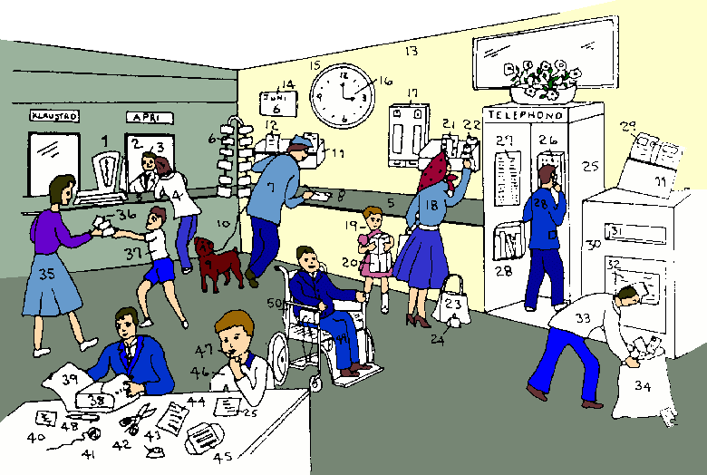 

 

<I>(Note: on the sign <B>KLUDE</B> would be better than
  <B>KLAUSTRO</B>, or even better <B>NE-FUNKTIO</B>.
  And <B>FUNKTIO</B> is perhaps better than <B>APRI</B>.)
</I>

<PRE>
 1 <B>libra </B>              scales 
 2 <B>vendo-lo </B>           sales point 
 3 <B>vendo-pe </B>           counter clerk 
 4 <B>merka-pe </B>           customer 
 5 <B>mensa </B>              counter 
 6 <B>posta karta </B>        postcard 
 7 <B>andro </B>              man 
 8 <B>grafo </B>              writing 
 9 <B>kani </B>               dog 
10 <B>duce-fi </B>            lead 
11 <B>folia teka </B>         leaflet box 
12 <B>plu folia </B>          leaflets 
13 <B>mura </B>               wall 
14 <B>kalendari </B>          calendar 
15 <B>horo-me </B>            clock 
16 <B>aku </B>                hand of clock 
17 <B>ateli-me </B>           stamp machine 
18 <B>matri </B>              mother 
19 <B>infanti </B>            child 
20 <B>kapsu </B>              parcel 
21 <B>aero-grama </B>         air-letter 
22 <B>grama-ve </B>           envelope 
23 <B>boteka-saka </B>        shopping bag 
24 <B>bursa </B>              purse 
25 <B>telefono teka </B>      telephone box 
26 <B>telefono </B>           telephone 
27 <B>kodi seri </B>          code list 
28 <B>nima-bibli </B>         directory 
29 <B>lice formu </B>         licence form 
30 <B>posta teka </B>         post box 
31 <B>stoma </B>              slot 
32 <B>plu kolekti horo </B>   collecting times 
33 <B>posta-pe </B>           postman 
34 <B>grama saka</B>          post bag 
                                  <I>(original says <B>grama
				  teka</B>&nbsp;- letter box, 
				  but the picture shows a bag)</I>
35 <B>gina </B>               woman 
36 <B>valuta </B>             money 
37 <B>an-fili</B> <I>(error in original <B>an-filia</B>)</I>  son
38 <B>teka </B>               box
39 <B>involve-papira </B>     wrapping paper 
40 <B>hesi bileta </B>        adhesive label 
41 <B>fi </B>                 string 
42 <B>cisori </B>             scissors 
43 <B>ateli sponge </B>       stamp sponge 
44 <B>grama </B>              letter 
45 <B>tele grama </B>         telegram 
46 <B>ju-an </B>              boy 
47 <B>liko un ateli </B>      licking a stamp 
48 <B>tinta-grafo-ru</B>      pen
   <I>(original says <B>stilo</B>,
   but this would be also "style".)</I>
49 <B>ge-lento pe </B>        disabled person
50 <B>rota-side </B>          wheel chair 

</PRE> 

<SMALL><I> - стр. 45 - </I></SMALL>

Post Office -  <U>A Few Phrases</U>
 

<TABLE BORDER="0" WIDTH="100%" CELLSPACING="0" CELLPADDING="0">
<COLGROUP><COL WIDTH="45%"><COL WIDTH="55%"></COLGROUP>
<TR><TD><B> grafo / bali / gene u grama&nbsp; </B></TD>
  <TD> write / send / receive Письмо </TD></TR> 
<TR><TD><B> adres u grama-ve&nbsp; </B></TD>
  <TD> address an envelope </TD></TR> 
<TR><TD><B> tako bali&nbsp; </B></TD>
  <TD> express delivery </TD></TR> 
<TR><TD><B> per mari / aero posta&nbsp; </B></TD>
  <TD> via sea mail / air mail </TD></TR> 
<TR><TD><B> petitio u qita&nbsp; </B></TD>
  <TD> ask for a receipt </TD></TR> 
<TR><TD><B> ple u blanka&nbsp; </B></TD>
  <TD> fill in a form </TD></TR> 
<TR><TD><B> re bali grafo a neo adresa&nbsp; </B></TD>
  <TD> re-direct mail to new address </TD></TR> 
<TR><TD VALIGN="top"><B> livra 
  </B><I>(original says <B>mite</B>, but that would be "send")</I><B>
  plu grama&nbsp; </B></TD>
  <TD VALIGN="top"> deliver the letters </TD></TR> 
<TR><TD><B> visita u klasi ofici&nbsp; </B></TD>
  <TD> visit the sorting office </TD></TR> 
<TR><TD><B> re-neo lice&nbsp; </B></TD>
  <TD> re-new licence </TD></TR> 
<TR><TD><B> grama ge-lose in posta&nbsp; </B></TD>
  <TD> letter lost in the post </TD></TR> 
</TABLE> 
 
 
 

<U><B>Kruci-Verba</B></U>

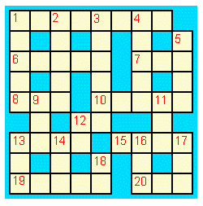 

 

<U><B>KATA</B>:</U> 
 1&nbsp;<B>Domi zoa</B>. &nbsp;&nbsp; 
 2&nbsp;<B>No-foto tem</B>. &nbsp;&nbsp; 
 3&nbsp;<B>Libe-tem aktivi</B>. &nbsp;&nbsp; 
 4&nbsp;<B>Pre; non-avanti</B>. &nbsp;&nbsp; 
 5&nbsp;<B>Pusi urba</B>. &nbsp;&nbsp; 
 9&nbsp;<B>Bibe-ma</B>. &nbsp;&nbsp; 
11&nbsp;<B>Ma de mono</B>. &nbsp;&nbsp; 
12&nbsp;<B>Oligo Glosa-pe komunika per puta-???</B> &nbsp;&nbsp; 
13&nbsp;<B>Planeta alo Glosa karita</B>. &nbsp;&nbsp; 
14&nbsp;<B>Mo kata posi casa u-ci bio-ra</B>. &nbsp;&nbsp; 
16&nbsp;<B>No-paleo</B>
  <I>(ошибка в оригинале: <B>No-palaeo</B>)</I>. &nbsp;&nbsp; 
17&nbsp;<B>Direkti</B>. &nbsp;&nbsp; 
18&nbsp;<B>Tem ex helio-ana e helio-kata</B>. &nbsp;&nbsp; 

 

<U><B>TRANS</B>:</U>
 1&nbsp;<B>Foto e aero ki dia u-ci</B>. &nbsp;&nbsp; 
 6&nbsp;<B>Gene info ex bibli</B>. &nbsp;&nbsp; 
 7&nbsp;<B>Numera</B>. &nbsp;&nbsp; 
 8&nbsp;<B>Verba ex plu Glosa mekani</B>. &nbsp;&nbsp; 
10&nbsp;<B>Kine a certa 
  </B><I>(ошибка в оригинале: <B>certo</B>)</I><B>
  loka</B>. &nbsp;&nbsp; 
12&nbsp;<B>Kontra mei</B>. &nbsp;&nbsp; 
13&nbsp;<B>Famili celebra</B>. &nbsp;&nbsp; 
15&nbsp;<B>Mo-bi meno</B>. &nbsp;&nbsp; 
19&nbsp;<B>Este u-ci per nasa</B>. &nbsp;&nbsp; 
20&nbsp;<B>Id tena neo bio</B>. 

 

 Please click 
  <A HREF="ru18s.htm#Key2">here</A> 
for solution. 
 

 

<SMALL><I> - стр. 46 - </I></SMALL>

<H2> Шаг 14 </H2>

<TABLE BORDER="0" WIDTH="100%" CELLSPACING="0" CELLPADDING="0">
<COLGROUP><COL WIDTH="45%"><COL WIDTH="55%"></COLGROUP>
<TR><TD><B> maxi&nbsp; </B></TD><TD> most, -est </TD></TR> 
<TR><TD></TD><TD> </TD></TR>
<TR><TD></TD><TD> </TD></TR>

<TR><TD><B> Mi vora ni sukro-ma ni karni.&nbsp; </B></TD>
  <TD> I eat neither sugar nor meat. </TD></TR> 
<TR><TD><B> Mi pote ni kanta ni kore.&nbsp; </B></TD>
  <TD> I can neither sing nor dance. </TD></TR> 
<TR><TD VALIGN="top"><B> Fe fu veni alo di-mo alo di-tri.&nbsp; </B></TD>
  <TD VALIGN="top"> She will come either Sunday or Tuesday. </TD></TR> 
<TR><TD><B> u subo kali flori&nbsp; </B></TD>
  <TD> a rather lovely flower </TD></TR> 
<TR><TD><B> u fo mega teka&nbsp; </B></TD>
  <TD> a very big box </TD></TR> 
<TR><TD><B> u maxi-mega teka&nbsp; </B></TD>
  <TD> the biggest box </TD></TR> 
<TR><TD><B> mali&nbsp; </B></TD><TD> bad </TD></TR> 
<TR><TD><B> ma-mali&nbsp; </B></TD><TD> worse </TD></TR> 
<TR><TD><B> maxi-mali&nbsp; </B></TD><TD> worst </TD></TR> 
<TR><TD><B> boni&nbsp; </B></TD><TD> good </TD></TR> 
<TR><TD><B> ma-boni&nbsp; </B></TD><TD> better </TD></TR> 
<TR><TD><B> maxi-boni&nbsp; </B></TD><TD> best </TD></TR> 
<TR><TD><B> Espa&ntilde;ol es subo facili de gene ski.&nbsp; </B></TD>
  <TD> Spanish is rather easy to learn. </TD></TR> 
<TR><TD><B> Glosa es mega ma-facili.&nbsp; </B></TD>
  <TD> Glosa is much easier. </TD></TR> 
<TR><TD VALIGN="top"><B> Te flu-dic u xeno lingua tu nece fo-stude id 
  gramatika e verba lista.&nbsp; </B></TD>
  <TD VALIGN="top"> In order to speak a foreign language you must study 
  thoroughly the grammar and vocabulary. </TD></TR> 
<TR><TD VALIGN="top"><B> Mi pa eko la ma de tri anua.&nbsp; </B></TD>
  <TD VALIGN="top"> I stayed there for more than three years. </TD></TR> 
<TR><TD VALIGN="top"><B> An pa eko ci mei de mo meno.&nbsp; </B></TD>
  <TD VALIGN="top"> He stayed here for less than a month. </TD></TR> 
<TR><TD VALIGN="top"><B> Mi fu eko in London tem Kristo-nati.&nbsp; </B></TD>
  <TD VALIGN="top"> I will stay in London over Christmas. </TD></TR> 
<TR><TD VALIGN="top"><B> U-ci es u mini-preci tabla.&nbsp; </B></TD>
  <TD VALIGN="top"> This is the cheapest table. </TD></TR> 
<TR><TD><B> u no-foto ka&nbsp; </B></TD><TD> a dark room </TD></TR> 
<TR><TD><B> u foto kamera&nbsp; </B></TD><TD> a light room </TD></TR> 
<TR><TD><B> melano-rubi&nbsp; </B></TD><TD> dark red </TD></TR> 
<TR><TD><B> leuko-rubi&nbsp; </B></TD><TD> light red </TD></TR> 
</TABLE> 
 

<I> ... [пропущено: Vocabulary] </I>

  

<I> Задание 14 </I>

<TABLE BORDER="0" WIDTH="100%" CELLSPACING="0" CELLPADDING="0">
<COLGROUP><COL WIDTH="45%"><COL WIDTH="55%"></COLGROUP>
<TR><TD><B> Na pa sedi para potami.&nbsp; </B></TD>
  <TD> We sat beside the river. </TD></TR> 
<TR><TD><B> U-ci flori es u maxi-kali.&nbsp; </B></TD>
  <TD> This flower is the loveliest. </TD></TR> 
<TR><TD><B> U-la tea tasa es u maxi-mega.&nbsp; </B></TD>
  <TD> That tea cup is the biggest. </TD></TR> 
<TR><TD><B> Mi doxo; mu fu veni.&nbsp; </B></TD>
  <TD> I think that they will come. </TD></TR> 
<TR><TD VALIGN="top"><B> U klima pa es tro termo pa meno.&nbsp; </B></TD>
  <TD VALIGN="top"> The weather was too hot last month. </TD></TR> 
<TR><TD><B> U-ci es u maxi-tako vagona.&nbsp; </B></TD>
  <TD> This is the fastest car. </TD></TR> 
<TR><TD><B> Mi flu-dic u France lingua.&nbsp; </B></TD>
  <TD> I speak French fluently. </TD></TR> 
<TR><TD><B> An fu resta ma de penta di.&nbsp; </B></TD>
  <TD> He will stay more than five days. </TD></TR> 
<TR><TD><B> Mi este hedo; tu fu veni.&nbsp; </B></TD>
  <TD> I am pleased that you will come. </TD></TR> 
<TR><TD><B> U-ci es u maxi gravi bibli.&nbsp; </B></TD>
  <TD> This is a very important book. </TD></TR> 
<TR><TD></TD><TD> </TD></TR>

<TR><TD><B> Glosa es u maxi facili lingua.&nbsp; </B></TD>
  <TD> Glosa is the easiest language. </TD></TR> 
<TR><TD><B> Id es la.&nbsp; </B></TD>
  <TD> It is over there. </TD></TR> 
<TR><TD VALIGN="top"><B> Il es ma de 400&nbsp;lingua ge-dice in 
  Indonesia.&nbsp; </B></TD>
  <TD VALIGN="top"> There are over 400&nbsp;languages spoken in 
  Indonesia. </TD></TR> 
<TR><TD VALIGN="top"><B> Il es ma de mo kilo lingua in Afrika.&nbsp; </B></TD>
  <TD VALIGN="top"> There are more than 1000&nbsp;languages in Africa. </TD></TR> 
<TR><TD><B> u grega de avi&nbsp; </B></TD><TD> a flock of birds </TD></TR> 
<TR><TD><B> Qo-lo es u maxi proxi sko-do?&nbsp; </B></TD>
  <TD> Where is the nearest school? </TD></TR> 
<TR><TD VALIGN="top"><B> U-ci es u maxi-boni medika-ma.&nbsp; </B></TD>
  <TD VALIGN="top"> This is the best medicine. </TD></TR> 
<TR><TD><B> Id es no-gravi.&nbsp; </B></TD><TD> It is trivial. </TD></TR> 
</TABLE>

<SMALL><I> - стр. 47 - </I></SMALL>

<U>Camping</U>
 

<I> ... [пропущено: picture with camping] </I> 
<I> ... [пропущено: word list to the picture] </I> 

 

<SMALL><I> - стр. 48 - </I></SMALL>

Camping - <U>A Few Phrases</U>
 

<TABLE BORDER="0" WIDTH="100%" CELLSPACING="0" CELLPADDING="0">
<COLGROUP><COL WIDTH="45%"><COL WIDTH="55%"></COLGROUP>
<TR><TD><B> ana u te-do&nbsp; </B></TD>
  <TD> pitch a tent </TD></TR> 
<TR><TD><B> kata u te-do&nbsp; </B></TD>
  <TD> strike the tent </TD></TR> 
<TR><TD><B> elekt u topo&nbsp; </B></TD>
  <TD> choose a site </TD></TR> 
<TR><TD><B> ple u dorsa-saka&nbsp; </B></TD>
  <TD> pack a ruck-sack </TD></TR> 
<TR><TD VALIGN="top"><B> ma-boni loka plu fi
  </B><I>(оригинально <B>fixa plu fi</B>)</I>&nbsp; </TD>
  <TD VALIGN="top"> adjust the straps </TD></TR>
<TR><TD><B> fix u fixa-ra&nbsp; </B></TD>
  <TD> fasten the buckle </TD></TR> 
<TR><TD><B> a skuta&nbsp; </B></TD>
  <TD> leaward </TD></TR> 
<TR><TD><B> a venti&nbsp; </B></TD>
  <TD> windward </TD></TR> 
<TR><TD><B> ge-trakto te-do&nbsp; </B></TD>
  <TD> trailer-tent </TD></TR> 
<TR><TD><B> kampo-fa&nbsp; </B></TD>
  <TD> camping equipment </TD></TR> 
<TR><TD VALIGN="top"><B> kolekti sika ligni
  </B><I>(ошибка в оригинале: <B>ligna</B>)</I>&nbsp; </TD>
  <TD VALIGN="top"> collect dry wood </TD></TR> 
<TR><TD><B> face u kampo-piro&nbsp; </B></TD>
  <TD> make a camp fire </TD></TR> 
<TR><TD><B> piro u kuko-me&nbsp; </B></TD>
  <TD> light the stove </TD></TR> 
<TR><TD VALIGN="top"><B> kambio 
  </B><I>(original says <B>muta</B>, but that would mean "change it into
  something different".)</I><B>
  u gasi-va&nbsp; </B></TD>
  <TD VALIGN="top"> change the gas-cylinder </TD></TR> 
<TR><TD><B> ple un aqa-va&nbsp; </B></TD>
  <TD> fill the water carrier </TD></TR> 
<TR><TD><B> repara-fa&nbsp; </B></TD>
  <TD> repair kit </TD></TR> 
<TR><TD VALIGN="top"><B> obe u rura konsili
  </B><I>(another suggestion: <B>akti boni, kron tu visita u rura.</B>
  Original text says <B>obe u rura kodi</B>)</I>&nbsp; </TD>
  <TD VALIGN="top"> obey the country code </TD></TR> 
</TABLE> 
 
 
 

<U>Письмо</U>

<B> Karo Andrew, </B>
 

<B> Mi este hedo; tu vide Glosa habe poli funktio.  Id ne es solo un 
interese ra.  Id es u nece-ra. </B>
 

<B> Mi e un hetero Glosa-fe tende; proto face u Glosa grega in na 
urba.  Pa setimana na pa loka plu anuncia in plu bibli-do, plu 
religio-do, e in na sko-do.  U-ci setimana mi grafo de Glosa in na nova 
papira.  Fu di-penta es u prima Glosa unio.  Mi qestio se; qo numera 
persona fu veni.  Qe plu Glosa-pe unio freqe in tu urba? </B>
 

<B> Ko u-ci grama mi mite u posta karta de mi urba; id habe tetra 
pikto. 1) u duce-via ko plu boteka. 2) u religio-do. 3) u fo paleo 
teatra e 4) u fluvi-vista.  Mi freqe gresi para fluvi tem kali
klima. </B>
 

<B> Id es fo brevi tem pre tu ki ad India; mi spe tu visita fu es forti 
interese, e fu don a tu mega hedo. </B>
 

<B> Boni viagia </B>
 

<B> Irene </B>
 

 

<SMALL><I> - стр. 49 - </I></SMALL>

<H2> Шаг 15 </H2>

<TABLE BORDER="0" WIDTH="100%" CELLSPACING="0" CELLPADDING="0">
<COLGROUP><COL WIDTH="45%"><COL WIDTH="55%"></COLGROUP>
<TR><TD><B> qi&nbsp; </B></TD><TD> who / which </TD></TR> 
<TR><TD></TD><TD> </TD></TR>
<TR><TD></TD><TD> </TD></TR>

<TR><TD VALIGN="top"><B> U maxi boni terapi anti u-ci pato es 
  medita.&nbsp; </B></TD>
  <TD VALIGN="top"> The best therapy for this illness is 
  meditation. </TD></TR> 
<TR><TD VALIGN="top"><B> U-ci es u terapi; qi es u maxi-boni 
  pro tu.&nbsp; </B></TD>
  <TD VALIGN="top"> This is the treatment which is best for you. </TD></TR> 
<TR><TD><B> U bibli; mi lekto; es fo-stimula.&nbsp; </B></TD>
  <TD> The book I'm reading is exciting. </TD></TR> 
<TR><TD><B> U-ci es u bibli; mi pa grafo.&nbsp; </B></TD>
  <TD> This is the book I wrote. </TD></TR> 
<TR><TD><B> U-ci es u domi; an eko.&nbsp; </B></TD>
  <TD> This is the house he lives in. </TD></TR> 
<TR><TD VALIGN="top"><B> U-la es u medika-pe; qi pa repara mi 
  gina.&nbsp; </B></TD>
  <TD VALIGN="top"> That is the doctor, who cured my wife. </TD></TR> 
<TR><TD VALIGN="top"><B> Qe tu ski u gina; tu vide pa-di mana?&nbsp; </B></TD>
  <TD VALIGN="top"> Do you know the lady whom you saw yesterday morning? </TD></TR> 
<TR><TD><B> Mu feno sani.&nbsp; </B></TD>
  <TD> They seem to be healthy. </TD></TR> 
<TR><TD><B> Tu feno hedo nu-di.&nbsp; </B></TD>
  <TD> You look very happy today. </TD></TR> 
<TR><TD><B> Feno, an ne fu veni.&nbsp; </B></TD>
  <TD> Apparently, he's not coming. </TD></TR> 
<TR><TD><B> Para-co, qe fe pa grafo?&nbsp; </B></TD>
  <TD> By the way, did she write? </TD></TR> 
<TR><TD><B> Il es poli speci farmako.&nbsp; </B></TD>
  <TD> There are many kinds of drugs. </TD></TR> 
<TR><TD><B> farmako-bo&nbsp; </B></TD><TD> pharmacy shop </TD></TR> 
<TR><TD VALIGN="top"><B> Il es fo-gravi; singu persona gene boni medika 
  e eduka auxi.&nbsp; </B></TD>
  <TD VALIGN="top"> It is vital that everybody gets good medical and 
  educational help. </TD></TR> 
<TR><TD VALIGN="top"><B> Plu mega-preci farmako freqe sti plu noku 
  para-seqe.&nbsp; </B></TD>
  <TD VALIGN="top"> The expensive drugs often cause harmful 
  side-effects. </TD></TR> 
<TR><TD VALIGN="top"><B> Poli persona nu gene repara per 
  alo-medika.&nbsp; </B></TD>
  <TD VALIGN="top"> Many people are now getting cured by alternative 
  medicine. </TD></TR> 
<TR><TD><B> Tu volu qo bibli?&nbsp; </B></TD>
  <TD> Which book do you want? </TD></TR> 
<TR><TD><B> Tu lekto qo speci bibli?&nbsp; </B></TD>
  <TD> What kinds of books do you read? </TD></TR> 
</TABLE> 
 
 

<I> ... [пропущено: Vocabulary] </I>

  

<U>Note</U> When 'who' or 'which' are the object of a clause they 
are usually left out in English.  In Glosa we always leave them out. 
Instead of saying; "The man WHOM I saw yesterday" we say "The man I saw 
yesterday".  
<I>(Note: This is a bad rule for an International Auxiliary Language. The
relative pronoun, <B>qi</B>, should be permitted, in speech and in writing,
even when its function in the sentence does not allow it a position at the
beginning of the relative clause:  
&nbsp;&nbsp;<B>Un andro; mi pa vide [qi]; akti ... </B>)</I>

 

<SMALL><I> - стр. 50 - </I></SMALL>

<U>Apiculture</U>
 

<I> ... [пропущено: picture about apiculture ] </I> 
<I> ... [пропущено: word list to the picture] </I> 

 

<SMALL><I> - стр. 51 - </I></SMALL>

Apiculture - <U>A Few Phrases</U>
 

<TABLE BORDER="0" WIDTH="100%" CELLSPACING="0" CELLPADDING="0">
<COLGROUP><COL WIDTH="45%"><COL WIDTH="55%"></COLGROUP>
<TR><TD><B> topo un api-do&nbsp; </B></TD>
  <TD> siting a hive </TD></TR> 
<TR><TD><B> domi plu api&nbsp; </B></TD>
  <TD> hive the bees </TD></TR> 
<TR><TD><B> alexi-ve&nbsp; </B></TD>
  <TD> put on protective clothing </TD></TR> 
<TR><TD><B> anti-punge-ma&nbsp; </B></TD>
  <TD> bee sting antidote </TD></TR> 
<TR><TD><B> fumi un in-lo&nbsp; </B></TD>
  <TD> smoke the entrance </TD></TR> 
<TR><TD><B> apo tegu&nbsp; </B></TD>
  <TD> remove lid </TD></TR> 
<TR><TD><B> moli-tegu&nbsp; </B></TD>
  <TD> cover with soft cloth </TD></TR> 
<TR><TD><B> leva / examina u qadra&nbsp; </B></TD>
  <TD> lift out / examine the frame </TD></TR> 
<TR><TD><B> vitri-tegu&nbsp; </B></TD>
  <TD> cover with glass quilt </TD></TR> 
<TR><TD><B> tena u temperatura&nbsp; </B></TD>
  <TD> maintain the temperature </TD></TR> 
<TR><TD><B> nutri plu api&nbsp; </B></TD>
  <TD> feed the bees </TD></TR> 
<TR><TD><B> extrakt u neo ceru
  </B><I>(ошибка в оригинале <B>cera</B>)</I>&nbsp; </TD>
  <TD> draw out the new wax </TD></TR> 
<TR><TD><B> boni / mali karpe&nbsp; </B></TD>
  <TD> good / bad harvest </TD></TR> 
<TR><TD><B> kapti u grega&nbsp; </B></TD>
  <TD> catch a swarm </TD></TR> 
<TR><TD><B> U fe-regi bali plu ova.&nbsp; </B></TD>
  <TD> The queen bee lays eggs. </TD></TR> 
<TR><TD><B> Plu ergo-api kura plu ova.&nbsp; </B></TD>
  <TD> Workers tend eggs. </TD></TR> 
<TR><TD><B> apo u ponti-ceru
  </B><I>(оригинально <B>ponti-cera</B>)</I>&nbsp; </TD>
  <TD> scrape away the brace comb </TD></TR> 
<TR><TD><B> Plu ergo-api face plu celu.&nbsp; </B></TD>
  <TD> Worker bees make cells. </TD></TR> 
<TR><TD VALIGN="top"><B> loka fe-regi exklude-ra 
  </B><I>(original says only <B>loka exklude-ra supra ...</B>)</I><B>
  supra plu larva&nbsp; </B>
  </TD>
  <TD VALIGN="top"> put queen excluder on the 
  brood </TD></TR> 
<TR><TD VALIGN="top"><B> no-face / re-face 
  </B><I>(оригинально <B>reface</B>)</I><B>
  un api-do&nbsp; </B></TD>
  <TD VALIGN="top"> dismantle / reassemble the hive </TD></TR> 
<TR><TD><B> ergo-, explora-, sito-api&nbsp; </B></TD>
  <TD> worker-, scout-, forager-bee </TD></TR> 
<TR><TD VALIGN="top"><B> peti via 
  </B><I>(оригинально <B>vola via</B>)</I>&nbsp; </TD>
  <TD VALIGN="top"> flight path </TD></TR> 
<TR><TD><B> api kore&nbsp; </B></TD>
  <TD> bee dance </TD></TR> 
<TR><TD><B> kolekti nektari / polina&nbsp; </B></TD>
  <TD> collect nectar / pollen </TD></TR> 
</TABLE>
 
 

<I> Задание 15 </I>

<TABLE BORDER="0" WIDTH="100%" CELLSPACING="0" CELLPADDING="0">
<COLGROUP><COL WIDTH="45%"><COL WIDTH="55%"></COLGROUP>
<TR><TD VALIGN="top"><B> U-ci es u gina; qi dona sko de 
  medita.&nbsp; </B></TD>
  <TD VALIGN="top"> This is the lady who teaches meditation. </TD></TR> 
<TR><TD VALIGN="top"><B> Qe tu ski un andro; qi pa merka u-ci 
  navi?&nbsp; </B></TD>
  <TD VALIGN="top"> Do you know the man; who bought this boat? </TD></TR> 
<TR><TD VALIGN="top"><B> U tetrapoda es u bio-ra; qi habe tetra 
  poda.&nbsp; </B></TD>
  <TD VALIGN="top"> A tetrapod is a creature; which has four legs. </TD></TR> 
<TR><TD VALIGN="top"><B> U-ci es u gina; qi eko u-la mega domi proxi 
  religio-do.&nbsp; </B></TD>
  <TD VALIGN="top"> This is the lady; who lives in that big house near the 
  church. </TD></TR> 
<TR><TD VALIGN="top"><B> Bibe u-ci medika-ma tri kron singu di.
  </B><I>(оригинально <B>... tri kron u di.</B>)</I>&nbsp; </TD>
  <TD VALIGN="top"> Take this medicine three times a day. </TD></TR> 
<TR><TD VALIGN="top"><B> No! mi ne amo u-ci speci medika-ma.&nbsp; </B></TD>
  <TD VALIGN="top"> No! I don't like this kind of medicine. </TD></TR> 
<TR><TD></TD><TD> </TD></TR>

<TR><TD><B> Tu feno subo leuko.&nbsp; </B></TD>
  <TD> You look rather pale. </TD></TR> 
<TR><TD VALIGN="top"><B> U-ci es u plaka; qi tena kemi-kroma.&nbsp; </B></TD>
  <TD VALIGN="top"> This is the cake which contains artificial 
  coloring. </TD></TR> 
<TR><TD VALIGN="top"><B> Qe, tu memo un andro; tu pa vide pa-di?&nbsp; </B></TD>
  <TD VALIGN="top"> Do you remember the man you saw yesterday. </TD></TR> 
<TR><TD VALIGN="top"><B> Mi pa vide u vagona; tu pa merka pa-di.&nbsp; </B></TD>
  <TD VALIGN="top"> I saw the car you bought yesterday. </TD></TR> 
<TR><TD VALIGN="top"><B> Tu pa dic a qo-pe?&nbsp; </B></TD>
  <TD VALIGN="top"> Who did you speak to? </TD></TR> 
<TR><TD VALIGN="top"><B> Il es poli speci zoa in u-la landa.&nbsp; </B></TD>
  <TD VALIGN="top"> There are many kinds of animals in that country. </TD></TR> 
<TR><TD><B> Qo horo tu fu veni?&nbsp; </B></TD>
  <TD> What time will you come? </TD></TR> 
<TR><TD><B> Fe es mu solo infanti.&nbsp; </B></TD>
  <TD> She is their only child. </TD></TR> 
</TABLE>

 

<SMALL><I> - стр. 52 - </I></SMALL>

<H2> Шаг 16 </H2>

<TABLE BORDER="0" WIDTH="100%" CELLSPACING="0" CELLPADDING="0">
<COLGROUP><COL WIDTH="45%"><COL WIDTH="55%"></COLGROUP>
<TR><TD><B> sti&nbsp; </B></TD>
  <TD> cause, make (laugh etc.), switch on </TD></TR> 
<TR><TD></TD><TD> </TD></TR>
<TR><TD></TD><TD> </TD></TR>

<TR><TD><B> u sedi-mo ex xilo&nbsp; </B></TD>
  <TD> a chair made from wood </TD></TR> 
<TR><TD><B> u memo-ra ex lito&nbsp; </B></TD>
  <TD> a stone memorial </TD></TR> 
<TR><TD><B> Vitri gene face ex arena.&nbsp; </B></TD>
  <TD> Glass is made from sand. </TD></TR> 
<TR><TD><B> sti u lampa&nbsp; </B></TD>
  <TD> switch on the lamp </TD></TR> 
<TR><TD><B> sto u lampa&nbsp; </B></TD>
  <TD> switch off the lamp </TD></TR> 
<TR><TD><B> apo u lingua sto-ra&nbsp; </B></TD>
  <TD> remove the language barrier </TD></TR> 
<TR><TD><B> sti u valva&nbsp; </B></TD>
  <TD> turn on the tap </TD></TR> 
<TR><TD VALIGN="top"><B> Fe pa kade ex equs; e u-la pa sti 
  ridi an.&nbsp; </B></TD>
  <TD VALIGN="top"> She fell off the horse and that made him 
  laugh. </TD></TR> 
<TR><TD VALIGN="top"><B> Mi ne pote sto se ridi.
  </B><I>(This sentence is supplemented and not in the original)</I>&nbsp; 
  </TD>
  <TD VALIGN="top"> I can't help laughing. </TD></TR> 
<TR><TD><B> An pa vexa fe.&nbsp; </B></TD>
  <TD> He annoyed her. </TD></TR> 
<TR><TD VALIGN="top"><B> Na nece sti logi u demo u gravi de 
  Glosa.&nbsp; </B></TD>
  <TD VALIGN="top"> We must make people understand the importance of 
  Glosa. </TD></TR> 
<TR><TD VALIGN="top"><B> U Globa Viki nece habe u Globa Lingua.&nbsp; </B></TD>
  <TD VALIGN="top"> The Global Village needs a Global Language. </TD></TR> 
<TR><TD VALIGN="top"><B> U demo de ocidenta gene pato; ka mu fago 
  tro.&nbsp; </B></TD>
  <TD VALIGN="top"> People in the west get ill because they eat too 
  much. </TD></TR> 
<TR><TD VALIGN="top"><B> Iso tem plu demo in Munda Tri lose bio; kausa 
  mu habe ni boni fago-ma ni sani bibe-hidro.&nbsp; </B></TD>
  <TD VALIGN="top"> At the same time people in Third World die because 
  they have neither good food nor healthy drinking water. </TD></TR> 
<TR><TD VALIGN="top"><B> Il es sati fago-ma epi Geo de nutri 
  panto-pe.&nbsp; </B></TD>
  <TD VALIGN="top"> There is enough food on the earth to feed 
  everybody. </TD></TR> 
</TABLE> 
  
 

<I> Словарь </I>

<TABLE BORDER="0" WIDTH="100%" CELLSPACING="0" CELLPADDING="0">
<COLGROUP><COL WIDTH="25%"><COL WIDTH="75%"></COLGROUP> 
<TR><TD><B>arena&nbsp; </B></TD><TD> sand </TD></TR>
<TR><TD><B>lito; -li&nbsp; </B></TD><TD> stone; litho- </TD></TR>
<TR><TD><B>xilo&nbsp; </B></TD><TD> wood; xylo- </TD></TR>
<TR><TD><B>valva&nbsp; </B></TD><TD> valve, tap </TD></TR>
<TR><TD><B>apo&nbsp; </B></TD><TD> remove </TD></TR>
<TR><TD><B>fortuna&nbsp; </B></TD><TD> chance </TD></TR>
<TR><TD><B>boni-fortuna&nbsp; </B></TD><TD> fortunately </TD></TR>
<TR><TD><B>ridi&nbsp; </B></TD><TD> laugh </TD></TR>
<TR><TD><B>vexa&nbsp; </B></TD><TD> annoy, irritate </TD></TR>
<TR><TD><B>logi&nbsp; </B></TD><TD> understand </TD></TR>
<TR><TD><B>este&nbsp; </B></TD><TD> feel </TD></TR>
<TR><TD><B>kade&nbsp; </B></TD><TD> fall </TD></TR>
<TR><TD><B>per fortuna&nbsp; </B></TD><TD> by chance </TD></TR>
<TR><TD><B>mali-fortuna&nbsp; </B></TD><TD> unfortunately </TD></TR>
</TABLE>
 
 
 

<I> Задание 16 </I>

<TABLE BORDER="0" WIDTH="100%" CELLSPACING="0" CELLPADDING="0">
<COLGROUP><COL WIDTH="45%"><COL WIDTH="55%"></COLGROUP>
<TR><TD VALIGN="top"><B> Id es gravi; na vora sani fago-ma.&nbsp; </B></TD>
  <TD VALIGN="top"> It is important to eat healthy food. </TD></TR> 
<TR><TD VALIGN="top"><B> Tu nece sti vora an.&nbsp; </B></TD>
  <TD VALIGN="top"> You have to make him eat. 
  <I>(Original says "You must try to make him eat.", but that would be
  in Glosa <B>Tu debi tenta sti vora an.</B>)</I> </TD></TR> 
<TR><TD><B> An pa face plu kali fotografi.&nbsp; </B></TD>
  <TD> He made some beautiful photographs. </TD></TR> 
<TR><TD><B> Fe pa sti u valva.&nbsp; </B></TD>
  <TD> She turned on the tap. </TD></TR> 
<TR><TD VALIGN="top"><B> Tu ne lice casa plu zoa.
  </B><I>(Original says <B>Tu ne nece casa plu zoa</B>, but that would
  be "You don't need to chase the animals".)</I>&nbsp; </TD>
  <TD VALIGN="top"> You must not chase the animals. </TD></TR> 
<TR><TD VALIGN="top"><B> Qe tu habe, per fortuna, u plus teka?&nbsp; </B></TD>
  <TD VALIGN="top"> Do you by chance have an extra box? </TD></TR> 
<TR><TD VALIGN="top"><B> Sura fe pa veni; tem na pa es ab.&nbsp; </B></TD>
  <TD VALIGN="top"> She must have arrived while we were out. </TD></TR> 
<TR><TD></TD><TD> </TD></TR>

<TR><TD><B> Mi ne pa pote sto ridi.&nbsp; </B></TD>
  <TD> I couldn't stop laughing. </TD></TR> 
<TR><TD><B> sti u lava-me&nbsp; </B></TD>
  <TD> turn on the washing machine </TD></TR> 
<TR><TD><B> sto u kuko-me&nbsp; </B></TD>
  <TD> switch off the cooker </TD></TR> 
<TR><TD><B> Fe pa sti gresi mi.&nbsp; </B></TD>
  <TD> She made me walk. </TD></TR> 
<TR><TD><B> u teka ex xilo&nbsp; </B></TD>
  <TD> a wooden box </TD></TR> 
<TR><TD><B> u teka pro xilo&nbsp; </B></TD>
  <TD> a box for wood </TD></TR> 
<TR><TD><B> Mali-fortuna an pa frakti u fenestra.&nbsp; </B></TD>
  <TD> Unfortunately, he broke the window. </TD></TR> 
<TR><TD><B> An pa gresi ex domi.&nbsp; </B></TD>
  <TD> He walked out of the house. </TD></TR> 
<TR><TD><B> An pa gresi ab domi.&nbsp; </B></TD>
  <TD> He walked away from the house. </TD></TR> 
</TABLE> 
 
 

<SMALL><I> - стр. 53, 54 - </I></SMALL>

<U><B>Tri Andro in Navi</B></U>

From "Three Men in a Boat" by Jerome K. Jerome. 
English version after Glosa text. 
 

<B> Minus sinapi, panto-na in navi pa este melankoli
  </B><I>(оригинально <B>Na pa no-memo de pak u sinapi; qi sti
melankoli panto-na.</B>)</I><B>
Na pa vora u bovi in silenti.  U vita nu pa feno vaku e no-stimula.  
Na pa memo plu hedo di de infanti-tem; 
  e ko tristi-senti spira ex
  </B><I>(оригинально <B>...; e senti tristi.</B>)</I><B>.
Anti-co, na gene ma hedo ko pomi pastata; e, kron George pa trakto u 
stani-va de Ananas ex funda de sito-va; e pa volve id  a meso-navi; na 
pa senti, anti-co, vita es ne mali. </B>
 

<B> Panto-na amo Ananas.  Na pa examina u pikto epi stani-va; na pa
pensi de suku.  Na pa sub-ridi ad alelo; e Harris pa leva u spatula,
prepara. </B>
 

<B> Po-co na cerka u kultela te aperi u vasa.  Na pa apo panto-ra ex
sito-va.  Na pa vaku plu saka.  Na pa trakto ana plu funda-taba de navi.
Na fero panto-ra ex ad-epi ripa, e seiso mu.  Zero aperi-ru. </B>
 

<B> Harris tenta apri u vasa per marsu kultela; pa frakti u kultela; e
seka se mali.  George tenta ko cisori, qi peti ana; e proxi cieko an. </B>

 

<B> Tem mu pa du kura plu vulne; mi pa tenta fac u fora in id per
  </B><I>(оригинально <B>ko</B>)</I><B>
metali spika; qi glisa e bali mi ex inter navi e ripa ad-in mo metra de
limo aqa; e u vasa volve ne-ge-vulne
  </B><I>(оригинально <B>no-ge-vulne</B>)</I><B>,
e frakti u tea-tasa. </B>
 

<B> Panto-na pa gene rabi.  Na pa leva u-la vasa; e fero id ex ad-epi
ripa; e Harris ki ana ad-in agri; e detekti u mega akuto lito; e mi ki
versi ad-in navi; e fero u pali.  George pa tena u vasa; e Harris pa
tena un akuto akro de lito epi supra;
  </B><I>(оригинально <B>... tena un aku fini de lito epi
  supra;</B>)</I><B>
e mi pa prende u pali; leva id alti
in aero; e kon holo dina mi trakto id kata. </B>
 

<B> Id pa es George stra kefa-ve; qi salva an vita u-la di.  
[...] 
Harris veni ex ko solo u karni vulne. </B>
 

<B> Po-co, mi auto pa leva
  </B><I>(original says <B>fero ... a dista topo</B>, but in the
  English original they seem to stay in the same place.)</I><B>
u stani-va
  </B><I>(original says only <B>stani</B>)</I><B>;
e pa bate id ko pali; a-kron mi pa lose mi dina; e pa lose panto spe; e
Harris pa prende id e dura bate id. </B>
 

<B> Na pa bate id plati; na pa bate id versi qadra; na pa bate id ad-in
panto forma ge-ski in geometri - sed, na ne pa pote face u fora in id. 
Po-co George bali se ad id; e an bate id ad-in forma, ta xeno, ta feroci
deino; an pa gene fobo; e pa bali u pali ab.  Po-co panto na pa sedi
peri id epi gra; e skope id. </B>
 

<B> Pa es mo mega konkavi trans supra; qi sembla sub-ridi anti na; e id
sti na furi.  Harris pa bali se ad id; prende id; e bali id ad-in meso
fluvi; e tem id pa kata; na bali plu mali-dice ad id; e na pa ki in
navi; e pa remi ab u-la topo; e nuli kron sto; pre na veni a Maidenhead.</B>

 

<U>Русский перевод:</U> &nbsp;&nbsp; Это повергло лодку в униние, не было горчицы
Мы ели нашу говядину в тишине. Существование казалось пустым и неинтересным. Мы думали о счастливых днях детства и
тосковали. Мы воспряли немного, однако, над яблочным пирогом и, когда Джордж извлек банку ананасов со
дна корзины и перекатил ее в центр лодки, мы почувствовали, что жизнь - все-таки стоящая вещь
 

 Нам очень нравятся анананасы, всем трем. 
Мы смотрели на картинку на банке и думали о соке. Мы улыбались друг другу и Харрис приготовил ложку
 

 Тогда мы стали искать нож, чтобы открыть банку. Мы перевернули корзину. Мы перевернули перевернули доски на дне лодки. Мы перерыли все вещи и
выбросили их на берег.  Открывалка не была найдена. 
 

 Тогда Харрис поThen Harris tried to open the tin with a pocket-knife, and broke the
knife and cut himself badly; and George tried a pair of scissors, and
the scissors flew up, and nearly put his eye out.  

 While they were dressing their wounds, I tried to make a hole in 
the thing with a spiky end of the hitcher, and the hitcher slipped and 
jerked me out between the boat and the river bank into two feet of 
muddy water, and the tin rolled over, uninjured, and broke a teacup. 

 

 Then we all got mad.  We took that tin out on the bank, and Harris
went up into a field and got a big sharp stone, and I went into the boat
and brought out the mast, and George held the tin and Harris held the
sharp end of his stone against the top of it, and I took the mast and
poised it high up in the air, and gathered all my strength and brought
it down. 
 

 It was George's straw hat that saved his life that day.  
[...] 
Harris got off with merely a flesh wound. 
 

 After that I took the tin off myself, and hammered at it with the
mast till I was worn out and sick at heart, whereupon Harris took it in
hand. 
 

 We beat it out flat; we beat it back square; we battered it into 
every form known to geometry - but we could not make a hole in it.  Then
George went at it, and knocked it into shape, so strange, so weird, so
unearthly in its wild hideousness, that he got frightened and threw away
the mast.  Then we all sat round it on the grass and looked at it. 
 

 There was one great dent across the top that had the appearance of a
mocking grin, and it drove us furious, so that Harris rushed at the
thing, and caught it up, and flung it far into the middle of the river,
and as it sank we hurled our curses at it, and we got into the boat and
rowed away from the spot, and never paused until we reached Maidenhead.

  

 

<SMALL><I> - стр. 55 - </I></SMALL>

<H2> Шаг 17 </H2>

<TABLE BORDER="0" WIDTH="100%" CELLSPACING="0" CELLPADDING="0">
<COLGROUP><COL WIDTH="45%"><COL WIDTH="55%"></COLGROUP>
<TR><TD><B> nu-fu&nbsp; </B></TD><TD> near future, just going to </TD></TR> 
<TR><TD><B> nu-pa&nbsp; </B></TD><TD> recent past, have just </TD></TR> 
<TR><TD></TD><TD> </TD></TR>
<TR><TD></TD><TD> </TD></TR>

<TR><TD><B> Qe an veni nu-di?&nbsp; </B></TD>
  <TD> Is he coming today? </TD></TR> 
<TR><TD><B> Ja! An nu-pa veni.&nbsp; </B></TD>
  <TD> Yes! He has just arrived. </TD></TR> 
<TR><TD><B> Mi pa-fu dic a tu.&nbsp; </B></TD>
  <TD> I was going to tell you. </TD></TR> 
<TR><TD VALIGN="top"><B> Fe nu-pa bali u kalkula dia fenestra.  Nu u 
  vitri es ge-frakti. </B></TD> 
  <TD VALIGN="top"> She has just thrown the stone through the window.  
  Now the glass is broken. </TD></TR> 
<TR><TD><B> Un andro nu-fu repara id.&nbsp; </B></TD>
  <TD> The man is just going to mend it. </TD></TR> 
<TR><TD><B> Mi nu-pa fini stude.&nbsp; </B></TD>
  <TD> I've just finished studying. </TD></TR> 
<TR><TD><B> Mi nu-fu ki ad urba.&nbsp; </B></TD>
  <TD> I'm just going to town. </TD></TR> 
<TR><TD><B> Fe nu-pa fac u-ci manu saka.&nbsp; </B></TD>
  <TD> She has just made this hand-bag. </TD></TR> 
<TR><TD><B> Id nu-pa proto pluvi.&nbsp; </B></TD>
  <TD> It has just started to rain. </TD></TR> 
<TR><TD><B> Akorda! U klima es fo mali.&nbsp; </B></TD>
  <TD> Agreed! The weather is very bad. </TD></TR> 
<TR><TD VALIGN="top"><B> Akorda "Duden Fremdw&ouml;rterbuch" in holo 
  Deutsche verba lista de cirka 400,000 verba cirka 100,000 veni ex 
  Latino alo Greko; i. e. ex singu tetra verba mo verba veni ex Latin 
  alo Greko.&nbsp; </B>
  </TD>
  <TD VALIGN="top"> According to the "Duden Fremdw&ouml;rterbuch" in 
  the whole of the German vocabulary of 400,000&nbsp;words, 
  about&nbsp;100,000 come from Latin or Greek, i. e. 1 out of every
  4&nbsp;words comes from Latin or Greek. 
  </TD></TR> 
</TABLE> 
 
 

<U>A Postcard</U>

<TABLE BORDER="2" WIDTH="70%" CELLSPACING="0" CELLPADDING="10"
  BGCOLOR="#FEFEAC">
<COLGROUP><COL WIDTH="50%"><COL WIDTH="50%"></COLGROUP>
<TR>
<TD>

<B>Na pa veni a Bombai pre tetra  
di.  Klima es fo fo termo!  
Hotel es boni; fago-ma habe u  
fo boni gusta. </B>

<B>Panto-pe es ami.  Mi fo amo  
u-ci landa.   Pa visita poli  
interese loka.  Pa face poli  
kali fotografi. </B>

<B>Andrew</B>
 
</TD>
<TD>

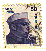
 
 
<B>&nbsp;&nbsp;Irene Cox,  
&nbsp;&nbsp;5, Duce via  
&nbsp;&nbsp;London, Britain.&nbsp;&nbsp;&nbsp;&nbsp;&nbsp;&nbsp;&nbsp; 
</B>
</TD>
</TR>
</TABLE>

 
 
 
 

<I> Задание 17 </I>

<TABLE BORDER="0" WIDTH="100%" CELLSPACING="0" CELLPADDING="0">
<COLGROUP><COL WIDTH="45%"><COL WIDTH="55%"></COLGROUP>
<TR><TD><B> An pa-fu seka plu flori.&nbsp; </B></TD>
  <TD> He was just going to cut the flowers. </TD></TR> 
<TR><TD><B> Id nu-pa sto pluvi.&nbsp; </B></TD>
  <TD> It has just stopped raining. </TD></TR> 
<TR><TD><B> Mi nu-fu ki a plu boteka.&nbsp; </B></TD>
  <TD> I am just going to the shops. </TD></TR> 
<TR><TD><B> Mi nu-pa vora u plaka.&nbsp; </B></TD>
  <TD> I have just eaten a cake. </TD></TR> 
<TR><TD VALIGN="top"><B> Tu pa es qo-lo; kron mi pa 'fono
  </B><I>(error in original <B>'foni</B>)</I><B>?&nbsp; </B></TD>
  <TD VALIGN="top"> Where were you when I phoned? </TD></TR>
<TR><TD VALIGN="top"><B> Plu-ci plaka habe u fo-boni gusta.&nbsp; </B></TD>
  <TD VALIGN="top"> These cakes taste delicious. </TD></TR> 
<TR><TD><B> Penite, mi ne logi.&nbsp; </B></TD>
  <TD> Sorry, I don't understand. </TD></TR> 
<TR><TD VALIGN="top"><B> Qe tu pote dice ma lento, place?&nbsp; </B></TD>
  <TD VALIGN="top"> Can you speak more slowly, please? </TD></TR> 
<TR><TD><B> Qe tu pote itera u-la, place?&nbsp; </B></TD>
  <TD> Would you repeat that please? </TD></TR> 
<TR><TD></TD><TD> </TD></TR>

<TR><TD VALIGN="top"><B> Akorda fe an habe u ge-frakti poda.&nbsp; </B></TD>
  <TD VALIGN="top"> According to her he has a broken leg. </TD></TR> 
<TR><TD><B> Mi nu-fu ki ana.&nbsp; </B></TD>
  <TD> I am just about to go up. </TD></TR> 
<TR><TD VALIGN="top"><B> An pa fu ki trans via; kron u vagona pa 
  veni.&nbsp; </B></TD>
  <TD VALIGN="top"> He was just going to cross the road, when the car 
  came along. 
  </TD></TR> 
<TR><TD VALIGN="top"><B> U via pa es hidro; ka id pa proto 
  pluvi.&nbsp; </B></TD>
  <TD VALIGN="top"> The road was wet because it had started to 
  rain. </TD></TR> 
<TR><TD><B> Qo programa in teatra?&nbsp; </B></TD>
  <TD> What's on at the theatre? </TD></TR> 
<TR><TD VALIGN="top"><B> Mi este fo hedo de inkontra
  </B><I>(оригинально <B>enkontra</B>)</I><B>
  tu.&nbsp; </B></TD>
  <TD VALIGN="top"> I am very pleased to meet you. </TD></TR> 
</TABLE> 
 

<SMALL><I> - стр. 56, 57 - </I></SMALL>

<U>Shakespeare</U>
 

 Trying to translate Shakespeare into Glosa, and preserving sense and
rythm as much as possible is a very good exercise.  Try to keep to 
Glosa 1000 as much as possible. 
 

 Shakespeare: Richard II. Act 3, Scene 2 
  (After Glosa text some notes and English original):
 

<U>Glosa:</U>
 

<B>
... de konfort, ze-pe dic:  
Las na dic de tumb, de verm, e epitaf;  
Fac pulve na papir; ko pluvi ok  
Graf tristi epi facia de u ge.  
Elekt plu lega-pe; dic testament:  
Sed, ne so, - na pote dona qo?  
Except na pove soma ad u ter?   
Na land, na vit, pan es de Bolingbroke;  
E nuli-ra es de na excepti mort  
E u mikro model de u sika ter;   
Qi es u tegu pasta de na os.   
Pro Teo, las na sed ad epi ter;   
Dic de tristi morta de plu reg   
Kom plu pa lose tron; plu ge-cid in guer,   
plu ge-seqe ex plu-la mu pa cid,   
Plu ge-toxi per mu gin; plu, somni, ge-cid.   
Pan ge-cid: - ka in koelo koron;   
Qi rond u morta kefa de u reg;   
Morta tena kort; e la u bufon sed;   
ridi anti an; joko de an pomp;   
Permito an respir u mikro sken,   
Te monarki; sti fob, e cid per skop;   
Infusi an ko vani vanita   
Kom si u sark, qi cirku mur na vit   
Es fo-resista ma; e ridi so,   
Veni a fin, e per u mikro spin   
For dia an kastel mur, ... e vale, reg!   
Tegu tu kef; ne ridi anti mi   
Ko solem revere; bali respekt,   
Traditi, form, e ceremoni deb;   
Ka tu mis-logi mi a-nu;   
Mi vora pan kom tu,   
Ski trist, vol ami; ge-limita so,   
Qo-ka tu dic a mi, mi es u reg?   
</B>

<U> Some eti-notes</U>; literal translation of some L & G roots: 

 line 2 EPI-TAPH G. on-tomb   
10 G. <B>steiro</B>, barren better? but sika, dry is in Glosa 1000   
17 G. <B>koelo</B>, hollow. The G. is cog with the E.  
24 G. <B>sarko</B>, flesh. sarcastic, flesh-tearing. Sarcophagus flesh eating. 
   L is <B>carni</B>- as in carni-vorous.   
26 L. <B>spina</B>, thorn, pin.   

   

<U>English original:</U>

 
... of comfort, no man speak.   
Let's talk of graves, of worms, and epitaphs;   
Make dust our paper, and with rainy eyes   
Write sorrow on the bosom of the earth.   
Let's choose executors, and talk of wills;   
And yet not so - for what can we bequeath   
Save our deposed bodies to the ground?   
Our lands, our lives, and all, are Bolingbroke's.   
And nothing can we call our own but death   
And that small model of the barren earth   
Which serves as paste and cover to our bones.   
For God's sake let us sit upon the ground   
And tell sad stories of the death of kings:   
How some have been deposed, some slain in war;   
Some haunted by the ghosts they have depos'd,   
Some poisoned by their wives, some sleeping kill'd,   
All murder'd - for within the hollow crown   
That rounds the mortal temples of a king   
Keeps Death his court; and there the antic sits,   
Scoffing his state, and grinning at his pomp;   
Allowing him a breath, a little scene,   
To monarchize, be fear'd, and kill with looks;   
Infusing him with self and vain conceit,   
As if this flesh which walls about our life   
Were brass impregnable; and, humour'd thus,   
Comes at the last, and with a little pin   
Bores through his castle wall, and farewell, king!   
Cover your heads, and mock not flesh and blood   
With solemn reverence; throw away respect,   
Tradition, form, and ceremonious duty;   
For you have but mistook me all this while.   
I live with bread like you, feel want, taste grief,   
Need friends: subjected thus,   
How can you say to me, I am a king?   

 

 

<SMALL><I> - стр. 58 - </I></SMALL>

<H2> Шаг 18 </H2>

<TABLE BORDER="0" WIDTH="100%" CELLSPACING="0" CELLPADDING="0">
<COLGROUP><COL WIDTH="45%"><COL WIDTH="55%"></COLGROUP>
<TR><TD><B> du&nbsp; </B></TD><TD> continue; -ing; still </TD></TR> 
<TR><TD></TD><TD> </TD></TR>
<TR><TD></TD><TD> </TD></TR>

<TR><TD><B> An pa ki a fago-do.&nbsp; </B></TD>
  <TD> He went to the restaurant. </TD></TR> 
<TR><TD><B> An es la nu.&nbsp; </B></TD>
  <TD> He is there now. </TD></TR> 
<TR><TD><B> An du es la.&nbsp; </B></TD>
  <TD> He is still there. </TD></TR> 
<TR><TD><B> Id du helio.&nbsp; </B></TD>
  <TD> It's still sunny. </TD></TR> 
<TR><TD VALIGN="top"><B> Plura persona du doxo; English fu es u munda 
  lingua.&nbsp; </B></TD>
  <TD VALIGN="top"> Some people still think that English will be the 
  world language. </TD></TR> 
<TR><TD><B> Fe fu dice tem mo horo.&nbsp; </B></TD>
  <TD> She will be speaking for one hour. </TD></TR> 
<TR><TD VALIGN="top"><B> Mi pa du lava u vagona; kron an pa 
  veni.&nbsp; </B></TD>
  <TD VALIGN="top"> I was washing the car when he arrived. </TD></TR> 
<TR><TD VALIGN="top"><B> Un andro; mu pa du dice de; pa lose bio pre sixa 
  meno.&nbsp; </B></TD>
  <TD VALIGN="top"> The man they were talking about had died six months ago. 
  </TD></TR> 
<TR><TD><B> Fe pa merk u bibli.&nbsp; </B></TD>
  <TD> She had bought the book. </TD></TR> 
<TR><TD><B> An pa du nekto.&nbsp; </B></TD>
  <TD> He had been swimming. </TD></TR> 
<TR><TD><B> Fe pa nece auxi mu.&nbsp; </B></TD>
  <TD> She had to help them. </TD></TR> 
<TR><TD><B> Mi atende ko hedo de vide tu.&nbsp; </B></TD>
  <TD> I look forward to seeing you. </TD></TR> 
</TABLE> 
 
 

<I> Задание 18 </I>

<TABLE BORDER="0" WIDTH="100%" CELLSPACING="0" CELLPADDING="0">
<COLGROUP><COL WIDTH="45%"><COL WIDTH="55%"></COLGROUP>
<TR><TD><B> An du stude Deutsch.&nbsp; </B></TD>
  <TD> He is still studying German. </TD></TR> 
<TR><TD VALIGN="top"><B> Mi pa du dic a fe; kron u telefono pa 
  soni.&nbsp; </B></TD>
  <TD VALIGN="top"> I was speaking to her when the telephone 
  rang. </TD></TR> 
<TR><TD VALIGN="top"><B> An pa ergo in Afrika tem poli anua.&nbsp; </B></TD>
  <TD VALIGN="top"> He had worked in Africa for many years. </TD></TR> 
<TR><TD VALIGN="top"><B> Kron na pa veni; an pa du ki ex.&nbsp; </B></TD>
  <TD VALIGN="top"> When we arrived; he was leaving. 
    <I>(Original says "When we arrived; he was just going out.", 
    but that would be in Glosa <B>Na pa veni; iso-kron an pa proto ki
    ex</B>. And: <B>Kron na pa veni; an pa prepara ki ex.</B> would be
    "When we arrived; he was just about to go out.")</I>
    </TD></TR> 
<TR><TD></TD><TD> </TD></TR>

<TR><TD VALIGN="top"><B> U-ci es u gina; tu pa du dic a.&nbsp; </B></TD>
  <TD VALIGN="top"> This is the lady you were talking to. </TD></TR> 
<TR><TD VALIGN="top"><B> Mi pa du grafo; kron an pa sti kade u 
  grafo-liqi ad epi mi grama. </B></TD> 
  <TD VALIGN="top"> I was writing when he spilt the ink on to my 
  letter. </TD></TR> 
<TR><TD VALIGN="top"><B> Fe pa stude Latin e Greko.&nbsp; </B></TD>
  <TD VALIGN="top"> She had studied Greek and Latin. </TD></TR> 
<TR><TD VALIGN="top"><B> Fe pa visita Italia.&nbsp; </B></TD>
  <TD VALIGN="top"> She visited Italy / has been to Italy. </TD></TR> 
<TR><TD><B> Id pa du helio un holo di.&nbsp; </B></TD>
  <TD> It was sunny all day. </TD></TR> 
</TABLE> 
 
 
 

<U>Письмо</U>

<B> Karo Andrew, </B>
 

<B> Gratia de tu kali posta-karta ex India.  Mi este sura; tu pa
gene mega hedo ex tu visita; e mi atende plu nova de tu
libe-tem. </B>
 

<B> Mi nu-pa ki ex prima Glosa unio in na urba.  Bi-penta persona pa
veni kleisto mi sko-pe.  U-ci pa sti mira mi. </B>
 

<B> Mi patri pa dice de Glosa, de id eduka profito; e an pa
responde plu qestio ex plu audi-pe. </B>
 

<B> Po-co, an pa dona sko u brevi-tem; e po cirk u semi-horo pleisto
persona pa pote dice oligo Glosa frase.  U fo stimula vespera!  Poli
persona pa gene interese; seqe-co na tende unio bi kron singu meno.  Id
es fo boni de dice Glosa ko plu hetero pe.  Id dona vita a lingua; plus,
na pote kambio plu idea e info. </B>
 

<B> Poli hedo saluta </B>
 

<B> ex Irene </B>
 
 

<SMALL><I> - стр. 59 - </I></SMALL>

<U>Some English Idioms</U>
 

 All idioms must be translated into clear unidiomatic Glosa. 
 

<TABLE BORDER="0" WIDTH="100%" CELLSPACING="0" CELLPADDING="0">
<COLGROUP><COL WIDTH="45%"><COL WIDTH="55%"></COLGROUP>
<TR><TD><B> habe plu homo defekti&nbsp; </B></TD>
  <TD> tared with the same brush </TD></TR> 
<TR><TD><B> Id pluvi forti.&nbsp; </B></TD>
  <TD> It's raining cats and dogs. </TD></TR> 
<TR><TD><B> ne spend un holo in-valuta&nbsp; </B></TD>
  <TD> make both ends meet </TD></TR> 
<TR><TD><B> no-ge-stimula&nbsp; </B></TD>
  <TD> fed-up; browned off </TD></TR> 
<TR><TD><B> akti fo-koleri&nbsp; </B></TD>
  <TD> do one's nut; blow one's top </TD></TR> 
<TR><TD><B> u fo-boni exempla&nbsp; </B></TD>
  <TD> a case in point </TD></TR> 
<TR><TD VALIGN="top"><B> Ne este sura de fu-sucede!&nbsp; </B></TD>
  <TD VALIGN="top"> Don't count chickens before they are 
  hatched. </TD></TR> 
<TR><TD><B> Mi ne pote divina.&nbsp; </B></TD>
  <TD> I haven't a clue. </TD></TR> 
<TR><TD><B> kredi minus verifi&nbsp; </B></TD>
  <TD> take something for granted </TD></TR> 
<TR><TD><B> u fo-longi tem&nbsp; </B></TD>
  <TD> till the cows come home </TD></TR> 
<TR><TD><B> mis-logi alelo&nbsp; </B></TD>
  <TD> talk at cross-purposes </TD></TR> 
<TR><TD><B> Ne cerka turba!&nbsp; </B></TD>
  <TD> Let sleeping dogs lie. </TD></TR> 
<TR><TD><B> ne volu akusti&nbsp; </B></TD>
  <TD> turn a deaf ear to </TD></TR> 
<TR><TD><B> ge-konfusi&nbsp; </B></TD>
  <TD> at sixes and sevens </TD></TR> 
<TR><TD VALIGN="top"><B> komenc u mega no-facili minus fobo&nbsp; </B></TD>
  <TD VALIGN="top"> take the bull by the horns </TD></TR> 
<TR><TD><B> feno fatuo&nbsp; </B></TD>
  <TD> have egg on one's face </TD></TR> 
<TR><TD><B> u vista ex infra&nbsp; </B></TD>
  <TD> a worm's eye view </TD></TR> 
<TR><TD><B> plu ordinari-pe&nbsp; </B></TD>
  <TD> the grass roots </TD></TR> 
<TR><TD><B> nu-fu acide&nbsp; </B></TD>
  <TD> in the offing </TD></TR> 
<TR><TD VALIGN="top"><B> tro freqe dice de 
  </B><I>(оригинально <B>dura dice de mono tema</B>)</I>&nbsp; </TD>
  <TD VALIGN="top"> keep harping on about 
  <I>(original says only "keep harping on")</I> </TD></TR> 
<TR><TD><B> dice klar e praxi&nbsp; </B></TD>
  <TD> talk turkey </TD></TR> 
<TR><TD><B> ge-lose valuta&nbsp; </B></TD>
  <TD> money down the drain </TD></TR> 
</TABLE> 
 
 
 

<U>Mega-Glosa</U>
 

 Many people might not like being restricted to only 1000&nbsp;words. 
Partly because they have long been used to the large vocabularies of the
west.  Such people at first may prefer to use the larger MEGA-Glosa.
 
However, as Glosa aims to be a truly International Auxiliary Language it
must be kept simple so as to appeal to the motivated worker of the
Developing World.  Glosa&nbsp;1000 must remain as the centre, the Heart of
the language. 
 

 It must be emphasized again that GLOSA&nbsp;1000 can easily cope with any
kind of theme, including perhaps even highly specialized subjects with
perhaps an occasional dip into Mega-Glosa. 
 

 It is to be hoped however that while enjoying the freedom and
variety of Mega-Glosa the user will however learn how to exploit 
Glosa&nbsp;1000.  
The large Euro-vocabularies contribute to much misunderstanding, not
only between nations and classes, but even between individuals of the
same class.  By forcing oneself to make full use of Glosa&nbsp;1000 one 
has to keep thinking in the beginning about meanings. 
 

 

<SMALL><I> - стр. 60 - </I></SMALL>

<H2> Glosa Mechanics </H2> 

 Below are listed the words and particles essential for expressing; 
Number, Tense, Passive, Questions, Comparison, Relative Pronoun. 
 

<PRE> 
<B>u(n)        </B>   a, the, any     | <B> u bibli, un avi </B>     a book, a bird 
<B>plu         </B>   more than one   | <B> plu avi </B>             the birds 
<B>nu          </B>   now             | <B> Fe vora. </B>            She is eating. 
<B>pa          </B>   did             | <B> Fe pa dice ... </B>      She said ... 
<B>fu          </B>   shall           | <B> Fe fu dice. </B>         She will speak. 
<B>du          </B>   du-ration       | <B> Fe pa du dice </B>       She was talking. 
<B>nu pa       </B>   have just       | <B> Mi nu pa vide fe. </B>   I've just seen her. 
<B>nu fu       </B>   just going to   | <B> nu fu ki ex </B>         just going out 
<B>pa fu       </B>   was going to    | <B> pa fu dice </B>          was going to say
<B>fu pa       </B>   shall have      | <B> fu pa akti id </B>       shall have done it
<B>si          </B>   if              | <B> si fe vide an </B>       if she sees him 
<B>sio         </B>   would (if)      | <B> Mi ne sio ki </B>        I wouldn't go. 
<B>ne          </B>   not             | <B> Fe ne pote vide id. </B> She cannot see it. 
<B>qe ... ?    </B>   question starts | <B> Qe, tu pa vide id? </B>  Did you see it? 
<B>qo-ka ... ? </B>   why (CAuse)     | <B> Qo-ka tu ... ? </B>      What made you ...
<B>qo-te ... ? </B>   why (inTEntion) | <B> Qo-te tu ki? </B>        Why go? (aim)
<B>qe?         </B>   ... doesn't it? | <B> Termo qe? </B>           Hot isn't it?
<B>gene        </B>   get (passively) | <B> pa gene u grama </B>     got Письмо
<B>pa gene     </B>   got             | <B> pa gene frigo </B>       got cold
<B>ge-         </B>   got-            | <B> ge-frakti </B>           broken
<B>se          </B>   self            | <B> lava se </B>             wash oneself
<B>mi auto     </B>   I myself ...    | <B> Mi auto pa vide id. </B> I myself saw it.
<B>iso ... de  </B>   as ... as       | <B> iso mega de ... </B>     as big as
<B>ma ... de   </B>   more ... than   | <B> ma termo de </B>         warmer than
<B>maxi        </B>   most, -est      | <B> maxi termo </B>          hottest
<B>mei de      </B>   less than       | <B> mei termo de </B>        less warm than
<B>mini        </B>   least           | <B> mini rubi </B>           least red
<B>u gina, qi .. </B> the woman, who  |
<B>no-         </B>   opposites       | <B> alti, non-alti </B>      tall, low
</PRE> 

<SMALL><I> - стр. 61 ... 87 - </I></SMALL>

<H2> English - Glosa 1000 </H2> 

 This Dictionary lists 2000 useful English words into Glosa 1000.

 

<I> ... [пропущено: Abbreviations to the vocabulary list] </I>
 

 This English - Glosa 1000 Dictionary is the Central most important
of all Glosa dictionaries.  It is the Heart of Glosa.  These 1000 Glosa
words cope easily with any theme.  Of course, there is no reason why a
speaker or writer might not dip into one of the larger dictionaries for
a word which comes first to mind; or perhaps because a longer or more
exotic word under special circumstances is preferable. 
 

<I> ... [пропущено: vocabulary list English - Glosa 1000.  
Please refer to the 
  <A HREF="../gid.1.html">Glosa Internet Dictionary</A>
for the words.] </I>
 
 

<SMALL><I> - стр. 87 - </I></SMALL>

<I> ... [пропущено: Glosa publications] </I>
 
 

<SMALL><I> - стр. 88 - </I></SMALL>

"The world-wide vocabulary of Science is the nearest thing to the
lexicon of a truly global Language that mankind has yet achieved.  It
derives its words from two dead languages - Greek and Latin." 
 

(Prof. Hogben in his "Vocabulary of Science") 
 

 Glosa is not an invention, it's a discovery. 
 
 
 

<SMALL><I> - стр. 89 ... 103 - </I></SMALL>

<H2> Glosa 1000 - English </H2> 

<I> ... [пропущено: vocabulary list Glosa 1000 - English.
Please refer to the 
  <A HREF="../gid.1.html">Glosa Internet Dictionary</A>
for the words.] </I>
 
  

<SMALL><I> - стр. 104 ... 107 - </I></SMALL>

<H3> Ответы к упражнениям </H3>

<B>Pikto-Verba</B>, Шаг 1:

<PRE><B>
      P             B
  L   I   N   M U S I K A
  E   S U E   O
  K   K   K A N T A   P O E S I
  T R I   T   E         K
  O     P O S T A K A R T A
        I     A   O     O
    G R A F O     R   B   R
    R   N     G R E S I   A
    A   O     L       B   D
    M O       O       L   I
    A     V A S A   F I T O
              A 
</B></PRE>

 
 

<B>Kruci-Verba</B>, Шаг 13:

<PRE><B>
  F E N E S T R A 
  E   O   P   E   V 
  L E K T O   T R I 
  I   T   R   R   K 
  S T I   T R O P I 
    E   M A     L
  G A M E   A N U A 
  E   I   D   E   N 
  O D O R I   O V A 

</B></PRE>

<I> ... [пропущено: Key to exercises. ... The other solutions are 
already given with the exercises's texts.] </I>
 
  

<SMALL><I> - стр. 108 - </I></SMALL>

<I> ... [пропущено: Glosa publications] </I>
 
  

<SMALL><I> - cover page - </I></SMALL>
 

<TABLE BGCOLOR="Yellow" WIDTH="80%" BORDER=0>
<TR>
<TD ALIGN=CENTER>
 
<B> ГЛОСА </B>  
ДЛЯ МИРОВЫХ КОММУНИКАЦИЙ, ОБРАЗОВАНИЯ 
ТРЕТЬЕГО МИРА, СОХРАНЕНИЯ  

 
 
 
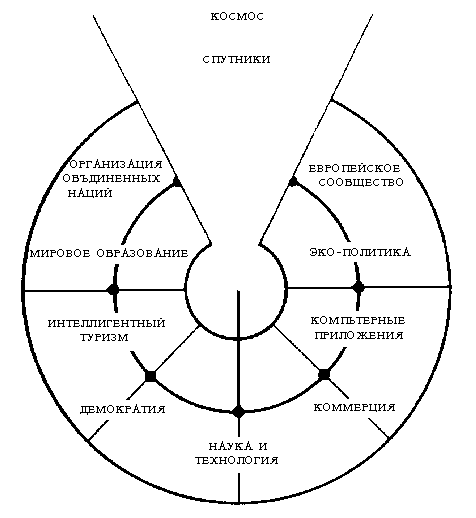
 
 
 

"Мировой научный словарный запас - это самая близкая вещь
к лексикону действительного Глобального Языка, который человечество уже достигло. Он берет свои слова из
двух мертвых языков - латыни и герческого." 
 

 (Prof. Hogben in his 'Vocabulary of Science') 
 
 

GLOSA IS NOT AN INVENTION   
IT'S A DISCOVERY.  
 

ISBN 0 946540 15 2&nbsp;&nbsp;&nbsp;
 
 
</TD>
</TR>
</TABLE>

 
 

