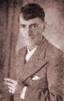
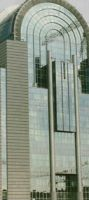
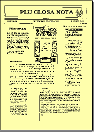
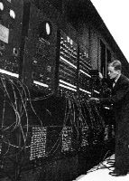
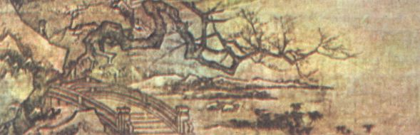
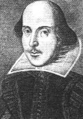
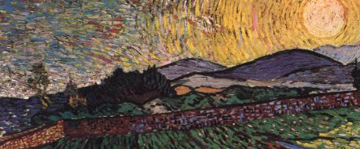
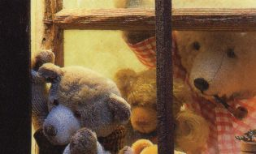
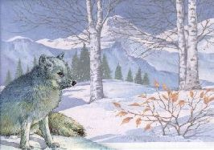
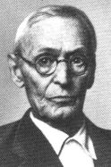

---
title: Kleine Glosa-Textsammlung
layout: post
published: true
date: 2018-10-11
---  
  
<span id="start"></span>


-----

## Inhalt

  - [Paraleli textu](gtexte.htm#Paraleli) (Aus der Sprachplanung von L.
    Hogben, dem Erfinder von Interglossa, der Urform von Glosa. Glosa -
    Englisch)
  - [Glosa - puri komunika](gtexte.htm#Komunika) (aus der Zeitung "Plu
    Glosa Nota" Nr. 75, Jan./Feb. 1996. Nur Glosa)
  - [Ido](gtexte.htm#Ido) (Gary R. Miller, gepostet nach Glosalist,
    2003. Gedanken zu Ido, Esperanto und Glosa. Glosa - Englisch)
  - [Glosa in Brussel](gtexte.htm#Brussel) (aus "Plu Glosa Nota" Nr. 63,
    Nov./Dez. 1993, S. 4. Glosa wird dem Europäischen Parlament
    vorgestellt. Glosa - Englisch)
  - [Grama](gtexte.htm#grama) (W. Ashby. Brief an die Abonnenten von
    "Plu Glosa Nota". Juni 2000. Glosa - Englisch)
  - [Information Technology](gtexte.htm#IT) (Kurzer Sachtext. Glosa -
    Englisch)
  - [Piski hedo](gtexte.htm#piski) (Fisch-Vergnügen. Chinesische
    Kurzgeschichte. Nicht einfach. Glosa - Englisch)
  - [Sonnet 18](gtexte.htm#Sonnet) (W. Shakespeare. Original Englisch -
    Glosa - Deutsch)
  - [Sleep](gtexte.htm#Sleep) (W. Shakespeare. Original Englisch - Glosa
    - Deutsch)
  - [U spe](gtexte.htm#Zamenhof) (Gedicht vom Esperanto-Erfinder L. L.
    Zamenhof. Umfangreiche Erläuterungen zur Glosa-Übersetzung.
    Esperanto - Glosa - Englisch)
  - [Boreo Venti e un Helio](gtexte.htm#boreo) (Aesop. Nordwind und
    Sonne. Fabel. Glosa - Englisch)
  - [Tri ursus](gtexte.htm#triursus) ("Drei Bären". Kindergeschichte
    nacherzählt von R. Gaskell. Nur in Glosa)
  - [Pusi rubi toga ...](gtexte.htm#pusi) ("Little Red Riding Hood"
    Kindergeschichte nacherzählt von R. Gaskell. Nur in Glosa)
  - [Cinerala](gtexte.htm#Cinerala) ("Aschenputtel". Märchen nacherzählt
    von R. Gaskell. Nur in Glosa)
  - [U Lupus](gtexte.htm#lupus) ("Der Wolf". Hermann Hesse, 1903. Glosa
    (unvollendet) - Deutsch)

*<span class="underline">Anmerkung</span>: Einige der folgenden Texte
sind urheberrechtlich von der GEO geschützt und als solche mit dem
©-Symbol markiert. Adresse ist: GLOSA Education Organisation; 35
Wingfield Road; Kingston Upon Thames; Surrey KT2 5LR; ENGLAND.*

<span id="Paraleli"></span>

-----

 L. Hogben (Erfinder des
Glosa-Vorläufers Interglossa)  
  
  

## Paraleli Textu

*(Wendy Ashby & Ronald Clark, © GEO, 1993. Aus der Sprachplanung von
Prof. L. Hogben. Aus dem Buch "Central Glosa", ISBN 0-946540-19-5)*

|                                                                                                                                                                                                                                                                                                                                                                                                                                                                                                                                                                                                                                                                                                                                                |  |                                                                                                                                                                                                                                                                                                                                                                                                                                                                                                                                                                                                                                                                                                                                                                                                                                              |
| ---------------------------------------------------------------------------------------------------------------------------------------------------------------------------------------------------------------------------------------------------------------------------------------------------------------------------------------------------------------------------------------------------------------------------------------------------------------------------------------------------------------------------------------------------------------------------------------------------------------------------------------------------------------------------------------------------------------------------------------------- |  | -------------------------------------------------------------------------------------------------------------------------------------------------------------------------------------------------------------------------------------------------------------------------------------------------------------------------------------------------------------------------------------------------------------------------------------------------------------------------------------------------------------------------------------------------------------------------------------------------------------------------------------------------------------------------------------------------------------------------------------------------------------------------------------------------------------------------------------------- |
| *Glosa Textu*                                                                                                                                                                                                                                                                                                                                                                                                                                                                                                                                                                                                                                                                                                                                  |  | *English Text*                                                                                                                                                                                                                                                                                                                                                                                                                                                                                                                                                                                                                                                                                                                                                                                                                               |
|                                                                                                                                                                                                                                                                                                                                                                                                                                                                                                                                                                                                                                                                                                                                                |  |                                                                                                                                                                                                                                                                                                                                                                                                                                                                                                                                                                                                                                                                                                                                                                                                                                              |
| **A prima vista posi id feno u no-spe ergo de face u verba-lista; qi fu sati panto nece volu de interkomunika; sed inklude ne ma de, posi, u kilo basi verba.**                                                                                                                                                                                                                                                                                                                                                                                                                                                                                                                                                                                |  | At first sight it may seem a hopeless task to construct a vocabulary that would cover all the essential words of intercommunication, yet contain not more than, say, a thousand basic words.                                                                                                                                                                                                                                                                                                                                                                                                                                                                                                                                                                                                                                                 |
|                                                                                                                                                                                                                                                                                                                                                                                                                                                                                                                                                                                                                                                                                                                                                |  |                                                                                                                                                                                                                                                                                                                                                                                                                                                                                                                                                                                                                                                                                                                                                                                                                                              |
| **U nu nova-papira uti minimo 20 000 verba; e in English mero de mikro English - French marsu lexiko proxi 10 000 gene lista. Pe ne nece stude id mega tem te detekti u mega mero de lista es ne-nece.**                                                                                                                                                                                                                                                                                                                                                                                                                                                                                                                                       |  | A modern newspaper assumes acquaintance with perhaps 20,000, and in the English section of a very humble English - French pocket dictionary some 10,000 are listed. It requires no lengthy scrutiny to discover that a large portion of the material is not essential.                                                                                                                                                                                                                                                                                                                                                                                                                                                                                                                                                                       |
|                                                                                                                                                                                                                                                                                                                                                                                                                                                                                                                                                                                                                                                                                                                                                |  |                                                                                                                                                                                                                                                                                                                                                                                                                                                                                                                                                                                                                                                                                                                                                                                                                                              |
| **U logika ge-face verba-lista sio apo multi sinonima alo proxi-sinonima, de qi Anglo-Amerika lingua es ple. Ex. *little - small*, *big - large*, *begin - commence*. Id ne nece tolera funktio imbrika homo *band - ribbon - strip*. Plus, id sio evita excesi specializa per face mo verba akti qod in Plu Palaeo Lingua gene face per tri alo ma. Exempla, u France demo nima un extra tegu de homi soma *la peau*, u-la de cepa *la pelure*; e u-la de botuli *la cotte*. Anti na es mei precise de France demo, na auto supra-kargo u lexiko per ko-responde seri *skin - rind - jacket - peel*. Kron na vide u difere inter *thread - twine - cord - string - rope - tow* na solo kumu nima epi nima pro qo es, a fini u metri-difere.** |  | A rationally constructed word-list would discard many synonyms or near-synonyms, of which Anglo-American is chock-full. Ex. little - small, big - large, begin - commence. It need not tolerate such functional over-lapping as band - ribbon - strip. It would also steer clear of over-specialization by making one word do what in natural languages is often \[done\] by three or more. Thus, the outer cover of the human body is called *la peau* in French, that of the onion is *la pelure*, and that of the sausage *la cotte*. Though less fastidious than the French, we ourselves overburden the dictionary with the corresponding series skin - rind - jacket - peel. When we distinguish between thread - twine - cord - string - rope - tow we are merely heaping name upon name for what is ultimately a difference in size. |
|                                                                                                                                                                                                                                                                                                                                                                                                                                                                                                                                                                                                                                                                                                                                                |  |                                                                                                                                                                                                                                                                                                                                                                                                                                                                                                                                                                                                                                                                                                                                                                                                                                              |
| **Na sio pote facili vice u nu ma de sati verba semani lauda alo no-lauda per oligo nima. Sed u-ci apo ne sio tena na intra u mo-kilo verba limita. Na nece skope ad hetero-lo pro auxi; e ci na pote apliko ko profito, si na aplika id sofi, u basi principo de Dalgarno *"Art of Symbols"*.**                                                                                                                                                                                                                                                                                                                                                                                                                                               |  | We could easily replace the existing plethora of vocables denoting approval or disapproval by a bare handful of names. But rejection of such would not keep us within the 1000 word limit. We have to look elsewhere for help; and here we can apply with profit the basic principles of Dalgarno's "Art of Symbols".                                                                                                                                                                                                                                                                                                                                                                                                                                                                                                                        |
|                                                                                                                                                                                                                                                                                                                                                                                                                                                                                                                                                                                                                                                                                                                                                |  |                                                                                                                                                                                                                                                                                                                                                                                                                                                                                                                                                                                                                                                                                                                                                                                                                                              |
| **Pan Euro-lingua habe plu verba; qi inklude u semaini de grupa. Exempla, u generali termi clothes include bi duce klasi; plu infra-ve \[...\] e extra-ve \[...\]. Homo-co, domi include sko-do, drama-do, puni-do, rura-do, patho-do, monstra-do.**                                                                                                                                                                                                                                                                                                                                                                                                                                                                                           |  | All European languages have words which embrace the meaning of a group. Thus the general term clothes includes 2 main classes; under-clothes including vest, shirt, knickers, petticoat and outer clothes including frock, skirt, trousers, coat. In the same way building covers school, theatre, prison, villa, hospital, museum etc. etc. ....                                                                                                                                                                                                                                                                                                                                                                                                                                                                                            |
|                                                                                                                                                                                                                                                                                                                                                                                                                                                                                                                                                                                                                                                                                                                                                |  |                                                                                                                                                                                                                                                                                                                                                                                                                                                                                                                                                                                                                                                                                                                                                                                                                                              |
| **U kura compara examina posi sio detekti; Nu-English habe ma-boni generali verba homo food, drink, container, instrument klasi de exempla, France- alo Espania-lingua.**                                                                                                                                                                                                                                                                                                                                                                                                                                                                                                                                                                      |  | A careful comparative investigation would probably reveal that modern English is far better equipped with words of the food, drink, container, instrument class than French or Spanish for instance.                                                                                                                                                                                                                                                                                                                                                                                                                                                                                                                                                                                                                                         |
|                                                                                                                                                                                                                                                                                                                                                                                                                                                                                                                                                                                                                                                                                                                                                |  |                                                                                                                                                                                                                                                                                                                                                                                                                                                                                                                                                                                                                                                                                                                                                                                                                                              |
| **Id es fo-klari; plu klasi verba de u-ci speci, nece akti u gravi rola in u tekto de ekonomi vokabulari; kausa mu sti na pote dice alo grafo de u maxi numera de difere ra, operatio e qalita, per mini numera de idio nima. A funda, verba ekonomi pende ex sofi elekti de plu generali termi e deskribe parafrase pro plu speciali uti.**                                                                                                                                                                                                                                                                                                                                                                                                   |  | It is self-evident that classifying words of this sort must play an important part in the build-up of an economical vocabulary, because they enable us to refer to a maximum number of different things, operations and properties with a minimum of separate names. At bottom word economy depends on judicious selection of general terms and descriptive periphrase for specific uses.                                                                                                                                                                                                                                                                                                                                                                                                                                                    |

<span id="Komunika"></span>  
  

(Zurück zum [Seitenanfang](gtexte.htm#start). Zur
[Glosa-Seite](glosa.htm).)

-----

  
R. Clark (Glosa-Entwickler)  
  
  
 W. Ashby (Glosa-Entwicklerin)  
  
  

## Glosa - puri komunika

*(Ronald Clark & Wendy Ashby, © GEO, 1996; aus der Zeitschrift "Plu
Glosa Nota", ISSN 0265-6892, Nr. 75, Januari/Februari 1996;
Internetfassung Paul O. Bartlett, 1996)*

Ex kron a kron uno civi fu protesta; "Sed Glosa feno kopi un English
modela; sura id debi difere?"

Panto Cina ami dice iso. Glosa funktio iso Cina lingua.

Un explika es; panto "natura" lingua es ple de no-nece lingui rude; qi
pa gene kolekti dia loka histori de u demo.

Plu milenia retro plu Cina sofo-pe pa unio; e pa akorda; mu lingua pa
tena multi no-nece lexi. Mu pa nima mu "plu vaku lexi." Mu imedia pa
komanda apo plu-ci lexi; e id pa gene akti.

E komo boni-fortuna mu progeni ko seqe\!

U mega Medika Bibli ge-translati ad-in Cinese es mega ma tenu de
ur-English.

**Si panto krati pa akti iso plu-la Ur-Cinese; panto mu sio habe nu u
loka Glosa.**

Glosa habe zero no-nece-ma. Id habe solo Puri komunika.

Panto na sufero u deino dina-doci imedia na gene nati. Matri e patri
proto u procesi; e plu eduka-pe fini id.

Oligo civi fu posi protesta; "Sura, u-la semani; Glosa es no-stimula, u
no-kroma lingua?" A qi na repli; u-la es veri; solo si tu es Lexi-filo e
Kosmo-fobo.

E u kausa de pan-ci no-nece-ma? A-nu plu lexiko e lingua generali pa es
infra literari domina.

Nu-di plu krati eduka-pe kritici u mali grafo de plu infanti a fini de
sko-do. U veri es; plu mini infanti es mega ma intelige de mu so-ge-nima
doci-pe. gutura 'ch'. Na no-dura pronuncia u paleo mode. Sed, ge-liga a
traditio, na dura grafo id\! Na pa grafo de Society for Simplified
Spelling in PGN 55 (pagina 3).

Boni-fortuna, Glosa pa gene nati ex enkefa de Prof. Hogben, u linguisti
sed, plus, u skiencisti; e an pa vive fo-hedo in reali kosmo; qi es mega
ma interese e kroma-ple de u literari lexi-munda.

An, u skiencisti, pa eureka an poesi in reali kosmo. Uno-pe pa bali a mi
Wordsworth poema "I wandered lonely as a cloud...."

Ja, mi akorda, kali\! Sed u poeta vide solo u mikro mero de reali kosmo;
u skiencisti pote fru infinita ma plu kali in u-la flori.

**GLOSA ES U LINGUA DE SKIENCE. ID ES PURI KOMUNIKA.**

<span id="Ido"></span>  
  

(Zurück zum [Seitenanfang](gtexte.htm#start). Zur
[Glosa-Seite](glosa.htm).)

-----

``` 
 _  _
  /.   Gary
#/\#
 ###
```

## Ido

(Gary R. Miller, gepostet nach Glosalist 2003 als Antwort auf einen
Artikel über die Vorzüge der Hilfssprache Ido. Anmerkung: Dies ist
lediglich die persönliche Meinung eines Glosa-Sprechenden. Bitte
respektieren Sie das und schreiben Sie zu diesem Abschnitt keine
Kommentare.)

|                                                                                                                                                                                                                                                                                                                                                                                                                                                                                                                                                                                                                                                                                                                                                                                                                                                                                                                                                                                                                                                                                |  |                                                                                                                                                                                                                                                                                                                                                                                                                                                                                                                                                                                                                                                                                                                                                                                                                                                                                                                                                                                                                                                                                                                                                                                |
| ------------------------------------------------------------------------------------------------------------------------------------------------------------------------------------------------------------------------------------------------------------------------------------------------------------------------------------------------------------------------------------------------------------------------------------------------------------------------------------------------------------------------------------------------------------------------------------------------------------------------------------------------------------------------------------------------------------------------------------------------------------------------------------------------------------------------------------------------------------------------------------------------------------------------------------------------------------------------------------------------------------------------------------------------------------------------------ |  | ------------------------------------------------------------------------------------------------------------------------------------------------------------------------------------------------------------------------------------------------------------------------------------------------------------------------------------------------------------------------------------------------------------------------------------------------------------------------------------------------------------------------------------------------------------------------------------------------------------------------------------------------------------------------------------------------------------------------------------------------------------------------------------------------------------------------------------------------------------------------------------------------------------------------------------------------------------------------------------------------------------------------------------------------------------------------------------------------------------------------------------------------------------------------------ |
| *Glosa Textu*                                                                                                                                                                                                                                                                                                                                                                                                                                                                                                                                                                                                                                                                                                                                                                                                                                                                                                                                                                                                                                                                  |  | *English Text*                                                                                                                                                                                                                                                                                                                                                                                                                                                                                                                                                                                                                                                                                                                                                                                                                                                                                                                                                                                                                                                                                                                                                                 |
|                                                                                                                                                                                                                                                                                                                                                                                                                                                                                                                                                                                                                                                                                                                                                                                                                                                                                                                                                                                                                                                                                |  |                                                                                                                                                                                                                                                                                                                                                                                                                                                                                                                                                                                                                                                                                                                                                                                                                                                                                                                                                                                                                                                                                                                                                                                |
| **Plu karo Glosalist-pe,**                                                                                                                                                                                                                                                                                                                                                                                                                                                                                                                                                                                                                                                                                                                                                                                                                                                                                                                                                                                                                                                     |  | Dear Glosalists,                                                                                                                                                                                                                                                                                                                                                                                                                                                                                                                                                                                                                                                                                                                                                                                                                                                                                                                                                                                                                                                                                                                                                               |
|                                                                                                                                                                                                                                                                                                                                                                                                                                                                                                                                                                                                                                                                                                                                                                                                                                                                                                                                                                                                                                                                                |  |                                                                                                                                                                                                                                                                                                                                                                                                                                                                                                                                                                                                                                                                                                                                                                                                                                                                                                                                                                                                                                                                                                                                                                                |
| **Es u kausa; qo-ka Ido ne gene ma uti de Esperanto -- Esperanto es ma facili a nu.**                                                                                                                                                                                                                                                                                                                                                                                                                                                                                                                                                                                                                                                                                                                                                                                                                                                                                                                                                                                          |  | There is a reason that Ido has not surpassed Esperanto -- Esperanto is still easier.                                                                                                                                                                                                                                                                                                                                                                                                                                                                                                                                                                                                                                                                                                                                                                                                                                                                                                                                                                                                                                                                                           |
|                                                                                                                                                                                                                                                                                                                                                                                                                                                                                                                                                                                                                                                                                                                                                                                                                                                                                                                                                                                                                                                                                |  |                                                                                                                                                                                                                                                                                                                                                                                                                                                                                                                                                                                                                                                                                                                                                                                                                                                                                                                                                                                                                                                                                                                                                                                |
| **Anti, Ido pa face ma facili u gramatika de nima-verba e de deskribe-verba, Ido pa habe un adi de oligo forma de akti-verba.   U sko de gramatika de u ge-stru lingua more nece u pusi tem, anti-co u sko de lexiko nece fo mega tem.   Ido habe u ma mega lexiko de Esperanto.**                                                                                                                                                                                                                                                                                                                                                                                                                                                                                                                                                                                                                                                                                                                                                                                             |  | Although Ido has simplified grammar for nouns and adjectives, it has added several infinitives.   Learning grammar for a constructed language usually requires a short time, but learning the vocabulary requires a much longer time.   Ido has a larger vocabulary than Esperanto.                                                                                                                                                                                                                                                                                                                                                                                                                                                                                                                                                                                                                                                                                                                                                                                                                                                                                            |
|                                                                                                                                                                                                                                                                                                                                                                                                                                                                                                                                                                                                                                                                                                                                                                                                                                                                                                                                                                                                                                                                                |  |                                                                                                                                                                                                                                                                                                                                                                                                                                                                                                                                                                                                                                                                                                                                                                                                                                                                                                                                                                                                                                                                                                                                                                                |
| **Po gene experi ko dona sko de xeno lingua e plus ko dona sko de England-lingua a xeno-pe, mi ne este sura; un audi ex lingua-skience-pe fu face u ge-stru lingua; qi fu es sati uti a munda.   Mi pa gene ex mi stude-pe -- e ex mi auto stude -- u ski; kron mu gene u no-facili stato, mu fo puta de plu verba e no-memo alo face ge-konfusi plu gramatika adi-ra.   U ge-stru lingua ko ma forti de pusi lexiko e ko mei forti de severi gramatika feno es u "natura" lingua, kompara-co Esperanto e Ido feno es plu "logika" lingua.**                                                                                                                                                                                                                                                                                                                                                                                                                                                                                                                                   |  | Having experience with both teaching foreign languages and teaching English to foreigners, I am not sure that listening to linguists will produce a constructed language that will be sufficiently useful for the world.   I have noticed in my students -- and in my own studies -- that, when faced with a difficult situation, they concentrate on vocabulary and forget or confuse grammatical inflections.   A constructed language with more emphasis on small vocabulary and less emphasis on a rigid grammar seems to be a "natural" language, whereas Esperanto and Ido seem to be "logical" languages.                                                                                                                                                                                                                                                                                                                                                                                                                                                                                                                                                               |
|                                                                                                                                                                                                                                                                                                                                                                                                                                                                                                                                                                                                                                                                                                                                                                                                                                                                                                                                                                                                                                                                                |  |                                                                                                                                                                                                                                                                                                                                                                                                                                                                                                                                                                                                                                                                                                                                                                                                                                                                                                                                                                                                                                                                                                                                                                                |
| **Mi ne posi proba ra; mi nu pa grafo, ka, kompara-co plu logika lingua posi gene grafo epi papira e gene u monstra; mu du seqe certa modela, na ne posi vide ad-in homi cerebra te gene logi de ra; qi acide kron pe gene sko de plu lingua.   Es oligo pragma; mi doxo habe spe: Anti, paleo-pe gene sko de xeno lingua es no-facili, mi pa gene plu grama per Glosa ex tri homi; qi habe ma de seti-ze anua.   Uno ex mu habe ma de okto-ze\! Plus-co mi auto bi fe-fili pa gene sko de Glosa ko ma facili de Esperanto.   Proto-kron mi tenta lekto Glosa, id feno no-logi a mi, ka mi tenta detekti plu gramatika fini-ra epi panto verba e ne pote logi u difere inter nima- e akti-verba.   Nu-tem feno: mi menta pa gene ma logi e panto verba habe ma de mo <span class="underline">gramatika</span> semani.   Panto-ci dona a mi u kredi; pe gene sko de Glosa per sko mode; qi es in homi cerebra ko ma natura de sko mode; qi nece habe un uti de logika -- qi es uno-ra; pe nece gene <span class="underline">pre</span> pe pote gene sko de Esperanto alo Ido.** |  | I cannot prove what I have just written because, whereas logical languanges can be written on paper and shown to follow specific patterns, we cannot see into the human brain to understand just what is happening when languages are learned.   There are some things I find encouraging: Although it is difficult for old people to learn foreign languages, I have received letters in Glosa from three people who were over seventy years old.   One of these was over eighty\! Also, my own two daughters have learned Glosa more easily than Esperanto.   When I first tried to read Glosa, it seemed like gibberish to me because I was looking for grammatical endings on the words and could not tell a noun from a verb.   Now it is as if my mind has broadened and every word has more than one <span class="underline">grammatical</span> meaning.   All this causes me to believe that Glosa is learned by a learning pattern that occurs more naturally in the human brain rather than by a learning pattern that requires the use of logic -- which is something that must be learned <span class="underline">before</span> anyone can learn Esperanto or Ido. |
|                                                                                                                                                                                                                                                                                                                                                                                                                                                                                                                                                                                                                                                                                                                                                                                                                                                                                                                                                                                                                                                                                |  |                                                                                                                                                                                                                                                                                                                                                                                                                                                                                                                                                                                                                                                                                                                                                                                                                                                                                                                                                                                                                                                                                                                                                                                |
| **Gratia de audi de mi teori -- uno-ra; a qi lingua-skience-pe posi dona u nima "melano-teka" teori.**                                                                                                                                                                                                                                                                                                                                                                                                                                                                                                                                                                                                                                                                                                                                                                                                                                                                                                                                                                         |  | Thank you for listening to my theory, something linguists might call a "black-box" theory.                                                                                                                                                                                                                                                                                                                                                                                                                                                                                                                                                                                                                                                                                                                                                                                                                                                                                                                                                                                                                                                                                     |
|                                                                                                                                                                                                                                                                                                                                                                                                                                                                                                                                                                                                                                                                                                                                                                                                                                                                                                                                                                                                                                                                                |  |                                                                                                                                                                                                                                                                                                                                                                                                                                                                                                                                                                                                                                                                                                                                                                                                                                                                                                                                                                                                                                                                                                                                                                                |
| **Saluta,**                                                                                                                                                                                                                                                                                                                                                                                                                                                                                                                                                                                                                                                                                                                                                                                                                                                                                                                                                                                                                                                                    |  | Greetings,                                                                                                                                                                                                                                                                                                                                                                                                                                                                                                                                                                                                                                                                                                                                                                                                                                                                                                                                                                                                                                                                                                                                                                     |
|                                                                                                                                                                                                                                                                                                                                                                                                                                                                                                                                                                                                                                                                                                                                                                                                                                                                                                                                                                                                                                                                                |  |                                                                                                                                                                                                                                                                                                                                                                                                                                                                                                                                                                                                                                                                                                                                                                                                                                                                                                                                                                                                                                                                                                                                                                                |
| ***Gary R. Miller***                                                                                                                                                                                                                                                                                                                                                                                                                                                                                                                                                                                                                                                                                                                                                                                                                                                                                                                                                                                                                                                           |  | *Gary R. Miller*                                                                                                                                                                                                                                                                                                                                                                                                                                                                                                                                                                                                                                                                                                                                                                                                                                                                                                                                                                                                                                                                                                                                                               |

<span id="Brussel"></span>  
  

(Zurück zum [Seitenanfang](gtexte.htm#start). Zur
[Glosa-Seite](glosa.htm).)

-----

 Gebäude des Europäischen
Parlaments in Brüssel

## Glosa in Brussel

*(Wendy Ashby, © GEO, 1993. Aus der Zeitschrift "Plu Glosa Nota", Nr.
63, Nov/Dec '93, S. 4. Englische Übersetzung von Robin Gaskell, 1994)*

|                                                                                                                                                                                                                                                                                                                                                                                                                   |  |                                                                                                                                                                                                                                                                                                                                                                                                                                                                    |
| ----------------------------------------------------------------------------------------------------------------------------------------------------------------------------------------------------------------------------------------------------------------------------------------------------------------------------------------------------------------------------------------------------------------- |  | ------------------------------------------------------------------------------------------------------------------------------------------------------------------------------------------------------------------------------------------------------------------------------------------------------------------------------------------------------------------------------------------------------------------------------------------------------------------ |
| *Glosa Textu*                                                                                                                                                                                                                                                                                                                                                                                                     |  | *English Text*                                                                                                                                                                                                                                                                                                                                                                                                                                                     |
|                                                                                                                                                                                                                                                                                                                                                                                                                   |  |                                                                                                                                                                                                                                                                                                                                                                                                                                                                    |
| **Tem August de 1993 na pa gene invita a Brussels a Konfera de u posi uti de u Ge-Face Lingua in Euro-Parlamenta.**                                                                                                                                                                                                                                                                                               |  | In August, 1993 we were invited to Brussels to a Conference on the Possibility of using a Designed Language in the European Parliament.                                                                                                                                                                                                                                                                                                                            |
|                                                                                                                                                                                                                                                                                                                                                                                                                   |  |                                                                                                                                                                                                                                                                                                                                                                                                                                                                    |
| **Meno-nona 1993 pa es mi proto visita a Brussels e Europa Parlamenta (EP). Oligo membra de EP e pusi idio stude grega - Hanns-Seidel Stiftung pa organiza u debata ge-nima: U Komunika e Lingua Problema in Europa Komunita - a qo metri u ge-face lingua pote kontribu ad id solve. Mi pa gene invita te representa Glosa ad u-ci unio. Dr. Egon A. Klepsch, Presidenta de Europa Parlamenta pa apri un unio.** |  | September was my first visit to Brussels and the European Parliament (EP). For a few members of the EP and a small specialist study group, Hanns-Seidel Stiftung organised a debate named, \`The Communication and Language Problem in the European Community - to what measure can designed language contribute to its solution.' I was invited to represent Glosa at this meeting. Dr. Egon A. Klepsch, President of the European Parliament opened the meeting. |
|                                                                                                                                                                                                                                                                                                                                                                                                                   |  |                                                                                                                                                                                                                                                                                                                                                                                                                                                                    |
| **MERO MO.   Proto, na pa dice de "Qe id es u komunika e/alo lingua problema? A qo-metri un idea de u komuni e neutra ge-face lingua posi kontribu a solve u-ci problema." Oligo-pe qi ergo in Europa Komisio pa dice de auto experi de plu lingua problema ex punkta de vide de: membra de EP, interpreta-pe, traduce-pe, plu ergo lingua problema, e u problema de plu loka e minori lingua.**                  |  | PART 1. First, we talked about "Is it a communication and/or language problem? How much can the idea of a common and neutral designed language contribute to solving this problem?" A few people who work in the European Commission spoke about their own experience of the language problem, from the point of view of: members of the EP, interpreters, translators, the working-language problem, and the problem of local and minority languages.             |
|                                                                                                                                                                                                                                                                                                                                                                                                                   |  |                                                                                                                                                                                                                                                                                                                                                                                                                                                                    |
| **MERO BI.   Pe pa dice de plu ge-face lingua, plu prejudika alo minus de info de mu, plus u histori de ge-face lingua movimento. E sura, multi persona ne ski; plu ge-face lingua existe. Poli-pe ci pa doxo; un idea de ge-face lingua es fo interese.**                                                                                                                                                        |  | PART 2. People spoke about designed languages, the predjudices or lack of information about them, and the history of the designed language movement. And surely, many people did not know that designed languages existed. Everyone here had the opinion that the idea of designed language is very interesting.                                                                                                                                                   |
|                                                                                                                                                                                                                                                                                                                                                                                                                   |  |                                                                                                                                                                                                                                                                                                                                                                                                                                                                    |
| **Po-meso-di sesio pa proto kon introduce a tri ge-face lingua; e ci, mi pa dice de Glosa, id struktura, verba lista e progresi. Po-co u presidenta de unio pa sti u diskusi de plu posi; panto Euro-pe fu disci mu auto nati lingua plus bi hetero lingua, mo Euro-lingua, e mo ge-face lingua. U-ci es un ideali solve te tena plu lingua e kultura difere in Komunita.**                                       |  | The afternoon sessionstarted with an introduction to three designed languages, and here I spoke about Glosa, its structure, vocabulary and progress. After that the Chairman of the meeting opened discussion on the possibility that all Europeans would learn their own native language plus two other languages, one European language and one designed language. This is an ideal solution to maintain the language and cultural differences in the Community. |
|                                                                                                                                                                                                                                                                                                                                                                                                                   |  |                                                                                                                                                                                                                                                                                                                                                                                                                                                                    |
| **In fini-dice maxi numera persona pa doxo; un unio es u mega sucede, interese e info-ple. Id pa gene proposi; u seqe unio fu acide in 1994; fo-posi u ma longi duskusi dura bi alo tri vice mo di.**                                                                                                                                                                                                             |  | In concluding, most people gave the opinion that the meeting was a great success, interesting and informative. It was proposed that a following meeting would occur in 1994, very possibly with a longer discussion lasting two or three days, instead of one.                                                                                                                                                                                                     |
|                                                                                                                                                                                                                                                                                                                                                                                                                   |  |                                                                                                                                                                                                                                                                                                                                                                                                                                                                    |
| **Mi pa fru un unio; ne solo kausa u tema; sed, plus, id pa don a mi un okasio de enkontra multi persona; qi, a-nu, mi pa ski solo per grama-kambio.**                                                                                                                                                                                                                                                            |  | I enjoyed the meeting, not only because of the theme, but, also, it gave me an chance to meet many people, who, until now, I had known only through the exchange of letters.                                                                                                                                                                                                                                                                                       |
|                                                                                                                                                                                                                                                                                                                                                                                                                   |  |                                                                                                                                                                                                                                                                                                                                                                                                                                                                    |
| **Mi pa habe u boni fortuna de vide u neo Hemi-cikla de Parlamenta, Michael Elliott na MEP pa duce mi peri. Mi pa es la duranto Di2 e pa sedi in galeri epi pedi-lo 6. Peri un holo hemi-cikla es plu kamera; topo sedi plu interpreta-pe poste kloro vitri. Mi pa skope mu; e nu pa vide un enormo kosto ge-involve ci; e pa puta u fo-gravi ekonomi Glosa ofere.**                                              |  | I had the good fortune of seeing the new Hemicircle of Parliament: Michael Elliott, our MEP led me around; I was there during the second day, and sat in the gallery on Stand 6. Around the whole hemicircle, are rooms, in which sit interpreters, behind green glass. I looked at them, and now saw the enormous cost involved here, and thought of the very important economy Glosa offers.                                                                     |
|                                                                                                                                                                                                                                                                                                                                                                                                                   |  |                                                                                                                                                                                                                                                                                                                                                                                                                                                                    |
| **Mi este mega gratia ad Hanns-Seidel Stiftung; qi pa invita mi ad unio; e qi pa don u valuta pro viagia e hoteli.**                                                                                                                                                                                                                                                                                              |  | I feel much gratitude towards Hanns-Seidel Stiftung, who invited me to the meeting, and who donated the money for travel and hotel.                                                                                                                                                                                                                                                                                                                                |
|                                                                                                                                                                                                                                                                                                                                                                                                                   |  |                                                                                                                                                                                                                                                                                                                                                                                                                                                                    |
| **Wendy Ashby**                                                                                                                                                                                                                                                                                                                                                                                                   |  | Wendy Ashby                                                                                                                                                                                                                                                                                                                                                                                                                                                        |

<span id="grama"></span>  
  

(Zurück zum [Seitenanfang](gtexte.htm#start). Zur
[Glosa-Seite](glosa.htm).)

-----

 Die Zeitung "Plu Glosa Nota"

## Grama

*(Wendy Ashby, Juni 2000)*

|                                                                                                                                                                                                                                                                            |  |                                                                                                                                                                                                                                                                                                                                 |
| -------------------------------------------------------------------------------------------------------------------------------------------------------------------------------------------------------------------------------------------------------------------------- |  | ------------------------------------------------------------------------------------------------------------------------------------------------------------------------------------------------------------------------------------------------------------------------------------------------------------------------------- |
| *Glosa Textu*                                                                                                                                                                                                                                                              |  | *English Text*                                                                                                                                                                                                                                                                                                                  |
|                                                                                                                                                                                                                                                                            |  |                                                                                                                                                                                                                                                                                                                                 |
| **Karo plu Glosa - ami**                                                                                                                                                                                                                                                   |  | Dear Glosa friends,                                                                                                                                                                                                                                                                                                             |
|                                                                                                                                                                                                                                                                            |  |                                                                                                                                                                                                                                                                                                                                 |
| **Mi este penite tu ne pa gene "Plu Glosa Nota" ex longi tem. U kausa pro u-la pause es; Ron Clark pa lose bio. An pa sufere Kardia-pato pa anua; e non-hedo u sekonda pato u-ci meno pa es fatali.**                                                                      |  | I am sorry you haven't received "Plu Glosa Nota" for a while. The reason for the pause is that Ron Clark died. He suffered a heart attack last year, and sadly a second attack this month was fatal.                                                                                                                            |
|                                                                                                                                                                                                                                                                            |  |                                                                                                                                                                                                                                                                                                                                 |
| **Ron pa es ple de energi e entusiasmo pro Glosa; an pa sufere brevi-tem memo-lose tem plu pre meno; anti-co, an pa kontinue Glosa ergo e reakti ad oligo grama.**                                                                                                         |  | Ron's energy and enthusiasm for Glosa never waned and in spite of suffering short term memory loss during the past few months he continued to work and answer some of the letters.                                                                                                                                              |
|                                                                                                                                                                                                                                                                            |  |                                                                                                                                                                                                                                                                                                                                 |
| **A-nu, mi ne es sura de plu futura Glosa publikatio e aktivi; mi fu grafo itera ma tardi u-ci anua. Inter-tem, mi ski poli tu in difere landa gene hedo komunika per grama alo e-posta te difusi e uti Glosa. Nu, mi ne habe e-posta, tu dura pote uti un eko-lo supra.** |  | I am not yet sure what Glosa publications and activities will be planned for the future. I will write again later in the year. Meanwhile I know many of you in various countries are enjoying communicating via letter or e-mail to spread and use Glosa. I do not have e-mail at the moment, the above address remains in use. |
|                                                                                                                                                                                                                                                                            |  |                                                                                                                                                                                                                                                                                                                                 |
| **Gratia de tu auxi e de plu grama, translati e idea qi tu bali.**                                                                                                                                                                                                         |  | Thank you for your support and for the letters, translations and ideas which you send.                                                                                                                                                                                                                                          |
|                                                                                                                                                                                                                                                                            |  |                                                                                                                                                                                                                                                                                                                                 |
| **plu ami saluta**                                                                                                                                                                                                                                                         |  | Best wishes                                                                                                                                                                                                                                                                                                                     |
|                                                                                                                                                                                                                                                                            |  |                                                                                                                                                                                                                                                                                                                                 |
| ***Wendy Ashby***                                                                                                                                                                                                                                                          |  | *Wendy Ashby*                                                                                                                                                                                                                                                                                                                   |

<span id="IT"></span>  
  

(Zurück zum [Seitenanfang](gtexte.htm#start). Zur
[Glosa-Seite](glosa.htm).)

-----

 ENIAC-Computer

## INFORMATION TECHNOLOGY

*(Ronald Clark, © GEO, 1988)*

|                                                                                                                                                                                                                                                                                                                       |  |                                                                                                                                                                                                                                                                                                                                      |
| --------------------------------------------------------------------------------------------------------------------------------------------------------------------------------------------------------------------------------------------------------------------------------------------------------------------- |  | ------------------------------------------------------------------------------------------------------------------------------------------------------------------------------------------------------------------------------------------------------------------------------------------------------------------------------------ |
|                                                                                                                                                                                                                                                                                                                       |  |                                                                                                                                                                                                                                                                                                                                      |
| **U prima elektronika digita puta-me, ge-tekto in US, ENIAK, pa gene ge-monstro a Pennsylvania Universita 1946. Id pa ponde plu 30 tone, pa ple u space de u bi-vagona garage, e pa kontena plu 18 000 vakuo tuba; qi pa fali medio ad u rata mo singu septi minuta. Id pa kosto u semi-miliona dolar a 1946 preci.** |  | The first electronic digital computer built in the US, ENIAC, was unveiled at the University of Pennsylvania in 1946. It weighed 300 tonnes, filled the space of a two-car garage, and contained 18 000 vacuum tubes, which failed on average at the rate of one every seven minutes. It cost half a million dollars at 1946 prices. |
|                                                                                                                                                                                                                                                                                                                       |  |                                                                                                                                                                                                                                                                                                                                      |
| **Nu-di un iso quantita de puta-me-pote es ge-tena intra u pisu-metro silikon mika. Tanto ali domi puta-me; Kosto solo $100, pote super pasa ENIAK.**                                                                                                                                                                 |  | Today, the same amount of computing power is contained in a pea-sized silicon chip. Almost any home computer costing only about $100 can out-perform ENIAC.                                                                                                                                                                          |

<span id="piski"></span>  
  

(Zurück zum [Seitenanfang](gtexte.htm#start). Zur
[Glosa-Seite](glosa.htm).)

-----

  
Jen Jen-fa, Zeichnung (Ausschnitt) China um 1310

## PISKI HEDO

*(Wendy Ashby & Ron Clark, © GEO, 1994; aus dem Buch "GLOSA 1000 -
ENGLISH"; Internetbearbeitung Paul O. Bartlett, 1996)*

|                                                                                                                                                                                                        |  |                                                                                                                                                                                                                           |
| ------------------------------------------------------------------------------------------------------------------------------------------------------------------------------------------------------ |  | ------------------------------------------------------------------------------------------------------------------------------------------------------------------------------------------------------------------------- |
|                                                                                                                                                                                                        |  |                                                                                                                                                                                                                           |
| **PISKI HEDO**                                                                                                                                                                                         |  | FISH PLEASURE                                                                                                                                                                                                             |
|                                                                                                                                                                                                        |  |                                                                                                                                                                                                                           |
| **Chuangtze e Huitze pa gresi ad-epi ponti supra Hao; kron u-la pa dice; "Vide, komo plu piski sagita ci e la\! U-la es piski hedo\!"**                                                                |  | Chuangtze and Huitze had strolled on to the bridge over the Hao, when the former observed, "See how the fishes dart about. That is the pleasue of fishes."                                                                |
|                                                                                                                                                                                                        |  |                                                                                                                                                                                                                           |
| **"Tu auto ne es u piski," dice Huitze, "komo tu ski de piski hedo?"**                                                                                                                                 |  | "You yourself are not a fish," said Huitze, "how can you possibly know about the pleasure of fishes?"                                                                                                                     |
|                                                                                                                                                                                                        |  |                                                                                                                                                                                                                           |
| **"E tu ne es mi," reakti Chuangtze. Komo tu ski; mi ne ski?"**                                                                                                                                        |  | "And you not being I," retorted Chuangtze, "How can you know that which I do not know?"                                                                                                                                   |
|                                                                                                                                                                                                        |  |                                                                                                                                                                                                                           |
| **"Mi ne es tu, e ne ski; qod tu ski," reakti Huitze, "es iso mi doxo; tu ne es u piski; e tu ne pote ski de piski hedo."**                                                                            |  | "That I, not being you, do not know what you know," replied Huitze, "is identical with my argument that you, not being a fish, cannot know what fish pleasure is like."                                                   |
|                                                                                                                                                                                                        |  |                                                                                                                                                                                                                           |
| **"Lase na ki versi a qestio mo," pa dice Chuangtze. "Tu questio mi; komo mi ski de u reali piski hedo. Tu qestio monstra ke tu pa ski u-ra; mi pa ski. Mi pa ski id ex mi plu este epi i-ci ponti."** |  | "Let us go back to your original question," said Chuangtze. You ask me how I know in what consists the pleasure of fishes. Your very question shows that you knew I knew. I knew it from my own feelings on this bridge." |

<span id="Sonnet"></span>  
  

(Zurück zum [Seitenanfang](gtexte.htm#start). Zur
[Glosa-Seite](glosa.htm).)

-----

 W. Shakespeare

## Sonnet 18

*(Von William Shakespeare.  
Glosa-Übersetzung von Wendy Ashby und Ron Clark  
aus der Zeitschrift "Plu Glosa Nota", ISSN 0265-6892, Nr. 69, Nov./Dez.
1994;  
von der Internetseite von Paul O. Bartlett, 1996;  
deutsche Übersetzung von Gottlob Regis)  
*

Shall I compare thee to a summer's day?  
Thou art more lovely and more temperate.  
Rough winds do shake the darling buds of May;  
And summer's lease hath all too short a date;  
Sometimes too hot the eye of heaven shines  
And often is his gold complexion dimm'd;  
And every fair from fair sometimes declines  
By chance or Nature's changing course untrimm'd;  
But thy eternal summer shall not fade  
Nor lose possession of that fair thou ow'est;  
Nor shall Death brag thou wand'rest in his shade,  
When in eternal lines to time thou grow'st.  
So long as men can breathe or eyes can see,  
So long lives this, and this gives life to thee.  

Mi pote qe kompar tu ad estiva di?  
Tu es ma kali, e ma modera.  
Rugo venti seis plu dulce Mai gema  
E sola-tem hab fo fo brevi fru.  
Plu kron tro term u ciela oku noc,  
E freqe gen an kriso facia teg.  
E pan kali ex kali mo-kron mei  
Per fortun alo Natur muta ge-nok.  
Sed tu fo dur estive ne fu mor,  
Ni lose habe de tu auto kali;  
Ni fu Morta dic; tu vaga in an skot  
Kron in plu dura lin a tem tu kresc,  
Tem plu Homi spir e vid oku  
Tem viv u-ci; qi dona vit a tu.  

Soll ich dich einem Sommertag vergleichen?  
Anmutiger, gemäßigter bist du.  
Des Maies Lieblinge jagt Sturmwind von den Zweigen,  
Und nur zu früh gehn Sommers Pforten zu.  
Bald scheint zu heiß des Himmels Auge, bald  
Umdunkelt sich sein goldner Kreis; es weilet  
Das Schöne nie in seiner Wohlgestalt,  
vom Zufall, vom Naturlauf übereilet.  
Du aber sollst in ew'gem Sommer blühn,  
Nie deiner Schönheit Eigentum veralten;  
Nie soll dich Tod in seine Schatten ziehn,  
Wenn ew'ge Zeilen dich der Zeit erhalten.  
Solange Menschen atmen, Augen sehen,  
So lang lebt dies, und heißt dich fortbestehn.  
  
  

<span id="Sleep"></span>

(Zurück zum [Seitenanfang](gtexte.htm#start). Zur
[Glosa-Seite](glosa.htm).)

-----

## Sleep

*(aus William Shakespeare: Henry IV, Part 2, 3. Akt, 1. Szene;  
von der Internetseite von Paul O. Bartlett, 1996;  
Glosa-Übersetzung von Wendy Ashby und Ron Clark  
aus der Zeitschrift "Plu Glosa Nota", ISSN 0265-6892, Nr. 69, Nov./Dez.
1994;  
deutsche Übersetzung von Rudolf Schaller, Insel Vl. Frankfurt/M. 1981, ©
Rütten & Loening, Berlin 1978 )  
*

O sleep, O gentle sleep,  
Nature's soft nurse, how have I frighted thee  
That thou no more wilt weigh my eyelids down,  
And steep my senses in forgetfulness?  
Why, rather, sleep liest thou in smoky cribs,  
Upon uneasy pallets stretching thee,  
And hushed by buzzing night-flies to thy slumber,  
Than in the perfumed chambers of the great,  
Under the canopies of costly state,  
And lulled with sound of sweetest melody?  
O thou dull god, why liest thou with the vile  
In loathsome beds, and leav'st the kingly couch  
A watch case or a common 'larum bell?  
Wilt thou upon the high and giddy mast  
Seal up the ship-boy's eyes, and rock his brains  
In cradle of the rude imperious surge,  
And in the visitation of the winds,  
Who take the ruffian billows by the top,  
Curling their monstrous heads, and hanging them  
With deafening clamour in the slippery clouds,  
That with the hurly Death itself awakes?  
Canst thou, O partial sleep, give thy repose  
To the wet sea-boy in an hour so rude;  
And in the calmest and most stillest night,  
With all appliances and means to boot,  
Deny it to a king. Then, happy low, lie down\!  
Uneasy lies the head that wears a crown.

  

Somni, dulce somni  
Natura moli kura-fe, kom mi pa sti tu anti  
ke tu pa sto kata mi oku-teg  
e los mi este in oblivio.  
Qo-ka, Somni, tu kumbe in plu fumi do,  
Epi no-gluko kli prolongi tu,  
Ge-lula per plu buzi mosk a somn,  
De in plu fragra-do de grandi-pe,  
Infra plu kanapi de pluto stat,  
Ge-lula per son de dulce melodi?  
O tu xeno deo, qo-ka tu kumbe ko vulgu  
in plu putri kli; e linqi u regi kli  
un horo-me alo komuni vigi kodo?  
Tu qe fu epi vertigi masta  
Klude plu oku de navi-ju, e lul an psik  
in babi-kli de rug imperi undu;  
E in vista de plu venti;  
Qi rap plu rugo undu a plu krest,  
Kurva mu plu mega kef, e pende mu  
ko kako fono in plu glisa nef  
e in plu mega soni Morta auto gene vig?  
Qe tu pote, o no-justi Somn, don tu relax  
ad aqa navi-ju in ta rugo horo;  
E in maxi paci e no-soni nokt  
Ko panto auxi-ra e ru  
Ne don id ad u rex? So hedo bas kumbe\!  
Non-hedo kumb u kef; infra koron.  

  

(Der König im Nachtgewand: ...  
Wie viele tausend ärmster Untertanen  
Sind jetzt im Schlaf\! ...)

O Schlaf, o holder Schlaf\!  
Du sanfter Pfleger der Natur, wie scheucht ich dich,  
Dass du die Augenlider mir nicht schlössest,  
Mir nicht die Sinne in Vergessen tauchst\!  
Warum indes liegst du in rauchigen Hütten,  
Streckst dich auf einem dürren Strohbett aus,  
Wo Fliegen dich mit ihrem Krabbeln reizen,  
Statt in der Großen duftenden Gemächern,  
Unter der Reichen prächt'gen Baldachinen  
Und eingelullt von süßen Melodien?  
Du Gott des Schlafs, wie liegst du bei Geringen  
Auf schmutz'gem Bett und machst des Königs Lager  
Der Wachstub ähnlich, wo Alarme dröhnen?  
Versiegelst du auf schwindelnd hohem Mast  
Des jungen Seemanns Augen, schaukelst du  
In rauher, mächt'ger Wogen Wiege  
Und in der Winde Anprall, die die Wellen  
An ihren Riesenscheiteln kräuselnd packen  
Und sie laut tobend in die Wolken hängen,  
Dass fast der Tod, erwacht von ihrem Krachen?  
Kannst du, partei'scher Schlaf, denn deine Ruhe schenken  
Dem jungen Schiffer in so harter Stunde  
Und in der ruhigsten und stillsten Nacht  
Dem König sie verweigern, der Arznei hat?  
Dann, froher Armer, leg dich, schlaf gerecht:  
Ein Haupt, das eine Krone trägt, schläft schlecht.  

  
<span id="Zamenhof"></span>

(Zurück zum [Seitenanfang](gtexte.htm#start). Zur
[Glosa-Seite](glosa.htm).)

-----

 L. Zamenhof

## U spe

``` 
        LA ESPERO                               U SPE

En la mondon venis nova sento,        In u munda pa veni u neo este,
Tra la mondo iras forta voko;         Dia u munda ki u dinami voka;
Per flugiloj de facila vento          Epi plu ptero de u moli sufla venti
Nun de loko flugu ^gi al loko.        Nu, id sio peti ex loka a loka.

Ne al glavo sangon soifanta           Ne ad u gladia; dipso pro sangui,
^Gi la homan tiras familion:          Id tira u homi famili:
Al la mond' eterne militanta          Ad u munda; eterna milita,
^Gi promesas sanktan harmonion.       Id promise sakri harmoni.

Sub la sankta signo de l' espero      Infra u sakri signi de spe,
Kolekti^gas pacaj batalantoj,         Veni-unio plu guerila de paci,
Kaj rapide kreskas la afero           E rapidi kresce un afaire
Per laboro de la esperantoj.          Per u labora de plu-la; qi spe.

Forte staras muroj de miljaroj        Forti sta plu mura, de plu mile anua,
Inter la popoloj dividitaj;           Inter plu demo; ge-divide;
Sed dissaltos la obstinaj baroj,      Sed, ge-disolve fu es plu obstina baria,
Per la sankta amo disbatitaj.         Per sakri amoro, ge-klasto.

Sur ne^utrala lingva fundamento,      Epi u neutrali lingua funda-ra,
Komprenante unu la alian,             Logi aleli,
La popoloj faros en konsento          Plu persona fu face, de akorda,
Unu grandan rondon familian.          Uni mega famili cirkula.

Nia diligenta kolegaro                Na industri grega de kamerada,
En laboro paca ne laci^gos,           In u labori de paci, ne fu gene fatiga,
^Gis la bela son^go de l' homaro      A-kron u beli sonia, de homi
Por eterna ben' efektivi^gos.         Holo-tem ge-bene-dice, gene ge-reali.

   Lazaro Ludoviko Zamenhof (1859-1917)        Glosa ver. Robin Gaskell (1994)

English pivot version - used for translation:-

                   HOPE  (THE EXPECTATION)

                Into the world has come a new feeling,
                Through the world goes a powerful call;
                On the wings of a gentle breeze
                Now, it would fly from place to place.

                Not to sword thirsting blood,
                It draws the family of man:
                To the world, eternally at war,
                It promises sacred harmony.

                Beneath the sacred sign of hope,
                Gather the warriors of peace,
                And rapidly grows the venture
                Through the labour of those who hope.

                Strongly stand walls of a thousand years
                Between the peoples, divided;
                But, dissolved will be the obstinate barriers,
                Through sacred love, shattered.

                On a neutral language foundation,
                Understanding each other,
                People will make, in accord,
                One vast family circle.

                Our hardworking circle of companions,
                In the work of peace, shall not be exhausted,
                Until the beautiful dream, of mankind
                eternally blessed, is realised.
```

\[ *(Zur Übersetzung wurde in die Conlang Mailing List folgender Text
gepostet:)*

Hello Friends,

Well, I've done my best to render the Esperanto prayer into Glosa, as
Edmund Grimley-Evans requested.

I have gone for a translation of the meaning, rather than a rhyming
poetic interpretation. Edmund sent me Zamenhoff's original plus a very
poetically translated English-language version.

Below, I send the Glosa version beside the Esperanto original. As with
letters from Haitao, I had to use English as the pivot language between
Esperanto and Glosa; and, so, as a tag, include the Intermediate
Language version that I used to help me capture the flavour of
Zamenhoff's words.

Thank-you Edmund for suggesting this exercise, and for supplying me with
the original.

**NOTES.**

1.  Althogh I did not agree with the poetry of Zamenhoff's verses, at
    all times, I did not change the meaning - in the Glosa - for this
    reason.

2.  Owing to the limitations of the \_Glosa 6000\_ dictionary, and its
    having only a thousand words in the Eng --\> Glosa section, there
    were places where I was not happy with the Glosa word I used ..
    feeling it had not conveyed the exact meaning of the Esperanto.

3.  Where there was an option of using the Latin or Greek form, in
    Glosa, I chose the one that was closest to the Esperanto.

4.  I did cheat, on purpose, in two places, viz, eterna and harmoni. The
    Glosa dictionary gives: eterna - immortalise harmoni - agreement.  
    I thought I should get in early, in case someone checks them out, in
    \_Glosa 6000\_. Being a word-translation dictionary, it does not
    give alternative usages.

5.  The agglutinative/isolating difference led me to use more
    punctuation in the Glosa, than was in the original; and, I was
    tempted to spell out in the Glosa, in detail, some of the more
    complex of the Esperanto forms, but thankfully, for the sake of the
    poetry, I resisted.

6.  Agreed, this was poetry, and the rules of grammar are set aside, on
    occasions. However, where there was elision \[I like that word\], I
    observed it in the Glosa; this resulted in a few more semicolons,
    there, than in the original.
    
    ``` 
            e.g. Al la mond' eterne militanta     Ad u munda; eterna milita,
    
                                         =  Ad u munda; qi    es eterna    milita,
                                     Glos.  To a world, which is eternally at war,
      
    ```
    
    \`qi es eterna milita' is an adjectival clause; in Glosa, this is
    "flagged" in with a semicolon, and terminated with a comma. From my
    experience with syntax-based grammar, punctuation seems to be an
    essential part of the grammar - in the written form - indicating
    sentence structure. \[When speaking an isolating language, structure
    seem to need to be indicated - as it is in English - using rising
    and falling vocal inflections to mark clauses, and pauses in speech
    give the finer phrasal structure.\] The \`qi es' is elided, but the
    clause flags remain in place.

7.  Included is the participle, which is Glosa's one feature that could
    be accused of being a grammatical morphological form.
    
    ``` 
              Forti sta plu mura, de plu mile anua,
              Inter plu demo; ge-divide;                     divided
              Sed, ge-disolve fu es plu obstina baria,       dissolved
              Per sakri amoro, ge-klasto.                    destroyed
      
    ```
    
    The ge- is, I understand, borrowed from the German, and translates
    as "get X" or "got X" where X is tha concept/word; it is more or
    less equivalent to -ed, or -en, in English. 8. Esp. fundamento - Gl.
    funda-ra - Eng. foundation \`-ra' is one of the lexical category
    markers: "Y-ra" = Y thing. \`funda' means "bottom, to found, the
    ground"; so, \`funda-ra' means "bottom-thing" or "ground-thing" ...
    or "foundation."

Any errors, in the understanding of the Esperanto, are mine: apologies.
I trust I have not made any errors in the Glosa.

I look forward to reading feedback.

Robin\] <span id="boreo"></span>

(Zurück zum [Seitenanfang](gtexte.htm#start). Zur
[Glosa-Seite](glosa.htm).)

-----

  
V. van Gogh, Sonnenaufgang bei St-Rémy (Ausschnitt), 1899

## U Boreo Venti e un Helio

*(Fabel von Aesop. Glosa-Übersetzung von Robin Gaskell, 1993)*

### Glosa Textu

U boreo venti e un Helio pa du disputa de qi es u ma-dina, kron u
viagia-pe pa veni in vista; ge-tegu intra u termo-tena testa. Mu pa
akorda: u ra qi pa prima gene sucede de sti u viagia-pe apo an testa sio
gene judika ma-dina de u hetero ra. Poi u Boreo Venti pa fla; uti an
maxi dina; sed u ma an pa fla, u ma proxi a se u viagi-pe pa involve u
testa, peri an: e fini, u povre Boreo Venti pa sto tenta. Poi u Helio pa
radia ma termo; e imedia, u viagia-pe pa apo an testa. Ka-co u Boreo
Venti pa habe obliga konfesi: ke, de u bi, un Helio pa es u ma-dina.

### English Text

"The North Wind and the Sun were disputing which was the stronger when a
traveller came along wrapped in a warm cloak. They agreed that the one
who first succeeded in making the traveller take his cloak off should be
considered stronger than the other. Then the North Wind blew with all
his might, but the more he blew the more closely did the traveller fold
his cloak around him; and at last, the poor North Wind gave up the
attempt. Then the Sun shone out warmly, and immediately the traveller
took off his cloak. And so the North Wind was obliged to confess that
the Sun was the stronger of the two."

<span id="triursus"></span>  

(Zurück zum [Seitenanfang](gtexte.htm#start). Zur
[Glosa-Seite](glosa.htm).)

-----



## TRI URSUS

*Redice ex Robin Gaskell*

Mo kron, intra u mega foresta pa es tri ursus. Mu habita u dekora domi
intra u pusi klara, sed holo peri u domi pa habe plu dendro. Ki apo u
domi, u steno via pa duce inter plu dendro.

Singu matina, u matri ursus pa kuko pulsa pro mu prima vora. Sed freqe,
u ge-kuko pulsa pa habe mega tro termo pro plu ursus te vora, e mu pa
nece atend id gene sati tepido.

U-ci di pa eqa tal u di, e u patri ursus pa judika ke mu sio gresi intra
u foresta tem u pulsa pa gene ma tepido. An famili pa hedo akorda, ka id
pa es u fo kali di de tosto blasto-tem. Ko-co, mu pa vesti-se kongrue ko
u fresko aero: u matri ursus pa vesti u kefa-ve e u lana tegu; u patri
ursus pa habe epi an u paki mantela; e u pusi ursus pa vesti-se in
no-braki mantela e poda-ve.

Pre mu pa ki apo u domi, u patri ursus pa moti tri sedi-mo peri u tabla;
u matri ursus pa loka tri disko epi u tabla antero plu sedi-mo, e pa
fusi u pulsa in mu; e seqe u-la, u pusi ursus pa loka tri spatula para
plu disko.

Kron mu pa ki ex u domi, Patri ursus pa tira u janua tende klude id, sed
an ne pa examine id: u di pa habe ta kali ke an pa kurso te juga an
famili; qi, a tem, pa du tako moti longi u via. U janua pa reste sub
aperi, e plu ursus pa vanesko in u foresta.

Ko-co, iso tem plu ursus pa du gresi apo mu domi, u pusi ju-fe; qi pa es
ge-lose intra u foresta, pa veni in u klara. Fe pa vide un ursus domi, e
pa kurso, voka, ad id.

Po oligo minuta, fe pa sto voka, poi fe pa komence bate ko fe manu u
janua, dice, "Mi nima es Kriso-ciri. Place lase mi in; mi es ge-lose\!"

E nu, te explika de Kriso-ciri: u ju-fe pra vaga in u foresta minus
permito. Holo tem, fe pa tange plu ra; qi fe pa gene dice ne tange, e pa
ki a plu loka; qi fe pra gene dice ne ki. Tem u-la ideo di ke plu ursus
pa du gresi in u foresta, Kriso-ciri pra judika, pluso, skope plu natura
flori in u foresta.

Minus kogita, fe pra ki ma e ma tele in u foresta, e fe pra gene toto
ge-lose. E nu, in u klara, fe detekti u pusi-do in qi es no persona. Ko
bi pluso forti bati epi u janua, id pa aperi. Iso tu sio expekta, fe pa
lase-se in. Intra u domi, fe ne pa kredi fe vide: epi u tabla plu disko
de fresko pulsa pa du vapori, e fe pa habe ta fago-vo.

Prima, fe pa tenta u makro sedi-mo de u partri ursus, sed id pa habe tro
sklero, e plus, u pulsa intra u makro disko pa habe tro termo. So, fe pa
judika tenta u seqe loka.

U meso sedi-mo pa es ma pusi de u prima, sed id pa habe u grandi pulvina
epi id, e u-ci pa habe tro moli. Plus, u pulsa antero id, in u meso
metro disko pa habe tro frige. Imedia po gusta u-ci frige pulsa, fe pa
salti ex u moli sedi-mo, e pa kurso ad u hetero latu de u tabla.

La fe pa tenta u pusi sedi-mo; qi pa habe fo kongrue pro fe, plus, u
pulsa intra u pusi disko pa eqa veri exakto pro fe, e fe pa toto fago
id. Anti fe pra habe pleni de fago-ma, fe pa vo habe ma. Fe pa vo habe
ma pulsa, e pa du gene koleri.

Kron fe pa koleri bate u tabla ko u spatula par u vakuo disko, u
sedi-mo, in qi fe pa du sedi, pa frakto. Seqe-co, Kriso-ciri pa tako
kade ad u pedi-lo, e pa gene u mega bate ex id.

Ka fe natura, u-ci bate pa kausa fe te gene ma koleri. Fe pa vo voka,
sed pre fe pa aperi fe stoma te akti id, fe pa kogita; fe pa habe mega
somni este, e u pedi-lo pa es fo konsola. Fe pa este fo fatiga po fe
vaga intra u foresta, e fe pa ski; fe pa nece habe somni.

Minus u seqe kogita pro u ge-noce kuko-ka, Kriso-ciri pa gene epi fe plu
pedi, e pa peti ana plu skala ad u supra-stratu, te gene u kli. Fe pa
kade epi u prima kli; fe skope, sed id pa habe mega sklero: u-ci mega
kli pa pertine u patri ursus. No hedo, fe pa leve-se te kade epi u kli;
par u-ci sklero mo.

Anti-co, u sekunda kli pa pertine u matri ursus, e, iso u pulvina, pa
habe mega tro moli. Id ne pa place u pusi ju-fe. Fo fatiga, fe pa
leve-se te tenta un ultima kli.

Kron kriso-ciri pa horizotali auto epi u kli tri, fe pa imedia somni. U
ju-fe, habe ta somni e ta pleni de pulsa, ne pa habe un abile te ten
aperi fe plu okula. Plus, u pusi ursus kli pa dona ta konsola a fe, ke
fe pa profundi somni.

Fe pa du somni kron plu ursus pa ki verso te vora mu prima-vora. Sed qod
konfusi\! "Qod persona pa du vora mi pulsa?" pa dice u patri ursus.

"E qo-pe pa du vora mi pulsa?" pa dice u matri ursus.

E, pa voka u pusi ursus, "Qo-pe pa du vora mi pulsa? Mu pa vora holo
id\!"

Ko-co, u patri ursus pa vide ke an sedi-mo pra es ge-moti: "Qod-pe pa du
sed epi mi sedi-mo?" pa dice u patri ursus.

U matri ursus, vide ke fe pulvina pa es ge-plati, pa dice, "E qo-pe pa
du sed epi mi sedi-mo?"

U no-hedo pusi ursus pa vide an ge-noce sedi-mo, e pa voka, "E qo-pe pa
du sed epi mi sedi-mo? Mu pa holo frakto id\!"

Plu ursus pa skope-se ko mira, e rogo-se de pluso noce de mu domi. Tako,
mu pa ki ana plu skala te skope u supra-stratu. U patri ursus pa es u
prima ki in u kli-ka, e, kron an pa vide u tegu ex an kli, pa dice,
"Qo-pe pa du somni intra mi kli?"

E u matri ursus, vide u kavita intra fe moli kli, pluso dice, "E qo-pe
pa du somni intra mi kli?"

Kron u pusi ursus pa gene to an kli, an pa vide Kriso- ciri, e pa voka,
"Uno-pe pa du somni intra mi kli, e fe, a nu, es la\!"

U matri e patri ursus, akusti plu-ci nova, pa kurso ad u pusi ursus kli.
Mu pa du skope u ra; qi pra kausa ta noce intra mu domi, sed mu pa
no-kredi ke u pusi ju-fe sio posi kausa holo u-la noce.

U proxi-lo de plu ursus pa sti vive Kriso-ciri; qi pa judika ke plu
in-habita de u domi posi sio habe koleri pro fe. So, fe pa salti ex u
kli, e, minus u "Saluta," pa kurso ad u fenestra, e pa peti-se ad u tera
infra id.

Plu ursus, ge-trauma de fe no-civili mode, pa tako moti ad u fenestra:
la mu pa skope mu juve visita-pe kurso longi u steno via, e mu pa tosto
lose vista de fe. U matri ursus pa voka, "Veni retro pusi ju-fe: veni te
dice ko na." Sed Kriso- ciri pa ski ke fe pra es fo mali, e fe ne pa
kredi ke u matri ursus sio posi habe amika este pro fe.

Tristi, plu ursus pa atende u seqe visita ex mu pusi amika, sed minus
profito. Mu Pa freqe dice de u festa; qi mu sio don a fe, si fe ki itera
a mu domi.

Kriso-ciri pa gene ta trauma ex un acide ke, ex u-la tem, fe pa holo-tem
respekto plu ra de plu hetero-pe, e pa obedie un ad-voka; qi plu
hetero-pe pa don a fe.

Poli-kron, po fe visita ad u foresta, Kriso-ciri pa rogo auto si plu
ursus pa ali-kron pardo fe. Qe, Kriso-ciri pa seqe ki itera, in u
foresta, te don a plu ursus fe apologi?

Posi fe pa ki-in la, te cerka un ursus domi, sed na fu nuli ski.

<span id="pusi"></span>

(Zurück zum [Seitenanfang](gtexte.htm#start). Zur
[Glosa-Seite](glosa.htm).)

-----

 R. Gaskell  
  
  

## PUSI RUBI TOGA .....

*Re-dice ex Robin Gaskell*

U helio pa dona termo; id pa es u proto di de Blasto-tem. Alterno,
durante plu fini di de Hiemo, u meteo pra habe mega frigi; e, holo-tem,
u ju-fe; qi es u subjekti de u-ci histori, pra tegu-se ko fe epi-equs
toga.

U toga pa habe rubi kolori; e holo persona de fe viki pa memo id. Mu pa
voka, "Pusi Rubi Toga; qe, tu habe tro termo?" Vero, kron fe pa gresi
intra u bato nivi, u rubi toga pa tena fe termo; e fe ne pa gene frigi.

U-la helio di, u matri de u pusi ju-fe pa dice a fe, "Pusi Rubi Toga, mi
habe ergo pro tu. Pre tu tira-ex tu toga, tu nece fero u-ci rami-va de
fago-ma a tu parenta-matri. Na ne pa vide fe tem u holo Frigo-tem, ka u
nivi pa du habe tro bato; sed nu, ko u ma termo meteo, tu nece ki."

Pluso, u matri de Pusi Rubi Toga, pa kontinu dice, "U nivi du gene liqi
ka u termo de nu-di helio; sed tu nece tako moti a la, e retro." Fe pa
monito, "Resta epi u via: ne sto; e, maxi gravi, ne dice ko ali-pe."

U matri pa pasa u rami-va a Pusi Rubi Toga; pa oskula fe; e pa apri u
tyra. U ju-fe pa habe un ultima spira de meso-termo aero; pa prende u
rami-va; pa fixa tegu peri-se fe epi-equs toga; e pa kursi dia u tyra.

Pusi Rubi Toga pa peti trans plu agri; qi habe solo oligo centi- metri
de nivi. U toto vista pa habe leuko; sed fe pa ski u silvi pa gene
proxi, ka u nivi pa gene ma bato. Tosto, dia plu floka de nivi; qi nu
pra komence kade, fe pa vide plu dendro de u silvi; e fe soma pa vibra
de frigi.

U-ci vide pa kausa fe tira u pluso mega spira de aero; e, tegu-se intra
fe toga ma fixa de previo, fe pa kursi ma tako de previo, dia u kade
nivi.

Intra u silvi, u ge-kade nivi pa habe mega bato; e inter plu dendro, il
pa habe mei foto. So, Pusi Rubi Toga pa habe mega dificile de detekti u
via. Fe pa dura kursi, sed ma lento nu, intra u bato nivi.

Plu umbra pa feno moti; e u ju-fe pa pote audi plu pusi zoa; qi pa moti
inter plu dendro.

Pui, fe pa gene proxi morta\! Mo umbra; ma mega de plu hetero, pa feno
kresce: u-ci trauma pa lento fe moti. Klei ma mali, un-la umbra pa voka;
e fe pa feno vide u longi gri barba. "Qo nima habe tu, kali ju-fe?" id
pa dice, "E qo-lo tu ki?" id pa adi.

Anti u persona pa habe u gri barba, an voka pa soni tro juveni; e Pusi
Rubi Toga pa gene ge-fobo. Fe pa memo plu verba de fe matri; so, kursi
ma forti, fe pa pasa u gri morfo; e dura tako kursi. Sed, ko-co, fe pa
pluso memo fe plu more; e pa voka retro ad u longi gri barba, "Rubi
Toga: visita mi parenta-matri." Po-co, fe pa kursi u holo dista.

U ju-fe pra tanto gene morta. Veri, id pra eqa u lupus; e, anti u zoa
pra habe mega fago-vo, id ne pa es minus sofi. Sio id ne es ma boni
atende fe ariva to u paleo gina loka, te vora amfi u ju-fe e fe
parenta-matri - habe u konsola de u meso-termo domi? U lupus ski u gina
pusi-domi; e tako kursi peri u silvi te gene la.

Per u strategi de dice ke id pa es Rubi Toga, u lupus pa tosto gene in u
parenta-matri domi. Intra u domi, id pa kapti u parenta-matri; e tira-ex
fe noktu-vesti pre vora fe.

Sed pui, vide ke fe pa habe ta tenu, u lupus pa decide te prima vora u
gluko Rubi Toga; e seqe, si no ge-sati, habe u mero de u paleo gina te
sati auto. Ko-co, u lupus pa pulsa u paleo gina in u vesti-mo. U lupus
sio habe no nece de fe pre id pa kompleti id vora de u ju-fe.

U-la Frigo-tem pra dura u fo mega tem; e u lupus ne pra ridi tem poli
mene. Id pa kogita ke u tem pa es justi pro u mero de komika.

Si id pa vesti-auto in u parenta-matri noktu-vesti, id pa kogita; id sio
sporta ko Rubi Toga, per akti iso u paleo gina. U lupus tako trakto
epi-se u rosa ge-kolori noktu-vesti; e, ka id pa pote audi Pusi rubi
Toga veni, id mali tako loka epi id kefa u rosa ge-kolori kapila-tegu,
tem id pa du gene in u parenta-matri kli.

Iso-tem u lupus pa sed intra u kli; e pa plika peri-auto u parenta-matri
kapita, te kleisto an gri kapila, Rubi Toga pa du kursi epi u via ad u
domi, voka, "Parenta-matri, Parenta-matri."

Pre fe pa gene ad u domi, u lupus pa habe ta sati tem te kompleti id
kripto-ve, per loka epi id longi nasa, u paleo gina plu lenti ex u tabla
alelo u kli. Pui, u soni de Rubi Toga bate epi u tyra pa eko dia u domi.

"Ki in Rubi Toga: u tyra habe apri," pa dice u lupus utilo u raso voka.
Pusi Rubi Toga pa qestio-auto de Paremta-matri voci; sed, ge-perplexi,
fe pa pulsa u tyra e pa ki-in.

Iso fe pa gresi in u domi, fe pa kogita ad-auto, "U-la feno xeno,
Parenta-matri nuli-kron lase aperi fe tyra." Seqe oligo pluso grada in u
domi, fe pa sto te kogita, itera. Fe pa qestio-auto: per qo mode fe
Parenta-matri pa ski de fe visita ... e qo-pe posi pa dice de id a fe?

Rubi Toga pa feno sensi un odori de ratus ... alo uno-ra ma mega\! U
ju-fe proto pa fobo pro fe parenti-matri; pui pa questio-se qod posi pa
acide ci. Fe pa resolve vide qi, alo qod, pa es intra u domi; e poi
judika qod akti.

Kron Rubi Toga pa vide u lupus du sedi intra u kli, id pa sti mega ma
fobo in fe de kron fe enkontra id intra u silvi. Saliva pa kade per plu
guta ex id ora; e id plu denti pa sembla iso bi line de plu akuto
seka-ru. Plus-co, u lupus pa feno u ridi-ra; ge vesti intra plu gina
noktu-ve.

Pusi Rubi Toga pa logi ke fe pa habe u dificile loka; e, pluso, fe pa
ski ke fe pa nece tako kogita de fe akti te gene apo. Fe pa habe certa;
u lupus ne pra logi ke fe pra detekti id infra u kripto-ve. So, fe pa
judika ke u maxi boni akti pro fe pa es de sporta u lupus ludo a-tem fe
sio vide fe exit.

Habe u no-turba toni intra fe voka, Pusi Rubi Toga pa dice, "Qod plu fo
mega auri tu habe, Parenta-matri\!"

U lupus, kogita ke id strategi pra akti, pa hedo u-ci joko; e pa
responde, "Holo ma boni te audi tu, mi karo." U menta de u ju-fe pa tako
moti: qod sio fe posi akti? Plu murmura; qi veni ex uno-lo intra u domi
plus u kura de plu parenta-matri epi u lupus, pa sura fe ke u paleo gina
pa dura habe bio. Anti-co, Rubi Toga pa ski mu loka pa habe mega perilo.

Fe pa judika: fe sio okupa u lupus per ma konversa ko id; e fe pa
kontinu, "Oh\! Parenta-ma, qod plu fo mega okula tu habe\!"

U lupus, fo ge-place ko id joko, pa dice retro, "Holo ma boni te vide
tu, mi karo." Ko-co, u lupus pa este id du gene un algo faringi ex uti u
raso voka; so id judika id sio sto u komika, e ki avanti ad u vora-tem.

Per boni fortuna, u-la kron u moti, extra u fenestra, pa kapti Rubi Toga
okula. Id pa es u kloro vesti de u peleki-an. Pusi Rubi Toga, fo anxio
te sema ad an, pa seiso fe mani, uti u mode; qi u lupus ne posi vide. Te
sti dura amusa u lupus te gene ma tem, u ju-fe pa ski ke fe nece dona mo
pluso qestio ad u lupus. Anti-co, iso tosto de fe pa dice id, fe pa ski
id pa es u mali fortuna elekti.

"E Parenta-ma, qod plu fo mega denti tu habe." fe voka.

"Holo ma boni te vora tu, mi karo." u ge-famo lupus pa voka. Pluso, id
pa dice, iso id pa salta ex u kli, "E nu mi fu akti id\!"

U ju-fe pa don un akuto voka de fobo; e pa proto kurso peri u kamera -
expekta u peleki-an ki-in, ali-kron, te salva fe. U lupus pra tanto
kapti Rubi Toga kron u kloro- vesti morfo pa peti in u kamera, oscila u
peleki in un aero.

U ju-fe pa tako salta infra u kli. Pui fe pa akusti u peleki bate u kli;
e fe pa vide u gri kefa, kron id pa bate u pedi-lo. U-ci subito vide pa
sti fobo in fe: un ora, ko holo id plu denti, kade aperi, e pa lase u
flue de saliva forma in u stagna epi u pedi-lo; Plu lensa pa habe
ge-frakto; e u kefa-ve nu habe rubi kolori, ne rosa.

U peleki-an pa trakto Rubi Toga ex fe loka; infra u kli; e pa examina
fe. U ju-fe pa habe no noce; sed u parenta-matri; qi mu lase-ex u
vesti-mo, pra sufere fo trauma.

Poi, mu pa re-vesti u paleo gina, e pa sedi fe intra u sedi-mo. Pusi
Rubi Toga pa bulo u mero de hydro intra u vapo-va; e pa face u gluko
tasa de tea pro pan-pe. Pre u vapo-va pra gene bulo, Rubi Toga pa sti
laxa fe parenta-matri per loka u kosina poste fe dorsi; e fe pa konsola
fe ko u fago intra fe rami-va.

Tem-co, u peleki-an pa tira extra, u lupus soma; e pa tegu id ko suela.
Pluso, an pa sti piro plu ge-hema kli tegu; e an pa puri u pedi-lo de
hema.

Po plura hora plu bi visita-pe pra face versa, a norma, u domi. Seqe mu
dice vale u parenta-matri. Te don imuni a fe, u peleki-an pa gresi ko
Rubi Toga dia u silvi a fe domi. Tem mu pa du gresi alelo, an pa don a
fe info de plu more de plu lupus.

Pa es noktu, tem Rubi Toga pa gene a fe domi: fe matri pa habe mega
turba intra fe menta pro fe fe-fili. Kron u matri pa akusti u histori de
Rubi Toga enkontra ko u lupus in u silvi, e plu seqe acide, fe pa dice
imperio ke Rubi Toga ki a fe kli, sine fago.

Rubi Toga matri pa dice-gratia u peleki-an pro salva bi fe matri e
fe-fili; e te monstra fe lauda pro an, fe don ad an tri domi ge-face
kasea e u rami-va de Frigo-tem kokus.

SEQE NOTA  
Duranto u-la noktu, habe u vakua gastri, Rubi Toga pa kumbe epi fe kli,
e pa kogita. Fe pa judika, proto; fe nuli-tem sio es itera no-obedie fe
matri. Po-co, fe pa judika; fe sio nuli-tem itera ki solo in u silvi.

E ultima, fe pa judika, si fe habe u fe-fili, fe fu nuli-tem habe ta
stupidi te kausa u ju-fe ki solo in u silvi.

<span id="Cinerala"></span>

(Zurück zum [Seitenanfang](gtexte.htm#start). Zur
[Glosa-Seite](glosa.htm).)

-----

## Cinerala

*Redice ex Robin Gaskell*

E nu, ci es u reali histori de Cinerala. Tu posi previo pa akusti de
Cinerala, sed plu hetero histori, de u-ci ju-fe, dice de magika. Sura,
plu-pe utili un idea de \`magika' te obskura plu veri faktu, alo te
simplifi u histori pro plu infanta.

Iso plu hetero histori, Cinerala es u centralo karaktera; sed intra u-ci
veri histori, tu fu detekti u reali kausa de plu acide. U tem imedia pre
plu acide de u-ci histori, Cinerala pa habita u mega no-puri kuko-ka de
u mega paleo domi. U domi pa habe loka intra u pusi viki de u pusi
regi-landa, ge-loka intra Europa duranto plu Skuto Tem. U-la tem, plu
matri pa habe permito de bate mu plu fe-fili; plu an-prince pa habe u
libera te game ali gina de mu regi-landa; e plu dina grandi persona pa
gene pusi reakti anti mu plu kako skema.

Vita pa pasa minus muta: plu matri pa bate mu plu fe-fili; plu plu
regi-pe pa dona krati a mu landa iso id pa eqa mu ludo-ra; e plu dina
grandi persona pa libe akti mu plu skema.

U Cinerala histori dice de mo ideo an-regi, mo ideo dina grandi persona,
mo ideo matri, e mo ideo fe-fili. Duranto u bi-ze anua regi-tem de
Frederiko u Liberali, plu acide pa eqa norma: an pa face plu legi; e plu
ge-regi-pe pa obedie. Sura, plu legi nili-tem pa habe gravi. Ko-co, ex u
kastela de Fe Magika; ge-loka to u dista margina de u regi-landa, pa ki
poli xeno histori. Plu-pe ne pa ki proxi fe kastelaka mu pa habe fobo de
id. Anti-co, Fe Magika ne pa es u magika-fe, sed fe pa tenta akti so.

De plu ge-regi-pe de Frederiko, mo pa es Fe Pompo; qi habita u grandi
domi ko fe tri fe-fili. Fe pa liberali uti u valuta; e holo- tem pa habe
epi fe-auto plu maxi mode vesti. U valuta; qi permito fe de habe u loka
intra societa, pa veni ex fe andra; qi pa gene morta. Kron fe pa gamo
an, Fe Pompo pa habe bi fe-fili; e fe andra pa habe mo kali fe-fili,
ge-nima Kali. Post u morta de fe patri, Kali pa eqa u fe-fili; qi pa
gene u bate ex Fe Pompo. Alterno, fe hemi-fe-sibi pa ki a holo plu socia
eveni; e, te akti so, pa gene poli dekora vesti.

Ma mali de co, Fe Pompopo don a Kali holo un ergo de pura mu domi. Mali
fortuna, plu vesti de u ju-fe pa gene lacera e ge-tegu ko u cinera ex
plu piro-lo. Proto, fe plu hemi fe-sibi e hemi-matri pa nima fe
"Cinera," seqe "Cinera-la," e po-co "Cinerala." Kali, qi pa debi geneti
u grandi domi, anti-co, pa gene sti per dina te akti iso u servi-pe.

Klu-co, plu-ci ra pa eqa plu norma acide intra u regi-landa to u-la tem.
E plu-ci acide sio pa dura iso, durante poli anua; sed, kausa Antoni, id
ne pa es so. U-ci Antoni pa es un An-prince Antoni; qi pra kreske a
mo-okta anua tem an ki-in u bio de Kali. Plu-pe pa expekta, an sio game;
sed Antoni pa nuli-tem dice de id; e an patri, An-regi Frederiko, pa
habe mega anxio de an selekti u gina.

Holo plu juveni femina de u regi-landa pa vo game An-prince Antoni; sed
an pa monstro no volu pro plu femina. Fe Pompo e holo fe plu amika pa
dice de nuli alterno: qo-fe Antoni fu game, e qo-tem. Sura, bi Bibi e
Fibi, plu kako fe-fili de Fe Pompo, pa puta skope Mu-auto intra u
regi-do.

U faktu: ke Antoni ne pa amo plu ju-fe, pa es ge-ski de u holo demo.
An-regi Frederiko pa tenta, per poli mode, sti Antoni te enkontra plu
kali pluto femina, sed de no seqe. An-prince Antoni pa ski: plu-ci juve
femina pa dice alelo, u holo tem, de plu vesti mode e de plu ki e akti
de plu-pe intra pluto societa. Qod an pa cerka pa eqa plu realo persona,
e mo realo juve femina. Plu-pe pa du dice: ke Antoni nuli-tem fu gene
ge-game; e un an-regi pa sensi id pa gene tem pro an tenta u specialo
eveni te detekti u gina pro an an-fili. An pa kogita: "U juveni andra
nece gene uno-fe. Pro u regi-landa, an debi akti id." e an judika, "Mi
nece uti akti-dina te kausa an elekti u gina."

Akorda-co, un idea pa kresce intra u menta de un an-regi; u-ci idea pa
kresce e pa kresce a-kron id pa forma-se in u mega grandi-kore.
Frederiko u Liberali pa judika: an sio petitio pan plu ge-regi-pe, e,
pluso, plu pluto juveni femina ex plu proxi e tele regi-landa. Mu fu
habe u grandi-kore; qi fu gene ge-memo tem poli anua; e Antoni fu
selekti u gina.

U skema pa habe kompleti. Kausa holo u publika, pano-pe sio
este-expekta: Antoni nece selekta u gina. "Sura," Frederiko pa puta,
"Antoni sio amo mo de plu-ci ju-fe. Ultima, mi habe an\!"

E so, id pa sembla. Antoni pa gene dona un info de u grandi- kore; e an
pa ski: an pa habe no posi okasio te sto id. Seqe, u mega numera de plu
petitio pa gene bali, ex u regi-do, in plu peri landa. Pa es no salva
pro Antoni; an pa logi: ke u-ci eqa u fini. An sio nece game mo de
plu-ci mode-vesti, vakua-kefa ju-fe.

Un info de u-ci fu-eveni pa kausa fo mega excita in u regi- landa. E,
intra u domi de Cinerala, pa es disputa ex eo a vespa ... qod fe-sibi
sio gene vikto de un an-prince: Fibi, u paki fe-sibi, per fe lato ski de
u grandi societa; alo Bibi, un alti mo, ko fe ski de pano mikro mero de
vesti mode.

Tem-co, u holo demo pa habe mega stimula koncerne u grandi- kore - e u
seqe game - klu intra plu maxi tele gona de Frederiko regi- landa. Intra
u maxi dista mo de plu-ci gona, pa es ge-situa u kastela de Fe Magika. E
intra u ge-torti menta de Fe Magika, u mali skema pa gene morfo. Intra u
bio de An-prince Antoni, Fe Magika sio kausa konfusi: fe sio injekti u
kali juveni femina in u grandi-kore te klepto Antoni ex plu pluto
societa femina. Prima, Fe Magika pa nece detekti u kongrue no ge-ski
ju-fe. Po-co fe sio nece dona kali ad u ju-fe, e tegu fe intra u maxi
dekora vesti - pre bali fe in u grandi- kore.

Fe Magika pa mite fe espio, Hogo, in plu viki e agri-landa te kripto
detekti holo plu no ge-ski ju-fe; e te tosto reporta a fe. So, per u-ci
mode, Cinerala pa gene selekti ki ad u grandi-kore. Fe fu sio es u
dekora ge-vesti, misteri kali-fe; qi kapti u kardia de un An-prince.

Po plura di, Hogo pa ki verso a Fe Magika ko un info: Cinerala pa eqa u
persona; pro qi fe pa cerka. An pa kredi: fe sio muta in u maxi kali
gina; qi fu kapti u kardia de un An-prince.

Fe Magika pa memo Cinerala e fe patri. "Veri," fe kogita, "Nuli-pe pa
dona justi a Cinerala; sed, per u-ci skema, mi sio posi akti id." Fe pa
medita, "Posi mi fu akti uno-ra boni, u-ci kron." Seqe, il pa es mega
ergo intra u skoto kastela. U maxi dekora kore- vesti pa gene ge-face; e
pluso, plu medika-ma te dona kali a Cinerala pa gene ge-prepara.

Duranto u di pre u grandi-kore, u holo regi-landa pa habe u stato de
excita. Kontra-co, pro Cinerala, u-la di pa es tanto no-tolera: ka plu
hemi-fe-sibi pa moti fe ci e la, no-stop, u holo tem. Fe pa ergo ta
forti ke fe pa volu somni minus vora. E, posto plu hetero femina pa ki
apo, Cinerala pa kade, tanto somni, epi fe kli. Tem fe soma pa bate u
kli, fe pa memo kogita, "Lase mu habe mu grandi-kore." e posto u-la,
nuli.


Qod un extra norma somni-pikto fe pa habe, u-la nokti. Fe pa memo vide u
magika vice-matri; qi pa kausa plu muta per un undu de fe baci. Cinerala
pa vide fe-auto, habe epi fe plu maxi dekora vesti, ge-sed intra u
grandi vagona du ki ad u grandi-kore. Fe klu pa pikto fe-auto kore ko
plu kali andra. U somni-pikto pa sembla ta reali; fe pa memo: fe pa pote
olface id. Intra fe somni-pikto, fe klu pa kredi: fe pa kore ko un
An-prince\!

Sed, to u-la punkta, fe hedo somni-pikto pa muta in u mali somni-pikto.
Fe pa memo: fe pa akusti u kampana du sono; e fe pa ski: fe pa nece
kursi. Holo-pe pa sembla casa fe; e un An-prince pa tanto kapti fe.
Duranto u peti, kron fe pa salt-ana in u vagona, fe pa lose mo de fe
pedi-ve. Id pa es u kali vitri pedi-ve; e intra fe somni-pikto, fe pa
ski: fe pa debi ne lose id.


U seqe di, Cinerala pa sti vive tem meso-di. Plu hetero femina pa du
somni, sed Cinerala pa tako aperi fe okula. Fe pa rekti sedi intra fe
kli; e fe pa habe turba de u ge-lose pedi-ve ex fe somni-pikto.

Fe pa ski: fe ne pa ki ad u grandi-kore; e fe pa debi habe no turba de u
no-reali pedi-ve. Sed, anti-co, ko u xeno este, fe pa fobo: u ge-lose
pedi-ve sio kausa plu problema pro fe.

Kron, ultima, plu hetero persona de Cinerala domi pa leva-se, u cinera
ge-tegu ju-fe pa akusti plu histori de u grandi-kore. Fe, natura, pa
habe interese de u furura fe-regi de u landa; e pa habe plu qestio de
An-prince Antoni ge-elekti gamo-fe.

Tem fe pa du akusti u histori de plu previo nokta eveni, Cinerala pa
gene sko: plu ra ne pa acide akorda Frederiko skema. Un An-prince ne pra
selekti u femina pro an gina; e, ma mali, nu u holo demo pa du cerka u
juveni femina; qi pra kursi ex u grandi-kore. U holo regi-landa pa habe
turba ka u kali misteri femina pra vaga in u grandi-kore, e pa kapti u
kardia de un An-prince; pui, u xeno femina pa ki apo iso misteri de fe
pra veni.

Duranto fe visita ad u grandi-kore, Antoni pra don a fe ma tem de ad u
holo de plu ge-petitio femina. Seqe, posto fe pa tako ki ex u
grandi-kore, An-prince Antoni pa habe u mali atitudi.

Cinerala ne vo akusti plu pluso nova de u grandi-kore. Id pa sti memo fe
de uno-ra; e id pa sti turba fe. U ge-lose pedi-ve pa re-veni in fe
menta.

Tem-co, in u holo regi-landa, il pa es mega dice de u-ci misteri femina.
Pano-pe pa pote dice de no hetero ra. Pluso, il pa es u nova de un
oficia-pe; kurso dia u regi-landa ko u femina pedi-ve. Anti-co, intra fe
kucina, Cinerala pa aktivi fe-auto ko fe ergo. U-ci histori de u misteri
femina pa sti ge-fobo u ju-fe; qi ne pa volu kogita de plu eveni de u
previo nokta. Fe pa doxo: id sio es ma boni de no-memo u holo
somni-pikto - klu plu hedo mero; supra-toto, plu hedo mero. Fe pa kredi
... pa ski ... ke fe ne pra akti id\! Lento, mo lakrima pa forma intra
fe okula, e pa komence volve kata fe buka. Pui, mo posto u hetero, plu
lakrima pa kade. Plu guta pa disolve u cinera lo mu pa bate: mu pa
makula fe vesti, e pa aqa u sola.

Seqe u-la di, po fe pa lave fe vesti, Cinerala pa este mega ma boni. Fe
pa ergo fo forti, e pra tanto no-memo u kausa de fe tristi, tem fe pa
akusti uno-pe du bate epi un ante tira. Cinerala pa rapidi lase-in un
andra; qi pa fero u teka; e fe pa duce an a Fe Pompo. Klu ko fe rapidi
ki ex u kamera, Cinerala pa pote akusti plura verba: "pedi", "cerka pro"
e "holo plu domi intra u landa." Fe pa kredi: un andra pa habe no volu
te vide fe. Ko-co, tem fe pa ki retro, fe pa moti ma rapidi de previo.
Fe pa tosto sedi intra u gona de u kucina te puri u familia argenti. Po
penta minuta de splendi argenti, fe pra kompleti no-memo u pedi-ve.

Sed no\! Iso-tem Cinerala pa puri un argenti, fe fata pa atende fe to u
posto tira.

Fe Magika pa gene u maxi hedo ex fe joko; e fe pa akti te sura id
kompleti. Plu ra pra acide ma boni de fe maxi boni expekta: u holo
regi-landa pa du stato epi id kapita; e un oficia-pe pa du kursi pan-lo
ko u pedi-ve. Ex un info de fe espio, Hogo, Fe Magika pa korekti puta u
seqe de plu acide. Fe pa ski: u Pompo domi sio tosto habe u visita ex u
\`pedi andra'; e fe pa gene la, toto ge-prepara, ko ta sati tem te gene
Kali ge-prepara te enkontra un andra.

Te fini u joko, Fe Magika pa skema de vesti Cinerala in fe kore-vesti, e
duce fe ad u \`pedi andra' pre an ki ex u Pompo domi. So, u posto tira
de u kucina pa explodi aperi; e Cinerala pa gene trauma ex vide u magika
vice-matri ex fe somni-pikto. U ju-fe pa habe no volu pro plu pluso
somni-pikto; e fe pa sono voka. Sed, anti fe plu voka, Fe Magika e Hogo
pa vesti fe e pa don a fe u xeno ge-flavoro bibe. Klu anti fe plu lukta,
mu pa trakto Cinerala ad u tira; qi duce ad un atria; e mu pa bali fe in
un atria e pa klude u tira, posto fe.

Ko-co, Cinerala pa tanto bate kade un andra; qi pa habe u teka epi an
braki. An pa imedia rekogni fe, e an pa demanda: fe loka u pedi-ve epi
fe pedi. Previo, Fibi e Bibi, fe plu kako hemi-fe-sibi pra bi fali te
loka ali mero de mu pedi intra u vitri pedi-ve; sed, anti-co, Kali pedi
pa habe perfekto kongrue ko id.

U seqe eqa u norma histori. Cinerala pa game An-prince Antoni; e,
seqe-tem, pa gene ge-nima Fe-regi Kali. Fe pa habe no mali este pro u
Pompo familia; e klu pa auxi detekti plu andra pro fe bi fe-sibi - anti
mu ne pa merita game. Fe pa es u maxi boni fe-regi: ke u regi-landa pra
habe, ali-kron.

An-regi Antoni e Fe-regi Kali pa habe mega hedo e filo; e, amfi plu-ci
ra, mu don a mu ge-regi-pe. Plu arti e sko pa flori duranto mu regi-tem.

So, la na habe u hedo fini ad u-ci histori. Sed, u maxi mira mero de u
histori veni nu. Fe Magika pa gene tanto hedo ex fe akti iso u
vice-matri ke fe pa doxo: fe sio debi dura u-ci ergo. Ex u-la tem, fe pa
akti te korekti plu ero; fe pa detekti, intra u munda peri fe, te fero
hedo a plu hetero-pe. E, fe pa komence u-ci ergo ko fe-auto, per game
Hogo. Mu pa vita, e pa skema, fo hedo, tem poli seqe anua.

<span id="lupus"></span>

(Zurück zum [Seitenanfang](gtexte.htm#start). Zur
[Glosa-Seite](glosa.htm).)

-----

  
  H.
Hesse

## U lupus

*Hermann Hesse "Der Wolf", Autori, 1907; Traduce e redice de William
Patterson, 1997, 1998*

|                                                                                                                                                                                                                                                                                                                                                                                                                                                                                                                                                                                                                                                                                                                                                                                                                                                                                                                                                                                                                                         |  |                                                                                                                                                                                                                                                                                                                                                                                                                                                                                                                                                                                                                                                                                                                                                                                                                                                                                                                                                                                                                                                                                                                                                                                                                                                                                                                                  |
| --------------------------------------------------------------------------------------------------------------------------------------------------------------------------------------------------------------------------------------------------------------------------------------------------------------------------------------------------------------------------------------------------------------------------------------------------------------------------------------------------------------------------------------------------------------------------------------------------------------------------------------------------------------------------------------------------------------------------------------------------------------------------------------------------------------------------------------------------------------------------------------------------------------------------------------------------------------------------------------------------------------------------------------- |  | -------------------------------------------------------------------------------------------------------------------------------------------------------------------------------------------------------------------------------------------------------------------------------------------------------------------------------------------------------------------------------------------------------------------------------------------------------------------------------------------------------------------------------------------------------------------------------------------------------------------------------------------------------------------------------------------------------------------------------------------------------------------------------------------------------------------------------------------------------------------------------------------------------------------------------------------------------------------------------------------------------------------------------------------------------------------------------------------------------------------------------------------------------------------------------------------------------------------------------------------------------------------------------------------------------------------------------- |
| *Glosa translati*                                                                                                                                                                                                                                                                                                                                                                                                                                                                                                                                                                                                                                                                                                                                                                                                                                                                                                                                                                                                                       |  | *Original*                                                                                                                                                                                                                                                                                                                                                                                                                                                                                                                                                                                                                                                                                                                                                                                                                                                                                                                                                                                                                                                                                                                                                                                                                                                                                                                       |
|                                                                                                                                                                                                                                                                                                                                                                                                                                                                                                                                                                                                                                                                                                                                                                                                                                                                                                                                                                                                                                         |  |                                                                                                                                                                                                                                                                                                                                                                                                                                                                                                                                                                                                                                                                                                                                                                                                                                                                                                                                                                                                                                                                                                                                                                                                                                                                                                                                  |
| **Nuli-tem pa ta sadi kimato e longi-tem hiberna intra plu Francais monti. Tem plura setimana un aero pa du klari, alakri e frigi. Tem di, plu mega klina nifa kampo pa jace blanka e sine limita, sub u brilianta cerule; tem noktu, u luna pa pasa supra mu .. u pusi, sereni, koleri, krista luna .. e, epi u nifa, id xanto brila pa esce u gnofo ciano; qi pa sembla u veri frigi-esentia. Plu rota-via e pedi-via pa es ge-deserta, speciali plu ma alti mo, e u demo pa sedi, indole e du grismo intra plu vilage kabina. Durante noktu plu fenestra pa fumi-rubi lampa, in u ciano luna-lumi; e, ante longi tem, mu pa esce skoto.**                                                                                                                                                                                                                                                                                                                                                                                            |  | Noch nie war in den französischen Bergen ein so unheimlich kalter und langer Winter gewesen. Seit Wochen stand die Luft klar, spröde und kalt. Bei Tage lagen die großen, schiefen Schneefelder mattweiß und endlos unter dem grellblauen Himmel, nachts ging klar und klein der Mond über sie hinweg, ein grimmiger Frostmond von gelbem Glanz, dessen starkes Licht auf dem Schnee blau und dumpf wurde und wie der leibhaftige Frost aussah. Die Menschen mieden alle Wege und namentlich die Höhen, sie saßen träge und schimpfend in den Dorfhütten, deren rote Fenster nachts neben dem blauen Mondlicht rauchig trüb erschienen und bald erloschen.                                                                                                                                                                                                                                                                                                                                                                                                                                                                                                                                                                                                                                                                       |
|                                                                                                                                                                                                                                                                                                                                                                                                                                                                                                                                                                                                                                                                                                                                                                                                                                                                                                                                                                                                                                         |  |                                                                                                                                                                                                                                                                                                                                                                                                                                                                                                                                                                                                                                                                                                                                                                                                                                                                                                                                                                                                                                                                                                                                                                                                                                                                                                                                  |
| **Plu regio animala pa experi deino-tem. Poli pusi animala, e plus plu avi, pa geli-morta, e mu macia lazaro pa esce alimenta de falko e lupus. Sed plus mu sadi ge-aflikti de frigi e famina. Oligo lupus famili eko in regio, e kausa mu deino-tem, mu pa veni ma kon alelo. Durante di mu pa more ki solo extra. Ci e la pe pa dromo dia nifa, tenuo, famina e alerta, iso sine soni e nosfidi de spektra, an steno umbra glisa para an in leuko-lo. An sio tropi an kuspi nasa a venti e sio tenta este plu odoro, e uno-tem an dona sika dolo ulula. Sed durante noktu mu pa habitu ki kon alelo, e mu tristi plu ulula sio cirkumvicina u plu vilage. Plu bovi e galina sin kura sekuri, e plu fusili pa jace in prepara poste resista plu fenestra-tegu. Solo ne-freqe u plu lupus pa abili salta ad epi kani alo hetero pusi preda, e bi ex grega pre-nu gene ge-fusili.**                                                                                                                                                      |  | Das war eine schwere Zeit für die Tiere der Gegend. Die kleineren erfroren in Menge, auch Vögel erlagen dem Frost, und die hageren Leichname fielen den Habichten und Wölfen zur Beute. Aber auch diese litten furchtbar an Frost und Hunger. Es lebten nur wenige Wolfsfamilien dort, und die Not trieb sie zu festerem Verband. Tagsüber gingen sie einzeln aus. Da und dort strich einer über den Schnee, mager, hungrig und wachsam, lautlos und scheu wie ein Gespenst. Sein schmaler Schatten glitt neben ihm über die Schneefläche. Spürend reckte er die spitze Schnauze in den Wind und ließ zuweilen ein trockenes, gequältes Geheul vernehmen. Abends aber zogen sie vollzählig aus und drängten sich mit heiserem Heulen um die Dörfer. Dort war Vieh und Geflügel wohlverwahrt, und hinter festen Fensterladen lagen Flinten angelegt. Nur selten fiel eine kleine Beute, etwa ein Hund, ihnen zu, und zwei aus der Schar waren schon erschossen worden.                                                                                                                                                                                                                                                                                                                                                            |
|                                                                                                                                                                                                                                                                                                                                                                                                                                                                                                                                                                                                                                                                                                                                                                                                                                                                                                                                                                                                                                         |  |                                                                                                                                                                                                                                                                                                                                                                                                                                                                                                                                                                                                                                                                                                                                                                                                                                                                                                                                                                                                                                                                                                                                                                                                                                                                                                                                  |
| **Pa du kimato. Freqe plu lupus pa para jace kon alelo te tena termo, jace e importuna, du tristi auskulta ad morta rura cirka mu, pre pe, pa sensi dolo de famina, subito ana salta sin teri rugi. Tem-co pan lupus pa tropi mu nasa ad an e trepida; e grega pa subito deino tristi ulula.**                                                                                                                                                                                                                                                                                                                                                                                                                                                                                                                                                                                                                                                                                                                                          |  | Der Frost hielt immer noch an. Oft lagen die Wölfe still und brütend beisammen, einer am andern sich wärmend, und lauschten beklommen in die tote Öde hinaus, bis einer, von den grausamen Qualen des Hungers gefoltert, plötzlich mit schauerlichem Gebrüll aufsprang. Dann wandten alle anderen ihm die Schnauze zu, zitterten und brachen miteinander in ein furchtbares, drohendes und klagendes Heulen aus.                                                                                                                                                                                                                                                                                                                                                                                                                                                                                                                                                                                                                                                                                                                                                                                                                                                                                                                 |
|                                                                                                                                                                                                                                                                                                                                                                                                                                                                                                                                                                                                                                                                                                                                                                                                                                                                                                                                                                                                                                         |  |                                                                                                                                                                                                                                                                                                                                                                                                                                                                                                                                                                                                                                                                                                                                                                                                                                                                                                                                                                                                                                                                                                                                                                                                                                                                                                                                  |
| **Fini-co pusi parta ex grega pa decide ki. Tosto matina mu pa ki ab mu plu fora, veni kon alelo, e este ge-anxio e ge-excita krista aero. Po-co mu pa ki per rapidi glabro gresi. Plu linqi-pe pa spekta mu per lati vitri okuli, poko poste gresi, pa gene no-kinesi, sine kine pusi-tem no-decide sta, e adagio versi ad mu plu vaku domi.**                                                                                                                                                                                                                                                                                                                                                                                                                                                                                                                                                                                                                                                                                         |  | Endlich entschloss sich der kleinere Teil der Schar, zu wandern. Früh am Tage verließen sie ihre Löcher, sammelten sich und schnoberten erregt und angstvoll in die frostkalte Luft. Dann trabten sie rasch und gleichmäßig davon. Die Zurückgebliebenen sahen ihnen mit weiten, glasigen Augen nach, trabten ein paar Dutzend Schritte hinterher, blieben unschlüssig und ratlos stehen und kehrten langsam in ihre leeren Höhlen zurück.                                                                                                                                                                                                                                                                                                                                                                                                                                                                                                                                                                                                                                                                                                                                                                                                                                                                                       |
|                                                                                                                                                                                                                                                                                                                                                                                                                                                                                                                                                                                                                                                                                                                                                                                                                                                                                                                                                                                                                                         |  |                                                                                                                                                                                                                                                                                                                                                                                                                                                                                                                                                                                                                                                                                                                                                                                                                                                                                                                                                                                                                                                                                                                                                                                                                                                                                                                                  |
| **Meso-di itinera grega pa skizo, esce bi grega. Tri lupus pa tropi orienta ad Swiss Jura, plu resta du ad austra. U tri pa es boni forti animala, sed deino tenuo. Mu konkavi no-fusko ventra pa angusti homo stropo; mu skeli miseri toru; mu ora aridi e opti distende e famina. Mu profundi pa ki in u Jura. Tem de deutero di mu kopto ovis; tem de tertia, kanis e equs-fili. Omni peri mu, infuria plu rustika-pe pa komence casa u lupus. Timi de no-sole intrude-pe pa difusi dia plu urba e vilage de u regio. Plu posta-sledo pa fero fusili; nuli-pe sine arma pa ki ex u vilage ad hetero vilage.**                                                                                                                                                                                                                                                                                                                                                                                                                        |  | Die Auswanderer trennten sich am Mittag voneinander. Drei von ihnen wandten sich östlich dem Schweizer Jura zu, die anderen zogen südlich weiter. Die drei waren schöne, starke Tiere, aber entsetzlich abgemagert. Der eingezogene helle Bauch war schmal wie ein Riemen, auf der Brust standen die Rippen jämmerlich heraus, die Mäuler waren trocken und die Augen weit und verzweifelt. Zu dreien kamen sie weit in den Jura hinein, erbeuteten am zweiten Tag einen Hammel, am dritten einen Hund und ein Füllen und wurden von allen Seiten her wütend vom Landvolk verfolgt. In der Gegend, welche reich an Dörfern und Städtchen ist, verbreitete sich Schrecken und Scheu vor den ungewohnten Eindringlingen. Die Postschlitten wurden bewaffnet, ohne Schießgewehr ging niemand von einem Dorf zum anderen.                                                                                                                                                                                                                                                                                                                                                                                                                                                                                                            |
|                                                                                                                                                                                                                                                                                                                                                                                                                                                                                                                                                                                                                                                                                                                                                                                                                                                                                                                                                                                                                                         |  |                                                                                                                                                                                                                                                                                                                                                                                                                                                                                                                                                                                                                                                                                                                                                                                                                                                                                                                                                                                                                                                                                                                                                                                                                                                                                                                                  |
| **Post tali boni fortuna, u tri lupus pa simul este kontenta e no-certe in aliena peri-lo. No-kompasa de mu pra-du akti in eko-regio, plu lupus durante di igresi vaka-plutea. Mugi de vaka, frakaso de ligni pile, klamoro de ungula, e kalido famina pneumo de lupus satura talpo pusi domi. Sed popula tem-co reakti. Premiu pra-du positi epi plu lupus, e u-la pa inkoragio plu viki-pe. Mu pa kopto lupus per boleta dia kola, e deutero lupus per peleki. Lupus tri pa eskapa e kursi e kursi e kade demi-morta in nifa. An pa maxi juveni e kalisto lupus; tarqini bestia; forti e gratioso. Long-tem an pa jace e astma. Hemato-rubi plu anula pa strobo ante an plu opti, e an pa dolo geme. Peleki pra impinge an dorsa. Anti-co an pa manea sta, e solo tem-co an vide u dista qi an pra kursi. In panorama pa existe ni popula ni kasa. Nivi-stratu bu-monti pa kumbe ante u lupus: u Chasseral. An pa decide cirkumfera u monti. Gene ge-tortura ex dipso, u lupus pa mangia plura fragmenta de adamanti kristali nifa.** |  | In der fremden Gegend, nach so guter Beute, fühlten sich die drei Tiere zugleich scheu und wohl; sie wurden tollkühner als je zu Hause und brachen am hellen Tage in den Stall eines Meierhofes. Gebrüll von Kühen. Geknatter splitternder Holzschranken, Hufegetrampel und heißer, lechzender Atem erfüllten den engen, warmen Raum. Aber diesmal kamen Menschen dazwischen. Es war ein Preis auf die Wölfe gesetzt, das verdoppelte den Mut der Bauern. Und sie erlegten zwei von ihnen, dem einen ging ein Flintenschuss durch den Hals, der andere wurde mit einem Beil erschlagen. Der dritte entkam und rannte so lange, bis er halbtot auf den Schnee fiel. Er war der jüngste und schönste von den Wölfen, ein stolzes Tier von mächtiger Kraft und gelenken Formen. Lange blieb er keuchend liegen. Blutig rote Kreise wirbelten vor seinen Augen, und zuweilen stieß er ein pfeifendes, schmerzliches Stöhnen aus. Ein Beilwurf hatte ihm den Rücken getroffen. Doch erholte er sich und konnte sich wieder erheben. Erst jetzt sah er, wie weit er gelaufen war. Nirgends waren Menschen oder Häuser zu sehen. Dicht vor ihm lag ein verschneiter, mächtiger Berg. Es war der Chasseral. Er beschloss, ihn zu umgehen. Da ihn Durst quälte, fraß er kleine Bissen von der gefrorenen, harten Kruste der Schneefläche. |
|                                                                                                                                                                                                                                                                                                                                                                                                                                                                                                                                                                                                                                                                                                                                                                                                                                                                                                                                                                                                                                         |  |                                                                                                                                                                                                                                                                                                                                                                                                                                                                                                                                                                                                                                                                                                                                                                                                                                                                                                                                                                                                                                                                                                                                                                                                                                                                                                                                  |
| *(Die Übersetzung ist unvollendet.)*                                                                                                                                                                                                                                                                                                                                                                                                                                                                                                                                                                                                                                                                                                                                                                                                                                                                                                                                                                                                    |  | Jenseits des Berges traf er sogleich auf ein Dorf. Es ging gegen Abend. Er wartete in einem dichten Tannenforst. Dann schlich er vorsichtig um die Gartenzäune, dem Geruch warmer Ställe folgend. Niemand war auf der Straße. Scheu und lüstern blinzelte er zwischen den Häusern hindurch. Da fiel ein Schuss. Er warf den Kopf in die Höhe und griff zum Laufen aus, als schon ein zweiter Schuss knallte. Er war getroffen. Sein weißlicher Unterleib war an der Seite mit Blut befleckt, das in dicken Tropfen zäh herabrieselte. Dennoch gelang es ihm, mit großen Sätzen zu entkommen und den jenseitigen Bergwald zu erreichen. Dort wartete er horchend einen Augenblick und hörte von zwei Seiten Stimmen und Schritte. Angstvoll blickte er am Berg empor. Er war steil, bewaldet und mühselig zu ersteigen. Doch blieb ihm keine Wahl. Mit keuchenden Atem klomm er die steile Bergwand hinan, während unten ein Gewirre von Flüchen, Befehlen und Laternenlichtern sich den Berg entlangzog. Zitternd kletterte der verwundete Wolf durch den halbdunkeln Tannenwald, während aus seiner Seite langsam das braune Blut hinabrann.                                                                                                                                                                                    |
|                                                                                                                                                                                                                                                                                                                                                                                                                                                                                                                                                                                                                                                                                                                                                                                                                                                                                                                                                                                                                                         |  |                                                                                                                                                                                                                                                                                                                                                                                                                                                                                                                                                                                                                                                                                                                                                                                                                                                                                                                                                                                                                                                                                                                                                                                                                                                                                                                                  |
|                                                                                                                                                                                                                                                                                                                                                                                                                                                                                                                                                                                                                                                                                                                                                                                                                                                                                                                                                                                                                                         |  | Die Kälte hatte nachgelassen. Der westliche Himmel war dunstig und schien Schneefall zu versprechen.                                                                                                                                                                                                                                                                                                                                                                                                                                                                                                                                                                                                                                                                                                                                                                                                                                                                                                                                                                                                                                                                                                                                                                                                                             |
|                                                                                                                                                                                                                                                                                                                                                                                                                                                                                                                                                                                                                                                                                                                                                                                                                                                                                                                                                                                                                                         |  |                                                                                                                                                                                                                                                                                                                                                                                                                                                                                                                                                                                                                                                                                                                                                                                                                                                                                                                                                                                                                                                                                                                                                                                                                                                                                                                                  |
|                                                                                                                                                                                                                                                                                                                                                                                                                                                                                                                                                                                                                                                                                                                                                                                                                                                                                                                                                                                                                                         |  | Endlich hatte der Erschöpfte die Höhe erreicht. Er stand nun auf einem leicht geneigten, großen Schneefelde, nahe bei Mont Crosin, hoch über dem Dorfe, dem er entronnen. Hunger fühlte er nicht, aber einen trüben, klammernden Schmerz von der Wunde. Ein leises, krankes Gebell kam aus seinem hängenden Maul, sein Herz schlug schwer und schmerzhaft und fühlte die Hand des Todes wie eine unsäglich schwere Last auf sich drücken. Eine einzeln stehende breitästige Tanne lockte ihn; dort setzte er sich und starrte trübe in die graue Schneenacht. Eine halbe Stunde verging. Nun fiel ein mattrotes Licht auf den Schnee, sonderbar und weich. Der Wolf erhob sich stöhnend und wandte den schönen Kopf dem Licht entgegen. Es war der Mond, der im Südost riesig und blutrot sich erhob und langsam am trüben Himmel höher stieg. Seit vielen Wochen war er nie so rot und groß gewesen. Traurig hing das Auge des sterbenden Tieres an der matten Mondscheibe, und wieder röchelte ein schwaches Heulen schmerzlich und tonlos in die Nacht.                                                                                                                                                                                                                                                                       |
|                                                                                                                                                                                                                                                                                                                                                                                                                                                                                                                                                                                                                                                                                                                                                                                                                                                                                                                                                                                                                                         |  |                                                                                                                                                                                                                                                                                                                                                                                                                                                                                                                                                                                                                                                                                                                                                                                                                                                                                                                                                                                                                                                                                                                                                                                                                                                                                                                                  |
|                                                                                                                                                                                                                                                                                                                                                                                                                                                                                                                                                                                                                                                                                                                                                                                                                                                                                                                                                                                                                                         |  | Da kamen Lichter und Schritte nach. Bauern in dicken Mänteln, Jäger und junge Burschen in Pelzmützen und mit plumpen Gamaschen stapften durch den Schnee. Gejauchze erscholl. Man hatte den verendenden Wolf entdeckt, zwei Schüsse wurden auf ihn abgedrückt und beide fehlten. Dann sahen sie, dass er schon im Sterben lag, und fielen mit Stöcken und Knütteln über ihn her. Er fühlte es nicht mehr.                                                                                                                                                                                                                                                                                                                                                                                                                                                                                                                                                                                                                                                                                                                                                                                                                                                                                                                        |
|                                                                                                                                                                                                                                                                                                                                                                                                                                                                                                                                                                                                                                                                                                                                                                                                                                                                                                                                                                                                                                         |  |                                                                                                                                                                                                                                                                                                                                                                                                                                                                                                                                                                                                                                                                                                                                                                                                                                                                                                                                                                                                                                                                                                                                                                                                                                                                                                                                  |
|                                                                                                                                                                                                                                                                                                                                                                                                                                                                                                                                                                                                                                                                                                                                                                                                                                                                                                                                                                                                                                         |  | Mit zerbrochenen Gliedern schleppten sie ihn nach St. Immer hinab. Sie lachten, sie prahlten, sie freuten sich auf Schnaps und Kaffee, sie sangen, sie fluchten. Keiner sah die Schönheit des verschneiten Forstes, noch den Glanz der Hochebene, noch den roten Mond, der über dem Chasseral hing und dessen schwaches Licht in ihren Flintenläufen, in den Schneekristallen und in den gebrochenen Augen des erschlagenen Wolfes sich brach.                                                                                                                                                                                                                                                                                                                                                                                                                                                                                                                                                                                                                                                                                                                                                                                                                                                                                   |

  

-----

(Zurück zum [Seitenanfang](gtexte.htm#start). Zur deutschen
[Glosa-Seite](index_materia.html).)

[www.glosa.org](../index.html), letzte Änderung 2011-05-12.
