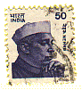

---
title: 18 Schritte zu fließendem Euro-Glosa
layout: post
published: true
date: 2018-10-11
---  
  


von Wendy Ashby und Ronald Clark 1985-1992, HTML und deutsche
Übertragung Marcel Springer 2001 ... 2011

[1](g18s.htm#S1) – [2](g18s.htm#S2) – [3](g18s.htm#S3) –
[4](g18s.htm#S4) – [5](g18s.htm#S5) – [6](g18s.htm#S6) –
[7](g18s.htm#S7) – [8](g18s.htm#S8) – [9](g18s.htm#S9) –
[10](g18s.htm#S10) – [11](g18s.htm#S11) – [12](g18s.htm#S12) –
[13](g18s.htm#S13) – [14](g18s.htm#S14) – [15](g18s.htm#S15) –
[16](g18s.htm#S16) – [17](g18s.htm#S17) – [18](g18s.htm#S18)

-----

## Vorwort des HTML-Tippers

*Diese HTML-Datei ist eine Kurzversion des Buchs*

> Ashby, Wendy/ Clark, Ronald:  
> 18 Steps to Fluency in Euro-Glosa,  
> The Interlanguage for Europe and the World,  
> 3\. Auflage © 1992 Glosa Education Organizaton,  
> Richmond, UK; ISBN 0 946540 15 2.

*Man kann das Buch kaufen bei Wendy Ashby (c/o Glosa Education
Organization, 35 Wingfield Road; Kingston Upon Thames; Surrey KT2 5LR;
ENGLAND). Mit dem Preis von 8.95 GB£ unterstützt man die
Glosa-Entwicklung und Verbreitung.*

*Diese Datei ist nicht das ganze Buch. Das will sie auch gar nicht sein.
Obwohl alle Beispielsätze und alle Regeln enthalten sind, sind nur die
Schritte 1, 2, 3, 5, 9, 13, 16, 17 und 18 ganz vollständig. Die
Glosa 1000-Vokabelliste fehlt, bitte schlagen Sie stattdessen im [Glosa
Internet Dictionary](../gid/index.html) nach. Diese Version soll
lediglich eine Ergänzung zur Internetpräsenz Glosas darstellen.*

*Von dem Buch selbst und einem Brief, den mir Wendy Ashby schrieb, habe
ich den Eindruck, dass dieses Buch als <span class="underline">DIE
offizielle</span> Beschreibung Glosa's gemeint ist.*

*Fast alle etymologischen Anmerkungen zu den Vokabeln sind nicht aus dem
Originalbuch. Die deutsche Übertragung ist sicher nicht professionell.
Wer einigermaßen Englisch lesen kann, bevorzuge die [englische
Fassung](../en/g18s.htm).*

*Danke an Wendy Ashby für die Erlaubnis, diese Datei ins Netz zu stellen
und an Nick Hempshall für seine Verbesserungsvorschäge. Bitte melden Sie
Fehler an ![\[E-mail address as
GIF-image\]](../pic/emailm.png)glosa.org. Danke.*

*M. Springer, 2001 ... 2004*

  

-----

<span class="small">*- Deckblatt -*</span>

<table>
<colgroup>
<col style="width: 100%" />
</colgroup>
<tbody>
<tr class="odd">
<td><br />
<br />
18 SCHRITTE<br />
zu FLIESSENDEM<br />
<br />
<strong>EURO-GLOSA</strong><br />
<br />
DIE ZWISCHENSPRACHE<br />
FÜR EUROPA UND DIE WELT<br />
<br />
LEICHT GELERNT IN WENIGEN TAGEN<br />
WORTSCHATZ MIT 1000 GRIECHISCHEN UND LATEINISCHEN WURZELN,<br />
DIE ALLEN EURO-SPRACHEN GEMEINSAM SIND<br />
EINSCHLIESSLICH DEM RUSSISCHEN<br />
UND DEM ENORMEN WORTSCHATZ DER WISSENSCHAFT.<br />
PHONETISCHE AUSSPRACHE.<br />
KEINE UNLOGISCHE, LANGWEILIGE GRAMMATIK.<br />
UNBEGRENZT ERWEITERBAR,<br />
UM SICH DEM TEMPO DES WISSENSCHAFTLICHEN FORTSCHRITTS ANZUPASSEN.<br />
JEDES EINZELNE GLOSA-WORT STEHT FÜR NUR EIN KONZEPT.<br />
GLOSA 1000 DECKT EINFACH ALLE THEMEN<br />
AUS WISSENSCHAFT, TECHNIK, WIRTSCHAFT UND LITERATUR.<br />
HILFT DEM LERNEN ANDERER EURO-SPRACHEN.<br />
IDEAL FÜR BILDUNG, INTELLIGENTEN TOURISMUS UND<br />
COMPUTERVERARBEITUNG.<br />
<br />
<br />
</td>
</tr>
</tbody>
</table>

  
  

<span class="small">*- S. 3 -*</span>

## Inhalt

*\[Anmerkung: viele der Bilder und Wörterlisten im Inhaltsverzeichnis
unten sind nicht Bestandteil dieser HTML-Version.\]*

<table>
<tbody>
<tr class="odd">
<td> </td>
<td>Die <a href="g18s.htm#S01">globale Sprache</a> für das "globale Dorf"</td>
<td> ...  S.  4</td>
</tr>
<tr class="even">
<td> </td>
<td><a href="g18s.htm#S02">Aussprache, Alphabet, Zeichensetzung</a><br />
<br />
</td>
<td> ...  S.  5<br />
<br />
</td>
</tr>
<tr class="odd">
<td><a href="g18s.htm#S1">Schritt  1</a>:    </td>
<td>ein(e, er), der/die/das; Vergangenheit und Zukunft;</td>
<td> ...  S.  6</td>
</tr>
<tr class="even">
<td> </td>
<td>Zahlen, -co, Bilderkreuzworträtsel.</td>
<td> ...  S.  7</td>
</tr>
<tr class="odd">
<td><a href="g18s.htm#S2">Schritt  2</a>:</td>
<td>würde, wenn</td>
<td> ...  S.  9</td>
</tr>
<tr class="even">
<td> </td>
<td>Berufe, Farben, Orte (Wörter und Grafik)</td>
<td> ...  S. 10</td>
</tr>
<tr class="odd">
<td><a href="g18s.htm#S3">Schritt  3</a>:</td>
<td>Nicht, Verneinung. Läden. Lebewesen. Gebäude</td>
<td> ...  S. 12</td>
</tr>
<tr class="even">
<td><a href="g18s.htm#S4">Schritt  4</a>:</td>
<td>Fragen bilden;</td>
<td> ...  S. 15</td>
</tr>
<tr class="odd">
<td> </td>
<td>Körperteile; Ringe und Dinge. Gefäße. Möbel.</td>
<td> ...  S. 16</td>
</tr>
<tr class="even">
<td><a href="g18s.htm#S5">Schritt  5</a>:</td>
<td>Was? Welches? Grußformeln, Geräte.</td>
<td> ...  S. 18</td>
</tr>
<tr class="odd">
<td><a href="g18s.htm#S6">Schritt  6</a>:</td>
<td>Dies &amp; das. Diese &amp; jene;</td>
<td> ...  S. 21</td>
</tr>
<tr class="even">
<td> </td>
<td>Orte. Materialien. Gruppen. Fäden. Steine; Lebensmittel (Bildseite und Phrasen).    </td>
<td> ...  S. 22</td>
</tr>
<tr class="odd">
<td><a href="g18s.htm#S7">Schritt  7</a>:</td>
<td>Bekommen, werden, geworden;</td>
<td> ...  S. 24</td>
</tr>
<tr class="even">
<td> </td>
<td>Gegenteile. Bekommen und geworden. Kleidungsstücke. Tuche.</td>
<td> ...  S. 25</td>
</tr>
<tr class="odd">
<td> </td>
<td>Reise (Bild und Phrasen).</td>
<td> ...  S. 26</td>
</tr>
<tr class="even">
<td><a href="g18s.htm#S8">Schritt  8</a>:</td>
<td>Könnte, vielleicht, müssen;</td>
<td> ...  S. 28</td>
</tr>
<tr class="odd">
<td> </td>
<td>Das Haus (Bild und Phrasen).</td>
<td> ...  S. 29</td>
</tr>
<tr class="even">
<td><a href="g18s.htm#S9">Schritt  9</a>:</td>
<td>Zeit, während;</td>
<td> ...  S. 31</td>
</tr>
<tr class="odd">
<td> </td>
<td>Straßenszene (Bild und Text);</td>
<td> ...  S. 32</td>
</tr>
<tr class="even">
<td> </td>
<td>Psalm 23 (paralleler Text).</td>
<td> ...  S. 33</td>
</tr>
<tr class="odd">
<td><a href="g18s.htm#S10">Schritt 10</a>:</td>
<td>Sehr, heftig;</td>
<td> ...  S. 34</td>
</tr>
<tr class="even">
<td> </td>
<td>Krankenhaus (Bild und Phrasen).</td>
<td> ...  S. 35</td>
</tr>
<tr class="odd">
<td><a href="g18s.htm#S11">Schritt 11</a>:</td>
<td>Sollte;</td>
<td> ...  S. 37</td>
</tr>
<tr class="even">
<td> </td>
<td>Kommunikation (Bild und Phrasen).</td>
<td> ...  S. 38</td>
</tr>
<tr class="odd">
<td><a href="g18s.htm#S12">Schritt 12</a>:</td>
<td>Mehr als, weniger als, so groß wie;</td>
<td> ...  S. 40</td>
</tr>
<tr class="even">
<td> </td>
<td>Werkzeuge (Bild und Phrasen).</td>
<td> ...  S. 41</td>
</tr>
<tr class="odd">
<td><a href="g18s.htm#S13">Schritt 13</a>:</td>
<td>Sich selbst. Sein eigenes;</td>
<td> ...  S. 43</td>
</tr>
<tr class="even">
<td> </td>
<td>Postfiliale (Bild und Phrasen).</td>
<td> ...  S. 44</td>
</tr>
<tr class="odd">
<td><a href="g18s.htm#S14">Schritt 14</a>:</td>
<td>Am meisten, -st (Superlativ);</td>
<td> ...  S. 46</td>
</tr>
<tr class="even">
<td> </td>
<td>Camping (Bild &amp; Phrasen).</td>
<td> ...  S. 47</td>
</tr>
<tr class="odd">
<td><a href="g18s.htm#S15">Schritt 15</a>:</td>
<td>..., der. ..., welcher;</td>
<td> ...  S. 49</td>
</tr>
<tr class="even">
<td> </td>
<td>Imkerei (Bild und Phrasen).</td>
<td> ...  S. 50</td>
</tr>
<tr class="odd">
<td><a href="g18s.htm#S16">Schritt 16</a>:</td>
<td>Verursachen, veranlassen, anschalten;</td>
<td> ...  S. 52</td>
</tr>
<tr class="even">
<td> </td>
<td>Tri Andro in Navi (paralleler Text).</td>
<td> ...  S. 53</td>
</tr>
<tr class="odd">
<td><a href="g18s.htm#S17">Schritt 17</a>:</td>
<td>Nahe Zukunft. Jüngste Vergangenheit;</td>
<td> ...  S. 55</td>
</tr>
<tr class="even">
<td> </td>
<td>Shakespeare (paralleler Text).</td>
<td> ...  S. 56</td>
</tr>
<tr class="odd">
<td><a href="g18s.htm#S18">Schritt 18</a>:</td>
<td>Fortfahren, immer noch, Verlaufsform;</td>
<td> ...  S. 58</td>
</tr>
<tr class="even">
<td> </td>
<td>Einige (englische) Redewendungen. Mega Glosa.<br />
<br />
</td>
<td> ...  S. 59<br />
<br />
</td>
</tr>
<tr class="odd">
<td> </td>
<td><a href="g18s.htm#Mechanics">Glosa Mechanik</a>.</td>
<td> ...  S. 60</td>
</tr>
<tr class="even">
<td> </td>
<td>Glosa 1000 - Englisch Wortschatz</td>
<td> ...  S. 61</td>
</tr>
<tr class="odd">
<td> </td>
<td>Englisch - Glosa 1000 Wortschatz</td>
<td> ...  S. 88</td>
</tr>
</tbody>
</table>

<span id="S01"></span>  
  

-----

<span class="small">*- S. 4 -*</span>

## Die globale Sprache für das "globale Dorf"

Eine Welthilfssprache *(engl. International Auxiliary Language, IAL)*,
die wahrhaft international ist, muss einfach zu lernen sein für
motivierte Leute auf der ganzen Welt. Es darf nicht bloß eine
Feriensprache für bequeme Westländer werden.

Es muss genauso einfach für den Dorfbewohner eines Entwicklungslandes
wie für einen westlichen Wissenschaftler oder Dichter sein. Eben so eine
Sprache ist Glosa, die die internationale Kommunikation vereinfacht,
verbessert und effizienter macht.

Glosa ist das ideale mündliche Gegenstück zu der Revolution der
elektronischen Informationstechnologie.

All die alten Sprachen konfrontieren die Lernenden listenweise mit
erschreckend befremdenden Wörtern, die gründlich auswendig gelernt
werden müssen, dazu noch eine komplexe Grammatik.

Im Gegensatz dazu sind alle Glosa-Wörter schon international geläufig
und direkt in täglichem Gebrauch, nicht nur in Europa, sondern sie
durchdringen überall moderne Medizin und Wissenschaft.

Der späte Prof. Lancelot Hogben wies darauf hin, dass "das weltweite
Vokabular der Wissenschaft - von allem, was die Menschheit bisher in
dieser Richtung erreicht hat - einem Wortschatz für eine wahrhaft
globalen Sprache am nächsten kommt. Es leitet seine Wörter von zwei
toten Sprachen ab - von Latein und nun, beinahe ausschließlich vom
Griechischen."

Obwohl Glosa einen sehr großen Mega-Wortschatz hat, besteht sein
Herzstück, sein Zentrum aus nur 1000 Wörtern, die leicht jede Art von
intelligenter Unterhaltung genau und wohlklingend abdecken.

Die "Mechanik" von Glosa kann auf einer [Seite](g18s.htm#Mechanics)
ordentlich zusammengefasst werden. Sie zeigt, wie zwanzig kleine Wörter
von den tausend leicht Tempora (Zeiten), Komparation (Vergleiche),
Numeri (Einzahl, Mehrzahl) etc. handhaben.

Es gibt 18 Lektionen, jede mit Übungen zum Übersetzen vom Englischen
nach Glosa und umgekehrt *\[In dieser Datei stehen die Übungstexte und
ihre Übersetzung parallel nebeneinander, im Original sind die Lösungen
am Ende des Buches.\]*. Jede Lektion enthält parallel deutsche und Glosa
Sätze. Ein einfacher, formloser Briefwechsel ergänzt die Lernschritte,
sowie nützliche Mustersätze und Beispielwendungen.

Viele informative Illustrationen *\[Viele nicht in dieser Datei\]*.

Die Vokabelverzeichnisse am Ende des Buches führen Glosa 1000 nach
Englisch und 2000 englische Wörter nach Glosa 1000 auf *\[Nicht in
dieser Datei.\]*.

Jedes Glosa-Wort steht für ein Konzept, etwa so wie ein Schlagwort in
Roget's Thesaurus.

Jedes Glosa-Wort kann jede Wortart darstellen, so wie in Chinesisch und,
mehr und mehr, in Englisch. Die Glosalerner werden schnell entdecken,
dass eine Menge Farbigkeit und Poesie in den griechischen und
lateinischen Wurzeln der Wissenschafts-/Technik-Terminologie steckt. Und
sie werden bald ein Netz bunter Assoziationen erwerben. Jedes Glosa-Wort
ist eine kleine Sonne, von der eine Menge an Ableitungen in alle
Euro-Sprachen strahlen, einschließlich Deutsch und Russisch.

<span id="S02"></span>  
  

<span class="small">*- S. 5 -*</span>

## Vorbemerkungen

### Aussprache

Jeder Buchstabe wird ausgesprochen, auch der Schlussvokal.  
Die 5 <span class="underline">Vokale</span> (Selbstlaute a, e, i, o, u)
wie in Spanisch. Und wie lange Vokale im Deutschen. Allerdings wird das
O lang und offen gesprochen, quasi ein "lang gesprochenes kurzes
deutsches O", also nicht wie in B-OO-t, sondern wie in L-O-rd, Sp-O-rt
oder englisch m-O-re oder wie englisch -aw- (AW-ful).  
<span class="underline">Diphthonge</span> (Vokale hintereinander):
Sprich die Vokale getrennt aus.  
<span class="underline">Konsonanten</span> (Mitlaute) wie in Deutsch mit
folgenden Ausnahmen:  
  **C** immer ausgesprochen wie TSCH in "deu-TSCH", vgl. italienisch
C-iao.  
  **Q**, eher wie KU als wie KW. In Glosa ist das Q ohne U\!  
  **R** wird immer ausgesprochen, wenn möglich gerollt, Carrrolin
Rrrreiberrrr.  
  **S** immer scharfes S (wie ß).  
  **SC** immer ausgesprochen wie deutsches SCH *(- ist aber sehr selten.
Reguläre Aussprache wie SS-TSCH- sollte auch möglich sein.)*.  
  **V** wie deutsches W ("Welle"), vgl. englisches V.  
  (**Y** wie deutsches I, vgl. französisches Y. Y kommt aber in
Glosa-Wörtern nicht vor.)  
  (**W** wie englisches W, also eher ein konsonantisches U. W kommt aber
in Glosa-Wörtern nicht vor.)  
  **Z** wie weiches S ("Hase"), vgl. englisches Z.  
  
  **G** normal wie in "gehen".  
  **H** normal wie in "Hilfe".  
  **J** normal wie in "ja".  
  **X** normal wie KS. Am Anfang des Wortes darf es auch nur als
scharfes S ausgesprochen werden.  
  
*Ergänzung (s. Buch "Glosa 6000", S. 17):*  
Bei einer <span class="underline">Konsonantengruppe am Anfang</span> des
Wortes, das betrifft meistens Wörter griechischen Ursprungs, muss nur
der letzte Konsonant ausgesprochen werden, wenn man Schwierigkeiten hat.
Schöner ist es allerdings, alle Buchstaben auszusprechen.  
Ebenso darf **X** am Wortanfang nur wie scharfes S ausgesprochen werden.
Besser wäre aber auch hier KS.  
<span class="underline">Betonung</span>: Der Vokal vor dem letzten
Konsonanten wird (sanft) betont.

``` 
                 Glosa     Aussprache

anstelle von     vice      witscheh
Fleisch          karni     kahrrnie
blau             ciano     tschie-aanoo
Holz             xilo      kssilo oder ssilo 
Maschine         makina    makina  
Licht            lumi      lumi
Frage/ fragen    qestio    k(u/w)estio 
schwingen        osci      oschi
weiß             leuko     le-uko 
```

### Rechtschreibung

Schreibung ist phonetisch. Griechisches PH (Phi) wird durch F ersetzt,
CH (Chi) durch K, Y (Ypsilon) durch I, TH (Theta) durch T.

  

### Alphabet

Die Buchstaben werden wie folgt benannt *(Schreibweise zeigt die
deutsche Aussprache. In Großbuchstaben die Abweichungen vom
Deutschen)*:  
a, be, TSCHE, de, e, FE, ge, HE, i, JE, KE, LE, ME, NE, o, pe, KU-E, RE,
SE, TE, u, WE *(das ist das V\!)*, DIPLO WE *(Fehler im Original "DUPLO
WE")*, EKS, I GREK, SETA.

  

### Zeichensetzung

Doppelpunkt geht den Gliedern einer Aufzählung voraus. **Fe stude:
biologi, kemi.**  
Ein Komma trennt die Aufzählungsglieder voneinander.  
Semikolon trennt Sätze, Haupt- und Nebensätze.  
Ein Satz ist eine Gruppe von Wörtern, die ein finites Verb enthalten.  
Eine Menge von Beispielen sind in diesem Buch.

  
<span id="S1"></span>  
  

(Zu den Schritten: [1](g18s.htm#S1), [2](g18s.htm#S2), [3](g18s.htm#S3),
[4](g18s.htm#S4), [5](g18s.htm#S5), [6](g18s.htm#S6), [7](g18s.htm#S7),
[8](g18s.htm#S8), [9](g18s.htm#S9), [10](g18s.htm#S10),
[11](g18s.htm#S11), [12](g18s.htm#S12), [13](g18s.htm#S13),
[14](g18s.htm#S14), [15](g18s.htm#S15), [16](g18s.htm#S16),
[17](g18s.htm#S17), [18](g18s.htm#S18))

-----

<span class="small">*- S. 6 -*</span>

## Schritt 1

<table>
<colgroup>
<col style="width: 45%" />
<col style="width: 55%" />
</colgroup>
<tbody>
<tr class="odd">
<td><strong>u </strong></td>
<td>ein(e, er), der/die/das</td>
</tr>
<tr class="even">
<td><strong>plu </strong></td>
<td>die (Mehrzahl), mehr als ein</td>
</tr>
<tr class="odd">
<td><strong>pa </strong></td>
<td>(Vergangenheitskennzeichen) -te <em>(vgl. PAssee)</em></td>
</tr>
<tr class="even">
<td><strong>fu </strong></td>
<td>(Zukunftskennzeichen, FUtur) werden</td>
</tr>
<tr class="odd">
<td></td>
<td><br />
</td>
</tr>
<tr class="even">
<td></td>
<td><br />
</td>
</tr>
<tr class="odd">
<td><strong>Mi grafo poesi. </strong></td>
<td>Ich schreibe Gedichte.</td>
</tr>
<tr class="even">
<td><strong>Mi sporta tenis. </strong></td>
<td>Ich spiele Tennis.</td>
</tr>
<tr class="odd">
<td><strong>Mi amo skope televisio. </strong></td>
<td>Ich mag fernsehen.</td>
</tr>
<tr class="even">
<td><strong>Mi amo visita u teatra </strong></td>
<td>Ich mag ins Theater gehen.</td>
</tr>
<tr class="odd">
<td><strong>Mi amo lekto. </strong></td>
<td>Ich mag lesen.</td>
</tr>
<tr class="even">
<td><strong>Mi lekto e grafo. </strong></td>
<td>Ich lese und schreibe.</td>
</tr>
<tr class="odd">
<td><strong>Mi lekto u bibli. </strong></td>
<td>Ich lese das Buch.</td>
</tr>
<tr class="even">
<td><strong>Mi fu lekto u bibli. </strong></td>
<td>Ich werde das Buch lesen.</td>
</tr>
<tr class="odd">
<td><strong>Mi fu gene sko de Glosa. </strong></td>
<td>Ich werde Glosa lernen.</td>
</tr>
<tr class="even">
<td><strong>Mi amo gene sko de plu lingua. </strong></td>
<td>Ich mag Sprachen lernen.</td>
</tr>
<tr class="odd">
<td><strong>Mi fu lekto plu bibli. </strong></td>
<td>Ich werde (die) Bücher lesen.</td>
</tr>
<tr class="even">
<td><strong>Mi fu ki ana monti. </strong></td>
<td>Ich werde den Berg hinaufsteigen.</td>
</tr>
<tr class="odd">
<td><strong>Mi pa lekto plu bibli. </strong></td>
<td>Ich las die Bücher.</td>
</tr>
<tr class="even">
<td><strong>Mi pa visita u teatra. </strong></td>
<td>Ich besuchte das Theater.</td>
</tr>
<tr class="odd">
<td><strong>Mi pa audi u radio. </strong></td>
<td>Ich hörte Radio.</td>
</tr>
</tbody>
</table>

  
  

*Vokabeln*

*(Großbuchstaben deuten eine Verwandschaft zwischen Glosawort und
deutscher Bedeutung an. Rechts stehen kursiv in Klammern etymologische
Anmerkungen (Eselsbrücken).)*

|                                |                                                      |                                                                                                                                                                                                                           |
| ------------------------------ | ---------------------------------------------------- | ------------------------------------------------------------------------------------------------------------------------------------------------------------------------------------------------------------------------- |
| **drama **                     | DRAMA, schauspielern                                 |                                                                                                                                                                                                                           |
| **musika **                    | MUSIK                                                |                                                                                                                                                                                                                           |
| **kulti plu fito **            | Pflanzen ziehen                                      | *(PHYTOtherapie - Pflanzenheilkunde, KULTur)*                                                                                                                                                                             |
| **grafo poesi / plu grama **   | Gedichte, POESIe / Briefe schreiben                  | *(GRAFOlogie, AeroGRAMM)*                                                                                                                                                                                                 |
| **gresi **                     | gehen                                                | *(proGRESSiv - fort-schritt-lich)*                                                                                                                                                                                        |
| **nekto **                     | schwimmen                                            | *(das NEKTOn - Gesamtheit der Wassertiere)*                                                                                                                                                                               |
| **viagia **                    | Reise, reisen                                        | *(deutsch WEg)*                                                                                                                                                                                                           |
| **e **                         | und                                                  | *(französisch Et)*                                                                                                                                                                                                        |
| **kanta **                     | singen                                               | *(KANTAte)*                                                                                                                                                                                                               |
| **kore **                      | tanzen                                               | *(CHOR)*                                                                                                                                                                                                                  |
| **kapti plu piski **           | FISche fangen                                        |                                                                                                                                                                                                                           |
| **face plu kerami vasa **      | töpfern (= keramische Gefäße machen)                 | *(FAKten, VASe)*                                                                                                                                                                                                          |
| **kolekti plu moneta **        | MÜNzen sammeln                                       | *(KOLLEKTIon, MÜNZE)*                                                                                                                                                                                                     |
| **kolekti plu posta karta **   | POSTKARTEn sammeln                                   |                                                                                                                                                                                                                           |
| **lekto plu bibli **           | Bücher LEsen                                         | *(LEKTion, BIBLIOthek)*                                                                                                                                                                                                   |
| **fotografi **                 | FOTO, FOTOGRAFIeren                                  |                                                                                                                                                                                                                           |
| **internexu **                 | NETworking (=vernetzt zusammenarbeiten)              | *(INTERnet, KonNEXion)*                                                                                                                                                                                                   |
| **audi u radio **              | RADIO hören                                          | *(AUDIo)*                                                                                                                                                                                                                 |
| **kambio plu grama **          | Briefe austauschen                                   | *(engl. CAMBIst - Wechsler)*                                                                                                                                                                                              |
| **gene sko de plu lingua **    | Sprachen lernen (=Wissen bekommen über die Sprachen) | *(vgl. GENitiv, SCHUle, LINGUistik)*                                                                                                                                                                                      |
| **skope televisio **           | fernsehen                                            | *(MikroSKOP, TELEVISIOn)*                                                                                                                                                                                                 |
| **sporta tenis **              | TENNIS spielen                                       |                                                                                                                                                                                                                           |
| **plu gram-ami **              | Brieffreunde                                         | *(französisch AMI - Freund)*                                                                                                                                                                                              |
| **visita u teatra / plu ami ** | das ThEATeR/ Freunde besuchen                        | *(VISITe)*                                                                                                                                                                                                                |
| **trikota e sue **             | stricken und nähen                                   | *(TRIKOT, englisch "to SEw" - nähen)*                                                                                                                                                                                     |
| **soni u piano **              | Klavier spielen                                      | *(uniSONo - auf demselben Ton)*                                                                                                                                                                                           |
| **amo **                       | mögen, lieben                                        | *(französisch AMOur - Liebe)*                                                                                                                                                                                             |
| **de **                        | im Verhältnis zu; unter Berücksichtigung von         | *(**de** ist in Glosa auch eine Verlegenheitspräposition, die immer dann verwendet wird, wenn nichts anderes zur Verfügung steht. Es ersetzt auch den Genitiv (Wes-Fall) in Glosa. Vorsilbe DE- in vielen Fremdwörtern.)* |
| **plu enigma **                | die Rätsel                                           | *(englisch ENIGMAtic - rätselhaft)*                                                                                                                                                                                       |
| **kuko **                      | KOCHen                                               |                                                                                                                                                                                                                           |
| **plu puta-me ludi **          | ComPUTErspiele                                       | *(ComPUTer, MEchanik, lat. LUDUS - Spiel)*                                                                                                                                                                                |
| **habe **                      | HABEn, besitzen                                      |                                                                                                                                                                                                                           |

  

<span class="small">*- S. 7 -*</span>

### Zahlen

|                                  |                                                                                      |
| -------------------------------- | ------------------------------------------------------------------------------------ |
| 1                                | **mo**                                                                               |
| 2                                | **bi**                                                                               |
| 3                                | **tri**                                                                              |
| 4                                | **tet** oder **tetra**                                                               |
| 5                                | **pen** oder **penta**                                                               |
| 6                                | **six** *(oder **sixa**)*                                                            |
| 7                                | **seti** oder **septi**                                                              |
| 8                                | **ok** oder **okto**                                                                 |
| 9                                | **nona**                                                                             |
| 10                               | **deka**                                                                             |
| 0                                | **ze** oder **zero**                                                                 |
| 11                               | **mo mo**                                                                            |
| 12                               | **mo bi**                                                                            |
| 20                               | **bi ze**                                                                            |
| 50                               | **pen ze**                                                                           |
| 100                              | **mo hekto** *(im Originaltext **mo centi**, aber **centi** ist besser für "1/100")* |
| 1000                             | **mo kilo**                                                                          |
| million                          | **miliona**                                                                          |
| 92                               | **nona bi**                                                                          |
| 10 hoch 6                        | **dek a six**                                                                        |
| 5/8, fünf Achtel                 | **pen su ok**                                                                        |
| 3,2                              | **tri koma bi**                                                                      |
| \+                               | **plus**                                                                             |
| \-                               | **minus**                                                                            |
| x, mal                           | **para**                                                                             |
| 3 x 4 = 12                       | **tri para tet eqa mo bi**                                                           |
| teilen, dividieren               | **divide**                                                                           |
| fünf Bücher                      | **penta bibli**                                                                      |
| das fünfte Buch                  | **u bibli penta**                                                                    |
| drei mal                         | **tri kron**                                                                         |
| Sie haben jeder je zwei (Dinge). | **Singu pe habe bi ra.**                                                             |
| Wie viele?                       | **Qo numera?** oder **or Qanto?**                                                    |
| Zähle sie\!                      | **Numera mu\!**                                                                      |
| 8\. Juni                         | **di ok, meno six**                                                                  |
| Montag                           | **di bi**                                                                            |
| Datum                            | **datu**                                                                             |

  
  
  

### \-co

**-co** ist die Glosaform des italienischen Wortes ciò, was "das" oder
"dies" bedeutet. In Glosa bedeutet es "was ich gerade gesagt habe".

Damit kann man die unten aufgeführten, sehr nützlichen Bindewörter
*('Logical Connectors')* zusammensetzen. Glosa ist eine semantisch
basierte *('semantically based', meint wohl, dass der Wortsinn sich aus
dem Zusammenhang ergibt.)* Sprache, so dass, wenn eine Wortgruppe sich
ein gemeinsames Bedeutungselement teilt, dies in der Form jedes
einzelnen Wortes angezeigt wird. *(Das kann man sicher besser
übersetzen: "... semantically based language, so that when a group of
words shares a common element of meaning this is indicated in the form
of each word.")*

In den alten Sprachen wie Englisch und Französisch wird diese gemeinsame
Element nicht ausgedrückt.

Wenn man die folgende Liste anguckt, wird man schnell die Nützlichkeit
dieser Vorrichtung erkennen und es leicht finden, sich viele andere
Beispiele auszudenken. *\[Anmerkung: Im Originalbuch sind alle außer
**ex-co** ohne Bindestrich. **-co** steht nie alleine, sondern stets in
solchen Verbindungen.\]*

|                |                                           |
| -------------- | ----------------------------------------- |
| **po-co **     | danach                                    |
| **plus-co **   | außerdem                                  |
| **homo-co **   | in ähnlicher Weise                        |
| **para-co **   | übrigens; NEBENbei bemerkt                |
| **suma-co **   | zusammenfassend gesagt; kurzum            |
| **fini-co **   | endlich                                   |
| **seqe-co **   | folglich; daher                           |
| **kontra-co ** | umgekehrt                                 |
| **ko-co **     | auch; ebenfalls                           |
| **klu-co **    | immerhin; jedoch; wenn schon; selbst dann |
| **akorda-co ** | entsprechend                              |
| **hetero-co ** | anders; sonst                             |
| **per-co **    | auf diese Weise                           |
| **tem-co **    | inzwischen                                |
| **anti-co **   | wie auch immer; jedoch                    |
| **metri-co **  | dermaßen                                  |
| **no-klu-co ** | abgesehen davon                           |
| **ex-co **     | von alledem                               |

  
  

<span class="small">*- S. 8 -*</span>

*Übung 1*

<table>
<colgroup>
<col style="width: 45%" />
<col style="width: 55%" />
</colgroup>
<tbody>
<tr class="odd">
<td><strong>Mi kolekti plu moneta. </strong></td>
<td>Ich sammle Münzen.</td>
</tr>
<tr class="even">
<td><strong>Mi amo lekto e grafo. </strong></td>
<td>Ich mag lesen und schreiben.</td>
</tr>
<tr class="odd">
<td><strong>Mi grafo plu kanta e poesi. </strong></td>
<td>Ich schreibe Lieder und Lyrik.</td>
</tr>
<tr class="even">
<td><strong>Mi fu visita u teatra. </strong></td>
<td>Ich werde das Theater besuchen.</td>
</tr>
<tr class="odd">
<td><strong>Mi fu skope u televisio. </strong></td>
<td>Ich werde fernsehen.</td>
</tr>
<tr class="even">
<td><strong>Mi fu audi u kanta. </strong></td>
<td>Ich werde dem Gesang zuhören.</td>
</tr>
<tr class="odd">
<td><strong>Mi pa audi u musika. </strong></td>
<td>Ich habe die Musik gehört.</td>
</tr>
<tr class="even">
<td><strong>Mi pa lekto u grama. </strong></td>
<td>Ich las den Brief/ habe den Brief gelesen.</td>
</tr>
<tr class="odd">
<td><strong>Mi pa visita bi ami. </strong></td>
<td>Ich besuchte zwei Freunde/ habe zwei Freunde besucht.</td>
</tr>
<tr class="even">
<td></td>
<td><br />
</td>
</tr>
<tr class="odd">
<td><strong>Mi habe tri bibli. </strong></td>
<td>Ich habe drei Bücher.</td>
</tr>
<tr class="even">
<td><strong>Mi lekto u lingua bibli. </strong></td>
<td>Ich lese das Sprachbuch.</td>
</tr>
<tr class="odd">
<td><strong>U bibli de plu fito. </strong></td>
<td>Ein Buch über Pflanzen.</td>
</tr>
<tr class="even">
<td><strong>Mi amo sue. </strong></td>
<td>Ich mag nähen.</td>
</tr>
<tr class="odd">
<td><strong>Mi pa nekto. </strong></td>
<td>Ich schwamm.</td>
</tr>
<tr class="even">
<td><strong>Mi fu nekto. </strong></td>
<td>Ich werde schwimmen.</td>
</tr>
<tr class="odd">
<td><strong>Mi amo soni u piano. </strong></td>
<td>Ich mag Klavier spielen.</td>
</tr>
<tr class="even">
<td><strong>Mi pa grafo tri grama. </strong></td>
<td>Ich schrieb drei Briefe.</td>
</tr>
<tr class="odd">
<td><strong>U bibli de plu enigma. </strong></td>
<td>Ein Rätselbuch.</td>
</tr>
</tbody>
</table>

  
  

<span class="underline">**Pikto-Verba**</span>

![\[Kreuzworträtsel\]](../pic/g18s001.gif)

  

**Kata:**  
1: ![\[Fisch\]](../pic/g18s002.gif)          2: **2**         
3: ![\[lesen\]](../pic/g18s003.gif)         
4: ![\[schwimmen\]](../pic/g18s004.gif)  
5: ![\[Münze\]](../pic/g18s005.gif)          6: **8**           
  
9:  
**Mo, bi, tri,  
dice Glosa ko mi.  
Lekto, graf e ludi;  
dice Glosa nu-di.  
** 11: ![\[Flügel\]](../pic/g18s008.gif)         
12: ![\[Tänzerin\]](../pic/g18s007.gif)         
13: ![\[Brief\]](../pic/g18s006.gif)  
  
14: ![\[Buch\]](../pic/g18s009.gif)         
15: ![\[Radio\]](../pic/g18s010.gif)          16: ![\[Hund mit
Zunge\]](../pic/g18s011.gif)           
  
  
  
  
  
**Trans:**  
5: ![\[Noten\]](../pic/g18s012.gif)         
7: ![\[nähen\]](../pic/g18s013.gif)  
8: ![\[singen\]](../pic/g18s014.gif)         
9: ![\[kochen\]](../pic/g18s015.gif)          10: **3**  
11: ![\[Postkarte\]](../pic/g18s016.gif)         
13: ![\[schreiben\]](../pic/g18s018.gif)         
16: ![\[wandern\]](../pic/g18s020.gif)  
17: **1**          18: ![\[Vase\]](../pic/g18s019.gif)         
19: ![\[Blume\]](../pic/g18s017.gif)

Für die Lösung [hier](g18s.htm#Key1) klicken.

<span id="S2"></span>  
  

(Zu den anderen Schritten: [1](g18s.htm#S1), [2](g18s.htm#S2),
[3](g18s.htm#S3), [4](g18s.htm#S4), [5](g18s.htm#S5), [6](g18s.htm#S6),
[7](g18s.htm#S7), [8](g18s.htm#S8), [9](g18s.htm#S9),
[10](g18s.htm#S10), [11](g18s.htm#S11), [12](g18s.htm#S12),
[13](g18s.htm#S13), [14](g18s.htm#S14), [15](g18s.htm#S15),
[16](g18s.htm#S16), [17](g18s.htm#S17), [18](g18s.htm#S18))

-----

<span class="small">*- S. 9 -*</span>

## Schritt 2

<table>
<colgroup>
<col style="width: 45%" />
<col style="width: 55%" />
</colgroup>
<tbody>
<tr class="odd">
<td><strong>sio  </strong></td>
<td>würde(, wenn)<br />
</td>
</tr>
<tr class="even">
<td></td>
<td><br />
</td>
</tr>
<tr class="odd">
<td></td>
<td><br />
</td>
</tr>
<tr class="even">
<td><strong>Fe nima es Iris. </strong></td>
<td>Ihr Name ist Iris.</td>
</tr>
<tr class="odd">
<td><strong>Fe habe tetra anua. </strong></td>
<td>Sie ist vier Jahre alt.</td>
</tr>
<tr class="even">
<td><strong>An nima es George. </strong></td>
<td>Sein Name ist George.</td>
</tr>
<tr class="odd">
<td><strong>An habe tri anua. </strong></td>
<td>Er ist drei Jahre alt.</td>
</tr>
<tr class="even">
<td><strong>Mi amo kolekti plu moneta. </strong></td>
<td>Ich mag Münzen sammeln.</td>
</tr>
<tr class="odd">
<td><strong>Mi sio amo grafo u bibli. </strong></td>
<td>Ich würde gern ein Buch schreiben.</td>
</tr>
<tr class="even">
<td><strong>Mi matri ergo in domi. </strong></td>
<td>Meine Mutter arbeitet im Haus/ zuhause.</td>
</tr>
<tr class="odd">
<td><strong>Mi patri-matri soni u piano. </strong></td>
<td>Meine Großmutter (väterlicherseits) spielt Klavier.</td>
</tr>
<tr class="even">
<td><strong>Fe sio amo viagia. </strong></td>
<td>Sie würde gern verreisen.</td>
</tr>
<tr class="odd">
<td><strong>Mi patri ergo in pato-do. </strong></td>
<td>Mein Vater arbeitet im Krankenhaus.</td>
</tr>
<tr class="even">
<td><strong>An amo audi musika. </strong></td>
<td>Er mag Musik hören.</td>
</tr>
<tr class="odd">
<td><strong>An es u medika-pe. </strong></td>
<td>Er ist Arzt.</td>
</tr>
<tr class="even">
<td><strong>Mi fratri eko in Paris. </strong></td>
<td>Mein Bruder wohnt in Paris.</td>
</tr>
<tr class="odd">
<td><strong>Mi sorori eko extra Paris. </strong></td>
<td>Meine Schwester lebt außerhalb von Paris.</td>
</tr>
<tr class="even">
<td><strong>Place. Gratia. Penite.</strong> <em>(Fehler im Original: <strong>Gratio.</strong> und <strong>Penito</strong>.)</em> </td>
<td>Bitte. Danke. Entschuldigung.</td>
</tr>
<tr class="odd">
<td><strong>Mi spe gene tu reakti. </strong></td>
<td>Ich hoffe, Ihre/ deine Antwort zu erhalten.</td>
</tr>
</tbody>
</table>

  
  

*Vokabeln*

|                  |                                  |                                                                          |
| ---------------- | -------------------------------- | ------------------------------------------------------------------------ |
| **es **          | bin, bist, ISt, sind, seid, sein |                                                                          |
| **Karo ... **    | Liebe(r) ...                     | *(KARitativ)*                                                            |
| **tu **          | DU; dein                         |                                                                          |
| **nima **        | NAME                             |                                                                          |
| **in **          | IN; innen                        |                                                                          |
| **extra **       | außen; draußen                   | *(EXTRA)*                                                                |
| **anua **        | Jahr; jährlich                   | *(ANNAlen - Jahrbücher)*                                                 |
| **eko **         | wohnen; leben (wohnen)           | *(ÖKUmene - Christentum über die ganze be-wohn-te Erde)*                 |
| **matri **       | MUTTeR                           |                                                                          |
| **patri **       | VATeR                            |                                                                          |
| **fratri **      | BRUDeR                           | *(FRATernité - Brüderlichkeit, Schlagwort der französischen Revolution)* |
| **sorori **      | Schwester                        |                                                                          |
| **ergo **        | Arbeit; arbeiten                 | *(ERGOnomisch - arbeits-gerecht, deutsch wERK)*                          |
| **domi; -do **   | Haus; Gebäude                    | *(DOMIzil)*                                                              |
| **pato **        | krank                            | *(PATient)*                                                              |
| **andro **       | Mann                             | *(Name ANDReas - der mann-hafte)*                                        |
| **an **          | er; sein (Pronomen); ihm; ihn    | *(kurz zu Glosa **andro**)*                                              |
| **gina **        | Frau                             | *(GYNAekologe - Frau-enarzt)*                                            |
| **fe **          | sie (Singular); ihr              | *(FEminin - weiblich)*                                                   |
| **persona; pe ** | PERSON; man                      |                                                                          |
| **meno **        | MONAt                            | *(MENstruation - Monats-zyklus)*                                         |
| **gene **        | bekommen                         | *(karzinoGEN - wovon man Krebs bekommt)*                                 |

  
  
  

<span class="underline">Briefe tauschen</span>

Man kann nun anfangen, in Glosa zu korrespondieren. Schreib über deine
Familie und Interessen. Hier ist ein Beispiel.

**Karo Andrew\!**

**Mi pa lekto tu nima in “Plu Glosa Nota”; e mi sio amo kambio plu grama
ko tu.**

**Mi habe deka anua. Mi eko ko mi matri, patri e fratri. Mi matri ergo
in domi; e mi patri ergo** *(Fehler im Original **eko**)* **in pato-do.
An es u medika-pe. Mi fratri habe tri anua. An nima es George. Mi amo
lekto, grafo, musika, nekto, kuko, e kolekti plu posta-karta. Mi spe
gene tu reakti. Plu Saluta**

**Irene**

  
  

<span class="small">*- S. 10 -*</span>

### Plu Profesio

Viele der Hauptannehmlichkeiten des zivilisierten Lebens fallen in 18
Klassen, die in Glosa bequem auf zwei Buchstaben gekürzt werden. Wenn
man diese dann mit Wörtern, die Tätigkeiten repräsentieren, kombiniert,
kann man leicht einen sehr großen Wortschatz aufbauen ohne das
Gedächtnis stark zu belasten. **-pe** ist die Abkürzung für **pe**rson
und kann mit vielen Wörtern kombiniert werden, die bereits gelernt
wurden.

|                      |                                                                                                                                                                                                                                                          |
| -------------------- | -------------------------------------------------------------------------------------------------------------------------------------------------------------------------------------------------------------------------------------------------------- |
| **medika-pe **       | Arzt                                                                                                                                                                                                                                                     |
| **medika-fe **       | Ärztin                                                                                                                                                                                                                                                   |
| **medika-an **       | Arzt (männlich)                                                                                                                                                                                                                                          |
| **piski-pe **        | Fischer                                                                                                                                                                                                                                                  |
| **posta-pe **        | Postbote                                                                                                                                                                                                                                                 |
| **kore-pe **         | Tänzer                                                                                                                                                                                                                                                   |
| **kuko-pe **         | Koch                                                                                                                                                                                                                                                     |
| **drama-fe **        | Schauspielerin                                                                                                                                                                                                                                           |
| **gresi-pe **        | Wanderer                                                                                                                                                                                                                                                 |
| **sko-pe **          | Lehrer; Ausbilder                                                                                                                                                                                                                                        |
| **stude-pe **        | Student; Schüler                                                                                                                                                                                                                                         |
| **musika-pe **       | Musiker                                                                                                                                                                                                                                                  |
| **Italia-pe **       | Italiener                                                                                                                                                                                                                                                |
| **ergo-pe **         | Arbeiter                                                                                                                                                                                                                                                 |
| **nuli-ergo-pe **    | Arbeitsloser *(Andere Vorschläge sind **nul-ergo-pe** oder **ne-ergo-pe**. Originalwort war **minus ergo-pe**, aber das könnte eher heißen "ohne Arbeiter", ein "fehlender Arbeiter" oder ein "unterbeschäftigter Arbeiter, der mehr arbeiten könnte".)* |
| **plu ergo-pe **     | Arbeiter; Belegschaft                                                                                                                                                                                                                                    |
| **eko-pe **          | Einwohner; Bewohner                                                                                                                                                                                                                                      |
| **habe-pe **         | Eigentümer; Inhaber                                                                                                                                                                                                                                      |
| **pato-pe **         | Patient                                                                                                                                                                                                                                                  |
| **grafo-pe **        | Schreiber; Autor                                                                                                                                                                                                                                         |
| **viagia-pe **       | Reisender                                                                                                                                                                                                                                                |
| **plu kanta-pe **    | (die) Sänger                                                                                                                                                                                                                                             |
| **plu audi-pe **     | (die) Zuhörer; Publikum                                                                                                                                                                                                                                  |
| **nekto-pe **        | Schwimmer                                                                                                                                                                                                                                                |
| **monti-pe **        | Bergsteiger                                                                                                                                                                                                                                              |
| **plu skope-pe    ** | (die) Zuschauer                                                                                                                                                                                                                                          |

  
  

Wenn möglich, sollen die lokalen geographischen Namen verwendet werden,
also z. B. **Sverige** für Schweden, **Deutschland** für Deutschland,
**Roma** für Rom.

  
  

### Farben

|                      |                      |
| -------------------- | -------------------- |
| **leuko **           | weiß                 |
| **melano **          | schwarz              |
| **polio **           | grau                 |
| **xanto **           | gelb                 |
| **rubi **            | rot                  |
| **ciano **           | blau                 |
| **bruno **           | braun                |
| **leuko-bruno    **  | beige                |
| **polio-bruno **     | rehbraun (graubraun) |
| **purpuro **         | purpur               |
| **purpuro-rubi    ** | karmesin-; feuerrot  |
| **kloro **           | grün                 |
| **leuko kloro **     | blassgrün            |
| **sub kloro **       | grünlich             |
| **fo-kloro **        | satt grün            |
| **melano kloro    ** | dunkelgrün           |
| **rubi-xanto **      | orange               |
| **minus kroma    **  | farblos              |

  
  

*Übung 2*

<table>
<colgroup>
<col style="width: 45%" />
<col style="width: 55%" />
</colgroup>
<tbody>
<tr class="odd">
<td><strong>Mi habe okto anua. </strong></td>
<td>Ich bin acht Jahre alt.</td>
</tr>
<tr class="even">
<td><strong>Mi gene sko de Glosa. </strong></td>
<td>Ich lerne Glosa.</td>
</tr>
<tr class="odd">
<td><strong>Mi gina-matri es u grafo-fe. </strong></td>
<td>Meine Schwiegermutter ist Schriftstellerin.</td>
</tr>
<tr class="even">
<td><strong>Fe pa grafo penta bibli. </strong></td>
<td>Sie hat fünf Bücher geschrieben.</td>
</tr>
<tr class="odd">
<td><strong>Fe habe u puta-me. </strong></td>
<td>Sie hat einen Computer.</td>
</tr>
<tr class="even">
<td><strong>Mi patri es u drama-pe. </strong></td>
<td>Mein Vater ist Schauspieler.</td>
</tr>
<tr class="odd">
<td><strong>Plu audi-pe amo an. </strong></td>
<td>Das Publikum liebt ihn.</td>
</tr>
<tr class="even">
<td><strong>Mi matri es u sko-pe. </strong></td>
<td>Meine Mutter ist Lehrerin.</td>
</tr>
<tr class="odd">
<td><strong>Mi eko in domi tri. </strong></td>
<td>Ich wohne im dritten Haus.</td>
</tr>
<tr class="even">
<td><strong>Patri-patri. </strong></td>
<td>Großvater (väterlicherseits)</td>
</tr>
<tr class="odd">
<td></td>
<td><br />
</td>
</tr>
<tr class="even">
<td><strong>An habe bi-ze anua. </strong></td>
<td>Er ist zwanzig Jahre alt.</td>
</tr>
<tr class="odd">
<td><strong>Un an-piski habe mo anua </strong></td>
<td>Der männliche Fisch ist ein Jahr alt.</td>
</tr>
<tr class="even">
<td><strong>Piski-an </strong></td>
<td>Fischer(mann).</td>
</tr>
<tr class="odd">
<td><strong>Tu habe tri-ze moneta </strong></td>
<td>Du hast 30 Münzen.</td>
</tr>
<tr class="even">
<td><strong>An kulti plu piski </strong></td>
<td>Er züchtet Fische.</td>
</tr>
<tr class="odd">
<td><strong>Mi pa gene okto grama </strong></td>
<td>Ich habe acht Briefe bekommen.</td>
</tr>
<tr class="even">
<td><strong>Mi pa posta six grama </strong></td>
<td>Ich habe sechs Briefe versandt.</td>
</tr>
<tr class="odd">
<td><strong>Mi amo audi plu kanta-pe </strong></td>
<td>Ich mag dem Chor zuhören.</td>
</tr>
<tr class="even">
<td><strong>Plu persona amo fe </strong></td>
<td>Die Leute mögen sie.</td>
</tr>
<tr class="odd">
<td><strong>Mi nima es Margaret. </strong></td>
<td>Mein Name ist Margaret.</td>
</tr>
</tbody>
</table>

  

<span class="small">*- S. 11 -*</span>

<span class="underline">Orts-Wörter</span>

![\[Grafik zu den Präpositionen epi, intra, dia und
peri\]](../pic/g18s036.gif) ![\[Grafik zu den Präpositionen ana und
kata\]](../pic/g18s037.gif) ![\[Grafik zu
Präpositionen\]](../pic/g18s038.gif)

Da eine Präposition (Verhältniswort) gewöhnlich von einem Substantiv
(Hauptwort) gefolgt wird, besteht keine Notwendigkeit darin, dass hinter
ihr ein **u(n)**, der Artikel, steht. Zum Beispiel:

<table>
<colgroup>
<col style="width: 45%" />
<col style="width: 55%" />
</colgroup>
<tbody>
<tr class="odd">
<td><strong>U verba-bibli es epi tabla. </strong></td>
<td>Das Wörterbuch liegt auf dem Tisch.</td>
</tr>
<tr class="even">
<td><strong>Fe pa du gresi longi ripa. </strong></td>
<td>Sie wanderte entlang des Flussufers.</td>
</tr>
<tr class="odd">
<td></td>
<td><br />
</td>
</tr>
<tr class="even">
<td></td>
<td><br />
</td>
</tr>
<tr class="odd">
<td></td>
<td><br />
</td>
</tr>
<tr class="even">
<td><strong>sedi in gono </strong></td>
<td>in der Ecke sitzen</td>
</tr>
<tr class="odd">
<td><strong>grafo poesi in Glosa </strong></td>
<td>Gedichte schreiben in Glosa</td>
</tr>
<tr class="even">
<td><strong>loka id in teka </strong></td>
<td>es in die Kiste packen</td>
</tr>
<tr class="odd">
<td><strong>An eko kontra na. </strong></td>
<td>Er wohnt uns gegenüber.</td>
</tr>
<tr class="even">
<td><strong>in e peri urba</strong> <em>(im Originaltext <strong>urbs</strong>)</em> </td>
<td>in der Stadt und um sie herum</td>
</tr>
<tr class="odd">
<td><strong>Sti id pende a mura</strong> <em>(Im Originaltext steht <strong>Pend id epi mura</strong> [vgl. englisch "on the wall"], was auch geht. Auch andere Präpositionen wären denkbar: <strong>Pend id a/de/epi/kata mura</strong>)</em> </td>
<td>Häng es an die Wand</td>
</tr>
<tr class="even">
<td><strong>registra epi flexi disko</strong> <em>(im Originaltext <strong>diska</strong>)</em> </td>
<td>auf Floppy Disk speichern.</td>
</tr>
<tr class="odd">
<td><strong>Fe pa loka u mantela epi</strong> <em>(im Originaltext <strong>ep</strong>)</em> <strong>se. </strong></td>
<td>Sie zog sich den Mantel an.</td>
</tr>
<tr class="even">
<td><strong>Skope u programa per</strong> <em>(Im Originaltext steht <strong>epi</strong> [vgl. englisch "on TV"], was auch geht. Auch andere Präpositionen wären denkbar: <strong>Skope u programa per/ex/in/a/de/epi TV</strong>)</em> <strong>TV </strong></td>
<td>eine Sendung im Fernsehen sehen</td>
</tr>
<tr class="odd">
<td><strong>viagia trans</strong> <em>(im Originaltext <strong>dia</strong>)</em> <strong>rura </strong></td>
<td>durchs Land <em>(im Gegensatz zur 'Stadt')</em> reisen</td>
</tr>
<tr class="even">
<td><strong>Kribri</strong> <em>(im Originaltext <strong>Kribra</strong>)</em> <strong>id. </strong></td>
<td>es durchs Sieb drücken.</td>
</tr>
<tr class="odd">
<td><strong>Hidro flu dia tubi. </strong></td>
<td>Wasser fließt durch das Rohr.</td>
</tr>
<tr class="even">
<td><strong>Un avi pa peti</strong> <em>(im Originaltext <strong>vola</strong>)</em> <strong>supra dendro. </strong></td>
<td>Der Vogel flog über dem/ den Baum.</td>
</tr>
<tr class="odd">
<td><strong>ki infra ponti. </strong></td>
<td>unter der Brücke (durch)gehen</td>
</tr>
<tr class="even">
<td><strong>An pa dromo trans via. </strong></td>
<td>Er lief über die Straße.</td>
</tr>
<tr class="odd">
<td><strong>Fe es supra. </strong></td>
<td>Sie ist oben (z. B. im Obergeschoss).</td>
</tr>
<tr class="even">
<td><strong>Fe es infra. </strong></td>
<td>Sie ist unten (z. B. im Keller).</td>
</tr>
</tbody>
</table>

  
<span id="S3"></span>  
  

(Zu den anderen Schritten: [1](g18s.htm#S1), [2](g18s.htm#S2),
[3](g18s.htm#S3), [4](g18s.htm#S4), [5](g18s.htm#S5), [6](g18s.htm#S6),
[7](g18s.htm#S7), [8](g18s.htm#S8), [9](g18s.htm#S9),
[10](g18s.htm#S10), [11](g18s.htm#S11), [12](g18s.htm#S12),
[13](g18s.htm#S13), [14](g18s.htm#S14), [15](g18s.htm#S15),
[16](g18s.htm#S16), [17](g18s.htm#S17), [18](g18s.htm#S18))

-----

<span class="small">*- S. 12 -*</span>

## Schritt 3

<table>
<colgroup>
<col style="width: 45%" />
<col style="width: 55%" />
</colgroup>
<tbody>
<tr class="odd">
<td><strong>ne </strong></td>
<td>nicht, (Verneinung)</td>
</tr>
<tr class="even">
<td></td>
<td><br />
</td>
</tr>
<tr class="odd">
<td></td>
<td><br />
</td>
</tr>
<tr class="even">
<td><strong>Mi patri ne sporta tenis. </strong></td>
<td>Mein Vater spielt nicht Tennis.</td>
</tr>
<tr class="odd">
<td><strong>An ne amo sporta tenis. </strong></td>
<td>Er mag nicht Tennis spielen.</td>
</tr>
<tr class="even">
<td><strong>An ne lekto. </strong></td>
<td>Er liest nicht.</td>
</tr>
<tr class="odd">
<td><strong>An ne amo lekto. </strong></td>
<td>Er mag nicht lesen.</td>
</tr>
<tr class="even">
<td><strong>Mi ne amo skope televisio. </strong></td>
<td>Ich mag nicht fernsehen.</td>
</tr>
<tr class="odd">
<td><strong>An ergo in musika-bo. </strong></td>
<td>Er arbeitet in einem Musikgeschäft.</td>
</tr>
<tr class="even">
<td><strong>An ne ergo in pato-do. </strong></td>
<td>Er arbeitet nicht im Krankenhaus.</td>
</tr>
<tr class="odd">
<td><strong>An ne pa sporta tenis pa-di. </strong></td>
<td>Er spielte kein Tennis gestern.</td>
</tr>
<tr class="even">
<td><strong>Fe ne pa visita plu boteka. </strong></td>
<td>Sie ging nicht zu den Läden.</td>
</tr>
<tr class="odd">
<td><strong>An ne pa visita fe di-tri. </strong></td>
<td>Er besuchte sie nicht am Dienstag.</td>
</tr>
<tr class="even">
<td><strong>Na fu visita fe fu-di. </strong></td>
<td>Wir werden sie morgen besuchen.</td>
</tr>
<tr class="odd">
<td><strong>An pa kapti bi piski nu-di. </strong></td>
<td>Er fing heute zwei Fische.</td>
</tr>
<tr class="even">
<td><strong>Mi patri ne pa ergo pa-di. </strong></td>
<td>Mein Vater hat gestern nicht gearbeitet.</td>
</tr>
<tr class="odd">
<td><strong>An ne ergo nu. </strong></td>
<td>Er arbeitet jetzt nicht.</td>
</tr>
<tr class="even">
<td><strong>An es minus ergo. </strong></td>
<td>Er ist arbeitslos.</td>
</tr>
<tr class="odd">
<td><strong>Mi nu lekto u bibli. </strong></td>
<td>Ich lese jetzt gerade das Buch.</td>
</tr>
<tr class="even">
<td><strong>Fu-di na visita na matri-patri. </strong></td>
<td>Morgen besuchen wir unseren Großvater.</td>
</tr>
<tr class="odd">
<td><strong>Di-tetra an pa visita na. </strong></td>
<td>Mittwoch hat er uns besucht.</td>
</tr>
<tr class="even">
<td><strong>Fu anua mi visita Paris e Roma. </strong></td>
<td>Nächstes Jahr fahre (besuche) ich nach Paris und Rom.</td>
</tr>
<tr class="odd">
<td><strong>Di-penta mana. Di-mo vespera. </strong></td>
<td>Donnerstag morgen. Sonntag abend.</td>
</tr>
</tbody>
</table>

  
  

*Vokabeln*

|                  |                                    |                                                                                |
| ---------------- | ---------------------------------- | ------------------------------------------------------------------------------ |
| **nu **          | NUn; jetzt; Gegenwart; gegenwärtig |                                                                                |
| **religio **     | RELIGIOn                           |                                                                                |
| **boteka; -bo ** | Laden; Geschäft                    | *(BOUTIQUE)*                                                                   |
| **di **          | Tag                                | *(deutsch TAg, engl. DaY)*                                                     |
| **pa-di **       | gestern                            | *(**pa** bezeichnet Vergangenheit, engl. PAst)*                                |
| **nu-di **       | heute                              |                                                                                |
| **fu-di **       | morgen                             | *(FUtur - Zukunft)*                                                            |
| **mana **        | (der) MOrgeN                       |                                                                                |
| **di-mo **       | Sonntag                            | *(**di** - Tag, **mo** - eins, vgl. MONO/Stereo, also "erster Tag" der Woche)* |
| **di-bi **       | Montag                             | *(zweiter Tag, vgl. BIsexuell - sich von zwei Geschlechtern angezogen fühlen)* |
| **horti **       | Garten                             | *(KinderHORT)*                                                                 |
| **na **          | wir; uNser; uns                    | *(französisch NOUs)*                                                           |
| **mega **        | groß; viel                         | *(MEGA-Watt)*                                                                  |
| **mo-tetra di ** | vierzehn Tage                      |                                                                                |
| **setimana **    | Woche                              | *(**seti**=SIEben, **mana**=morgen)*                                           |
| **vespera **     | Abend                              | *(VESPER)*                                                                     |

  
  

**pa** und **fu** können weggelassen werden, wenn ein anderes Wort wie
'gestern' das Zeitverhältnis bestimmt, z. B.

|                              |                                                        |
| ---------------------------- | ------------------------------------------------------ |
| **Fu-di mi visita London. ** | Morgen fahre ich nach London (... werde ich besuchen). |

  
  

### Geschäfte

|                                                                   |                   |
| ----------------------------------------------------------------- | ----------------- |
| **pani-bo **                                                      | Bäcker            |
| **bibli-bo **                                                     | Buchladen         |
| **karni-bo **                                                     | Fleischer         |
| **medika-ma-bo** *(oder **farmako-bo**. Im Original **kemi-bo**)* | Apotheke          |
| **flori-bo **                                                     | Blumenladen       |
| **frukti-bo **                                                    | Obstladen         |
| **sito-fito-bo** *(im Originaltext **kloro-bo**)*                 | Gemüseladen       |
| **sani-bo **                                                      | Reformhaus        |
| **gema-bo **                                                      | Juwelier          |
| **piski-bo **                                                     | Fischladen        |
| **musika-bo    **                                                 | Musikgeschäft     |
| **grafo-bo **                                                     | Schreibwarenladen |
| **viagia-bo    **                                                 | Reisebüro         |

  
  

<span class="small">*- S. 13 -*</span>

### Lebewesen

![\[Pferd, Esel, Schwein, Löwe\]](../pic/g18s024.gif) ![\[Kuh, Affe,
Hund, Katze\]](../pic/g18s025.gif) ![\[Maus, Frosch, Igel, Eichhörnchen,
Huhn, Ente\]](../pic/g18s026.gif) ![\[Biene, Schlange, Känguruh, Schaf,
Schmetterling, Fisch\]](../pic/g18s027.gif) ![\[Vogel, Spinne, Blume,
Wurm, Pilz\]](../pic/g18s028.gif)

  
  
  

<span class="small">*- S. 14 -*</span>

*Übung 3*

<table>
<colgroup>
<col style="width: 45%" />
<col style="width: 55%" />
</colgroup>
<tbody>
<tr class="odd">
<td><strong>Mi ne amo ergo in domi. </strong></td>
<td>Ich mag nicht gern drinnen (im Haus) arbeiten.</td>
</tr>
<tr class="even">
<td><strong>Mi ne amo grafo plu grama. </strong></td>
<td>Ich mag nicht gern Briefe schreiben.</td>
</tr>
<tr class="odd">
<td><strong>Fu anua fe visita France. </strong></td>
<td>Nächstes Jahr fährt sie nach Frankreich.</td>
</tr>
<tr class="even">
<td><strong>Pa anua mi es in pato-do. </strong></td>
<td>Letztes Jahr war ich im Krankenhaus.</td>
</tr>
<tr class="odd">
<td><strong>Pa-di na visita plu boteka. </strong></td>
<td>Gestern waren wir einkaufen (... besuchten wir Geschäfte).</td>
</tr>
<tr class="even">
<td><strong>Di-bi na visita u regi-do. </strong></td>
<td>Montag besuchen wir den Palast.</td>
</tr>
<tr class="odd">
<td><strong>Plu kanta-pe pa kanta in religio-do. </strong></td>
<td>Der Chor sang in der Kirche.</td>
</tr>
<tr class="even">
<td><strong>Fe habe nuli horti. </strong></td>
<td>Sie hat keinen Garten.</td>
</tr>
<tr class="odd">
<td><strong>An ne amo nekto. </strong></td>
<td>Er mag nicht gern schwimmen.</td>
</tr>
<tr class="even">
<td><strong>Fratri-gina. </strong></td>
<td>Schwägerin (Brudersfrau)</td>
</tr>
<tr class="odd">
<td><strong>Plu lekto-pe. </strong></td>
<td>Die Leserschaft.</td>
</tr>
<tr class="even">
<td></td>
<td><br />
</td>
</tr>
<tr class="odd">
<td><strong>Na ne visita u religio-do. </strong></td>
<td>Wir gehen nicht in die Kirche.</td>
</tr>
<tr class="even">
<td><strong>Mu nu kanta. </strong></td>
<td>Sie singen jetzt.</td>
</tr>
<tr class="odd">
<td><strong>Fu setimana mi visita Nice. </strong></td>
<td>Nächste Woche fahre ich nach Nizza.</td>
</tr>
<tr class="even">
<td><strong>Fe ne fu visita u sporta-do. </strong></td>
<td>Sie wird nicht in die Turnhalle gehen.</td>
</tr>
<tr class="odd">
<td><strong>An habe u di-bibli. </strong></td>
<td>Er hat ein Tagebuch.</td>
</tr>
<tr class="even">
<td><strong>An ne pa es in domi. </strong></td>
<td>Er war nicht zu Hause.</td>
</tr>
<tr class="odd">
<td><strong>Na pa sporta in mega horti. </strong></td>
<td>Wir spielten im großen Garten.</td>
</tr>
<tr class="even">
<td><strong>Plu mega boteka. </strong></td>
<td>Große Geschäfte/ Kaufhäuser.</td>
</tr>
<tr class="odd">
<td><strong>Dora es u domi-fe. </strong></td>
<td>Dora ist Hausfrau.</td>
</tr>
<tr class="even">
<td><strong>sani-sito-bo. </strong></td>
<td>Laden für gesundes Essen (Reformhaus/ Bioladen).</td>
</tr>
</tbody>
</table>

  
  
  

**domi**  ![\[Haus\]](../pic/g18s029.gif)  

### Gebäude

|                      |                         |
| -------------------- | ----------------------- |
| **apis-do **         | Bienenkorb              |
| **bibli-do **        | Bücherei                |
| **bovi-do **         | Viehstall               |
| **religio-do **      | Kirche; Tempel          |
| **lakti-do **        | Molkerei; Milchgeschäft |
| **agri-do **         | Bauernhaus              |
| **face-do **         | Fabrik                  |
| **milita-do **       | Festung                 |
| **vagona-do **       | Garage                  |
| **sperma-do **       | Kornspeicher            |
| **pato-do **         | Krankenhaus             |
| **kanis-do **        | Hundehütte              |
| **puni-do **         | Gefängnis               |
| **fago-do **         | Restaurant              |
| **ge-frakti-do    ** | Ruine                   |
| **sko-do **          | Schule                  |
| **equs-do **         | Pferdestall             |
| **mega tena-do    ** | Lagerhaus               |

  
  
  

<span class="underline">Plu Glosa Nota</span>, ISSN 0265-6892: Dieser
Rundbrief hält den Kontakt unter den Glosa-Nutzern aufrecht,
unterrichtet über neue Glosa-Publikationen, Aktivitäten und
Fortschritt.  
Artikel: sprachwissenschaftlich, wissenschaftlich, technisch, lehrreich,
"Dritte-Welt"-Fragen und Bewahrung, Übersetzungen, Briefe, Suche von
Brieffreundschaften und Wörterspiele.  
PGN ist eine Hilfe zur Geläufigkeit in Glosa und ist geeignet sowohl für
Anfänger als auch für fortgeschrittene Lerner der Sprache.

<span class="underline">Eduka-Glosa</span>, ISSN 0959-8251: Die
offizielle Zeitung der Glosa Education Organisation (GEO) \[hat in GB
die "Registered Charity Number" 298237\].  
Eduka-Glosa betont, dass abgesehen davon, dass Glosa ein leichtes und
richtiges Mittel für internationale Verständigung ist, es auch einen
wertvollen Beitrag zur Allgemeinbildung leistet, indem es tausenden von
wissenschaftlichen und technischen Begriffen Bedeutung gibt und indem
die Vokabeln anderer europäischer Sprachen dann schneller gelernt werden
können.

  
<span id="S4"></span>  
  

(Zu den anderen Schritten: [1](g18s.htm#S1), [2](g18s.htm#S2),
[3](g18s.htm#S3), [4](g18s.htm#S4), [5](g18s.htm#S5), [6](g18s.htm#S6),
[7](g18s.htm#S7), [8](g18s.htm#S8), [9](g18s.htm#S9),
[10](g18s.htm#S10), [11](g18s.htm#S11), [12](g18s.htm#S12),
[13](g18s.htm#S13), [14](g18s.htm#S14), [15](g18s.htm#S15),
[16](g18s.htm#S16), [17](g18s.htm#S17), [18](g18s.htm#S18))

-----

<span class="small">*- S. 15 -*</span>

## Schritt 4

**Qe?**   kennzeichnet den Anfang einer Frage; und: "ob ..." *(indirekte
Frage)*.

|                                                                       |                                                             |
| --------------------------------------------------------------------- | ----------------------------------------------------------- |
| **Qe tu lekto u bibli? **                                             | Liest du ein Buch?                                          |
| **Ja\! mi lekto u bibli. **                                           | Ja, ich lese ein Buch.                                      |
| **Qe tu pa sporta tenis? **                                           | Hast du Tennis gespielt?                                    |
| **Qe tu fu grafo u grama? **                                          | Wirst du einen Brief schreiben?                             |
| **Qe tu gene sko de Glosa? **                                         | Lernst du Glosa?                                            |
| **Qe tu eko in Britain alo Suomi? **                                  | Lebst du in Britannien oder Finnland?                       |
| **Qe tu visita u sko-do? **                                           | Gehst du zur Schule?                                        |
| **No. Mi nu ergo in bibli-do. **                                      | Nein, ich arbeite nun in der Bücherei.                      |
| **Qe tu dice poli lingua? **                                          | Sprichst du viele Sprachen?                                 |
| **Mi dice tri lingua; France-lingua, suomi-lingua e Glosa. **         | Ich spreche drei Sprachen, Französisch, Finnisch und Glosa. |
| **Qe tu es Suomi-pe? **                                               | Bist du Finne?                                              |
| **Qe Glosa es tu lingua bi?** oder **Qe Glosa es u lingua bi de tu?** | Ist Glosa deine zweite Sprache?                             |
| **Tu dice bi lingua, qe? **                                           | Du sprichst zwei Sprachen, nicht wahr?                      |

  
  

*... \[fehlt: Vokabeln\]*

Anmerkung: Tiere und Pflanzen haben ihre internationalen biologischen
Namen. Der Name einer Gattung beginnt mit einem Großbuchstaben.
Sprachname = Name des Landes + **lingua**; oder man kann den
einheimischen Namen verwenden. Z. B. **Deutschland-lingua** oder
**Deutsch**.

  
  

<span class="underline">Ein Brief</span>

**Karo Irene,**

**Poli gratia de tu grama. Ja, mi sio amo kambio plu grama ko tu.  
Mi habe mo-tetra anua. E mi habe bi fratri. Leo habe mo-bi anua, e Peter
habe dek anua. Mi matri es u sko-fe; e mi patri es u grafo-pe. An grafo
plu bibli de viagia, ekologi, auto-auxi, e agrikultura.**

**Mi amo lekto, musika, plu sporta, ekologi, gresi e viagia. Mi ne amo
kuko. Qe tu amo plu zoa e fito? Qe tu habe u Felis alo Kanis? Mi habe u
melano Felis.**

**Plu saluta ex**

**Andrew**

  
  

<span class="small">*- S. 16 -*</span>

*Übung 4*

<table>
<colgroup>
<col style="width: 45%" />
<col style="width: 55%" />
</colgroup>
<tbody>
<tr class="odd">
<td><strong>Qe tu visita u sko-do? </strong></td>
<td>Gehst du zur Schule?</td>
</tr>
<tr class="even">
<td><strong>Qe tu pa visita u sito-bo? </strong></td>
<td>Warst du im Lebensmittelladen?</td>
</tr>
<tr class="odd">
<td><strong>Qe fe eko in Deutschland? </strong></td>
<td>Lebt sie in Deutschland?</td>
</tr>
<tr class="even">
<td><strong>Qe an amo plu zoa? </strong></td>
<td>Mag er Tiere?</td>
</tr>
<tr class="odd">
<td><strong>Qe an pa ergo in horti? </strong></td>
<td>Hat er im Garten gearbeitet?</td>
</tr>
<tr class="even">
<td><strong>Gratia de u kuko-bibli. </strong></td>
<td>Danke für das Kochbuch.</td>
</tr>
<tr class="odd">
<td><strong>Qe tu pa visita Afrika? </strong></td>
<td>Warst du in Afrika?</td>
</tr>
<tr class="even">
<td><strong>Qe tu amo kulti plu fito? </strong></td>
<td>Magst du Pflanzen ziehen?</td>
</tr>
<tr class="odd">
<td><strong>Qe il es poli persona in domi? </strong></td>
<td>Sind viele Leute in dem Gebäde?</td>
</tr>
<tr class="even">
<td><strong>Tu es suomi-pe, qe? </strong></td>
<td>Du bist Finne, oder?</td>
</tr>
<tr class="odd">
<td></td>
<td><br />
</td>
</tr>
<tr class="even">
<td><strong>U sko-pe pa dice de ekologi. </strong></td>
<td>Der Lehrer redete über Ökologie.</td>
</tr>
<tr class="odd">
<td><strong>Poli kanis ne amo plu felis. </strong></td>
<td>Viele Hunde mögen keine Katzen.</td>
</tr>
<tr class="even">
<td><strong>Qe an ergo nu-di? </strong></td>
<td>Arbeitet er heute?</td>
</tr>
<tr class="odd">
<td><strong>Qe mi fu visita u musika-bo? </strong></td>
<td>Soll ich zum Musikladen gehen?</td>
</tr>
<tr class="even">
<td><strong>U bibli de plu avi </strong></td>
<td>Ein Buch über Vögel.</td>
</tr>
<tr class="odd">
<td><strong>Qe tu amo visita Helas? </strong></td>
<td>Magst du nach Griechenland fahren?</td>
</tr>
<tr class="even">
<td><strong>Mi amo Afrika musika. </strong></td>
<td>Ich mag afrikanische Musik.</td>
</tr>
<tr class="odd">
<td><strong>Qe tu habe un avi-do? </strong></td>
<td>Hast du ein Vogelhaus?</td>
</tr>
<tr class="even">
<td><strong>Qe il pa es mega soni? </strong></td>
<td>War da viel Lärm?</td>
</tr>
<tr class="odd">
<td><strong>Tu pa noku tu pedi, qe? </strong></td>
<td>Du hast dich am Fuß verletzt, stimmt's?</td>
</tr>
<tr class="even">
<td><strong>Mi eko-lo es ...  </strong></td>
<td>Meine Adresse ist ...</td>
</tr>
</tbody>
</table>

  

*... \[fehlt: Körperteile (Bild)\]*  
*... \[fehlt: Körperteile (Wörterliste)\]*  

<span class="small">*- S. 17 -*</span>

*... \[fehlt: Ringe und Dinge (Wörterliste, Wörter mit **-zo** und
**-ra**)\]*  
*... \[fehlt: Gefäße (Bild mit **-va**-Wörtern)\]*  
*... \[fehlt: Möbel (Bild mit **-mo**-Wörtern)\]*  

<span id="S5"></span>  
  

(Zu den anderen Schritten: [1](g18s.htm#S1), [2](g18s.htm#S2),
[3](g18s.htm#S3), [4](g18s.htm#S4), [5](g18s.htm#S5), [6](g18s.htm#S6),
[7](g18s.htm#S7), [8](g18s.htm#S8), [9](g18s.htm#S9),
[10](g18s.htm#S10), [11](g18s.htm#S11), [12](g18s.htm#S12),
[13](g18s.htm#S13), [14](g18s.htm#S14), [15](g18s.htm#S15),
[16](g18s.htm#S16), [17](g18s.htm#S17), [18](g18s.htm#S18))

-----

<span class="small">*- S. 18 -*</span>

## Schritt 5

<table>
<colgroup>
<col style="width: 45%" />
<col style="width: 55%" />
</colgroup>
<tbody>
<tr class="odd">
<td><strong>Qo? </strong></td>
<td>Welches? <em>(</em><strong>qo</strong> <em>braucht immer eine Ergänzung, siehe Beispiele)</em></td>
</tr>
<tr class="even">
<td></td>
<td><br />
</td>
</tr>
<tr class="odd">
<td></td>
<td><br />
</td>
</tr>
<tr class="even">
<td><strong>Qe tu amo plu zoa? </strong></td>
<td>Magst du Tiere?</td>
</tr>
<tr class="odd">
<td><strong>Qo plu speci zoa? </strong></td>
<td>Welche Art Tiere?</td>
</tr>
<tr class="even">
<td><strong>Tu ne amo qo plu speci zoa? </strong></td>
<td>Welche Tiere (Tierarten) magst du nicht?</td>
</tr>
<tr class="odd">
<td><strong>Mi ne amo plu avi. </strong></td>
<td>Ich mag keine Vögel.</td>
</tr>
<tr class="even">
<td><strong>Qo-ka tu ne amo plu avi? </strong></td>
<td>Warum magst du keine Vögel?</td>
</tr>
<tr class="odd">
<td><strong>Qo-horo tu visita fe? </strong></td>
<td>Wann (Welche Stunde) besuchst du sie?</td>
</tr>
<tr class="even">
<td><strong>Tu pa vide qo-pe? </strong></td>
<td>Wen hast du gesehen?</td>
</tr>
<tr class="odd">
<td><strong>Qo-te tu pa visita fe? </strong></td>
<td>Warum hast du sie besucht?</td>
</tr>
<tr class="even">
<td><strong>Qo freqe tu visita an? </strong></td>
<td>Wie oft besuchst du ihn?</td>
</tr>
<tr class="odd">
<td><strong>Qo-mode tu kuko plu plaka? </strong></td>
<td>Wie backst du Kuchen?</td>
</tr>
<tr class="even">
<td><strong>Tu pa kuko qo numera plaka? </strong></td>
<td>Wieviele Kuchen hast du gebacken?</td>
</tr>
<tr class="odd">
<td><strong>Mi pa kuko bi-tetra plaka. </strong></td>
<td>Ich habe 24 Kuchen gebacken.</td>
</tr>
<tr class="even">
<td><strong>Tu kamera habe qo metri? </strong></td>
<td>Wie groß ist dein Zimmer?</td>
</tr>
<tr class="odd">
<td><strong>U pusi kamera. U mega kamera. </strong></td>
<td>Ein kleines Zimmer. Ein großes Zimmer.</td>
</tr>
<tr class="even">
<td><strong>U teka habe qo masi? </strong></td>
<td>Wie schwer ist die Kiste?</td>
</tr>
<tr class="odd">
<td><strong>Tu habe qo numera disko</strong> <em>(im Originaltext <strong>diska</strong>)</em><strong>? </strong></td>
<td>Wieviele Platten hast du?</td>
</tr>
<tr class="even">
<td><strong>U disko</strong> <em>(im Originaltext <strong>diska</strong>)</em> <strong>habe qo metri? </strong></td>
<td>Wie groß ist die Platte?</td>
</tr>
<tr class="odd">
<td><strong>Tu volu qo-ra? </strong></td>
<td>Was willst du?</td>
</tr>
<tr class="even">
<td><strong>Tu eko qo-lo? </strong></td>
<td>Wo wohnst du?</td>
</tr>
<tr class="odd">
<td><strong>Mi eko ci. Tu eko la. </strong></td>
<td>Ich wohne hier. Du wohnst da.</td>
</tr>
</tbody>
</table>

  
  

*Vokabeln*

|                                          |                         |                                                                       |
| ---------------------------------------- | ----------------------- | --------------------------------------------------------------------- |
| **Qo speci? **                           | Welcher Art?            | *(SPEZIes)*                                                           |
| **Qo ka? **                              | Warum?                  | *(KAusa=Grund)*                                                       |
| **Qo-pe? **                              | Wer?                    | *(**qo** und **pe**, PErson)*                                         |
| **Qo-te? **                              | wozu; warum             | *(InTEntion, Ziel,Zweck)*                                             |
| **Qo freqe? **                           | Wie oft?                | *(FREQuEnz - wie oft schwingt etwas pro Sekunde)*                     |
| **Qo mode? **                            | Wie?, Auf welche Weise? | *(MODAlitäten)*                                                       |
| **Qo numera? **                          | Wieviele?               | *(NUMMER)*                                                            |
| **Qo metri? **                           | Wie groß? Welche Größe? | *(METeR)*                                                             |
| **ci **                                  | hIer                    |                                                                       |
| **la **                                  | dA *(räumlich)*         |                                                                       |
| **Qo masi? **                            | Wie schwer?             | *(MASsE)*                                                             |
| **Qo-lo? **                              | Wo?                     | *(LOkal)*                                                             |
| **Qo-ra? **                              | Was?                    | *(**ra** - Sache, REpublik - Sachen, die die Öffentlichkeit angehen)* |
| **plaka **                               | Kuchen                  | *(PLÄtzchen)*                                                         |
| **kamera **                              | Zimmer                  | *(KAMMER)*                                                            |
| **teka **                                | Kiste                   | *(THEKE)*                                                             |
| **volu **                                | WOLlen, wünschen        |                                                                       |
| **disko ** *(im Originaltext **diska**)* | Platte, Scheibe         | *(CD - Compact DISK)*                                                 |
| **pusi **                                | klein                   | *(PUeril - kindlich)*                                                 |

  
  

*Übung 5*

<table>
<colgroup>
<col style="width: 45%" />
<col style="width: 55%" />
</colgroup>
<tbody>
<tr class="odd">
<td><strong>Tu dice qo-numera lingua? </strong></td>
<td>Wie viele Sprachen sprichst du?</td>
</tr>
<tr class="even">
<td><strong>Tu domi habe qo numera kamera? </strong></td>
<td>Wieviele Zimmer hat dein Haus?</td>
</tr>
<tr class="odd">
<td><strong>Tu visita mu qo-freqe? </strong></td>
<td>Wie oft besuchst du sie?</td>
</tr>
<tr class="even">
<td><strong>Tu horti habe qo-metri? </strong></td>
<td>Wie groß ist dein Garten?</td>
</tr>
<tr class="odd">
<td><strong>Qo-horo tu nekto? </strong></td>
<td>Wann (Welche Uhrzeit) gehst du schwimmen?</td>
</tr>
<tr class="even">
<td><strong>Qo-ka fe es in pato-do? </strong></td>
<td>Warum ist sie im Krankenhaus?</td>
</tr>
<tr class="odd">
<td><strong>Qe an habe poli sporta-ra? </strong></td>
<td>Hat er viele Spielsachen?</td>
</tr>
<tr class="even">
<td><strong>Qo-lo es u posta-teka?</strong> <em>(Tippfehler im Original <strong>posta-tela</strong>)</em> </td>
<td>Wo ist der Briefkasten?</td>
</tr>
<tr class="odd">
<td><strong>Tu pa telefono a qo-pe? </strong></td>
<td>Mit wem hast du telefoniert?</td>
</tr>
<tr class="even">
<td></td>
<td><br />
</td>
</tr>
<tr class="odd">
<td><strong>Mu domi habe qo-metri? </strong></td>
<td>Wie groß ist ihr Haus?</td>
</tr>
<tr class="even">
<td><strong>Tu domi es qo-lo? </strong></td>
<td>Wo ist dein Haus?</td>
</tr>
<tr class="odd">
<td><strong>Qo-freqe tu nekto? </strong></td>
<td>Wie oft gehst du schwimmen?</td>
</tr>
<tr class="even">
<td><strong>Fe habe qo numera anua? </strong></td>
<td>Wie alt ist sie?</td>
</tr>
<tr class="odd">
<td><strong>Qe id es ci? Id ne es la. </strong></td>
<td>Ist es hier? Es ist nicht da.</td>
</tr>
<tr class="even">
<td><strong>Qo-ka tu pa telefono an? </strong></td>
<td>Warum hast du ihn angerufen?</td>
</tr>
<tr class="odd">
<td><strong>U disko</strong> <em>(im Originaltext <strong>diska</strong>)</em> <strong>de plu pusi plaka </strong></td>
<td>Eine Platte mit kleinen Kuchen.</td>
</tr>
<tr class="even">
<td><strong>Qe tu habe u mega horti? </strong></td>
<td>Hast du einen großen Garten?</td>
</tr>
<tr class="odd">
<td><strong>Qo-lo tu sio amo eko? </strong></td>
<td>Wo würdest du gerne leben?</td>
</tr>
<tr class="even">
<td><strong>Ave! Vale! </strong></td>
<td>Hallo! Leb' wohl!</td>
</tr>
</tbody>
</table>

<span class="small">*- S. 19 -*</span>

<span class="underline">Grüße</span>

Es gibt mehrere Alternativen zu den Alltagsfloskeln unten, und die
fortgeschrittenen Glosa-Wörterbücher stellen zahlreiche Synonyme für
mehr Abwechslung bereit.

**Boni di\! **

Guten Tag\! Hallo\!

**Boni mana\! **

Guten Morgen\!

**Boni vespera\! **

Guten Abend\!

**Boni nokti\! **

Gute Nacht\!

**Saluta\! **

Hallo\! Willkommen\!

**Plu Saluta\! **

Viele Grüße

**Komo tu? **

Wie geht es dir?

**Qe tu habe sani?** *(im Originaltext **Qe tu es bene?**)* 

Geht es dir gut?

**Ave\! **

Hallo\!

**Vale\! **

Leb' wohl\!

**A re-vide\! **

Auf Wiedersehen\!

**Hedo nati-di\! **

Herzlichen Glückwunsch zum Geburtstag *(Happy birthday)*\!

**Hedo Kristo-nati\! **

Frohe Weihnachten\!

**Hedo Neo Anua\! **

Frohes Neues Jahr\!

**Plu kardia saluta\! **

Herzliche Grüße

**Plu ami** *(im Originaltext **amiko**)* **saluta\! **

Freundliche Grüße\!

**Plu gratula\! **

Glückwünsche\!

**Mi gratula tu\! **

Ich gratuliere dir\!

**A tu sani\! **

Auf deine Gesundheit\!; Prost\!

**Boni Fortuna\! **

Viel Glück\!; zum Glück

**Mali fortuna\! **

(so ein) Pech; leider

**Boni viagia\! **

Gute Reise\!

**Komo deino\! **

Wie schrecklich\!

**Komo mira\! **

Was für eine Überraschung\!

**Bene\! **

Gut\!

**Place. Gratia de ... **

Bitte. Danke für ...

**No\! Ja\! **

Nein\! Ja\!

**Penite\! pardo\! **

Entschuldigung; Verzeihung\!

**No-gravi\! **

Nicht so schlimm\!

**Siniora. Siniorina (Sa.)** *(Die Abkürzung **Sa.** scheint für beide
zu gelten, für **Siniora** und **Siniorina**. Ein besserer Vorschlag für
eine Höflichkeitsanrede wäre **Civi** \[Bürger\]. **Civi** ist
geschlechtslos, kann aber bei Bedarf spezifiziert werden: **an-Civi,
fe-Civi, ju-fe-Civi**)* 

Frau. Fräulein

**Sinior (Sr.)** *(Ein besserer Vorschlag für eine Höflichkeitsanrede
wäre **Civi** \[Bürger\]. **Civi** ist geschlechtslos, kann aber bei
Bedarf spezifiziert werden: **an-Civi, fe-Civi, ju-fe-Civi**)* 

Herr

**Qe? **

Nicht wahr?

**Qe, veri? **

Wirklich?

**A tu sinceri** *(Als Briefschluss ist einfach **Saluta** besser.)* 

Mit freundlichen Grüßen

<span class="small">*- S. 20 -*</span>

**puta-me** ![\[Computer\]](../pic/g18s030.gif)

### Geräte

|               |                      |
| ------------- | -------------------- |
| **sto-me **   | Bremse               |
| **pikto-me ** | Kamera               |
| **gira-me **  | Zentrifuge           |
| **puta-me **  | Computer             |
| **horo-me **  | Uhr                  |
| **fla-me **   | Ventilator; Fächer   |
| **disko-me ** | (Disketten-)Laufwerk |
| **metri-me ** | Maßstab              |
| **termo-me ** | Ofen                 |
| **glaci-me ** | Eismaschine          |
| **leva-me **  | Wagenheber           |
| **frigi-me ** | Kühlschrank          |
| **sue-me **   | Nähmaschine          |
| **skizo-me ** | Shredder             |

  
  
  

### ![\[Glosa-Logo\]](../pic/g18s031.gif)  
Glosa 1000

es un organiza de 1000 internatio Latin e Greko radi ad-in expresi e
eufoni Internatio Auxi Lingua (IAL).

Glosa es u mikro modifi de "Interglossa" ex Prof. Lancelot Hogben;
Pelikan Books 1943.

In jurnala "Plu Glosa Nota" pe monstra; per uti 1000-ci radi id es
delekta facili de traduce ali tema, skience, tekno alo literari.

Glosa du expande trans munda; plu diktionari es in plu biblioteka; e plu
gram-ami kambio plu grama e plu kaseta. Plura persona es nexu-pe pro mu
regio.

<span class="underline">Glosa Education Organisation (GEO)</span>,
ge-registra karita numera 298237 tende: Publika u lingua. Provide info
de id inter plu persona, plu studenta e plu eduka-pe in holo munda. E de
sti u doci de Glosa in plu eduka-do.

U GEO jurnala ge-nima "Eduka-Glosa" emfasi; Glosa es un IAL; sed plus id
auxi u logi de internatio skience terminologi; e sti rapidi u logi de
plu Latin e Greko vokabulari.

  
  
<span id="S6"></span>  
  

(Zu den anderen Schritten: [1](g18s.htm#S1), [2](g18s.htm#S2),
[3](g18s.htm#S3), [4](g18s.htm#S4), [5](g18s.htm#S5), [6](g18s.htm#S6),
[7](g18s.htm#S7), [8](g18s.htm#S8), [9](g18s.htm#S9),
[10](g18s.htm#S10), [11](g18s.htm#S11), [12](g18s.htm#S12),
[13](g18s.htm#S13), [14](g18s.htm#S14), [15](g18s.htm#S15),
[16](g18s.htm#S16), [17](g18s.htm#S17), [18](g18s.htm#S18))

-----

<span class="small">*- S. 21 -*</span>

## Schritt 6

<table>
<colgroup>
<col style="width: 45%" />
<col style="width: 55%" />
</colgroup>
<tbody>
<tr class="odd">
<td><strong>U-ci </strong></td>
<td>diese(r, -s) (das-hier)</td>
</tr>
<tr class="even">
<td><strong>U-la </strong></td>
<td>jene(r, -s) (das-da) <em>(Im Deutschen ist "jene" ziemlich selten geworden. "u-la" kann man deshalb auch häufig mit "dies (da)" oder "das (da)" übersetzen. Es steht immer da, wo man im Englischen "that" benutzen würde.)</em></td>
</tr>
<tr class="odd">
<td></td>
<td><br />
</td>
</tr>
<tr class="even">
<td></td>
<td><br />
</td>
</tr>
<tr class="odd">
<td><strong>U-ci bibli. U-la bibli. </strong></td>
<td>Dieses Buch. Jenes Buch.</td>
</tr>
<tr class="even">
<td><strong>Qe tu pa lekto u-ci bibli? </strong></td>
<td>Hast du dieses Buch gelesen?</td>
</tr>
<tr class="odd">
<td><strong>No! Sed mi pa lekto u-la bibli. </strong></td>
<td>Nein. Aber ich habe jenes Buch gelesen.</td>
</tr>
<tr class="even">
<td><strong>Mi fu grafo ad u-la gina. </strong></td>
<td>Ich werde an jene Frau schreiben.</td>
</tr>
<tr class="odd">
<td><strong>Fe pa grafo u-ci grama a mi. </strong></td>
<td>Sie schrieb diesen Brief an mich.</td>
</tr>
<tr class="even">
<td><strong>Qe mu eko in u-la domi? </strong></td>
<td>Leben sie in diesem Haus da?</td>
</tr>
<tr class="odd">
<td><strong>Fe pa don a mi plu-ci kali flori; e plu-la fito. </strong></td>
<td>Sie gab mir diese schönen Blumen; und jene Pflanzen.</td>
</tr>
<tr class="even">
<td><strong>An ergo in u-ci domi. </strong></td>
<td>Er arbeitet in diesem Gebäude.</td>
</tr>
<tr class="odd">
<td><strong>Mi fu vora u-la plaka. </strong></td>
<td>Ich werde jenen Kuchen essen.</td>
</tr>
<tr class="even">
<td><strong>U-ci plaka es mega. </strong></td>
<td>Dieser Kuchen ist groß.</td>
</tr>
<tr class="odd">
<td><strong>Bi-ci plaka es mega. </strong></td>
<td>Diese zwei Kuchen sind groß.</td>
</tr>
<tr class="even">
<td><strong>Bi-ci plaka habe mega. </strong></td>
<td>Diese zwei Kuchen sind groß.</td>
</tr>
<tr class="odd">
<td><strong>Mu pa skope a mi. </strong></td>
<td>Sie sahen mich an.</td>
</tr>
<tr class="even">
<td><strong>An pa dice gratia a mi de u bibli. </strong></td>
<td>Er dankte mir für das Buch.</td>
</tr>
<tr class="odd">
<td><strong>Mi eko 3, Castle St. London. </strong></td>
<td>Ich wohne in der Castle Street Nummer drei, London.</td>
</tr>
<tr class="even">
<td><strong>Mi nati-di es di bi-penta meno penta. </strong></td>
<td>Mein Geburtstag ist der 25. Mai.</td>
</tr>
<tr class="odd">
<td><strong>Urba e rura. </strong></td>
<td>Stadt und Land.</td>
</tr>
<tr class="even">
<td><strong>France es u Euro-landa. </strong></td>
<td>Frankreich ist ein europäisches Land.</td>
</tr>
</tbody>
</table>

  

*... \[fehlt: Vokabeln\]*

  

*Übung 6*

<table>
<colgroup>
<col style="width: 45%" />
<col style="width: 55%" />
</colgroup>
<tbody>
<tr class="odd">
<td><strong>U-ci avi kanta kali. </strong></td>
<td>Dieser Vogel singt schön.</td>
</tr>
<tr class="even">
<td><strong>An fu gresi a fe domi fu-di.. </strong></td>
<td>Er wird zu ihrem Haus morgen gehen.</td>
</tr>
<tr class="odd">
<td><strong>Mi pa posta u-la grama pa-di. </strong></td>
<td>Ich habe jenen Brief gestern abgeschickt.</td>
</tr>
<tr class="even">
<td><strong>Mi pa grafo a fe pa setimana; sed fe ne pa responde. </strong></td>
<td>Ich habe ihr letzte Woche geschrieben, aber sie hat nicht geantwortet.</td>
</tr>
<tr class="odd">
<td><strong>Tri-ci flori habe kali. </strong></td>
<td>Diese drei Blumen sind schön.</td>
</tr>
<tr class="even">
<td><strong>U medika-pe pa dice a pato-pe.. </strong></td>
<td>Der Arzt sprach zum Patienten.</td>
</tr>
<tr class="odd">
<td><strong>Glosa es eu fono. </strong></td>
<td>Glosa klingt gut (... ist wohlklingend).</td>
</tr>
<tr class="even">
<td><strong>Qe tu amo u-ci landa?. </strong></td>
<td>Magst du dieses Land?</td>
</tr>
<tr class="odd">
<td><strong>Komo (= Qo-mode) tu Glosa u-la? </strong></td>
<td>Wie übersetzt du das (jenes) nach Glosa?</td>
</tr>
<tr class="even">
<td><strong>Nu-di vespera. Fu-di mana. </strong></td>
<td>Heute abend. Morgen morgen.</td>
</tr>
<tr class="odd">
<td></td>
<td><br />
</td>
</tr>
<tr class="even">
<td><strong>Plu-ci avi es kali. </strong></td>
<td>Diese Vögel sind schön.</td>
</tr>
<tr class="odd">
<td><strong>Mi amo gene sko de u-ci lingua. </strong></td>
<td>Ich mag diese Sprache lernen.</td>
</tr>
<tr class="even">
<td><strong>Mi fu dice Glosa. </strong></td>
<td>Ich werde Glosa sprechen.</td>
</tr>
<tr class="odd">
<td><strong>Qe u-ci es tu domi? </strong></td>
<td>Ist das hier dein Haus?</td>
</tr>
<tr class="even">
<td><strong>Mi pa visita u mega kali religio-do in Paris. </strong></td>
<td>Ich habe eine große, schöne Kirche in Paris besichtigt.</td>
</tr>
<tr class="odd">
<td><strong>Tu dice qo plu lingua? </strong></td>
<td>Welche Sprachen sprichst du?</td>
</tr>
<tr class="even">
<td><strong>Mi volu gene sko de u France-lingua. </strong></td>
<td>Ich möchte Französisch lernen.</td>
</tr>
<tr class="odd">
<td><strong>Qe tu habe u sko-bibli? </strong></td>
<td>Hast du ein Lehrbuch?</td>
</tr>
<tr class="even">
<td><strong>extra-landa </strong></td>
<td>im Ausland; außer Landes</td>
</tr>
<tr class="odd">
<td><strong>An pa dice qo? </strong></td>
<td>Was hat er gesagt?</td>
</tr>
</tbody>
</table>

  

<span class="small">*- S. 22 -*</span>

*... \[fehlt: Ort (Liste mit **-lo**-Wörtern)\]*  
*... \[fehlt: Materialien (Liste mit **-ma**-Wörtern)\]*  
*... \[fehlt: Sammlung, Bündel (Liste mit **-fa**-Wörtern)\]*  
*... \[fehlt: Faden, **Fi**lament (Liste mit **-fi**-Wörtern)\]*  
*... \[fehlt: Stein (Liste mit **-li**-Wörtern)\]*  

  
  

<span class="underline">Ein Brief</span>

**Karo Andrew,**

**Ja, mi amo plu zoa e plu fito. Mi habe okto piski. Il es poli kali
flori in na horti; e freqe mi ergo ko mi matri in horti.**

**U nima de tu felis es qo? Tu amo qo speci sporta? Qe tu dice poli
lingua? Mi gene sko de Francais; e fu-anua mi visita France. Qe tu pa
visita u-la landa? Mi amo France; mi amo plu France-pe, u bio-mode, u
landa, e, sura France fago-ma.**

**Mi lekto plu bibli de viagia, kuko, plu manu-tekno e plu zoa-histori.
Tu lekto qo plu speci bibli?**

**Poli saluta**

**Irene**

  
  

<span class="small">*- S. 23 -*</span>

<span class="underline">Lebensmittel</span>

*... \[fehlt: Lebensmittel (Abbildung)\]*  

Lebensmittel - <span class="underline">ein paar Phrasen/Wendungen</span>

|                                                                             |                                          |
| --------------------------------------------------------------------------- | ---------------------------------------- |
| **mixa u margarina** *(im Originaltext **mix u margarin**)* **e sukro-ma ** | Margarine und Zucker verrühren           |
| **mixa bi ova **                                                            | zwei Eier schlagen                       |
| **fria u kasea **                                                           | Käse zerreiben                           |
| **spora plu sperma supra **                                                 | Samen oben drauf sträuen                 |
| **peli / lami u pomi **                                                     | einen Apfel schälen / schneiden          |
| **frakti / fria plu nuki** *(im Originaltext **nuci**)*                     | Nüsse knacken / hacken                   |
| **buli un oriza in ge-sali aqa **                                           | Reis in Salzwasser kochen                |
| **pande butiri epi pani **                                                  | Butter auf Brot schmieren ("ausbreiten") |
| **lipo / vapo / gril u piski **                                             | Fisch braten / dünsten / grillen         |
| **kuk e mixa plu ova **                                                     | Rührei machen                            |
| **furna plu potato **                                                       | Kartoffeln backen                        |
| **fusi sos epi pasta **                                                     | Soße über die Pasta gießen               |
| **kribri u farina **                                                        | das Mehl sieben                          |

  
<span id="S7"></span>  
  

(Zu den anderen Schritten: [1](g18s.htm#S1), [2](g18s.htm#S2),
[3](g18s.htm#S3), [4](g18s.htm#S4), [5](g18s.htm#S5), [6](g18s.htm#S6),
[7](g18s.htm#S7), [8](g18s.htm#S8), [9](g18s.htm#S9),
[10](g18s.htm#S10), [11](g18s.htm#S11), [12](g18s.htm#S12),
[13](g18s.htm#S13), [14](g18s.htm#S14), [15](g18s.htm#S15),
[16](g18s.htm#S16), [17](g18s.htm#S17), [18](g18s.htm#S18))

-----

<span class="small">*- S. 24 -*</span>

## Schritt 7

<table>
<colgroup>
<col style="width: 45%" />
<col style="width: 55%" />
</colgroup>
<tbody>
<tr class="odd">
<td><strong>gene </strong></td>
<td>eine Sache oder Eigenschaft bekommen</td>
</tr>
<tr class="even">
<td><strong>ge- </strong></td>
<td>geworden; -t, -en (Kennzeichen für Partizip Perfekt Passiv)</td>
</tr>
<tr class="odd">
<td></td>
<td><br />
</td>
</tr>
<tr class="even">
<td></td>
<td><br />
</td>
</tr>
<tr class="odd">
<td><strong>Mi es ge-nima Irene. </strong></td>
<td>Ich heiße Irene (... bin genannt).</td>
</tr>
<tr class="even">
<td><strong>An pa frakti u fenestra. </strong></td>
<td>Er brach das Fenster.</td>
</tr>
<tr class="odd">
<td><strong>U fenestra pa gene frakti. </strong></td>
<td>Das Fenster wurde gebrochen.</td>
</tr>
<tr class="even">
<td><strong>u ge-frakti fenestra </strong></td>
<td>das gebrochene Fenster</td>
</tr>
<tr class="odd">
<td><strong>u bibli ge-grafo ex G. B. Shaw </strong></td>
<td>das von G. B. Shaw geschriebene Buch</td>
</tr>
<tr class="even">
<td><strong>Fe pa gene six grama nu-di. </strong></td>
<td>Sie bekam heute sechs Briefe.</td>
</tr>
<tr class="odd">
<td><strong>Tu pa gene nati di okto, meno penta. </strong></td>
<td>Du wurdest geboren am 8. Mai.</td>
</tr>
<tr class="even">
<td><strong>mo nona septi okto</strong> <em>(Fehler im Originaltext <strong>mo nona centi okto</strong>)</em> </td>
<td>1978</td>
</tr>
<tr class="odd">
<td><strong>U glacia pa gene liqi. </strong></td>
<td>Das Eis schmolz (... erhielt die Eigenschaft flüssig).</td>
</tr>
<tr class="even">
<td><strong>Glacia es ge-geli aqa. </strong></td>
<td>Eis ist gefrorenes Wasser.</td>
</tr>
<tr class="odd">
<td><strong>Mi gene sko de Deutsch. </strong></td>
<td>Ich lerne Deutsch.</td>
</tr>
<tr class="even">
<td><strong>Gene sko de Glosa es fo facili. </strong></td>
<td>Glosa lernen ist sehr leicht.</td>
</tr>
<tr class="odd">
<td><strong>Gene sko de Russki es no-facili. </strong></td>
<td>Russisch lernen ist schwer.</td>
</tr>
<tr class="even">
<td><strong>u kali fito  </strong></td>
<td>die schöne Pflanze</td>
</tr>
<tr class="odd">
<td><strong>u no-mega avi </strong></td>
<td>ein kleiner Vogel</td>
</tr>
<tr class="even">
<td><strong>u no-kali dom </strong></td>
<td>ein hässliches Gebäude</td>
</tr>
<tr class="odd">
<td><strong>ne-ge-volu</strong> <em>(im Originaltext <strong>no-ge-volu</strong>, aber das wäre eher "verabscheut".)</em> </td>
<td>ungewollt; unerwünscht</td>
</tr>
<tr class="even">
<td><strong>Fe pa face plu vasa tekno. </strong></td>
<td>Sie machte die Gefäße geschickt.</td>
</tr>
<tr class="odd">
<td><strong>An grafo no-tekno. </strong></td>
<td>Er schreibt unbeholfen.</td>
</tr>
<tr class="even">
<td><strong>U piski pa gene kuko. </strong></td>
<td>Der Fisch wurde gekocht.</td>
</tr>
<tr class="odd">
<td><strong>u ge-kuko piski </strong></td>
<td>ein gekochter Fisch</td>
</tr>
<tr class="even">
<td><strong>ne-ge-kuko</strong> <em>(im Originaltext <strong>no-ge-kuko</strong>, aber das Gegenteil von <strong>kuko</strong> wäre <strong>geli</strong> -frieren)</em> </td>
<td>ungekocht; roh</td>
</tr>
<tr class="odd">
<td><strong>An pa ki ex domi </strong></td>
<td>Er ging aus dem Haus.</td>
</tr>
<tr class="even">
<td><strong>Fe pa ki ad-in religio-do. </strong></td>
<td>Sie ging in den Tempel.</td>
</tr>
</tbody>
</table>

  
  

*... \[fehlt: Vokabeln\]*

  

*Übung 7*

<table>
<colgroup>
<col style="width: 45%" />
<col style="width: 55%" />
</colgroup>
<tbody>
<tr class="odd">
<td><strong>Mi pa gene nati di penta, meno mo-bi. </strong></td>
<td>Ich wurde am 5. Dezember geboren.</td>
</tr>
<tr class="even">
<td><strong>Mega hidro. </strong></td>
<td>Viel Wasser.</td>
</tr>
<tr class="odd">
<td><strong>Poli zoa. </strong></td>
<td>Viele Tiere.</td>
</tr>
<tr class="even">
<td><strong>Mu telefono ne funktio. </strong></td>
<td>Ihr Telefon (Das T. von ihnen) geht nicht.</td>
</tr>
<tr class="odd">
<td><strong>U kamera es no-foto; kausa u lampa ne funktio. </strong></td>
<td>Der Raum ist dunkel, weil die Lampe nicht geht.</td>
</tr>
<tr class="even">
<td><strong>Poli persona lose bio; kausa mu habe ne sati sito e hidro. </strong></td>
<td>Viele Menschen sterben, weil sie nicht genut Essen und Wasser haben.</td>
</tr>
<tr class="odd">
<td></td>
<td><br />
</td>
</tr>
<tr class="even">
<td><strong>Id gene no-foto. </strong></td>
<td>Es wird dunkel.</td>
</tr>
<tr class="odd">
<td><strong>Id gene termo. </strong></td>
<td>Es wird heiß.</td>
</tr>
<tr class="even">
<td><strong>U bibli ge-nima "The Artificial Language Movement" ex Dr. Large; e ge-publika ex Blackwell 1986; tena mega info de poli internatio auxi lingua. </strong></td>
<td>Das Buch mit dem Titel "The Artificial Language Movement" <em>[Die Kunstsprachen-Bewegung]</em> von Dr. Large und veröffentlicht bei Basil Blackwell 1986 enthält eine Menge Informationen über viele Welthilfssprachen <em>[International Auxiliary Languages]</em>.</td>
</tr>
<tr class="odd">
<td><strong>Klari/ No-klari fotografi. </strong></td>
<td>Scharfes/ Unscharfes Foto.</td>
</tr>
</tbody>
</table>

<span class="small">*- S. 25 -*</span>

*... \[fehlt: **NO-** bildet Gegenteile (Wörterliste)\]*  
*... \[fehlt: bekommen und werden (Wörterliste mit **gene** und
**ge-**)\]*  
*... \[fehlt: Kleidungsstücke (Wörterliste **-ve** mit Bildern)\]*  
*... \[fehlt: Tuche (Wörterliste **-te** mit Abbildungen)\]*

<span class="small">*- S. 26 -*</span>

<span class="underline">Reisen</span>

*... \[fehlt: Reisen - 4 Bilder mit Wörtern\]*

<span class="small">*- S. 27 -*</span>

Reisen - <span class="underline">ein paar Phrasen/Wendungen</span>

|                                                                                                 |                                                                            |
| ----------------------------------------------------------------------------------------------- | -------------------------------------------------------------------------- |
| **Merka u bileta a ... **                                                                       | ein Ticket nach ... kaufen                                                 |
| **ab bileta, versi bileta, anua bileta **                                                       | einfache Fahrkarte, Rückfahrkarte, Jahreskarte                             |
| **Mi pa lose mi teka. **                                                                        | Ich habe meinen Koffer verloren.                                           |
| **tena u** *(Fehler im Original **a**)* **sedi **                                               | einen Platz reservieren                                                    |
| **ne-fumi-mero** *(im Originaltext **no-fumi-mero**)*                                           | Nichtraucher-Abteil                                                        |
| **qestio de plu ab-horo **                                                                      | die Abfahrtzeit erfragen                                                   |
| **verifi u horo-tabula **                                                                       | den Fahrplan nachgucken                                                    |
| **Pro qo tem u-ci bilet habe valu? **                                                           | Wie lange ist die Fahrkarte gültig?                                        |
| **Tu trena ki ab plata tri a 14:00 horo. **                                                     | Ihr Zug (Der Zug von Ihnen) fährt von Bahnsteig drei um 14 Uhr ab.         |
| **Qo-lo na nece kambio? **                                                                      | Wo müssen wir wechseln?                                                    |
| **prima klasi, klasi bi** *(im Originaltext **sekunda klasi**)*                                 | erste Klasse, zweite Klasse                                                |
| **tako, lento **                                                                                | schnell, langsam                                                           |
| **prima trena de di, ultima trena de di** *(im Originaltext **pre-kron trena, po-kron trena**)* | Frühzug, Spätzug                                                           |
| **ki per fu-trena a Paris **                                                                    | den nächsten Zug nach Paris nehmen                                         |
| **Mi es in falsi trena. **                                                                      | Ich bin im falschen Zug.                                                   |
| **Fe nece ki tako. **                                                                           | Sie muss sich beeilen.                                                     |
| **Qe, u-ci trena sto** *(im Originaltext **stop**)* **a ...? **                                 | Hält dieser Zug in ... ?                                                   |
| **Mi pa lose u trena a ...  **                                                                  | Ich habe den Zug nach ... verpasst.                                        |
| **Qo-lo u ge-lose ra ofici, place? **                                                           | Wo ist das Fundbüro, bitte?                                                |
| **Qe, tu pote dic a mi u via a ...? **                                                          | Können Sie mir bitte den Weg nach ... sagen?                               |
| **tropi a dextro/ laevo** *(im Originaltext **levo**)*                                          | rechts/ links abbiegen                                                     |
| **ki rekti **                                                                                   | geradeaus gehen                                                            |
| **Prende na a bi horo. **                                                                       | Hol uns um zwei Uhr ab.                                                    |
| **Mi pa gene sto in kongesti. **                                                                | Ich wurde in einem Verkehrsstau aufgehalten.                               |
| **Evita un akro horo. **                                                                        | Vermeide die Hauptverkehrszeit.                                            |
| **Qe u garage funktio holo noktu?** *(im Originaltext **Qe, u garage es apri holo noktu?**)*    | Ist das Parkhaus die ganze Nacht geöffnet?                                 |
| **tem habe u vagona **                                                                          | ein Auto mieten                                                            |
| **Mi pa uti holo benzina. **                                                                    | Mein Benzin ist alle (Ich habe das ganze Benzin ge/verbraucht.).           |
| **U defekti. Mal-acide. **                                                                      | Panne. Unfall.                                                             |
| **kambio a tako tetra/ tri **                                                                   | in den vierten/ dritten Gang schalten                                      |
| **Mi nece bus numera qo?** *(im Originaltext **Qe, mi volu qo numera bus?**)*                   | Den Bus mit welcher Nummer brauche ich?                                    |
| **U plana es bi-ze minuta po-kron kausa nebu/ tempestu **                                       | Das Flugzeug hat 20 Minuten Verspätung wegen Nebel/ Sturm.                 |
| **Qo horo na landa? **                                                                          | Wann landen wir?                                                           |
| **Na fu landa po deka minuta. **                                                                | Wir werden in zehn Minuten landen.                                         |
| **Sto plu cigareta; e fixa tu bio-zo place. **                                                  | Stellen Sie das Rauchen ein und legen Sie Ihren Sicherheitsgurt an, bitte. |
| **ki dia fiska-do **                                                                            | den Zoll passieren                                                         |
| **Apri u-ci teka, place. **                                                                     | Öffnen Sie diesen Koffer, bitte.                                           |
| **Mi habe zero de deklara. **                                                                   | Ich habe nichts zu verzollen.                                              |
| **viagia-insura **                                                                              | Reiseversicherung                                                          |

<span id="S8"></span>  
  

(Zu den anderen Schritten: [1](g18s.htm#S1), [2](g18s.htm#S2),
[3](g18s.htm#S3), [4](g18s.htm#S4), [5](g18s.htm#S5), [6](g18s.htm#S6),
[7](g18s.htm#S7), [8](g18s.htm#S8), [9](g18s.htm#S9),
[10](g18s.htm#S10), [11](g18s.htm#S11), [12](g18s.htm#S12),
[13](g18s.htm#S13), [14](g18s.htm#S14), [15](g18s.htm#S15),
[16](g18s.htm#S16), [17](g18s.htm#S17), [18](g18s.htm#S18))

-----

<span class="small">*- S. 28 -*</span>

## Schritt 8

<table>
<colgroup>
<col style="width: 45%" />
<col style="width: 55%" />
</colgroup>
<tbody>
<tr class="odd">
<td><strong>posi </strong></td>
<td>könnte; vielleicht</td>
</tr>
<tr class="even">
<td><strong>nece </strong></td>
<td>müssen</td>
</tr>
<tr class="odd">
<td></td>
<td><br />
</td>
</tr>
<tr class="even">
<td></td>
<td><br />
</td>
</tr>
<tr class="odd">
<td><strong>Mi fu posi sporta tenis. </strong></td>
<td>Ich werde vielleicht Tennis spielen.</td>
</tr>
<tr class="even">
<td><strong>An habe u poesi-bibli. </strong></td>
<td>Er hat ein Gedichtbuch.</td>
</tr>
<tr class="odd">
<td><strong>Posi an fu dona id a mi. </strong></td>
<td>Vielleicht wird er es mir geben.</td>
</tr>
<tr class="even">
<td><strong>Fe fu posi mite u grama a mi. </strong></td>
<td>Sie könnte mir einen Brief schicken.</td>
</tr>
<tr class="odd">
<td><strong>Mi nekto in termo hidro. </strong></td>
<td>Ich schwimme in warmen Wasser.</td>
</tr>
<tr class="even">
<td><strong>Un hidro es termo. </strong></td>
<td>Das Wasser ist heiß.</td>
</tr>
<tr class="odd">
<td><strong>Un hidro habe termo. </strong></td>
<td>Das Wasser ist heiß.</td>
</tr>
<tr class="even">
<td><strong>Panto fito nece gene foto. </strong></td>
<td>Alle Pflanzen brauchen Licht.</td>
</tr>
<tr class="odd">
<td><strong>Mi nece ergo nu-di mana. </strong></td>
<td>Ich muss diesen morgen arbeiten.</td>
</tr>
<tr class="even">
<td><strong>Mi pa nece visita u medika-pe. </strong></td>
<td>Ich musste zum Arzt gehen.</td>
</tr>
<tr class="odd">
<td><strong>Mi fu nece akti id. </strong></td>
<td>Ich werde es tun müssen.</td>
</tr>
<tr class="even">
<td><strong>Panto plaka. Un holo plaka. </strong></td>
<td>Alle Kuchen. Ein ganzer Kuchen.</td>
</tr>
<tr class="odd">
<td><strong>Panto-di. Un holo di. </strong></td>
<td>Jeden Tag; täglich. Ein ganzer Tag; den ganzen Tag.</td>
</tr>
<tr class="even">
<td><strong>U pluso bibli. </strong></td>
<td>Ein anderes (weiteres) Buch; Noch ein Buch.</td>
</tr>
<tr class="odd">
<td><strong>Un hetero bibli. </strong></td>
<td>Ein anderes Buch (verschieden von dem davor).</td>
</tr>
<tr class="even">
<td><strong>Mu eko alo London alo Paris. </strong></td>
<td>Sie leben entweder in London oder in Paris.</td>
</tr>
<tr class="odd">
<td><strong>Il pa es poli avi in horti. </strong></td>
<td>Es waren viele Vögel im Garten.</td>
</tr>
<tr class="even">
<td><strong>Qe tu ski u boni fago-do proxi ci?</strong> <em>(im Originaltext <strong>... peri ci?</strong>)</em> </td>
<td>Kennen Sie ein gutes Restaurant in der Gegend hier?</td>
</tr>
</tbody>
</table>

  
  

*... \[fehlt: Vokabeln\]*

  

*Übung 8*

<table>
<colgroup>
<col style="width: 45%" />
<col style="width: 55%" />
</colgroup>
<tbody>
<tr class="odd">
<td><strong>Posi mi visita France fu anua. </strong></td>
<td>Vielleicht fahre ich nächstes Jahr nach Frankreich.</td>
</tr>
<tr class="even">
<td><strong>Posi na fu ki a bibli-bo. </strong></td>
<td>Wir könnten zum Buchladen gehen.</td>
</tr>
<tr class="odd">
<td><strong>Plu piski pa lose bio; kausa un hidro pa ki ex piski-va. </strong></td>
<td>Die Fische starben, weil das Wasser aus dem Aquarium ausgelaufen ist.</td>
</tr>
<tr class="even">
<td><strong>Qe tu fu petitio fe de telefono mi? </strong></td>
<td>Wirst du sie bitten, mich anzurufen?</td>
</tr>
<tr class="odd">
<td><strong>Mi volu dic a fe de id. </strong></td>
<td>Ich will ihr davon erzählen.</td>
</tr>
<tr class="even">
<td><strong>Tu nati-lingua es qo? </strong></td>
<td>Was ist deine Muttersprache?</td>
</tr>
<tr class="odd">
<td><strong>Qo numera horo u telefono ne funktio? </strong></td>
<td>Wieviele Stunden war das Telefon außer Betrieb?</td>
</tr>
<tr class="even">
<td><strong>Na nece merka u neo-ra. </strong></td>
<td>Wir müssen ein neues kaufen.</td>
</tr>
<tr class="odd">
<td><strong>Qo numera anua ex tu pa visita Nice? </strong></td>
<td>Wieviele Jahre ist es her, seit du in Nizza warst?</td>
</tr>
<tr class="even">
<td></td>
<td><br />
</td>
</tr>
<tr class="odd">
<td><strong>Mi nece ki a Paris fu-setimana. </strong></td>
<td>Ich muss nächste Woche nach Paris fahren.</td>
</tr>
<tr class="even">
<td><strong>Mi nece telefon a fe nu-di. </strong></td>
<td>Ich muss sie heute anrufen.</td>
</tr>
<tr class="odd">
<td><strong>An pa nece ki ex domi. </strong></td>
<td>Er musste aus dem Haus gehen.</td>
</tr>
<tr class="even">
<td><strong>Posi mi fu skope televisio. </strong></td>
<td>Ich könnte fernsehen.</td>
</tr>
<tr class="odd">
<td><strong>U-la es no-posi. </strong></td>
<td>Das ist unmöglich <em>[engl.: <span class="underline">That</span> is impossible.]</em>.</td>
</tr>
<tr class="even">
<td><strong>Tu Kanis habe qo kroma? </strong></td>
<td>Welche Farbe hat dein Hund?</td>
</tr>
<tr class="odd">
<td><strong>An pa kroma u domi. </strong></td>
<td>Er strich das Haus an.</td>
</tr>
<tr class="even">
<td><strong>Mi nece qestio mu de id. </strong></td>
<td>Ich muss sie (Mz.) darüber befragen.</td>
</tr>
<tr class="odd">
<td><strong>Fe pa proto kanta. </strong></td>
<td>Sie fing an zu singen.</td>
</tr>
<tr class="even">
<td><strong>Qo anua tu pa gene nati? </strong></td>
<td>Wann (Welches Jahr) wurdest du geboren?</td>
</tr>
<tr class="odd">
<td><strong>Qo horo tu pa proto ergo? </strong></td>
<td>Wann (Welche Uhrzeit) hast du angefangen zu arbeiten?</td>
</tr>
<tr class="even">
<td><strong>Qo-freqe tu stude Glosa? </strong></td>
<td>Wie oft lernst du Glosa?</td>
</tr>
</tbody>
</table>

<span class="small">*- S. 29 -*</span>

<span class="underline">Das Haus</span>

*... \[fehlt: Das Haus - Abbildung mit Wörtern\]*

<span class="small">*- S. 30 -*</span>

Das Haus - <span class="underline">ein paar Phrasen/Wendungen</span>

|                                      |                                                       |
| ------------------------------------ | ----------------------------------------------------- |
| **merka / vendo tu domi **           | dein Haus kaufen / verkaufen                          |
| **eko in neo domi **                 | in ein neues Haus umziehen (in ... wohnen)            |
| **prende un hipoteka **              | eine Hypothek aufnehmen                               |
| **tem-habe u domi **                 | ein Haus mieten                                       |
| **Proprie-pe. Tem eko-pe. **         | Eigentümer. Mieter.                                   |
| **domi-fe **                         | Hausfrau                                              |
| **brosa kuko-ka pedi-lo **           | den Küchenboden fegen                                 |
| **sistema u sedi-ka **               | das Wohnzimmer aufräumen                              |
| **puri u tape **                     | den Teppich saugen                                    |
| **re taxo plu mobili **              | die Möbel wieder zurechtrücken                        |
| **in ante-ka / poste-ka **           | im Vorderzimmer / Hinterzimmer                        |
| **ki ana / kata **                   | nach oben / unten gehen                               |
| **klavi / no-klavi u porta **        | die Tür verschließen / aufschließen                   |
| **soni u fronta porta kampani **     | an der Vordertür läuten                               |
| **klude / apri u fenestra **         | das Fenster schließen / öffnen                        |
| **balno se **                        | (sich) baden; ein Bad nehmen                          |
| **kuko u vespera vora **             | das Abendessen zubereiten                             |
| **Qo-lo tu eko? **                   | Wo wohnst du?                                         |
| **Qe Sr. / Sa. X es a domi? **       | Ist Herr / Frau X zuhause?                            |
| **Place veni in. **                  | Bitte kommen Sie herein.                              |
| **Senti a tu domi .**                | Fühlen Sie sich wie zuhause.                          |
| **Qe, tu fu resta ci u setimana? **  | Werden Sie für eine Woche bei uns (hier) bleiben?     |
| **Ex tu kamera tu skope un horti. ** | Von Ihrem Zimmer aus können Sie auf den Garten sehen. |
| **Mi spe; tu fu senti hedo ci. **    | Ich hoffe, sie werden es bequem haben.                |
| **Dic a mi; si tu volu ali-ra. **    | Sagen Sie bescheid, wenn Sie etwas wünschen.          |
| **Na vora a seti horo. **            | Wir essen um 07 Uhr.                                  |

  
  

<span class="underline">Ein Brief</span>

**Karo Irene,**

**Mi Felis es ge-nima Felix. Plus, mi habe plu piski; sed mu ne eko in
horti. Mu eko in piski-va in mi kamera. Mu nece habe ge-termo hidro. Mi
habe mo-tri piski; e poli mu habe plu kali kroma. Pa setimana mo piski
pa lose bio. Fu-di es mi nati-di. Posi mi matri fu don a mi u pluso
piski te vice id.**

**Mi ne dice u France-lingua. Mi dice bi lingua; mi nati lingua Deutsch;
e un Internatio Auxi Lingua Glosa. Mi ne pa ki a France. Mi pa visita
Italia, Danemark, Cina e España. Posi mi fu ki ad India.**

**Mi amo lekto plu bibli de ekologi, viagia, sporta e plu histori. Mi
amo sporta tenis e pedi-bola. Mi ne skope televisio freqe; sed mi amo
akusti u radio.**

**Qe tu kambio plu grama ko poli Glosa-pe? Tu pa gene sko de Glosa pre
qo numera anua? Qo-ka tu pa proto uti Glosa? Mi nece fini grafo u-ci
grama; ka id es un horo de ki a sko-do.**

**Plu ami saluta,**

**Andrew**

  
<span id="S9"></span>  
  

(Zu den anderen Schritten: [1](g18s.htm#S1), [2](g18s.htm#S2),
[3](g18s.htm#S3), [4](g18s.htm#S4), [5](g18s.htm#S5), [6](g18s.htm#S6),
[7](g18s.htm#S7), [8](g18s.htm#S8), [9](g18s.htm#S9),
[10](g18s.htm#S10), [11](g18s.htm#S11), [12](g18s.htm#S12),
[13](g18s.htm#S13), [14](g18s.htm#S14), [15](g18s.htm#S15),
[16](g18s.htm#S16), [17](g18s.htm#S17), [18](g18s.htm#S18))

-----

<span class="small">*- S. 31 -*</span>

## Schritt 9

<table>
<colgroup>
<col style="width: 45%" />
<col style="width: 55%" />
</colgroup>
<tbody>
<tr class="odd">
<td><strong>tem </strong></td>
<td>Zeit; während <em>(vergleiche deutsch TEMpo)</em></td>
</tr>
<tr class="even">
<td><strong>kron </strong></td>
<td>Zeitpunkt; Augenblick <em>(vergleiche deutsch KRONologisch - in zeitlicher Reihenfolge)</em></td>
</tr>
<tr class="odd">
<td></td>
<td><br />
</td>
</tr>
<tr class="even">
<td></td>
<td><br />
</td>
</tr>
<tr class="odd">
<td><strong>Qe tu habe un horo-me? </strong></td>
<td>Haben Sie eine Uhr?</td>
</tr>
<tr class="even">
<td><strong>Qo horo? Id es penta horo. </strong></td>
<td>Wie spät ist es? Es ist fünf Uhr.</td>
</tr>
<tr class="odd">
<td><strong>nona minuta po tri horo </strong></td>
<td>9 Minuten nach 3</td>
</tr>
<tr class="even">
<td><strong>tri-ze minuta po tetra horo </strong></td>
<td>30 Minuten nach 4</td>
</tr>
<tr class="odd">
<td><strong>mo-six tri-ze </strong></td>
<td>16:30</td>
</tr>
<tr class="even">
<td><strong>bi-penta minuta pre sixa horo </strong></td>
<td>25 Minuten vor sechs</td>
</tr>
<tr class="odd">
<td><strong>mo-seti tetra-bi </strong></td>
<td>17:42</td>
</tr>
<tr class="even">
<td><strong>Meso-di. Meso-nokti. </strong></td>
<td>Mittag <em>[Mitt-tag]</em>. Mitter-nacht.</td>
</tr>
<tr class="odd">
<td><strong>po meso-di </strong></td>
<td>Nachmittag</td>
</tr>
<tr class="even">
<td><strong>Sixa-ze sekunda eqa mo minuta. </strong></td>
<td>60 Sekunden sind eine Minute.</td>
</tr>
<tr class="odd">
<td><strong>Bi-tetra horo eqa mo di. </strong></td>
<td>24 Stunden entsprechen einem Tag.</td>
</tr>
<tr class="even">
<td><strong>Na pa ki a Roma tem meno tri. </strong></td>
<td>Wir fuhren nach Rom im März.</td>
</tr>
<tr class="odd">
<td><strong>Tem na pa ki ana monti; id pa proto pluvi. </strong></td>
<td>Während wir auf den Berg stiegen, fing es an zu regnen.</td>
</tr>
<tr class="even">
<td><strong>Mi pa telefono a fe bi kron. </strong></td>
<td>Ich habe sie zweimal angerufen.</td>
</tr>
<tr class="odd">
<td><strong>tri kron singu</strong> <em>(im Originaltext <strong>... un</strong> )</em> <strong>anua / di </strong></td>
<td>dreimal im Jahr / am Tag</td>
</tr>
<tr class="even">
<td><strong>Fe pa eko in India tem mo anua. </strong></td>
<td>Sie lebte in Indien für ein Jahr.</td>
</tr>
<tr class="odd">
<td><strong>Mi nu eko in Italia. </strong></td>
<td>Ich lebe nun in Italien.</td>
</tr>
<tr class="even">
<td><strong>Mi eko Italia ex bi anua retro. </strong></td>
<td>Ich lebe in Italien seit zwei Jahren.</td>
</tr>
<tr class="odd">
<td><strong>Mi pa veni ad Italia pre bi anua. </strong></td>
<td>Ich kam nach Italien vor zwei Jahren.</td>
</tr>
<tr class="even">
<td><strong>Mi pa veni ad Italia bi anua retro. </strong></td>
<td>Ich kam nach Italien vor zwei Jahren.</td>
</tr>
<tr class="odd">
<td><strong>Blasto-tem. Termo-tem. </strong></td>
<td>Frühling. Sommer.</td>
</tr>
<tr class="even">
<td><strong>Sperma-tem. Frigi-tem. </strong></td>
<td>Herbst. Winter.</td>
</tr>
</tbody>
</table>

  
  

*Vokabeln*

|              |                         |                                                                     |
| ------------ | ----------------------- | ------------------------------------------------------------------- |
| **minuta **  | MINUTE                  |                                                                     |
| **sekunda ** | SEKUNDE                 |                                                                     |
| **po **      | nach                    | *(POSTmoderne - die Zeit nach der Moderne)*                         |
| **pre **     | vor (zeitlich); voriger | *(PREhistorisch - vorgeschichtlich)*                                |
| **meso **    | Mitte; Zentrum          | *(MESOpotamien - Land in der Mitte der zwei Flüsse, heutiges Irak)* |
| **pluvi **   | Regen                   | *(PLUVIometer - Regenmesser)*                                       |
| **na **      | wir; uNser; uNs         |                                                                     |
| **blasto **  | Knospe                  | *(BLASTOm - Geschwulst)*                                            |
| **sperma **  | Samen                   | *(SPERMA)*                                                          |
| **veni **    | kommen; ankommen        | *(AdVENt - Zeit vor der Ankunft Jesu)*                              |

  
  

*Übung 9*

<table>
<colgroup>
<col style="width: 45%" />
<col style="width: 55%" />
</colgroup>
<tbody>
<tr class="odd">
<td><strong>Qo horo u medika-pe pa veni? </strong></td>
<td>Um wieviel Uhr kam der Arzt?</td>
</tr>
<tr class="even">
<td><strong>Id es nu tetra horo; e an ne es ci. </strong></td>
<td>Es ist nun vier Uhr und er ist noch nicht da.</td>
</tr>
<tr class="odd">
<td><strong>Kron an veni place dic a mi. </strong></td>
<td>Wenn er kommt, sag es mir bitte.</td>
</tr>
<tr class="even">
<td><strong>Tem meno-mo na pa ki a London. </strong></td>
<td>Während des Januars wir fuhren nach London.</td>
</tr>
<tr class="odd">
<td><strong>Tem na pa eko in Paris mu pa visita na bi kron. </strong></td>
<td>Während wir in Paris lebten, besuchten sie uns zweimal.</td>
</tr>
<tr class="even">
<td><strong>Fe eko in domi bi. </strong></td>
<td>Sie lebt im zweiten Haus.</td>
</tr>
<tr class="odd">
<td><strong>An pa ki in domi. </strong></td>
<td>Er betrat das Haus.</td>
</tr>
<tr class="even">
<td></td>
<td><br />
</td>
</tr>
<tr class="odd">
<td><strong>Mi fu atende ci tem mo horo. </strong></td>
<td>Ich werde hier eine Stunde warten.</td>
</tr>
<tr class="even">
<td><strong>Mi pa veni meso-di. </strong></td>
<td>Ich kam mittags.</td>
</tr>
<tr class="odd">
<td><strong>Mi fu eko in England tem deka anua. </strong></td>
<td>Ich werde in England für 10 Jahre leben.</td>
</tr>
<tr class="even">
<td><strong>Telefon a mi; kron an veni. </strong></td>
<td>Ruf mich an, wenn er kommt.</td>
</tr>
<tr class="odd">
<td><strong>Mi volu vide an; kron an veni. </strong></td>
<td>Ich möchte ihn sehen, wenn er kommt.</td>
</tr>
<tr class="even">
<td><strong>U bibli "Interglossa" ex Hogben pa gene publika 1943. </strong></td>
<td>Das Buch "Interglossa" von Hogben wurde 1943 veröffentlicht.</td>
</tr>
</tbody>
</table>

  

<span class="small">*- S. 32 -*</span>

<span class="underline">Eine Straßenszene</span>

![\[Ansicht einer Straße\]](../pic/g18s032.gif)

  

**U-ci es u strata-vista. U longi rekti rota via** *(1)* **e bi
pedi-via** *(2)***. Prima, skop u laevo pedi-via** *(3)***.**

**A gono** *(4)* **es u posta-teka** *(5)***. U-ci hab u stoma** *(6)*
**ad-in qi pe bali plu grama. Infra stoma es un horo-tabula** *(6a)***;
qi indika plu kolekti-horo. Poste posta-teka es u pani-bo** *(7)***; e
supra u-ci u strata-nima ... Ponti via.  
Il es bi pla poste** *(im Original **intra**)* **fenestra** *(10)***.
Epi supra pla es plu pani** *(11)***; e epi infra-pla es plu plaka**
*(12)***. Ante boteka u gina** *(13)* **gresi longi pedi-via. Fe fero u
boteka-saka** *(14)* **in dextro manu; e per laevo manu fe trakto u
rota-saka** *(15)***. Ma tele u porta** *(16)* **fero u karta**
*(17)***. Ultra porta es u fenestra de bibli-bo** *(18)***. Prox u-ci es
u pedi-kruci** *(19)***; epi qi es u ju-fe** *(20)* **ko kanis** *(21)*
**ge-liga a duce-fi** *(22)***. U ju-fe e u kanis nu-fu ki ad-epi
pedi-via. Ante pedi-kruci es ge-parka u moto cikla** *(23)***. Para
bibli-bo es u 'fono-teka** *(24)***; e, ma-tele, u kinema-porta**
*(25)***.**

**Nu, skop u dextro pedi-via** *(2)***. Prima, il es u vesti-bo**
*(26)***; e supra u-ci u fago-do** *(27)***. Extra vesti-bo es u bus
sto** *(28)* **e u sto-pali** *(29)***; qi fero un horo-tabula**
*(30)***. A pedi de pali es u rudi-va** *(31)***. Supra boteka-fenestra
es bi insignia** *(32)***. Il es bi plus boteka longi u-ci dextro latu,
u sito-fito-bo** *(im Original **kloro-bo**)* **** *(33)* **e u
piski-bo** *(34)***. Supra u-ci es u kamera-fa** *(35)***; e supra
sito-fito-bo** *(im Original **kloro-bo**)* **es u denti-ka** *(36)***.
Pe vide u denti-pe** *(37)* **e u pato-pe** *(38)***. Extra piski-bo**
*(34)* **ad** *(Fehler im Original **es**)* **u singu-fini de
pedi-kruci** *(19)* **es plu sema-lampa** *(39)***. Ma-tele es u
latu-via** *(40)***; a proxi** *(Fehler im Original **e proxo**)* **gono
es u strata-lampa** *(41)***. A ma-tele gono es u banka** *(42)* **e u
deiko-via** *(43)***. Poste banka es u mega domi** *(44)***, u ponti**
*(45)***; epi qi es u trena** *(46)***; e poste panto-ci es plu
tele-buna** *(47)***.**

  

<span class="small">*- S. 33 -*</span>

<span class="underline">Psalm 23</span>

*\[Deutsche Übersetzung: revidierte Elberfelder, 1985\]*

|                                                                       |                                                                           |
| --------------------------------------------------------------------- | ------------------------------------------------------------------------- |
| **U Teo es mi pastora. Mi ne fu fami; **                              | Der HErr ist mein Hirte, mir wird nichts mangeln.                         |
| **An don a mi u kli in kloro agri. **                                 | Er lagert mich auf grünen Auen                                            |
| **An duce mi para plu paci aqa; **                                    | und führt mich zu stillen Wassern.                                        |
| **An fresko mi spiritu. **                                            | Er erquickt meine Seele.                                                  |
| **An duce mi in plu via de veri, pro an nima. **                      | Er leitet mich in Pfaden der Gerechtigkeit um seines Namens willen.       |
| **Klu kron mi gresi dia vali de umbra de morta, mi fobo nuli kako; ** | Auch wenn ich wandere im Tal des Todesschattens, fürchte ich kein Unheil, |
| **Ka Tu es ko mi; **                                                  | denn du bist bei mir;                                                     |
| **Tu baci e Tu ovi-ru konsola mi **                                   | dein Stecken und dein Stab, sie trösten mich.                             |
| **Tu prepar u tabla pro mi kontra mi plu anti-pe; **                  | Du bereitest vor mir einen Tisch angesichts meiner Feinde;                |
| **Tu flu olea epi mi kefa;  **                                        | du hast mein Haupt mit Öl gesalbt,                                        |
| **Mi kalici supra flu. **                                             | mein Becher fließt über.                                                  |
| **Sura, agata e pardo fu seqe mi panto di de bio; **                  | Nur Güte und Gnade werden mir folgen alle Tage meines Lebens;             |
| **E mi fu eko in domi de Teo holo tem. **                             | und ich werde wohnen im Haus des HErrn lebenslang.                        |

  

<span class="underline">Ableitungen</span>

``` 
teo        Gott               G. THEOlogie  
pastora    Hirte              PASTOR 
habe       haben              verwandt mit HABEN  
pan        alle               PAN-europäisch  
nece       nötig; müssen      engl. NECEssary - nötig  
dona       geben              DONAtor - Geber, Spender  
kli        Bett               G. KLInik  
duce       führen             inDUZIEren  
para       neben              PARAllel  
veri       wahr; Wahrheit     VERIfizieren  
nima       Name               G. PseudoNYM  
klu        sogar              inKLUsiv  
kron       wenn               G. CHRONologisch  
gresi      gehen              proGRESSiv  
umbra      Schatten           engl. UMBRella - Schirm  
kako       schlecht; böse     G. KAKOphonie  
ka         weil               KAusal  
baci       Stab               BACIllus  
ovis       Schaf              lat. ovis - Schaf  
anti-pe    Feind              ANTI-PErson  
flu        fließen; gießen    FLIEßen   
kefa       Kopf               grch. KEPHALE - Kopf, verwandt mit 
                                          dt. Giebel, Schädel 
kalici     Tasse; Becher      grch. kalyx, verwandt mit KELCH  
agata      Güte               G. Name AGATHA, die "Gute"  
seqe       folgen             konSEQUEnt  
pan(to)    alle               G. PANTOmime  
eko        wohnen             G. ÖKUmene - die "bewohnte" Erde  
domi, -do    Haus             DOMIzil  
holo       ganz               HOLOgramm  
tem        Zeit               TEMporal  


```

<span id="S10"></span>  
  

(Zu den anderen Schritten: [1](g18s.htm#S1), [2](g18s.htm#S2),
[3](g18s.htm#S3), [4](g18s.htm#S4), [5](g18s.htm#S5), [6](g18s.htm#S6),
[7](g18s.htm#S7), [8](g18s.htm#S8), [9](g18s.htm#S9),
[10](g18s.htm#S10), [11](g18s.htm#S11), [12](g18s.htm#S12),
[13](g18s.htm#S13), [14](g18s.htm#S14), [15](g18s.htm#S15),
[16](g18s.htm#S16), [17](g18s.htm#S17), [18](g18s.htm#S18))

-----

<span class="small">*- S. 34 -*</span>

## Schritt 10

<table>
<colgroup>
<col style="width: 45%" />
<col style="width: 55%" />
</colgroup>
<tbody>
<tr class="odd">
<td><strong>forti; fo- </strong></td>
<td>sehr; heftig</td>
</tr>
<tr class="even">
<td></td>
<td><br />
</td>
</tr>
<tr class="odd">
<td></td>
<td><br />
</td>
</tr>
<tr class="even">
<td><strong>Id es u forti termo landa. </strong></td>
<td>Es ist ein sehr heißes Land.</td>
</tr>
<tr class="odd">
<td><strong>U textili habe forti kloro. </strong></td>
<td>Der Stoff hat ein sattes Grün.</td>
</tr>
<tr class="even">
<td><strong>u forti interese bibli </strong></td>
<td>ein sehr interessantes Buch</td>
</tr>
<tr class="odd">
<td><strong>Mi fo pa kogita de u-la bibli. </strong></td>
<td>Ich habe viel nachgedacht über dieses <em>(eigentlich "jenes", engl. "that")</em> Buch.</td>
</tr>
<tr class="even">
<td><strong>Mi fo volu visita Cina. </strong></td>
<td>Ich würde sehr gern nach China fahren.</td>
</tr>
<tr class="odd">
<td><strong>Mi doxo; id es u forti interese landa. </strong></td>
<td>Ich glaube, es ist ein sehr interessantes Land.</td>
</tr>
<tr class="even">
<td><strong>Na pa eko forti proxi Paris. </strong></td>
<td>Wir wohnten sehr nah bei Paris.</td>
</tr>
<tr class="odd">
<td><strong>An pa veni a Paris per trena. </strong></td>
<td>Er kam nach Paris mit dem Zug.</td>
</tr>
<tr class="even">
<td><strong>An pa trena a Paris. </strong></td>
<td>Er kam nach Paris mit dem Zug (Er "eisenbahnte" nach Paris).</td>
</tr>
<tr class="odd">
<td><strong>An pa trena ab London. </strong></td>
<td>Er fuhr mit dem Zug von London.</td>
</tr>
<tr class="even">
<td><strong>Na pa unio kon an a tri horo. </strong></td>
<td>Wir trafen ihn (wie verabredet) um drei Uhr.</td>
</tr>
<tr class="odd">
<td><strong>Na pa inkontra</strong> <em>(im Originaltext <strong>enkontra</strong>)</em> <strong>fe a tri horo. </strong></td>
<td>Wir trafen sie (zufällig) um drei Uhr.</td>
</tr>
<tr class="even">
<td><strong>Fe pa stude plu Glosa verba. </strong></td>
<td>Sie lernte Glosa-Vokabeln.</td>
</tr>
<tr class="odd">
<td><strong>Per Glosa 1000 pe pote grafo alo dice de panto</strong> <em>(im Originaltext <strong>de ali tema</strong>)</em> <strong>tema. </strong></td>
<td>Mit Hilfe von Glosa 1000 kann man über jedes Thema sprechen oder schreiben.</td>
</tr>
<tr class="even">
<td><strong>Glosa es fo kongru pro plu puta-me. </strong></td>
<td>Glosa ist sehr geeignet für Computer.</td>
</tr>
<tr class="odd">
<td><strong>Plura Glosa-pe komunika per puta-me nexu. </strong></td>
<td>Mehrere Glosa-Sprecher kommunizieren miteinander über ein Computernetzwerk.</td>
</tr>
</tbody>
</table>

  

*... \[fehlt: Vokabeln\]*

  

*Übung 10*

<table>
<colgroup>
<col style="width: 45%" />
<col style="width: 55%" />
</colgroup>
<tbody>
<tr class="odd">
<td><strong>Tu veni ex qo landa? </strong></td>
<td>Aus welchem Land kommst du?</td>
</tr>
<tr class="even">
<td><strong>Qe tu ski il es plura trena ab Roma a Milano? </strong></td>
<td>Weißt du, dass mehrere Züge von Rom nach Mailand fahren <em>(..., dass es mehrere Züge von R. nach M. gibt)</em>.</td>
</tr>
<tr class="odd">
<td><strong>In tu landa pe dice qo numera lingua? </strong></td>
<td>Wieviele Sprachen werden in deinem Land gesprochen?</td>
</tr>
<tr class="even">
<td><strong>Na pa komunika per Glosa. </strong></td>
<td>Wir unterhielten uns in Glosa.</td>
</tr>
<tr class="odd">
<td><strong>U munda auxi-lingua es nece pro munda komunika. </strong></td>
<td>Eine Welthilfssprache ist nötig für weltweite Kommunikation.</td>
</tr>
<tr class="even">
<td><strong>Plu Glosa verba es fo-facili de memo. </strong></td>
<td>Der Glosa-Wortschatz ist sehr leicht zu merken.</td>
</tr>
<tr class="odd">
<td></td>
<td><br />
</td>
</tr>
<tr class="even">
<td><strong>An pa trena a London. </strong></td>
<td>Er fuhr mit dem Zug nach London.</td>
</tr>
<tr class="odd">
<td><strong>Fe pa stude forti. </strong></td>
<td>Sie lernte eifrig.</td>
</tr>
<tr class="even">
<td><strong>Mu pa face musika per piano. </strong></td>
<td>Sie spielten Musik auf <em>(mit)</em> dem Klavier.</td>
</tr>
<tr class="odd">
<td><strong>Pe kuko per kuko-me. </strong></td>
<td>Man kocht mit Hilfe eines Kochers.</td>
</tr>
<tr class="even">
<td><strong>Mi pote dice Glosa fo facili. </strong></td>
<td>Ich kann sehr leicht Glosa sprechen.</td>
</tr>
<tr class="odd">
<td><strong>Pe pote facili komunika in Glosa per puta-me; </strong></td>
<td>Man kann leicht in Glosa kommunizieren über Computer.</td>
</tr>
<tr class="even">
<td><strong>U-ci es kausa Glosa habe zero no-facili gramatika; </strong></td>
<td>Dies ist so, weil Glosa keine schwere Grammatik hat;</td>
</tr>
<tr class="odd">
<td><strong>e singu verba habe solo mo semani. </strong></td>
<td>und jedes Wort hat nur eine Bedeutung.</td>
</tr>
<tr class="even">
<td><strong>U-ci verba semani qo? </strong></td>
<td>Was bedeutet dieses Wort?</td>
</tr>
</tbody>
</table>

<span class="small">*- S. 35 -*</span>

<span class="underline">Krankenhaus</span>

*... \[fehlt: Bild mit einer Krankenhausszene\]*  
*... \[fehlt: Wörterliste zu der Abbildung\]*  

<span class="small">*- S. 36 -*</span>

Krankenhaus - <span class="underline">ein paar Phrasen/Wendungen</span>

|                                                                                                              |                                                   |
| ------------------------------------------------------------------------------------------------------------ | ------------------------------------------------- |
| **Mi ne este sani. **                                                                                        | Ich fühl mich nicht wohl.                         |
| **Ge-turba gastro. Kef algo. **                                                                              | Beunruhigter Magen. Kopfschmerzen.                |
| **Sito-toxi. Hipertermia. **                                                                                 | Lebensmittelvergiftung. Sonnenstich.              |
| **Fe pa lose konski. **                                                                                      | Sie verlor das Bewusstsein/ Sie fiel in Ohnmacht. |
| **Il pa es u mal-acide. **                                                                                   | Es gabe einen Unfall.                             |
| **Fe es mali ge-busti. **                                                                                    | Sie hat schlimme Verbrennungen.                   |
| **An habe u ge-frakti braki. **                                                                              | Er hat einen gebrochenen Arm.                     |
| **Place kla u pato-vagona. **                                                                                | Bitte ruf den Krankenwagen.                       |
| **Qe il es u medika-pe proxi ci? **                                                                          | Gibt es einen Arzt in der Nähe?                   |
| **Qe, mi pote habe u visita kron? **                                                                         | Können Sie mir einen Termin geben?                |
| **Qe, tu habe u bandage? **                                                                                  | Hast du einen Verband?                            |
| **loka unktu-ma** *(im Originaltext **ungu-ma**)* **epi vulne **                                             | Salbe auf die Wunde streichen                     |
| **Qe u-ci medika-ma funktio? **                                                                              | Wirkt diese Medizin?                              |
| **Seis u botilia pre uti. **                                                                                 | Die Flasche vor Gebrauch schütteln.               |
| **Bibe bi spatula de medika-ma bi kron singu di.** *(im Originaltext **Bibe bi spatula-ple bi kron u di.**)* | Nimm zwei Löffel voll zweimal täglich.            |
| **po / pre / tem vora **                                                                                     | nach / vor / mit dem Essen                        |
| **U maxi proxi medika-ma-bo es qo-lo?** *(im Originaltext **Qo-lo u maxi proxi kemi-bo?**)*                  | Wo ist die nächste Apotheke?                      |

  
  
  

<span class="underline">Ein Brief</span>

**Karo Andrew,**

**Qo anua tu fu ki ad India? Mi doxo; India es u fo interese landa. Mi
fo amo plu India textili; mu habe poli kroma. Qo metri tem tu fu eko la?
E tu fu eko in qo urba?**

**Il es poli komunika problema in India; mu habe bi-penta duce-lingua; e
plus-co 1,600 loka lingua. Solo 40 % India-pe dice Hindi; qi es u
duce-lingua de u-la landa.**

**Nu mi respone a plu qestio de tu:**

**Mi kambio plu grama ko tetra Glosa-pe; mo andro in Afrika, bi Cina-fe,
e mo France gina. Mi posi visita fe u prima kron fu anua. Fe eko fo
proxi Paris.**

**Mi doxo; Glosa fu auxi munda kon-ergo e internatio komunika. U
Munda-lingua es fo-nece. U-ci es u kausa; mi pa proto uti Glosa. Il es
poli kilo lingua in Munda; e pe ne pote gene ski de panto-mu\! Mi
komunika per Glosa ex pre nona meno. Solo mo di po mi pa gene Glosa 1000
verba lista; mi pa proto kambio plu Glosa grama. Po proxi bi meno mi pa
proto stude Glosa 6000; nu mi pote grafo, dice e lekto u-la lingua fo
flu facili. Mi amo id forti; e doxo; id es u fo eufoni lingua.**

**Poli saluta**

**Irene**

  
<span id="S11"></span>  
  

(Zu den anderen Schritten: [1](g18s.htm#S1), [2](g18s.htm#S2),
[3](g18s.htm#S3), [4](g18s.htm#S4), [5](g18s.htm#S5), [6](g18s.htm#S6),
[7](g18s.htm#S7), [8](g18s.htm#S8), [9](g18s.htm#S9),
[10](g18s.htm#S10), [11](g18s.htm#S11), [12](g18s.htm#S12),
[13](g18s.htm#S13), [14](g18s.htm#S14), [15](g18s.htm#S15),
[16](g18s.htm#S16), [17](g18s.htm#S17), [18](g18s.htm#S18))

-----

<span class="small">*- S. 37 -*</span>

## Schritt 11

<table>
<colgroup>
<col style="width: 45%" />
<col style="width: 55%" />
</colgroup>
<tbody>
<tr class="odd">
<td><strong>debi </strong></td>
<td>sollte</td>
</tr>
<tr class="even">
<td></td>
<td><br />
</td>
</tr>
<tr class="odd">
<td></td>
<td><br />
</td>
</tr>
<tr class="even">
<td><strong>Mi pa noku mi pedi. </strong></td>
<td>Ich habe mich am Fuß verletzt.</td>
</tr>
<tr class="odd">
<td><strong>Mi ne pote gresi. </strong></td>
<td>Ich kann nicht gehen.</td>
</tr>
<tr class="even">
<td><strong>Qe tu permito; mi habe u vitri-va</strong> <em>(im Originaltext nur <strong>vitri</strong>)</em> <strong>? </strong></td>
<td>Kann ich ein Glas haben?</td>
</tr>
<tr class="odd">
<td><strong>No! Mi ne permito; tu habe mo. </strong></td>
<td>Nein (, ich erlaube nicht, dass Sie eins haben).</td>
</tr>
<tr class="even">
<td><strong>Mi ne dona permito. </strong></td>
<td>Ich werde es nicht erlauben.</td>
</tr>
<tr class="odd">
<td><strong>Fe pa gene permito de resta in u-la landa tem mo anua. </strong></td>
<td>Sie bekam die Genehmigung, ein Jahr in diesem Land zu bleiben.</td>
</tr>
<tr class="even">
<td><strong>Mi pa debi visita fe. </strong></td>
<td>Ich sollte sie besuchen.</td>
</tr>
<tr class="odd">
<td><strong>Tu debi buli un hidro pre bibe id. </strong></td>
<td>Du solltest das Wasser kochen, bevor du es trinkst.</td>
</tr>
<tr class="even">
<td><strong>Singu manu habe penta digi. </strong></td>
<td>Jede Hand hat fünf Finger.</td>
</tr>
<tr class="odd">
<td><strong>Singu tabla</strong> <em>(Im Originaltext steht <strong>Panto tabla ...</strong> . Das würde genauer bedeuten "Alle Tische (auf der ganzen Welt) ...". <strong>Singu tabla</strong> dagegen meint "Jeder (einzelne) Tisch (aus einer bestimmten Anzahl)")</em> <strong>habe tetra poda. </strong></td>
<td>Jeder Tisch hat vier Beine.</td>
</tr>
<tr class="even">
<td><strong>Solo mo persona pote dice Glosa. </strong></td>
<td>Nur eine Person kann Glosa sprechen.</td>
</tr>
<tr class="odd">
<td><strong>U-la andro pote dice solo Glosa. </strong></td>
<td>Dieser (Jener, engl. "That") Mann kann nur Glosa sprechen.</td>
</tr>
<tr class="even">
<td><strong>Na pa cerko panto-lo; sed ne pa pote detekti mu. </strong></td>
<td>Wir suchten überall, aber konnten sie nicht finden.</td>
</tr>
<tr class="odd">
<td><strong>Mu debi es in mi kamera. </strong></td>
<td>Sie sollten in meinem Zimmer sein.</td>
</tr>
<tr class="even">
<td><strong>Mi visita fe singu di-tri. </strong></td>
<td>Ich besuche sie jeden Dienstag.</td>
</tr>
<tr class="odd">
<td><strong>Mi visita an singu tri di. </strong></td>
<td>Ich besuche ihn alle drei Tage.</td>
</tr>
</tbody>
</table>

  
  

*... \[fehlt: Vokabeln\]*

  

*Übung 11*

<table>
<colgroup>
<col style="width: 45%" />
<col style="width: 55%" />
</colgroup>
<tbody>
<tr class="odd">
<td><strong>Qe tu pote dice Glosa? </strong></td>
<td>Kannst du Glosa sprechen?</td>
</tr>
<tr class="even">
<td><strong>Dona bi karta a singu sporta-pe. </strong></td>
<td>Gib zwei Karten an jeden Spieler.</td>
</tr>
<tr class="odd">
<td><strong>Qe tu pote lava bi-ci vitri-va</strong> <em>(im Originaltext nur <strong>vitri</strong>)</em><strong>, place? </strong></td>
<td>Kannst du bitte diese zwei Gläser abwaschen?</td>
</tr>
<tr class="even">
<td><strong>Panto-pe debi bibe tri mega vitri-va</strong> <em>(im Originaltext nur <strong>vitri</strong>)</em> <strong>de hidro singu di. </strong></td>
<td>Jeder sollte jeden Tag drei große Gläser Wasser trinken.</td>
</tr>
<tr class="odd">
<td><strong>Qe tu permito mi sporta tenis nu-di? </strong></td>
<td>Kann ich heute Tennis spielen?</td>
</tr>
<tr class="even">
<td><strong>Tu volu bibe qo-ma? </strong></td>
<td>Was möchtest du trinken?</td>
</tr>
<tr class="odd">
<td><strong>Qe mi lice habe u tasa de tea, place? </strong></td>
<td>Kann ich eine Tasse Tee haben, bitte?</td>
</tr>
<tr class="even">
<td><strong>Fe pa debi dice a tu de id. </strong></td>
<td>Sie sollte dir davon erzählt haben.</td>
</tr>
<tr class="odd">
<td><strong>Qe tu doxo; mi debi ki a medika-pe? </strong></td>
<td>Meinst du, ich sollte zum Arzt gehen?</td>
</tr>
<tr class="even">
<td><strong>ge-va frukti</strong> <em>(im Originaltext <strong>va frukti</strong>)</em> </td>
<td>Dosenfrüchte</td>
</tr>
<tr class="odd">
<td></td>
<td><br />
</td>
</tr>
<tr class="even">
<td><strong>An es pato; mi debi visita an. </strong></td>
<td>Er ist krank. Ich sollte ihn besuchen.</td>
</tr>
<tr class="odd">
<td><strong>U vitri-va</strong> <em>(im Originaltext steht nur <strong>vitri</strong>. <strong>vitri-va</strong> wäre das (Trink-)Glas, <strong>vitri</strong> allein ist Glas allgemein, oder das Fensterglas.)</em> <strong>pa es ge-noku. </strong></td>
<td>Das Glas war beschädigt.</td>
</tr>
<tr class="even">
<td><strong>Qe tu permito mi uti tu sue-me? </strong></td>
<td>Könnte ich deine Nähmaschine benutzen?</td>
</tr>
<tr class="odd">
<td><strong>U-ci tasa habe zero manu-ra. </strong></td>
<td>Diese Tasse hat keinen Henkel.</td>
</tr>
<tr class="even">
<td><strong>Id pa pluvi un holo di. </strong></td>
<td>Es regnete den ganzen Tag.</td>
</tr>
<tr class="odd">
<td><strong>Tem na pa es in France; id pa pluvi singu di. </strong></td>
<td>Während wir in Frankreich waren, regnete es jeden (einzelnen) Tag.</td>
</tr>
<tr class="even">
<td><strong>Tu debi seka u-ci fito singu sperma-tem. </strong></td>
<td>Du solltest diese Pflanze jeden Herbst beschneiden.</td>
</tr>
<tr class="odd">
<td><strong>Tu ne pa debi bibe id. </strong></td>
<td>Du hättest es nicht trinken sollen.</td>
</tr>
<tr class="even">
<td><strong>Id es mi debi de auxi tu. </strong></td>
<td>Es ist meine Pflicht, dir zu helfen.</td>
</tr>
<tr class="odd">
<td><strong>Frukti-va. Ami-uti. </strong></td>
<td>Obstschale / -behälter. Benutzerfreunlich.</td>
</tr>
</tbody>
</table>

  

<span class="small">*- S. 38 -*</span>

<span class="underline">Kommunikation</span>

*... \[fehlt: Bild mit Dingen rund um Kommunikation\]*  
*... \[fehlt: Wörterliste zur Abbildung\]*  

<span class="small">*- S. 39 -*</span>

Kommunikation - <span class="underline">ein paar
Phrasen/Wendungen</span>

|                                                               |                                                                                                         |
| ------------------------------------------------------------- | ------------------------------------------------------------------------------------------------------- |
| **viagia peri munda **                                        | um die Welt reisen                                                                                      |
| **demo transporta **                                          | öffentliche Verkehrsmittel                                                                              |
| **bali u raketa **                                            | eine Rakete starten                                                                                     |
| **petitio / mite info **                                      | Information anfordern *(im Original steht "receive", also "erhalten", das wäre aber **gene**)* / senden |
| **skop u video **                                             | ein Video gucken                                                                                        |
| **registra epi kaseta **                                      | eine Kassette aufnehmen; auf Kassette aufnehmen                                                         |
| **telefono** *(im Originaltext **face u foni-kla**)*          | einen Anruf tätigen                                                                                     |
| **kompos u numera **                                          | eine Nummer wählen                                                                                      |
| **komposi / kla toni **                                       | Wählton / Klingelton                                                                                    |
| **line aktivi **                                              | Leitung besetzt                                                                                         |
| **pende **                                                    | auflegen                                                                                                |
| **ge-seka **                                                  | unterbrochen                                                                                            |
| **Inter-urba kla. Loka kla. **                                | Ortsgespräch. Nahgespräch.                                                                              |
| **Nexi-taba. Nexi-do. **                                      | Schalttafel. Vermittlungsstelle.                                                                        |
| **numera-ofici **                                             | Telefonauskunft                                                                                         |
| **linqi mesage epi repli-me **                                | eine Nachricht auf dem Anrufbeantworter hinterlassen                                                    |
| **Dice po toni. **                                            | Sprechen Sie nach dem Ton.                                                                              |
| **ge-registra mesage **                                       | aufgenommene Nachricht                                                                                  |
| **tabla-publika** *(Fehler im Originaltext **taba-publika**)* | DTP (Desk Top Publishing)                                                                               |
| **Klavi in. Printa ex. **                                     | Eintippen. Ausdrucken.                                                                                  |
| **format u disko** *(im Originaltext **diska**)*              | eine Diskette formatieren                                                                               |
| **uti u programa **                                           | ein Programm laufen lassen                                                                              |
| **salva info **                                               | Information abspeichern                                                                                 |
| **apri u dosie **                                             | eine Datei öffnen                                                                                       |
| **bali fax a ... **                                           | ein Fax an ... senden                                                                                   |
| **sekuri kopi **                                              | eine Sicherheitskopie (machen)                                                                          |
| **ma-dinami **                                                | (das System) aufrüsten                                                                                  |
| **tele-konference **                                          | (an einer) Telefonkonferenz (teilnehmen)                                                                |
| **duce un publika kampania **                                 | eine Werbekampagne führen                                                                               |
| **Place adi mi nima a tu posta lista.  **                     | Bitte setzen Sie meinen Namen auf Ihre Verteilerliste.                                                  |
| **Plu norma ofici horo es ex ok tri-ze a mo seti tri-ze. **   | Normale Bürozeiten sind von 08:30 bis 17:30.                                                            |
| **Mi fu es in ofici holo di. **                               | Ich werde den ganzen Tag im Büro sein.                                                                  |

  
<span id="S12"></span>  
  

(Zu den anderen Schritten: [1](g18s.htm#S1), [2](g18s.htm#S2),
[3](g18s.htm#S3), [4](g18s.htm#S4), [5](g18s.htm#S5), [6](g18s.htm#S6),
[7](g18s.htm#S7), [8](g18s.htm#S8), [9](g18s.htm#S9),
[10](g18s.htm#S10), [11](g18s.htm#S11), [12](g18s.htm#S12),
[13](g18s.htm#S13), [14](g18s.htm#S14), [15](g18s.htm#S15),
[16](g18s.htm#S16), [17](g18s.htm#S17), [18](g18s.htm#S18))

-----

<span class="small">*- S. 40 -*</span>

## Schritt 12

<table>
<colgroup>
<col style="width: 45%" />
<col style="width: 55%" />
</colgroup>
<tbody>
<tr class="odd">
<td><strong>ma ... de </strong></td>
<td>mehr ... als</td>
</tr>
<tr class="even">
<td><strong>mei ... de </strong></td>
<td>weniger ... als</td>
</tr>
<tr class="odd">
<td></td>
<td><br />
</td>
</tr>
<tr class="even">
<td></td>
<td><br />
</td>
</tr>
<tr class="odd">
<td><strong>Fe pa lava plura tasa. </strong></td>
<td>Sie wusch ein paar Tassen ab.</td>
</tr>
<tr class="even">
<td><strong>Mi habe mero plaka. </strong></td>
<td>Ich habe ein Stück Kuchen.</td>
</tr>
<tr class="odd">
<td><strong>Mi ma amo plu felis de plu kanis. </strong></td>
<td>Ich ziehe Katzen Hunden vor.</td>
</tr>
<tr class="even">
<td><strong>U-ci avi es ma mega de u-la. </strong></td>
<td>Dieser Vogel ist größer als jener.</td>
</tr>
<tr class="odd">
<td><strong>Id es ma-termo nu-di de pa-di. </strong></td>
<td>Heute ist es heißer als gestern.</td>
</tr>
<tr class="even">
<td><strong>U-ci flori es ma-kali de u-la. </strong></td>
<td>Diese Blume ist hübscher als die andere.</td>
</tr>
<tr class="odd">
<td><strong>U-ci via es mei lati de u-la. </strong></td>
<td>Diese Sträße ist enger als jene.</td>
</tr>
<tr class="even">
<td><strong>Il pa es mei pluvi nu-di. </strong></td>
<td>Heute war weniger Regen.</td>
</tr>
<tr class="odd">
<td><strong>U-ci verba habe un iso semani de u-la verba. </strong></td>
<td>Dieses Wort hat die gleiche Bedeutung wie jenes.</td>
</tr>
<tr class="even">
<td><strong>An ne pa pote memo plu verba seqe-co an pa merka u verba-bibli.</strong></td>
<td>Er konnte sich die Wörter nicht merken, also kaufte er sich ein Wörterbuch.</td>
</tr>
<tr class="odd">
<td><strong>Fe ne pa ki ex; vice-co fe pa resta intra. </strong></td>
<td>Sie ging nicht aus, stattdessen blieb sie drinnen.</td>
</tr>
<tr class="even">
<td><strong>Un hidro pa habe fo frigi; anti-co an pa ki nekto. </strong></td>
<td>Das Wasser war sehr kalt, dennoch ging er schwimmen.</td>
</tr>
<tr class="odd">
<td><strong>Fe volu komunika ko poli persona in poli hetero landa; seqe-co fe stude e uti Glosa. </strong></td>
<td>Sie wollte sich mit vielen Leuten aus vielen anderen Ländern unterhalten, folglich lernt und gebraucht sie Glosa.</td>
</tr>
<tr class="even">
<td><strong>Il es ma de 5000 lingua.  </strong></td>
<td>Es gibt mehr als 5000 Sprachen.</td>
</tr>
<tr class="odd">
<td><strong>U deino di! </strong></td>
<td>Was für ein schrecklicher Tag!</td>
</tr>
<tr class="even">
<td><strong>Qe tu habe mero grafo-liqi? </strong></td>
<td>Hast du etwas Tinte?</td>
</tr>
<tr class="odd">
<td><strong>Penite, mi habe zero. </strong></td>
<td>Entschuldige, ich habe keine.</td>
</tr>
</tbody>
</table>

  

*... \[fehlt: Vokabeln\]*

  

*Übung 12*

<table>
<colgroup>
<col style="width: 45%" />
<col style="width: 55%" />
</colgroup>
<tbody>
<tr class="odd">
<td><strong>U-ci flori es ma-pusi de u-la </strong></td>
<td>Dieser Blume ist kleiner als jene.</td>
</tr>
<tr class="even">
<td><strong>Mi habe iso numera moneta de tu. </strong></td>
<td>Ich habe so viele Münzen wie du.</td>
</tr>
<tr class="odd">
<td><strong>Fe pa gresi minus tende. </strong></td>
<td>Sie wanderte ziellos.</td>
</tr>
<tr class="even">
<td><strong>Qo anua tu pa ki extra-landa? </strong></td>
<td>Wann (Welches Jahr) gingst du außer Landes?</td>
</tr>
<tr class="odd">
<td><strong>An habe ma plaka de mi. </strong></td>
<td>Er hat mehr Kuchen als ich.</td>
</tr>
<tr class="even">
<td><strong>U-ci viki es ma-pusi de u-la. </strong></td>
<td>Dieses Dorf ist kleiner als jenes.</td>
</tr>
<tr class="odd">
<td><strong>Qe tu habe u ma-pusi teka? </strong></td>
<td>Hast du eine kleinere Kiste?</td>
</tr>
<tr class="even">
<td></td>
<td><br />
</td>
</tr>
<tr class="odd">
<td><strong>U-ci viki es ma mega de u-la. </strong></td>
<td>Dieses Dorf ist größer als jenes.</td>
</tr>
<tr class="even">
<td><strong>Plu tende de GEO</strong> <em>(im Originaltext <strong>Geo</strong> geschrieben)</em> <strong>es qo? </strong></td>
<td>Was sind die Ziele von GEO <em>(im Originaltext "Geo" geschrieben)</em>?</td>
</tr>
<tr class="odd">
<td><strong>Glosa dona semani a plu internatio verba de skience e teknologi. </strong></td>
<td>Glosa gibt den internationalen Wörtern aus Wissenschaft und Technik Bedeutung.</td>
</tr>
<tr class="even">
<td><strong>Glosa soni homo Italiano. </strong></td>
<td>Glosa klingt <em>(Originalbuch fügt hinzu "a bit", "ein bisschen")</em> wie Italienisch.</td>
</tr>
<tr class="odd">
<td><strong>Fe es u Glosa nexu-pe pro Napoli. </strong></td>
<td>Sie ist eine Glosa-Verbindungsperson für Neapel.</td>
</tr>
<tr class="even">
<td><strong>valuta-me </strong></td>
<td>Registrierkasse</td>
</tr>
</tbody>
</table>

  

<span class="small">*- S. 41 -*</span>

<span class="underline">Werkzeuge</span>

*... \[fehlt: Abbildung mit Werkzeugen\]*  
*... \[fehlt: Wörterliste zu der Abbildung\]*  

<span class="small">*- S. 42 -*</span>

Werkzeuge - <span class="underline">ein paar Phrasen/Wendungen</span>

|                                                                           |                                                                                           |
| ------------------------------------------------------------------------- | ----------------------------------------------------------------------------------------- |
| **Male un aku. Fix un oklu. **                                            | Einen Nagel einschlagen. Eine (Schrauben-)Mutter anziehen.                                |
| **ki ana / ki kata u skala **                                             | auf eine Leiter steigen / von einer Leiter herabsteigen                                   |
| **fix u skeleto **                                                        | ein Gerüst aufbauen                                                                       |
| **non-helika uno-ra **                                                    | etwas herausschrauben                                                                     |
| **sera ligni te face bi semi** *(im Originaltext **semi u mero ligni**)*  | ein Stück Holz in zwei Hälften sägen                                                      |
| **fac u fora in metali pla **                                             | ein Loch in die Metallplatte bohren                                                       |
| **akuto u cise-ru **                                                      | den Meißel schärfen                                                                       |
| **apo u ge-oxidi aku **                                                   | den rostigen Nagel herausziehen                                                           |
| **lustra / vernisa u ligni** *(im Originaltext **poli / verni u ligni**)* | das Holz polieren / lackieren                                                             |
| **fixa plu tegula epi mura **                                             | die Wand kacheln                                                                          |
| **diluti u kroma **                                                       | die Farbe verdünnen                                                                       |
| **lav u brosa **                                                          | den Pinsel reinigen                                                                       |
| **kroma u domi-extra **                                                   | die Fassade streichen                                                                     |
| **sek u vitri **                                                          | Glas schneiden                                                                            |
| **diplo vitri **                                                          | Doppelverglasung                                                                          |
| **leva plu pedi-lo taba **                                                | die Fußbodenbretter heben                                                                 |
| **qadra e pende u pikto **                                                | ein Bild rahmen und hängen                                                                |
| **fixa e papira plu pla **                                                | Regale zusammenbauen und aufstellen *(**papira**/ ???, engl.: "put up and line shelves")* |
| **insul u stego-ka **                                                     | den Dachboden isolieren                                                                   |
| **fixa centra termo sistema **                                            | Zentralheizung installieren                                                               |
| **skalo / fosi un horti **                                                | den Garten hacken / umgraben                                                              |
| **face u via / flori area **                                              | einen Weg / ein Blumenbeet anlegen                                                        |
| **face u mura **                                                          | eine Mauer hochziehen                                                                     |
| **repar u porta **                                                        | das Tor reparieren                                                                        |
| **repar u fragma **                                                       | den Zaun reparieren                                                                       |
| **apo u trombo **                                                         | eine Verstopfung entfernen                                                                |
| **fix u kanali **                                                         | ein Abflussrohr legen                                                                     |
| **puri u kanali **                                                        | den Abfluss reinigen                                                                      |
| **tekto u domi **                                                         | ein Haus bauen                                                                            |
| **no-face / re-neo u domi **                                              | ein Haus einreißen / renovieren                                                           |

  
  
  

<span class="underline">Ein Brief</span>

**Karo Irene,**

**Gratia de tu interese grama. Mi ne pa ski; mu dice 1,600 hetero lingua
in India. U mega numera\! Mi visita India u-ci anua; e fu eko la tem
mo-tetra di. Mi ki meno-nona a Bombai. Plus, mi fu ki a plu hetero urba
e viki; e vide oligo famo-do. Mi spe spende mero tem stude plu loka
fito.**

**Mi pa proto stude plu Glosa verba; ka mi gene sko de ekologi e
fitologi; e Glosa dona semani a plu verba de bi-ci skience. Plu Glosa
verba, plus-co, auxi pe logi plu terminologi de panto skience. Plu Glosa
verba exist in panto duce Euro-lingua; ka-co Glosa auxi pe te memo
plu-ci Euro verba-lista.**

**Po stude plu verba tem oligo setimana; mi pa proto stude u lingua ko
ma-lati tende de komunika ko plu persona in plu hetero landa. Po-co mi
pa proto kambio plu grama ko tu e plu hetero Glosa-dice persona in plu
hetero landa.**

**Poli ami saluta,**

**Andrew**

  
<span id="S13"></span>  
  

(Zu den anderen Schritten: [1](g18s.htm#S1), [2](g18s.htm#S2),
[3](g18s.htm#S3), [4](g18s.htm#S4), [5](g18s.htm#S5), [6](g18s.htm#S6),
[7](g18s.htm#S7), [8](g18s.htm#S8), [9](g18s.htm#S9),
[10](g18s.htm#S10), [11](g18s.htm#S11), [12](g18s.htm#S12),
[13](g18s.htm#S13), [14](g18s.htm#S14), [15](g18s.htm#S15),
[16](g18s.htm#S16), [17](g18s.htm#S17), [18](g18s.htm#S18))

-----

<span class="small">*- S. 43 -*</span>

## Schritt 13

<table>
<colgroup>
<col style="width: 45%" />
<col style="width: 55%" />
</colgroup>
<tbody>
<tr class="odd">
<td><strong>se </strong></td>
<td>(man) selbst; sich</td>
</tr>
<tr class="even">
<td><strong>auto </strong></td>
<td>eigen; selbst</td>
</tr>
<tr class="odd">
<td></td>
<td><br />
</td>
</tr>
<tr class="even">
<td></td>
<td><br />
</td>
</tr>
<tr class="odd">
<td><strong>Fe pa lava plu vesti. </strong></td>
<td>Sie wusch die Wäsche.</td>
</tr>
<tr class="even">
<td><strong>Fe pa lava plu vesti de auto. </strong></td>
<td>Sie wusch ihre eigene Wäsche.</td>
</tr>
<tr class="odd">
<td><strong>Fe auto pa lava plu vesti. </strong></td>
<td>Sie selbst wusch die Wäsche.</td>
</tr>
<tr class="even">
<td><strong>Fe pa lava se. </strong></td>
<td>Sie wusch sich selbst.</td>
</tr>
<tr class="odd">
<td><strong>Mu pa noku se. </strong></td>
<td>Sie schadeten sich selber.</td>
</tr>
<tr class="even">
<td><strong>Mi qestio se. </strong></td>
<td>Ich frage mich <em>(engl.: "I ask myself" = "I wonder")</em>.</td>
</tr>
<tr class="odd">
<td><strong>Mu auxi alelo. </strong></td>
<td>Sie halfen sich (einander, gegenseitig).</td>
</tr>
<tr class="even">
<td><strong>Panto vi gresi longi pedi-via. </strong></td>
<td>Ihr alle geht den Fußweg entlang.</td>
</tr>
<tr class="odd">
<td><strong>An pa don a mi u memo-ra ex Polska. </strong></td>
<td>Er gab mir ein Souvenir aus Polen.</td>
</tr>
<tr class="even">
<td><strong>Id es u-mi. Id es u-tu. </strong></td>
<td>Es ist meins. Es ist deins.</td>
</tr>
<tr class="odd">
<td><strong>Id es mi bibli. Id es tu bibli. </strong></td>
<td>Es ist mein Buch. Es ist dein Buch.</td>
</tr>
<tr class="even">
<td><strong>Tu nece gene more</strong> <em>(Originaltext fügt hier noch <strong>ad</strong> ein)</em> <strong>u-ci frigi klima. </strong></td>
<td>Du musst dich an dieses kalte Klima gewöhnen.</td>
</tr>
<tr class="odd">
<td><strong>An more visita fe bi kron singu anua / setimana. </strong></td>
<td>Er besuchte sie gewöhnlich zweimal im Jahr <em>(singu: in jedem einzelnen Jahr für sich)</em> / in der Woche.</td>
</tr>
<tr class="even">
<td><strong>U-la es no-more. </strong></td>
<td>Das ist ungewöhnlich.</td>
</tr>
<tr class="odd">
<td><strong>An more trena ad urba; sed nu-di an fu vagona. </strong></td>
<td>Er fährt gewöhnlich mit dem Zug in die Stadt, aber heute wird er mit dem Wagen fahren.</td>
</tr>
<tr class="even">
<td><strong>Qe mi lice auxi tu? </strong></td>
<td>Kann ich Ihnen helfen?</td>
</tr>
<tr class="odd">
<td><strong>Lase mi auxi tu. </strong></td>
<td>Lassen Sie mich Ihnen helfen.</td>
</tr>
<tr class="even">
<td><strong>Qe tu pote dic a mi u via a ... ? </strong></td>
<td>Können Sie mir den Weg nach ... sagen?</td>
</tr>
</tbody>
</table>

  
  
  

*Vokabeln*

|               |                            |                                                                           |
| ------------- | -------------------------- | ------------------------------------------------------------------------- |
| **alelo **    | einander; sich (=einander) | *(paraLLEL - neben einander)*                                             |
| **longi **    | LANG; entLANG              |                                                                           |
| **tako **     | schnell                    | *(TACHOmeter)*                                                            |
| **spe **      | hoffen                     | *(DeSPErado - Westernheld in hoffnungs-loser Lage)*                       |
| **more **     | gewöhnen, gewöhnlich       | *(Redensart: jmd. MOREs lehren - Benimm, Sitte beibringen (als Drohung))* |
| **vagona **   | WAGEN; Auto; Fahrzeug      |                                                                           |
| **vi **       | ihr (Plural zu '**tu**')   | *(französisch VOUs)*                                                      |
| **lento **    | langsam                    | *(LENTO - langsam (Bezeichnung in der Musik))*                            |
| **gluko **    | nett, angenehm             | *(GLUKOse - Traubenzucker, schmeckt süß)*                                 |
| **lice **     | erlaubt sein               | *(LIZEnz)*                                                                |
| **lase **     | LASSEn, erlauben           |                                                                           |
| **klima **    | Wetter, KLIMA              |                                                                           |
| **libe-tem ** | Ferien                     | *(**libe** - frei, engl. LIBErty, **tem** - Zeit, vgl. TEMpo)*            |
| **hedo **     | glücklich; sich freuen     | *(HEDOnismus - Philosophie, die die Freude als Ziel ansieht)*             |

  
  
  

*Übung 13*

<table>
<colgroup>
<col style="width: 45%" />
<col style="width: 55%" />
</colgroup>
<tbody>
<tr class="odd">
<td><strong>Plu ju-an pa lava se. </strong></td>
<td>Die Jungen wuschen sich selbst.</td>
</tr>
<tr class="even">
<td><strong>An auto pa akti id. </strong></td>
<td>Er selbst tat es.</td>
</tr>
<tr class="odd">
<td><strong>Qe tu tende vagona a ... ? </strong></td>
<td>Hast du vor nach ... zu fahren?</td>
</tr>
<tr class="even">
<td><strong>Fe ne pote dromo iso tako de mi. </strong></td>
<td>Sie kann nicht so schnell laufen wie ich.</td>
</tr>
<tr class="odd">
<td><strong>auto-ergo-pe </strong></td>
<td>Selbständige(r) <em>(Arbeit)</em></td>
</tr>
<tr class="even">
<td><strong>Qe tu memo u-la gluko vespera? </strong></td>
<td>Erinnerst du dich an jenen netten Abend?</td>
</tr>
<tr class="odd">
<td><strong>Qo preci u grama a ... ? </strong></td>
<td>Wieviel kostet ein Brief nach ... ?</td>
</tr>
<tr class="even">
<td><strong>Tu debi gene tako more Glosa kogita. </strong></td>
<td>Du solltest dich schnell daran gewöhnen, in Glosa zu denken <em>(Anmerkung: Das ist eine Anweisung an den Glosalerner. Mit "solltest" im Sinne einer Erwartung wäre der Glosa-Satz: <strong>More pe gene tako more Glosa kogita</strong>.)</em>.</td>
</tr>
<tr class="odd">
<td><strong>Mi qestio se; qe an fu veni. </strong></td>
<td>Ich frage mich, ob er kommen wird.</td>
</tr>
<tr class="even">
<td></td>
<td><br />
</td>
</tr>
<tr class="odd">
<td><strong>U-ci vagona kine fo tako. </strong></td>
<td>Dieses Auto fährt sehr schnell.</td>
</tr>
<tr class="even">
<td><strong>Mi spe visita plu viki de Afrika. </strong></td>
<td>Ich besuche hoffentlich afrikanische Dörfer.</td>
</tr>
<tr class="odd">
<td><strong>Mei de tetra-hekto</strong> <em>(im Originaltext <strong>tetra-centi</strong>)</em> <strong>persona eko in u-la viki. </strong></td>
<td>Weniger als vierhundert Menschen leben in diesem (=jenem) Dorf.</td>
</tr>
<tr class="even">
<td><strong>Singu persona habe auto domi. </strong></td>
<td>Jede Person hat ihr eigenes Haus.</td>
</tr>
<tr class="odd">
<td><strong>Singu-pe kulti mu auto sito fito</strong> <em>(im Originaltext <strong>fago fito</strong>)</em><strong>; e habe sati bibe-hidro. </strong></td>
<td>Jede Person zieht ihre eigenen Pflanzen zur Nahrung <em>(Esspflanzen)</em> und hat genügend Trinkwasser.</td>
</tr>
<tr class="even">
<td><strong>Mu pa vide alelo. </strong></td>
<td>Sie sahen einander an.</td>
</tr>
<tr class="odd">
<td><strong>auto-auxi </strong></td>
<td>Selbsthilfe</td>
</tr>
<tr class="even">
<td><strong>auto-sati </strong></td>
<td>selbstgenügsam; selbstversorgend</td>
</tr>
<tr class="odd">
<td><strong>prima-auxi-fa </strong></td>
<td>Erste-Hilfe-Kasten</td>
</tr>
<tr class="even">
<td><strong>An pa dromo longi dromo-via. </strong></td>
<td>Er rannte entlang der Rennbahn.</td>
</tr>
<tr class="odd">
<td><strong>Mi ne pa pote vide vi. </strong></td>
<td>Ich konnte euch nicht sehen <em>(also "keinen von euch". Im Originaltext steht "I couldn't see you all", also "euch alle nicht sehen", aber das wäre in Glosa <strong>Mi ne pote vide panto vi.</strong>)</em>.</td>
</tr>
</tbody>
</table>

  

<span class="small">*- S. 44 -*</span>

<span class="underline">Die Post</span>

![\[in einer Postfiliale\]](../pic/g18s033.gif)

  
*(Anmerkung: Auf dem Schild wäre **KLUDE** besser als **KLAUSTRO**. Noch
besser wäre **NE-FUNKTIO** und dann entsprechend **FUNKTIO** statt
**APRI**).*

``` 
 
 1 libra               Waage
 2 vendo-lo            Verkaufsschalter 
 3 vendo-pe            Schalterbeamter 
 4 merka-pe            Kunde 
 5 mensa               Tresen 
 6 posta karta         Postkarte 
 7 andro               Mann 
 8 grafo               schreiben 
 9 kani                Hund 
10 duce-fi             Leine  
11 folia teka          Zettelkasten 
12 plu folia           Faltblätter 
13 mura                Wand 
14 kalendari           Kalender 
15 horo-me             Uhr  
16 aku                 Zeiger 
17 ateli-me            Briefmarkenautomat 
                         (oder Frankiermaschine ???. 
                         engl. "stamp machine") 
18 matri               Mutter 
19 infanti             Kind 
20 kapsu               Paket 
21 aero-grama          Luftbrief 
22 grama-ve            Briefumschlag 
23 boteka-saka         Einkaufstasche 
24 bursa               Börse 
25 telefono teka       Telefonzelle 
26 telefono            Telefon 
27 kodi seri           Vorwahlenliste 
                         (???, engl. "code list")
28 nima-bibli          Telefonbuch 
29 lice formu          Antragsformular 
30 posta teka          Briefkasten 
31 stoma               Schlitz 
32 plu kolekti horo    Lehrungszeiten 
33 posta-pe            Briefträger 
34 grama saka          Postsack
                         (Im Originaltext grama
                         teka - Briefkasten,
                         aber das Bild zeigt einen Sack.)
35 gina                Frau 
36 valuta              Geld  
37 an-fili             Sohn
     (Fehler im Original an-filia)
38 teka                Schachtel  
39 involve-papira      Packpapier; Einwickelpapier 
40 hesi bileta         Aufkleber 
41 fi                  Band 
42 cisori              Schere 
43 ateli sponge        Briefmarkenschwamm 
44 grama               Brief 
45 tele grama          Telegramm 
46 ju-an               Junge 
47 liko un ateli       eine Briefmarke anlecken 
48 tinta-grafo-ru      Federhalter
     (im Original steht stilo,
     aber das wäre auch "Stil")
49 ge-lento pe         Behinderter
50 rota-side           Rollstuhl 

```

<span class="small">*- S. 45 -*</span>

Die Post - <span class="underline">ein paar Phrasen/Wendungen</span>

|                                                                                 |                                                |
| ------------------------------------------------------------------------------- | ---------------------------------------------- |
| **grafo / bali / gene u grama **                                                | einen Brief schreiben / verschicken / bekommen |
| **adres u grama-ve **                                                           | einen Briefumschlag adressieren                |
| **tako bali **                                                                  | Eilzustellung                                  |
| **per mari / aero posta **                                                      | per Seepost / Luftpost                         |
| **petitio u qita **                                                             | nach einem Beleg fragen                        |
| **ple u blanka **                                                               | ein Formular ausfüllen                         |
| **re bali grafo a neo adresa **                                                 | Post an eine neue Adresse nachsenden           |
| **livra** *(im Originaltext **mite**, aber das wäre "schicken")* **plu grama ** | Briefe ausliefern                              |
| **visita u klasi ofici **                                                       | die Sortierstelle besuchen                     |
| **re-neo lice **                                                                | eine Lizenz erneuern                           |
| **grama ge-lose in posta **                                                     | auf dem Postweg verloren gegangener Brief      |

  
  
  

<span class="underline">**Kruci-Verba**</span>

![\[Kreuzworträtsel\]](../pic/g18s034.gif)

  

<span class="underline">**KATA**:</span> 1 **Domi zoa**.    2 **No-foto
tem**.    3 **Libe-tem aktivi**.    4 **Pre; non-avanti**.    5 **Pusi
urba**.    9 **Bibe-ma**.    11 **Ma de mono**.    12 **Oligo Glosa-pe
komunika per puta-???**    13 **Planeta alo Glosa karita**.    14 **Mo
kata posi casa u-ci bio-ra**.    16 **No-paleo** *(Fehler im Original:
**No-palaeo**)*.    17 **Direkti**.    18 **Tem ex helio-ana e
helio-kata**.   

<span class="underline">**TRANS**:</span> 1 **Foto e aero ki dia u-ci**.
   6 **Gene info ex bibli**.    7 **Numera**.    8 **Verba ex plu Glosa
mekani**.    10 **Kine a certa** *(Fehler im Original: **certo**)*
**loka**.    12 **Kontra mei**.    13 **Famili celebra**.    15 **Mo-bi
meno**.    19 **Este u-ci per nasa**.    20 **Id tena neo bio**.

Bitte [hier](g18s.htm#Key2) klicken für die Lösung.

<span id="S14"></span>  
  

(Zu den anderen Schritten: [1](g18s.htm#S1), [2](g18s.htm#S2),
[3](g18s.htm#S3), [4](g18s.htm#S4), [5](g18s.htm#S5), [6](g18s.htm#S6),
[7](g18s.htm#S7), [8](g18s.htm#S8), [9](g18s.htm#S9),
[10](g18s.htm#S10), [11](g18s.htm#S11), [12](g18s.htm#S12),
[13](g18s.htm#S13), [14](g18s.htm#S14), [15](g18s.htm#S15),
[16](g18s.htm#S16), [17](g18s.htm#S17), [18](g18s.htm#S18))

-----

<span class="small">*- S. 46 -*</span>

## Schritt 14

<table>
<colgroup>
<col style="width: 45%" />
<col style="width: 55%" />
</colgroup>
<tbody>
<tr class="odd">
<td><strong>maxi </strong></td>
<td>am meisten, -st <em>(Superlativkennzeichen)</em></td>
</tr>
<tr class="even">
<td></td>
<td><br />
</td>
</tr>
<tr class="odd">
<td></td>
<td><br />
</td>
</tr>
<tr class="even">
<td><strong>Mi vora ni sukro-ma ni karni. </strong></td>
<td>Ich esse weder Zucker noch Fleisch.</td>
</tr>
<tr class="odd">
<td><strong>Mi pote ni kanta ni kore. </strong></td>
<td>Ich kann weder singen noch tanzen.</td>
</tr>
<tr class="even">
<td><strong>Fe fu veni alo di-mo alo di-tri. </strong></td>
<td>Sie wird entweder Sonntag oder Dienstag kommen.</td>
</tr>
<tr class="odd">
<td><strong>u subo kali flori </strong></td>
<td>eine ziemlich schöne Blume</td>
</tr>
<tr class="even">
<td><strong>u fo mega teka </strong></td>
<td>eine sehr große Kiste</td>
</tr>
<tr class="odd">
<td><strong>u maxi-mega teka </strong></td>
<td>die größte Kiste</td>
</tr>
<tr class="even">
<td><strong>mali </strong></td>
<td>schlecht</td>
</tr>
<tr class="odd">
<td><strong>ma-mali </strong></td>
<td>schlechter</td>
</tr>
<tr class="even">
<td><strong>maxi-mali </strong></td>
<td>am schlechtesten; schlechteste(r)</td>
</tr>
<tr class="odd">
<td><strong>boni </strong></td>
<td>gut</td>
</tr>
<tr class="even">
<td><strong>ma-boni </strong></td>
<td>besser</td>
</tr>
<tr class="odd">
<td><strong>maxi-boni </strong></td>
<td>am besten; beste(r)</td>
</tr>
<tr class="even">
<td><strong>Español es subo facili de gene ski. </strong></td>
<td>Spanisch ist ziemlich leicht zu lernen.</td>
</tr>
<tr class="odd">
<td><strong>Glosa es mega ma-facili. </strong></td>
<td>Glosa ist viel leichter.</td>
</tr>
<tr class="even">
<td><strong>Te flu-dic u xeno lingua tu nece fo-stude id gramatika e verba lista. </strong></td>
<td>Um eine Fremdsprache (fließend) zu sprechen, muss man <em>(musst du)</em> eifrig ihre Grammatik und Wörter<em>(liste)</em> lernen.</td>
</tr>
<tr class="odd">
<td><strong>Mi pa eko la ma de tri anua. </strong></td>
<td>Ich lebte da mehr als drei Jahre.</td>
</tr>
<tr class="even">
<td><strong>An pa eko ci mei de mo meno. </strong></td>
<td>Er lebte hier weniger als einen Monat.</td>
</tr>
<tr class="odd">
<td><strong>Mi fu eko in London tem Kristo-nati. </strong></td>
<td>Ich werde über die Weihnachtszeit in London wohnen.</td>
</tr>
<tr class="even">
<td><strong>U-ci es u mini-preci tabla. </strong></td>
<td>Dies ist der billigste Tisch.</td>
</tr>
<tr class="odd">
<td><strong>u no-foto ka </strong></td>
<td>ein dunkler Raum</td>
</tr>
<tr class="even">
<td><strong>u foto kamera </strong></td>
<td>ein heller Raum</td>
</tr>
<tr class="odd">
<td><strong>melano-rubi </strong></td>
<td>dunkelrot</td>
</tr>
<tr class="even">
<td><strong>leuko-rubi </strong></td>
<td>hellrot</td>
</tr>
</tbody>
</table>

  

*... \[fehlt: Vokabeln\]*

  

*Übung 14*

<table>
<colgroup>
<col style="width: 45%" />
<col style="width: 55%" />
</colgroup>
<tbody>
<tr class="odd">
<td><strong>Na pa sedi para potami. </strong></td>
<td>Wir saßen am Fluss.</td>
</tr>
<tr class="even">
<td><strong>U-ci flori es u maxi-kali. </strong></td>
<td>Diese Blume ist die schönste.</td>
</tr>
<tr class="odd">
<td><strong>U-la tea tasa es u maxi-mega. </strong></td>
<td>Diese Teetasse da ist die größte.</td>
</tr>
<tr class="even">
<td><strong>Mi doxo; mu fu veni. </strong></td>
<td>Ich denke, sie werden kommen.</td>
</tr>
<tr class="odd">
<td><strong>U klima pa es tro termo pa meno. </strong></td>
<td>Das Wetter war letzten Monat zu heiß.</td>
</tr>
<tr class="even">
<td><strong>U-ci es u maxi-tako vagona. </strong></td>
<td>Dies ist das schnellste Auto.</td>
</tr>
<tr class="odd">
<td><strong>Mi flu-dic u France lingua. </strong></td>
<td>Ich spreche fließend Französisch.</td>
</tr>
<tr class="even">
<td><strong>An fu resta ma de penta di. </strong></td>
<td>Er wird mehr als fünf Tage bleiben.</td>
</tr>
<tr class="odd">
<td><strong>Mi este hedo; tu fu veni. </strong></td>
<td>Ich freue mich <em>(.. fühle Freude)</em>, dass du kommen wirst.</td>
</tr>
<tr class="even">
<td><strong>U-ci es u maxi gravi bibli. </strong></td>
<td>Dies ist ein sehr wichtiges Buch.</td>
</tr>
<tr class="odd">
<td></td>
<td><br />
</td>
</tr>
<tr class="even">
<td><strong>Glosa es u maxi facili lingua. </strong></td>
<td>Glosa ist die leichteste Sprache.</td>
</tr>
<tr class="odd">
<td><strong>Id es la. </strong></td>
<td>Es ist da drüben.</td>
</tr>
<tr class="even">
<td><strong>Il es ma de 400 lingua ge-dice in Indonesia. </strong></td>
<td>In Indonesien werden mehr als 400 Sprachen gesprochen <em>(Es gibt über 400 Sprachen in Indonesien)</em>.</td>
</tr>
<tr class="odd">
<td><strong>Il es ma de mo kilo lingua in Afrika. </strong></td>
<td>Es gibt mehr als 1000 Sprachen in Afrika.</td>
</tr>
<tr class="even">
<td><strong>u grega de avi </strong></td>
<td>ein Vogelschwarm</td>
</tr>
<tr class="odd">
<td><strong>Qo-lo es u maxi proxi sko-do? </strong></td>
<td>Wo ist die nächste Schule?</td>
</tr>
<tr class="even">
<td><strong>U-ci es u maxi-boni medika-ma. </strong></td>
<td>Dies ist die beste Medizin.</td>
</tr>
<tr class="odd">
<td><strong>Id es no-gravi. </strong></td>
<td>Es ist trivial.</td>
</tr>
</tbody>
</table>

<span class="small">*- S. 47 -*</span>

<span class="underline">Camping</span>

*... \[fehlt: Abbildung zum Thema Camping\]*  
*... \[fehlt: Wörterliste zur Abbildung\]*  

<span class="small">*- S. 48 -*</span>

Camping - <span class="underline">ein paar Phrasen/Wendungen</span>

|                                                                                                                                    |                                               |
| ---------------------------------------------------------------------------------------------------------------------------------- | --------------------------------------------- |
| **ana u te-do **                                                                                                                   | ein Zelt aufrichten                           |
| **kata u te-do **                                                                                                                  | das Zelt abbauen                              |
| **elekt u topo **                                                                                                                  | einen Platz aussuchen                         |
| **ple u dorsa-saka **                                                                                                              | den Ruchsack packen                           |
| **ma-boni loka plu fi** *(im Original steht **fixa plu fi**)*                                                                      | die Leinen spannen                            |
| **fix u fixa-ra **                                                                                                                 | den Verschluss (die Schnalle) schließen       |
| **a skuta **                                                                                                                       | nach Lee (auf der dem Wind abgekehrten Seite) |
| **a venti **                                                                                                                       | in Luv (auf der dem Wind zugewandten Seite)   |
| **ge-trakto te-do **                                                                                                               | Trailer-Zelt (Zeltanhänger)                   |
| **kampo-fa **                                                                                                                      | Campingausrüstung                             |
| **kolekti sika ligni** *(Fehler im Original: **ligna**)*                                                                           | trockenes Holz sammeln                        |
| **face u kampo-piro **                                                                                                             | ein Lagerfeuer machen                         |
| **piro u kuko-me **                                                                                                                | den Kocher entzünden                          |
| **kambio** *(im Originaltext **muta**, aber das wäre eher "verändern")* **u gasi-va **                                             | den Gastank wechseln                          |
| **ple un aqa-va **                                                                                                                 | den Wasserkanister füllen                     |
| **repara-fa **                                                                                                                     | Reparaturset                                  |
| **obe u rura konsili** *(ein weiterer Vorschlag: **akti boni, kron tu visita u rura**. Im Originaltext steht **obe u rura kodi**)* | die Landschaftsordnung befolgen               |

  
  
  

<span class="underline">Ein Brief</span>

**Karo Andrew,**

**Mi este hedo; tu vide Glosa habe poli funktio. Id ne es solo un
interese ra. Id es u nece-ra.**

**Mi e un hetero Glosa-fe tende; proto face u Glosa grega in na urba. Pa
setimana na pa loka plu anuncia in plu bibli-do, plu religio-do, e in na
sko-do. U-ci setimana mi grafo de Glosa in na nova papira. Fu di-penta
es u prima Glosa unio. Mi qestio se; qo numera persona fu veni. Qe plu
Glosa-pe unio freqe in tu urba?**

**Ko u-ci grama mi mite u posta karta de mi urba; id habe tetra pikto.
1) u duce-via ko plu boteka. 2) u religio-do. 3) u fo paleo teatra e 4)
u fluvi-vista. Mi freqe gresi para fluvi tem kali klima.**

**Id es fo brevi tem pre tu ki ad India; mi spe tu visita fu es forti
interese, e fu don a tu mega hedo.**

**Boni viagia**

**Irene**

<span id="S15"></span>  
  

(Zu den anderen Schritten: [1](g18s.htm#S1), [2](g18s.htm#S2),
[3](g18s.htm#S3), [4](g18s.htm#S4), [5](g18s.htm#S5), [6](g18s.htm#S6),
[7](g18s.htm#S7), [8](g18s.htm#S8), [9](g18s.htm#S9),
[10](g18s.htm#S10), [11](g18s.htm#S11), [12](g18s.htm#S12),
[13](g18s.htm#S13), [14](g18s.htm#S14), [15](g18s.htm#S15),
[16](g18s.htm#S16), [17](g18s.htm#S17), [18](g18s.htm#S18))

-----

<span class="small">*- S. 49 -*</span>

## Schritt 15

<table>
<colgroup>
<col style="width: 45%" />
<col style="width: 55%" />
</colgroup>
<tbody>
<tr class="odd">
<td><strong>qi </strong></td>
<td>wer / welcher</td>
</tr>
<tr class="even">
<td></td>
<td><br />
</td>
</tr>
<tr class="odd">
<td></td>
<td><br />
</td>
</tr>
<tr class="even">
<td><strong>U maxi boni terapi anti u-ci pato es medita. </strong></td>
<td>Die beste Therapier gegen dieses Leiden ist Meditation.</td>
</tr>
<tr class="odd">
<td><strong>U-ci es u terapi; qi es u maxi-boni pro tu. </strong></td>
<td>Dies ist die Behandlung, die am besten für dich ist.</td>
</tr>
<tr class="even">
<td><strong>U bibli; mi lekto; es fo-stimula. </strong></td>
<td>Das Buch, das ich lese, ist aufregend.</td>
</tr>
<tr class="odd">
<td><strong>U-ci es u bibli; mi pa grafo. </strong></td>
<td>Das ist das Buch, das ich geschrieben habe.</td>
</tr>
<tr class="even">
<td><strong>U-ci es u domi; an eko. </strong></td>
<td>Dies ist das Haus, das er bewohnt.</td>
</tr>
<tr class="odd">
<td><strong>U-la es u medika-pe; qi pa repara mi gina. </strong></td>
<td>Das (da) ist der Arzt, der meine Frau geheilt hat.</td>
</tr>
<tr class="even">
<td><strong>Qe tu ski u gina; tu vide pa-di mana? </strong></td>
<td>Kennst du die Dame, die du gestern morgen gesehen hast?</td>
</tr>
<tr class="odd">
<td><strong>Mu feno sani. </strong></td>
<td>Sie scheinen gesund <em>(zu sein)</em>.</td>
</tr>
<tr class="even">
<td><strong>Tu feno hedo nu-di. </strong></td>
<td>Du siehst glücklich aus heute.</td>
</tr>
<tr class="odd">
<td><strong>Feno, an ne fu veni. </strong></td>
<td>Anscheinend wird er nicht kommen.</td>
</tr>
<tr class="even">
<td><strong>Para-co, qe fe pa grafo? </strong></td>
<td>Übrigens, hat sie geschrieben?</td>
</tr>
<tr class="odd">
<td><strong>Il es poli speci farmako. </strong></td>
<td>Es gibt viele Arten von Medikamenten.</td>
</tr>
<tr class="even">
<td><strong>farmako-bo </strong></td>
<td>Apotheke</td>
</tr>
<tr class="odd">
<td><strong>Il es fo-gravi; singu persona gene boni medika e eduka auxi. </strong></td>
<td>Es ist lebenswichtig, dass jeder gute medizinische Hilfe und Ausbildungsunterstützung bekommt.</td>
</tr>
<tr class="even">
<td><strong>Plu mega-preci farmako freqe sti plu noku para-seqe. </strong></td>
<td>Teure Medikamente rufen oft schädliche Nebenwirkungen hervor.</td>
</tr>
<tr class="odd">
<td><strong>Poli persona nu gene repara per alo-medika. </strong></td>
<td>Viele Menschen werden nun durch alternative Medizin geheilt.</td>
</tr>
<tr class="even">
<td><strong>Tu volu qo bibli? </strong></td>
<td>Welches Buch möchtest du?</td>
</tr>
<tr class="odd">
<td><strong>Tu lekto qo speci bibli? </strong></td>
<td>Welche Art Bücher liest du?</td>
</tr>
</tbody>
</table>

  
  

*... \[fehlt: Vokabeln\]*

  

<span class="underline">Anmerkung</span> Wenn das Relativpronomen Objekt
des Relativsatzes ist, wird er weggelassen. Analog dem Englischen, statt
"The man WHOM I saw yesterday" *("Den Mann, DEN ich gestern sah.")* also
"The man I saw yesterday" *("Den Mann, \[den\] ich gestern sah.")*.  
*(Anmerkung: Diese Regel ist schlecht für eine Welthilfssprache. Es muss
erlaubt sein, das Relativpronomen **qi** stets zu sprechen und zu
schreiben, auch wenn seine Funktion im Satz keine Stellung am Beginn des
Relativsatzes erlaubt:  
  **Un andro; mi pa vide \[qi\]; akti ...** )*

<span class="small">*- S. 50 -*</span>

<span class="underline">Bienenzucht</span>

*... \[fehlt: Abbildung zum Thema Bienenzucht\]*  
*... \[fehlt: Wörterliste zur Abbildung\]*  

<span class="small">*- S. 51 -*</span>

Bienenzucht - <span class="underline">ein paar Phrasen/Wendungen</span>

|                                                                                                  |                                                                                                       |
| ------------------------------------------------------------------------------------------------ | ----------------------------------------------------------------------------------------------------- |
| **topo un api-do **                                                                              | einen Bienenkorb aufstellen                                                                           |
| **domi plu api **                                                                                | Bienen in den Stock tun                                                                               |
| **alexi-ve **                                                                                    | Schutzkleidung (anlegen)                                                                              |
| **anti-punge-ma **                                                                               | Bienenstich-Gegenmittel                                                                               |
| **fumi un in-lo **                                                                               | den Eingang einräuchern                                                                               |
| **apo tegu **                                                                                    | die Deckel abnehmen                                                                                   |
| **moli-tegu **                                                                                   | Abdeckung mit weichem Stoff *(???, engl.: "cover with soft cloth")*                                   |
| **leva / examina u qadra **                                                                      | den Rahmen herausnehmen / untersuchen                                                                 |
| **vitri-tegu **                                                                                  | Abdeckung *(Isolierung ????)* mit Glaswolle                                                           |
| **tena u temperatura **                                                                          | die Temperatur konstant halten                                                                        |
| **nutri plu api **                                                                               | die Bienen füttern                                                                                    |
| **extrakt u neo ceru** *(Fehler im Originaltext: **cera**)*                                      | das neue Wachs extrahieren *(dafür gibt es sicher ein besseres Wort. Im Englischen stand "draw out")* |
| **boni / mali karpe **                                                                           | gute / schlechte Ernte                                                                                |
| **kapti u grega **                                                                               | einen Schwarm fangen                                                                                  |
| **U fe-regi bali plu ova. **                                                                     | Die Königin legt Eier.                                                                                |
| **Plu ergo-api kura plu ova. **                                                                  | Die Arbeiterbienen pflegen *(??? oder hüten, engl. "tend")* die Eier.                                 |
| **apo u ponti-ceru** *(im Originaltext **ponti-cera**)*                                          | die Stützwabe wegkratzen *(???, engl. "scrape away the brace comb")*                                  |
| **Plu ergo-api face plu celu. **                                                                 | Arbeiterbienen machen Wabenzellen.                                                                    |
| **loka fe-regi exklude-ra** *(im Originaltext nur **loka exklude-ra ...**)* **supra plu larva ** | Königinnenausschließer *(???, engl. "queen excluder")* auf die Brut geben                             |
| **no-face / re-face** *(im Originaltext **reface**)* **un api-do **                              | den Bienenstock abbrechen / wieder zusammensetzen                                                     |
| **ergo-, explora-, sito-api **                                                                   | Arbeiter-, Entdecker- *(engl. "scout-bee")*, Ammenbiene *(engl. "forager-bee")*                       |
| **peti via** *(im Originaltext **vola via**)*                                                    | Flugweg                                                                                               |
| **api kore **                                                                                    | Bienentanz                                                                                            |
| **kolekti nektari / polina **                                                                    | Nektar / Pollen sammeln                                                                               |

  
  

*Übung 15*

<table>
<colgroup>
<col style="width: 45%" />
<col style="width: 55%" />
</colgroup>
<tbody>
<tr class="odd">
<td><strong>U-ci es u gina; qi dona sko de medita. </strong></td>
<td>Dies ist die Dame, die Meditation lehrt.</td>
</tr>
<tr class="even">
<td><strong>Qe tu ski un andro; qi pa merka u-ci navi? </strong></td>
<td>Kennst du den Mann, der dieses Boot gekauft hat?</td>
</tr>
<tr class="odd">
<td><strong>U tetrapoda es u bio-ra; qi habe tetra poda. </strong></td>
<td>Ein Tetrapode ist ein Lebewesen, das vier Beine hat.</td>
</tr>
<tr class="even">
<td><strong>U-ci es u gina; qi eko u-la mega domi proxi religio-do. </strong></td>
<td>Dies ist die Frau, die in diesem Haus da nahe der Kirche wohnt.</td>
</tr>
<tr class="odd">
<td><strong>Bibe u-ci medika-ma tri kron singu di.</strong> <em>(im Originaltext <strong>... tri kron u di.</strong>)</em> </td>
<td>Nehmen <em>(Trinken)</em> Sie diese Medizin dreimal am Tag.</td>
</tr>
<tr class="even">
<td><strong>No! mi ne amo u-ci speci medika-ma. </strong></td>
<td>Nein, ich mag diese Art Medizin nicht.</td>
</tr>
<tr class="odd">
<td></td>
<td><br />
</td>
</tr>
<tr class="even">
<td><strong>Tu feno subo leuko. </strong></td>
<td>Du siehst ziemlich blass aus.</td>
</tr>
<tr class="odd">
<td><strong>U-ci es u plaka; qi tena kemi-kroma. </strong></td>
<td>Dies ist der Kuchen, der künstliche Farbstoffe enthält.</td>
</tr>
<tr class="even">
<td><strong>Qe, tu memo un andro; tu pa vide pa-di? </strong></td>
<td>Erinnerst du dich an den Mann, den du gestern gesehen hast?</td>
</tr>
<tr class="odd">
<td><strong>Mi pa vide u vagona; tu pa merka pa-di. </strong></td>
<td>Ich sah das Auto, das du gestern gekauft hast.</td>
</tr>
<tr class="even">
<td><strong>Tu pa dic a qo-pe? </strong></td>
<td>Mit wem hast du gesprochen?</td>
</tr>
<tr class="odd">
<td><strong>Il es poli speci zoa in u-la landa. </strong></td>
<td>Es gibt viele Arten Tiere in jenem Land.</td>
</tr>
<tr class="even">
<td><strong>Qo horo tu fu veni? </strong></td>
<td>Wann (Um wieviel Uhr) wirst du kommen?</td>
</tr>
<tr class="odd">
<td><strong>Fe es mu solo infanti. </strong></td>
<td>Sie ist ihr <em>(Mehrzahl)</em> einziges Kind.</td>
</tr>
</tbody>
</table>

<span id="S16"></span>  
  

(Zu den anderen Schritten: [1](g18s.htm#S1), [2](g18s.htm#S2),
[3](g18s.htm#S3), [4](g18s.htm#S4), [5](g18s.htm#S5), [6](g18s.htm#S6),
[7](g18s.htm#S7), [8](g18s.htm#S8), [9](g18s.htm#S9),
[10](g18s.htm#S10), [11](g18s.htm#S11), [12](g18s.htm#S12),
[13](g18s.htm#S13), [14](g18s.htm#S14), [15](g18s.htm#S15),
[16](g18s.htm#S16), [17](g18s.htm#S17), [18](g18s.htm#S18))

-----

<span class="small">*- S. 52 -*</span>

## Schritt 16

**sti **

veranlassen; jmd. dazu bringen, etwas zu tun; anschalten

  

  

**u sedi-mo ex xilo **

ein Stuhl aus Holz

**u memo-ra ex lito **

ein Denkmal aus Stein

**Vitri gene face ex arena. **

Glas wird aus Sand gemacht.

**sti u lampa **

die Lampe anschalten

**sto u lampa **

die Lampe ausschalten

**apo u lingua sto-ra **

die Sprachbarriere beseitigen

**sti u valva **

den Hahn aufdrehen

**Fe pa kade ex equs; e u-la pa sti ridi an. **

Sie fiel vom Pferd und das brachte ihn zum Lachen.

**Mi ne pote sto se ridi.** *(Dieser Satz ist ergänzt und nicht im
Original.)* 

Ich kann nicht umhin zu lachen *bzw.* Ich muss lachen.

**An pa vexa fe. **

Er ärgerte sie.

**Na nece sti logi u demo u gravi de Glosa. **

Wir müssen das Volk dazu bringen, die Wichtigkeit Glosas verstehen.

**U Globa Viki nece habe u Globa Lingua. **

Das 'globale Dorf' braucht eine globale Sprache.

**U demo de ocidenta gene pato; ka mu fago tro. **

Die Bevölkerung des Abendlandes wird krank, weil sie zu viel essen.

**Iso tem plu demo in Munda Tri lose bio; kausa mu habe ni boni fago-ma
ni sani bibe-hidro. **

Zur gleichen Zeit sterben die Menschen in der 'Dritten Welt', weil sie
weder gute Nahrung noch gesundes Trinkwasser haben.

**Il es sati fago-ma epi Geo de nutri panto-pe. **

Es gibt genug Nahrung auf der Erde, um jeden zu ernähren.

  
  

*Vokabeln*

|                   |                       |                                                             |
| ----------------- | --------------------- | ----------------------------------------------------------- |
| **arena **        | Sand                  | *(ARENA - Kampfplatz in der Antike mit Sand)*               |
| **lito; -li **    | Stein                 | *(LITHOgraphie - Stein-druck)*                              |
| **xilo **         | Holz                  | *(XYLOphon)*                                                |
| **valva **        | Ventil, (Wasser-)Hahn | *(englisch VALVE - Ventil)*                                 |
| **apo **          | entfernen             | *(verwandt mit deutsch AB)*                                 |
| **fortuna **      | Chance                | *(FORTUNA - römische Glücksgöttin)*                         |
| **boni-fortuna ** | zum Glück             | *(**boni** - gut, **fortuna** - Schicksal)*                 |
| **ridi **         | lachen                | *(englisch RIDIculous - lächlerlich)*                       |
| **vexa **         | ärgern, irritieren    | *(deutsch veraltet VEXIEren - irreführen, necken, quählen)* |
| **logi **         | verstehen             | *(LOGIk)*                                                   |
| **este **         | fühlen                | *(ÄSTHEtik)*                                                |
| **kade **         | fallen                | *(KAsus - der Fall)*                                        |
| **per fortuna **  | zufällig              |                                                             |
| **mali-fortuna ** | leider                | *(**mali** - schlecht, **fortuna** - Schicksal)*            |

  
  
  

*Übung 16*

<table>
<colgroup>
<col style="width: 45%" />
<col style="width: 55%" />
</colgroup>
<tbody>
<tr class="odd">
<td><strong>Id es gravi; na vora sani fago-ma. </strong></td>
<td>Es ist wichtig gesunde Nahrung zu essen.</td>
</tr>
<tr class="even">
<td><strong>Tu nece sti vora an. </strong></td>
<td>Du musst ihn zum Essen veranlassen <em>(im Englischen steht "You must try to make him eat", also "Du musst versuchen, ihn zum Essen zu bringen", aber das wäre in Glosa <strong>Tu debi tenta sti vora an.</strong>)</em>. </td>
</tr>
<tr class="odd">
<td><strong>An pa face plu kali fotografi. </strong></td>
<td>Er machte ein paar schöne Fotos.</td>
</tr>
<tr class="even">
<td><strong>Fe pa sti u valva. </strong></td>
<td>Sie drehte den Hahn auf.</td>
</tr>
<tr class="odd">
<td><strong>Tu ne lice casa plu zoa.</strong> <em>(Im Originaltext steht <strong>Tu ne nece casa plu zoa</strong>, aber das wäre "Du brauchst die Tiere nicht zu jagen".)</em> </td>
<td>Du darfst die Tiere nicht jagen.</td>
</tr>
<tr class="even">
<td><strong>Qe tu habe, per fortuna, u plus teka? </strong></td>
<td>Haben Sie zufällig eine zusätzliche Schachtel?</td>
</tr>
<tr class="odd">
<td><strong>Sura fe pa veni; tem na pa es ab. </strong></td>
<td>Sie müssen angekommen sein, während wir weg waren.</td>
</tr>
<tr class="even">
<td></td>
<td><br />
</td>
</tr>
<tr class="odd">
<td><strong>Mi ne pa pote sto ridi. </strong></td>
<td>Ich konnte nicht aufhören zu lachen.</td>
</tr>
<tr class="even">
<td><strong>sti u lava-me </strong></td>
<td>die Waschmaschine anschalten</td>
</tr>
<tr class="odd">
<td><strong>sto u kuko-me </strong></td>
<td>den Herd ausschalten</td>
</tr>
<tr class="even">
<td><strong>Fe pa sti gresi mi. </strong></td>
<td>Sie brachte mich dazu zu gehen.</td>
</tr>
<tr class="odd">
<td><strong>u teka ex xilo </strong></td>
<td>ein Holzkiste</td>
</tr>
<tr class="even">
<td><strong>u teka pro xilo </strong></td>
<td>ein Kiste für Holz</td>
</tr>
<tr class="odd">
<td><strong>Mali-fortuna an pa frakti u fenestra. </strong></td>
<td>Leider zerbrach er das Fenster.</td>
</tr>
<tr class="even">
<td><strong>An pa gresi ex domi. </strong></td>
<td>Er ging aus dem Haus.</td>
</tr>
<tr class="odd">
<td><strong>An pa gresi ab domi. </strong></td>
<td>Er ging von dem Haus weg.</td>
</tr>
</tbody>
</table>

  
  

<span class="small">*- S. 53, 54 -*</span>

<span class="underline">**Tri Andro in Navi**</span>

Aus "Three Men in a Boat" ("Drei Mann in einem Boot") von Jerome K.
Jerome. Nach dem Glosa-Text eine deutsche Übersetzung, danach das
englische Original.

**Minus sinapi, panto-na in navi pa este melankoli.** *(im Originaltext
steht **Na pa no-memo de pak u sinapi; qi sti melankoli panto-na.**)*
**Na pa vora u bovi in silenti. U vita nu pa feno vaku e no-stimula. Na
pa memo plu hedo di de infanti-tem; e ko tristi-senti spira ex** *(im
Originaltext **...; e senti tristi.**)***. Anti-co, na gene ma hedo ko
pomi pastata; e, kron George pa trakto u stani-va de Ananas ex funda de
sito-va; e pa volve id a meso-navi; na pa senti, anti-co, vita es ne
mali.**

**Panto-na amo Ananas. Na pa examina u pikto epi stani-va; na pa pensi
de suku. Na pa sub-ridi ad alelo; e Harris pa leva u spatula, prepara.**

**Po-co na cerka u kultela te aperi u vasa. Na pa apo panto-ra ex
sito-va. Na pa vaku plu saka. Na pa trakto ana plu funda-taba de navi.
Na fero panto-ra ex ad-epi ripa, e seiso mu. Zero aperi-ru.**

**Harris tenta apri u vasa per marsu kultela; pa frakti u kultela; e
seka se mali. George tenta ko cisori, qi peti ana; e proxi cieko an.**

**Tem mu pa du kura plu vulne; mi pa tenta fac u fora in id per** *(im
Originaltext **ko**)* **metali spika; qi glisa e bali mi ex inter navi e
ripa ad-in mo metra de limo aqa; e u vasa volve ne-ge-vulne** *(im
Originaltext **no-ge-vulne**)***, e frakti u tea-tasa.**

**Panto-na pa gene rabi. Na pa leva u-la vasa; e fero id ex ad-epi ripa;
e Harris ki ana ad-in agri; e detekti u mega akuto lito; e mi ki versi
ad-in navi; e fero u pali. George pa tena u vasa; e Harris pa tena un
akuto akro de lito epi supra;** *(im Originaltext **... tena un aku fini
de lito epi supra;**)* **e mi pa prende u pali; leva id alti in aero; e
kon holo dina mi trakto id kata.**

**Id pa es George stra kefa-ve; qi salva an vita u-la di. \[...\] Harris
veni ex ko solo u karni vulne.**

**Po-co, mi auto pa leva** *(im Original steht **fero ... a dista
topo**, aber im englischen Urtext scheinen sie am selben Platz zu
bleiben.)* **u stani-va** *(im Originaltext nur **stani**)***; e pa bate
id ko pali; a-kron mi pa lose mi dina; e pa lose panto spe; e Harris pa
prende id e dura bate id.**

**Na pa bate id plati; na pa bate id versi qadra; na pa bate id ad-in
panto forma ge-ski in geometri - sed, na ne pa pote face u fora in id.
Po-co George bali se ad id; e an bate id ad-in forma, ta xeno, ta feroci
deino; an pa gene fobo; e pa bali u pali ab. Po-co panto na pa sedi peri
id epi gra; e skope id.**

**Pa es mo mega konkavi trans supra; qi sembla sub-ridi anti na; e id
sti na furi. Harris pa bali se ad id; prende id; e bali id ad-in meso
fluvi; e tem id pa kata; na bali plu mali-dice ad id; e na pa ki in
navi; e pa remi ab u-la topo; e nuli kron sto; pre na veni a
Maidenhead.**

<span class="underline">Deutsche Übersetzung</span> *(von A. und M.
Springer, – nein, nicht dem Ersteller dieser Datei, sondern aus einem
Buch des Ullstein Verlags, 1981)*: Die Abwesenheit des Senfs warf einen
düstern Schatten in unser Leben auf dem Boot. In aller Stille aßen wir
unsern Rindsbraten. Unser Dasein erschien uns schal und öde. Wir
gedachten der glücklichen Tage unserer Kindheit und seufzten. Als wir
aber bei der Apfeltorte angekommen waren, wurden wir doch wieder etwas
heiterer, und als Georg eine Büchse mit Ananas aus dem Korb hervorzog
und mitten in das Boot rollen ließ, fanden wir, dass dieses Leben doch
wohl lebenswert sei.

Wir alle drei sind große Liebhaber von Ananas. Wir betrachteten mit
freundlichen Blicken die Abbildung auf der Dose, gedachten des Saftes,
den sie enthalten musste, und lächelten einander an. Harris hatte sofort
seinen Löffel bereit;

dann suchten wir den Büchsenöffner. Wir kehrten den ganzen Korb danach
um; dann leerten wir die Koffer aus. Schließlich hoben wir die Bretter
des Boots in die Höhe. Dann schleppten wir alles ans Ufer und
schüttelten es aus. Aber kein Büchsenöffner wollte sich finden lassen.

Jetzt versuchte Harris, die Büchse mit seinem Taschenmesser zu öffnen,
aber dabei zerbrach er die Klinge und schnitt sich tief in die Hand;
dann versuchte es Georg mit der Schere; aber diese schnellte in die Höhe
und hätte ihm um ein Haar ein Auge ausgestochen.

Während die beiden ihre Wunden verbanden, versuchte ich mit dem spitzen
Ende des Bootshakens ein Loch in die Büchse zu bohren, aber der Haken
glitt so unerwartet ab, dass ich das Gleichgewicht verlor und über das
Boot hinaus in zwei Fuß tiefes schmutziges Wasser fiel, während die
Büchse unversehrt davonrollte und eine Teetasse zerschlug.

Jetzt wurden wir alle drei fuchsteufelswild. Wir nahmen die
heimtückische Büchse ebenfalls ans Ufer; Harris holte einen schweren,
scharfkantigen Stein, und ich holten den Mast aus dem Boot; Georg hielt
die Büchse und Harris die Spitze des Steines darauf, und ich schwang den
Mast mit aller Kraft in die Höhe und schmetterte ihn nieder.

Georgs Strohhut war es, der ihm damals das Leben rettete\! \[*Anmerkung:
folgender Text wurde weggelassen:* Er hat diesen Strohhut, das heißt was
davon übrigblieb, als eine teure Erinnerung aufbewahrt; und an
Winterabenden, wenn die Pfeifen glühen und die Jungen von ihren kühnen
Streichen erzählen und von den Gefahren, denen sie glücklich entronnen
sind, holt Georg ihn herbei und zeigt ihn den Anwesenden, und die
aufregende Geschichte wird aufs neue, jedesmal mit dramatischeren
Ausschmückungen, erzählt.\] Harris kam mit einer bloßen Fleischwunde
davon.

Daraufhin nahm ich die Büchse allein in Angriff und hieb mit dem Mast
darauf, bis ich erschöpft und todestraurig niedersank. Nun nahm Harris
sich ihrer an.

Wir schlugen sie flach, wir schlugen sie zu einem Würfel, wir brachten
sie in jede denkbare stereometrische Form - aber wir konnten kein Loch
hineinbekommen. Dann ergriff Georg sie wieder und schlug sie zu einem so
seltsamen, so unheimlichen, in seiner Hässlichkeit so unirdischen
Gebilde, dass ihm selbst davor bange wurde und er den Mast wegwarf.
Jetzt setzten wir uns alle drei rings um das Ding herum und schauten es
an.

Quer über das obere Ende lief ein Einschnitt, der sich wie ein
höhnisches Grinsen ausnahm und uns derart in Wut versetzte, dass Harris
sich auf das Büchsenungetüm stürzte und es mit einem furchtbaren Schwun
bis in die Mitte des Stromes hinauswarf, wohin wir ihm unsere
Verwünschungen nachsandten. Dann stiegen wir wieder ins Boot, ruderten
eilend und schweigend weg von diesem Ort und ruhten nicht eher, bis wir
Maidenhead erreicht hatten.

<span class="small"><span class="underline">Englischer
Originaltext:</span>    It cast a gloom over the boat, there being no
mustard. We ate our beef in silence. Existence seemed hollow and
uninteresting. We thought of the happy days of childhood, and sighed. We
brightened up a bit, however, over the apple tart, and when George drew
out a tin of pineapple from the bottom of the hamper, and rolled it into
the middle of the boat, we felt that life was worth living after
all.</span>

<span class="small">We are very fond of pineapple, all three of us. We
looked at the picture on the tin; we thought of the juice. We smiled at
one-another, and Harris got a spoon ready.</span>

<span class="small">Then we looked for the knife to open the tin with.
We turned out everything in the hamper. We turned out the bags. We
pulled up the boards at the bottom of the boat. We took everything out
onto the river bank and shook it. There was no tin-opener to be
found.</span>

<span class="small">Then Harris tried to open the tin with a
pocket-knife, and broke the knife and cut himself badly; and George
tried a pair of scissors, and the scissors flew up, and nearly put his
eye out.</span>

<span class="small">While they were dressing their wounds, I tried to
make a hole in the thing with a spiky end of the hitcher, and the
hitcher slipped and jerked me out between the boat and the river bank
into two feet of muddy water, and the tin rolled over, uninjured, and
broke a teacup.</span>

<span class="small">Then we all got mad. We took that tin out on the
bank, and Harris went up into a field and got a big sharp stone, and I
went into the boat and brought out the mast, and George held the tin and
Harris held the sharp end of his stone against the top of it, and I took
the mast and poised it high up in the air, and gathered all my strength
and brought it down.</span>

<span class="small">It was George's straw hat that saved his life that
day. \[...\] Harris got off with merely a flesh wound.</span>

<span class="small">After that I took the tin off myself, and hammered
at it with the mast till I was worn out and sick at heart, whereupon
Harris took it in hand.</span>

<span class="small">We beat it out flat; we beat it back square; we
battered it into every form known to geometry - but we could not make a
hole in it. Then George went at it, and knocked it into shape, so
strange, so weird, so unearthly in its wild hideousness, that he got
frightened and threw away the mast. Then we all sat round it on the
grass and looked at it.</span>

<span class="small">There was one great dent across the top that had the
appearance of a mocking grin, and it drove us furious, so that Harris
rushed at the thing, and caught it up, and flung it far into the middle
of the river, and as it sank we hurled our curses at it, and we got into
the boat and rowed away from the spot, and never paused until we reached
Maidenhead.</span>

<span id="S17"></span>  
  

(Zu den anderen Schritten: [1](g18s.htm#S1), [2](g18s.htm#S2),
[3](g18s.htm#S3), [4](g18s.htm#S4), [5](g18s.htm#S5), [6](g18s.htm#S6),
[7](g18s.htm#S7), [8](g18s.htm#S8), [9](g18s.htm#S9),
[10](g18s.htm#S10), [11](g18s.htm#S11), [12](g18s.htm#S12),
[13](g18s.htm#S13), [14](g18s.htm#S14), [15](g18s.htm#S15),
[16](g18s.htm#S16), [17](g18s.htm#S17), [18](g18s.htm#S18))

-----

<span class="small">*- S. 55 -*</span>

## Schritt 17

<table>
<colgroup>
<col style="width: 45%" />
<col style="width: 55%" />
</colgroup>
<tbody>
<tr class="odd">
<td><strong>nu-fu </strong></td>
<td>nahe Zukunft; gerade in Begriff sein zu tun</td>
</tr>
<tr class="even">
<td><strong>nu-pa </strong></td>
<td>jüngste Vergangenheit; habe gerade eben ...</td>
</tr>
<tr class="odd">
<td></td>
<td><br />
</td>
</tr>
<tr class="even">
<td></td>
<td><br />
</td>
</tr>
<tr class="odd">
<td><strong>Qe an veni nu-di? </strong></td>
<td>Kommt er heute?</td>
</tr>
<tr class="even">
<td><strong>Ja! An nu-pa veni. </strong></td>
<td>Ja, er ist gerade angekommen.</td>
</tr>
<tr class="odd">
<td><strong>Mi pa-fu dic a tu. </strong></td>
<td>Ich wollte gerade mit dir sprechen.</td>
</tr>
<tr class="even">
<td><strong>Fe nu-pa bali u kalkula dia fenestra. Nu u vitri es ge-frakti.</strong></td>
<td>Sie hat gerade den Stein durch das Fenster geworfen. Nun ist das Glas gebrochen.</td>
</tr>
<tr class="odd">
<td><strong>Un andro nu-fu repara id. </strong></td>
<td>Ein Mann ist gerade im Begriff, es zu reparieren.</td>
</tr>
<tr class="even">
<td><strong>Mi nu-pa fini stude. </strong></td>
<td>Ich bin gerade fertig mit dem Lernen.</td>
</tr>
<tr class="odd">
<td><strong>Mi nu-fu ki ad urba. </strong></td>
<td>Ich bin gerade im Begriff, in die Stadt zu gehen.</td>
</tr>
<tr class="even">
<td><strong>Fe nu-pa fac u-ci manu saka. </strong></td>
<td>Sie hat gerade diese Handtasche gemacht.</td>
</tr>
<tr class="odd">
<td><strong>Id nu-pa proto pluvi. </strong></td>
<td>Es hat gerade angefangen zu regnen.</td>
</tr>
<tr class="even">
<td><strong>Akorda! U klima es fo mali. </strong></td>
<td>Einverstanden, das Wetter ist sehr schlecht.</td>
</tr>
<tr class="odd">
<td><strong>Akorda "Duden Fremdwörterbuch" in holo Deutsche verba lista de cirka 400,000 verba cirka 100,000 veni ex Latino alo Greko; i. e.</strong> <em>(= id es[t])</em> <strong>ex singu tetra verba mo verba veni ex Latin alo Greko. </strong></td>
<td>Nach dem "Duden Fremdwörterbuch" kommen im ganzen deutschen Wortschatz von 400 000 Wörtern etwa 100 000 aus dem Lateinischen oder Griechischen. Das heißt von (jeweils) vier Wörtern kommt eins aus dem Lateinischen oder Griechischen.</td>
</tr>
</tbody>
</table>

  
  

<span class="underline">Eine Postkarte</span>

<table>
<colgroup>
<col style="width: 50%" />
<col style="width: 50%" />
</colgroup>
<tbody>
<tr class="odd">
<td><p><strong>Na pa veni a Bombai pre tetra<br />
di. Klima es fo fo termo!<br />
Hotel es boni; fago-ma habe u<br />
fo boni gusta.</strong></p>
<p><strong>Panto-pe es ami. Mi fo amo<br />
u-ci landa. Pa visita poli<br />
interese loka. Pa face poli<br />
kali fotografi.</strong></p>
<p><strong>Andrew</strong></p></td>
<td><div data-align="right">

</div>
<br />
<br />
<strong>  Irene Cox,<br />
<br />
  5, Duce via<br />
<br />
  London, Britain.       <br />
</strong></td>
</tr>
</tbody>
</table>

  
  
  
  

*Übung 17*

<table>
<colgroup>
<col style="width: 45%" />
<col style="width: 55%" />
</colgroup>
<tbody>
<tr class="odd">
<td><strong>An pa-fu seka plu flori. </strong></td>
<td>Er war gerade im Begriff, die Blumen zu schneiden.</td>
</tr>
<tr class="even">
<td><strong>Id nu-pa sto pluvi. </strong></td>
<td>Es hat gerade aufgehört zu regnen.</td>
</tr>
<tr class="odd">
<td><strong>Mi nu-fu ki a plu boteka. </strong></td>
<td>Ich werde gleich zu den Geschäften gehen.</td>
</tr>
<tr class="even">
<td><strong>Mi nu-pa vora u plaka. </strong></td>
<td>Ich habe gerade den Kuchen gegessen.</td>
</tr>
<tr class="odd">
<td><strong>Tu pa es qo-lo; kron mi pa 'fono</strong> <em>(error in original <strong>'foni</strong>)</em><strong>? </strong></td>
<td>Wo warst du, als ich anrief?</td>
</tr>
<tr class="even">
<td><strong>Plu-ci plaka habe u fo-boni gusta. </strong></td>
<td>Diese Kuchen schmecken sehr gut (... haben sehr guten Geschmack).</td>
</tr>
<tr class="odd">
<td><strong>Penite, mi ne logi. </strong></td>
<td>Entschuldigung, ich verstehe (das) nicht.</td>
</tr>
<tr class="even">
<td><strong>Qe tu pote dice ma lento, place? </strong></td>
<td>Könnten Sie langsamer sprechen, bitte?</td>
</tr>
<tr class="odd">
<td><strong>Qe tu pote itera u-la, place? </strong></td>
<td>Könnten Sie das wiederholen, bitte?</td>
</tr>
<tr class="even">
<td></td>
<td><br />
</td>
</tr>
<tr class="odd">
<td><strong>Akorda fe an habe u ge-frakti poda. </strong></td>
<td>Gemäß ihr hat er ein gebrochenes Bein.</td>
</tr>
<tr class="even">
<td><strong>Mi nu-fu ki ana. </strong></td>
<td>Ich wollte gerade hinaufgehen.</td>
</tr>
<tr class="odd">
<td><strong>An pa fu ki trans via; kron u vagona pa veni. </strong></td>
<td>Er war gerade im Begriff über die Straße zu gehen, als das Auto kam.</td>
</tr>
<tr class="even">
<td><strong>U via pa es hidro; ka id pa proto pluvi. </strong></td>
<td>Die Straße war nass, weil es angefangen hatte zu regnen.</td>
</tr>
<tr class="odd">
<td><strong>Qo programa in teatra? </strong></td>
<td>Was gibts im Theater?</td>
</tr>
<tr class="even">
<td><strong>Mi este fo hedo de inkontra</strong> <em>(im Originaltext <strong>enkontra</strong>)</em> <strong>tu. </strong></td>
<td>Ich bin sehr erfreut, dich zu treffen.</td>
</tr>
</tbody>
</table>

  

<span class="small">*- S. 56, 57 -*</span>

<span class="underline">Shakespeare</span>

Es ist eine sehr gute Übung zu versuchen, Shakespeare in Glosa zu
übersetzen und dabei Sinn und Rhythmus so weit wie möglich zu bewahren.
Versuchen Sie, so viel wie möglich mit Glosa 1000 auszudrücken.

Shakespeare: Richard II., Akt 3, Szene 2 (Nach dem Glosa-Text einige
Anmerkungen, eine deutsche Übersetzung, dann das englische Original):

<span class="underline">Glosa:</span>

**... de konfort, ze-pe dic:  
Las na dic de tumb, de verm, e epitaf;  
Fac pulve na papir; ko pluvi ok  
Graf tristi epi facia de u ge.  
Elekt plu lega-pe; dic testament:  
Sed, ne so, - na pote dona qo?  
Except na pove soma ad u ter?  
Na land, na vit, pan es de Bolingbroke;  
E nuli-ra es de na excepti mort  
E u mikro model de u sika ter;  
Qi es u tegu pasta de na os.  
Pro Teo, las na sed ad epi ter;  
Dic de tristi morta de plu reg  
Kom plu pa lose tron; plu ge-cid in guer,  
plu ge-seqe ex plu-la mu pa cid,  
Plu ge-toxi per mu gin; plu, somni, ge-cid.  
Pan ge-cid: - ka in koelo koron;  
Qi rond u morta kefa de u reg;  
Morta tena kort; e la u bufon sed;  
ridi anti an; joko de an pomp;  
Permito an respir u mikro sken,  
Te monarki; sti fob, e cid per skop;  
Infusi an ko vani vanita  
Kom si u sark, qi cirku mur na vit  
Es fo-resista ma; e ridi so,  
Veni a fin, e per u mikro spin  
For dia an kastel mur, ... e vale, reg\!  
Tegu tu kef; ne ridi anti mi  
Ko solem revere; bali respekt,  
Traditi, form, e ceremoni deb;  
Ka tu mis-logi mi a-nu;  
Mi vora pan kom tu,  
Ski trist, vol ami; ge-limita so,  
Qo-ka tu dic a mi, mi es u reg?  
**

<span class="underline">Einige etymologische Anmerkungen</span>;
buchstäbliche Übersetzung von einigen lat. und grch. Wurzeln:

Zeile 2 EPI-TAPH G. auf-Grab (Grabinschrift)  
10 G. **steiro**, dürr besser? aber sika, trocken ist in Glosa 1000  
17 G. **koelo**, hohl. Das griechische Wort ist mit dem deutschen
verwandt.  
24 G. **sarko**, Fleisch. Vgl. sarkastisch, zer-fleisch-end spöttisch.
Sarkophag - Fleisch essend. Latein ist **carni**- wie in Carni-val
(Abschied vom Fleisch vor der Fastenzeit).  
26 L. **spina**, thorn, pin.  

<span class="underline">Deutsche Übersetzung:</span>

(Übersetzung von Rudolf Schaller, © Rütten & Loening Verlag, Berling
1978)

...; spreche keiner mir von Trost,  
Sprecht nur von Gräbern, Würmern, Grabinschriften,  
Den Staub nehmt statt Papier, und mit dem Regen  
Der Augen lasst uns "Jammer" auf den Busen  
Der Erde schreiben. Sprecht von Testamenten  
Und von Vollstreckern - aber nein, das nicht,  
Denn was wohl können Wir vermachen, außer  
Der Erde den vom Thron gestürzten Leib?  
Denn Bolingbroke hat alles, Land und Leben,  
Der Tod allein ist Unser noch zu nennen  
Und die ihm zugemessne spröde Erde,  
Die dem Gebein als Kruste dient und Decke.  
Setzt Euch, damit wir traurige Geschichten  
Uns von dem Tod von Königen erzählen:  
Wie einige von ihnen abgesetzt,  
Im Krieg erschlagen sind; andre verfolgt  
Von Geistern der von ihnen Abgesetzten;  
Welche von ihren Fraun vergiftet, andre  
Im Schlaf getötet, und ermordet alle.  
Denn in dem Hohlraum einer Krone, die  
Um eines Königs sterblich Haupt sich rundet,  
Hält Hof der Tod: da sitzt der Possenreißer,  
Lacht Seiner Hoheit, grinst zu seinem Pomp,  
Erlaubt ihm eine Pause und lässt dann  
In einer kurzen Szene ihn den Herrscher spielen,  
Wo er gefürchtet wird, mit Blicken tötet,  
Und flößt ihm eitlen Eigendünkel ein,  
Als wär das Fleisch, die Mauer unsres Lebens,  
Unwiderstehlich Erz; zu dem Geprellten  
Kommt nun der Tod, durchbohrt mit einer Nadel  
Die Mauer - und dann, König, lebe wohl\!  
Bedeckt die Häupter, neckt nicht Fleisch und Blut  
Mit Ehrerbietung: werft Respekt beiseite,  
Form, Sitte, Brauch und Pflicht zur Höflichkeit.  
Ihr habt Euch all die Zeit in mir geirrt:  
Wie Ihr leb ich von Brot, empfinde Mangel,  
Fühl Schmerz, brauch Freunde, ich bin untertänig:  
Wie könnt Ihr mir noch sagen, ich sei König?

<span class="underline"><span class="small">Englischer
Originaltext:</span></span>

<span class="small">... of comfort, no man speak.  
Let's talk of graves, of worms, and epitaphs;  
Make dust our paper, and with rainy eyes  
Write sorrow on the bosom of the earth.  
Let's choose executors, and talk of wills;  
And yet not so - for what can we bequeath  
Save our deposed bodies to the ground?  
Our lands, our lives, and all, are Bolingbroke's.  
And nothing can we call our own but death  
And that small model of the barren earth  
Which serves as paste and cover to our bones.  
For God's sake let us sit upon the ground  
And tell sad stories of the death of kings:  
How some have been deposed, some slain in war;  
Some haunted by the ghosts they have depos'd,  
Some poisoned by their wives, some sleeping kill'd,  
All murder'd - for within the hollow crown  
That rounds the mortal temples of a king  
Keeps Death his court; and there the antic sits,  
Scoffing his state, and grinning at his pomp;  
Allowing him a breath, a little scene,  
To monarchize, be fear'd, and kill with looks;  
Infusing him with self and vain conceit,  
As if this flesh which walls about our life  
Were brass impregnable; and, humour'd thus,  
Comes at the last, and with a little pin  
Bores through his castle wall, and farewell, king\!  
Cover your heads, and mock not flesh and blood  
With solemn reverence; throw away respect,  
Tradition, form, and ceremonious duty;  
For you have but mistook me all this while.  
I live with bread like you, feel want, taste grief,  
Need friends: subjected thus,  
How can you say to me, I am a king?  
</span>

<span id="S18"></span>  
  

(Zu den anderen Schritten: [1](g18s.htm#S1), [2](g18s.htm#S2),
[3](g18s.htm#S3), [4](g18s.htm#S4), [5](g18s.htm#S5), [6](g18s.htm#S6),
[7](g18s.htm#S7), [8](g18s.htm#S8), [9](g18s.htm#S9),
[10](g18s.htm#S10), [11](g18s.htm#S11), [12](g18s.htm#S12),
[13](g18s.htm#S13), [14](g18s.htm#S14), [15](g18s.htm#S15),
[16](g18s.htm#S16), [17](g18s.htm#S17), [18](g18s.htm#S18))

-----

<span class="small">*- S. 58 -*</span>

## Schritt 18

<table>
<colgroup>
<col style="width: 45%" />
<col style="width: 55%" />
</colgroup>
<tbody>
<tr class="odd">
<td><strong>du </strong></td>
<td>fortfahren; immer noch; (Verlaufsformkennzeichen, wie engl. "Progressive Form")</td>
</tr>
<tr class="even">
<td></td>
<td><br />
</td>
</tr>
<tr class="odd">
<td></td>
<td><br />
</td>
</tr>
<tr class="even">
<td><strong>An pa ki a fago-do. </strong></td>
<td>Er ging zum Restaurant.</td>
</tr>
<tr class="odd">
<td><strong>An es la nu. </strong></td>
<td>Er ist jetzt da.</td>
</tr>
<tr class="even">
<td><strong>An du es la. </strong></td>
<td>Er ist immer noch da.</td>
</tr>
<tr class="odd">
<td><strong>Id du helio. </strong></td>
<td>Es ist immer noch sonnig.</td>
</tr>
<tr class="even">
<td><strong>Plura persona du doxo; English fu es u munda lingua. </strong></td>
<td>Einige Leute glauben immer noch, Englisch wird die Weltsprache werden.</td>
</tr>
<tr class="odd">
<td><strong>Fe fu dice tem mo horo. </strong></td>
<td>Sie wird eine Stunde (lang) sprechen.</td>
</tr>
<tr class="even">
<td><strong>Mi pa du lava u vagona; kron an pa veni. </strong></td>
<td>Ich wusch den Wagen, als er ankam. <em>(vgl. englisch: "I was washing the car when he arrived.")</em>.</td>
</tr>
<tr class="odd">
<td><strong>Un andro; mu pa du dice de; pa lose bio pre sixa meno. </strong></td>
<td>Der Mann, über den sie sprachen, war vor sechs Monaten gestorben.</td>
</tr>
<tr class="even">
<td><strong>Fe pa merk u bibli. </strong></td>
<td>Sie hat das Buch gekauft.</td>
</tr>
<tr class="odd">
<td><strong>An pa du nekto. </strong></td>
<td>Er schwamm <em>(im Englischen "He had been swimming.")</em>.</td>
</tr>
<tr class="even">
<td><strong>Fe pa nece auxi mu. </strong></td>
<td>Sie musste ihnen helfen.</td>
</tr>
<tr class="odd">
<td><strong>Mi atende ko hedo de vide tu. </strong></td>
<td>Ich freue mich darauf, dich zu sehen <em>(Ich erwarte mit Freude, dich zu sehen.)</em>.</td>
</tr>
</tbody>
</table>

  
  

*Übung 18*

<table>
<colgroup>
<col style="width: 45%" />
<col style="width: 55%" />
</colgroup>
<tbody>
<tr class="odd">
<td><strong>An du stude Deutsch. </strong></td>
<td>Er lernt immer noch Deutsch.</td>
</tr>
<tr class="even">
<td><strong>Mi pa du dic a fe; kron u telefono pa soni. </strong></td>
<td>Ich sprach mit ihr, als das Telefon klingelte. <em>(engl.: "I was speaking to her when the telephone rang.")</em>.</td>
</tr>
<tr class="odd">
<td><strong>An pa ergo in Afrika tem poli anua. </strong></td>
<td>Er arbeitete über viele Jahre in Afrika.</td>
</tr>
<tr class="even">
<td><strong>Kron na pa veni; an pa du ki ex. </strong></td>
<td>Als wir ankamen, ging er weg. <em>(im Englischen "When we arrived; he was leaving.". Im Originaltext steht "When we arrived; he was just going out.", also "..., war er gerade ausgegangen", aber das wäre in Glosa <strong>Na pa veni; iso-kron an pa proto ki ex.</strong>. Und: <strong>Kron na pa veni; an pa prepara ki ex.</strong> wäre "When we arrived; he was just about to go out.", also "Als wir kamen, hatte er gerade vor auszugehen.")</em></td>
</tr>
<tr class="odd">
<td></td>
<td><br />
</td>
</tr>
<tr class="even">
<td><strong>U-ci es u gina; tu pa du dic a. </strong></td>
<td>Dies ist die Dame, mit der Sie gesprochen hatten <em>(engl.: "This is the lady you were talking to.")</em>.</td>
</tr>
<tr class="odd">
<td><strong>Mi pa du grafo; kron an pa sti kade u grafo-liqi ad epi mi grama.</strong></td>
<td>Ich war beim Schreiben, als er die Tinte über meinen Brief umkippte.</td>
</tr>
<tr class="even">
<td><strong>Fe pa stude Latin e Greko. </strong></td>
<td>Sie hat Latein und Griechisch gelernt.</td>
</tr>
<tr class="odd">
<td><strong>Fe pa visita Italia. </strong></td>
<td>Sie besuchte Italien / war in Italien.</td>
</tr>
<tr class="even">
<td><strong>Id pa du helio un holo di. </strong></td>
<td>Den ganzen Tag schien die Sonne.</td>
</tr>
</tbody>
</table>

  
  
  

<span class="underline">Ein Brief</span>

**Karo Andrew,**

**Gratia de tu kali posta-karta ex India. Mi este sura; tu pa gene mega
hedo ex tu visita; e mi atende plu nova de tu libe-tem.**

**Mi nu-pa ki ex prima Glosa unio in na urba. Bi-penta persona pa veni
kleisto mi sko-pe. U-ci pa sti mira mi.**

**Mi patri pa dice de Glosa, de id eduka profito; e an pa responde plu
qestio ex plu audi-pe.**

**Po-co, an pa dona sko u brevi-tem; e po cirk u semi-horo pleisto
persona pa pote dice oligo Glosa frase. U fo stimula vespera\! Poli
persona pa gene interese; seqe-co na tende unio bi kron singu meno. Id
es fo boni de dice Glosa ko plu hetero pe. Id dona vita a lingua; plus,
na pote kambio plu idea e info.**

**Poli hedo saluta**

**ex Irene**

  

<span class="small">*- S. 59 -*</span>

<span class="underline">Einige (englische) Redewendungen</span>

Alle Redewendungen (Idiome) müssen in klares, unidiomatisches Glosa
übersetzt werden.

|                                                                              |                                                                                                                                              |
| ---------------------------------------------------------------------------- | -------------------------------------------------------------------------------------------------------------------------------------------- |
| **habe plu homo defekti **                                                   | ebenso sein mit denselben Mängeln *(engl. "tared with the same brush")*                                                                      |
| **Id pluvi forti. **                                                         | Es regnet in Strömen *(engl. "It's raining cats and dogs")*.                                                                                 |
| **ne spend un holo in-valuta **                                              | sich nach der Decke strecken, sich einrichten, mit seinen Mitteln auskommen *(engl. "make both ends meet")*                                  |
| **no-ge-stimula **                                                           | die Nase voll oder es satt habend *(engl. "fed-up; browned off")*                                                                            |
| **akti fo-koleri **                                                          | an die Decke gehen *(engl. "do one's nut; blow one's top")*                                                                                  |
| **u fo-boni exempla **                                                       | typisches, charakteristisches Beispiel *(vgl. "auf den Punkt gebracht", engl.: "a case in point")*                                           |
| **Ne este sura de fu-sucede\! **                                             | den Tag nicht vor dem Abend loben *(engl. "Don't count chickens before they are hatched.")*                                                  |
| **Mi ne pote divina. **                                                      | Ich habe keinen Schimmer *(engl.: "I haven't a clue.")*.                                                                                     |
| **kredi minus verifi **                                                      | etwas für bare Münze nehmen *(engl.: "take something for granted")*                                                                          |
| **u fo-longi tem **                                                          | eine sehr lange Zeit *(engl. "till the cows come home")*                                                                                     |
| **mis-logi alelo **                                                          | aneinander vorbei reden *(engl.: "talk at cross-purposes")*                                                                                  |
| **Ne cerka turba\! **                                                        | Nicht schlafende Hunde wecken. *(engl. "Let sleeping dogs lie.")*                                                                            |
| **ne volu akusti **                                                          | taub sein gegen ... *(engl.: "turn a deaf ear to")*                                                                                          |
| **ge-konfusi **                                                              | wie Kraut und Rüben durcheinander (in Verwirrung) *(engl.: "at sixes and sevens")*                                                           |
| **komenc u mega no-facili minus fobo **                                      | die Sache bei den Hörnern packen *(engl.: "take the bull by the horns")*                                                                     |
| **feno fatuo **                                                              | ein Brett vor dem Kopf haben *(engl.: "have egg on one's face")*                                                                             |
| **u vista ex infra **                                                        | Froschperspektive *(engl.: "a worm's eye view")*                                                                                             |
| **plu ordinari-pe **                                                         | das gemeine Volk *(engl.: "the grass roots")*                                                                                                |
| **nu-fu acide **                                                             | Ereignis in naher Zukunft *(engl.: "in the offing" heißt wörtlich "auf offener See, vom Ufer entfernt", übertragen "in einiger Entfernung")* |
| **tro freqe dice de (mono tema)** *(im Original **dura dice de mono tema**)* | immer dieselbe Leier anstimmen, auf einem Thema herumreiten *(engl.: "keep harping on (about)")*                                             |
| **dice klar e praxi **                                                       | Klartext reden *(engl.: "talk turkey")*                                                                                                      |
| **ge-lose valuta **                                                          | zum Fenster hinausgeworfenes Geld *(engl.: "money down the drain")*                                                                          |

  
  
  

<span class="underline">Mega-Glosa</span>

Viele Leute mögen vielleicht nicht auf nur tausend Wörter begrenzt sein.
Teilweise, weil sie so lange die großen Wortschätze der westlichen
Sprachen gewohnt sind. Diese Leute könnten für den Anfang den größeren
MEGA-Glosa-Wortschatz bevorzugen.  
Wie auch immer, wenn Glosa das Ziel hat, eine wahrhaft internationale
Hilfssprache zu werden, muss es so einfach gehalten werden, dass es sich
auch an einen motivierten Arbeiter eines Entwicklungslandes wendet.
Glosa 1000 muss das Zentrum *(centre)*, das Herz der Sprache bleiben.

Es muss noch einmal betont werden, dass Glosa 1000 leicht jede Art von
Themen abdecken kann, einschließlich sehr hoch spezialisierter Gebiete
mit vielleicht nur einem gelegentlichen Abtauchen in Mega-Glosa.

Es muss gehofft werden, dass während sich der Nutzer an der Vielfalt von
Mega-Glosa erfreut, er doch lernt, wie er sich mit Glosa 1000
ausdrückt.  
Die großen Wortschätze der europäischen Sprachen tragen zu vielen
Missverständnissen bei, nicht nur zwischen Nationen und Klassen, sondern
auch zwischen Einzelpersonen derselben Schicht. Wenn man sich aber
zwingt, Glosa 1000 voll auszuschöpfen, muss man von Anfang an die
Bedeutungen stets im Auge behalten.

<span id="Mechanics"></span>  
  

(Zu den anderen Schritten: [1](g18s.htm#S1), [2](g18s.htm#S2),
[3](g18s.htm#S3), [4](g18s.htm#S4), [5](g18s.htm#S5), [6](g18s.htm#S6),
[7](g18s.htm#S7), [8](g18s.htm#S8), [9](g18s.htm#S9),
[10](g18s.htm#S10), [11](g18s.htm#S11), [12](g18s.htm#S12),
[13](g18s.htm#S13), [14](g18s.htm#S14), [15](g18s.htm#S15),
[16](g18s.htm#S16), [17](g18s.htm#S17), [18](g18s.htm#S18))

-----

<span class="small">*- S. 60 -*</span>

## Glosa Mechanics

Hier sind nun die Wörter und Partikel aufgelistet, die für den Ausdruck
von Numerus, Tempus (Zeit), Genus (Aktiv, Passiv), Fragen, Komparation
(Vergleich), Relativsätzen notwendig sind.

``` 
 
u(n)           (irgend)ein,       |  u bibli, un avi      ein Buch, ein Vogel 
                 der, die, das    |
plu            die (Mz.),         |  plu avi              die Vögel 
                 mehr als ein     |
nu             nun, jetzt         |  Fe vora.             Sie isst. 
pa             (Vergangenheit:)   |  Fe pa dice ...       Sie sagte ... 
                 hat, tat, -te    | 
fu             werden (Zukunft)   |  Fe fu dice.          Sie wird sprechen. 
du             anDaUern           |  Fe pa du dice        Sie sprach (engl.: "She 
                                  |                               was talking.") 
nu pa          hat gerade         |  Mi nu pa vide fe.    Ich habe sie gerade 
                                  |                                gesehen.
nu fu          werde gleich       |  nu fu ki ex          bin gerade im Begriff 
                                  |                                auszugehen 
pa fu          habe gerade        |  pa fu dice           wollte sagen 
fu pa          werde haben        |  fu pa akti id        werde getan haben 
si             wenn               |  si fe vide an        Wenn sie ihn sieht 
sio            würde              |  Mi ne sio ki         Ich würde nicht 
                                  |                                gehen. 
ne             nicht              |  Fe ne pote vide id.  Sie kann es nicht sehen. 
qe ... ?       (Frageanfang)      |  Qe, tu pa vide id?   Hast du es gesehen? 
qo-ka ... ?    warum (KAusal)     |  Qo-ka tu ... ?       Warum hast du ...?
qo-te ... ?    wozu (InTEntion)   |  Qo-te tu ki?         Wozu gehst du? (Absicht?)
qe?            ..., nicht wahr?   |  Termo qe?            Heiß, oder?
gene           werden (passiv)    |  pa gene u grama      bekam einen Brief 
pa gene        wurde ge-...       |  pa gene frigo        wurde kalt 
ge-            ge...t (Partizip)  |  ge-frakti            gebrochen 
se             selbst             |  lava se              sich selbst waschen 
mi auto        ich selbst ...     |  Mi auto pa vide id.  Ich selbst sah es.
iso ... de     so ... wie         |  iso mega de ...      so groß wie 
ma ... de      mehr ... als       |  ma termo de          wärmer als 
maxi           -st (Superlativ),  |  maxi termo         am heißesten 
                 am meisten ...   |
mei de         weniger als        |  mei termo de         weniger warm als 
mini           am wenigsten       |  mini rubi            am wenigsten rot 
u gina, qi ..  die Frau, die      |
no-            un- (Gegenteile)   |  alti, non-alti       hoch, tief 
```

  
  

-----

<span class="small">*- S. 61 ... 87 -*</span>

## Englisch - Glosa 1000

Dieses Wörterverzeichnis listet 2000 nützliche englische Wörter mit
ihrer Übersetzung in Glosa 1000 auf.

*... \[fehlt: Abkürzungen zur Wörterliste\]*

Dieses "Englisch - Glosa 1000"-Wörterverzeichnis ist die Mitte
*(Central)*, die wichtigste aller Glosa-Wörterlisten. Es ist das Herz
von Glosa. Diese 1000 Glosawörter decken leicht jedes Thema ab.
Natürlich gibt es keinen Grund, weshalb ein Sprecher oder Schreiber
nicht auch in eine der größeren Wörterlisten eintauchen kann für ein
Wort, das ihm so schneller einfällt, oder vielleicht, weil ein längeres
oder exotischeres Wort unter bestimmten Umständen besser passt.

*... \[fehlt: Wörterliste Englisch - Glosa 1000. Bitte verwenden Sie das
[Glosa Internet Dictionary](../gid.1.html), um Wörter nachzuschlagen.\]*

  

<span class="small">*- S. 87 -*</span>

*... \[fehlt: Glosa Veröffentlichungen\]*

  

<span class="small">*- S. 88 -*</span>

"Das weltweite Vokabular der Wissenschaft - von allem, was die
Menschheit bisher in dieser Richtung erreicht hat - kommt einem
Wortschatz für eine wahrhaft globalen Sprache am nächsten. Es leitet
seine Wörter von zwei toten Sprachen ab - von Latein und nun, beinahe
ausschließlich vom Griechischen."

(Prof. Hogben in seinem 'Vocabulary of Science' *\['Wortschatz der
Wissenschaft'\]*)

Glosa ist keine Erfindung, es ist eine Entdeckung.

  

<span class="small">*- S. 89 ... 103 -*</span>

## Glosa 1000 - Englisch

*... \[fehlt: Vokabelliste Glosa 1000 - Englisch. Bitte verwenden Sie
das [Glosa Internet Dictionary](../gid.1.html), um Wörter
nachzuschlagen.\]*

  
<span id="Key1"></span>

<span class="small">*- S. 104 ... 107 -*</span>

### Schlüssel zu den Übungen

**Pikto-Verba**, Schritt 1:

``` 
      P             B
  L   I   N   M U S I K A
  E   S U E   O
  K   K   K A N T A   P O E S I
  T R I   T   E         K
  O     P O S T A K A R T A
        I     A   O     O
    G R A F O     R   B   R
    R   N     G R E S I   A
    A   O     L       B   D
    M O       O       L   I
    A     V A S A   F I T O
              A 
```

<span id="Key2"></span>  
  

**Kruci-Verba**, Schritt 13:

``` 
  F E N E S T R A 
  E   O   P   E   V 
  L E K T O   T R I 
  I   T   R   R   K 
  S T I   T R O P I 
    E   M A     L
  G A M E   A N U A 
  E   I   D   E   N 
  O D O R I   O V A 

```

*... \[fehlt: Schlüssel zu den Übungen ... Die anderen Lösungen sind
bereits neben den Übungstexten angegeben.\]*

  

<span class="small">*- S. 108 -*</span>

*... \[fehlt: Glosa-Veröffentlichungen\]*

  
  
  

-----

<span class="small">*- Deckblatt -*</span>

<table>
<colgroup>
<col style="width: 100%" />
</colgroup>
<tbody>
<tr class="odd">
<td><br />
<strong>GLOSA</strong><br />
FÜR WELT-KOMMUNIKATION, BILDUNG,<br />
'DRITTE WELT', WELT-BEWAHRUNG<br />
<br />
<br />
<br />
<br />
<br />
<br />

<p>„Das weltweite Vokabular der Wissenschaft – von allem, was die Menschheit bisher in dieser Richtung erreicht hat – kommt einem Wortschatz für eine wahrhaft globalen Sprache am nächsten kommt. Es leitet seine Wörter von zwei toten Sprachen ab – von Latein und nun, beinahe ausschließlich vom Griechischen.“</p>
<p>(Prof. Hogben in seinem ‚Vocabulary of Science’ <em>[‚Wortschatz der Wissenschaft’]</em>)</p>
<br />
GLOSA IST KEINE ERFINDUNG,<br />
ES IST EINE ENTDECKUNG.<br />
<br />

<div data-align="RIGHT">
ISBN 0 946540 15 2   
</div>
<br />
<br />
</td>
</tr>
</tbody>
</table>
