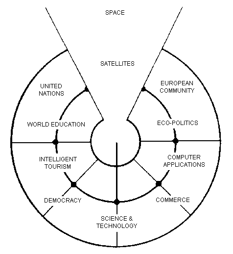

  
  

# 

by Wendy Ashby and Ronald Clark 1985-1992, HTML-version by Marcel
Springer 2001 ... 2006

[1](g18s.htm#S1) – [2](g18s.htm#S2) – [3](g18s.htm#S3) –
[4](g18s.htm#S4) – [5](g18s.htm#S5) – [6](g18s.htm#S6) –
[7](g18s.htm#S7) – [8](g18s.htm#S8) – [9](g18s.htm#S9) –
[10](g18s.htm#S10) – [11](g18s.htm#S11) – [12](g18s.htm#S12) –
[13](g18s.htm#S13) – [14](g18s.htm#S14) – [15](g18s.htm#S15) –
[16](g18s.htm#S16) – [17](g18s.htm#S17) – [18](g18s.htm#S18)

-----

## Foreword by the HTML-Writer

*This HTML-file is a light version of the book*

> Ashby, Wendy/ Clark, Ronald:  
> 18 Steps to Fluency in Euro-Glosa,  
> The Interlanguage for Europe and the World,  
> 3rd edition © 1992 by Glosa Education Organizaton,  
> Richmond, UK; ISBN 0 946540 15 2.

*You can buy the book from Wendy Ashby (c/o Glosa Education 35 Wingfield
Road; Kingston Upon Thames; Surrey KT2 5LR; ENGLAND). By purchasing this
£8.95 book, you will be helping Glosa to grow.  
USA-citizens can buy a paper copy of this HTML-document from Gary Miller
(![\[E-mail address of Gary as PNG-image\]](../pic/emailgary.png)) for
5 USD plus shipping.*

*This file does not contain the whole book, and does not aim to. Though
all the sample sentences and rules have been included, only Steps 1-3,
5, 9, 13 and 16-18 are really complete. The Glosa 1000 vocabulary list
is missing, please refer to the [Glosa Internet
Dictionary](../gid/index.html). This version is meant only as a
supplement to Glosa's presentation on the Internet. There is also a
[German](../dt/g18s.htm) and an unfinished [Russian](../brevi/ru18s.htm)
version available.*

*From the book itself, and from a letter from Wendy Ashby, I draw the
conclusion, that this book is intended to be <span class="underline">THE
official</span> description of Glosa.*

*Thanks to Wendy Ashby for the permission to put this on the net and to
Nick Hempshall for his comments. Please report errors to ![\[E-mail
address as PNG-image\]](../pic/emailm.png)glosa.org. Thank you.*

*Marcel Springer, document started 2001, last modified August 2010.*

  

-----

<span class="small">*- cover page -*</span>

<table>
<colgroup>
<col style="width: 100%" />
</colgroup>
<tbody>
<tr class="odd">
<td><br />
<br />
18 STEPS<br />
to FLUENCY in<br />
<br />
<strong>EURO-GLOSA</strong><br />
<br />
THE INTERLANGUAGE<br />
FOR EUROPE AND THE WORLD<br />
<br />
EASILY LEARNT IN A FEW DAYS<br />
VOCABULARY OF 1000 GREEK AND LATIN ROOTS<br />
COMMON TO ALL THE EURO-LANGUAGES<br />
INCLUDING RUSSIAN,<br />
AND THE ENORMOUS VOCABULARY OF SCIENCE.<br />
PHONETIC SPELLING.<br />
NO ILLOGICAL BORING GRAMMAR.<br />
INFINITELY EXPANDABLE<br />
TO MATCH RATE OF SCIENTIFIC ADVANCE.<br />
EACH GLOSA WORD STANDS FOR ONLY ONE CONCEPT.<br />
GLOSA 1000 COPES EASILY WITH ALL SUBJECTS<br />
SCIENTIFIC, TECHNICAL, COMMERCIAL &amp; LITERARY.<br />
AIDS LEARNING OF EURO-LANGUAGES.<br />
IDEAL FOR EDUCATION, INTELLIGENT TOURISM AND<br />
COMPUTERIZATION.<br />
<br />
<br />
</td>
</tr>
</tbody>
</table>

  
  

<span class="small">*- p. 3 -*</span>

## Contents

*\[Note: a lot of the word lists and pictures listed in the contents
table below are not contained in this HTML-version.\]*

<table>
<tbody>
<tr class="odd">
<td> </td>
<td>The <a href="g18s.htm#S01">Global Language</a> for the Global Village</td>
<td> ...  p.  4</td>
</tr>
<tr class="even">
<td> </td>
<td><a href="g18s.htm#S02">Pronunciation, Alphabet, Punctuation</a><br />
<br />
</td>
<td> ...  p.  5<br />
<br />
</td>
</tr>
<tr class="odd">
<td><a href="g18s.htm#S1">Step  1</a>:    </td>
<td>A, the; Past and future tenses;</td>
<td> ...  p.  6</td>
</tr>
<tr class="even">
<td> </td>
<td>numbers, -co, picture crossword.</td>
<td> ...  p.  7</td>
</tr>
<tr class="odd">
<td><a href="g18s.htm#S2">Step  2</a>:</td>
<td>Would, if</td>
<td> ...  p.  9</td>
</tr>
<tr class="even">
<td> </td>
<td>professions, colors, place (words &amp; picture)</td>
<td> ...  p. 10</td>
</tr>
<tr class="odd">
<td><a href="g18s.htm#S3">Step  3</a>:</td>
<td>Not, negative. Shops. Living things. Buildings</td>
<td> ...  p. 12</td>
</tr>
<tr class="even">
<td><a href="g18s.htm#S4">Step  4</a>:</td>
<td>Forming questions;</td>
<td> ...  p. 15</td>
</tr>
<tr class="odd">
<td> </td>
<td>Parts of the body; Rings and Things. Vessels. Furniture.</td>
<td> ...  p. 16</td>
</tr>
<tr class="even">
<td><a href="g18s.htm#S5">Step  5</a>:</td>
<td>What? Which? Greetings, Devices.</td>
<td> ...  p. 18</td>
</tr>
<tr class="odd">
<td><a href="g18s.htm#S6">Step  6</a>:</td>
<td>This &amp; that. These &amp; those;</td>
<td> ...  p. 21</td>
</tr>
<tr class="even">
<td> </td>
<td>Places. Materials. Sets. Thread. Stone; Things to eat (picture page and phrases).    </td>
<td> ...  p. 22</td>
</tr>
<tr class="odd">
<td><a href="g18s.htm#S7">Step  7</a>:</td>
<td>Get. Become. Got;;</td>
<td> ...  p. 24</td>
</tr>
<tr class="even">
<td> </td>
<td>Opposites. Get &amp; got. Clothes. Cloths;</td>
<td> ...  p. 25</td>
</tr>
<tr class="odd">
<td> </td>
<td>Travel (picture &amp; phrases).</td>
<td> ...  p. 26</td>
</tr>
<tr class="even">
<td><a href="g18s.htm#S8">Step  8</a>:</td>
<td>May, perhaps, must, have to;</td>
<td> ...  p. 28</td>
</tr>
<tr class="odd">
<td> </td>
<td>The house (picture &amp; phrases).</td>
<td> ...  p. 29</td>
</tr>
<tr class="even">
<td><a href="g18s.htm#S9">Step  9</a>:</td>
<td>Time, during;</td>
<td> ...  p. 31</td>
</tr>
<tr class="odd">
<td> </td>
<td>Street scene (picture &amp; text);</td>
<td> ...  p. 32</td>
</tr>
<tr class="even">
<td> </td>
<td>Psalm 23 (parallel text).</td>
<td> ...  p. 33</td>
</tr>
<tr class="odd">
<td><a href="g18s.htm#S10">Step 10</a>:</td>
<td>Very, intense;</td>
<td> ...  p. 34</td>
</tr>
<tr class="even">
<td> </td>
<td>Hospital (picture &amp; phrases).</td>
<td> ...  p. 35</td>
</tr>
<tr class="odd">
<td><a href="g18s.htm#S11">Step 11</a>:</td>
<td>Ought to, should;</td>
<td> ...  p. 37</td>
</tr>
<tr class="even">
<td> </td>
<td>Communications (picture &amp; phrases).</td>
<td> ...  p. 38</td>
</tr>
<tr class="odd">
<td><a href="g18s.htm#S12">Step 12</a>:</td>
<td>More than, less than, as big as;</td>
<td> ...  p. 40</td>
</tr>
<tr class="even">
<td> </td>
<td>Tools (picture &amp; phrases).</td>
<td> ...  p. 41</td>
</tr>
<tr class="odd">
<td><a href="g18s.htm#S13">Step 13</a>:</td>
<td>Oneself. One's own;</td>
<td> ...  p. 43</td>
</tr>
<tr class="even">
<td> </td>
<td>Post Office (picture &amp; phrases).</td>
<td> ...  p. 44</td>
</tr>
<tr class="odd">
<td><a href="g18s.htm#S14">Step 14</a>:</td>
<td>Most, -est;</td>
<td> ...  p. 46</td>
</tr>
<tr class="even">
<td> </td>
<td>Camping (picture &amp; phrases).</td>
<td> ...  p. 47</td>
</tr>
<tr class="odd">
<td><a href="g18s.htm#S15">Step 15</a>:</td>
<td>..., who. ..., which;</td>
<td> ...  p. 49</td>
</tr>
<tr class="even">
<td> </td>
<td>Apiculture (picture &amp; phrases).</td>
<td> ...  p. 50</td>
</tr>
<tr class="odd">
<td><a href="g18s.htm#S16">Step 16</a>:</td>
<td>Cause, make, switch on;</td>
<td> ...  p. 52</td>
</tr>
<tr class="even">
<td> </td>
<td>Tri Andro in Navi (parallel text).</td>
<td> ...  p. 53</td>
</tr>
<tr class="odd">
<td><a href="g18s.htm#S17">Step 17</a>:</td>
<td>Near Future. Recent Past;</td>
<td> ...  p. 55</td>
</tr>
<tr class="even">
<td> </td>
<td>Shakespeare (parallel text).</td>
<td> ...  p. 56</td>
</tr>
<tr class="odd">
<td><a href="g18s.htm#S18">Step 18</a>:</td>
<td>Continue, -ing, still;</td>
<td> ...  p. 58</td>
</tr>
<tr class="even">
<td> </td>
<td>Some English idioms. Mega Glosa.<br />
<br />
</td>
<td> ...  p. 59<br />
<br />
</td>
</tr>
<tr class="odd">
<td> </td>
<td><a href="g18s.htm#Mechanics">Glosa Mechanics</a>.</td>
<td> ...  p. 60</td>
</tr>
<tr class="even">
<td> </td>
<td>Glosa 1000 - English Vocabulary</td>
<td> ...  p. 61</td>
</tr>
<tr class="odd">
<td> </td>
<td>English - Glosa 1000 Vocabulary</td>
<td> ...  p. 88</td>
</tr>
</tbody>
</table>

<span id="S01"></span>  
  

-----

<span class="small">*- p. 4 -*</span>

## The Global Language for the Global Village

A truly International Auxiliary Language must be easy to learn for
motivated people everywhere. It must not become a merely holiday
language for comfortable westerners.

It must be easy for the Third World Villager as well as for western
scientist and poet. Just such a language is Glosa, which simplifies,
improves and economizes international communication.

Glosa is the ideal oral complement to the electronic Information
Technology Revolution.

All the old languages face the student with lists of frightfully
strange-looking words, which have to be thoroughly memorized plus a
complex Grammar.

In contrast all Glosa words are already internationally familiar and in
lively daily use not only in Europe but everywhere modern Medicine and
Science penetrate.

The late Prof. Lancelot Hogben pointed out that "The world-wide
vocabulary of Science is the nearest thing to the lexicon of a truly
Global Language that Mankind has yet achieved. It derives its words from
two dead languages - Latin and now, almost exclusively Greek."

Although Glosa has a very large Mega Vocabulary, its heart, its centre
consists of only 1000 words which can easily cope with any kind of
intelligent conversation accurately and euphoniously.

The Mechanics of Glosa neatly summarized on one
[page](g18s.htm#Mechanics) shows how 20 little words of the 1000 deal
easily with Tense, Comparison, Number etc.

There are 18 lessons, each one with exercises for translation from
English into Glosa, and vice versa *\[In this file, the exercises and
translations have been brought together as parallel columns.\]*. Each
lesson contains parallel English and Glosa sentences. Simple informal
letters are provided in alternate lessons, and useful phrases.

Many informative illustrations *\[A lot of them not in this file\]*.

The vocabularies at the back list Glosa 1000 into English and a 2000
word English vocabulary into Glosa 1000 *\[Not in this file.\]*.

Each Glosa word stands for a Concept, rather like the head word in
Roget's Thesaurus.

Each Glosa word can act as any part of speech, as do Chinese and,
increasingly, English. The Glosa student will quickly discover that
there is much color and poetry in the Greek and Latin roots of Sci-tek
Terminology, and they will soon acquire a network of colorful
associations. Each Glosa word is a little sun, from which radiate a host
of derivatives in all the Euro-languages, including German and Russian.

<span id="S02"></span>  
  

<span class="small">*- p. 5 -*</span>

## Preliminary Notes

### Pronunciation

Every letter must be pronounced including the final vowel.  
5 <span class="underline">vowels</span> as in Spanish, and as pronounced
in English: fAther, cafE, machIne, mOre, lUnar.  
Try to pronounce O like English AW.  
<span class="underline">Diphthongs</span>. Pronounce vowels
separately.  
<span class="underline">Consonants</span> as in English with following
exceptions:  
  **C** always pronounced like CH in English CHurCH.  
  **J** as Y in Yes.  
  **R** must always be pronounced, preferably trilled.  
  **G** must always be hard as in Get.  
  **H** should always be pronounced as in English Help.  
  **Q** pronounced as English QU or KW.  
  **SC** always pronounced like English SH *(- but is very rare. A
regular pronounciation like S-CH should be possible, too)*.

*(Addition, see the book "Glosa 6000", p. 17:)* One or two Greek words
start off with awkward-looking pairs of consonants as in psychology. It
is prefereable to pronounce the **P**, but not essential, and can be
left to individual discretion.  
*Analogously, **X** in the beginning of a word could be pronounced like
**S**, but pronouncing it **KS** would be better.*  
<span class="underline">Accent</span> gently on vowel before last
consonant.

``` 

            Glosa     pronounciation

instead     vice      veechay 
meat        karni     kahrrnee 
blue        ciano     cheeahnaw 
wood        xilo      ksilaw or zeelaw 
machine     makina    mahkeenah 
light       lumi      loomee 
question    qestio    kwaysteeaw (error in original: "questio") 
swing       osci      awshee 
white       leuko     layookaw 
```

### Spelling

Spelling is phonetic. Greek PH replaced by F, CH by K, Y by I, TH by T.

  

### Alphabet

The letters are named as follows *(Spelling shows English
pronunciation)*:  
AH, BAY, CHAY, DAY, AY, FAY, GAY, HAY, EE, YAY, KAY, LAY, MAY, NAY, AW,
PAY, KOOAY, RAY, SAY, TAY, OO, VAY, DEEPLAW VAY *(error in original:
"DUPLO VAY")* EKS, EE GREK, ZETAH.

  

### Punctuation

Colon precedes items of a catalogue. **Fe stude: biologi, kemi.**  
Comma separates items from each other.  
Semi-colon separates clauses, principal and subordinate.  
A clause is a group of words containing a finite verb.  
There are plenty of examples in the book.

  
<span id="S1"></span>  
  

(To steps: [1](g18s.htm#S1), [2](g18s.htm#S2), [3](g18s.htm#S3),
[4](g18s.htm#S4), [5](g18s.htm#S5), [6](g18s.htm#S6), [7](g18s.htm#S7),
[8](g18s.htm#S8), [9](g18s.htm#S9), [10](g18s.htm#S10),
[11](g18s.htm#S11), [12](g18s.htm#S12), [13](g18s.htm#S13),
[14](g18s.htm#S14), [15](g18s.htm#S15), [16](g18s.htm#S16),
[17](g18s.htm#S17), [18](g18s.htm#S18))

-----

<span class="small">*- p. 6 -*</span>

## Step 1

<table>
<colgroup>
<col style="width: 45%" />
<col style="width: 55%" />
</colgroup>
<tbody>
<tr class="odd">
<td><strong>u </strong></td>
<td>a, the, one</td>
</tr>
<tr class="even">
<td><strong>plu </strong></td>
<td>more than one</td>
</tr>
<tr class="odd">
<td><strong>pa </strong></td>
<td>(PAst), did, -ed</td>
</tr>
<tr class="even">
<td><strong>fu </strong></td>
<td>(FUture), shall</td>
</tr>
<tr class="odd">
<td></td>
<td><br />
</td>
</tr>
<tr class="even">
<td></td>
<td><br />
</td>
</tr>
<tr class="odd">
<td><strong>Mi grafo poesi. </strong></td>
<td>I write poetry.</td>
</tr>
<tr class="even">
<td><strong>Mi sporta tenis. </strong></td>
<td>I play tennis.</td>
</tr>
<tr class="odd">
<td><strong>Mi amo skope televisio. </strong></td>
<td>I like watching television.</td>
</tr>
<tr class="even">
<td><strong>Mi amo visita u teatra </strong></td>
<td>I like visiting the theatre.</td>
</tr>
<tr class="odd">
<td><strong>Mi amo lekto. </strong></td>
<td>I like reading.</td>
</tr>
<tr class="even">
<td><strong>Mi lekto e grafo. </strong></td>
<td>I read and write.</td>
</tr>
<tr class="odd">
<td><strong>Mi lekto u bibli. </strong></td>
<td>I read the book.</td>
</tr>
<tr class="even">
<td><strong>Mi fu lekto u bibli. </strong></td>
<td>I shall read the book.</td>
</tr>
<tr class="odd">
<td><strong>Mi fu gene sko de Glosa. </strong></td>
<td>I will learn Glosa.</td>
</tr>
<tr class="even">
<td><strong>Mi amo gene sko de plu lingua. </strong></td>
<td>I like learning languages.</td>
</tr>
<tr class="odd">
<td><strong>Mi fu lekto plu bibli. </strong></td>
<td>I will read the books.</td>
</tr>
<tr class="even">
<td><strong>Mi fu ki ana monti. </strong></td>
<td>I will climb up the mountain.</td>
</tr>
<tr class="odd">
<td><strong>Mi pa lekto plu bibli. </strong></td>
<td>I read (did read) the books.</td>
</tr>
<tr class="even">
<td><strong>Mi pa visita u teatra. </strong></td>
<td>I visited the theatre.</td>
</tr>
<tr class="odd">
<td><strong>Mi pa audi u radio. </strong></td>
<td>I listened to the radio.</td>
</tr>
</tbody>
</table>

  
  

*Vocabulary*

|                                |                                 |
| ------------------------------ | ------------------------------- |
| **drama **                     | acting                          |
| **musika **                    | music                           |
| **kulti plu fito **            | growing plants                  |
| **grafo poesi / plu grama **   | writing poetry / letters        |
| **gresi **                     | walking                         |
| **nekto **                     | swimming                        |
| **viagia **                    | travel                          |
| **e **                         | and                             |
| **kanta **                     | singing                         |
| **kore **                      | dancing                         |
| **kapti plu piski **           | catching fish                   |
| **face plu kerami vasa **      | making pottery vases            |
| **kolekti plu moneta **        | collecting coins                |
| **kolekti plu posta karta **   | collecting post cards           |
| **lekto plu bibli **           | reading books                   |
| **fotografi **                 | photography                     |
| **internexu **                 | networking                      |
| **audi u radio **              | listening to radio              |
| **kambio plu grama **          | exchanging letters              |
| **gene sko de plu lingua **    | learning languages              |
| **skope televisio **           | watching television             |
| **sporta tenis **              | playing tennis                  |
| **plu gram-ami **              | penfriends                      |
| **visita u teatra / plu ami ** | visiting the theatre / friends  |
| **trikota e sue **             | knitting and sewing             |
| **soni u piano **              | playing the piano               |
| **amo **                       | to like, love                   |
| **de **                        | in relation to; with respect to |
| **plu enigma **                | puzzles                         |
| **kuko **                      | cooking                         |
| **plu puta-me ludi **          | computer games                  |
| **habe **                      | to have; to possess             |

  

<span class="small">*- p. 7 -*</span>

### Numbers

|                     |                                                                                  |
| ------------------- | -------------------------------------------------------------------------------- |
| 1                   | **mo**                                                                           |
| 2                   | **bi**                                                                           |
| 3                   | **tri**                                                                          |
| 4                   | **tet** or **tetra**                                                             |
| 5                   | **pen** or **penta**                                                             |
| 6                   | **six** *(or **sixa**)*                                                          |
| 7                   | **seti** or **septi**                                                            |
| 8                   | **ok** or **okto**                                                               |
| 9                   | **nona**                                                                         |
| 10                  | **deka**                                                                         |
| 0                   | **ze** or **zero**                                                               |
| 11                  | **mo mo**                                                                        |
| 12                  | **mo bi**                                                                        |
| 20                  | **bi ze**                                                                        |
| 50                  | **pen ze**                                                                       |
| 100                 | **mo hekto** *(original says **mo centi**, but **centi** is better for "1/100")* |
| 1000                | **mo kilo**                                                                      |
| million             | **miliona**                                                                      |
| 92                  | **nona bi**                                                                      |
| 10 in the 6th power | **dek a six**                                                                    |
| 5/8, 5 over 8       | **pen su ok**                                                                    |
| 3,2                 | **tri koma bi**                                                                  |
| \+                  | **plus**                                                                         |
| \-                  | **minus**                                                                        |
| x, by               | **para**                                                                         |
| 3 x 4 = 12          | **tri para tet eqa mo bi**                                                       |
| divide              | **divide**                                                                       |
| 5 books             | **penta bibli**                                                                  |
| the 5th book        | **u bibli penta**                                                                |
| 3 times             | **tri kron**                                                                     |
| they have 2 each    | **singu pe habe bi ra**                                                          |
| How many?           | **Qo numera?** or **Qanto?**                                                     |
| Count them\!        | **Numera mu\!**                                                                  |
| June 8              | **di ok, meno six**                                                              |
| Monday              | **di bi**                                                                        |
| date                | **datu**                                                                         |

  
  
  

### \-co

This is the Glosa form of the Italian word ciò, which means this, that.
In Glosa it means "what I've just said".

It helps to make the very useful Logical Connectors listed below. Glosa
is a semantically based language, so that when a group of words shares a
common element of meaning this is indicated in the form of each word.

In the old languages like English and French this common element finds
no expression.

If you study the following list you will quickly see the usefulness of
the device, and will find it easy to make up many others. *\[Note: In
the original book all except **ex-co** are without hyphens. **-co**
never stands alone, but always in combinations of this kind.\]*

|                |                 |
| -------------- | --------------- |
| **po-co **     | after that      |
| **plus-co **   | moreover        |
| **homo-co **   | similarly       |
| **para-co **   | by the way      |
| **suma-co **   | summing up      |
| **fini-co **   | finally         |
| **seqe-co **   | consequently    |
| **kontra-co ** | conversely      |
| **ko-co **     | also            |
| **klu-co **    | even so         |
| **akorda-co ** | accordingly     |
| **hetero-co ** | otherwise       |
| **per-co **    | in this way     |
| **tem-co **    | meanwhile       |
| **anti-co **   | however         |
| **metri-co **  | to that extent  |
| **no-klu-co ** | apart from that |
| **ex-co **     | from all that   |

  
  

<span class="small">*- p. 8 -*</span>

*Exercise 1*

<table>
<colgroup>
<col style="width: 45%" />
<col style="width: 55%" />
</colgroup>
<tbody>
<tr class="odd">
<td><strong>Mi kolekti plu moneta. </strong></td>
<td>I collect coins.</td>
</tr>
<tr class="even">
<td><strong>Mi amo lekto e grafo. </strong></td>
<td>I like reading and writing.</td>
</tr>
<tr class="odd">
<td><strong>Mi grafo plu kanta e poesi. </strong></td>
<td>I write songs and poetry.</td>
</tr>
<tr class="even">
<td><strong>Mi fu visita u teatra. </strong></td>
<td>I will visit the theatre.</td>
</tr>
<tr class="odd">
<td><strong>Mi fu skope u televisio. </strong></td>
<td>I will watch the television.</td>
</tr>
<tr class="even">
<td><strong>Mi fu audi u kanta. </strong></td>
<td>I will listen to the singing.</td>
</tr>
<tr class="odd">
<td><strong>Mi pa audi u musika. </strong></td>
<td>I listened to the music.</td>
</tr>
<tr class="even">
<td><strong>Mi pa lekto u grama. </strong></td>
<td>I read (did read) the letter.</td>
</tr>
<tr class="odd">
<td><strong>Mi pa visita bi ami. </strong></td>
<td>I visited two friends.</td>
</tr>
<tr class="even">
<td></td>
<td><br />
</td>
</tr>
<tr class="odd">
<td><strong>Mi habe tri bibli. </strong></td>
<td>I have three books.</td>
</tr>
<tr class="even">
<td><strong>Mi lekto u lingua bibli. </strong></td>
<td>I'm reading the language book.</td>
</tr>
<tr class="odd">
<td><strong>U bibli de plu fito. </strong></td>
<td>A book about plants.</td>
</tr>
<tr class="even">
<td><strong>Mi amo sue. </strong></td>
<td>I like sewing.</td>
</tr>
<tr class="odd">
<td><strong>Mi pa nekto. </strong></td>
<td>I swam.</td>
</tr>
<tr class="even">
<td><strong>Mi fu nekto. </strong></td>
<td>I will swim.</td>
</tr>
<tr class="odd">
<td><strong>Mi amo soni u piano. </strong></td>
<td>I like playing the piano.</td>
</tr>
<tr class="even">
<td><strong>Mi pa grafo tri grama. </strong></td>
<td>I wrote three letters.</td>
</tr>
<tr class="odd">
<td><strong>U bibli de plu enigma. </strong></td>
<td>A puzzle book.</td>
</tr>
</tbody>
</table>

  
  

<span class="underline">**Pikto-Verba**</span>

![\[crossword puzzle\]](../pic/g18s001.gif)

  

**Kata:**  
1: ![\[fish\]](../pic/g18s002.gif)          2: **2**         
3: ![\[reading\]](../pic/g18s003.gif)         
4: ![\[swimming\]](../pic/g18s004.gif)  
5: ![\[coin\]](../pic/g18s005.gif)          6: **8**           
  
9:  
**Mo, bi, tri,  
dice Glosa ko mi.  
Lekto, graf e ludi;  
dice Glosa nu-di.  
** 11: ![\[piano\]](../pic/g18s008.gif)         
12: ![\[dancer\]](../pic/g18s007.gif)         
13: ![\[letter\]](../pic/g18s006.gif)  
  
14: ![\[book\]](../pic/g18s009.gif)         
15: ![\[radio\]](../pic/g18s010.gif)          16: ![\[dog with
tongue\]](../pic/g18s011.gif)           
  
  
  
  
  
**Trans:**  
5: ![\[notes\]](../pic/g18s012.gif)         
7: ![\[sewing\]](../pic/g18s013.gif)  
8: ![\[singing\]](../pic/g18s014.gif)         
9: ![\[cooking\]](../pic/g18s015.gif)          10: **3**  
11: ![\[postcard\]](../pic/g18s016.gif)         
13: ![\[writing\]](../pic/g18s018.gif)         
16: ![\[wandering\]](../pic/g18s020.gif)  
17: **1**          18: ![\[vase\]](../pic/g18s019.gif)         
19: ![\[flower\]](../pic/g18s017.gif)

Please click [here](g18s.htm#Key1) for solution.

<span id="S2"></span>  
  

(To other steps: [1](g18s.htm#S1), [2](g18s.htm#S2), [3](g18s.htm#S3),
[4](g18s.htm#S4), [5](g18s.htm#S5), [6](g18s.htm#S6), [7](g18s.htm#S7),
[8](g18s.htm#S8), [9](g18s.htm#S9), [10](g18s.htm#S10),
[11](g18s.htm#S11), [12](g18s.htm#S12), [13](g18s.htm#S13),
[14](g18s.htm#S14), [15](g18s.htm#S15), [16](g18s.htm#S16),
[17](g18s.htm#S17), [18](g18s.htm#S18))

-----

<span class="small">*- p. 9 -*</span>

## Step 2

<table>
<colgroup>
<col style="width: 45%" />
<col style="width: 55%" />
</colgroup>
<tbody>
<tr class="odd">
<td><strong>sio  </strong></td>
<td>would if<br />
</td>
</tr>
<tr class="even">
<td></td>
<td><br />
</td>
</tr>
<tr class="odd">
<td></td>
<td><br />
</td>
</tr>
<tr class="even">
<td><strong>Fe nima es Iris. </strong></td>
<td>Her name is Iris.</td>
</tr>
<tr class="odd">
<td><strong>Fe habe tetra anua. </strong></td>
<td>She is four years old.</td>
</tr>
<tr class="even">
<td><strong>An nima es George. </strong></td>
<td>His name is George.</td>
</tr>
<tr class="odd">
<td><strong>An habe tri anua. </strong></td>
<td>He is three years old.</td>
</tr>
<tr class="even">
<td><strong>Mi amo kolekti plu moneta. </strong></td>
<td>I like collecting coins.</td>
</tr>
<tr class="odd">
<td><strong>Mi sio amo grafo u bibli. </strong></td>
<td>I would like to write a book.</td>
</tr>
<tr class="even">
<td><strong>Mi matri ergo in domi. </strong></td>
<td>My mother works in the house.</td>
</tr>
<tr class="odd">
<td><strong>Mi patri-matri soni u piano. </strong></td>
<td>My grandmother plays the piano.</td>
</tr>
<tr class="even">
<td><strong>Fe sio amo viagia. </strong></td>
<td>She would love to travel.</td>
</tr>
<tr class="odd">
<td><strong>Mi patri ergo in pato-do. </strong></td>
<td>My father works in the hospital.</td>
</tr>
<tr class="even">
<td><strong>An amo audi musika. </strong></td>
<td>He likes listening to music.</td>
</tr>
<tr class="odd">
<td><strong>An es u medika-pe. </strong></td>
<td>He is a doctor.</td>
</tr>
<tr class="even">
<td><strong>Mi fratri eko in Paris. </strong></td>
<td>My brother lives in Paris.</td>
</tr>
<tr class="odd">
<td><strong>Mi sorori eko extra Paris. </strong></td>
<td>My sister lives outside Paris.</td>
</tr>
<tr class="even">
<td><strong>Place. Gratia. Penite.</strong> <em>(Errors in original: <strong>Gratio.</strong> and <strong>Penito</strong>.)</em> </td>
<td>Please. Thank you. Sorry.</td>
</tr>
<tr class="odd">
<td><strong>Mi spe gene tu reakti. </strong></td>
<td>I hope to hear from you.</td>
</tr>
</tbody>
</table>

  
  

*Vocabulary*

|                  |                   |
| ---------------- | ----------------- |
| **es **          | is, be, am, are   |
| **Karo ... **    | Dear ...          |
| **tu **          | you, your         |
| **nima **        | name              |
| **in **          | inside, in        |
| **extra **       | outside, outdoors |
| **anua **        | year, annual      |
| **eko **         | dwell, live       |
| **matri **       | mother            |
| **patri **       | father            |
| **fratri **      | brother           |
| **sorori **      | sister            |
| **ergo **        | work              |
| **domi; -do **   | house, building   |
| **pato **        | sick; ill         |
| **andro **       | man               |
| **an **          | he, him, his      |
| **gina **        | woman             |
| **fe **          | she, her          |
| **persona; pe ** | person; one       |
| **meno **        | month             |
| **gene **        | get, receive      |

  
  
  

<span class="underline">Exchanging Letters</span>

You can now start corresponding in Glosa. Write about your family, and
interests. Here is an example.

  

**Karo Andrew\!**

**Mi pa lekto tu nima in “Plu Glosa Nota”; e mi sio amo kambio plu grama
ko tu.**

**Mi habe deka anua. Mi eko ko mi matri, patri e fratri. Mi matri ergo
in domi; e mi patri ergo** *(error in original **eko**)* **in pato-do.
An es u medika-pe. Mi fratri habe tri anua. An nima es George. Mi amo
lekto, grafo, musika, nekto, kuko, e kolekti plu posta-karta. Mi spe
gene tu reakti. Plu Saluta**

**Irene**

  
  

<span class="small">*- p. 10 -*</span>

### Plu Profesio

Many of the chief amenities of civilized life fall into 18 classes,
which in Glosa can be conveniently abbreviated to two letters. By
combining these with words representing activities you can build up a
very large vocabulary easily involving little strain on the memory.
**-pe**, which is the abbreviation for **pe**rson can be combined with
many of the words you have already learnt.

|                   |                                                                                                                                                                                                     |
| ----------------- | --------------------------------------------------------------------------------------------------------------------------------------------------------------------------------------------------- |
| **medika-pe **    | doctor                                                                                                                                                                                              |
| **medika-fe **    | female doctor                                                                                                                                                                                       |
| **medika-an **    | male doctor                                                                                                                                                                                         |
| **piski-pe **     | fisherman                                                                                                                                                                                           |
| **posta-pe **     | postman                                                                                                                                                                                             |
| **kore-pe **      | dancer                                                                                                                                                                                              |
| **kuko-pe **      | chef, cook                                                                                                                                                                                          |
| **drama-fe **     | actress                                                                                                                                                                                             |
| **gresi-pe **     | walker, hiker                                                                                                                                                                                       |
| **sko-pe **       | instructor, teacher                                                                                                                                                                                 |
| **stude-pe **     | student, pupil                                                                                                                                                                                      |
| **musika-pe **    | musician                                                                                                                                                                                            |
| **Italia-pe **    | Italian person                                                                                                                                                                                      |
| **ergo-pe **      | worker                                                                                                                                                                                              |
| **nuli-ergo-pe ** | unemployed person *(Other suggestions are **nul-ergo-pe** or **ne-ergo-pe**. The original word was **minus ergo-pe**, but that would mean "without a worker", "lacking a worker" or "workerless".)* |
| **plu ergo-pe **  | staff, workers                                                                                                                                                                                      |
| **eko-pe **       | inhabitant                                                                                                                                                                                          |
| **habe-pe **      | proprietor                                                                                                                                                                                          |
| **pato-pe **      | patient                                                                                                                                                                                             |
| **grafo-pe **     | author, writer                                                                                                                                                                                      |
| **viagia-pe **    | traveller                                                                                                                                                                                           |
| **plu kanta-pe ** | singers                                                                                                                                                                                             |
| **plu audi-pe **  | audience                                                                                                                                                                                            |
| **nekto-pe **     | swimmer                                                                                                                                                                                             |
| **monti-pe **     | mountaineer                                                                                                                                                                                         |
| **plu skope-pe ** | spectators                                                                                                                                                                                          |

  
  

When possible use local geographical names, eg. Sweden **Sverige**,
Germany **Deutschland**, Rome **Roma**.

  
  

### Colors

|                   |            |
| ----------------- | ---------- |
| **leuko **        | white      |
| **melano **       | black      |
| **polio **        | grey       |
| **xanto **        | yellow     |
| **rubi **         | red        |
| **ciano **        | blue       |
| **bruno **        | brown      |
| **leuko-bruno **  | beige      |
| **polio-bruno **  | fawn       |
| **purpuro **      | purple     |
| **purpuro-rubi ** | crimson    |
| **kloro **        | green      |
| **leuko kloro **  | pale green |
| **sub kloro **    | greenish   |
| **fo-kloro **     | deep green |
| **melano kloro ** | dark green |
| **rubi-xanto **   | orange     |
| **minus kroma **  | colorless  |

  
  

*Exercise 2*

<table>
<colgroup>
<col style="width: 45%" />
<col style="width: 55%" />
</colgroup>
<tbody>
<tr class="odd">
<td><strong>Mi habe okto anua. </strong></td>
<td>I am 8 years old.</td>
</tr>
<tr class="even">
<td><strong>Mi gene sko de Glosa. </strong></td>
<td>I am learning Glosa.</td>
</tr>
<tr class="odd">
<td><strong>Mi gina-matri es u grafo-fe. </strong></td>
<td>My mother-in-law is a writer.</td>
</tr>
<tr class="even">
<td><strong>Fe pa grafo penta bibli. </strong></td>
<td>She has written five books.</td>
</tr>
<tr class="odd">
<td><strong>Fe habe u puta-me. </strong></td>
<td>She has a computer.</td>
</tr>
<tr class="even">
<td><strong>Mi patri es u drama-pe. </strong></td>
<td>My father is an actor.</td>
</tr>
<tr class="odd">
<td><strong>Plu audi-pe amo an. </strong></td>
<td>The audience like him.</td>
</tr>
<tr class="even">
<td><strong>Mi matri es u sko-pe. </strong></td>
<td>My mother is a teacher.</td>
</tr>
<tr class="odd">
<td><strong>Mi eko in domi tri. </strong></td>
<td>I live in the third house.</td>
</tr>
<tr class="even">
<td><strong>Patri-patri. </strong></td>
<td>Grandfather (= father's father)</td>
</tr>
<tr class="odd">
<td></td>
<td><br />
</td>
</tr>
<tr class="even">
<td><strong>An habe bi-ze anua. </strong></td>
<td>He is twenty years old.</td>
</tr>
<tr class="odd">
<td><strong>Un an-piski habe mo anua </strong></td>
<td>The male fish is one year old.</td>
</tr>
<tr class="even">
<td><strong>Piski-an </strong></td>
<td>Fisherman.</td>
</tr>
<tr class="odd">
<td><strong>Tu habe tri-ze moneta </strong></td>
<td>You have 30 coins.</td>
</tr>
<tr class="even">
<td><strong>An kulti plu piski </strong></td>
<td>He breeds fishes.</td>
</tr>
<tr class="odd">
<td><strong>Mi pa gene okto grama </strong></td>
<td>I received eight letters.</td>
</tr>
<tr class="even">
<td><strong>Mi pa posta six grama </strong></td>
<td>I posted six letters.</td>
</tr>
<tr class="odd">
<td><strong>Mi amo audi plu kanta-pe </strong></td>
<td>I like listening to the choir.</td>
</tr>
<tr class="even">
<td><strong>Plu persona amo fe </strong></td>
<td>The people like her.</td>
</tr>
<tr class="odd">
<td><strong>Mi nima es Margaret. </strong></td>
<td>My name is Margaret.</td>
</tr>
</tbody>
</table>

  

<span class="small">*- p. 11 -*</span>

<span class="underline">Place-Words</span>

![\[diagram about the prepositions epi, intra, dia and
peri\]](../pic/g18s021.gif) ![\[diagram about the prepositions ana and
kata\]](../pic/g18s022.gif) ![\[diagram about the
prepositions\]](../pic/g18s023.gif)

Since a place word is usually followed by a noun, there is no need for
it to be followed by **u(n)**, the article. For example:

<table>
<colgroup>
<col style="width: 45%" />
<col style="width: 55%" />
</colgroup>
<tbody>
<tr class="odd">
<td><strong>U verba-bibli es epi tabla. </strong></td>
<td>The dictionary is on the table.</td>
</tr>
<tr class="even">
<td><strong>Fe pa du gresi longi ripa. </strong></td>
<td>She was walking along the riverbank.</td>
</tr>
<tr class="odd">
<td></td>
<td><br />
</td>
</tr>
<tr class="even">
<td></td>
<td><br />
</td>
</tr>
<tr class="odd">
<td></td>
<td><br />
</td>
</tr>
<tr class="even">
<td><strong>Sedi in gono </strong></td>
<td>sit in the corner</td>
</tr>
<tr class="odd">
<td><strong>Grafo poesi in Glosa </strong></td>
<td>write poetry in Glosa</td>
</tr>
<tr class="even">
<td><strong>Loka id in teka </strong></td>
<td>Put it in the box</td>
</tr>
<tr class="odd">
<td><strong>An eko kontra na </strong></td>
<td>He lives opposite us</td>
</tr>
<tr class="even">
<td><strong>In e peri urba</strong> <em>(original says <strong>urbs</strong>.)</em>  </td>
<td>In and around town</td>
</tr>
<tr class="odd">
<td><strong>Sti id pende a mura</strong> <em>(original says <strong>Pend id epi mura</strong>, which is okay, too. Other prepositions are also possible: <strong>Pend id a/de/epi/kata mura</strong>)</em> </td>
<td>Hang it on the wall</td>
</tr>
<tr class="even">
<td><strong>Registra epi flexi disko</strong> <em>(original says <strong>diska</strong>)</em> </td>
<td>Record on to a floppy disk.</td>
</tr>
<tr class="odd">
<td><strong>Fe pa loka u mantela epi</strong> <em>(original says <strong>ep</strong>)</em> <strong>se. </strong></td>
<td>She put on her coat</td>
</tr>
<tr class="even">
<td><strong>Skope u programa per</strong> <em>(Original says <strong>epi</strong>, which is okay, too. Other prepositions would be possible, too: <strong>Skope u programa per/ex/in/a/de/epi TV</strong>)</em> <strong>TV </strong></td>
<td>Watch a program on TV</td>
</tr>
<tr class="odd">
<td><strong>Viagia trans</strong> <em>(original says <strong>dia</strong>)</em> <strong>rura </strong></td>
<td>Travel through the countryside.</td>
</tr>
<tr class="even">
<td><strong>Kribri id.</strong> <em>(original says <strong>Kribra id</strong>.)</em> </td>
<td>Strain it through the sieve.</td>
</tr>
<tr class="odd">
<td><strong>Hidro flu dia tubi. </strong></td>
<td>Water flows through the tube.</td>
</tr>
<tr class="even">
<td><strong>Un avi pa peti</strong> <em>(original says <strong>vola</strong>)</em> <strong>supra dendro. </strong></td>
<td>The bird flew over the tree.</td>
</tr>
<tr class="odd">
<td><strong>Ki infra ponti. </strong></td>
<td>Go under the bridge.</td>
</tr>
<tr class="even">
<td><strong>An pa dromo trans via. </strong></td>
<td>He ran across the road.</td>
</tr>
<tr class="odd">
<td><strong>Fe es supra. </strong></td>
<td>She is upstairs.</td>
</tr>
<tr class="even">
<td><strong>Fe es infra. </strong></td>
<td>She is downstairs.</td>
</tr>
</tbody>
</table>

  
<span id="S3"></span>  
  

(To other steps: [1](g18s.htm#S1), [2](g18s.htm#S2), [3](g18s.htm#S3),
[4](g18s.htm#S4), [5](g18s.htm#S5), [6](g18s.htm#S6), [7](g18s.htm#S7),
[8](g18s.htm#S8), [9](g18s.htm#S9), [10](g18s.htm#S10),
[11](g18s.htm#S11), [12](g18s.htm#S12), [13](g18s.htm#S13),
[14](g18s.htm#S14), [15](g18s.htm#S15), [16](g18s.htm#S16),
[17](g18s.htm#S17), [18](g18s.htm#S18))

-----

<span class="small">*- p. 12 -*</span>

## Step 3

<table>
<colgroup>
<col style="width: 45%" />
<col style="width: 55%" />
</colgroup>
<tbody>
<tr class="odd">
<td><strong>ne </strong></td>
<td>not, negative</td>
</tr>
<tr class="even">
<td></td>
<td><br />
</td>
</tr>
<tr class="odd">
<td></td>
<td><br />
</td>
</tr>
<tr class="even">
<td><strong>Mi patri ne sporta tenis. </strong></td>
<td>My father doesn't play tennis.</td>
</tr>
<tr class="odd">
<td><strong>An ne amo sporta tenis. </strong></td>
<td>He doesn't like playing tennis.</td>
</tr>
<tr class="even">
<td><strong>An ne lekto. </strong></td>
<td>He doesn't read.</td>
</tr>
<tr class="odd">
<td><strong>An ne amo lekto. </strong></td>
<td>He doesn't like reading.</td>
</tr>
<tr class="even">
<td><strong>Mi ne amo skope televisio. </strong></td>
<td>I don't like watching TV.</td>
</tr>
<tr class="odd">
<td><strong>An ergo in musika-bo. </strong></td>
<td>He works in a music shop.</td>
</tr>
<tr class="even">
<td><strong>An ne ergo in pato-do. </strong></td>
<td>He doesn't work in a hospital.</td>
</tr>
<tr class="odd">
<td><strong>An ne pa sporta tenis pa-di. </strong></td>
<td>He didn't play tennis yesterday.</td>
</tr>
<tr class="even">
<td><strong>Fe ne pa visita plu boteka. </strong></td>
<td>She didn't go to the shops.</td>
</tr>
<tr class="odd">
<td><strong>An ne pa visita fe di-tri. </strong></td>
<td>He didn't visit her on Tuesday.</td>
</tr>
<tr class="even">
<td><strong>Na fu visita fe fu-di. </strong></td>
<td>We shall visit her tomorrow.</td>
</tr>
<tr class="odd">
<td><strong>An pa kapti bi piski nu-di. </strong></td>
<td>He caught two fish today.</td>
</tr>
<tr class="even">
<td><strong>Mi patri ne pa ergo pa-di. </strong></td>
<td>My father didn't work yesterday.</td>
</tr>
<tr class="odd">
<td><strong>An ne ergo nu. </strong></td>
<td>He isn't working now.</td>
</tr>
<tr class="even">
<td><strong>An es minus ergo. </strong></td>
<td>He is unemployed.</td>
</tr>
<tr class="odd">
<td><strong>Mi nu lekto u bibli. </strong></td>
<td>I am now reading the book.</td>
</tr>
<tr class="even">
<td><strong>Fu-di na visita na matri-patri. </strong></td>
<td>Tomorrow we visit our grandfather.</td>
</tr>
<tr class="odd">
<td><strong>Di-tetra an pa visita na. </strong></td>
<td>Wednesday he visited us.</td>
</tr>
<tr class="even">
<td><strong>Fu anua mi visita Paris e Roma. </strong></td>
<td>Next year I visit Paris and Rome.</td>
</tr>
<tr class="odd">
<td><strong>Di-penta mana. Di-mo vespera. </strong></td>
<td>Thursday morning. Sunday evening.</td>
</tr>
</tbody>
</table>

  
  

*Vocabulary*

|                  |                   |
| ---------------- | ----------------- |
| **nu **          | now; present      |
| **religio **     | religion          |
| **boteka; -bo ** | shop              |
| **di **          | day               |
| **pa-di **       | yesterday         |
| **nu-di **       | today             |
| **fu-di **       | tomorrow          |
| **mana **        | morning           |
| **di-mo **       | Sunday            |
| **di-bi **       | Monday            |
| **horti **       | garden            |
| **na **          | we, us, our       |
| **mega **        | big, large, a lot |
| **mo-tetra di ** | fortnight         |
| **setimana **    | week              |
| **vespera **     | evening           |

  
  

The **pa** and **fu** may be omitted if some other word like 'yesterday'
fixes the time, eg.

|                              |                          |
| ---------------------------- | ------------------------ |
| **Fu-di mi visita London. ** | Tomorrow I visit London. |

  
  

### Shops

|                                                                   |                |
| ----------------------------------------------------------------- | -------------- |
| **pani-bo **                                                      | baker's shop   |
| **bibli-bo **                                                     | book shop      |
| **karni-bo **                                                     | butcher's      |
| **medika-ma-bo** *(or **farmako-bo**. Original says **kemi-bo**)* | chemist's      |
| **flori-bo **                                                     | florist's      |
| **frukti-bo **                                                    | fruiterer's    |
| **sito-fito-bo** *(original says **kloro-bo**)*                   | green grocer's |
| **sani-bo **                                                      | health shop    |
| **gema-bo **                                                      | jeweller's     |
| **piski-bo **                                                     | fish-shop      |
| **musika-bo **                                                    | music shop     |
| **grafo-bo **                                                     | stationer      |
| **viagia-bo **                                                    | travel agent   |

  
  

<span class="small">*- p. 13 -*</span>

### Living Things

![\[horse, donkey, pig, lion\]](../pic/g18s024.gif) ![\[cow, ape, dog,
cat\]](../pic/g18s025.gif) ![\[mouse, frog, hedgehog, squirrel, hen,
duck\]](../pic/g18s026.gif) ![\[bee, snake, kangaroo, sheep, butterfly,
fish\]](../pic/g18s027.gif) ![\[bird, spider, flower, worm,
mushroom\]](../pic/g18s028.gif)

  
  
  

<span class="small">*- p. 14 -*</span>

*Exercise 3*

<table>
<colgroup>
<col style="width: 45%" />
<col style="width: 55%" />
</colgroup>
<tbody>
<tr class="odd">
<td><strong>Mi ne amo ergo in domi. </strong></td>
<td>I don't like working indoors.</td>
</tr>
<tr class="even">
<td><strong>Mi ne amo grafo plu grama. </strong></td>
<td>I don't like writing letters.</td>
</tr>
<tr class="odd">
<td><strong>Fu anua fe visita France. </strong></td>
<td>Next year she visits France.</td>
</tr>
<tr class="even">
<td><strong>Pa anua mi es in pato-do. </strong></td>
<td>Last year I was in hospital.</td>
</tr>
<tr class="odd">
<td><strong>Pa-di na visita plu boteka. </strong></td>
<td>Yesterday we went shopping.</td>
</tr>
<tr class="even">
<td><strong>Di-bi na visita u regi-do. </strong></td>
<td>We visit the palace on Monday.</td>
</tr>
<tr class="odd">
<td><strong>Plu kanta-pe pa kanta in religio-do. </strong></td>
<td>The choir sang in the church.</td>
</tr>
<tr class="even">
<td><strong>Fe habe nuli horti. </strong></td>
<td>She hasn't a garden.</td>
</tr>
<tr class="odd">
<td><strong>An ne amo nekto. </strong></td>
<td>He doesn't like swimming.</td>
</tr>
<tr class="even">
<td><strong>Fratri-gina. </strong></td>
<td>Sister-in-law (brother's wife)</td>
</tr>
<tr class="odd">
<td><strong>Plu lekto-pe. </strong></td>
<td>The readership.</td>
</tr>
<tr class="even">
<td></td>
<td><br />
</td>
</tr>
<tr class="odd">
<td><strong>Na ne visita u religio-do. </strong></td>
<td>We don't go to church.</td>
</tr>
<tr class="even">
<td><strong>Mu nu kanta. </strong></td>
<td>They are now singing.</td>
</tr>
<tr class="odd">
<td><strong>Fu setimana mi visita Nice. </strong></td>
<td>Next week I visit Nice.</td>
</tr>
<tr class="even">
<td><strong>Fe ne fu visita u sporta-do. </strong></td>
<td>She will not visit the gymnasium.</td>
</tr>
<tr class="odd">
<td><strong>An habe u di-bibli. </strong></td>
<td>He has a diary.</td>
</tr>
<tr class="even">
<td><strong>An ne pa es in domi. </strong></td>
<td>He wasn't at home.</td>
</tr>
<tr class="odd">
<td><strong>Na pa sporta in mega horti. </strong></td>
<td>We played in the big garden.</td>
</tr>
<tr class="even">
<td><strong>Plu mega boteka. </strong></td>
<td>Big shops/ Department stores.</td>
</tr>
<tr class="odd">
<td><strong>Dora es u domi-fe. </strong></td>
<td>Dora is a house-wife.</td>
</tr>
<tr class="even">
<td><strong>sani-sito-bo. </strong></td>
<td>Health food shop.</td>
</tr>
</tbody>
</table>

  
  
  

**domi**  ![\[house\]](../pic/g18s029.gif)  

### Buildings

|                   |                     |
| ----------------- | ------------------- |
| **apis-do **      | bee-hive            |
| **bibli-do **     | library             |
| **bovi-do **      | cattle shed         |
| **religio-do **   | church, temple      |
| **lakti-do **     | dairy               |
| **agri-do **      | farm-house          |
| **face-do **      | factory             |
| **milita-do **    | fort                |
| **vagona-do **    | garage              |
| **sperma-do **    | granary             |
| **pato-do **      | hospital            |
| **kanis-do **     | kennel *(for dogs)* |
| **puni-do **      | prison              |
| **fago-do **      | restaurant          |
| **ge-frakti-do ** | ruin                |
| **sko-do **       | school              |
| **equs-do **      | stable              |
| **mega tena-do ** | warehouse           |

  
  
  

<span class="underline">Plu Glosa Nota</span>, ISSN 0265-6892: This
newsletter keeps Glosa users in contact with one another, gives details
of Glosa publications and activities and progress.  
Articles: linguistic, scientific, technical, educational, Third world
issues and conservation, translations, letters, penfriends requests and
word games.  
PGN is an aid to fluency in Glosa and is suitable for both beginners and
advanced students of the language.

<span class="underline">Eduka-Glosa</span>, ISSN 0959-8251: The official
journal of Glosa Education Organisation (GEO) Registered Charity
Number 298237.  
Eduka-Glosa emphasizes that apart from being an easy and accurate means
of international communication Glosa makes a valuable contribution to
general education, giving meaning to the thousands of scientific and
technical terms and to the speedy acquisition of the Euro-vocabularies.

  
<span id="S4"></span>  
  

(To other steps: [1](g18s.htm#S1), [2](g18s.htm#S2), [3](g18s.htm#S3),
[4](g18s.htm#S4), [5](g18s.htm#S5), [6](g18s.htm#S6), [7](g18s.htm#S7),
[8](g18s.htm#S8), [9](g18s.htm#S9), [10](g18s.htm#S10),
[11](g18s.htm#S11), [12](g18s.htm#S12), [13](g18s.htm#S13),
[14](g18s.htm#S14), [15](g18s.htm#S15), [16](g18s.htm#S16),
[17](g18s.htm#S17), [18](g18s.htm#S18))

-----

<span class="small">*- p. 15 -*</span>

## Step 4

**Qe?**   starts a question; and "whether ...".

|                                                                     |                                                |
| ------------------------------------------------------------------- | ---------------------------------------------- |
| **Qe tu lekto u bibli? **                                           | Are you reading a book?                        |
| **Ja\! mi lekto u bibli. **                                         | Yes, I'm reading a book.                       |
| **Qe tu pa sporta tenis? **                                         | Did you play tenis?                            |
| **Qe tu fu grafo u grama? **                                        | Will you write a letter?                       |
| **Qe tu gene sko de Glosa? **                                       | Are you learning Glosa?                        |
| **Qe tu eko in Britain alo Suomi? **                                | Do you live in Britain or Finland?             |
| **Qe tu visita u sko-do? **                                         | Do you go to school?                           |
| **No. Mi nu ergo in bibli-do. **                                    | No\! I now work in the library.                |
| **Qe tu dice poli lingua? **                                        | Do you speak many languages?                   |
| **Mi dice tri lingua; France-lingua, suomi-lingua e Glosa. **       | I speak 3 languages, French, Finish and Glosa. |
| **Qe tu es Suomi-pe? **                                             | Are you Finnish?                               |
| **Qe Glosa es tu lingua bi?** or **Qe Glosa es u lingua bi de tu?** | Is Glosa your second language?                 |
| **Tu dice bi lingua, qe? **                                         | You speak two languages, don't you?            |

  
  

*... \[missing: Vocabulary\]*

Note: Animals and plants have their international biological names. The
name of a Genus begins with a Capital. Language name = name of country +
**lingua**; or you can use the native name. Eg. **England-lingua** or
**English**.

  
  

<span class="underline">A Letter</span>

**Karo Irene,**

**Poli gratia de tu grama. Ja, mi sio amo kambio plu grama ko tu.  
Mi habe mo-tetra anua. E mi habe bi fratri. Leo habe mo-bi anua, e Peter
habe dek anua. Mi matri es u sko-fe; e mi patri es u grafo-pe. An grafo
plu bibli de viagia, ekologi, auto-auxi, e agrikultura.**

**Mi amo lekto, musika, plu sporta, ekologi, gresi e viagia. Mi ne amo
kuko. Qe tu amo plu zoa e fito? Qe tu habe u Felis alo Kanis? Mi habe u
melano Felis.**

**Plu saluta ex**

**Andrew**

  
  

<span class="small">*- p. 16 -*</span>

*Exercise 4*

<table>
<colgroup>
<col style="width: 45%" />
<col style="width: 55%" />
</colgroup>
<tbody>
<tr class="odd">
<td><strong>Qe tu visita u sko-do? </strong></td>
<td>Do you go to school?</td>
</tr>
<tr class="even">
<td><strong>Qe tu pa visita u sito-bo? </strong></td>
<td>Did you visit the grocer's?</td>
</tr>
<tr class="odd">
<td><strong>Qe fe eko in Deutschland? </strong></td>
<td>Does she live in Germany?</td>
</tr>
<tr class="even">
<td><strong>Qe an amo plu zoa? </strong></td>
<td>Does he like animals?</td>
</tr>
<tr class="odd">
<td><strong>Qe an pa ergo in horti? </strong></td>
<td>Was he working in the garden?</td>
</tr>
<tr class="even">
<td><strong>Gratia de u kuko-bibli. </strong></td>
<td>Thank you for the cookery book.</td>
</tr>
<tr class="odd">
<td><strong>Qe tu pa visita Afrika? </strong></td>
<td>Have you been to Africa?</td>
</tr>
<tr class="even">
<td><strong>Qe tu amo kulti plu fito? </strong></td>
<td>Do you like growing plants?</td>
</tr>
<tr class="odd">
<td><strong>Qe il es poli persona in domi? </strong></td>
<td>Are there a lot of people in the building?</td>
</tr>
<tr class="even">
<td><strong>Tu es suomi-pe, qe? </strong></td>
<td>You are Finnish, aren't you?</td>
</tr>
<tr class="odd">
<td></td>
<td><br />
</td>
</tr>
<tr class="even">
<td><strong>U sko-pe pa dice de ekologi. </strong></td>
<td>The teacher talked about ecology.</td>
</tr>
<tr class="odd">
<td><strong>Poli kanis ne amo plu felis. </strong></td>
<td>Many dogs don't like cats.</td>
</tr>
<tr class="even">
<td><strong>Qe an ergo nu-di? </strong></td>
<td>Is he working today?</td>
</tr>
<tr class="odd">
<td><strong>Qe mi fu visita u musika-bo? </strong></td>
<td>Shall I visit the music shop?</td>
</tr>
<tr class="even">
<td><strong>U bibli de plu avi </strong></td>
<td>A book about birds.</td>
</tr>
<tr class="odd">
<td><strong>Qe tu amo visita Helas? </strong></td>
<td>Do you like visiting Greece?</td>
</tr>
<tr class="even">
<td><strong>Mi amo Afrika musika. </strong></td>
<td>I like African music.</td>
</tr>
<tr class="odd">
<td><strong>Qe tu habe un avi-do? </strong></td>
<td>Have you an aviary?</td>
</tr>
<tr class="even">
<td><strong>Qe il pa es mega soni? </strong></td>
<td>Was there a lot of noise?</td>
</tr>
<tr class="odd">
<td><strong>Tu pa noku tu pedi, qe? </strong></td>
<td>You've hurt your foot, haven't you?</td>
</tr>
<tr class="even">
<td><strong>Mi eko-lo es ...  </strong></td>
<td>My address is ...</td>
</tr>
</tbody>
</table>

  

*... \[missing: parts of the body (image)\]*  
*... \[missing: parts of the body (word list)\]*  

<span class="small">*- p. 17 -*</span>

*... \[missing: rings and things (word list, words with -zo and
-ra)\]*  
*... \[missing: vessels (image with -va words)\]*  
*... \[missing: furniture (image with -mo words)\]*  

<span id="S5"></span>  
  

(To other steps: [1](g18s.htm#S1), [2](g18s.htm#S2), [3](g18s.htm#S3),
[4](g18s.htm#S4), [5](g18s.htm#S5), [6](g18s.htm#S6), [7](g18s.htm#S7),
[8](g18s.htm#S8), [9](g18s.htm#S9), [10](g18s.htm#S10),
[11](g18s.htm#S11), [12](g18s.htm#S12), [13](g18s.htm#S13),
[14](g18s.htm#S14), [15](g18s.htm#S15), [16](g18s.htm#S16),
[17](g18s.htm#S17), [18](g18s.htm#S18))

-----

<span class="small">*- p. 18 -*</span>

## Step 5

<table>
<colgroup>
<col style="width: 45%" />
<col style="width: 55%" />
</colgroup>
<tbody>
<tr class="odd">
<td><strong>Qo? </strong></td>
<td>What? Which?</td>
</tr>
<tr class="even">
<td></td>
<td><br />
</td>
</tr>
<tr class="odd">
<td></td>
<td><br />
</td>
</tr>
<tr class="even">
<td><strong>Qe tu amo plu zoa? </strong></td>
<td>Do you like animals?</td>
</tr>
<tr class="odd">
<td><strong>Qo plu speci zoa? </strong></td>
<td>What kinds of animals?</td>
</tr>
<tr class="even">
<td><strong>Tu ne amo qo plu speci zoa? </strong></td>
<td>What animals don't you like.</td>
</tr>
<tr class="odd">
<td><strong>Mi ne amo plu avi. </strong></td>
<td>I don't like birds.</td>
</tr>
<tr class="even">
<td><strong>Qo-ka tu ne amo plu avi? </strong></td>
<td>Why don't you like birds?</td>
</tr>
<tr class="odd">
<td><strong>Qo-horo tu visita fe? </strong></td>
<td>When (What time) do you visit her?</td>
</tr>
<tr class="even">
<td><strong>Tu pa vide qo-pe? </strong></td>
<td>Whom did you see?</td>
</tr>
<tr class="odd">
<td><strong>Qo-te tu pa visita fe? </strong></td>
<td>Why did you visit her?</td>
</tr>
<tr class="even">
<td><strong>Qo freqe tu visita an? </strong></td>
<td>How often do you visit him?</td>
</tr>
<tr class="odd">
<td><strong>Qo-mode tu kuko plu plaka? </strong></td>
<td>How do you cook cakes?</td>
</tr>
<tr class="even">
<td><strong>Tu pa kuko qo numera plaka? </strong></td>
<td>How many cakes did you cook?</td>
</tr>
<tr class="odd">
<td><strong>Mi pa kuko bi-tetra plaka. </strong></td>
<td>I baked 24 cakes.</td>
</tr>
<tr class="even">
<td><strong>Tu kamera habe qo metri? </strong></td>
<td>How big is your room?</td>
</tr>
<tr class="odd">
<td><strong>U pusi kamera. U mega kamera. </strong></td>
<td>A small room. A large room.</td>
</tr>
<tr class="even">
<td><strong>U teka habe qo masi? </strong></td>
<td>How heavy is the box?</td>
</tr>
<tr class="odd">
<td><strong>Tu habe qo numera disko</strong> <em>(original says <strong>diska</strong>)</em><strong>? </strong></td>
<td>How many plates have you?</td>
</tr>
<tr class="even">
<td><strong>U disko</strong> <em>(original says <strong>diska</strong>)</em> <strong>habe qo metri? </strong></td>
<td>How big is the plate?</td>
</tr>
<tr class="odd">
<td><strong>Tu volu qo-ra? </strong></td>
<td>What do you want?</td>
</tr>
<tr class="even">
<td><strong>Tu eko qo-lo? </strong></td>
<td>Where do you live?</td>
</tr>
<tr class="odd">
<td><strong>Mi eko ci. Tu eko la. </strong></td>
<td>I live here. You live there.</td>
</tr>
</tbody>
</table>

  
  

*Vocabulary*

|                                       |               |
| ------------------------------------- | ------------- |
| **Qo speci? **                        | What kind of? |
| **Qo ka? **                           | Why?          |
| **Qo-pe? **                           | Who?          |
| **Qo-te?** (inTEnd)                   | What purpose? |
| **Qo freqe? **                        | How often?    |
| **Qo mode? **                         | What method?  |
| **Qo numera? **                       | How many?     |
| **Qo metri? **                        | What size?    |
| **ci **                               | here          |
| **la **                               | there         |
| **Qo masi? **                         | How heavy?    |
| **Qo-lo? **                           | Where?        |
| **Qo-ra? **                           | What thing?   |
| **plaka **                            | cake          |
| **kamera **                           | room          |
| **teka **                             | box           |
| **volu **                             | want, wish    |
| **disko** *(original says **diska**)* | plate, disk   |
| **pusi **                             | small, little |

  
  

*Exercise 5*

<table>
<colgroup>
<col style="width: 45%" />
<col style="width: 55%" />
</colgroup>
<tbody>
<tr class="odd">
<td><strong>Tu dice qo-numera lingua? </strong></td>
<td>How many languages do you speak?</td>
</tr>
<tr class="even">
<td><strong>Tu domi habe qo numera kamera? </strong></td>
<td>How many rooms in your house?</td>
</tr>
<tr class="odd">
<td><strong>Tu visita mu qo-freqe? </strong></td>
<td>How often do you visit them?</td>
</tr>
<tr class="even">
<td><strong>Tu horti habe qo-metri? </strong></td>
<td>How big is your garden?</td>
</tr>
<tr class="odd">
<td><strong>Qo-horo tu nekto? </strong></td>
<td>What time are you going swimming?</td>
</tr>
<tr class="even">
<td><strong>Qo-ka fe es in pato-do? </strong></td>
<td>Why is she in hospital?</td>
</tr>
<tr class="odd">
<td><strong>Qe an habe poli sporta-ra? </strong></td>
<td>Does he have a lot of toys?</td>
</tr>
<tr class="even">
<td><strong>Qo-lo es u posta-teka?</strong> <em>(error in original <strong>posta-tela</strong>)</em> </td>
<td>Where is the post-box?</td>
</tr>
<tr class="odd">
<td><strong>Tu pa telefono a qo-pe? </strong></td>
<td>To whom did you telephone?</td>
</tr>
<tr class="even">
<td></td>
<td><br />
</td>
</tr>
<tr class="odd">
<td><strong>Mu domi habe qo-metri? </strong></td>
<td>How big is their <em>(error in original: "your")</em> house?</td>
</tr>
<tr class="even">
<td><strong>Tu domi es qo-lo? </strong></td>
<td>Where is your house?</td>
</tr>
<tr class="odd">
<td><strong>Qo-freqe tu nekto? </strong></td>
<td>How often do you go swimming?</td>
</tr>
<tr class="even">
<td><strong>Fe habe qo numera anua? </strong></td>
<td>How old is she?</td>
</tr>
<tr class="odd">
<td><strong>Qe id es ci? Id ne es la. </strong></td>
<td>Is it here? It isn't there.</td>
</tr>
<tr class="even">
<td><strong>Qo-ka tu pa telefono an? </strong></td>
<td>Why did you telephone him?</td>
</tr>
<tr class="odd">
<td><strong>U disko</strong> <em>(original says <strong>diska</strong>)</em> <strong>de plu pusi plaka </strong></td>
<td>A plate of small cakes.</td>
</tr>
<tr class="even">
<td><strong>Qe tu habe u mega horti? </strong></td>
<td>Have you a big garden?</td>
</tr>
<tr class="odd">
<td><strong>Qo-lo tu sio amo eko? </strong></td>
<td>Where would you like to live?</td>
</tr>
<tr class="even">
<td><strong>Ave! Vale! </strong></td>
<td>Hello! Goodbye!</td>
</tr>
</tbody>
</table>

<span class="small">*- p. 19 -*</span>

<span class="underline">Greetings</span>

There are several alternatives to the everyday phrases below, and the
advanced Glosa dictionaries provide plenty of synonyms for variety.

|                                                                                                                                                                                                                                                                                                |                            |
| ---------------------------------------------------------------------------------------------------------------------------------------------------------------------------------------------------------------------------------------------------------------------------------------------- | -------------------------- |
| **Boni di\! **                                                                                                                                                                                                                                                                                 | Good-day\! Hullo\!         |
| **Boni mana\! **                                                                                                                                                                                                                                                                               | Good morning               |
| **Boni vespera\! **                                                                                                                                                                                                                                                                            | Good evening               |
| **Boni nokti\! **                                                                                                                                                                                                                                                                              | Good night\!               |
| **Saluta\! **                                                                                                                                                                                                                                                                                  | Hullo\! Welcome\!          |
| **Plu Saluta\! **                                                                                                                                                                                                                                                                              | Greetings\!                |
| **Komo tu? **                                                                                                                                                                                                                                                                                  | How are you?               |
| **Qe tu habe sani?** *(original says **Qe tu es bene?**)*                                                                                                                                                                                                                                      | Are you well?              |
| **Ave\! **                                                                                                                                                                                                                                                                                     | Hullo\!                    |
| **Vale\! **                                                                                                                                                                                                                                                                                    | Goodbye\!                  |
| **A re-vide\! **                                                                                                                                                                                                                                                                               | Au revoir\!                |
| **Hedo nati-di\! **                                                                                                                                                                                                                                                                            | Happy birthday\!           |
| **Hedo Kristo-nati\! **                                                                                                                                                                                                                                                                        | Merry Christmas\!          |
| **Hedo Neo Anua\! **                                                                                                                                                                                                                                                                           | Happy New Year\!           |
| **Plu kardia saluta\! **                                                                                                                                                                                                                                                                       | Best Wishes\!              |
| **Plu ami** *(original says **amiko**)* **saluta\! **                                                                                                                                                                                                                                          | Friendly Greetings\!       |
| **Plu gratula\! **                                                                                                                                                                                                                                                                             | Congratulations\!          |
| **Mi gratula tu\! **                                                                                                                                                                                                                                                                           | I congratulate you\!       |
| **A tu sani\! **                                                                                                                                                                                                                                                                               | Cheers\! Good health\!     |
| **Boni Fortuna\! **                                                                                                                                                                                                                                                                            | Good luck\! fortunately    |
| **Mali fortuna\! **                                                                                                                                                                                                                                                                            | Bad luck\! unfortunately   |
| **Boni viagia\! **                                                                                                                                                                                                                                                                             | Have a good journey\!      |
| **Komo deino\! **                                                                                                                                                                                                                                                                              | How terrible\!             |
| **Komo mira\! **                                                                                                                                                                                                                                                                               | What a surprise\!          |
| **Bene\! **                                                                                                                                                                                                                                                                                    | Well\!                     |
| **Place. Gratia de ... **                                                                                                                                                                                                                                                                      | Please\! Thank you for ... |
| **No\! Ja\! **                                                                                                                                                                                                                                                                                 | No\! Yes\!                 |
| **Penite\! pardo\! **                                                                                                                                                                                                                                                                          | Sorry\! Excuse me\!        |
| **No-gravi\! **                                                                                                                                                                                                                                                                                | It's quite alright\!       |
| **Siniora. Siniorina (Sa.)** *(The abbreviation **Sa.** seems to belong to both, **Siniora** and **Siniorina**. A better suggestion for a honorific word would be **Civi** \[citizen\], that can be used for both genders, or you can specify **an-Civi, fe-Civi, ju-fe-Civi**, if you need.)* | Mrs. Miss (Ms)             |
| **Sinior (Sr.)** *(A better suggestion for a honorific word would be **Civi** \[citizen\], that can be used for both genders, or you can specify **an-Civi, fe-Civi, ju-fe-Civi**, if you need.)*                                                                                              | Mr.                        |
| **Qe? **                                                                                                                                                                                                                                                                                       | Isn't it?                  |
| **Qe, veri? **                                                                                                                                                                                                                                                                                 | Really?                    |
| **A tu sinceri** *(**Saluta** is preferable as a letter sign-off.)*                                                                                                                                                                                                                            | Yours sincerely            |

<span class="small">*- p. 20 -*</span>

**puta-me** ![\[computer\]](../pic/g18s030.gif)

### Devices

|               |                |
| ------------- | -------------- |
| **sto-me **   | brake          |
| **pikto-me ** | camera         |
| **gira-me **  | centrifuge     |
| **puta-me **  | computer       |
| **horo-me **  | clock          |
| **fla-me **   | fan            |
| **disko-me ** | disk drive     |
| **metri-me ** | gauge          |
| **termo-me ** | heater         |
| **glaci-me ** | freezer        |
| **leva-me **  | jack           |
| **frigi-me ** | refrigerator   |
| **sue-me **   | sewing machine |
| **skizo-me ** | shredder       |

  
  
  

### ![\[Glosa-logo\]](../pic/g18s031.gif)  
Glosa 1000

es un organiza de 1000 internatio Latin e Greko radi ad-in expresi e
eufoni Internatio Auxi Lingua (IAL).

Glosa es u mikro modifi de "Interglossa" ex Prof. Lancelot Hogben;
Pelikan Books 1943.

In jurnala "Plu Glosa Nota" pe monstra; per uti 1000-ci radi id es
delekta facili de traduce ali tema, skience, tekno alo literari.

Glosa du expande trans munda; plu diktionari es in plu biblioteka; e plu
gram-ami kambio plu grama e plu kaseta. Plura persona es nexu-pe pro mu
regio.

<span class="underline">Glosa Education Organisation (GEO)</span>,
ge-registra karita numera 298237 tende: Publika u lingua. Provide info
de id inter plu persona, plu studenta e plu eduka-pe in holo munda. E de
sti u doci de Glosa in plu eduka-do.

U GEO jurnala ge-nima "Eduka-Glosa" emfasi; Glosa es un IAL; sed plus id
auxi u logi de internatio skience terminologi; e sti rapidi u logi de
plu Latin e Greko vokabulari.

  
  
<span id="S6"></span>  
  

(To other steps: [1](g18s.htm#S1), [2](g18s.htm#S2), [3](g18s.htm#S3),
[4](g18s.htm#S4), [5](g18s.htm#S5), [6](g18s.htm#S6), [7](g18s.htm#S7),
[8](g18s.htm#S8), [9](g18s.htm#S9), [10](g18s.htm#S10),
[11](g18s.htm#S11), [12](g18s.htm#S12), [13](g18s.htm#S13),
[14](g18s.htm#S14), [15](g18s.htm#S15), [16](g18s.htm#S16),
[17](g18s.htm#S17), [18](g18s.htm#S18))

-----

<span class="small">*- p. 21 -*</span>

## Step 6

<table>
<colgroup>
<col style="width: 45%" />
<col style="width: 55%" />
</colgroup>
<tbody>
<tr class="odd">
<td><strong>U-ci </strong></td>
<td>This (the-here)</td>
</tr>
<tr class="even">
<td><strong>U-la </strong></td>
<td>That (the-there)</td>
</tr>
<tr class="odd">
<td></td>
<td><br />
</td>
</tr>
<tr class="even">
<td></td>
<td><br />
</td>
</tr>
<tr class="odd">
<td><strong>U-ci bibli. U-la bibli. </strong></td>
<td>This book. That book.</td>
</tr>
<tr class="even">
<td><strong>Qe tu pa lekto u-ci bibli? </strong></td>
<td>Have you read this book?</td>
</tr>
<tr class="odd">
<td><strong>No! Sed mi pa lekto u-la bibli. </strong></td>
<td>No! But I've read that book.</td>
</tr>
<tr class="even">
<td><strong>Mi fu grafo ad u-la gina. </strong></td>
<td>I will write to that lady.</td>
</tr>
<tr class="odd">
<td><strong>Fe pa grafo u-ci grama a mi. </strong></td>
<td>She wrote this letter to me.</td>
</tr>
<tr class="even">
<td><strong>Qe mu eko in u-la domi? </strong></td>
<td>Do they live in that house?</td>
</tr>
<tr class="odd">
<td><strong>Fe pa don a mi plu-ci kali flori; e plu-la fito. </strong></td>
<td>She gave me these beautiful flowers, and those plants.</td>
</tr>
<tr class="even">
<td><strong>An ergo in u-ci domi. </strong></td>
<td>He works in this building.</td>
</tr>
<tr class="odd">
<td><strong>Mi fu vora u-la plaka. </strong></td>
<td>I will eat that cake.</td>
</tr>
<tr class="even">
<td><strong>U-ci plaka es mega. </strong></td>
<td>This cake is big.</td>
</tr>
<tr class="odd">
<td><strong>Bi-ci plaka es mega. </strong></td>
<td>These two cakes are big.</td>
</tr>
<tr class="even">
<td><strong>Bi-ci plaka habe mega. </strong></td>
<td>These two cakes are big.</td>
</tr>
<tr class="odd">
<td><strong>Mu pa skope a mi. </strong></td>
<td>They looked towards me.</td>
</tr>
<tr class="even">
<td><strong>An pa dice gratia a mi de u bibli. </strong></td>
<td>He thanked me for the book.</td>
</tr>
<tr class="odd">
<td><strong>Mi eko 3, Castle St. London. </strong></td>
<td>I live at 3, Castle St. London.</td>
</tr>
<tr class="even">
<td><strong>Mi nati-di es di bi-penta meno penta. </strong></td>
<td>My birthday is on the 25th May.</td>
</tr>
<tr class="odd">
<td><strong>Urba e rura. </strong></td>
<td>Town and country.</td>
</tr>
<tr class="even">
<td><strong>France es u Euro-landa. </strong></td>
<td>France is a Euro-country.</td>
</tr>
</tbody>
</table>

  

*... \[missing: Vocabulary\]*

  

*Exercise 6*

<table>
<colgroup>
<col style="width: 45%" />
<col style="width: 55%" />
</colgroup>
<tbody>
<tr class="odd">
<td><strong>U-ci avi kanta kali. </strong></td>
<td>This bird sings beautifully.</td>
</tr>
<tr class="even">
<td><strong>An fu gresi a fe domi fu-di.. </strong></td>
<td>He will walk to her house tomorrow.</td>
</tr>
<tr class="odd">
<td><strong>Mi pa posta u-la grama pa-di. </strong></td>
<td>I posted that letter yesterday.</td>
</tr>
<tr class="even">
<td><strong>Mi pa grafo a fe pa setimana; sed fe ne pa responde. </strong></td>
<td>I wrote to her last week, but she didn't reply.</td>
</tr>
<tr class="odd">
<td><strong>Tri-ci flori habe kali. </strong></td>
<td>These three flowers are lovely.</td>
</tr>
<tr class="even">
<td><strong>U medika-pe pa dice a pato-pe.. </strong></td>
<td>The doctor spoke to the patient.</td>
</tr>
<tr class="odd">
<td><strong>Glosa es eu fono. </strong></td>
<td>Glosa sounds nice.</td>
</tr>
<tr class="even">
<td><strong>Qe tu amo u-ci landa?. </strong></td>
<td>Do you like this country?</td>
</tr>
<tr class="odd">
<td><strong>Komo (= Qo-mode) tu Glosa u-la? </strong></td>
<td>How do you translate that into Glosa?</td>
</tr>
<tr class="even">
<td><strong>Nu-di vespera. Fu-di mana. </strong></td>
<td>This evening. Tomorrow morning.</td>
</tr>
<tr class="odd">
<td></td>
<td><br />
</td>
</tr>
<tr class="even">
<td><strong>Plu-ci avi es kali. </strong></td>
<td>These birds are beautiful.</td>
</tr>
<tr class="odd">
<td><strong>Mi amo gene sko de u-ci lingua. </strong></td>
<td>I like learning this language.</td>
</tr>
<tr class="even">
<td><strong>Mi fu dice Glosa. </strong></td>
<td>I will speak in Glosa.</td>
</tr>
<tr class="odd">
<td><strong>Qe u-ci es tu domi? </strong></td>
<td>Is this your house?</td>
</tr>
<tr class="even">
<td><strong>Mi pa visita u mega kali religio-do in Paris. </strong></td>
<td>I visited the big beautiful church in Paris.</td>
</tr>
<tr class="odd">
<td><strong>Tu dice qo plu lingua? </strong></td>
<td>Which languages do you speak?</td>
</tr>
<tr class="even">
<td><strong>Mi volu gene sko de u France-lingua. </strong></td>
<td>I want to learn French.</td>
</tr>
<tr class="odd">
<td><strong>Qe tu habe u sko-bibli? </strong></td>
<td>Have you an instruction book?</td>
</tr>
<tr class="even">
<td><strong>extra-landa </strong></td>
<td>abroad</td>
</tr>
<tr class="odd">
<td><strong>An pa dice qo? </strong></td>
<td>What did he say?</td>
</tr>
</tbody>
</table>

  

<span class="small">*- p. 22 -*</span>

*... \[missing: Place (list with **-lo**-words)\]*  
*... \[missing: Materials (list with **-ma**-words)\]*  
*... \[missing: Set, Bundle (list with **-fa**-words)\]*  
*... \[missing: Fi-Lament, Thread (list with **-fi**-words)\]*  
*... \[missing: Stone (list with **-li**-words)\]*  

  
  

<span class="underline">A Letter</span>

**Karo Andrew,**

**Ja, mi amo plu zoa e plu fito. Mi habe okto piski. Il es poli kali
flori in na horti; e freqe mi ergo ko mi matri in horti.**

**U nima de tu felis es qo? Tu amo qo speci sporta? Qe tu dice poli
lingua? Mi gene sko de Francais; e fu-anua mi visita France. Qe tu pa
visita u-la landa? Mi amo France; mi amo plu France-pe, u bio-mode, u
landa, e, sura France fago-ma.**

**Mi lekto plu bibli de viagia, kuko, plu manu-tekno e plu zoa-histori.
Tu lekto qo plu speci bibli?**

**Poli saluta**

**Irene**

  
  

<span class="small">*- p. 23 -*</span>

<span class="underline">Things to Eat</span>

*... \[missing: Things to Eat (picture)\]*  

Things to Eat - <span class="underline">A Few Phrases</span>

|                                                                           |                               |
| ------------------------------------------------------------------------- | ----------------------------- |
| **mixa u margarina** *(original says **mix u margarin**)* **e sukro-ma ** | cream the margarine and sugar |
| **mixa bi ova **                                                          | beat two eggs                 |
| **fria u kasea **                                                         | grate the cheese              |
| **spora plu sperma supra **                                               | sprinkle seeds on top         |
| **peli / lami u pomi **                                                   | peel / slice an apple         |
| **frakti / fria plu nuki** *(original says **nuci**)*                     | crack / chop the nuts         |
| **buli un oriza in ge-sali aqa **                                         | boil the rice in salted water |
| **pande butiri epi pani **                                                | spread butter on bread        |
| **lipo / vapo / gril u piski **                                           | fry / steam / grill the fish  |
| **kuk e mixa plu ova **                                                   | scramble the eggs             |
| **furna plu potato **                                                     | roast the potatoes            |
| **fusi sos epi pasta **                                                   | pour sauce on the pasta       |
| **kribri u farina **                                                      | sieve the flour               |

  
<span id="S7"></span>  
  

(To other steps: [1](g18s.htm#S1), [2](g18s.htm#S2), [3](g18s.htm#S3),
[4](g18s.htm#S4), [5](g18s.htm#S5), [6](g18s.htm#S6), [7](g18s.htm#S7),
[8](g18s.htm#S8), [9](g18s.htm#S9), [10](g18s.htm#S10),
[11](g18s.htm#S11), [12](g18s.htm#S12), [13](g18s.htm#S13),
[14](g18s.htm#S14), [15](g18s.htm#S15), [16](g18s.htm#S16),
[17](g18s.htm#S17), [18](g18s.htm#S18))

-----

<span class="small">*- p. 24 -*</span>

## Step 7

<table>
<colgroup>
<col style="width: 45%" />
<col style="width: 55%" />
</colgroup>
<tbody>
<tr class="odd">
<td><strong>gene </strong></td>
<td>get a thing or quality</td>
</tr>
<tr class="even">
<td><strong>ge- </strong></td>
<td>got -, -ed, -en</td>
</tr>
<tr class="odd">
<td></td>
<td><br />
</td>
</tr>
<tr class="even">
<td></td>
<td><br />
</td>
</tr>
<tr class="odd">
<td><strong>Mi es ge-nima Irene. </strong></td>
<td>I am called Irene.</td>
</tr>
<tr class="even">
<td><strong>An pa frakti u fenestra. </strong></td>
<td>He broke the window.</td>
</tr>
<tr class="odd">
<td><strong>U fenestra pa gene frakti. </strong></td>
<td>The window got broken.</td>
</tr>
<tr class="even">
<td><strong>u ge-frakti fenestra </strong></td>
<td>a broken window</td>
</tr>
<tr class="odd">
<td><strong>u bibli ge-grafo ex G. B. Shaw </strong></td>
<td>a book written by G. B. Shaw</td>
</tr>
<tr class="even">
<td><strong>Fe pa gene six grama nu-di. </strong></td>
<td>She got six letters today.</td>
</tr>
<tr class="odd">
<td><strong>Tu pa gene nati di okto, meno penta. </strong></td>
<td>You were born on the 8th May.</td>
</tr>
<tr class="even">
<td><strong>mo nona septi okto</strong> <em>(error in original <strong>mo nona centi okto</strong>)</em> </td>
<td>1978</td>
</tr>
<tr class="odd">
<td><strong>U glacia pa gene liqi. </strong></td>
<td>The ice melted.</td>
</tr>
<tr class="even">
<td><strong>Glacia es ge-geli aqa. </strong></td>
<td>Ice is frozen water.</td>
</tr>
<tr class="odd">
<td><strong>Mi gene sko de Deutsch. </strong></td>
<td>I am learning German.</td>
</tr>
<tr class="even">
<td><strong>Gene sko de Glosa es fo facili. </strong></td>
<td>Learning Glosa is very easy.</td>
</tr>
<tr class="odd">
<td><strong>Gene sko de Russki es no-facili. </strong></td>
<td>Learning Russian is difficult.</td>
</tr>
<tr class="even">
<td><strong>u kali fito  </strong></td>
<td>a beautiful plant</td>
</tr>
<tr class="odd">
<td><strong>u no-mega avi </strong></td>
<td>a small bird</td>
</tr>
<tr class="even">
<td><strong>u no-kali dom </strong></td>
<td>an ugly building</td>
</tr>
<tr class="odd">
<td><strong>ne-ge-volu</strong> <em>(Original says <strong>no-ge-volu</strong>, but that would be more "detest")</em> </td>
<td>unwanted</td>
</tr>
<tr class="even">
<td><strong>Fe pa face plu vasa tekno. </strong></td>
<td>She made the vases skilfully.</td>
</tr>
<tr class="odd">
<td><strong>An grafo no-tekno. </strong></td>
<td>He writes awkwardly.</td>
</tr>
<tr class="even">
<td><strong>U piski pa gene kuko. </strong></td>
<td>The fish got cooked.</td>
</tr>
<tr class="odd">
<td><strong>u ge-kuko piski </strong></td>
<td>a cooked fish</td>
</tr>
<tr class="even">
<td><strong>ne-ge-kuko</strong> <em>(original says <strong>no-ge-kuko</strong>, but the opposite of <strong>kuko</strong> is <strong>geli</strong> - freeze)</em> </td>
<td>raw, uncooked</td>
</tr>
<tr class="odd">
<td><strong>An pa ki ex domi </strong></td>
<td>He went out of the house.</td>
</tr>
<tr class="even">
<td><strong>Fe pa ki ad-in religio-do. </strong></td>
<td>She went into the temple.</td>
</tr>
</tbody>
</table>

  
  

*... \[missing: Vocabulary\]*

  

*Exercise 7*

<table>
<colgroup>
<col style="width: 45%" />
<col style="width: 55%" />
</colgroup>
<tbody>
<tr class="odd">
<td><strong>Mi pa gene nati di penta, meno mo-bi. </strong></td>
<td>I was born on December 5th.</td>
</tr>
<tr class="even">
<td><strong>Mega hidro. </strong></td>
<td>A lot of water.</td>
</tr>
<tr class="odd">
<td><strong>Poli zoa. </strong></td>
<td>A lot of animals.</td>
</tr>
<tr class="even">
<td><strong>Mu telefono ne funktio. </strong></td>
<td>Their telephone isn't working.</td>
</tr>
<tr class="odd">
<td><strong>U kamera es no-foto; kausa u lampa ne funktio. </strong></td>
<td>The room is dark; because the lamp isn't working.</td>
</tr>
<tr class="even">
<td><strong>Poli persona lose bio; kausa mu habe ne sati sito e hidro. </strong></td>
<td>Many people die because they do not have enough food and water.</td>
</tr>
<tr class="odd">
<td></td>
<td><br />
</td>
</tr>
<tr class="even">
<td><strong>Id gene no-foto. </strong></td>
<td>It's getting dark.</td>
</tr>
<tr class="odd">
<td><strong>Id gene termo. </strong></td>
<td>It's getting hot.</td>
</tr>
<tr class="even">
<td><strong>U bibli ge-nima "The Artificial Language Movement" ex Dr. Large; e ge-publika ex Blackwell 1986; tena mega info de poli internatio auxi lingua. </strong></td>
<td>The book titled "The Artificial Language Movement" by Dr. Large and published by Basil Blackwell in 1986 has a lot of information about many International Auxiliary Languages.</td>
</tr>
<tr class="odd">
<td><strong>Klari/ No-klari fotografi. </strong></td>
<td>Sharp/ Blurred photograph.</td>
</tr>
</tbody>
</table>

<span class="small">*- p. 25 -*</span>

*... \[missing: NO- forms opposites (wordlist)\]*  
*... \[missing: Get and got (wordlist **gene**, **ge-**)\]*  
*... \[missing: Clothes (wordlist **ve-** with pictures)\]*  
*... \[missing: Cloths (wordlist **te-** with pictures)\]*

<span class="small">*- p. 26 -*</span>

<span class="underline">Travel</span>

*... \[missing: Travel - 4 pictures with words\]*

<span class="small">*- p. 27 -*</span>

Travel - <span class="underline">A Few Phrases</span>

|                                                                                                |                                                        |
| ---------------------------------------------------------------------------------------------- | ------------------------------------------------------ |
| **Merka u bileta a ... **                                                                      | Buy a ticket to ...                                    |
| **ab bileta, versi bileta, anua bileta **                                                      | single ticket, return ticket, season ticket            |
| **Mi pa lose mi teka. **                                                                       | I have lost my suitcase.                               |
| **tena u** *(error in original: **a**)* **sedi **                                              | reserve a seat                                         |
| **ne-fumi-mero** *(original says **no-fumi-mero**)*                                            | non smoking compartment                                |
| **qestio de plu ab-horo **                                                                     | enquire about departure times                          |
| **verifi u horo-tabula **                                                                      | check the time table                                   |
| **Pro qo tem u-ci bilet habe valu? **                                                          | For how long is this ticket valid?                     |
| **Tu trena ki ab plata tri a 14:00 horo. **                                                    | Your train departs from platform 3 at 14:00 hrs.       |
| **Qo-lo na nece kambio? **                                                                     | Where do we have to change?                            |
| **prima klasi, klasi bi** *(original says **sekunda klasi**)*                                  | first class, second class                              |
| **tako, lento **                                                                               | fast, slow                                             |
| **prima trena de di, ultima trena de di** *(original says **pre-kron trena, po-kron trena** )* | early train, late train                                |
| **ki per fu-trena a Paris **                                                                   | take the next train to Paris                           |
| **Mi es in falsi trena. **                                                                     | I am on the wrong train.                               |
| **Fe nece ki tako. **                                                                          | She is in a hurry.                                     |
| **Qe, u-ci trena sto** *(original says **stop**)* **a ...? **                                  | Does this train stop at ...?                           |
| **Mi pa lose u trena a ...  **                                                                 | I have missed the train for ...                        |
| **Qo-lo u ge-lose ra ofici, place? **                                                          | Where is the lost property office, please?             |
| **Qe, tu pote dic a mi u via a ...? **                                                         | Can you tell me the way to ...?                        |
| **tropi a dextro/ levo** *(original says **levo**)*                                            | turn right/ left                                       |
| **ki rekti **                                                                                  | go straight ahead                                      |
| **Prende na a bi horo. **                                                                      | Pick us up at 2 o'clock.                               |
| **Mi pa gene sto in kongesti. **                                                               | I was held up in a traffic jam.                        |
| **Evita un akro horo. **                                                                       | Avoid the rush-hour.                                   |
| **Qe u garage funktio holo noktu?** *(original says **Qe, u garage es apri holo noktu?**)*     | Is the garage open all night?                          |
| **tem habe u vagona **                                                                         | hire a car                                             |
| **Mi pa uti holo benzina. **                                                                   | I've run out of petrol.                                |
| **U defekti. Mal-acide. **                                                                     | Break-down. Accident.                                  |
| **kambio a tako tetra/ tri **                                                                  | change into 4th/ 3rd gear                              |
| **Mi nece bus numera qo?** *(original says **Qe, mi volu qo numera bus?**)*                    | Which number bus do I need?                            |
| **U plana es bi-ze minuta po-kron kausa nebu/ tempestu **                                      | The plane is 20 minutes late due to fog/ storm.        |
| **Qo horo na landa? **                                                                         | When do we land?                                       |
| **Na fu landa po deka minuta. **                                                               | We shall land in 10 minutes.                           |
| **Sto plu cigareta; e fixa tu bio-zo place. **                                                 | Put out your cigarettes and fasten seat-belts, please. |
| **ki dia fiska-do **                                                                           | pass through customs                                   |
| **Apri u-ci teka, place. **                                                                    | Open this suitcase, please.                            |
| **Mi habe zero de deklara. **                                                                  | I have nothing to declare.                             |
| **viagia-insura **                                                                             | travel insurance                                       |

<span id="S8"></span>  
  

(To other steps: [1](g18s.htm#S1), [2](g18s.htm#S2), [3](g18s.htm#S3),
[4](g18s.htm#S4), [5](g18s.htm#S5), [6](g18s.htm#S6), [7](g18s.htm#S7),
[8](g18s.htm#S8), [9](g18s.htm#S9), [10](g18s.htm#S10),
[11](g18s.htm#S11), [12](g18s.htm#S12), [13](g18s.htm#S13),
[14](g18s.htm#S14), [15](g18s.htm#S15), [16](g18s.htm#S16),
[17](g18s.htm#S17), [18](g18s.htm#S18))

-----

<span class="small">*- p. 28 -*</span>

## Step 8

<table>
<colgroup>
<col style="width: 45%" />
<col style="width: 55%" />
</colgroup>
<tbody>
<tr class="odd">
<td><strong>posi </strong></td>
<td>may, might, perhaps</td>
</tr>
<tr class="even">
<td><strong>nece </strong></td>
<td>must, have to</td>
</tr>
<tr class="odd">
<td></td>
<td><br />
</td>
</tr>
<tr class="even">
<td></td>
<td><br />
</td>
</tr>
<tr class="odd">
<td><strong>Mi fu posi sporta tenis. </strong></td>
<td>I will perhaps play tennis.</td>
</tr>
<tr class="even">
<td><strong>An habe u poesi-bibli. </strong></td>
<td>He has a poetry book.</td>
</tr>
<tr class="odd">
<td><strong>Posi an fu dona id a mi. </strong></td>
<td>Perhaps he will give it to me.</td>
</tr>
<tr class="even">
<td><strong>Fe fu posi mite u grama a mi. </strong></td>
<td>She might send a letter to me.</td>
</tr>
<tr class="odd">
<td><strong>Mi nekto in termo hidro. </strong></td>
<td>I swim in warm water.</td>
</tr>
<tr class="even">
<td><strong>Un hidro es termo. </strong></td>
<td>The water is hot.</td>
</tr>
<tr class="odd">
<td><strong>Un hidro habe termo. </strong></td>
<td>The water is hot.</td>
</tr>
<tr class="even">
<td><strong>Panto fito nece gene foto. </strong></td>
<td>All plants must have light.</td>
</tr>
<tr class="odd">
<td><strong>Mi nece ergo nu-di mana. </strong></td>
<td>I have to work this morning.</td>
</tr>
<tr class="even">
<td><strong>Mi pa nece visita u medika-pe. </strong></td>
<td>I had to visit the doctor.</td>
</tr>
<tr class="odd">
<td><strong>Mi fu nece akti id. </strong></td>
<td>I shall have to do it.</td>
</tr>
<tr class="even">
<td><strong>Panto plaka. Un holo plaka. </strong></td>
<td>All the cakes. The whole cake.</td>
</tr>
<tr class="odd">
<td><strong>Panto-di. Un holo di. </strong></td>
<td>Every day. The whole day.</td>
</tr>
<tr class="even">
<td><strong>U pluso bibli. </strong></td>
<td>Another (additional) book.</td>
</tr>
<tr class="odd">
<td><strong>Un hetero bibli. </strong></td>
<td>Another (different) book.</td>
</tr>
<tr class="even">
<td><strong>Mu eko alo London alo Paris. </strong></td>
<td>They live in either London or Paris.</td>
</tr>
<tr class="odd">
<td><strong>Il pa es poli avi in horti. </strong></td>
<td>There are a lot of birds in the garden.</td>
</tr>
<tr class="even">
<td><strong>Qe tu ski u boni fago-do proxi ci?</strong> <em>(original says <strong>... peri ci?</strong>)</em> </td>
<td>Do you know a good restaurant around here?</td>
</tr>
</tbody>
</table>

  
  

*... \[missing: Vocabulary\]*

  

*Exercise 8*

<table>
<colgroup>
<col style="width: 45%" />
<col style="width: 55%" />
</colgroup>
<tbody>
<tr class="odd">
<td><strong>Posi mi visita France fu anua. </strong></td>
<td>I might visit France next year.</td>
</tr>
<tr class="even">
<td><strong>Posi na fu ki a bibli-bo. </strong></td>
<td>We may go to the book-shop.</td>
</tr>
<tr class="odd">
<td><strong>Plu piski pa lose bio; kausa un hidro pa ki ex piski-va. </strong></td>
<td>The fishes died because the water leaked out of the tank.</td>
</tr>
<tr class="even">
<td><strong>Qe tu fu petitio fe de telefono mi? </strong></td>
<td>Will you ask her to telephone me?</td>
</tr>
<tr class="odd">
<td><strong>Mi volu dic a fe de id. </strong></td>
<td>I want to talk to her about it.</td>
</tr>
<tr class="even">
<td><strong>Tu nati-lingua es qo? </strong></td>
<td>What is your native tongue?</td>
</tr>
<tr class="odd">
<td><strong>Qo numera horo u telefono ne funktio? </strong></td>
<td>How many hours has the phone been out of order?</td>
</tr>
<tr class="even">
<td><strong>Na nece merka u neo-ra. </strong></td>
<td>We must buy another one.</td>
</tr>
<tr class="odd">
<td><strong>Qo numera anua ex tu pa visita Nice? </strong></td>
<td>How long since you visited Nice?</td>
</tr>
<tr class="even">
<td></td>
<td><br />
</td>
</tr>
<tr class="odd">
<td><strong>Mi nece ki a Paris fu-setimana. </strong></td>
<td>I must go to Paris next week.</td>
</tr>
<tr class="even">
<td><strong>Mi nece telefon a fe nu-di. </strong></td>
<td>I must 'phone her today.</td>
</tr>
<tr class="odd">
<td><strong>An pa nece ki ex domi. </strong></td>
<td>He had to go out of the house.</td>
</tr>
<tr class="even">
<td><strong>Posi mi fu skope televisio. </strong></td>
<td>I might watch television.</td>
</tr>
<tr class="odd">
<td><strong>U-la es no-posi. </strong></td>
<td>That is impossible.</td>
</tr>
<tr class="even">
<td><strong>Tu Kanis habe qo kroma? </strong></td>
<td>What color is your dog?</td>
</tr>
<tr class="odd">
<td><strong>An pa kroma u domi. </strong></td>
<td>He painted the house.</td>
</tr>
<tr class="even">
<td><strong>Mi nece qestio mu de id. </strong></td>
<td>I must ask them about it.</td>
</tr>
<tr class="odd">
<td><strong>Fe pa proto kanta. </strong></td>
<td>She started to sing.</td>
</tr>
<tr class="even">
<td><strong>Qo anua tu pa gene nati? </strong></td>
<td>When were you born?</td>
</tr>
<tr class="odd">
<td><strong>Qo horo tu pa proto ergo? </strong></td>
<td>What time do you start work?</td>
</tr>
<tr class="even">
<td><strong>Qo-freqe tu stude Glosa? </strong></td>
<td>How often do you study Glosa?</td>
</tr>
</tbody>
</table>

<span class="small">*- p. 29 -*</span>

<span class="underline">The House</span>

*... \[missing: The House - picture with words\]*

<span class="small">*- p. 30 -*</span>

The House - <span class="underline">A Few Phases</span>

|                                      |                                   |
| ------------------------------------ | --------------------------------- |
| **merka / vendo tu domi **           | buy / sell your house             |
| **eko in neo domi **                 | move to a new house               |
| **prende un hipoteka **              | take out a mortgage               |
| **tem-habe u domi **                 | rent a house                      |
| **Proprie-pe. Tem eko-pe. **         | Owner. Tenant.                    |
| **domi-fe **                         | housewife                         |
| **brosa kuko-ka pedi-lo **           | sweep kitchen floor               |
| **sistema u sedi-ka **               | tidy the lounge                   |
| **puri u tape **                     | vacuum the carpet                 |
| **re taxo plu mobili **              | rearrange the furniture           |
| **in ante-ka / poste-ka **           | in the front / back room          |
| **ki ana / kata **                   | go upstairs / downstairs          |
| **klavi / no-klavi u porta **        | lock / unlock the door            |
| **soni u fronta porta kampani **     | ring the front door bell          |
| **klude / apri u fenestra **         | close / open the window           |
| **balno se **                        | take a bath                       |
| **kuko u vespera vora **             | cook the evening meal             |
| **Qo-lo tu eko? **                   | Where do you live?                |
| **Qe Sr. / Sa. X es a domi? **       | Is Mr. / Ms. X at home?           |
| **Place veni in. **                  | Please come in.                   |
| **Senti a tu domi **                 | Make yourself at home             |
| **Qe, tu fu resta ci u setimana? **  | Will you stay with us for a week? |
| **Ex tu kamera tu skope un horti. ** | Your room overlooks the garden.   |
| **Mi spe; tu fu senti hedo ci. **    | I hope you will be comfortable.   |
| **Dic a mi; si tu volu ali-ra. **    | Let me know if you need anything. |
| **Na vora a seti horo. **            | We eat at 7 o'clock.              |

  
  

<span class="underline">A Letter</span>

**Karo Irene,**

**Mi Felis es ge-nima Felix. Plus, mi habe plu piski; sed mu ne eko in
horti. Mu eko in piski-va in mi kamera. Mu nece habe ge-termo hidro. Mi
habe mo-tri piski; e poli mu habe plu kali kroma. Pa setimana mo piski
pa lose bio. Fu-di es mi nati-di. Posi mi matri fu don a mi u pluso
piski te vice id.**

**Mi ne dice u France-lingua. Mi dice bi lingua; mi nati lingua Deutsch;
e un Internatio Auxi Lingua Glosa. Mi ne pa ki a France. Mi pa visita
Italia, Danemark, Cina e España. Posi mi fu ki ad India.**

**Mi amo lekto plu bibli de ekologi, viagia, sporta e plu histori. Mi
amo sporta tenis e pedi-bola. Mi ne skope televisio freqe; sed mi amo
akusti u radio.**

**Qe tu kambio plu grama ko poli Glosa-pe? Tu pa gene sko de Glosa pre
qo numera anua? Qo-ka tu pa proto uti Glosa? Mi nece fini grafo u-ci
grama; ka id es un horo de ki a sko-do.**

**Plu ami saluta,**

**Andrew**

  
<span id="S9"></span>  
  

(To other steps: [1](g18s.htm#S1), [2](g18s.htm#S2), [3](g18s.htm#S3),
[4](g18s.htm#S4), [5](g18s.htm#S5), [6](g18s.htm#S6), [7](g18s.htm#S7),
[8](g18s.htm#S8), [9](g18s.htm#S9), [10](g18s.htm#S10),
[11](g18s.htm#S11), [12](g18s.htm#S12), [13](g18s.htm#S13),
[14](g18s.htm#S14), [15](g18s.htm#S15), [16](g18s.htm#S16),
[17](g18s.htm#S17), [18](g18s.htm#S18))

-----

<span class="small">*- p. 31 -*</span>

## Step 9

<table>
<colgroup>
<col style="width: 45%" />
<col style="width: 55%" />
</colgroup>
<tbody>
<tr class="odd">
<td><strong>tem </strong></td>
<td>time, during</td>
</tr>
<tr class="even">
<td><strong>kron </strong></td>
<td>brief time, instant</td>
</tr>
<tr class="odd">
<td></td>
<td><br />
</td>
</tr>
<tr class="even">
<td></td>
<td><br />
</td>
</tr>
<tr class="odd">
<td><strong>Qe tu habe un horo-me? </strong></td>
<td>Have you a clock?</td>
</tr>
<tr class="even">
<td><strong>Qo horo? Id es penta horo. </strong></td>
<td>What's the time? It's 5 o'clock.</td>
</tr>
<tr class="odd">
<td><strong>nona minuta po tri horo </strong></td>
<td>9 minutes past 3</td>
</tr>
<tr class="even">
<td><strong>tri-ze minuta po tetra horo </strong></td>
<td>30 minutes past 4</td>
</tr>
<tr class="odd">
<td><strong>mo-six tri-ze </strong></td>
<td>16.30</td>
</tr>
<tr class="even">
<td><strong>bi-penta minuta pre sixa horo </strong></td>
<td>25 minutes to six</td>
</tr>
<tr class="odd">
<td><strong>mo-seti tetra-bi </strong></td>
<td>17.42</td>
</tr>
<tr class="even">
<td><strong>Meso-di. Meso-nokti. </strong></td>
<td>Mid-day, noon. Midnight.</td>
</tr>
<tr class="odd">
<td><strong>po meso-di </strong></td>
<td>afternoon</td>
</tr>
<tr class="even">
<td><strong>Sixa-ze sekunda eqa mo minuta. </strong></td>
<td>60 seconds equal one minute.</td>
</tr>
<tr class="odd">
<td><strong>Bi-tetra horo eqa mo di. </strong></td>
<td>24 hours equal one day.</td>
</tr>
<tr class="even">
<td><strong>Na pa ki a Roma tem meno tri. </strong></td>
<td>We went to Rome in March.</td>
</tr>
<tr class="odd">
<td><strong>Tem na pa ki ana monti; id pa proto pluvi. </strong></td>
<td>While we were going up the mountain, it started to rain.</td>
</tr>
<tr class="even">
<td><strong>Mi pa telefono a fe bi kron. </strong></td>
<td>I phoned her twice.</td>
</tr>
<tr class="odd">
<td><strong>tri kron singu</strong> <em>(original says <strong>kron un</strong>)</em> <strong>anua / di </strong></td>
<td>three times a year / day</td>
</tr>
<tr class="even">
<td><strong>Fe pa eko in India tem mo anua. </strong></td>
<td>She lived in India for one year.</td>
</tr>
<tr class="odd">
<td><strong>Mi nu eko in Italia. </strong></td>
<td>I now live in Italy.</td>
</tr>
<tr class="even">
<td><strong>Mi eko Italia ex bi anua retro. </strong></td>
<td>I have been living in Italy for two years.</td>
</tr>
<tr class="odd">
<td><strong>Mi pa veni ad Italia pre bi anua. </strong></td>
<td>I came to Italy two years ago.</td>
</tr>
<tr class="even">
<td><strong>Mi pa veni ad Italia bi anua retro. </strong></td>
<td>I came to Italy two years ago.</td>
</tr>
<tr class="odd">
<td><strong>Blasto-tem. Termo-tem. </strong></td>
<td>Spring-time. Summer-time.</td>
</tr>
<tr class="even">
<td><strong>Sperma-tem. Frigi-tem. </strong></td>
<td>Autumn. Winter.</td>
</tr>
</tbody>
</table>

  
  

*Vocabulary*

|              |                   |
| ------------ | ----------------- |
| **minuta **  | minute            |
| **sekunda ** | second            |
| **po **      | after, post-      |
| **pre **     | before, pre-vious |
| **meso **    | middle, centre    |
| **pluvi **   | rain              |
| **na **      | we, us, our       |
| **blasto **  | bud               |
| **sperma **  | seed              |
| **veni **    | come, arrive      |

  
  

*Exercise 9*

<table>
<colgroup>
<col style="width: 45%" />
<col style="width: 55%" />
</colgroup>
<tbody>
<tr class="odd">
<td><strong>Qo horo u medika-pe pa veni? </strong></td>
<td>What time did the doctor come?</td>
</tr>
<tr class="even">
<td><strong>Id es nu tetra horo; e an ne es ci. </strong></td>
<td>It is now 4 o'clock and he not yet arrived.</td>
</tr>
<tr class="odd">
<td><strong>Kron an veni place dic a mi. </strong></td>
<td>When he comes please tell me.</td>
</tr>
<tr class="even">
<td><strong>Tem meno-mo na pa ki a London. </strong></td>
<td>During January we went to London.</td>
</tr>
<tr class="odd">
<td><strong>Tem na pa eko in Paris mu pa visita na bi kron. </strong></td>
<td>While we were living in Paris, they visited us twice.</td>
</tr>
<tr class="even">
<td><strong>Fe eko in domi bi. </strong></td>
<td>She lives in the second house.</td>
</tr>
<tr class="odd">
<td><strong>An pa ki in domi. </strong></td>
<td>He entered the house.</td>
</tr>
<tr class="even">
<td></td>
<td><br />
</td>
</tr>
<tr class="odd">
<td><strong>Mi fu atende ci tem mo horo. </strong></td>
<td>I will wait here for one hour.</td>
</tr>
<tr class="even">
<td><strong>Mi pa veni meso-di. </strong></td>
<td>I came at mid-day.</td>
</tr>
<tr class="odd">
<td><strong>Mi fu eko in England tem deka anua. </strong></td>
<td>I will live in England for 10 years.</td>
</tr>
<tr class="even">
<td><strong>Telefon a mi; kron an veni. </strong></td>
<td>Phone me when he comes.</td>
</tr>
<tr class="odd">
<td><strong>Mi volu vide an; kron an veni. </strong></td>
<td>I want to see him when he comes.</td>
</tr>
<tr class="even">
<td><strong>U bibli "Interglossa" ex Hogben pa gene publika 1943. </strong></td>
<td>The book "Interglossa" by Hogben was published in 1943.</td>
</tr>
</tbody>
</table>

  

<span class="small">*- p. 32 -*</span>

<span class="underline">A Street Scene</span>

![\[a street\]](../pic/g18s032.gif)

  

**U-ci es u strata-vista. U longi rekti rota via** *(1)* **e bi
pedi-via** *(2)***. Prima, skop u laevo pedi-via** *(3)***.**

**A gono** *(4)* **es u posta-teka** *(5)***. U-ci hab u stoma** *(6)*
**ad-in qi pe bali plu grama. Infra stoma es un horo-tabula** *(6a)***;
qi indika plu kolekti-horo. Poste posta-teka es u pani-bo** *(7)***; e
supra u-ci u strata-nima ... Ponti via.  
Il es bi pla poste** *(original says **intra**)* **fenestra** *(10)***.
Epi supra pla es plu pani** *(11)***; e epi infra-pla es plu plaka**
*(12)***. Ante boteka u gina** *(13)* **gresi longi pedi-via. Fe fero u
boteka-saka** *(14)* **in dextro manu; e per laevo manu fe trakto u
rota-saka** *(15)***. Ma tele u porta** *(16)* **fero u karta**
*(17)***. Ultra porta es u fenestra de bibli-bo** *(18)***. Prox u-ci es
u pedi-kruci** *(19)***; epi qi es u ju-fe** *(20)* **ko kanis** *(21)*
**ge-liga a duce-fi** *(22)***. U ju-fe e u kanis nu-fu ki ad-epi
pedi-via. Ante pedi-kruci es ge-parka u moto cikla** *(23)***. Para
bibli-bo es u 'fono-teka** *(24)***; e, ma-tele, u kinema-porta**
*(25)***.**

**Nu, skop u dextro pedi-via** *(2)***. Prima, il es u vesti-bo**
*(26)***; e supra u-ci u fago-do** *(27)***. Extra vesti-bo es u bus
sto** *(28)* **e u sto-pali** *(29)***; qi fero un horo-tabula**
*(30)***. A pedi de pali es u rudi-va** *(31)***. Supra boteka-fenestra
es bi insignia** *(32)***. Il es bi plus boteka longi u-ci dextro latu,
u sito-fito-bo** *(original says **kloro-bo**)* **** *(33)* **e u
piski-bo** *(34)***. Supra u-ci es u kamera-fa** *(35)***; e supra
sito-fito-bo** *(original says **kloro-bo**)* **es u denti-ka**
*(36)***. Pe vide u denti-pe** *(37)* **e u pato-pe** *(38)***. Extra
piski-bo** *(34)* **ad** *(error in original **es**)* **u singu-fini de
pedi-kruci** *(19)* **es plu sema-lampa** *(39)***. Ma-tele es u
latu-via** *(40)***; a proxi** *(error in original **e proxo**)* **gono
es u strata-lampa** *(41)***. A ma-tele gono es u banka** *(42)* **e u
deiko-via** *(43)***. Poste banka es u mega domi** *(44)***, u ponti**
*(45)***; epi qi es u trena** *(46)***; e poste panto-ci es plu
tele-buna** *(47)***.**

  

<span class="small">*- p. 33 -*</span>

<span class="underline">Psalm 23</span>

|                                                                       |                                                                               |
| --------------------------------------------------------------------- | ----------------------------------------------------------------------------- |
| **U Teo es mi pastora. Mi ne fu fami; **                              | The Lord is my shepherd, I shall not want;                                    |
| **An don a mi u kli in kloro agri. **                                 | He makes me lie down in green pastures.                                       |
| **An duce mi para plu paci aqa; **                                    | He leads me beside still waters.                                              |
| **An fresko mi spiritu. **                                            | He restores my soul.                                                          |
| **An duce mi in plu via de veri, pro an nima. **                      | He leads me in paths of righteousness for his name's sake.                    |
| **Klu kron mi gresi dia vali de umbra de morta, mi fobo nuli kako; ** | Even though I walk through the valley of the shadow of death, I fear no evil; |
| **Ka Tu es ko mi; **                                                  | for Thou art with me;                                                         |
| **Tu baci e Tu ovi-ru konsola mi **                                   | Thy rod and Thy staff they comfort me                                         |
| **Tu prepar u tabla pro mi kontra mi plu anti-pe; **                  | Thou preparest a table before me in the presence of my enemies.               |
| **Tu flu olea epi mi kefa;  **                                        | Thou anointest my head with oil,                                              |
| **Mi kalici supra flu. **                                             | my cup runneth over.                                                          |
| **Sura, agata e pardo fu seqe mi panto di de bio; **                  | Surely goodness and mercy shall follow me all the days of my life;            |
| **E mi fu eko in domi de Teo holo tem. **                             | and I shall dwell in the house of the Lord for ever.                          |

  

<span class="underline">Derivations</span>

``` 
teo          God                G. THEOlogy  
pastora      shepherd           PAST-, feed 
habe         have               HABE cog. HAVE  
pan          all                PAN-AM  
nece         necessary, must    NECEssary  
dona         give               DONAte  
kli          bed                G. KLInic  
duce         lead               introDUCE  
para         beside             PARAllel  
veri         truth, truly       VERY  
nima         name               G. pseudoNYM  
klu          even               inCLUding  
kron         when               G. CHRONology  
gresi        walk               proGRESS  
umbra        shadow             UMBRella  
kako         bad, evil          G. KAKOphony  
ka           because            beCAuse  
baci         rod                BACIllus  
ovis         sheep              OVIne  
anti-pe      enemy              ANTI-PErson  
flu          flow, pour         FLUent   
kefa         head               G. CEPHAlic  
kalici       cup                CALYX  
agata        goodness           G. AGATHA  
seqe         follow             conSEQUEnce  
pan(to)      all                G. PANTOmime  
eko          dwell              G. ECOnomics  
domi, -do    house              DOMIcile  
holo         whole              HOLOcaust  
tem          time               TEMporal  


```

<span id="S10"></span>  
  

(To other steps: [1](g18s.htm#S1), [2](g18s.htm#S2), [3](g18s.htm#S3),
[4](g18s.htm#S4), [5](g18s.htm#S5), [6](g18s.htm#S6), [7](g18s.htm#S7),
[8](g18s.htm#S8), [9](g18s.htm#S9), [10](g18s.htm#S10),
[11](g18s.htm#S11), [12](g18s.htm#S12), [13](g18s.htm#S13),
[14](g18s.htm#S14), [15](g18s.htm#S15), [16](g18s.htm#S16),
[17](g18s.htm#S17), [18](g18s.htm#S18))

-----

<span class="small">*- p. 34 -*</span>

## Step 10

<table>
<colgroup>
<col style="width: 45%" />
<col style="width: 55%" />
</colgroup>
<tbody>
<tr class="odd">
<td><strong>forti; fo- </strong></td>
<td>very, intense</td>
</tr>
<tr class="even">
<td></td>
<td><br />
</td>
</tr>
<tr class="odd">
<td></td>
<td><br />
</td>
</tr>
<tr class="even">
<td><strong>Id es u forti termo landa. </strong></td>
<td>It is a very hot country.</td>
</tr>
<tr class="odd">
<td><strong>U textili habe forti kloro. </strong></td>
<td>The cloth is deep green.</td>
</tr>
<tr class="even">
<td><strong>u forti interese bibli </strong></td>
<td>a very interesting book</td>
</tr>
<tr class="odd">
<td><strong>Mi fo pa kogita de u-la bibli. </strong></td>
<td>I thought hard about that book.</td>
</tr>
<tr class="even">
<td><strong>Mi fo volu visita Cina. </strong></td>
<td>I very much want to visit China.</td>
</tr>
<tr class="odd">
<td><strong>Mi doxo; id es u forti interese landa. </strong></td>
<td>I believe it is a very interesting country.</td>
</tr>
<tr class="even">
<td><strong>Na pa eko forti proxi Paris. </strong></td>
<td>We lived very near to Paris.</td>
</tr>
<tr class="odd">
<td><strong>An pa veni a Paris per trena. </strong></td>
<td>He came to Paris by train.</td>
</tr>
<tr class="even">
<td><strong>An pa trena a Paris. </strong></td>
<td>He 'trained' to Paris.</td>
</tr>
<tr class="odd">
<td><strong>An pa trena ab London. </strong></td>
<td>He went by train from London.</td>
</tr>
<tr class="even">
<td><strong>Na pa unio kon an a tri horo. </strong></td>
<td>We met him (by appointment) at three.</td>
</tr>
<tr class="odd">
<td><strong>Na pa inkontra</strong> <em>(original says <strong>enkontra</strong>)</em> <strong>fe a tri horo. </strong></td>
<td>We met her (by chance) at three.</td>
</tr>
<tr class="even">
<td><strong>Fe pa stude plu Glosa verba. </strong></td>
<td>She studied the Glosa vocabulary.</td>
</tr>
<tr class="odd">
<td><strong>Per Glosa 1000 pe pote grafo alo dice de panto</strong> <em>(original says <strong>de ali tema</strong>)</em> <strong>tema. </strong></td>
<td>By means of Glosa 1000 you can write or speak on any theme.</td>
</tr>
<tr class="even">
<td><strong>Glosa es fo kongru pro plu puta-me. </strong></td>
<td>Glosa is very suitable for computers.</td>
</tr>
<tr class="odd">
<td><strong>Plura Glosa-pe komunika per puta-me nexu. </strong></td>
<td>Several Glosa speakers communicate through a computer network.</td>
</tr>
</tbody>
</table>

  

*... \[missing: Vocabulary\]*

  

*Exercise 10*

<table>
<colgroup>
<col style="width: 45%" />
<col style="width: 55%" />
</colgroup>
<tbody>
<tr class="odd">
<td><strong>Tu veni ex qo landa? </strong></td>
<td>Which country do you come from?</td>
</tr>
<tr class="even">
<td><strong>Qe tu ski il es plura trena ab Roma a Milano? </strong></td>
<td>Do you know that there are several trains from Rome to Milan.</td>
</tr>
<tr class="odd">
<td><strong>In tu landa pe dice qo numera lingua? </strong></td>
<td>How many languages are spoken in your country?</td>
</tr>
<tr class="even">
<td><strong>Na pa komunika per Glosa. </strong></td>
<td>We conversed through Glosa.</td>
</tr>
<tr class="odd">
<td><strong>U munda auxi-lingua es nece pro munda komunika. </strong></td>
<td>A World Auxiliary Language is essential for World Communication.</td>
</tr>
<tr class="even">
<td><strong>Plu Glosa verba es fo-facili de memo. </strong></td>
<td>Glosa vocabulary is very easy to remember.</td>
</tr>
<tr class="odd">
<td></td>
<td><br />
</td>
</tr>
<tr class="even">
<td><strong>An pa trena a London. </strong></td>
<td>He went to London by train.</td>
</tr>
<tr class="odd">
<td><strong>Fe pa stude forti. </strong></td>
<td>She studied hard.</td>
</tr>
<tr class="even">
<td><strong>Mu pa face musika per piano. </strong></td>
<td>They made music by means of the piano.</td>
</tr>
<tr class="odd">
<td><strong>Pe kuko per kuko-me. </strong></td>
<td>We cook by means of a cooker.</td>
</tr>
<tr class="even">
<td><strong>Mi pote dice Glosa fo facili. </strong></td>
<td>I can speak in Glosa very easily.</td>
</tr>
<tr class="odd">
<td><strong>Pe pote facili komunika in Glosa per puta-me. </strong></td>
<td>One can easily communicate in Glosa by computer.</td>
</tr>
<tr class="even">
<td><strong>U-ci es kausa Glosa habe zero no-facili gramatika; e singu verba habe solo mo semani. </strong></td>
<td>This is because Glosa has no complicated grammar, and each word has only one meaning.</td>
</tr>
<tr class="odd">
<td><strong>U-ci verba semani qo? </strong></td>
<td>What does this word mean?</td>
</tr>
</tbody>
</table>

<span class="small">*- p. 35 -*</span>

<span class="underline">Hospital</span>

*... \[missing: picture with a hospital scene\]*  
*... \[missing: word list to the hospital scene picture\]*  

<span class="small">*- p. 36 -*</span>

Hospital - <span class="underline">A Few Phrases</span>

|                                                                                                            |                                    |
| ---------------------------------------------------------------------------------------------------------- | ---------------------------------- |
| **Mi ne este sani. **                                                                                      | I don't feel well.                 |
| **Ge-turba gastro. Kef algo. **                                                                            | Upset stomach. Head ache.          |
| **Sito-toxi. Hipertermia. **                                                                               | Food poisoning. Sunstroke.         |
| **Fe pa lose konski. **                                                                                    | She has fainted.                   |
| **Il pa es u mal-acide. **                                                                                 | There has been an accident.        |
| **Fe es mali ge-busti. **                                                                                  | She is badly burnt.                |
| **An habe u ge-frakti braki. **                                                                            | He has a broken arm.               |
| **Place kla u pato-vagona. **                                                                              | Please call an ambulance.          |
| **Qe il es u medika-pe proxi ci? **                                                                        | Is there a doctor near here?       |
| **Qe, mi pote habe u visita kron? **                                                                       | Can I make an appointment?         |
| **Qe, tu habe u bandage? **                                                                                | Do you have a bandage?             |
| **loka unktu-ma** *(error in original **ungu-ma**)* **epi vulne **                                         | put ointment on the wound          |
| **Qe u-ci medika-ma funktio? **                                                                            | Is this medicine effective?        |
| **Seis u botilia pre uti. **                                                                               | Shake the bottle before use.       |
| **Bibe bi spatula de medika-ma bi kron singu di.** *(original says **Bibe bi spatula-ple bi kron u di.**)* | Take two spoonfuls twice a day.    |
| **po / pre / tem vora **                                                                                   | after / before / during meals      |
| **U maxi proxi medika-ma-bo es qo-lo?** *(original says **Qo-lo u maxi proxi kemi-bo?**)*                  | Where is the nearest chemist shop? |

  
  
  

<span class="underline">A Letter</span>

**Karo Andrew,**

**Qo anua tu fu ki ad India? Mi doxo; India es u fo interese landa. Mi
fo amo plu India textili; mu habe poli kroma. Qo metri tem tu fu eko la?
E tu fu eko in qo urba?**

**Il es poli komunika problema in India; mu habe bi-penta duce-lingua; e
plus-co 1,600 loka lingua. Solo 40 % India-pe dice Hindi; qi es u
duce-lingua de u-la landa.**

**Nu mi respone a plu qestio de tu:**

**Mi kambio plu grama ko tetra Glosa-pe; mo andro in Afrika, bi Cina-fe,
e mo France gina. Mi posi visita fe u prima kron fu anua. Fe eko fo
proxi Paris.**

**Mi doxo; Glosa fu auxi munda kon-ergo e internatio komunika. U
Munda-lingua es fo-nece. U-ci es u kausa; mi pa proto uti Glosa. Il es
poli kilo lingua in Munda; e pe ne pote gene ski de panto-mu\! Mi
komunika per Glosa ex pre nona meno. Solo mo di po mi pa gene Glosa 1000
verba lista; mi pa proto kambio plu Glosa grama. Po proxi bi meno mi pa
proto stude Glosa 6000; nu mi pote grafo, dice e lekto u-la lingua fo
flu facili. Mi amo id forti; e doxo; id es u fo eufoni lingua.**

**Poli saluta**

**Irene**

  
<span id="S11"></span>  
  

(To other steps: [1](g18s.htm#S1), [2](g18s.htm#S2), [3](g18s.htm#S3),
[4](g18s.htm#S4), [5](g18s.htm#S5), [6](g18s.htm#S6), [7](g18s.htm#S7),
[8](g18s.htm#S8), [9](g18s.htm#S9), [10](g18s.htm#S10),
[11](g18s.htm#S11), [12](g18s.htm#S12), [13](g18s.htm#S13),
[14](g18s.htm#S14), [15](g18s.htm#S15), [16](g18s.htm#S16),
[17](g18s.htm#S17), [18](g18s.htm#S18))

-----

<span class="small">*- p. 37 -*</span>

## Step 11

<table>
<colgroup>
<col style="width: 45%" />
<col style="width: 55%" />
</colgroup>
<tbody>
<tr class="odd">
<td><strong>debi </strong></td>
<td>ought to, should</td>
</tr>
<tr class="even">
<td></td>
<td><br />
</td>
</tr>
<tr class="odd">
<td></td>
<td><br />
</td>
</tr>
<tr class="even">
<td><strong>Mi pa noku mi pedi. </strong></td>
<td>I have hurt my foot.</td>
</tr>
<tr class="odd">
<td><strong>Mi ne pote gresi. </strong></td>
<td>I can't walk.</td>
</tr>
<tr class="even">
<td><strong>Qe tu permito; mi habe u vitri-va</strong> <em>(original says only <strong>vitri</strong>)</em> <strong>? </strong></td>
<td>Can I have a glass?</td>
</tr>
<tr class="odd">
<td><strong>No! Mi ne permito; tu habe mo. </strong></td>
<td>No! You can't have it.</td>
</tr>
<tr class="even">
<td><strong>Mi ne dona permito. </strong></td>
<td>I will not allow it.</td>
</tr>
<tr class="odd">
<td><strong>Fe pa gene permito de resta in u-la landa tem mo anua. </strong></td>
<td>She got permission to stay in the country for one year.</td>
</tr>
<tr class="even">
<td><strong>Mi pa debi visita fe. </strong></td>
<td>I ought to have visited her.</td>
</tr>
<tr class="odd">
<td><strong>Tu debi buli un hidro pre bibe id. </strong></td>
<td>You ought to boil the water before drinking it.</td>
</tr>
<tr class="even">
<td><strong>Singu manu habe penta digi. </strong></td>
<td>Each hand has five fingers.</td>
</tr>
<tr class="odd">
<td><strong>Singu tabla</strong> <em>(original says <strong>Panto tabla</strong>, but that would be more exactly: "All the tables ... ")</em> <strong>habe tetra poda. </strong></td>
<td>Each table has four legs.</td>
</tr>
<tr class="even">
<td><strong>Solo mo persona pote dice Glosa. </strong></td>
<td>Only one person can speak Glosa.</td>
</tr>
<tr class="odd">
<td><strong>U-la andro pote dice solo Glosa. </strong></td>
<td>That man can speak only Glosa.</td>
</tr>
<tr class="even">
<td><strong>Na pa cerko panto-lo; sed ne pa pote detekti mu. </strong></td>
<td>We looked everywhere but couldn't find them.</td>
</tr>
<tr class="odd">
<td><strong>Mu debi es in mi kamera. </strong></td>
<td>They ought to be in my room.</td>
</tr>
<tr class="even">
<td><strong>Mi visita fe singu di-tri. </strong></td>
<td>I visit her every Tuesday.</td>
</tr>
<tr class="odd">
<td><strong>Mi visita an singu tri di. </strong></td>
<td>I visit him every three days.</td>
</tr>
</tbody>
</table>

  
  

*... \[missing: Vocabulary\]*

  

*Exercise 11*

<table>
<colgroup>
<col style="width: 45%" />
<col style="width: 55%" />
</colgroup>
<tbody>
<tr class="odd">
<td><strong>Qe tu pote dice Glosa? </strong></td>
<td>Can you speak Glosa?</td>
</tr>
<tr class="even">
<td><strong>Dona bi karta a singu sporta-pe. </strong></td>
<td>Give two cards to each player.</td>
</tr>
<tr class="odd">
<td><strong>Qe tu pote lava bi-ci vitri-va</strong> <em>(original says only <strong>vitri</strong>)</em><strong>, place? </strong></td>
<td>Please can you wash these two glasses?</td>
</tr>
<tr class="even">
<td><strong>Panto-pe debi bibe tri mega vitri-va</strong> <em>(original says only <strong>vitri</strong>)</em> <strong>de hidro singu di. </strong></td>
<td>Everyone should drink three large glasses of water every day.</td>
</tr>
<tr class="odd">
<td><strong>Qe tu permito mi sporta tenis nu-di? </strong></td>
<td>Can I play tennis today?</td>
</tr>
<tr class="even">
<td><strong>Tu volu bibe qo-ma? </strong></td>
<td>What would you like to drink?</td>
</tr>
<tr class="odd">
<td><strong>Qe mi lice habe u tasa de tea, place? </strong></td>
<td>Can I have a cup of tea, please?</td>
</tr>
<tr class="even">
<td><strong>Fe pa debi dice a tu de id. </strong></td>
<td>She ought to have told you about it.</td>
</tr>
<tr class="odd">
<td><strong>Qe tu doxo; mi debi ki a medika-pe? </strong></td>
<td>Do you think I should go to the doctor?</td>
</tr>
<tr class="even">
<td><strong>ge-va frukti</strong> <em>(original says <strong>va frukti</strong>)</em> </td>
<td>tinned fruit</td>
</tr>
<tr class="odd">
<td></td>
<td><br />
</td>
</tr>
<tr class="even">
<td><strong>An es pato; mi debi visita an. </strong></td>
<td>He is ill. I ought to visit him.</td>
</tr>
<tr class="odd">
<td><strong>U vitri-va</strong> <em>(original says only <strong>vitri</strong>)</em> <strong>pa es ge-noku. </strong></td>
<td>The glass was damaged.</td>
</tr>
<tr class="even">
<td><strong>Qe tu permito mi uti tu sue-me? </strong></td>
<td>May I use your sewing-machine?</td>
</tr>
<tr class="odd">
<td><strong>U-ci tasa habe zero manu-ra. </strong></td>
<td>This cup hasn't a handle.</td>
</tr>
<tr class="even">
<td><strong>Id pa pluvi un holo di. </strong></td>
<td>It rained all day.</td>
</tr>
<tr class="odd">
<td><strong>Tem na pa es in France; id pa pluvi singu di. </strong></td>
<td>While we were in France it rained every day.</td>
</tr>
<tr class="even">
<td><strong>Tu debi seka u-ci fito singu sperma-tem. </strong></td>
<td>You should prune this plant every autumn.</td>
</tr>
<tr class="odd">
<td><strong>Tu ne pa debi bibe id. </strong></td>
<td>You should not have drunk it.</td>
</tr>
<tr class="even">
<td><strong>Id es mi debi de auxi tu. </strong></td>
<td>It is my duty to help you.</td>
</tr>
<tr class="odd">
<td><strong>Frukti-va. Ami-uti. </strong></td>
<td>Fruit bowl / container. User-friendly.</td>
</tr>
</tbody>
</table>

  

<span class="small">*- p. 38 -*</span>

<span class="underline">Communications</span>

*... \[missing: picture with things about communication\]*  
*... \[missing: word list to the picture\]*  

<span class="small">*- p. 39 -*</span>

Communications - <span class="underline">A Few Phrases</span>

|                                                             |                                                                                    |
| ----------------------------------------------------------- | ---------------------------------------------------------------------------------- |
| **viagia peri munda **                                      | travel around the world                                                            |
| **demo transporta **                                        | public transport                                                                   |
| **bali u raketa **                                          | launch a rocket                                                                    |
| **petitio / mite info **                                    | request *(original says "receive", but that would be **gene**)* / send information |
| **skop u video **                                           | watch a video                                                                      |
| **registra epi kaseta **                                    | record a cassette                                                                  |
| **telefono** *(original says **face u foni-kla**)*          | make a phone call                                                                  |
| **kompos u numera **                                        | dial a number                                                                      |
| **komposi / kla toni **                                     | dialling / ringing tone                                                            |
| **line aktivi **                                            | line engaged                                                                       |
| **pende **                                                  | hang up                                                                            |
| **ge-seka **                                                | cut off                                                                            |
| **Inter-urba kla. Loka kla. **                              | Trunk / local call.                                                                |
| **Nexi-taba. Nexi-do. **                                    | Switch board. Exchange.                                                            |
| **numera-ofici **                                           | directory enquiries                                                                |
| **linqi mesage epi repli-me **                              | leave a message on the answering machine                                           |
| **Dice po toni. **                                          | Speak after the tone.                                                              |
| **ge-registra mesage **                                     | recorded message                                                                   |
| **tabla-publika** *(error in original: **taba-publika**)*   | desk top publishing                                                                |
| **Klavi in. Printa ex. **                                   | Key in. Print out.                                                                 |
| **format u disko** *(original says **diska**)*              | format a disk                                                                      |
| **uti u programa **                                         | run a program                                                                      |
| **salva info **                                             | save information                                                                   |
| **apri u dosie **                                           | open up a file                                                                     |
| **bali fax a ... **                                         | send a fax to ...                                                                  |
| **sekuri kopi **                                            | make a back-up copy                                                                |
| **ma-dinami **                                              | upgrade the system                                                                 |
| **tele-konference **                                        | take part in a tele-conference                                                     |
| **duce un publika kampania **                               | run an advertising campaign                                                        |
| **Place adi mi nima a tu posta lista.  **                   | Please add my name to your mailing list.                                           |
| **Plu norma ofici horo es ex ok tri-ze a mo seti tri-ze. ** | Normal office hours are from 8.30 to 17.30.                                        |
| **Mi fu es in ofici holo di. **                             | I shall be in the office all day.                                                  |

  
<span id="S12"></span>  
  

(To other steps: [1](g18s.htm#S1), [2](g18s.htm#S2), [3](g18s.htm#S3),
[4](g18s.htm#S4), [5](g18s.htm#S5), [6](g18s.htm#S6), [7](g18s.htm#S7),
[8](g18s.htm#S8), [9](g18s.htm#S9), [10](g18s.htm#S10),
[11](g18s.htm#S11), [12](g18s.htm#S12), [13](g18s.htm#S13),
[14](g18s.htm#S14), [15](g18s.htm#S15), [16](g18s.htm#S16),
[17](g18s.htm#S17), [18](g18s.htm#S18))

-----

<span class="small">*- p. 40 -*</span>

## Step 12

<table>
<colgroup>
<col style="width: 45%" />
<col style="width: 55%" />
</colgroup>
<tbody>
<tr class="odd">
<td><strong>ma ... de </strong></td>
<td>more ... than</td>
</tr>
<tr class="even">
<td><strong>mei ... de </strong></td>
<td>less ... than</td>
</tr>
<tr class="odd">
<td></td>
<td><br />
</td>
</tr>
<tr class="even">
<td></td>
<td><br />
</td>
</tr>
<tr class="odd">
<td><strong>Fe pa lava plura tasa. </strong></td>
<td>She washed some cups.</td>
</tr>
<tr class="even">
<td><strong>Mi habe mero plaka. </strong></td>
<td>I have a piece of cake.</td>
</tr>
<tr class="odd">
<td><strong>Mi ma amo plu felis de plu kanis. </strong></td>
<td>I prefer cats to dogs.</td>
</tr>
<tr class="even">
<td><strong>U-ci avi es ma mega de u-la. </strong></td>
<td>This bird is bigger than that one.</td>
</tr>
<tr class="odd">
<td><strong>Id es ma-termo nu-di de pa-di. </strong></td>
<td>It's hotter today than yesterday.</td>
</tr>
<tr class="even">
<td><strong>U-ci flori es ma-kali de u-la. </strong></td>
<td>This flower is prettier than that.</td>
</tr>
<tr class="odd">
<td><strong>U-ci via es mei lati de u-la. </strong></td>
<td>This road is narrower than that.</td>
</tr>
<tr class="even">
<td><strong>Il pa es mei pluvi nu-di. </strong></td>
<td>There was less rain today.</td>
</tr>
<tr class="odd">
<td><strong>U-ci verba habe un iso semani de u-la verba. </strong></td>
<td>This word has the same meaning as that word.</td>
</tr>
<tr class="even">
<td><strong>An ne pa pote memo plu verba seqe-co an pa merka u verba-bibli.</strong></td>
<td>He couldn't remember the words so he bought a dictionary.</td>
</tr>
<tr class="odd">
<td><strong>Fe ne pa ki ex; vice-co fe pa resta intra. </strong></td>
<td>She didn't go out. Instead she stayed indoors.</td>
</tr>
<tr class="even">
<td><strong>Un hidro pa habe fo frigi; anti-co an pa ki nekto. </strong></td>
<td>The water was very cold nevertheless he went swimming.</td>
</tr>
<tr class="odd">
<td><strong>Fe volu komunika ko poli persona in poli hetero landa; seqe-co fe stude e uti Glosa. </strong></td>
<td>She wants to communicate with many people in many countries; consequently she is studying and using Glosa.</td>
</tr>
<tr class="even">
<td><strong>Il es ma de 5000 lingua.  </strong></td>
<td>There are more than 5000 languages.</td>
</tr>
<tr class="odd">
<td><strong>U deino di! </strong></td>
<td>What a terrible day!</td>
</tr>
<tr class="even">
<td><strong>Qe tu habe mero grafo-liqi? </strong></td>
<td>Have you some ink?</td>
</tr>
<tr class="odd">
<td><strong>Penite, mi habe zero. </strong></td>
<td>Sorry, I have none.</td>
</tr>
</tbody>
</table>

  

*... \[missing: Vocabulary\]*

  

*Exercise 12*

<table>
<colgroup>
<col style="width: 45%" />
<col style="width: 55%" />
</colgroup>
<tbody>
<tr class="odd">
<td><strong>U-ci flori es ma-pusi de u-la </strong></td>
<td>This flower is smaller than that.</td>
</tr>
<tr class="even">
<td><strong>Mi habe iso numera moneta de tu. </strong></td>
<td>I have as many coins as you.</td>
</tr>
<tr class="odd">
<td><strong>Fe pa gresi minus tende. </strong></td>
<td>She walked aimlessly.</td>
</tr>
<tr class="even">
<td><strong>Qo anua tu pa ki extra-landa? </strong></td>
<td>When did you go abroad?</td>
</tr>
<tr class="odd">
<td><strong>An habe ma plaka de mi. </strong></td>
<td>He <em>(original says "She", certainly an error)</em> has more cake than I.</td>
</tr>
<tr class="even">
<td><strong>U-ci viki es ma-pusi de u-la. </strong></td>
<td>This village is smaller than that.</td>
</tr>
<tr class="odd">
<td><strong>Qe tu habe u ma-pusi teka? </strong></td>
<td>Have you a smaller box?</td>
</tr>
<tr class="even">
<td></td>
<td><br />
</td>
</tr>
<tr class="odd">
<td><strong>U-ci viki es ma mega de u-la. </strong></td>
<td>This village is larger than that.</td>
</tr>
<tr class="even">
<td><strong>Plu tende de GEO</strong> <em>(original spells <strong>Geo</strong>)</em> <strong>es qo? </strong></td>
<td>What are the aims of GEO <em>(original spells "Geo")</em>?</td>
</tr>
<tr class="odd">
<td><strong>Glosa dona semani a plu internatio verba de skience e teknologi. </strong></td>
<td>Glosa gives meaning to the international words of science and technology.</td>
</tr>
<tr class="even">
<td><strong>Glosa soni homo Italiano. </strong></td>
<td>Glosa sounds <em>(original book adds "a bit")</em> like Italian.</td>
</tr>
<tr class="odd">
<td><strong>Fe es u Glosa nexu-pe pro Napoli. </strong></td>
<td>She is a Glosa link-person for Naples.</td>
</tr>
<tr class="even">
<td><strong>valuta-me </strong></td>
<td>cash register</td>
</tr>
</tbody>
</table>

  

<span class="small">*- p. 41 -*</span>

<span class="underline">Tools</span>

*... \[missing: picture with tools\]*  
*... \[missing: word list to the picture\]*  

<span class="small">*- p. 42 -*</span>

Tools - <span class="underline">A Few Phrases</span>

|                                                                         |                                 |
| ----------------------------------------------------------------------- | ------------------------------- |
| **Male un aku. Fix un oklu. **                                          | Hammer a nail. Tighten a nut.   |
| **ki ana / ki kata u skala **                                           | ascend / descend the ladder     |
| **fix u skeleto **                                                      | put up scaffolding              |
| **non-helika uno-ra **                                                  | unscrew something               |
| **sera ligni te face bi semi** *(original says **semi u mero ligni**)*  | saw the piece of wood in half   |
| **fac u fora in metali pla **                                           | drill a hole in the metal shelf |
| **akuto u cise-ru **                                                    | sharpen the chisel              |
| **apo u ge-oxidi aku **                                                 | pull out the rusty nail         |
| **lustra / vernisa u ligni** *(original says **poli / verni u ligni**)* | polish / varnish the wood       |
| **fixa plu tegula epi mura **                                           | stick the tiles on to the wall  |
| **diluti u kroma **                                                     | thin the paint                  |
| **lav u brosa **                                                        | wash the brush                  |
| **kroma u domi-extra **                                                 | paint the outside of the house  |
| **sek u vitri **                                                        | cut the glass                   |
| **diplo vitri **                                                        | double glazing                  |
| **leva plu pedi-lo taba **                                              | lift the floor boards           |
| **qadra e pende u pikto **                                              | frame and hang a picture        |
| **fixa e papira plu pla **                                              | put up and line shelves         |
| **insul u stego-ka **                                                   | insulate the loft               |
| **fixa centra termo sistema **                                          | install central heating         |
| **skalo / fosi un horti **                                              | hoe / dig the garden            |
| **face u via / flori area **                                            | lay a path / flower bed         |
| **face u mura **                                                        | build a wall                    |
| **repar u porta **                                                      | mend the gate                   |
| **repar u fragma **                                                     | repair the fence                |
| **apo u trombo **                                                       | remove a blockage               |
| **fix u kanali **                                                       | fit a gutter                    |
| **puri u kanali **                                                      | clean out the drain             |
| **tekto u domi **                                                       | build a house                   |
| **no-face / re-neo u domi **                                            | demolish / renovate a house     |

  
  
  

<span class="underline">A Letter</span>

**Karo Irene,**

**Gratia de tu interese grama. Mi ne pa ski; mu dice 1,600 hetero lingua
in India. U mega numera\! Mi visita India u-ci anua; e fu eko la tem
mo-tetra di. Mi ki meno-nona a Bombai. Plus, mi fu ki a plu hetero urba
e viki; e vide oligo famo-do. Mi spe spende mero tem stude plu loka
fito.**

**Mi pa proto stude plu Glosa verba; ka mi gene sko de ekologi e
fitologi; e Glosa dona semani a plu verba de bi-ci skience. Plu Glosa
verba, plus-co, auxi pe logi plu terminologi de panto skience. Plu Glosa
verba exist in panto duce Euro-lingua; ka-co Glosa auxi pe te memo
plu-ci Euro verba-lista.**

**Po stude plu verba tem oligo setimana; mi pa proto stude u lingua ko
ma-lati tende de komunika ko plu persona in plu hetero landa. Po-co mi
pa proto kambio plu grama ko tu e plu hetero Glosa-dice persona in plu
hetero landa.**

**Poli ami saluta,**

**Andrew**

  
<span id="S13"></span>  
  

(To other steps: [1](g18s.htm#S1), [2](g18s.htm#S2), [3](g18s.htm#S3),
[4](g18s.htm#S4), [5](g18s.htm#S5), [6](g18s.htm#S6), [7](g18s.htm#S7),
[8](g18s.htm#S8), [9](g18s.htm#S9), [10](g18s.htm#S10),
[11](g18s.htm#S11), [12](g18s.htm#S12), [13](g18s.htm#S13),
[14](g18s.htm#S14), [15](g18s.htm#S15), [16](g18s.htm#S16),
[17](g18s.htm#S17), [18](g18s.htm#S18))

-----

<span class="small">*- p. 43 -*</span>

## Step 13

<table>
<colgroup>
<col style="width: 45%" />
<col style="width: 55%" />
</colgroup>
<tbody>
<tr class="odd">
<td><strong>se </strong></td>
<td>oneself</td>
</tr>
<tr class="even">
<td><strong>auto </strong></td>
<td>one's own</td>
</tr>
<tr class="odd">
<td></td>
<td><br />
</td>
</tr>
<tr class="even">
<td></td>
<td><br />
</td>
</tr>
<tr class="odd">
<td><strong>Fe pa lava plu vesti. </strong></td>
<td>She washed the clothes.</td>
</tr>
<tr class="even">
<td><strong>Fe pa lava plu vesti de auto. </strong></td>
<td>She washed her own clothes.</td>
</tr>
<tr class="odd">
<td><strong>Fe auto pa lava plu vesti. </strong></td>
<td>She herself washed the clothes.</td>
</tr>
<tr class="even">
<td><strong>Fe pa lava se. </strong></td>
<td>She washed herself.</td>
</tr>
<tr class="odd">
<td><strong>Mu pa noku se. </strong></td>
<td>They hurt themselves.</td>
</tr>
<tr class="even">
<td><strong>Mi qestio se. </strong></td>
<td>I wonder (= ask myself)</td>
</tr>
<tr class="odd">
<td><strong>Mu auxi alelo. </strong></td>
<td>They help each other.</td>
</tr>
<tr class="even">
<td><strong>Panto vi gresi longi pedi-via. </strong></td>
<td>You all walk along the pavement.</td>
</tr>
<tr class="odd">
<td><strong>An pa don a mi u memo-ra ex Polska. </strong></td>
<td>He gave me a souvenir of Poland.</td>
</tr>
<tr class="even">
<td><strong>Id es u-mi. Id es u-tu. </strong></td>
<td>It is mine. It is yours.</td>
</tr>
<tr class="odd">
<td><strong>Id es mi bibli. Id es tu bibli. </strong></td>
<td>It is my book. It is your book.</td>
</tr>
<tr class="even">
<td><strong>Tu nece gene more</strong> <em>(original adds <strong>ad</strong> here)</em> <strong>u-ci frigi klima. </strong></td>
<td>You must get accustomed to this cold climate.</td>
</tr>
<tr class="odd">
<td><strong>An more visita fe bi kron singu anua/ setimana. </strong></td>
<td>He usually visits her twice a year / week.</td>
</tr>
<tr class="even">
<td><strong>U-la es no-more. </strong></td>
<td>That is unusual.</td>
</tr>
<tr class="odd">
<td><strong>An more trena ad urba; sed nu-di an fu vagona. </strong></td>
<td>He usually goes to town by train, but today he will drive.</td>
</tr>
<tr class="even">
<td><strong>Qe mi lice auxi tu? </strong></td>
<td>May I help you?</td>
</tr>
<tr class="odd">
<td><strong>Lase mi auxi tu. </strong></td>
<td>Let me help you.</td>
</tr>
<tr class="even">
<td><strong>Qe tu pote dic a mi u via a ... ? </strong></td>
<td>Can you tell me the way to ... ?</td>
</tr>
</tbody>
</table>

  
  
  

*Vocabulary*

|               |                          |
| ------------- | ------------------------ |
| **alelo **    | each other               |
| **longi **    | long; along              |
| **tako **     | quick, fast; tacho-      |
| **spe **      | hope                     |
| **more **     | custom, usual            |
| **vagona **   | car, vehicle             |
| **vi **       | you (plural of '**tu**') |
| **lento **    | slow(ly)                 |
| **gluko **    | nice, agreeable          |
| **lice **     | be allowed               |
| **lase **     | let, permit              |
| **klima **    | weather, climate         |
| **libe-tem ** | holiday                  |
| **hedo **     | happy; like to           |

  
  
  

*Exercise 13*

<table>
<colgroup>
<col style="width: 45%" />
<col style="width: 55%" />
</colgroup>
<tbody>
<tr class="odd">
<td><strong>Plu ju-an pa lava se. </strong></td>
<td>The boys washed themselves.</td>
</tr>
<tr class="even">
<td><strong>An auto pa akti id. </strong></td>
<td>He himself did it.</td>
</tr>
<tr class="odd">
<td><strong>Qe tu tende vagona a ... ? </strong></td>
<td>Do you intend to drive to ... ?</td>
</tr>
<tr class="even">
<td><strong>Fe ne pote dromo iso tako de mi. </strong></td>
<td>She cannot run as fast as I.</td>
</tr>
<tr class="odd">
<td><strong>auto-ergo-pe </strong></td>
<td>self-employed person</td>
</tr>
<tr class="even">
<td><strong>Qe tu memo u-la gluko vespera? </strong></td>
<td>Do you remember that nice evening?</td>
</tr>
<tr class="odd">
<td><strong>Qo preci u grama a ... ? </strong></td>
<td>How much does a letter cost to ... ?</td>
</tr>
<tr class="even">
<td><strong>Tu debi gene tako more Glosa kogita. </strong></td>
<td>You should quickly get accustomed thinking in Glosa. <em>(Note: This is an advice for a Glosa student: You should (ought to) quickly get ... . As an expactation of likely outcome the sentence would be: <strong>More pe gene tako more Glosa kogita.</strong>.)</em></td>
</tr>
<tr class="odd">
<td><strong>Mi qestio se; qe an fu veni. </strong></td>
<td>I wonder whether he will come.</td>
</tr>
<tr class="even">
<td></td>
<td><br />
</td>
</tr>
<tr class="odd">
<td><strong>U-ci vagona kine fo tako. </strong></td>
<td>This car goes very fast.</td>
</tr>
<tr class="even">
<td><strong>Mi spe visita plu viki de Afrika. </strong></td>
<td>I hope to visit some African villages.</td>
</tr>
<tr class="odd">
<td><strong>Mei de tetra-hekto</strong> <em>(original says <strong>tetra-centi</strong>)</em> <strong>persona eko in u-la viki. </strong></td>
<td>Fewer <em>(original says "less")</em> than 400 people live in that village.</td>
</tr>
<tr class="even">
<td><strong>Singu persona habe auto domi. </strong></td>
<td>Each person has their own house.</td>
</tr>
<tr class="odd">
<td><strong>Singu-pe kulti mu auto sito fito</strong> <em>(original says <strong>fago fito</strong>)</em><strong>; e habe sati bibe-hidro. </strong></td>
<td>Each person grows their own food-plants; and has sufficient drinking water.</td>
</tr>
<tr class="even">
<td><strong>Mu pa vide alelo. </strong></td>
<td>They looked at each other.</td>
</tr>
<tr class="odd">
<td><strong>auto-auxi </strong></td>
<td>self-help</td>
</tr>
<tr class="even">
<td><strong>auto-sati </strong></td>
<td>self-sufficient</td>
</tr>
<tr class="odd">
<td><strong>prima-auxi-fa </strong></td>
<td>first-aid kit</td>
</tr>
<tr class="even">
<td><strong>An pa dromo longi dromo-via. </strong></td>
<td>He ran along the track.</td>
</tr>
<tr class="odd">
<td><strong>Mi ne pa pote vide vi. </strong></td>
<td>I couldn't see any of you <em>(original says "see you all", but that would be in Glosa <strong>Mi ne pa pote vide panto vi.</strong>)</em></td>
</tr>
</tbody>
</table>

  

<span class="small">*- p. 44 -*</span>

<span class="underline">Post Office</span>

![\[in post office\]](../pic/g18s033.gif)

  
*(Note: on the sign **KLUDE** would be better than **KLAUSTRO**, or even
better **NE-FUNKTIO**. And **FUNKTIO** is perhaps better than
**APRI**.)*

``` 
 
 1 libra               scales 
 2 vendo-lo            sales point 
 3 vendo-pe            counter clerk 
 4 merka-pe            customer 
 5 mensa               counter 
 6 posta karta         postcard 
 7 andro               man 
 8 grafo               writing 
 9 kani                dog 
10 duce-fi             lead 
11 folia teka          leaflet box 
12 plu folia           leaflets 
13 mura                wall 
14 kalendari           calendar 
15 horo-me             clock 
16 aku                 hand of clock 
17 ateli-me            stamp machine 
18 matri               mother 
19 infanti             child 
20 kapsu               parcel 
21 aero-grama          air-letter 
22 grama-ve            envelope 
23 boteka-saka         shopping bag 
24 bursa               purse 
25 telefono teka       telephone box 
26 telefono            telephone 
27 kodi seri           code list 
28 nima-bibli          directory 
29 lice formu          licence form 
30 posta teka          post box 
31 stoma               slot 
32 plu kolekti horo    collecting times 
33 posta-pe            postman 
34 grama saka          post bag 
                          (original says grama
              teka - letter box,
              but the picture shows a bag)
35 gina                woman 
36 valuta              money 
37 an-fili             son
      (error in original an-filia)
38 teka                box 
39 involve-papira      wrapping paper 
40 hesi bileta         adhesive label 
41 fi                  string 
42 cisori              scissors 
43 ateli sponge        stamp sponge 
44 grama               letter 
45 tele grama          telegram 
46 ju-an               boy 
47 liko un ateli       licking a stamp 
48 tinta-grafo-ru      pen
      (original says stilo,
      but this would be also "style".)
49 ge-lento pe         disabled person 
50 rota-side           wheel chair 

```

<span class="small">*- p. 45 -*</span>

Post Office - <span class="underline">A Few Phrases</span>

|                                                                               |                                 |
| ----------------------------------------------------------------------------- | ------------------------------- |
| **grafo / bali / gene u grama **                                              | write / send / receive a letter |
| **adres u grama-ve **                                                         | address an envelope             |
| **tako bali **                                                                | express delivery                |
| **per mari / aero posta **                                                    | via sea mail / air mail         |
| **petitio u qita **                                                           | ask for a receipt               |
| **ple u blanka **                                                             | fill in a form                  |
| **re bali grafo a neo adresa **                                               | re-direct mail to new address   |
| **livra** *(original says **mite**, but that would be "send")* **plu grama ** | deliver the letters             |
| **visita u klasi ofici **                                                     | visit the sorting office        |
| **re-neo lice **                                                              | re-new licence                  |
| **grama ge-lose in posta **                                                   | letter lost in the post         |

  
  
  

<span class="underline">**Kruci-Verba**</span>

![\[crossword puzzle\]](../pic/g18s034.gif)

  

<span class="underline">**KATA**:</span> 1 **Domi zoa**.    2 **No-foto
tem**.    3 **Libe-tem aktivi**.    4 **Pre; non-avanti**.    5 **Pusi
urba**.    9 **Bibe-ma**.    11 **Ma de mono**.    12 **Oligo Glosa-pe
komunika per puta-???**    13 **Planeta alo Glosa karita**.    14 **Mo
kata posi casa u-ci bio-ra**.    16 **No-paleo** *(error in original:
**No-palaeo**)*.    17 **Direkti**.    18 **Tem ex helio-ana e
helio-kata**.   

<span class="underline">**TRANS**:</span> 1 **Foto e aero ki dia u-ci**.
   6 **Gene info ex bibli**.    7 **Numera**.    8 **Verba ex plu Glosa
mekani**.    10 **Kine a certa** *(error in original: **certo**)*
**loka**.    12 **Kontra mei**.    13 **Famili celebra**.    15 **Mo-bi
meno**.    19 **Este u-ci per nasa**.    20 **Id tena neo bio**.

Please click [here](g18s.htm#Key2) for solution.

<span id="S14"></span>  
  

(To other steps: [1](g18s.htm#S1), [2](g18s.htm#S2), [3](g18s.htm#S3),
[4](g18s.htm#S4), [5](g18s.htm#S5), [6](g18s.htm#S6), [7](g18s.htm#S7),
[8](g18s.htm#S8), [9](g18s.htm#S9), [10](g18s.htm#S10),
[11](g18s.htm#S11), [12](g18s.htm#S12), [13](g18s.htm#S13),
[14](g18s.htm#S14), [15](g18s.htm#S15), [16](g18s.htm#S16),
[17](g18s.htm#S17), [18](g18s.htm#S18))

-----

<span class="small">*- p. 46 -*</span>

## Step 14

<table>
<colgroup>
<col style="width: 45%" />
<col style="width: 55%" />
</colgroup>
<tbody>
<tr class="odd">
<td><strong>maxi </strong></td>
<td>most, -est</td>
</tr>
<tr class="even">
<td></td>
<td><br />
</td>
</tr>
<tr class="odd">
<td></td>
<td><br />
</td>
</tr>
<tr class="even">
<td><strong>Mi vora ni sukro-ma ni karni. </strong></td>
<td>I eat neither sugar nor meat.</td>
</tr>
<tr class="odd">
<td><strong>Mi pote ni kanta ni kore. </strong></td>
<td>I can neither sing nor dance.</td>
</tr>
<tr class="even">
<td><strong>Fe fu veni alo di-mo alo di-tri. </strong></td>
<td>She will come either Sunday or Tuesday.</td>
</tr>
<tr class="odd">
<td><strong>u subo kali flori </strong></td>
<td>a rather lovely flower</td>
</tr>
<tr class="even">
<td><strong>u fo mega teka </strong></td>
<td>a very big box</td>
</tr>
<tr class="odd">
<td><strong>u maxi-mega teka </strong></td>
<td>the biggest box</td>
</tr>
<tr class="even">
<td><strong>mali </strong></td>
<td>bad</td>
</tr>
<tr class="odd">
<td><strong>ma-mali </strong></td>
<td>worse</td>
</tr>
<tr class="even">
<td><strong>maxi-mali </strong></td>
<td>worst</td>
</tr>
<tr class="odd">
<td><strong>boni </strong></td>
<td>good</td>
</tr>
<tr class="even">
<td><strong>ma-boni </strong></td>
<td>better</td>
</tr>
<tr class="odd">
<td><strong>maxi-boni </strong></td>
<td>best</td>
</tr>
<tr class="even">
<td><strong>Español es subo facili de gene ski. </strong></td>
<td>Spanish is rather easy to learn.</td>
</tr>
<tr class="odd">
<td><strong>Glosa es mega ma-facili. </strong></td>
<td>Glosa is much easier.</td>
</tr>
<tr class="even">
<td><strong>Te flu-dic u xeno lingua tu nece fo-stude id gramatika e verba lista. </strong></td>
<td>In order to speak a foreign language you must study thoroughly the grammar and vocabulary.</td>
</tr>
<tr class="odd">
<td><strong>Mi pa eko la ma de tri anua. </strong></td>
<td>I stayed there for more than three years.</td>
</tr>
<tr class="even">
<td><strong>An pa eko ci mei de mo meno. </strong></td>
<td>He stayed here for less than a month.</td>
</tr>
<tr class="odd">
<td><strong>Mi fu eko in London tem Kristo-nati. </strong></td>
<td>I will stay in London over Christmas.</td>
</tr>
<tr class="even">
<td><strong>U-ci es u mini-preci tabla. </strong></td>
<td>This is the cheapest table.</td>
</tr>
<tr class="odd">
<td><strong>u no-foto ka </strong></td>
<td>a dark room</td>
</tr>
<tr class="even">
<td><strong>u foto kamera </strong></td>
<td>a light room</td>
</tr>
<tr class="odd">
<td><strong>melano-rubi </strong></td>
<td>dark red</td>
</tr>
<tr class="even">
<td><strong>leuko-rubi </strong></td>
<td>light red</td>
</tr>
</tbody>
</table>

  

*... \[missing: Vocabulary\]*

  

*Exercise 14*

<table>
<colgroup>
<col style="width: 45%" />
<col style="width: 55%" />
</colgroup>
<tbody>
<tr class="odd">
<td><strong>Na pa sedi para potami. </strong></td>
<td>We sat beside the river.</td>
</tr>
<tr class="even">
<td><strong>U-ci flori es u maxi-kali. </strong></td>
<td>This flower is the loveliest.</td>
</tr>
<tr class="odd">
<td><strong>U-la tea tasa es u maxi-mega. </strong></td>
<td>That tea cup is the biggest.</td>
</tr>
<tr class="even">
<td><strong>Mi doxo; mu fu veni. </strong></td>
<td>I think that they will come.</td>
</tr>
<tr class="odd">
<td><strong>U klima pa es tro termo pa meno. </strong></td>
<td>The weather was too hot last month.</td>
</tr>
<tr class="even">
<td><strong>U-ci es u maxi-tako vagona. </strong></td>
<td>This is the fastest car.</td>
</tr>
<tr class="odd">
<td><strong>Mi flu-dic u France lingua. </strong></td>
<td>I speak French fluently.</td>
</tr>
<tr class="even">
<td><strong>An fu resta ma de penta di. </strong></td>
<td>He will stay more than five days.</td>
</tr>
<tr class="odd">
<td><strong>Mi este hedo; tu fu veni. </strong></td>
<td>I am pleased that you will come.</td>
</tr>
<tr class="even">
<td><strong>U-ci es u maxi gravi bibli. </strong></td>
<td>This is a very important book.</td>
</tr>
<tr class="odd">
<td></td>
<td><br />
</td>
</tr>
<tr class="even">
<td><strong>Glosa es u maxi facili lingua. </strong></td>
<td>Glosa is the easiest language.</td>
</tr>
<tr class="odd">
<td><strong>Id es la. </strong></td>
<td>It is over there.</td>
</tr>
<tr class="even">
<td><strong>Il es ma de 400 lingua ge-dice in Indonesia. </strong></td>
<td>There are over 400 languages spoken in Indonesia.</td>
</tr>
<tr class="odd">
<td><strong>Il es ma de mo kilo lingua in Afrika. </strong></td>
<td>There are more than 1000 languages in Africa.</td>
</tr>
<tr class="even">
<td><strong>u grega de avi </strong></td>
<td>a flock of birds</td>
</tr>
<tr class="odd">
<td><strong>Qo-lo es u maxi proxi sko-do? </strong></td>
<td>Where is the nearest school?</td>
</tr>
<tr class="even">
<td><strong>U-ci es u maxi-boni medika-ma. </strong></td>
<td>This is the best medicine.</td>
</tr>
<tr class="odd">
<td><strong>Id es no-gravi. </strong></td>
<td>It is trivial.</td>
</tr>
</tbody>
</table>

<span class="small">*- p. 47 -*</span>

<span class="underline">Camping</span>

*... \[missing: picture with camping\]*  
*... \[missing: word list to the picture\]*  

<span class="small">*- p. 48 -*</span>

Camping - <span class="underline">A Few Phrases</span>

|                                                                                                                             |                         |
| --------------------------------------------------------------------------------------------------------------------------- | ----------------------- |
| **ana u te-do **                                                                                                            | pitch a tent            |
| **kata u te-do **                                                                                                           | strike the tent         |
| **elekt u topo **                                                                                                           | choose a site           |
| **ple u dorsa-saka **                                                                                                       | pack a ruck-sack        |
| **ma-boni loka plu fi** *(original says **fixa plu fi**)*                                                                   | adjust the straps       |
| **fix u fixa-ra **                                                                                                          | fasten the buckle       |
| **a skuta **                                                                                                                | leaward                 |
| **a venti **                                                                                                                | windward                |
| **ge-trakto te-do **                                                                                                        | trailer-tent            |
| **kampo-fa **                                                                                                               | camping equipment       |
| **kolekti sika ligni** *(error in original: **ligna**)*                                                                     | collect dry wood        |
| **face u kampo-piro **                                                                                                      | make a camp fire        |
| **piro u kuko-me **                                                                                                         | light the stove         |
| **kambio** *(original says **muta**, but that would mean "change it into something different".)* **u gasi-va **             | change the gas-cylinder |
| **ple un aqa-va **                                                                                                          | fill the water carrier  |
| **repara-fa **                                                                                                              | repair kit              |
| **obe u rura konsili** *(another suggestion: **akti boni, kron tu visita u rura.** Original text says **obe u rura kodi**)* | obey the country code   |

  
  
  

<span class="underline">A Letter</span>

**Karo Andrew,**

**Mi este hedo; tu vide Glosa habe poli funktio. Id ne es solo un
interese ra. Id es u nece-ra.**

**Mi e un hetero Glosa-fe tende; proto face u Glosa grega in na urba. Pa
setimana na pa loka plu anuncia in plu bibli-do, plu religio-do, e in na
sko-do. U-ci setimana mi grafo de Glosa in na nova papira. Fu di-penta
es u prima Glosa unio. Mi qestio se; qo numera persona fu veni. Qe plu
Glosa-pe unio freqe in tu urba?**

**Ko u-ci grama mi mite u posta karta de mi urba; id habe tetra pikto.
1) u duce-via ko plu boteka. 2) u religio-do. 3) u fo paleo teatra e 4)
u fluvi-vista. Mi freqe gresi para fluvi tem kali klima.**

**Id es fo brevi tem pre tu ki ad India; mi spe tu visita fu es forti
interese, e fu don a tu mega hedo.**

**Boni viagia**

**Irene**

<span id="S15"></span>  
  

(To other steps: [1](g18s.htm#S1), [2](g18s.htm#S2), [3](g18s.htm#S3),
[4](g18s.htm#S4), [5](g18s.htm#S5), [6](g18s.htm#S6), [7](g18s.htm#S7),
[8](g18s.htm#S8), [9](g18s.htm#S9), [10](g18s.htm#S10),
[11](g18s.htm#S11), [12](g18s.htm#S12), [13](g18s.htm#S13),
[14](g18s.htm#S14), [15](g18s.htm#S15), [16](g18s.htm#S16),
[17](g18s.htm#S17), [18](g18s.htm#S18))

-----

<span class="small">*- p. 49 -*</span>

## Step 15

<table>
<colgroup>
<col style="width: 45%" />
<col style="width: 55%" />
</colgroup>
<tbody>
<tr class="odd">
<td><strong>qi </strong></td>
<td>who / which</td>
</tr>
<tr class="even">
<td></td>
<td><br />
</td>
</tr>
<tr class="odd">
<td></td>
<td><br />
</td>
</tr>
<tr class="even">
<td><strong>U maxi boni terapi anti u-ci pato es medita. </strong></td>
<td>The best therapy for this illness is meditation.</td>
</tr>
<tr class="odd">
<td><strong>U-ci es u terapi; qi es u maxi-boni pro tu. </strong></td>
<td>This is the treatment which is best for you.</td>
</tr>
<tr class="even">
<td><strong>U bibli; mi lekto; es fo-stimula. </strong></td>
<td>The book I'm reading is exciting.</td>
</tr>
<tr class="odd">
<td><strong>U-ci es u bibli; mi pa grafo. </strong></td>
<td>This is the book I wrote.</td>
</tr>
<tr class="even">
<td><strong>U-ci es u domi; an eko. </strong></td>
<td>This is the house he lives in.</td>
</tr>
<tr class="odd">
<td><strong>U-la es u medika-pe; qi pa repara mi gina. </strong></td>
<td>That is the doctor, who cured my wife.</td>
</tr>
<tr class="even">
<td><strong>Qe tu ski u gina; tu vide pa-di mana? </strong></td>
<td>Do you know the lady whom you saw yesterday morning?</td>
</tr>
<tr class="odd">
<td><strong>Mu feno sani. </strong></td>
<td>They seem to be healthy.</td>
</tr>
<tr class="even">
<td><strong>Tu feno hedo nu-di. </strong></td>
<td>You look very happy today.</td>
</tr>
<tr class="odd">
<td><strong>Feno, an ne fu veni. </strong></td>
<td>Apparently, he's not coming.</td>
</tr>
<tr class="even">
<td><strong>Para-co, qe fe pa grafo? </strong></td>
<td>By the way, did she write?</td>
</tr>
<tr class="odd">
<td><strong>Il es poli speci farmako. </strong></td>
<td>There are many kinds of drugs.</td>
</tr>
<tr class="even">
<td><strong>farmako-bo </strong></td>
<td>pharmacy shop</td>
</tr>
<tr class="odd">
<td><strong>Il es fo-gravi; singu persona gene boni medika e eduka auxi. </strong></td>
<td>It is vital that everybody gets good medical and educational help.</td>
</tr>
<tr class="even">
<td><strong>Plu mega-preci farmako freqe sti plu noku para-seqe. </strong></td>
<td>The expensive drugs often cause harmful side-effects.</td>
</tr>
<tr class="odd">
<td><strong>Poli persona nu gene repara per alo-medika. </strong></td>
<td>Many people are now getting cured by alternative medicine.</td>
</tr>
<tr class="even">
<td><strong>Tu volu qo bibli? </strong></td>
<td>Which book do you want?</td>
</tr>
<tr class="odd">
<td><strong>Tu lekto qo speci bibli? </strong></td>
<td>What kinds of books do you read?</td>
</tr>
</tbody>
</table>

  
  

*... \[missing: Vocabulary\]*

  

<span class="underline">Note</span> When 'who' or 'which' are the object
of a clause they are usually left out in English. In Glosa we always
leave them out. Instead of saying; "The man WHOM I saw yesterday" we say
"The man I saw yesterday".  
*(Note: This is a bad rule for an International Auxiliary Language. The
relative pronoun, **qi**, should be permitted, in speech and in writing,
even when its function in the sentence does not allow it a position at
the beginning of the relative clause:  
  **Un andro; mi pa vide \[qi\]; akti ...** )*

<span class="small">*- p. 50 -*</span>

<span class="underline">Apiculture</span>

*... \[missing: picture about apiculture \]*  
*... \[missing: word list to the picture\]*  

<span class="small">*- p. 51 -*</span>

Apiculture - <span class="underline">A Few Phrases</span>

|                                                                                                       |                                 |
| ----------------------------------------------------------------------------------------------------- | ------------------------------- |
| **topo un api-do **                                                                                   | siting a hive                   |
| **domi plu api **                                                                                     | hive the bees                   |
| **alexi-ve **                                                                                         | put on protective clothing      |
| **anti-punge-ma **                                                                                    | bee sting antidote              |
| **fumi un in-lo **                                                                                    | smoke the entrance              |
| **apo tegu **                                                                                         | remove lid                      |
| **moli-tegu **                                                                                        | cover with soft cloth           |
| **leva / examina u qadra **                                                                           | lift out / examine the frame    |
| **vitri-tegu **                                                                                       | cover with glass quilt          |
| **tena u temperatura **                                                                               | maintain the temperature        |
| **nutri plu api **                                                                                    | feed the bees                   |
| **extrakt u neo ceru** *(error in original **cera**)*                                                 | draw out the new wax            |
| **boni / mali karpe **                                                                                | good / bad harvest              |
| **kapti u grega **                                                                                    | catch a swarm                   |
| **U fe-regi bali plu ova. **                                                                          | The queen bee lays eggs.        |
| **Plu ergo-api kura plu ova. **                                                                       | Workers tend eggs.              |
| **apo u ponti-ceru** *(original says **ponti-cera**)*                                                 | scrape away the brace comb      |
| **Plu ergo-api face plu celu. **                                                                      | Worker bees make cells.         |
| **loka fe-regi exklude-ra** *(original says only **loka exklude-ra supra ...**)* **supra plu larva ** | put queen excluder on the brood |
| **no-face / re-face** *(original says **reface**)* **un api-do **                                     | dismantle / reassemble the hive |
| **ergo-, explora-, sito-api **                                                                        | worker-, scout-, forager-bee    |
| **peti via** *(original says **vola via**)*                                                           | flight path                     |
| **api kore **                                                                                         | bee dance                       |
| **kolekti nektari / polina **                                                                         | collect nectar / pollen         |

  
  

*Exercise 15*

<table>
<colgroup>
<col style="width: 45%" />
<col style="width: 55%" />
</colgroup>
<tbody>
<tr class="odd">
<td><strong>U-ci es u gina; qi dona sko de medita. </strong></td>
<td>This is the lady who teaches meditation.</td>
</tr>
<tr class="even">
<td><strong>Qe tu ski un andro; qi pa merka u-ci navi? </strong></td>
<td>Do you know the man; who bought this boat?</td>
</tr>
<tr class="odd">
<td><strong>U tetrapoda es u bio-ra; qi habe tetra poda. </strong></td>
<td>A tetrapod is a creature; which has four legs.</td>
</tr>
<tr class="even">
<td><strong>U-ci es u gina; qi eko u-la mega domi proxi religio-do. </strong></td>
<td>This is the lady; who lives in that big house near the church.</td>
</tr>
<tr class="odd">
<td><strong>Bibe u-ci medika-ma tri kron singu di.</strong> <em>(original says <strong>... tri kron u di.</strong>)</em> </td>
<td>Take this medicine three times a day.</td>
</tr>
<tr class="even">
<td><strong>No! mi ne amo u-ci speci medika-ma. </strong></td>
<td>No! I don't like this kind of medicine.</td>
</tr>
<tr class="odd">
<td></td>
<td><br />
</td>
</tr>
<tr class="even">
<td><strong>Tu feno subo leuko. </strong></td>
<td>You look rather pale.</td>
</tr>
<tr class="odd">
<td><strong>U-ci es u plaka; qi tena kemi-kroma. </strong></td>
<td>This is the cake which contains artificial coloring.</td>
</tr>
<tr class="even">
<td><strong>Qe, tu memo un andro; tu pa vide pa-di? </strong></td>
<td>Do you remember the man you saw yesterday.</td>
</tr>
<tr class="odd">
<td><strong>Mi pa vide u vagona; tu pa merka pa-di. </strong></td>
<td>I saw the car you bought yesterday.</td>
</tr>
<tr class="even">
<td><strong>Tu pa dic a qo-pe? </strong></td>
<td>Who did you speak to?</td>
</tr>
<tr class="odd">
<td><strong>Il es poli speci zoa in u-la landa. </strong></td>
<td>There are many kinds of animals in that country.</td>
</tr>
<tr class="even">
<td><strong>Qo horo tu fu veni? </strong></td>
<td>What time will you come?</td>
</tr>
<tr class="odd">
<td><strong>Fe es mu solo infanti. </strong></td>
<td>She is their only child.</td>
</tr>
</tbody>
</table>

<span id="S16"></span>  
  

(To other steps: [1](g18s.htm#S1), [2](g18s.htm#S2), [3](g18s.htm#S3),
[4](g18s.htm#S4), [5](g18s.htm#S5), [6](g18s.htm#S6), [7](g18s.htm#S7),
[8](g18s.htm#S8), [9](g18s.htm#S9), [10](g18s.htm#S10),
[11](g18s.htm#S11), [12](g18s.htm#S12), [13](g18s.htm#S13),
[14](g18s.htm#S14), [15](g18s.htm#S15), [16](g18s.htm#S16),
[17](g18s.htm#S17), [18](g18s.htm#S18))

-----

<span class="small">*- p. 52 -*</span>

## Step 16

<table>
<colgroup>
<col style="width: 45%" />
<col style="width: 55%" />
</colgroup>
<tbody>
<tr class="odd">
<td><strong>sti </strong></td>
<td>cause, make (laugh etc.), switch on</td>
</tr>
<tr class="even">
<td></td>
<td><br />
</td>
</tr>
<tr class="odd">
<td></td>
<td><br />
</td>
</tr>
<tr class="even">
<td><strong>u sedi-mo ex xilo </strong></td>
<td>a chair made from wood</td>
</tr>
<tr class="odd">
<td><strong>u memo-ra ex lito </strong></td>
<td>a stone memorial</td>
</tr>
<tr class="even">
<td><strong>Vitri gene face ex arena. </strong></td>
<td>Glass is made from sand.</td>
</tr>
<tr class="odd">
<td><strong>sti u lampa </strong></td>
<td>switch on the lamp</td>
</tr>
<tr class="even">
<td><strong>sto u lampa </strong></td>
<td>switch off the lamp</td>
</tr>
<tr class="odd">
<td><strong>apo u lingua sto-ra </strong></td>
<td>remove the language barrier</td>
</tr>
<tr class="even">
<td><strong>sti u valva </strong></td>
<td>turn on the tap</td>
</tr>
<tr class="odd">
<td><strong>Fe pa kade ex equs; e u-la pa sti ridi an. </strong></td>
<td>She fell off the horse and that made him laugh.</td>
</tr>
<tr class="even">
<td><strong>Mi ne pote sto se ridi.</strong> <em>(This sentence is supplemented and not in the original)</em> </td>
<td>I can't help laughing.</td>
</tr>
<tr class="odd">
<td><strong>An pa vexa fe. </strong></td>
<td>He annoyed her.</td>
</tr>
<tr class="even">
<td><strong>Na nece sti logi u demo u gravi de Glosa. </strong></td>
<td>We must make people understand the importance of Glosa.</td>
</tr>
<tr class="odd">
<td><strong>U Globa Viki nece habe u Globa Lingua. </strong></td>
<td>The Global Village needs a Global Language.</td>
</tr>
<tr class="even">
<td><strong>U demo de ocidenta gene pato; ka mu fago tro. </strong></td>
<td>People in the west get ill because they eat too much.</td>
</tr>
<tr class="odd">
<td><strong>Iso tem plu demo in Munda Tri lose bio; kausa mu habe ni boni fago-ma ni sani bibe-hidro. </strong></td>
<td>At the same time people in Third World die because they have neither good food nor healthy drinking water.</td>
</tr>
<tr class="even">
<td><strong>Il es sati fago-ma epi Geo de nutri panto-pe. </strong></td>
<td>There is enough food on the earth to feed everybody.</td>
</tr>
</tbody>
</table>

  
  

*Vocabulary*

|                   |                 |
| ----------------- | --------------- |
| **arena **        | sand            |
| **lito; -li **    | stone; litho-   |
| **xilo **         | wood; xylo-     |
| **valva **        | valve, tap      |
| **apo **          | remove          |
| **fortuna **      | chance          |
| **boni-fortuna ** | fortunately     |
| **ridi **         | laugh           |
| **vexa **         | annoy, irritate |
| **logi **         | understand      |
| **este **         | feel            |
| **kade **         | fall            |
| **per fortuna **  | by chance       |
| **mali-fortuna ** | unfortunately   |

  
  
  

*Exercise 16*

<table>
<colgroup>
<col style="width: 45%" />
<col style="width: 55%" />
</colgroup>
<tbody>
<tr class="odd">
<td><strong>Id es gravi; na vora sani fago-ma. </strong></td>
<td>It is important to eat healthy food.</td>
</tr>
<tr class="even">
<td><strong>Tu nece sti vora an. </strong></td>
<td>You have to make him eat. <em>(Original says "You must try to make him eat.", but that would be in Glosa <strong>Tu debi tenta sti vora an.</strong>)</em></td>
</tr>
<tr class="odd">
<td><strong>An pa face plu kali fotografi. </strong></td>
<td>He made some beautiful photographs.</td>
</tr>
<tr class="even">
<td><strong>Fe pa sti u valva. </strong></td>
<td>She turned on the tap.</td>
</tr>
<tr class="odd">
<td><strong>Tu ne lice casa plu zoa.</strong> <em>(Original says <strong>Tu ne nece casa plu zoa</strong>, but that would be "You don't need to chase the animals".)</em> </td>
<td>You must not chase the animals.</td>
</tr>
<tr class="even">
<td><strong>Qe tu habe, per fortuna, u plus teka? </strong></td>
<td>Do you by chance have an extra box?</td>
</tr>
<tr class="odd">
<td><strong>Sura fe pa veni; tem na pa es ab. </strong></td>
<td>She must have arrived while we were out.</td>
</tr>
<tr class="even">
<td></td>
<td><br />
</td>
</tr>
<tr class="odd">
<td><strong>Mi ne pa pote sto ridi. </strong></td>
<td>I couldn't stop laughing.</td>
</tr>
<tr class="even">
<td><strong>sti u lava-me </strong></td>
<td>turn on the washing machine</td>
</tr>
<tr class="odd">
<td><strong>sto u kuko-me </strong></td>
<td>switch off the cooker</td>
</tr>
<tr class="even">
<td><strong>Fe pa sti gresi mi. </strong></td>
<td>She made me walk.</td>
</tr>
<tr class="odd">
<td><strong>u teka ex xilo </strong></td>
<td>a wooden box</td>
</tr>
<tr class="even">
<td><strong>u teka pro xilo </strong></td>
<td>a box for wood</td>
</tr>
<tr class="odd">
<td><strong>Mali-fortuna an pa frakti u fenestra. </strong></td>
<td>Unfortunately, he broke the window.</td>
</tr>
<tr class="even">
<td><strong>An pa gresi ex domi. </strong></td>
<td>He walked out of the house.</td>
</tr>
<tr class="odd">
<td><strong>An pa gresi ab domi. </strong></td>
<td>He walked away from the house.</td>
</tr>
</tbody>
</table>

  
  

<span class="small">*- p. 53, 54 -*</span>

<span class="underline">**Tri Andro in Navi**</span>

From "Three Men in a Boat" by Jerome K. Jerome. English version after
Glosa text.

**Minus sinapi, panto-na in navi pa este melankoli** *(original says
**Na pa no-memo de pak u sinapi; qi sti melankoli panto-na.**)* **Na pa
vora u bovi in silenti. U vita nu pa feno vaku e no-stimula. Na pa memo
plu hedo di de infanti-tem; e ko tristi-senti spira ex** *(original says
**...; e senti tristi.**)***. Anti-co, na gene ma hedo ko pomi pastata;
e, kron George pa trakto u stani-va de Ananas ex funda de sito-va; e pa
volve id a meso-navi; na pa senti, anti-co, vita es ne mali.**

**Panto-na amo Ananas. Na pa examina u pikto epi stani-va; na pa pensi
de suku. Na pa sub-ridi ad alelo; e Harris pa leva u spatula, prepara.**

**Po-co na cerka u kultela te aperi u vasa. Na pa apo panto-ra ex
sito-va. Na pa vaku plu saka. Na pa trakto ana plu funda-taba de navi.
Na fero panto-ra ex ad-epi ripa, e seiso mu. Zero aperi-ru.**

**Harris tenta apri u vasa per marsu kultela; pa frakti u kultela; e
seka se mali. George tenta ko cisori, qi peti ana; e proxi cieko an.**

**Tem mu pa du kura plu vulne; mi pa tenta fac u fora in id per**
*(original says **ko**)* **metali spika; qi glisa e bali mi ex inter
navi e ripa ad-in mo metra de limo aqa; e u vasa volve ne-ge-vulne**
*(original says **no-ge-vulne**)***, e frakti u tea-tasa.**

**Panto-na pa gene rabi. Na pa leva u-la vasa; e fero id ex ad-epi ripa;
e Harris ki ana ad-in agri; e detekti u mega akuto lito; e mi ki versi
ad-in navi; e fero u pali. George pa tena u vasa; e Harris pa tena un
akuto akro de lito epi supra;** *(original says **... tena un aku fini
de lito epi supra;**)* **e mi pa prende u pali; leva id alti in aero; e
kon holo dina mi trakto id kata.**

**Id pa es George stra kefa-ve; qi salva an vita u-la di. \[...\] Harris
veni ex ko solo u karni vulne.**

**Po-co, mi auto pa leva** *(original says **fero ... a dista topo**,
but in the English original they seem to stay in the same place.)* **u
stani-va** *(original says only **stani**)***; e pa bate id ko pali;
a-kron mi pa lose mi dina; e pa lose panto spe; e Harris pa prende id e
dura bate id.**

**Na pa bate id plati; na pa bate id versi qadra; na pa bate id ad-in
panto forma ge-ski in geometri - sed, na ne pa pote face u fora in id.
Po-co George bali se ad id; e an bate id ad-in forma, ta xeno, ta feroci
deino; an pa gene fobo; e pa bali u pali ab. Po-co panto na pa sedi peri
id epi gra; e skope id.**

**Pa es mo mega konkavi trans supra; qi sembla sub-ridi anti na; e id
sti na furi. Harris pa bali se ad id; prende id; e bali id ad-in meso
fluvi; e tem id pa kata; na bali plu mali-dice ad id; e na pa ki in
navi; e pa remi ab u-la topo; e nuli kron sto; pre na veni a
Maidenhead.**

<span class="underline">English original:</span>    It cast a gloom over
the boat, there being no mustard. We ate our beef in silence. Existence
seemed hollow and uninteresting. We thought of the happy days of
childhood, and sighed. We brightened up a bit, however, over the apple
tart, and when George drew out a tin of pineapple from the bottom of the
hamper, and rolled it into the middle of the boat, we felt that life was
worth living after all.

We are very fond of pineapple, all three of us. We looked at the picture
on the tin; we thought of the juice. We smiled at one-another, and
Harris got a spoon ready.

Then we looked for the knife to open the tin with. We turned out
everything in the hamper. We turned out the bags. We pulled up the
boards at the bottom of the boat. We took everything out onto the river
bank and shook it. There was no tin-opener to be found.

Then Harris tried to open the tin with a pocket-knife, and broke the
knife and cut himself badly; and George tried a pair of scissors, and
the scissors flew up, and nearly put his eye out.

While they were dressing their wounds, I tried to make a hole in the
thing with a spiky end of the hitcher, and the hitcher slipped and
jerked me out between the boat and the river bank into two feet of muddy
water, and the tin rolled over, uninjured, and broke a teacup.

Then we all got mad. We took that tin out on the bank, and Harris went
up into a field and got a big sharp stone, and I went into the boat and
brought out the mast, and George held the tin and Harris held the sharp
end of his stone against the top of it, and I took the mast and poised
it high up in the air, and gathered all my strength and brought it down.

It was George's straw hat that saved his life that day. \[...\] Harris
got off with merely a flesh wound.

After that I took the tin off myself, and hammered at it with the mast
till I was worn out and sick at heart, whereupon Harris took it in hand.

We beat it out flat; we beat it back square; we battered it into every
form known to geometry - but we could not make a hole in it. Then George
went at it, and knocked it into shape, so strange, so weird, so
unearthly in its wild hideousness, that he got frightened and threw away
the mast. Then we all sat round it on the grass and looked at it.

There was one great dent across the top that had the appearance of a
mocking grin, and it drove us furious, so that Harris rushed at the
thing, and caught it up, and flung it far into the middle of the river,
and as it sank we hurled our curses at it, and we got into the boat and
rowed away from the spot, and never paused until we reached Maidenhead.

<span id="S17"></span>  
  

(To other steps: [1](g18s.htm#S1), [2](g18s.htm#S2), [3](g18s.htm#S3),
[4](g18s.htm#S4), [5](g18s.htm#S5), [6](g18s.htm#S6), [7](g18s.htm#S7),
[8](g18s.htm#S8), [9](g18s.htm#S9), [10](g18s.htm#S10),
[11](g18s.htm#S11), [12](g18s.htm#S12), [13](g18s.htm#S13),
[14](g18s.htm#S14), [15](g18s.htm#S15), [16](g18s.htm#S16),
[17](g18s.htm#S17), [18](g18s.htm#S18))

-----

<span class="small">*- p. 55 -*</span>

## Step 17

<table>
<colgroup>
<col style="width: 45%" />
<col style="width: 55%" />
</colgroup>
<tbody>
<tr class="odd">
<td><strong>nu-fu </strong></td>
<td>near future, just going to</td>
</tr>
<tr class="even">
<td><strong>nu-pa </strong></td>
<td>recent past, have just</td>
</tr>
<tr class="odd">
<td></td>
<td><br />
</td>
</tr>
<tr class="even">
<td></td>
<td><br />
</td>
</tr>
<tr class="odd">
<td><strong>Qe an veni nu-di? </strong></td>
<td>Is he coming today?</td>
</tr>
<tr class="even">
<td><strong>Ja! An nu-pa veni. </strong></td>
<td>Yes! He has just arrived.</td>
</tr>
<tr class="odd">
<td><strong>Mi pa-fu dic a tu. </strong></td>
<td>I was going to tell you.</td>
</tr>
<tr class="even">
<td><strong>Fe nu-pa bali u kalkula dia fenestra. Nu u vitri es ge-frakti.</strong></td>
<td>She has just thrown the stone through the window. Now the glass is broken.</td>
</tr>
<tr class="odd">
<td><strong>Un andro nu-fu repara id. </strong></td>
<td>The man is just going to mend it.</td>
</tr>
<tr class="even">
<td><strong>Mi nu-pa fini stude. </strong></td>
<td>I've just finished studying.</td>
</tr>
<tr class="odd">
<td><strong>Mi nu-fu ki ad urba. </strong></td>
<td>I'm just going to town.</td>
</tr>
<tr class="even">
<td><strong>Fe nu-pa fac u-ci manu saka. </strong></td>
<td>She has just made this hand-bag.</td>
</tr>
<tr class="odd">
<td><strong>Id nu-pa proto pluvi. </strong></td>
<td>It has just started to rain.</td>
</tr>
<tr class="even">
<td><strong>Akorda! U klima es fo mali. </strong></td>
<td>Agreed! The weather is very bad.</td>
</tr>
<tr class="odd">
<td><strong>Akorda "Duden Fremdwörterbuch" in holo Deutsche verba lista de cirka 400,000 verba cirka 100,000 veni ex Latino alo Greko; i. e. ex singu tetra verba mo verba veni ex Latin alo Greko. </strong></td>
<td>According to the "Duden Fremdwörterbuch" in the whole of the German vocabulary of 400,000 words, about 100,000 come from Latin or Greek, i. e. 1 out of every 4 words comes from Latin or Greek.</td>
</tr>
</tbody>
</table>

  
  

<span class="underline">A Postcard</span>

<table>
<colgroup>
<col style="width: 50%" />
<col style="width: 50%" />
</colgroup>
<tbody>
<tr class="odd">
<td><p><strong>Na pa veni a Bombai pre tetra<br />
di. Klima es fo fo termo!<br />
Hotel es boni; fago-ma habe u<br />
fo boni gusta.</strong></p>
<p><strong>Panto-pe es ami. Mi fo amo<br />
u-ci landa. Pa visita poli<br />
interese loka. Pa face poli<br />
kali fotografi.</strong></p>
<p><strong>Andrew</strong></p></td>
<td><div data-align="right">

</div>
<br />
<br />
<strong>  Irene Cox,<br />
<br />
  5, Duce via<br />
<br />
  London, Britain.       <br />
</strong></td>
</tr>
</tbody>
</table>

  
  
  
  

*Exercise 17*

<table>
<colgroup>
<col style="width: 45%" />
<col style="width: 55%" />
</colgroup>
<tbody>
<tr class="odd">
<td><strong>An pa-fu seka plu flori. </strong></td>
<td>He was just going to cut the flowers.</td>
</tr>
<tr class="even">
<td><strong>Id nu-pa sto pluvi. </strong></td>
<td>It has just stopped raining.</td>
</tr>
<tr class="odd">
<td><strong>Mi nu-fu ki a plu boteka. </strong></td>
<td>I am just going to the shops.</td>
</tr>
<tr class="even">
<td><strong>Mi nu-pa vora u plaka. </strong></td>
<td>I have just eaten a cake.</td>
</tr>
<tr class="odd">
<td><strong>Tu pa es qo-lo; kron mi pa 'fono</strong> <em>(error in original <strong>'foni</strong>)</em><strong>? </strong></td>
<td>Where were you when I phoned?</td>
</tr>
<tr class="even">
<td><strong>Plu-ci plaka habe u fo-boni gusta. </strong></td>
<td>These cakes taste delicious.</td>
</tr>
<tr class="odd">
<td><strong>Penite, mi ne logi. </strong></td>
<td>Sorry, I don't understand.</td>
</tr>
<tr class="even">
<td><strong>Qe tu pote dice ma lento, place? </strong></td>
<td>Can you speak more slowly, please?</td>
</tr>
<tr class="odd">
<td><strong>Qe tu pote itera u-la, place? </strong></td>
<td>Would you repeat that please?</td>
</tr>
<tr class="even">
<td></td>
<td><br />
</td>
</tr>
<tr class="odd">
<td><strong>Akorda fe an habe u ge-frakti poda. </strong></td>
<td>According to her he has a broken leg.</td>
</tr>
<tr class="even">
<td><strong>Mi nu-fu ki ana. </strong></td>
<td>I am just about to go up.</td>
</tr>
<tr class="odd">
<td><strong>An pa fu ki trans via; kron u vagona pa veni. </strong></td>
<td>He was just going to cross the road, when the car came along.</td>
</tr>
<tr class="even">
<td><strong>U via pa es hidro; ka id pa proto pluvi. </strong></td>
<td>The road was wet because it had started to rain.</td>
</tr>
<tr class="odd">
<td><strong>Qo programa in teatra? </strong></td>
<td>What's on at the theatre?</td>
</tr>
<tr class="even">
<td><strong>Mi este fo hedo de inkontra</strong> <em>(original says <strong>enkontra</strong>)</em> <strong>tu. </strong></td>
<td>I am very pleased to meet you.</td>
</tr>
</tbody>
</table>

  

<span class="small">*- p. 56, 57 -*</span>

<span class="underline">Shakespeare</span>

Trying to translate Shakespeare into Glosa, and preserving sense and
rythm as much as possible is a very good exercise. Try to keep to Glosa
1000 as much as possible.

Shakespeare: Richard II. Act 3, Scene 2 (After Glosa text some notes and
English original):

<span class="underline">Glosa:</span>

**... de konfort, ze-pe dic:  
Las na dic de tumb, de verm, e epitaf;  
Fac pulve na papir; ko pluvi ok  
Graf tristi epi facia de u ge.  
Elekt plu lega-pe; dic testament:  
Sed, ne so, - na pote dona qo?  
Except na pove soma ad u ter?  
Na land, na vit, pan es de Bolingbroke;  
E nuli-ra es de na excepti mort  
E u mikro model de u sika ter;  
Qi es u tegu pasta de na os.  
Pro Teo, las na sed ad epi ter;  
Dic de tristi morta de plu reg  
Kom plu pa lose tron; plu ge-cid in guer,  
plu ge-seqe ex plu-la mu pa cid,  
Plu ge-toxi per mu gin; plu, somni, ge-cid.  
Pan ge-cid: - ka in koelo koron;  
Qi rond u morta kefa de u reg;  
Morta tena kort; e la u bufon sed;  
ridi anti an; joko de an pomp;  
Permito an respir u mikro sken,  
Te monarki; sti fob, e cid per skop;  
Infusi an ko vani vanita  
Kom si u sark, qi cirku mur na vit  
Es fo-resista ma; e ridi so,  
Veni a fin, e per u mikro spin  
For dia an kastel mur, ... e vale, reg\!  
Tegu tu kef; ne ridi anti mi  
Ko solem revere; bali respekt,  
Traditi, form, e ceremoni deb;  
Ka tu mis-logi mi a-nu;  
Mi vora pan kom tu,  
Ski trist, vol ami; ge-limita so,  
Qo-ka tu dic a mi, mi es u reg?  
**

<span class="underline">Some eti-notes</span>; literal translation of
some L & G roots:

line 2 EPI-TAPH G. on-tomb  
10 G. **steiro**, barren better? but sika, dry is in Glosa 1000  
17 G. **koelo**, hollow. The G. is cog with the E.  
24 G. **sarko**, flesh. sarcastic, flesh-tearing. Sarcophagus flesh
eating.  
L is **carni**- as in carni-vorous.  
26 L. **spina**, thorn, pin.  

<span class="underline">English original:</span>

... of comfort, no man speak.  
Let's talk of graves, of worms, and epitaphs;  
Make dust our paper, and with rainy eyes  
Write sorrow on the bosom of the earth.  
Let's choose executors, and talk of wills;  
And yet not so - for what can we bequeath  
Save our deposed bodies to the ground?  
Our lands, our lives, and all, are Bolingbroke's.  
And nothing can we call our own but death  
And that small model of the barren earth  
Which serves as paste and cover to our bones.  
For God's sake let us sit upon the ground  
And tell sad stories of the death of kings:  
How some have been deposed, some slain in war;  
Some haunted by the ghosts they have depos'd,  
Some poisoned by their wives, some sleeping kill'd,  
All murder'd - for within the hollow crown  
That rounds the mortal temples of a king  
Keeps Death his court; and there the antic sits,  
Scoffing his state, and grinning at his pomp;  
Allowing him a breath, a little scene,  
To monarchize, be fear'd, and kill with looks;  
Infusing him with self and vain conceit,  
As if this flesh which walls about our life  
Were brass impregnable; and, humour'd thus,  
Comes at the last, and with a little pin  
Bores through his castle wall, and farewell, king\!  
Cover your heads, and mock not flesh and blood  
With solemn reverence; throw away respect,  
Tradition, form, and ceremonious duty;  
For you have but mistook me all this while.  
I live with bread like you, feel want, taste grief,  
Need friends: subjected thus,  
How can you say to me, I am a king?  

<span id="S18"></span>  
  

(To other steps: [1](g18s.htm#S1), [2](g18s.htm#S2), [3](g18s.htm#S3),
[4](g18s.htm#S4), [5](g18s.htm#S5), [6](g18s.htm#S6), [7](g18s.htm#S7),
[8](g18s.htm#S8), [9](g18s.htm#S9), [10](g18s.htm#S10),
[11](g18s.htm#S11), [12](g18s.htm#S12), [13](g18s.htm#S13),
[14](g18s.htm#S14), [15](g18s.htm#S15), [16](g18s.htm#S16),
[17](g18s.htm#S17), [18](g18s.htm#S18))

-----

<span class="small">*- p. 58 -*</span>

## Step 18

<table>
<colgroup>
<col style="width: 45%" />
<col style="width: 55%" />
</colgroup>
<tbody>
<tr class="odd">
<td><strong>du </strong></td>
<td>continue; -ing; still</td>
</tr>
<tr class="even">
<td></td>
<td><br />
</td>
</tr>
<tr class="odd">
<td></td>
<td><br />
</td>
</tr>
<tr class="even">
<td><strong>An pa ki a fago-do. </strong></td>
<td>He went to the restaurant.</td>
</tr>
<tr class="odd">
<td><strong>An es la nu. </strong></td>
<td>He is there now.</td>
</tr>
<tr class="even">
<td><strong>An du es la. </strong></td>
<td>He is still there.</td>
</tr>
<tr class="odd">
<td><strong>Id du helio. </strong></td>
<td>It's still sunny.</td>
</tr>
<tr class="even">
<td><strong>Plura persona du doxo; English fu es u munda lingua. </strong></td>
<td>Some people still think that English will be the world language.</td>
</tr>
<tr class="odd">
<td><strong>Fe fu dice tem mo horo. </strong></td>
<td>She will be speaking for one hour.</td>
</tr>
<tr class="even">
<td><strong>Mi pa du lava u vagona; kron an pa veni. </strong></td>
<td>I was washing the car when he arrived.</td>
</tr>
<tr class="odd">
<td><strong>Un andro; mu pa du dice de; pa lose bio pre sixa meno. </strong></td>
<td>The man they were talking about had died six months ago.</td>
</tr>
<tr class="even">
<td><strong>Fe pa merk u bibli. </strong></td>
<td>She had bought the book.</td>
</tr>
<tr class="odd">
<td><strong>An pa du nekto. </strong></td>
<td>He had been swimming.</td>
</tr>
<tr class="even">
<td><strong>Fe pa nece auxi mu. </strong></td>
<td>She had to help them.</td>
</tr>
<tr class="odd">
<td><strong>Mi atende ko hedo de vide tu. </strong></td>
<td>I look forward to seeing you.</td>
</tr>
</tbody>
</table>

  
  

*Exercise 18*

<table>
<colgroup>
<col style="width: 45%" />
<col style="width: 55%" />
</colgroup>
<tbody>
<tr class="odd">
<td><strong>An du stude Deutsch. </strong></td>
<td>He is still studying German.</td>
</tr>
<tr class="even">
<td><strong>Mi pa du dic a fe; kron u telefono pa soni. </strong></td>
<td>I was speaking to her when the telephone rang.</td>
</tr>
<tr class="odd">
<td><strong>An pa ergo in Afrika tem poli anua. </strong></td>
<td>He had worked in Africa for many years.</td>
</tr>
<tr class="even">
<td><strong>Kron na pa veni; an pa du ki ex. </strong></td>
<td>When we arrived; he was leaving. <em>(Original says "When we arrived; he was just going out.", but that would be in Glosa <strong>Na pa veni; iso-kron an pa proto ki ex</strong>. And: <strong>Kron na pa veni; an pa prepara ki ex.</strong> would be "When we arrived; he was just about to go out.")</em></td>
</tr>
<tr class="odd">
<td></td>
<td><br />
</td>
</tr>
<tr class="even">
<td><strong>U-ci es u gina; tu pa du dic a. </strong></td>
<td>This is the lady you were talking to.</td>
</tr>
<tr class="odd">
<td><strong>Mi pa du grafo; kron an pa sti kade u grafo-liqi ad epi mi grama.</strong></td>
<td>I was writing when he spilt the ink on to my letter.</td>
</tr>
<tr class="even">
<td><strong>Fe pa stude Latin e Greko. </strong></td>
<td>She had studied Greek and Latin.</td>
</tr>
<tr class="odd">
<td><strong>Fe pa visita Italia. </strong></td>
<td>She visited Italy / has been to Italy.</td>
</tr>
<tr class="even">
<td><strong>Id pa du helio un holo di. </strong></td>
<td>It was sunny all day.</td>
</tr>
</tbody>
</table>

  
  
  

<span class="underline">A Letter</span>

**Karo Andrew,**

**Gratia de tu kali posta-karta ex India. Mi este sura; tu pa gene mega
hedo ex tu visita; e mi atende plu nova de tu libe-tem.**

**Mi nu-pa ki ex prima Glosa unio in na urba. Bi-penta persona pa veni
kleisto mi sko-pe. U-ci pa sti mira mi.**

**Mi patri pa dice de Glosa, de id eduka profito; e an pa responde plu
qestio ex plu audi-pe.**

**Po-co, an pa dona sko u brevi-tem; e po cirk u semi-horo pleisto
persona pa pote dice oligo Glosa frase. U fo stimula vespera\! Poli
persona pa gene interese; seqe-co na tende unio bi kron singu meno. Id
es fo boni de dice Glosa ko plu hetero pe. Id dona vita a lingua; plus,
na pote kambio plu idea e info.**

**Poli hedo saluta**

**ex Irene**

  

<span class="small">*- p. 59 -*</span>

<span class="underline">Some English Idioms</span>

All idioms must be translated into clear unidiomatic Glosa.

|                                                                    |                                                                |
| ------------------------------------------------------------------ | -------------------------------------------------------------- |
| **habe plu homo defekti **                                         | tared with the same brush                                      |
| **Id pluvi forti. **                                               | It's raining cats and dogs.                                    |
| **ne spend un holo in-valuta **                                    | make both ends meet                                            |
| **no-ge-stimula **                                                 | fed-up; browned off                                            |
| **akti fo-koleri **                                                | do one's nut; blow one's top                                   |
| **u fo-boni exempla **                                             | a case in point                                                |
| **Ne este sura de fu-sucede\! **                                   | Don't count chickens before they are hatched.                  |
| **Mi ne pote divina. **                                            | I haven't a clue.                                              |
| **kredi minus verifi **                                            | take something for granted                                     |
| **u fo-longi tem **                                                | till the cows come home                                        |
| **mis-logi alelo **                                                | talk at cross-purposes                                         |
| **Ne cerka turba\! **                                              | Let sleeping dogs lie.                                         |
| **ne volu akusti **                                                | turn a deaf ear to                                             |
| **ge-konfusi **                                                    | at sixes and sevens                                            |
| **komenc u mega no-facili minus fobo **                            | take the bull by the horns                                     |
| **feno fatuo **                                                    | have egg on one's face                                         |
| **u vista ex infra **                                              | a worm's eye view                                              |
| **plu ordinari-pe **                                               | the grass roots                                                |
| **nu-fu acide **                                                   | in the offing                                                  |
| **tro freqe dice de** *(original says **dura dice de mono tema**)* | keep harping on about *(original says only "keep harping on")* |
| **dice klar e praxi **                                             | talk turkey                                                    |
| **ge-lose valuta **                                                | money down the drain                                           |

  
  
  

<span class="underline">Mega-Glosa</span>

Many people might not like being restricted to only 1000 words. Partly
because they have long been used to the large vocabularies of the west.
Such people at first may prefer to use the larger MEGA-Glosa.  
However, as Glosa aims to be a truly International Auxiliary Language it
must be kept simple so as to appeal to the motivated worker of the
Developing World. Glosa 1000 must remain as the centre, the Heart of the
language.

It must be emphasized again that GLOSA 1000 can easily cope with any
kind of theme, including perhaps even highly specialized subjects with
perhaps an occasional dip into Mega-Glosa.

It is to be hoped however that while enjoying the freedom and variety of
Mega-Glosa the user will however learn how to exploit Glosa 1000.  
The large Euro-vocabularies contribute to much misunderstanding, not
only between nations and classes, but even between individuals of the
same class. By forcing oneself to make full use of Glosa 1000 one has to
keep thinking in the beginning about meanings.

<span id="Mechanics"></span>  
  

(To other steps: [1](g18s.htm#S1), [2](g18s.htm#S2), [3](g18s.htm#S3),
[4](g18s.htm#S4), [5](g18s.htm#S5), [6](g18s.htm#S6), [7](g18s.htm#S7),
[8](g18s.htm#S8), [9](g18s.htm#S9), [10](g18s.htm#S10),
[11](g18s.htm#S11), [12](g18s.htm#S12), [13](g18s.htm#S13),
[14](g18s.htm#S14), [15](g18s.htm#S15), [16](g18s.htm#S16),
[17](g18s.htm#S17), [18](g18s.htm#S18))

-----

<span class="small">*- p. 60 -*</span>

## Glosa Mechanics

Below are listed the words and particles essential for expressing;
Number, Tense, Passive, Questions, Comparison, Relative Pronoun.

``` 
 
u(n)           a, the, any     |  u bibli, un avi      a book, a bird 
plu            more than one   |  plu avi              the birds 
nu             now             |  Fe vora.             She is eating. 
pa             did             |  Fe pa dice ...       She said ... 
fu             shall           |  Fe fu dice.          She will speak. 
du             du-ration       |  Fe pa du dice        She was talking. 
nu pa          have just       |  Mi nu pa vide fe.    I've just seen her. 
nu fu          just going to   |  nu fu ki ex          just going out 
pa fu          was going to    |  pa fu dice           was going to say
fu pa          shall have      |  fu pa akti id        shall have done it
si             if              |  si fe vide an        if she sees him 
sio            would (if)      |  Mi ne sio ki         I wouldn't go. 
ne             not             |  Fe ne pote vide id.  She cannot see it. 
qe ... ?       question starts |  Qe, tu pa vide id?   Did you see it? 
qo-ka ... ?    why (CAuse)     |  Qo-ka tu ... ?       What made you ...
qo-te ... ?    why (inTEntion) |  Qo-te tu ki?         Why go? (aim)
qe?            ... doesn't it? |  Termo qe?            Hot isn't it?
gene           get (passively) |  pa gene u grama      got a letter
pa gene        got             |  pa gene frigo        got cold
ge-            got-            |  ge-frakti            broken
se             self            |  lava se              wash oneself
mi auto        I myself ...    |  Mi auto pa vide id.  I myself saw it.
iso ... de     as ... as       |  iso mega de ...      as big as
ma ... de      more ... than   |  ma termo de          warmer than
maxi           most, -est      |  maxi termo           hottest
mei de         less than       |  mei termo de         less warm than
mini           least           |  mini rubi            least red
u gina, qi ..  the woman, who  |
no-            opposites       |  alti, non-alti       tall, low
```

  
  

-----

<span class="small">*- p. 61 ... 87 -*</span>

## English - Glosa 1000

This Dictionary lists 2000 useful English words into Glosa 1000.

*... \[missing: Abbreviations to the vocabulary list\]*

This English - Glosa 1000 Dictionary is the Central most important of
all Glosa dictionaries. It is the Heart of Glosa. These 1000 Glosa words
cope easily with any theme. Of course, there is no reason why a speaker
or writer might not dip into one of the larger dictionaries for a word
which comes first to mind; or perhaps because a longer or more exotic
word under special circumstances is preferable.

*... \[missing: vocabulary list English - Glosa 1000. Please refer to
the [Glosa Internet Dictionary](../gid.1.html) for the words.\]*

  

<span class="small">*- p. 87 -*</span>

*... \[missing: Glosa publications\]*

  

<span class="small">*- p. 88 -*</span>

"The world-wide vocabulary of Science is the nearest thing to the
lexicon of a truly global Language that mankind has yet achieved. It
derives its words from two dead languages - Greek and Latin."

(Prof. Hogben in his "Vocabulary of Science")

Glosa is not an invention, it's a discovery.

  

<span class="small">*- p. 89 ... 103 -*</span>

## Glosa 1000 - English

*... \[missing: vocabulary list Glosa 1000 - English. Please refer to
the [Glosa Internet Dictionary](../gid.1.html) for the words.\]*

  
<span id="Key1"></span>

<span class="small">*- p. 104 ... 107 -*</span>

### Key to Exercises

**Pikto-Verba**, Step 1:

``` 
      P             B
  L   I   N   M U S I K A
  E   S U E   O
  K   K   K A N T A   P O E S I
  T R I   T   E         K
  O     P O S T A K A R T A
        I     A   O     O
    G R A F O     R   B   R
    R   N     G R E S I   A
    A   O     L       B   D
    M O       O       L   I
    A     V A S A   F I T O
              A 
```

<span id="Key2"></span>  
  

**Kruci-Verba**, Step 13:

``` 
  F E N E S T R A 
  E   O   P   E   V 
  L E K T O   T R I 
  I   T   R   R   K 
  S T I   T R O P I 
    E   M A     L
  G A M E   A N U A 
  E   I   D   E   N 
  O D O R I   O V A 

```

*... \[missing: Key to exercises. ... The other solutions are already
given with the exercises's texts.\]*

  

<span class="small">*- p. 108 -*</span>

*... \[missing: Glosa publications\]*

  
  
  

-----

<span class="small">*- cover page -*</span>

<table>
<colgroup>
<col style="width: 100%" />
</colgroup>
<tbody>
<tr class="odd">
<td><br />
<strong>GLOSA</strong><br />
FOR WORLD COMMUNICATION, EDUCATION<br />
THIRD-WORLD, CONSERVATION<br />
<br />
<br />
<br />
<br />
<br />
<br />

<p>“The world-wide vocabulary of Science is the nearest thing to the lexicon of a truly global Language that mankind has yet achieved. It derives ist words from two dead languages – Greek and Latin.”</p>
<p>(Prof. Hogben in his ‘Vocabulary of Science’)</p>
<br />
GLOSA IS NOT AN INVENTION<br />
IT'S A DISCOVERY.<br />
<br />

<div data-align="RIGHT">
ISBN 0 946540 15 2   
</div>
<br />
<br />
</td>
</tr>
</tbody>
</table>
