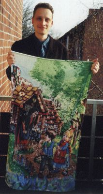

\
\

==================

\
\

Te audi plu MP3-dokumenta, tu pote gene u Real-Player mero-programa pro
tu inter-reti lekto-programa ex [{width="88"
height="31"}](http://www.real.com/player/)
[RealNetworks](http://www.real.com/player/).

------------------------------------------------------------------------

\

Turisti Ofici
-------------

 W. Ashby, R. Clark\

(Dialogi. Textu e voka: Wendy Ashby, Ronald Clark; Richmond U. K., 1990.
Plu Glosa-autori mu-auto! Sed mu habe English akcento.

**Text:**

  ------------- -----------------------------------------------------------------
  Turisti:      *Boni mana!*

  Ofici-fe:     *Boni mana, Sinior. Qe mi pote auxi tu?*

  Turisti:      *Ja, place. Mi volu info. U-ci es na proto visit a London. Qe tu
                pote auxi na elekti un hoteli?*

  Ofici-fe:     *Ja, sura.*

  Turisti:      *Tu proposi qo-ra?*

  Ofici-fe:     *Bene, u River Hotel es fo bene ge-loka pro plu vide valu ra e
                boteka. Alo u Town Hotel es ge-loka in centro pro plu boteka e
                teatra. Ci es plu pusi bibli de ambi hoteli.*

  Turisti:      *Gratia \... (lekto) \... m \... Ja, u River Hotel feno boni.*

  Ofici-fe:     *Boni. Tu habe qo nima, place?*

  Turisti:      *Sinior Müller.*

  Ofici-fe:     *Ah, qe ex Deutschland?*

  Turisti:      *No, mi veni ex Wien, Österreich.*

  Ofici-fe:     *U kali civita! Mi pa (habe) libe-tem la tri anua retro. Nu,
                qanto persona, Sinior?*

  Turisti:      *Bi matura-pe e bi infanti.*

  Ofici-fe:     *E qanto nokti?*

  Turisti:      *Deka nokti. Semi-pensio.*

  Ofici-fe:     *Boni. Deka nokti: kli, mana e vespera vora. Qe ko dusca alo
                balno?*

  Turisti:      *U dusca, place.*

  Ofici-fe:     *E ci es tu plu tena-bileta, Sinior.*

  Turisti:      *Gratia. E qe tu habe u strata carta de urba?*

  Ofici-fe:     *Ja, u-ci es gratis. Na habe, plus, u bibli; qi inklude plu carta
                de trena, tubi e bus. Id inklude pluso info de plu navi-viagia,
                teatra, boteka, musea e plu hetero vide-valu-ra in peri-lo.*

  Turisti:      *Ah, u-la es fo funktio. Qanto u toto, place?*

  Ofici-fe:     *1.95 Pound.*

  Turisti:      *Qe tu pote kambio u deka Pound bileta?*

  Ofici-fe:     *Ja, Sinior. Zero problema. Ci es tu versi-valuta.*

  Turisti:      *Gratia. O, mi habe mo fini qestio: Qo-lo es un hoteli?*

  Ofici-fe:     *Ah, ja. Id es facili de detekti. Ki a fini de u-ci strata, torna
                laevo a plu lumi-signali. Poi, id es in furka bi dextro ultra
                eklesia.*

  Turisti:      *Gratia de tu auxi.*

  Ofici-fe:     *Es nuli. Mi spe; ke vi fu habe un hedo libe-tem. A re-vide,
                Sinior.*

  Turisti:      *Mega gratia. A re-vide.*
  ------------- -----------------------------------------------------------------

Place klik 
[ci](../dat/audi01.mp3) te audi (MP3-dokumenta, 2 minuta 43 sekunda, 158
kB).

\

------------------------------------------------------------------------

Tri Ursus
---------

 R. Gaskell\

(U proto de infanti histori. Textu e voka: Robin Gaskell, Cabramatta,
Australia. Ko pusi English akcento. Tu pote merka u sko-kaseti ex Robin.
Vide [cefa-pagina](index_nexu.html) pro nexu ad an inter-reti pagina.)

**Textu:**\
*Mo kron, intra u mega foresta pa es tri ursus. Mu habita u dekora domi
intra u pusi klara, sed holo peri u domi pa habe plu dendro. Ki apo u
domi, u steno via pa duce inter plu dendro.\
Singu matina, u matri ursus pa kuko pulsa pro mu prima vora. Sed freqe,
u ge-kuko pulsa pa habe mega tro termo pro plu ursus te vora, e mu pa
nece atend id gene sati tepido.\
U-ci di pa eqa tal u di, \...\
*

Tu pote lekto un holo histori in [Pusi Textu-Kolekti](../en/gtexte.htm).

Place klik 
[ci](../dat/audi02.mp3) te audi (MP3-dokumenta, 53 s, 52 kB).

\

------------------------------------------------------------------------

Grama
-----

 Johannah, Suzannah, Barbara Jo and Gary Miller\

(U ge-dice grama. Textu e voka: Gary R. Miller, Mandan ND, USA, 2001.)

**Textu:**\
*Ave, Marcel,\
Ci es bi kanta pro tu. Mi spe; plu Glosa soni es korekti. Mi pa vide plu
hetero ra de Glosa soni. Pluso-co mi ne habe boni instrumenta pro
registra soni. Sed na spe, u-ci kaseta fu es sufice a tu.*

Place klik 
[ci](../dat/audi03.mp3) te audi (MP3-dokumenta, 27 s, 27 kB).

\
\

Pusi Astro
----------

(Infanti-kanta. Plu verba ex G. Miller. Plu voka: Johannah (eva 10 anua)
e Suzannah (7) Miller, Mandan ND, USA, 2001)

**Textu:**\
*Pusi astro, qo-ra es tu;\
Qi nu foto tem u noktu,\
Homo kali adamanta?\
Tu ne dice, so na kanta:\
Pusi astro, qo-ra es tu;\
Qi nu foto tem u noktu?*

Place klik 
[ci](../dat/audi04.mp3) te audi (MP3-dokumenta, 37 s, 36 kB).

\
\

Rubi Fluvi Vali
---------------

(Rura kanta. Plu verba, voka e gitara: Gary R. Miller, Mandan ND, USA,
2001)

**Textu:**\
*1. Ab na vali - mu dice - tu fu ki.\
Na fu este u minus de tu,\
Ka - mu dice - ne es heli-foto\
Po-kron tu ki ab vali e mu.\
\
rekanta: Si tu amo mi, kron sedi ko mi.\
Nuli vale ex tu fu es gru.\
Sed sti memo de na fluvi vali\
E de bovi-an; qi amo tu.\
\
2. O, mi longi-tem puta, mi karo\
De pan verba; tu ne dic a mi.\
Sed pan mi spe nu gene no-feno,\
Ka - mu dice - tu ki ab fu-di.\
\
3. Mu fu fune mi sub la; tu gresi,\
Sub la buno, la flori es su,\
Po-kron tu fu es ab fluvi vali,\
Ka mi ne pote es minus tu.\
*

Place klik 
[ci](../dat/audi05.mp3) te audi (MP3-dokumenta, 128 s, 125 kB).

\
\

Kosmo Glosa
-----------

\

(Glosa-himno. Textu ex Wendy Ashby, © Richmond GB, 1994, musika e voka:
Gary R. Miller, Mandan ND, USA, 2001/2002)

**Textu:**\
*Panto-pe panto-lo pote uti Glosa:\
Panto landa civi de panto nati-lingua.\
In panto domi panto-lo, ofici e fabrika.\
Panto-pe dic: Glosa es pro Gaia komunika.*

(Plu seqe poesi-mero ne in MP3-soni-dokumenta:\
*2. Id dona interese a panto bon konversa. Poli civi dice id in Afrika e
Asia. In trena, navi, aeroplan, panto speci vaga, pe audi Glosa
panto-lo, id eko peri Gaia.\
3. Gru ad ali puta-me, poesi e musika, panto tema, panto-lo, Glosa don
service. Dice, lekto, audi id tem sporta e relaxa, Glosa es u maxi bon a
fluvi, bun e saxa.\
4. Glosa es u nece-ra. Un universa lingua. Fu doci sani panto-lo e paci
e eduka. Glosa pote proba ultra pan limita. Stop u lingua frustra: sti
kosmo komunika.*)

Place klik 
[ci](../dat/audi07.mp3) te audi (MP3-dokumenta, 42 s, 42 kB).

\
\

------------------------------------------------------------------------

Henzel e Gretel
---------------

(Sumari de fabula; qi pa gene dice ex plu fratri Grimm. Glosa e voka:
Marcel Springer, Hamburg, Germany, 2002)

 M. Springer ko sika-te\

**Textu:**\
*Plu infanti Henzel e Gretel pa konfusi gresi in silva. La id pa es
skoto e frigo, e mu ne habe sito. U-la-tem mu detekti u domi; qi es
ge-face ex plu biskokta. In domi u magika-fe eko. Fe pseudo; fe es
gluko. Sed veri, fe volu fago u ju-an Henzel e volu habe Gretel homo
dulo-fe. Sed Gretel bali magika-fe ad-in piro in piro-me. U magika-fe
morta e plu infanti es ge-salva.*

Place klik 
[ci](../dat/audi06.mp3) te audi (MP3-dokumenta, 55 s, 54 kB).

\
\

------------------------------------------------------------------------

[www.glosa.org](../index.html), 2001-03-10, ultima muta 2018-06-18
