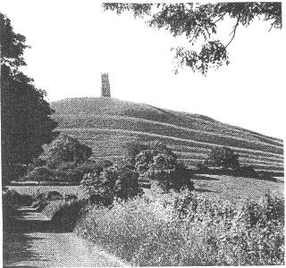
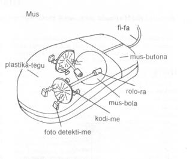
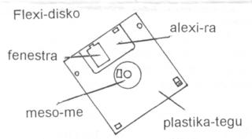

  
  

## Energi pro Futura

U developo de energi-ma-celu teknologi nu-du tako avanti in Islanda.

Islanda habe u skema de es landa mo de munda qi ne uti oleo. Per uti
hidro e geo-termo dina, u-ci nesia tende muta ad hidrogena ge-basi
ekonomi.

Tem 1784, in austro mero de u nesia, 130 vulkani longi Laki fisu pa bali
ex plu fo mega qantita de lava -- sati lava de tegu 565 qadra kilometri
de tera. Seqe-co, ma de tri su tetra de plu hipo e ovis pa lose bio; e
plu vulkani cinera e sulfuri fumi pa sti noku fito- e humani-bio. Pe
tako pa prepara skema te kine plu survive-pe a Danmark; anti-co, u-ci ne
pa acide. Vice-co, plu persona pa gene sko de uti plu fo paleo dina de
mu nesia -- plu vulkani e glacia-potami -- a mu maxi pote. Nu-di, u
Boreo Atlanti nesia gene mega profito ex geo-termo e hidro dina.

Nona ex deka domi nu es ge-nexu a geo-termo termo-sistema per plu tele
termo-tubi e per plu proxi hidro-fonta. Plu demo fru plu ge-termo
nekto-lo e vitri-do. U vitri-do industri pa kresce; pe kultiva plu
tomato e plu hetero salata-fito plus plu flori. E pe klu kultiva plura
tropika frukti; exempla plu banana. Es plus-co, ge-termo pedi-via e
vagona parka-lo. Nu-di, 67% de un energi ge-volu epi nesia veni ex plu
re-neo-abili fonta.

Proxi hemi de u landa demo eko in urba mero de Reykjavik; u-ci es u duce
urba de Islanda. U nima Reykjavik singnifi, "Baia de Fumi". Simi poli
duce urba in hetero landa nu es poli vagona la; tri ex tetra persona nu
habe u vagona; e seqe-co, un urba sufere de poluti.

Plu libe-filo-pe de Islanda pa du dice de vice plu oleo importa ko
plu-la de loka energi-ma fonta. U seqe, es de krea un ambienta-ami,
hidrogena ge-basi ekonomi qi ne pende ex plu extra-landa fonta.
Geo-termo e hidro-elektro dina domi produce elektro, qi gene-uti de
dekomposi hidro per elektrolisi ad in id plu komponi mero. Un hidrogena
ge-produce per-co, pote gene uti pro vagona energi-ma.

Un Ekologi Urba Vagona Sistema (EUVS) pa gene establi te proto un
hidrogena ge-basi ekonomi. Tem 2003 mu tende proto uti tri hidrogena
energi-ma busa in Reykjavik. Ex Mars 2001 u grega ge-duce ex EUVS
duce-pe Jon Bjorn Skulason du skema u nece infra struktura -- un
elektrolisi-pote e un hidrogena ple-statio. U DaimlerChrysler
mero-komercia ge-nima MTU Munchen e u komercia Norsk Hidro kon-ergo in
u-ci projekti.

EUVS akti ne solo plu examina pro plu hidro energi-ma busa, plus-co, id
es u recerka e monstra projekti qi analisi plu ambienta problema e metri
plu ekonomi-valu e metri u cepti de plu demo.

Fini, panto-pe in Islanda este fo pro uti u publika transporta sistema
qi ne bali ex karboni dioxide.

U krati nu du ergo te introduce plu energi-ma-

celu vagona; qi fu kine per alo hidrogena alo metanoli (methanol).
Iso-tem, un infrastruktura nece gene adapta de uti plu neo speci
energi-ma.

Plu piski-navi grega es fo gravi pro id landa ekonomi; anti-co, id uti
plu mega qantita de petroleo ge-face-ra; seqe-co, pe nu demanda de vice
plu piski-navi ko plu energi-ma celu ge-kontrolo sistema.

Kon id 276,000 eko-pe e simpli infra struktura, Islanda es u gru
"experimenta mikrokosmo" pro un hidrogena ge-basi ekonomi. Seqe-co, id
pote akti u gravi mero te introduce u-ci teknologi a plu hetero landa
peri munda. Si panto-ra progresi akorda id skema, Islanda ne fu habe
nece de gasoline alo diesel energi-ma po 2030 alo 2040. U-la kron Island
fu habe sati energi-ma pro holo nece epi nesia.

Veri, u "Nesia de Piro e Glacia" posi fu pote exporta hidrogena
energi-ma. E plus-co, plu-la industri-landa qi a-nu doxo id es no-facili
de muta a re-neo-abili energi-ma fu gene sko ex un exempla de Islanda.

  

  

### U lingua de Islanda

Island es ge-loka in Boreo Atlanti Oceani; austra de un Arktika Ciklo.
Id tegu 100,000 qadra kilometri; e es u numera bi maxi mega nesia in
Europa. Kausa de id geografi lisi; Islanda pa tena u lingua qi es simi
u-la de Nederlanda lingua e Boreo Germani. U lingua es fo gravi a
kultura de u landa; seqe-co, plu demo tena id iso natio auto-lauda. Mu
fo alexi mu lingua; e un idio akademi grega pa gene establi tende
detekti plu Islanda-lingua lexi pro plu-la internatio ge-ski lexi;
exempla: puta-me, mobili-telefono, etc.; mu ne volu id ge-grafo lingua
inklude plu lexi de Englanda -lingua.

Cirka 260,000 persona dice Islanda-lingua. Id pa eske un oficio
matri-lingua kron Islanda pa gene no-depende ex Danmark tem 1944. U
Danmark-lingua es lingua-bi de poli Islanda-pe. Un Islanda-lingua pa
muta fo pusi; seqe-co, plu persona dura pote lekto plu paleo

  

\- pagina 2: -

  

stori (*Saga*); e plu-ci stori pa gene grafo ma de 700 anua retro.
Plura-pe nima u lingua "Latino de u Boreo".

Id es u fo komplexi lingua; e plu-la persona ultra boreo Europa detekto
id fo no-facili de gene sko . Un alfabeta tena 34 litera; id inklude plu
hetero vokali e konsonanta. Ci es oligo Islanda lexi:

  

|             |           |               |              |
| ----------- | --------- | ------------- | ------------ |
| **Islanda** | **Glosa** | **English**   | **Deutsch**  |
| Já          | Ja        | Yes           | Ja           |
| Nei         | No        | No            | Nein         |
| Dag         | Di        | Day           | Tag          |
| Í dag       | Nu-di     | Today         | Heute        |
| Á morgun    | Fu-di     | Tomorrow      | Morgen       |
| Takk        | Gratia    | Thank you     | Danke        |
| Einn        | Mo        | One           | Ein          |
| Tveir       | Bi        | Two           | Zwei         |
| Prír        | Tri       | Three         | Drei         |
| Gjá         | Fisu      | Rift, fissure | Spalte       |
| Eyja        | Nesia     | Island        | Insel        |
| Reykja      | Fumi      | Smoke         | Rauch        |
| Flúgvöllur  | Aeroporta | Airport       | Flughafen    |
| Simi        | Telefono  | Telephone     | Fernsprecher |

  

  

## Komerci inter UK e Benelux

Plura komerci-pe posi este anxio de proto exporta. Sed per exporta mu
pote sti kresce mu komerci e sti ma mega mu in-valuta. Plu "Proto
Merka-lo" pro plu komerci-pe in UK es plu-la in plu Benelux landa --
Belgie, Nederlanda e Luxembourg. Un UK du vendo ma a plu Benelux landa
de a USA.

  

### Belgie

Belgie es u boni merka-lo pro plu neo UK exporta-pe. Id habe fo boni
transporta nexu pro ambi plu persona e pro plu merka-ra. Anti-co, un UK
komerci-pe nece habe ski de oligo lingua. Flanders es u maxi pluto mero
u-la landa; e poli komerci-pe logi un Englanda-lingua. Anti-co, un UK
komerci-pe ne debi uti solo auto lingua. Id es ma sofi e ma profito de
grafo plu preci-lista in plu Euro; e de grafo plu hetero firma
literatura in plu loka lingua.

In Belgie es tri oficiali lingua. Cirka 60% u demo dice
Nederlanda-lingua, 40% dice France-lingua, e oligo demo in austro Belgie
dice Deutsch. In Flanders, un oficiali lingua es Nederlanda; sed poli-pe
la uti English in mu komerci-dice e in plu komerci-grama. In Wallonia
regio pe dice France-lingua e ne poli komerci-pe la uti alo logi
English. Brussels es un oficiali bi-lingua regio de Belgie; u maxi
numera persona qi eko la dice France-lingua; anti-co, ma mega numera
komerci-pe qi logi e uti English nu du kresce.

  

### Nederlanda

Pe plu-kron nima Nederland "u Porta ad Europa"; u-ci es kausa de id fo
boni transporta sistema e distribu nexu a plu maxi gravi ekonomi centra
de Europa. Maxi numera Nederland-pe pote logi English; e mu hedo uti id
ko plu komerci-pe. Anti-co, id es nece pro UK komerci-pe de habe loka
representa in singu merka-lo. Mu nece prepara mu proto literatura fo
boni e tekno; e grafo id in Nederlanda-lingua.

  

### Luxembourg

Luxembourg ne gene iso mega publika de plu hetero Benelux landa; posi
kausa id es u fo pusi landa. Anti-co, plu Luxembourg komerci-pe este fo
interese de expande mu merka-lo. Id es u fo pluto landa; e id ofere poli
speci merka-ra qi habe fo boni qalita.

Id es solo bi horo vagona-viagia ex Brussels a Luxembourg; seqe-co, plu
exporta komerci-pe pote facili visita ambi mu Belgie e Luxembourg
merka-pe tem un iso di. E un exporta-pe habe un hetero profito; u maxi
numera komerci-pe in Luxembourg dice English, France-lingua, Deutsch e
Letzebuergesch.

  

  

## Plu Grama e Nova

Poli gratia pro plu grama e de plu pikto-karta ex tu libe-tem viagia
u-ci anua; id es fo gluko de ski; tu amo uti Glosa; e dura ergo in poli
speci mode de dura avanti na internatio lingua.

Gratia plus a plu-la ami qi pa konsili mi de plu puta-me problema. Per
kripto kausa; oligo programa pa ki ab ex mi dura disko-me. Mi
flexi-disko-me dura habe mekani problema; e ka-co id ne funktio. Mi nu
fu merka neo-ra; e po-co, mi fu pote apri e uti plu-la dokumenta epi mi
plu flexi-disko; e ma-gravi, mi fu pote stora pan ergo epi flexi-disko.
Boni-fortuna; Rainer, mo krati-pe de GEO, nu-pa re-stora “Word 2000” per
kompakti-disko; seqe-co, na pote uti u-ci programa itera pro PGN.

  

  

### Glastonbury

Mi plus pa fru u brevi libe-tem u-ci termo-tem. Proto Septembra mi pa
spende septi fo hedo di in viki de Glastonbury, Somerset in austra-ocide
mero UK. Id es u fo kali rura regio; e boni fortuna, pro mi; un helio pa
brilo forti singu di.

U pa histori de Glastonbury es ge-nexu ko Tor; qi domina u viki. U Tor
es u famo naturali kolina; id habe auto idio e sti mira koni forma; qi
pa gene face per kombina de plu geologi, agrikulti e religio aktivi. Id
alti es 155 metri supra mari libela.

  

\- pagina 3: -

  

Pre poli anua, posi tem Centi Anua Nona; pe pa tekto u domi-fa qi pa es
u monako-do epi akro de u Tor. Nu u solo mero u-ci monako-do qi existe
nu es u religio-do turi qi pe pa tekto tem Centi Anua Mo-tetra. Es poli
pa-stori de fantasi, misteri e de plu spiritu e Kelti histori tema de
u-ci regio; mu inklude plu-la de Joseph de Arimatea -- ko Sankti Kalici
qi pa tena un hema de Kristo, de Gwynn un an-fili de Nudd, Regi de
Faeri, Regi Artur e Guinevere, de Merlin e de u Nesia de Avalon.

Glastonbury es cirka 29 kilometri ab mari epi orienta margina de
Somerset. Pre poli anua u-ci baso e plati mero tera pa es u fo mega
paluda; e pre u-la tem; id pa es un epi-tera mari ge-limita per plu
*Mendip* Kolina a boreo e u *Polden* Kresta ad austra. E mo tem id pa es
u nesia ge-nima, U Nesia de Avalon, alo "*YnisWitrin*" u-ci pa signifi
"Nesia de Vitri". U nesia pa es ge-nexu a tera per fo steno mero tera ad
orienta kosta. Un in-via ad u nesia pa es per mero alti-tera plus para
steno-vali; pe nu nima id "*Ponter Ball*". Un ur-nima "*Pontus Vallum*"
posi pa gene nima kausa de plu ponti qi pa kruci u tera-tekto ex plu
Romani tekto-pe e plu medi-eva tekto-pe.

Bi di singu Juli poli kilo viagia-pe de hetero speci religio veni e unio
kon alelo; mu preka a Teo in Religio-do de *Glastonbury Abbey* – mo de
plu maxi paleo religio proto-lo in Britani.

Nu-di tem holo anua poli persona visita Glastonbury; poli mu; simi mi,
ki la kausa mu este u fo dina volu de visita u-la topo; te experie id
magiko-trakto. Mi pa gresi ana u Tor; e pa fru u puri aero, u natura e
plu kali vista.

U maxi mega trakto-lo pro mi es *Challice* *Well Gardens*(Plu Horti de
Kalici Putea). Pe pote relaxa ci; tem este plu odoro e kali de plu
flori, e dendro; tem audi avi-kanta plus u gentili aqa-flu ex plu fonti;
e este sani tem gusta alo balni plu pedi e manu in plu terapi-aqa. Id es
u fo splendi-lo; e id es mo de mi maxi ge-amo loka. Veri, mi Septembra
visita la pa es u maxi hedo setimana de mi holo bio. Gastonbury es u fo
spiritu e sti mira loka; e pro mi; id pa es kaso de visita u gru loka a
gru tem de mi bio. Si tu este interese; tu pote visita tri-ci Inter-reti
eko-lo:

info: [www.chalicewell.org.uk](http://www.chalicewell.org.uk)

[www.glastonburyabbey.com](http://www.glastonburyabbey.com)

[www.glastonbury.co.uk/tic](http://www.glastonbury.co.uk/tic)

  

### Glosa e Inter-reti

U numera de plu Glosa-ami komunika per E-posta e Inter-reti dura kresce.
Nu es plu hetero Inter-reti eko-lo; per-co pe pote lekto poli speci
Glosa textu e Glosa lexi-lista.

U boni proto-lo es Inter-reti eko-lo: [www.glosa.org](../index.html)

Mi es fo hedo de vide u-ci avanti; id es fo boni; anti-co, ex u-ci
avanti; feno es oligo speci de Glosa-grafo. Exempla,mi nu du gene plu
grama e artikla qi uti oligo lexi qi ne existe in Glosa\! U-ci raro pa
acide kron na publika pa es solo per vendo e distribu de plu bibli. Pa
du es oligo muta a Glosa lingua e vokabulari ex publika de plu proto
Glosa verba-bibli; e pe facili pa adapta a plu-ci pusi muta.

Ci es bi freqe ero. Mo lexi qi feno re-veni es “ke”. U-ci pa es in plu
paleo Glosa bibli. Na pa sto uti id po publika PGN 50 tem 1990. Id ne es
in “Glosa 6000” ,“Central Glosa”, ali in“18 Steps”; e mi ne ski u kausa
id nu-pa re-veni.

Vice-co, na uti u semi-kolon (;). U semi-kolon es fo funktio; id divide
un artikla ad in plu frasi.

Te translati un English frasi: I think *that*…., Francais: Je crois
*que*… alo Deutsch: Ich denke *dass*…. na ne grafo u lexi pro *that,
que* alo *dass.*

Na grafo: Mi puta;….

We think that Glosa is an easy language.

\= Na doxo; Glosa es u facili lingua.

In English tako-dice; pe freqe ne dice “that”. Exempla; na freqe dice:

I think he will come. In Glosa = Mi doxo; an fu veni.

Oligo persona nu ero uti *plu-mu* e *plu-tu*. Mu pa proto ero uti: U-ci
es *u-tu* bibli

U-mi = mine. Plu-mu = theirs. Plu-tu = yours.

This book is yours =U-ci bibli es u-tu.

It is yours = Id es u-tu.

It is your book = Id es tu bibli.

  

  

  

## 18 Gradu epi Inter-reti

Gratia a Sr. Marcel Springer in Deutschlanda pe nu pote vide plu mero de
“18 Steps to Fluency in Euro-Glosa” per Inter-reti. E plus-co, an pa
translati mero u-ci stude bibli ad in Deutsch; “18 Schritte zu
fließendem Euro-Glosa”.

Gratia a Ruski-ami Sr. Alexander Kirpichev na nu habe proto mero 18
Gradu in Ruski.

Eko-lo de English versio:

[http://www.glosa.org/en/g18s.htm](../en/g18s.htm)

Eko-lo de Deustch versio:

[http://www.glosa.org/dt/g18s.htm](../dt/g18s.htm)

Eko-lo Ruski versio es:

<http://www.glosa.org/bervi/ru18s.htm>

Mu es solo u ge-brevi versio de ur-18 Gradu bibli; anti-co tri-ci
Inter-reti bibli fu auxi plu neo doci-pe e stude-pe de Glosa.

Ci es mero ex Deutsch; ex gradu 8, pagina 39

  

  

### Das Haus – ein paar Phrasen / Wendungen

|                         |                                          |
| ----------------------- | ---------------------------------------- |
| Merka / vendo tu domi   | dein Haus kaufen / verkaufen             |
| Eko in neo domi         | in ein neues Haus umziehen (in...wohnen) |
| Prende un hipoteka      | eine Hypothek aufnehmen                  |
| Tem-habe u domi         | ein Haus mieten                          |
| Proprie-pe.             | Eigentümer.                              |
| Tem eko-pe              | Mieter                                   |
| Domi-fe                 | Hausfrau                                 |
| Brosa kuko-ka pedi-lo   | den Küchenboden fegen                    |
| Sistema u sedi-ka       | das Wohnzimmer aufräumen                 |
| Puri u tape             | den Teppich saugen                       |
| In ante-ka              | im Vorderzimmer                          |
| poste-ka                | Hinterzimmer                             |
| Ki ana / ki kata        | nach oben / unten gehen                  |
| Klavi u porta           | die Tür verschliessen                    |
| No-klavi u porta        | die Tür aufschliessen                    |
| Klude / apri u fenestra | das Fenster schließen / öffnen           |

  
  
  

\- pagina 4: -

  

*... In ge-printa PGN, sed minus in u-ci HTML-versio: "Tri Andro in
Navi" ex Jerome K. Jerome ("Three Men in a Boat") "Drei Mann in einem
Boot", Glosa-Deutsch paraleli textu, vide
[www.glosa.org/dt/g18s.htm](../dt/g18s.htm#S16). ...*

  
  
  

\- pagina 5: -

  

*... In ge-printa PGN, sed minus in u-ci HTML-versio: mero de ruski "18
Gradu", vide [www.glosa.org/brevi/ru18s.htm](../brevi/ru18s.htm#S2).
...*

  
  
  

\- pagina 6: -

  

## Teknologi-Glosa

U neo interese de plu Inter-reti Glosa ami pa gene proto per Sr. Kevin
Smith in USA. Kausa tem ergo singu di an nece uti poli teknologi lexi;
Kevin fo volu habe u lexi-lista. An pa proto grafo u lista; e publika id
per Inter-reti; plus-co, an nu pa petitio auxi e info de id.

Profesora Hogben pa lose bio pre plu mega avanti de plu puta-me; e pre u
nati de Inter-reti. Anti-co, an pa pre-vide u veni e u gravi de plu
puta-me. An pa este sura; u Glosa lexi-lista pote es sati gru pro panto
neo lexi de puta-me lexi-lista.

Ron Clark pa es fo interese de plu puta-me; e pa emfasi id gravi;
supra-toto pro internatio-eduka, e komunika; e pro ma tako avanti de
Glosa. Mali-fortuna, un iso tem de u fo tako avanti de Inter-reti; Ron
pa du lose an boni sani; e an pa proto ergo e puta ma-lento. Id es solo
nu; na logi u metri de u-ci retro-gresi.

Anti-co, Ron pa proto grafo u teknologi lexi-lista; e ci es u-la lista.
Simi Kevin; na sio amo gene plu idea e auxi de grafo e expande u seqe
lista.

  
  

|              |                |
| ------------ | -------------- |
| **English**  | **Glosa**      |
| Hard drive   | Dura disko-me  |
| Floppy drive | Flexi disko-me |
| Compact disc | Kompakti disko |
| Floppy disk  | Flexi disko    |
| Plastic case | Plastika tegu  |
| Disk guard   | Disko alexi-ra |
| Hub          | Meso-me        |
| Locked disk  | Ge-klude disko |

  
  

<table>
<colgroup>
<col style="width: 50%" />
<col style="width: 50%" />
</colgroup>
<tbody>
<tr class="odd">
<td>Corrupt disk</td>
<td>Ge-noku disko</td>
</tr>
<tr class="even">
<td>Chip</td>
<td>Mika</td>
</tr>
<tr class="odd">
<td>Hardware</td>
<td>mekani</td>
</tr>
<tr class="even">
<td>Software, programme   </td>
<td>Programa</td>
</tr>
<tr class="odd">
<td>Run a programme   </td>
<td>Uti u programa</td>
</tr>
<tr class="even">
<td>Modem</td>
<td>Modem</td>
</tr>
<tr class="odd">
<td>Desk Top Publishing   </td>
<td>Tabla publika</td>
</tr>
<tr class="even">
<td>Keyboard</td>
<td>Klavi-taba</td>
</tr>
<tr class="odd">
<td>Key in</td>
<td>Klavi in</td>
</tr>
<tr class="even">
<td>Upper case</td>
<td>Plu mega litera</td>
</tr>
<tr class="odd">
<td>Lower case</td>
<td>Plu pusi litera</td>
</tr>
<tr class="even">
<td>Alt key</td>
<td>Alt klavi</td>
</tr>
<tr class="odd">
<td>Control key</td>
<td>Kontrola klavi</td>
</tr>
<tr class="even">
<td>Mouse</td>
<td>Mus</td>
</tr>
<tr class="odd">
<td>Mouse mat</td>
<td>Mus tape</td>
</tr>
<tr class="even">
<td>Mouse button</td>
<td>Mus butona</td>
</tr>
<tr class="odd">
<td>Left / right</td>
<td>Laevo / dextro</td>
</tr>
<tr class="even">
<td>Light detector</td>
<td>Foto detekti-me</td>
</tr>
<tr class="odd">
<td>Curser</td>
<td>Indika-ra</td>
</tr>
<tr class="even">
<td>Click, press</td>
<td>Piezo</td>
</tr>
<tr class="odd">
<td> </td>
<td>Klik (onomatopoeia) 
 </td>
</tr>
<tr class="even">
<td><strong>English</strong></td>
<td><strong>Glosa</strong></td>
</tr>
<tr class="odd">
<td>Drag</td>
<td>Trakto</td>
</tr>
<tr class="even">
<td>Monitor</td>
<td>Monito-me</td>
</tr>
<tr class="odd">
<td>Screen</td>
<td>Skuta</td>
</tr>
<tr class="even">
<td>Speaker</td>
<td>Audi-me</td>
</tr>
<tr class="odd">
<td>Scanner</td>
<td>Skana-me</td>
</tr>
<tr class="even">
<td>Flatbed scanner</td>
<td>Plati skana-me</td>
</tr>
<tr class="odd">
<td>Drum scanner</td>
<td>Kilindra skana-me</td>
</tr>
<tr class="even">
<td>Power / speed</td>
<td>Dinamo / tako</td>
</tr>
<tr class="odd">
<td>Data base</td>
<td>Data basi</td>
</tr>
<tr class="even">
<td>Work station (desk)</td>
<td>Ergo-mo</td>
</tr>
<tr class="odd">
<td>Printer</td>
<td>Tipo-me</td>
</tr>
<tr class="even">
<td>Load the paper</td>
<td>Loka u papira in</td>
</tr>
<tr class="odd">
<td>Digital</td>
<td>Digi</td>
</tr>
<tr class="even">
<td>Analog</td>
<td>Analogi</td>
</tr>
<tr class="odd">
<td>Memory</td>
<td>Memo-me</td>
</tr>
<tr class="even">
<td>Internet</td>
<td>Inter-reti</td>
</tr>
<tr class="odd">
<td>Network</td>
<td>Reti</td>
</tr>
<tr class="even">
<td>Web site</td>
<td>Inter-reti eko-lo</td>
</tr>
<tr class="odd">
<td>Home page</td>
<td>Duce-pagina</td>
</tr>
<tr class="even">
<td>Server</td>
<td>Servi-pe</td>
</tr>
<tr class="odd">
<td>User/ end user</td>
<td>Uti-pe</td>
</tr>
<tr class="even">
<td>Make back up</td>
<td>Face kopi-bi</td>
</tr>
<tr class="odd">
<td> </td>
<td>  (alo Face sekuri kopi)</td>
</tr>
<tr class="even">
<td>Send E-mail</td>
<td>Bali E-posta</td>
</tr>
<tr class="odd">
<td>Receive a fax</td>
<td>gene u fax</td>
</tr>
<tr class="even">
<td>Start / stop</td>
<td>Sti / sto</td>
</tr>
<tr class="odd">
<td>Up-grade the system   </td>
<td>Ma-dinami u sistema</td>
</tr>
<tr class="even">
<td>Format a disk</td>
<td>Formati u disko</td>
</tr>
<tr class="odd">
<td>Open / close a window   </td>
<td>Apri / klude u fenestra</td>
</tr>
<tr class="even">
<td>Main window</td>
<td>Duce fenestra</td>
</tr>
<tr class="odd">
<td>Sound card</td>
<td>Soni-karta</td>
</tr>
<tr class="even">
<td>Record</td>
<td>Registra</td>
</tr>
<tr class="odd">
<td>Save a file</td>
<td>Salva u dokumenta</td>
</tr>
<tr class="even">
<td>Tutorial</td>
<td>Doci-programa</td>
</tr>
<tr class="odd">
<td>Desk top</td>
<td>Grafo-mo</td>
</tr>
<tr class="even">
<td>Delete</td>
<td>apo</td>
</tr>
<tr class="odd">
<td>Find and replace   </td>
<td>Cerka e vice</td>
</tr>
<tr class="even">
<td>Password</td>
<td>Kripto-nima</td>
</tr>
<tr class="odd">
<td>Tool box</td>
<td>Ru-teka</td>
</tr>
<tr class="even">
<td>Text frame</td>
<td>textu-qadra</td>
</tr>
</tbody>
</table>

  
  

\- pagina 7: -

  

## Plu Mega Litera

Mi fo amo PGN 85; id es fo interese. Na nece publika poli-speci Glosa
lekto-ma.

Il es multi persona qi du no-ski u Romani alfabeta; e plu de mu no-ski
klu plu mega litera. Exempla: plu Hindi-pe ne uti plu mega litera.
Probabli oligo-pe doxo; na es stupidi de uti mu. E mu ne fu logi u
kausa; na nece uti plu mega litera in Glosa. Ka-co, oligo mu posi ne fu
amo gene ski de Glosa. Veri na ne nece habe mu in English\! Qe pe dura
uti plu mega litera in English alo Francais pro plu nima de plu di, plu
meno, plu persona-nima etc.?

Mi ma amo; ne uti mu. Mi sugesti; na apo plu mega litera ex Glosa; so u
stude-pe fu nece gene ski de solo semi numera litera.

Mi nu es aktivi kolekti plu mero de Glosa grafo ex Inter-reti e PGN.
Po-co, mi loka mu in puta-me programa; te numera qo-freqe singu lexi
gene uti. Fini, u-ci fu don a na un idea de plu maxi e mini ge-uti lexi
in na lexi-lista.

Poli saluta

Ex Sid Pidd,

Scarborough, England.

  

  

Karo Sid,

Poli gratia de tu grama; e gratia plus de tu dura auxi develop e difusi
Glosa.

Akorda\! U demanda pro ma mega qantita de Glosa lekto-ma dura kresce.
Veri es mega ergo avanti pro ali Glosa traduce-pe. Mi doxo; u ma
lekto-ma na habe, u ma tako Glosa fu avanti. Anti-co, na nece progresi
ko kura. Na nece ski; panto lekto-ma es tekno ge-grafo in boni Glosa. Pe
demanda ambi plu ge-traduce textu; e plus-co, plu ur-Glosa textu de poli
speci tema.

Na ne tende a-nu apo plu mega litera ex Glosa. Sura u-ci ne es u
problema tem dice; kausa kron mo persona no-logi ali frasi; un hetero
dice-pe es la te ma-klari u signifi. Sed tem lekto solo; si u lekto-pe
vide u mega litera meso frasi id posi fu es un auxi; e ne fu es u
problema. Mi puta u-ci es u proto kron na pa habe u-ci sugesti. Qe ali
hetero PGN lekto-pe este fo pro alo fo anti plu mega litera in Glosa? Si
ja, place grafo a mi.

U pa-Glosa auxi-pe, Sr. Reg Frank pa dona sko de plu tekno-tema in India
tem poli anua. An pa ski mega de mu no-facili de gene sko de English.
Kon an ski de oligo India lingua, Europa lingua e de Glosa an ne pa
doxo; Glosa pa es fo no-facili pro plu India-pe. Sura mu habe fo hetero
sintaxi de English alo Glosa.

Kron oligo persona proto de stude e uti Glosa mu plu-kron este u volu de
introduce oligo-ra qi es simi mu auto matri-lingua; ci es oligo exempla
qi pe pa petitio na uti in Glosa.

Ex Englanda-lingua; pe sugesti na uti –s
vice*plu*. Flower = flori. Flowers = plu
flori

Indonesia: grafo u lexi bi-kron. Exempla: bunga = flori bunga bunga =
plu flori

Francais: volu uti la, le e les vice *U*.

La tabla = U tabla. Les tables = plu tabla.

Deutsch: volu uti plu mega litera pro singu nima-lexi. Posi Sid; tu simi
na, ne akorda kon u-ci sugesti\!

Es plu hetero sugesti qi na pa dice de tem plu Glosa unio in Hampstead e
Richmond e per plu pre-PGN; e qi na pa decide ne uti. Anti-co, pa es
oligo boni sugesti; e po dice de mu, na pa proto uti mu. U duce ra pa es
fonetika ortografi de Glosa.

Poli-pe este hedo kron mu vide uno-ra in Glosa qi es komuni ko mu
matri-lingua. Exempla; plu India-pe este interese e hedo de u relatio
inter plu Latino e Greko lexi ko plu lexi ex Sanskrit lingua. Exempla:
YOGA

(signifi *juga ko Teo*) – Latino, Juga. Plus, Greko, Zigo = English
join. English Yoke = juga kon alelo.

Anti-co, id es no-sofi e no-posi de adapta Glosa te gru singu dice-pe de
u munda. Hogben e Clark pa tende face Glosa iso facili e iso universa de
posi. Mu plus-co, pa emfasi; Glosa nece avanti ko nu-di science e
teknologi.

U Romani alfabeta nu es fo boni ge-ski ultra Europa. Pe nece uti id te
grafo un eko-lo epi grama-ve; kron bali u grama ad ali-pe in Europa,
Australasia alo Amerika. Cirka penta centi Afrika lingua nu habe plu
lexi-bibli ge-grafo in Romani ortografo. Cina habe Pinyin – Romani
ortografi.

Ex veni de neo komunika teknologi e Inter-reti; plu Arabi e Cirili
ortografo-uti landa pa du stude plu hetero Europa-lingua; seqe-co, mu
boni ski u Romani alfabeta. Nu pe pote uti plu para puta-me klavi-taba;
qi habe u pote de sto Romani ortografo e sti a non-Romani ortografi.
Veri, es poli speci auxi-me pro ali internatio stude-pe qi cerka id.

  

  

  
  

## Vagona Komunika

Plu maxi boni sensi-me ne pote skope peri plu gono. E mu ne pote detekti
u mero de glacia epi vagona-via 500 metri avanti ab. Mu ne pote registra
u proto de vagona kongesti cirka mo kilometri avanti. Klu plu maxi neo
via-carta de plu naviga-sistema habe un eva de minimu sixa setimana.
Seqe-co, mu ne pote dona info de plu via-repara alo plu hetero disrupti
qi pa proto pa-di alo pa-setimana.

Solo direkti komunika ex vagona a vagona pote auxi solve u-ci problema.
Plu skience-pe in Komunika e Teknologi Departamenta de u DaimlerChrysler

Recerka Centra in Deutschlanda nu ergo te detekti u maxi boni solve. Mu
volu id fu sti ago u vagona ma sekuri e ma gluko. E mu volu sti ma mega
u “kampu de vista” de u vagona; dona id u pote de vide klu peri plu
kurva longi plu serpenti-via.

Mo projekti ergo de dona fo exakti info de u loka de u vagona. Info de
ali problema si id es de vagona kongesti alo no-funktio vagona in kurva
de via alo u mali-acide -- es uti-ple a plu hetero ago-pe solo si mu ski
un exakti loka de u-la problema vagona.

Nu pe uti plu satelita per GPS (Globa Positi Sistema). Anti-co, pe ne
panto-kron gene sati exakti loka indika. Posi si singu vagona uti u GPS
kodi-me u-la sio auxi; sed a nu u-ci habe u deviati de mo metri. Na nece
atende; a kron fu es ma-dinamo GPS satelita; alo posi u ge-skema GALILEO
satelita reti fu proto difusi plu direkti signali. Plu-ci fu dona u pote
de ski un exakti loka de oligo centrimetri; e plus-co, dona u-la info fo
tako; e seqe-co, auxi plu ago-pe reakti ma tosto.

  

  
  
  

\- pagina 8: -

  
  

*Enigma Pagina: place vide* [u pikto](../pic/pgn086_enigm.png)
