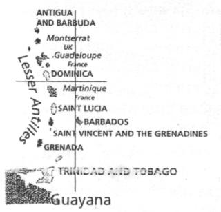
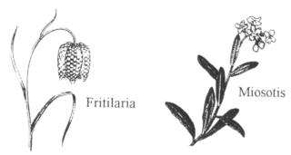
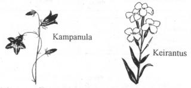
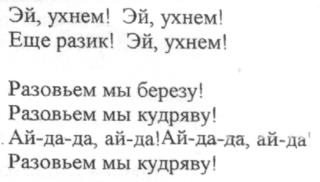
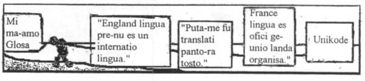
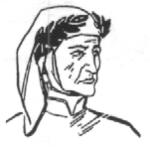
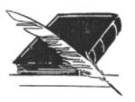

<table>
<tbody>
<tr class="odd">
<td style="text-align: center;"><h1 id="plu-glosa-nota-glosa-logo">Plu Glosa Nota </h1>
 
 
Published by Glosa Education Organisation (GEO) Reg. charity no. 298237 
P. O. Box 18, Richmond, Surrey, TW9 2GE Britain</td>
</tr>
</tbody>
</table>

  

|           |                               |                |
| :-------- | :---------------------------: | -------------: |
| Numera 87 | Decembra 2002 - Februari 2003 | ISSN 0265-6892 |

-----

  
  

## Plu Lingua In Englanda

Tem pre oligo meno plu nova-papira-pe e komerci-pe pa dice de u ski de
plu lingua in Englanda. Mega de u-ci dice; pa gene foku de doci de plu
lingua in plu lingua sko-do.

Tem meno bi, 2002, u grega de duce eduka krati-pe ex Deutschland,
France, Italia e Espania pa kon-petitio; u doci de plu lingua in
Englanda debi tako gene maxi ma-boni. Mo Deutsch krati-pe Hans-Friedrich
Von Ploetz, pa dice; “tu vendo in Europa e plu globa merkata – sed tu
no-freqe habe u pote de dice plu lingua de plu-ci merkata.”

U krati nu du skema u ma longi-tem kampania te doci plu lingua in plu
sko-do in Englanda. Plu eduka solve inklude u posi de internatio merita
e plu idio sko-do initiativi. Mo eduka-krati-pe Sr. Stephen Timms pa
dice; 141 lingua sko-do fu gene apri pre Septembra 2002; e te solve u
minus de plu lingua doci-pe in Englanda, na fu gene plu doci-pe ex
extra-landa.

Topo u dice de u-ci tema in House of Lords, Lord Williams Elvel pa dice:
“English ne es sati. Posi na doxo; English nu es u globa lingua; na nece
ski; plu hetero lingua plus-co, habe globa gravi. Exempla: na nu ski; es
maxi ma mega qantita de persona qi uti Inter-reti in non-English lingua
de English – plu maxi ge-uti lingua es plu-la de Cina. Plus-co, id es
klari de plu kulturi problema qi gene sti; si plu English-dice persona
doxo; mu solo nece ma alti-voci uti English ad ali-pe de ali landa.”

Sti ma boni u doci de plu lingua in plu sko-do es u longi-tem solve ad
u-ci problema. Plu-la komerci-pe qi vendo e merka ex extra-landa volu un
imedia solve. “Doci de plu komunika tema nece proto in sko-do; sed plu
komerci-pe nece plus-co, gene stimula de uti valuta in plu lingua servi;
e plu solve tende sti ma boni mu okasio de internatio sucede.

Plu-la ergo-pe qi ne pa gene ski de plu lingua tem mu juve-tem in
sko-do; nu pote uti plu servi de plu translati-pe, interpreti-pe e plu
multi-lingua Inter-reti eko-lo(website) designa-pe. Seqe-co, id nu es
posi pro ali komerci-pe in UK de uti plu lingua de mu extra-landa
merka-pe alo vendo-pe.

Plu-la komerci-pe qi uti plu multi-lingua Inter-reti eko-lo; fu habe
poli ma okasio de gene vide ex plu neo merka-pe de extra-landa. U boni
qalita Inter-reti eko-lo ko plu inter-aktivi okasio pote salve mega tem
e valuta; sed plu komerci-pe nece gene translati de extra-landa reakti
plus-co.

## Kwéyol in St. Lucia

  

St. Lucia es u landa in orienta Karibean Mari. Id tegu 620 qadra
kilometri; e habe 158,018 eko-pe. U duce-urba de u landa es Kastries; e
id valuta es un Orienta Karibean Dolar.

St. Lucia pa gene krati 14 kron inter plu France-pe e Englanda-pe pre id
pa gene libe tem 1979. U-ci explika u domina de plu Francais-lexi in
lexi-lista de Kweyol. Plu hetero lexi veni ex English, Amerindian e ex
plu Afrika-lingua; anti-co id sintaxi e semanti es ma simi plu-la de u
Niger-Kongo grega de plu lingua de Ocide Afrika.

Mo-penta miliona persona dice Kreole in holo munda; sed es poli speci de
Kreole. St. Lucia es fo proxi Dominika e Martiniqe; ka-co, plu civi de
bi-ci landa logi Kweyol. Id es fo hetero de u Patois de Suriname alo
Jamaika; plu lingua de bi-ci landa tena poli lexi ex plu lingua de
Nederlanda e Englanda kausa de koloniza influ.

Kweyol ne habe oficio rekogni in St. Lucia; anti-co, id representa u
kardia e anima de plu loka-pe. Tem poli anua de koloniza pe ne pa lice
uti Kweyol; nu id es u fo ge-amo e fo-ge uti lingua. Nu St. Lucia es u
bi-lingua natio.

Kweyol ne gene doci in plu sko-do; exklude tem *Jounen Kweyol* (Kweyol
Di) tem meno deka. E meno deka es plus-co, Kweyol heredi meno; u kultura
de Kweyol gene celebra tem u-ci meno trans holo landa.

A-nu es zero kweyol nova-papira – u pre-papira qi pa gene nima Balata
(semani u maxi sklero dendro in silva) pa sto gene publika. Anti-co, es
plura brevi difusi per loka radio e plu-la persona qi presenti mu
programa in Kweyol es fo populari. U krati registra u deka minuta
programa de plu nova in Kweyol; id es ge-nima *Weflechi*, e plu loka
radio-pe difusi id.

Plu boni ge-ski famo-pe freqe dice in Kweyol e English; plu-ci inklude u
Duce Ministra e u Governa-Generali. Kausa English es lingua mo de St.
Lucia; e Amerika Kabla TV domina u media, poli neo lexi nu du veni ad in
lexi-lista de Kweyol.

U proto English-Kweyol/ Kweyol-English lexi-bibli ex Jones Mondesir pa
gene publika tem 1992. Id buta es de “registra info de u struktura de
u-la lingua e de auxi plu dice-pe tena mu logi de id minus un influ de
plu lexi de English.

  
  

\- pagina 2: -

  

### Oligo Kweyol lexi

|                |                       |
| -------------- | --------------------- |
| **Kwéyòl**     | **Glosa**             |
| Bon Jou        | Boni di               |
| Byen vini      | Bene veni             |
| Alé            | Ki                    |
| Mèsi           | Gratia                |
| Mwen           | Mi                    |
| Ou             | Tu                    |
| Nou            | Na                    |
| Yè             | Pa-di                 |
| Jòdi-a         | Nu-di                 |
| Denmen         | Fu-di                 |
| Sent Lisi Bèl. | Sankti Lucia es kali. |

Simi Glosa, plu klavi-lexi (*verb*) de Kweyol habe zero flexi. Te forma
u tem; pe dice u brevi lexi pre u klavi-lexi.

Exempla: “té” = pa; “ka” = nu; e “kay” = fu.  
   Mw\_ té-alé =     Mi pa ki.  
   Mw\_ ka-alé =    Mi nu ki  
   Mw\_ kay-alé =   Mi fu ki.

  
  

## Plu qestio e reakti

Plu lekto-pe de “Plu Glosa Nota” freqe bali plu qestio de Glosa; ci es
oligo questio; mi nu-pa gene.

**Q.** Fe-bovi = *a female ox, cow*.

**** Fe bovi = *her cow*. Qe es posi konfusi ci?

  

**R.** Id panto-kron auxi de ski u kontextu. Si tu inklude un exempla
frase; mi ma facili pote dona u-la translati qi evita konfusi. Freqe
u-ci es per adi un hetero lexi ad u-la frase.

U fe-bovi pa sedi epi gra = *The cow sat on the grass.*

U-ci Glosa frase proto per ‘U’ qi monstra u nomina-lexi seqe id;
seqe-co, na ne sio translati a/the her cow.

Fe bovi pa sedi epi gra. = *Her cow sat on the grass*.

Si tu doxo; es posi konfusi ci, tu pote grafo u ma-longi e ma exakti
frase. U bovi de fe pa sedi epi gra. Hogben pa uti u-ci forma in
Interglossa; anti-co, in tako-dice e tako-grafo pe freqe uti fe bovi.

Bovi-fe = *cow girl*. Bovi-an = *cow boy*

  

**Q.** Qe u lexi ‘plu’ es nece pre numera-lexi ko nomina-lexi? Qe na
dice: Mi vide plu poli zoa in parka.= *I see many animals* *in the
park.* Alo Mi vide poli zoa in parka?

  

**R.** “Plu” indika es ma de mo. U numera-lexi indika un exakti alo
proxi qantita; e ko-co, u lexi ‘plu’ es no nece. Seqe-co, de bi-ci
exempla u frase bi es korekti. Na ne sio uti “plu” in u-ci frase si na
uti plu seqe exempla: poli zoa, panto zoa, oligo zoa, plura zoa, zero
zoa, qanto zoa? mo zoa, bi zoa, tri zoa, etc.

  

**Q.** Qe pe nu-pa muta struktura de u Glosa frase?

Mi vide oligo Inter-reti Glosa-pe nu du uti plu neo struktura qi ne es
ur-Glosa a mi. Mo exempla mi nu pa vide es:

An ki domi. An ki ad an domi. E An ki a domi. Te translati
Englanda-lingua: *He goes home*.

  

**R.** U frase: An ki domi. ne dona sati info.

Exempla mo persona posi translati id; *His moving house*, alo klu *His
caravan*. Anti-co, rota-do posi es ma boni pro Glosa 1000; e u lexi
karavana es in Mega Glosa.

In generali tako-dice pe uti: An ki a domi.

Sed si id es fo gravi de exakti dice; pe debi uti; An ki ad an domi. Alo
An ki a domi de an.

A domi = *at home, indoors* alo *towards home*; id auxi de habe u
kontextu; e te evita konfusi; id es panto-kron posi de adi mo alo plu
lexi. Exempla: An es in an auto domi. An es in u domi de an. An ki ad an
auto domi.

  

**Q.** U pusi numera de Glosa-pe feno aktivi re-face Glosa; vice uti id.
Qe id sio es ma profito; si vice-co, mu auxi per uti e difusi id?

  

**R.** Ja mi akorda ko tu. Anti-co, poli speci persona gene interese de
Glosa pro poli speci kausa. Posi tu pa detekti u grega de plu-la persona
qi fo amo dice de plu internatio lingua; e qi plus-co, amo face plu neo
lingua. Posi mu akti u-ci per trakto mero mu lexi-lista e struktura ex
Glosa. Probabli plu-ci persona ne es fo zelo pro Glosa. Ne panto-pe qi
habe interese de Glosa aktuali volu uti id.

Mi doxo; Glosa es a-nu u sati boni lingua pro internatio komunika;
seqe-co, mi, ne interese se de re-face id. Sura, simi na indika in Glosa
insignia; Glosa es apri a plu neo idea; e per ma uti e ma difusi de na
lingua id fu gradu kontinu de developo natura; e seqe-co, gene id auto
mode. U-ci acide ko ali vive lingua.

Poli persona de plu hetero natio lingua nu logi e uti Glosa; u-ci
monstra u lingua nu du funktio fo boni. Simi tu, mi ma amo spende mi tem
uti e difusi id; e du kontinu u splendid ergo de Lancelot Hogben e Ron
Clark.

  

**Q**. Qe u Glosa lexi ‘bate’ signifi un English lexi *strike, hit* e
plus-co, *to go on strike?*

  

**R**. Bate = hit, beat, strike.

Bate u bola. *Hit the ball*.

Bate un andro*. Hit the man*.

Bate plu ova. *Beat the eggs.*

Un horo-me pa soni deka*. The clock struck ten.*

Sto ergo. *To go on strike, stop working*.

Plu ergo-pe pa sto ergo kausa de u disputa.

*The workers went on strike because of a dispute.*

  

**Q.** Mega gratia de “Glosa 6000” e PGN; qi mi nu-pa merka. Mi pa gene
sti mira; de logi Glosa ta facili ex solo uti u-ci lexi-lista e plu
mekani de Glosa.

Mi vide; tu uti u lexi Decembra vice meno mo-bi. Qe tu habe un alo-lista
pro plu meno?

Qe mi pote uti ali sinonima in Glosa? Exempla; mi vide tu uti *vora* e
*fago* in iso textu.

Mi fo amo hortikultura; e mi nu gene hedo kausa per Glosa, mi nu logi
oligo botani-nima. Si mi uti plu-ci nima in Glosa qe mi grafo mu
fonetika?

Gareth Clee,

Cardiff, Cymru.

  

  

\- pagina 3: -

  

**R.** In Centra Glosa 1000 na uti meno-mo, meno-bi, etc. e plus-co,
di-mo, di-bi. In Mega Glosa lista na habe plu alo nima pro plu meno e
plu di, mu es ci.

  

### Plu Meno

|            |           |
| ---------- | --------- |
| Meno-mo    | Januari   |
| Meno-bi    | Februari  |
| Meno-tri   | Mars      |
| Meno-tetra | Aprili    |
| Meno-penta | Mai       |
| Meno-sixa  | Juni      |
| Meno-septi | Juli      |
| Meno-okto  | Augusta   |
| Meno-nona  | Septembra |
| Meno-deka  | Oktobra   |
| Meno-mo-mo | Novembra  |
| Meno mo-bi | Decembra  |

  

### Plu Di

|          |              |
| -------- | ------------ |
| Di-mo    | Dominika-di. |
| Di-bi    | Luna-di      |
| Di-tri   | Mars-di      |
| Di-tetra | merkuri-di   |
| Di-penta | Jovis-di     |
| Di-sixa  | Venus-di     |
| Di-septi | Saturna-di   |

  

Simi poli natio-lingua Glosa habe plu sinonima. Vide un artikla de plu
sinonima de Glosa in PGN numera 85, pagina 6. Es fo oligo sinonima in
Centra Glosa 1000; e si tu ne volu limita se a Centra Glosa tu pote uti
vora alo fago. Vora es Centra Glosa, id veni ex Latino radi voro *( to
eat*) exempla; in Englanda lexi **Vora**cious, e in plu internatio lexi
exempla: Karni-vora (*meat-eating*), Herbivora (*plant-eating*),
Omni-vora (eating all things – animal and vegetable), Insekti-vora
(*insect-eating*), Vermi-vora (*worm-eating*), etc..

Ultra Glosa 1000 tu pote uti fago. Fago veni ex Greko radi phago (*to
eat*) exempla in plu lexi Mikro-fago (*eating-little*), poli-fago
(*eating a lot*), fago-kito, (*eating-cell – ie. a blood cell that ‘eats
up’ bacteria*), esofago (*tube through which food passes from the mouth
to the stomach),* sarko-fago, (*flesh-eating – the coffin was made of a
certain type of limestone thought by the Greeks to comsume flesh, hence
a sarcophagus a* *stone coffin*.), antropo-fago (*human-eating –
cannibal).*

Simi tu Gareth, mi es zelo hortikulti-pe. Tu grama sti memo mi de mi
proto introduce a Glosa; mi plus-co, pa fru logi plu semani de plu
fito-nima. E Hogben e Clark pa habe un amusa mode de explika plu
interese brevi stori de plu-ci fito-nima. Ja, in Glosa na grafo mu
fonetika. Vide un artikla Lingua de plu Fito in u-ci PGN.

  

**Q.** Karo plu ami,

Mi doxo; u munda pote existe minus plu internatio auxi lingua; id nu
habe u fo mega ge-uti lingua – u lingua de Cina. Ka-co; mi doxo; na ne
volu ali internatio auxi lingua. Mi ski; u lingua de Cina es u maxi
gravi lingua in na munda. U-ci lingua ne pa gene mega difusi kausa pe pa
kredi; Cina es u kontinenta inter plu oceani; e ka-co mu pa gene vikto
de solo plu nu-di loka de austra Cina. Nu-di id es fo facili de grafo
Cina-lingua per puta-me. U gramatika de Cina-linga es facili; posi ma
facili de u lingua de France.

Un hetero kausa u munda ne volu ali internatio auxi lingua es; nu-di
cirka 917 internatio auxi lingua existe; e plus-co, na habe u problema
kausa id posi es solo un amusa-ra de solo plu pluto-pe.

Sr. Kari Mallat,

Lempaala, Suomi.

**R.** In PGN, ex kron a kron na pa grafo oligo artikla de plu facili-ra
de gene sko de Cina-lingua. E de plu-la simi-ra de id struktura e de u
struktura de Glosa. Exempla: ambi bi-ci lingua habe pusi centra
lexi-lista e zero flexio. E mu evita plu longi e komplexi frase.
Anti-co, na zero-kron doxo; Cina-lingua es sati gru de es un Internatio
Auxi Lingua. Posi oligo Glosa-ami in Cina fu reakti ad u-ci idea. Qo tu
doxo? Qe u Cina-lingua es ma facili e ma gru de Glosa?

Tu doxo; un IAL es no-nece kausa tu dice 917 IAL nu existe\! Solo oligo
mu reali gene uti, qe? Kausa plu pre tenta de face u gru IAL pa fali; id
ne es logika de doxo; Glosa, plus-co, fu fali.

**** Poli-pe pa dice; plu makina qi pa habe ma bari de aero zero-kron
sio pote peti.

1903 plu Wright fratri akti u proto peti. Plu nova-papira-pe pa monstra
zero interese de id. U peti pa gene vide per solo tetra andro e mo
an-fili.

1906 u redakti-pe de u *Times* nova-papira pa grafo; “panto fu-tenta de
face u peti-me es; ne solo perilo ad bio de homi, sed mu sura fu fali.
U-ci es akorda u dice de plu experti-pe.” Sed:

1926-34 Sr. Whittle pa lukta de gene auxi pro developo de an inventi – u
Jet makina. E tem 1969 Neil Armstrong pa landa epi luna.

Poli persona plus-co, pa ridi tem dice; plu fo bari vasa ne sio pote
plankto epi mari.

Veri plu proto tenta de aeroplana e navi pa fali; e ka-co, poli pe pa
ridi. Anti-co, plu inventi-pe pa gene profito ex mu plu fali; e fini-co,
mu pa sucede. Simi-co, mi doxo; Glosa pa gene profito ex plu pre tenta
de un internatio auxi lingua; e seqe-co, id fu dura gene vikto. Mi
sugesti; tu stude Glosa; e po-co, decide auto si Glosa es u facili e
boni mode de internatio komunika.

Glosa es un internatio auxi lingua; e plus-co, id ofere poli eduka
profito; seqe-co, iso tem tu kura stude id; tu fu gene sko de plu
hetero-ra; so, u-la stude-tem ne sio es gene disipa. Tu auto pote elekti
si tu volu juga ko plu-la persona qi dice de plu lingua; alo jugo ko
plu-la persona uti Glosa e auxi te difusi id ma lati.

  

**Q.** Mi doxo; na nece habe u ma mega qantita de literatura ge-grafo in
Glosa. Mi auto; dura fo amo de translati plu stori ad in Glosa pro plu
juve-pe. Mi sio amo audi ex ali Glosa-ami qi volu akti u-ci. Po-co, mi
pote kolekti plu-ci stori ad alelo; te ofere mu per Inter-reti.

Robin Gaskell,

rgaskell@zeta.org.au

Cabramatta, NSW. Australia.

  

  

**R.** Karo Robin **** mega gratia de tu dura auxi difusi Glosa. Ja,
akorda\! Plu juve-pe stori es fo ge-amo per oligo Glosa-pe; inklude plu
juve-pe e plu ma-paleo-pe. Sura, u nece pro ma mega qantita literature
du kreske; e plu Glosa-ami petitio id de poli tema inklude plu brevi
stori.

Id es ka-co, na pa inklude plu brevi stori in PGN ex kron a kron. Sr.
Gary Miller e an Glosa famili in USA freqe translati plu-ra ad in Glosa.
An nu-pa bali brevi stori; vide id in epi pagina 7 de u-ci PGN.

  

\- pagina 4: -

  

## Lingua de plu Fito

In internatio nomenklatura singu fito e zoa habe bi nima. Nima-mo es u
famili nima; e nima-bi es u speci nima. Nima-mo es freqe u Greko lexi.
Nima-bi, qi freqe es u deskribe nima; freqe veni ex Latino.

Exempla: *Alyssum Cruciferae alpestre*. Alyssum es Greko. Cruciferae es
Latino (semani Eng. cross-bearing). Plu flori habe tetra petali in forma
de u kruci. U-ci fito es membra de Keiranta famili. (Wallflower family).
E ‘alpestre’ dona ma info; u-ci speci fito veni ex plu ma baso Alpi
monti de Centra Europa.

Panto-ci internatio fito-nima ne habe solo plu longi nima minus ali
semani; mero mu, exempla *Alyssum* gene mu nima kausa de mu terapi
profito. Mero mu exempla, *Myosotis* gene nima kausa de u morfa de mu
folio, flori, frukti alo sperma.

Plu hetero fito-nima, exempla *Gardinia*, veni ex nima ex id
ur-detekti-pe Dr. Alexander Garden.

Ci es plu hetro exempla de oligo fito nima:

  

Proto **fo-melano** lexi es fito-nima in Glosa.

Eng. signifi brevi pro Englanda-landa lexi.

  

**Akantopanax** Veni ex bi Greko lexi (*akanta* Eng. Thorn e *Panacea*,
heal-all) U nima refere a plu terapi profito de Panax ginseng.

  

**Ageratum** Greko (*a-* Eng. not e -*gera* age). Plu flori dura pro
longi tem.

  

**Alisum** Greko (*a-* Eng. not, e -*lyssa* mad). Pe pa dice; u-ci fito
pa es fo funktio terapi anti Rabies.

In Centra Glosa 1000 na uti rabi (mad, rabid, crazy). Ka-co, Lisi (Eng.
to separate, lysis) ne fu gene konfusi ko liso (mad); qi pe detekti in
ma mega Glosa 6000 lexi-lista.

  

**Antirinum** Greko (*anti-* Eng. like e *-rhis* snout.) Greko anti pa
habe bi semani ‘against’ e ‘like’. In Glosa na uti solo u proto e maxi
komuni semani.

  

**Aqilegia** Latino (*aquila* Eng. eagle). U morfa de plu petali feno
simi u rostra de un aqila.

  

**Argiroderma** Greko (argyros- Eng. silver e -*derma*, skin). Plu folia
de u-ci fito habe leuko-argenti kroma.

  

**Aster** Greko (*astro-* Eng. star-shapped). Plu flori habe
astro-morfo.

  

**Astilbe** Greko (a- Eng. without, not e -stilbo light, brilliance).
Plu flori es fo pusi; e mu ne dona mega monstra.  

**Azalea** Greko (*azalea* Eng. dry). Strano kausa poli speci Azalea ne
amo fo siko tera; u-ci es kausa de mu no-baso radi-sistema.

  

**Begonia** U-ci fito gene id nima ex Michael Begon (1638-1710). An pa
es Governo-pe de France Kanada.

  

  

**Belis** Latino (*bellus* Eng. pretty). Id veri habe u fo beli flori.

  

**Budleia** Ex Englanda-an Rev. Adam Buddle (1660-1715).

  

**Cianotis** Greko (*kyanos* Eng. blue e -otis an ear). Refere a plu
pusi ciano petali.

  

**Daktiloriza** Greko (*dactylos*- Eng. a finger e -*rhiza* a root.
Plu-ci Orkidi habe plu digo-morfo radi.

  

**Dalia** U-ci fito gene id nima ex Dr. Anders Dahl (1751-1789); an pa
es botani-pe ex Sverige.

  

**Delfinium** Greko (*delphis* Eng. a dolphin). **** Plu flori habe feno
de penta delfini.

  

**Digitalis** Latino (*digitus* Eng. a finger). U-ci refere ad plu morfo
de plu flori.

  

**Drosera** Greko (*droseros* Eng. dew). Kron pe skope plu folio id
semblo; mu es ge-tegu per lamina de drosa.

  

**Epidendrum** Greko (*epi-* Eng. on, upon e -*dendron* a tree). U-ci
epifito kreske epi plu rami de u dendro.

  

**Eritrina** Greko (*erythros* Eng. red) U-ci arbusta habe plu rubi
flori.

  

**Eukaliptus** Greko (*eu*- Eng. well, good e -*kalypto* to cover).
Refere a kalici qi forma u tegu supro plu flori.

  

**Filipendula** Latino ( *filum*- Eng. a thread e -*pendulus* hanging
downwards). Refere a plu fi qi nexu plu radi.

  

**Fritilaria** Latino (fritillus Eng. a dice box). Refere a plu
“fritila” marku epi plu flori.

  

**Galantus** Greko (gala- milk e -*anthos* a flower). Plu flori habe
leuko kroma, simi lakti.

  

**Geogenantus** Greko ( *geo*- Eng. earth -*genea-* birthplace e -anthos
a flower). Plu flori de u-ci fito gene nati fo proxi libela de u tera.

  

**Gladiolus** Latino (*gladius* Eng. a sword). Plu longi folio habe
morfo de plu gladio.

  

**Heliantus** Greko (*helios*- Eng. the sun e -*anthos* a flower). Plu
flori tropi a heli.

  

**Herniaria** Greko (*hernia* Eng. a rupture). Ge-nima kausa pe pa doxo;
u-ci fito pa habe plu terapi profito.

  

  

\- pagina 5: -

  

**Hidrangea** Greko (hydor- Eng. water e -*aggos* a jar. Refere a plu
frukti; mu habe forma de plu tasa.

  

**Hiperikum** Greko (*hyper*- Eng. above e -*eikon* a picture). Pe pa
pende u-ci fito supra plu pikto; te alexi se anti plu kako spiritu.

  

**Iris** Latino (*iris* Eng. rainbow, Greko -*idos*). Iris pa es u
fe-teo e un iris; qi pa nexu Geo ko plu hetero munda.

  

**Kalaminta** Greko (*kallos*- Eng. beautiful e *-minthe* Mint).

  

**Kalendula** Latino (*calendae* Eng. first day of the Roman month). Id
refere ad longi flori-tem. Id pa flori singu meno de anua in plu
ur-religio-horti; seqe-co, u pe pa kolekti plu flori te loka in
religo-do holo anua.

  

**Kaluna** Latino ( *kalluno* Eng. to cleanse). Pe pa face plu brosa ex
u-ci fito.

  

**Kampanula** Latino (*campana* Eng. a bell). Plu flori habe morfo de
plu pusi kampani.

  

  

**Keirantus** Greko (*cheir-* Eng. hand e *-anthus* Eng. a flower). Pe
pa uti plu-ci flori in plu manu flori-fa.

  

**Krisoantemum** Greko (*chrysos-* Eng. gold e *-anthos* Eng. flower). U
Mediteranea *Chrysanthemum* *coronarium* pa habe u kriso-xanto kroma; e
pe pa uti id in plu flori kefa-z; te alexi mu ex plu mali-spiritu.

  

**Koleus** Greko (*koleos* Eng. a sheath). Refere a plu stamina-fi qi
gene unio ad in tubi peri u stilo.

  

**Konvolvulus** Latino (*convolva* Eng. to twine around). U-ci fito
volve se peri plu hetero fito e mura.

  

**Kordiline** Greko (*kordyle* Eng. a club, mace). Oligo speci habe plu
mega kordila-morfo rizo.

  

**Krasula** Latino (*crassus* Eng. thick, fat). U-ci fito habe plu paki
folio.

  

**Lavendula** Latino (*lavo* Eng. to wash). Pe pa loka uti u-ci fragra
flori in aqa tem lava plu vesti; e uti id in plu sapona e plu hetero
kosmeti-ma.

  

**Leptospernum** Greko (*leptos*- Eng. slender e -*sperma* a seed). U-ci
fito habe plu steno spora.

**Leptospermum** skoparium Latino (*scopa* Eng. twig, broom), signifi
simi u brosa. U-ci es New Zealanda Tea Tree, alo Manuka. Tea tree oleo e
manuka meli habe terapi profito.

  

**Miositis** Greko (*myos*- Eng. a mouse e -*otos* an ear). Plu pusi
folio ko poli brevi kapila es simi plu oti de mio. Mio plus-co, signifi
muskula. Si tu tensi e no-tensi tu braki plu kine muskula es simi plu
pusi mio kine infra derma.

  

**Nigela** Latino (*niger* Eng. black). Plu sperma de u-ci fito es
melano.

  

**Nolana** Latino (*nola* Eng. a small bell). Refere a forma de u
korola.

  

**Osmantus** Greko (*osme*- Eng. fragrance e *-anthos* a flower). Plu
flori de u-ci fito habe forti fragra.

  

**Oxalis** Greko (*oxys* Eng. acid, sour). Plu folio de u-ci fito gusta
fo akidi.

  

**Pasiflora** Latino (*passio*- Eng. passion e -*flos* -*flor* a
flower). Plu mero de u-ci flori pa gene kompara de krucifixa de Kristo.
Tri stilo representa tri aku epi kruci. Penta anto representa penta
vulne de Kristo; e u korona representa u korona de plu akanta.

  

**Pelargonium** Greko (*pelargos* Eng. a stork). Plu lepto frukti es fo
simi u rostra de u cikonia.  

**Potentila** Latino ( *potens* Eng. powerful). Refere a plu terapi
profito.

  

**Pulmonaria** Latino (pulmo Eng. the lung). Pe pa uti plu folio te
repara pulmona-pato.

  

**Pirakanta** Greko (pyr- Eng. fire e -akantha a thorn). U-ci fito habe
plu akanta e poli koku iso rubi de piro.

  

**Ranunkulus** Latino (*rana* Eng. a frog). Simi u rana u-ci fito amo
vive in plu aqa-lo.

  

**Rododendron** Greko ( *rhodo*- Eng. red e -*dendron* a tree). U
rosa-dendro, u dendro ko plu flori simi u rosa.

  

**Salvia** Latino (*salvas* Eng. safe, well). Refere ad plu terapi
profito.

  

**Siringa** Greko (*syrinx* Eng. a pipe, tube). Plu kauli de u-ci fito
es longi e koelo.  

**Tropaeolum** Greko (*tropaion* Eng. a trophy). Pe pa uti u-ci fito epi
trunka de u dendro in agri de milita. Plu ciklo folio pa representa plu
pelta de plu anti-pe; e plu rubi flori pa representa mu ge-hema
alexi-kefa-ve.

  

**Utrikularia** Latino ( *utriculus* Eng. a little bottle). Refere a plu
pusi kisti qi plu kapti plu aqa bio-ra.  

**Veronika** Ge-nima ex Saint Veronika.

  

**Vinka** Latino (*vincio* Eng. to bind). U-ci fito kresce e volve se
per plu fragma, mura, dendro e plu hetero fito.

  
  

\- pagina 6: -

  

## Kura pro plu Fito

Pro poli persona u proto experie mu habe de kura pro u fito es kron mu
gene mo pro dora.

Es tri duce speci persona qi merka plu fito.

1.  U persona qi merka id pro idio dora. Exempla posi pro mu tanta; qi
    es in pato-do; alo pro fe nati-di. E pe dice a se; O\! mi fu merka u
    kali domi-fito pro mi karo tanta.

2.  U persona qi amo visita plu mega horti-centra alo fito-bo; e qi dice
    a se, O\! mi fo amo u-la fito; mi ski zero-ra de id alo komo de kura
    pro id; anti-co id feno ta kali; mi fu merka id.

3.  U persona qi habe mega interese de plu fito e horti-ergo; e qi stude
    u-la tema. U-ci persona decide u maxi gru fito pro u certa loka
    intra alo extra mu domi. Po-co, mu visita u boni horti-centra e
    cerka u-la idio fito.

Poli fito qi gene merka ex persona 1 alo 2 posi fu tako lose bio; kausa
probabli mu ne gene sati boni kura; alo posi mu gene loka in fo no-gru
topo. Exempla; kron u tanta veni ex pato-do ko fe neo fito; fe posi fu
loka id in fe sedi-ka. Fe fito posi ne feno fo sani po eko oligo di in
fo ge-termo kamera in pato-do. Seqe-co, u tanta fu dona id mega qantita
de aqa te sti vive id. U fu-di id feno klu ma no sani; e fe dona id ma
aqa. Po-co, fe doxo; posi u fito este frigi; e fe loka id ma proxi u
termo-me. Mali-fortuna poli fito lose bio kausa de u-ci “kura”.

Sura panto fito nece habe tetra gravi-ra. 1. Aqa (ne tro mega e ne tro
pusi), 2. aero. 3. helio-foto e 4. nutri.

Si tu tende merka plu fito tu proto qestio es; qo-lo debi mi merka mu?

Nu pe vide plu fito in poli speci-lo. Si tu vide mu extra boteka ante
benzina-bo alo extra pusi boteka in no-gluko loka ko frigi venti holo
di; plu-ci fito ne fu es plu hedo e sani fito. Alo si mu es intra-domi
in fo sika e ge-termo boteka u-la plus-co, ne es boni konditio. U maxi
boni merka-lo es plu fito-bo, fito-do alo horti-centra. Plu fito in
plu-ci loka gene u maxi boni kura e mu veni ex boni proto-lo. Plu-pe qi
vendo mu habe boni ski de plu fito e komo de kura pro mu. E kron tu
merka plu fito tu fu pote kontinue u-ci boni kura e ski; tu habe u sani
fito.

Nu-di id es neo-mode de habe poli amusa tekno-ra e tekno-me. U-ci mode
inklude plu horti-ra. Exempla; id es sti mira de vide poli-speci
tekno-ra solo te auxi tu dona aqa a plu fito. Es plu-la aqa-dona sistema
qi soni kron tu fito volu aqa. Alo plu-ra in forma de plu pusi-pe; e mu
plu oku gene lumi. E plus-co, es plu pusi kerami-va in forma de bio-ra;
tu ple mu kon aqa; qi lento debi gene-absorba ad in edafo. Plu-ci ra
freqe uti mega spaci in fito-va e sto u fito expande trans holo vasa. E
plu fito freqe ne gene sati aqa kron mu volu id. Sura id ne es mega
turba de fusi aqa epi fito kron un edafo eske tro sika,qe?

Poli domi kamera es tro sika e tro termo pro poli speci domi fito.
Exempla; Viola es u fo populari domi-fito; sed te vive fo sani; id volu
eko in humidi-lo. Oligo-pe loka mu in balno-ka; sed id es humidi ci; tem
tu uti termo aqa; po-co, un humidi konditio tako kade.

Si panto fito de u munda pa lose bio; na munda na nu ski; sio es fo
hetero. Zero flori, zero sperma, zero fito. Si panto mu lose bio; na fo
brevi tem po-co, fu sio lose bio. Plu fito es ma nece a na; mu es klu ma
gravi a na de na es kon alelo; si na lose mu; na lose panto-ra.

Seqe-co, si tu volu merka u fito te loka in u certo kamera de tu domi;
cerka u gru fito pro u-la kamera konditio. Homo-co, si tu gene u dora de
u fito; cerka ma info de id; e seqe-co, loka id in u maxi gru topo. Si
tu akti u-ci, tu fito fu eko fo sani e dona a tu mega hedo tem poli
anua.

  

  

## Fo Voci\!

Ka munda nece Glosa

  

<table>
<colgroup>
<col style="width: 50%" />
<col style="width: 50%" />
</colgroup>
<tbody>
<tr class="odd">
<td>Fo voci! Fo voci! 
Nu plus mo kron! Fo voci! 
 
Lase; na nu lose kord! 
Lase; na nu strepto kord! 
Aj-da-da, aj-da! Aj-da-da, aj-da!    
Lase; na nu lose kord!</td>
<td></td>
</tr>
</tbody>
</table>

  
  
  
  

U-ci posi es u maxi ge-ski Rosija kanta in na munda. In mi bibli qi tena
u-ci kanta; pe grafo: “Es uno-ra; qi kapti un imagina, in id tristi
melodi. Id sti simpati pro plu tro-ergo pove-pa de Rosija societa; qi
gene kondemna homo dulo iso deino de kope-ka in paleo-Roma navi.”

Pre oligo meno, mi pa es aktivi ko plu Rosija-pe. Mu pa veni a mi civita
in Boreo Dakota, te akti mero de ergo-kambio programa. Mi pa grafo a
Wendy de plu-ci aktivi; e fe pa petitio mi de translati uno-ra ex Rosija
literatura pro posi publika in PGN. Seqe-co, mi nu-pa translati u-ci
u-ci brevi kanta, “Fo Voci\!”; e plus-co, u brevi ju-pe stori ge-nima “U
limo-nasa Kapri”.

Rosija lingua pan-kron sti fobo mi. Ja, id es u fo kali lingua – sed id
es no-facili\! Mi freqe nece uti id tem ergo ko fugi-pe ex xeno landa;
qi ski u-ci lingua ma boni de u lingua de Englanda. Mi pa dona a mu
penta sko de Englanda lingua. U-ci kron pa es u kron bi; mi pa dona auxi
ko u-ci ergo-kambio programa. Panto-tem mi memo; mi ski de Rosija lingua
gene ma-mali\! Tende tena mi ski de Rosija lingua, mi nece praxi minimo
tem mo horo singu di; sed - mi ne habe mo horo singu di\! Mi habe bi
speci ergo; freqe mi ergo-di dura mo-mo horo. E mi freqe praxi ko
musika-ru. Glosa nece solo mo-penta minuta singu di. Mi pa nota; mi auto
stude tem es de akti no-facili translati. Id es ma facili de no-memo de
plu gramatika-fini de plu lexi e tenta uti mo lexi pro mo idea. Glosa
pre-nu akti u-ci\!

Qe “plu tro-ergo pove-pe” kanta es mira? Plu Glosa-pe ski; Glosa es u ma
boni solve; pe detekti epi panto-la navi. Glosa-pe; fo voci\!

Gary Miller, Mandan, USA.

  

\- pagina 7: -

  
  

## U Limo-nasa Kapri

U feri-histori ex Rosija

Translati ex Gary Miller

  

Uno-di, pa es u patri; an pa habe tri fe-fili. An dice a mu; “mi fili:
dice a mi; vi pa habe qo sonia tem noktu? Kausa mi habe ski; panto-ci
sonia fu gene reali.”

U maxi paleo fili pa dice; “mi pa sonia; mi pa gene u regi-fili homo
sponsa.”

“Boni\!” – u patri pa dice.

U meso-paleo fili pa dice; “mi pa sonia; mi pa gene u milita-cefa homo
sponsa.”

“Boni\!” – u patri pa dice.

U mini-paleo fili pa dice; “mi pa sonia; mi pa gene u limo-nasa kapri
homo sponsa.”

“Forti mali\!” – u patri pa dice. “Tu nece resta in na domi e nuli-kron
ki ex id; hetero-co, tu sonia fu gene reali.”

Anti-co, u mini-paleo fili pa amo de es ko natura; e fe ne volu resta in
domi. Uno-di, tem fe pa es extra fe domi; u limo-nasa kapri pa dromo a
fe; an pa kapti fe; e pa sume fe in an auto domi. An pa volu fe de es an
auto sponsa.

U gina este tristi kausa; fe nu-fu habe u limo-nasa kapri homo sponsa.
Anti-co, fe pa face u maxi boni-ra de u-ci situ; ka-co, fe pa frika an
nasa singu tende auxi; an sio habe ma kali feno.

Uno-di, u grega de magika anseri pa peti supra fe. Fe pa voci dice a mu;
“magika anseri, qe vi ski; komo es mi sibi?

“Ja.” – mu pa reakti. “U maxi-paleo sibi de tu nu-di gene regi-fili homo
sponsa.”

Fe pa dromo ad auto domi te vide u-la game-ritu. Anti-co, fe fu-sponsa,
u limo-nasa kapri, veri es un andro in magika kapri-vesti. An pa apo an
vesti; e po-co, pa dromo ad game-ritu; ma tako de fe. Tem fe pa este
hedo; de es ci in game-ritu, u-ci andro kanta dice; “tu nece game u
limo-nasa kapri; tu nece game u limo-nasa kapri\!” Fe pa gene tristi; e
pa ki versi. Anti-co, un andro pa ki versi; ma tako de fe. Po-co, an pa
re-moti u kapri-vesti epi se. Po ki versi, fe pa apo limo ab nasa simi
fe panto-kron pa akti.

Uno-di, u grega de magika anseri itera pa peti supra fe. Fe pa voci dice
a mu; “magika anseri qe vi ski; komo es mi sibi?”

“Ja.” – mu pa reakti. “Tu ma-juve sibi nu-di gene milita cefa homo
sponsa.”

Fe pa dromo ad auto domi te vide u-la game-ritu. Anti-co, fe fu-sponsa
itera, pa apo an kapri-vesti; e po-co, pa dromo ad game-ritu; ma tako de
fe. Tem fe pa este hedo; de es ci in game-ritu, u-ci andro kanta dice;
“tu nece game u limo-nasa kapri; tu nece game u limo-nasa kapri\!” Fe
pa gene tristi; e pa ki versi. Anti-co, un andro pa ki versi; ma tako de
fe. Po-co, an pa re-moti u kapri-vesti epi se. Po ki versi, fe pa apo
limo ab nasa simi fe panto-kron pa akti.

Uno-di, u grega de magika anseri itera pa peti supra fe. Fe pa voci dice
a mu; “magika anseri, qe vi ski; komo es mi sibi?”

“Ja.” – Mu pa reakti. “Vi sibi volu; tu nu-di ki a mu domi; te akti tu
game-ritu ko tu limo-nasa kapri.”

Fe pa ki ad fe famili-domi te gene game. Anti-co, fe fu-sponsa pa apo an
kapri-vesti; e po-co, pa dromo ma-tako de fe a mu game-ritu. Tem fe pa
este hedo; de es ci in game-ritu, an pa kanta dice; “tu nece game u
limo-nasa kapri; tu nece game u limo-nasa kapri\!” Fe pa gene fo tristi;
e po-co, pa dromo versi – ma tako de pre.

Po ki versi; fe pa vide fe sponsa minus an kapri-vesti e minus an
limo-nasa – an ne es u no-kali feno andro. Po-co, mu pa fru u fo hedo
bio kon alelo.

  

## Glosa Epi Inter-reti

Boni plu nova\! Na habe u neo Glosa membra, Carmelo Mico. An nu-pa grafo
brevi info de Glosa in Italiano e Espanol. Mi pa adi plu pagina de bi-ci
gravi lingua epi Glosa Inter-reti eko-lo. www.glosa.org

Marcel Springer

Hamburg, Deutschland.

  

Karo Marcel,

Mega gratia a tu e Carmelo de auxi difusi Glosa a plu-la persona qi
matri lingua es Italiano alo Espanol. Komo tu ski; na habe Espanol-Glosa
1000 bibli; sed a-nu zero Italiano bibli. Mi es fo hedo de vide plu
Italiano pagina; mi logi mero Italiano e fo amo uti id tem viagia in
kali Italia.

Na Espanol bibli tena 2000 Espanol – Glosa 1000 lexi-lista; plus-co,
poli exempla frase in Espanol e Glosa e u brevi translati.

In PGN numera 41; na pa inklude translati ex Don Qijote e plu
Venti-Molina. E in PGN numera 40, na pa inklude Plu Glosa-Italiano
Mekani; e brevi textu de bio de Dante in Italiano e Glosa.

Kaso de oligo neo Glosa-pe ne pa vide u-ci PGN; ci es u brevi mero ex U
Divina Komedi. Posi, Marcel, tu sio amo adi id a tu Inter-reti eko-lo.

Kausa u-la artikla in PGN 40 pa es de Italiano e Latino; Ron pa uti poli
Latino-Glosa lexi vice plu Greko lexi. An pa apo oligo fini vokali tende
tena u ritmo.

Wendy Ashby

  

  

  

<table>
<colgroup>
<col style="width: 33%" />
<col style="width: 33%" />
<col style="width: 33%" />
</colgroup>
<tbody>
<tr class="odd">
<td></td>
<td><h2 id="u-divina-komedi">U Divina Komedi</h2>
Ex Dante Alighieri 
Translati ex Ron Clark.</td>
<td></td>
</tr>
</tbody>
</table>

  

Semi-via epi viagia de na vita

Mi pa trova se intra silv obskura,

Ka u rekti via pa gene lose.

No-facili dice; qod id pa es.

U-ci horido silv, asper, sever,

Pensi de id re-nova un horor\!

Tanto amer, qe mort es poko ma?

Sed te trata de boni mi pa trova la.

Fu dice de plu altri kosa mi pa vide la.

Ne pote re-dice komo mi pa entra la;

Pa es tanto ple de somni u-la momenta;

Kron mi pa abandon u veri via.

  

\- pagina 8: -

  
  
  

*Enigma Pagina: place vide*
[www.glosa.org/pic/pgn087\_enigm.png](../pic/pgn087_enigm.png)

  
  

-----

[www.glosa.org](../index.html), 2005-06-26 ... 2008-02-26.
