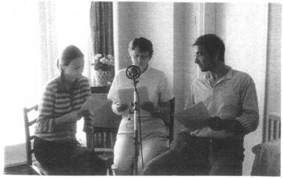
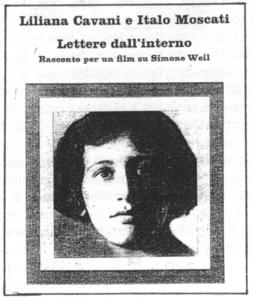
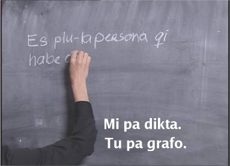
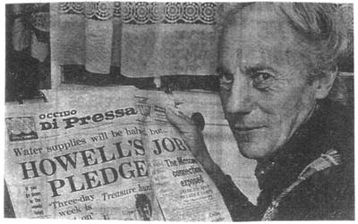
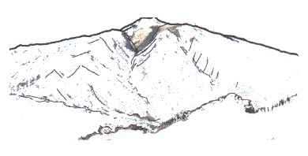
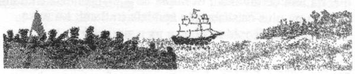

  
  
<span id="komunika"></span>

## Munda komunika e loka dice

Pro internatio merka e vendo na nece puta; ne solo de boni translati de
u textu; sed plus de plu loka dice.

Nu na habe tako komunika trans holo munda; id es ma facili de merka e
vendo inter singu landa. Anti-co, na ne debi doxo; singu natio dice e
akti iso alelo te forma mo munda kultura. Kontra-co, poli-pe fo alexi mu
matri lingua e mu bio-mode; te tena mu histori e mu idio mode. Poli
stato in pre Soviet Unio nu uti mu matri lingua e dialekti te monstra mu
neo libe pote. E klu in Europa, interese de plu mei ge-uti lingua du
kresce. Nu Katalan es u proto lingua de oligo miliona civi.

Id es gravi de komunika klari e efekti trans u-ci mixa de komercia
merkato; iso tem minus mis-duce alo ofende ali-pe. Sura, un uti de un
Inter-reti nu dona u plus dimensio ad u-ci ad internatio merka e vendo
komunika. Pe nece akti fo kura de translati e uti plu designi, bileta e
plu lexi de plu merka-ma e vendo-ma. Translati posi es mega preci; sed
plu-la ero-translati pote es klu ma preci\! U translati-pe nece habe u
boni ski de un ur-textu; e plus-co, habe u boni ski de plu civi, de plu
bio-mode e loka-dice in plu-la landa topo singu vendo-ma fu gene uti.
Singu translati-pe nece es sensitivi de e ski de plu nu mode e plu acide
de u-la landa. Mu ne pote risko lose developo de plu in-frasi, plu
idioma e plu acide. Exempla: plu lexi de *surfing, gay* e *net* in
England lingua nu habe plu hetero elekti de semane de pre oligo anua
retro.

Plu translati programa de plu puta-me nu du progresi fo tako; e in poli
okasio id es gru de translati facili textu; exempla; plu-la de singu-di
komercia grama. Kon auxi de u fo tekno translati-pe plu translati
puta-me programa sti ma tako mu ergo. Sed kon no-tekno translati-pe; u
textu pote tena poli ero. Id es gravi de dura lekto dia e verifi plu
lexi-lista e frasi-lista.

Pe nece decide u maxi boni mode de transfero u textu ex auto puta-me ad
Inter-reti pagina eko-lo. Exemple: Qe plu leko-pe de id fu lekto u textu
ex laevo a dextro alo ex dextro a laevo? Qe plu Englanda lekto-pe fu
reakti hetero ad ‘ \#’ signifi de plu USA lekto-pe? Si plu translati-pe
e designi-pe ergo kon alelo ex proto; u fini textu e designi de mu
inter-reti pagina fu dona gluko, facili de lekto e efekti info.

Suma-co, ali translati-pe debi memo plu lexi de u Francais grafo-pe
Antoine de Saint-Exupery. An pa dice: ‘Lingua es u fonta de panto
mis-logi.’ Na buta: es de sto u-ci mis-logi, per boni translati ad in
Glosa.

<span id="filma"></span>  

## Glosa Filma Qo Akti?

U-ci anua tri Glosa-pe pa akti mero in un arti-projekti ex Sa. Mathilde
ter Heijne; fe es un arti-fe ex **** Nederland. U-ci projekti pa gene
nima ‘Qo akti?’ Id es

u video filma ge-difusi per sixa monito-me; u tema es de u filosofi de
Sa. Simone Weil. U textu de u-ci brevi filma es ge-dice in Glosa; e id
proto monstra pa acide in Galeri Martina Detterer,in Frankfurt-am-Main,
Deutsch-land tem Juni e Juli 2003.

Un ur-texu de ‘Qo akti?’ veni ex filma; de un Italia direktora Liliana
Cavani; sed a-nu u-ci filma ne pa gene reali. Wendy Ashby pa translati
mero ur-textu ex *‘Lettere dall’* *Interno* (ge-grafo in Italiano ex
Liliana Cavani kon Italo Moscati tem 1971) ad in Glosa.

U drama-textu de u-ci pusi ge-ski filma es u tristi drama; mero id es de
fe biografo; e mero de fe histori karakteri. Id es de u bio de u
francais filosofi-fe Simone Weil (1909-1943). Id monstra fe lukta te sti
libe plu ergo-pe; e te dona eqa okasio a panto-pe. Fe plu puta de morta,
de sufere e de salva dona plu pikto de plu seqe acide de histori. Mu
inklude fe ergo in face-do in France tem proto de plu 1930; e ex
Hispania Intra-Milita ad u-la kron fe pa lose bio in England tem 1943.
Fe pa lose bio kausa minus de sito e de mega debili; fe pa habe solo 34
anua.

U drama-loka de u filma es u pa-Nazi milita-do in Krampnitz proxi
Berlin. U Rosija arme pa eko la pre Deutschland re-unio. Nu-di pe uti
u-ci loka pro face poli filma.

Kausa de fe tende; de sti libe plu ergo-pe e ofere panto-pe ma okasio;
Simone Weil es u fo gru persona pro proto filma in Glosa.

**** Plu gina-voci pa gene dice ex Sa. Wendy Ashby e Sa. Sabine
Asenkerschbaumer; e andro-voci ex Sr. Rainer Asenkerschbaumer.

  
  

\- pagina 2: -

  
<span id="liliana"></span>

## Liliana Cavani – grafo-pe

Liliana Cavani pa es mo de plu maxi duce filma-face-fe in Italia pre
1978. Fe rejekti de honesti e direkti femina plu idea pa stimula
kritici, apologi e koleri ex oligo femina-pe.

Kon u filma ‘u Notku Fero-pe’ (1974) Cavani gene mega interese ex
Amerika.

Fe pa proto face plu filma pro televisio; mu es de Mussolini, Hitler, e
mo de plu milita-fe; qi pa akti mero de grega resista-dina. Fe duce
interese pa es de ‘boni’ e ‘kako’, e komo bi-ci akti tem milita-tem. Per
fe investiga jurnalisti ergo de plu idio experie de plu ge-noku-pe po
milita; fe pa gene inspira de face ‘u Noktu Fero-pe’.

  
  
<span id="simone"></span>

## Simone Weil – fe-hero de u filma

Simone Weil pa gene nati in Paris tem 1909; e pa gene eduka in Ecole
Normal Superieure, fe pa es mo de plu proto gina stude-pe la. Fe pa esce
u doci-fe; sed plus-co, pa ergo in plu agri-lo e plu face-do; topo fe pa
elekti de akti plu no-facili manu ergo te experie u bio de u norma
ergo-pe. Tem 1936 fe pa es u membra de u Republika dina in Hispania
Intra-Milita; fe pa ki versi ab ante-line po sufere u mali piro-noku in
mal-acide. Tem 1942 fe pa ki ab ex France e pa es membra de Libe plu
France-pe in London. U fu-anua fe pa lose bio ex tuberkulosis; fe ne pa
sio vora ma sito de plu-la persona qi pa sufere ex Nazi okupatio in fe
matri landa.

Fe plu grafo monstra; plu-la religio puta e idea qi pa veni ex poli
speci fonta – Kristi, Semiti, India, Greko e Hindu – e foku a sufere e
salva. U lekto-pe veni facia a facia ko homi konditio e ultra id.

  
  
<span id="kritici"></span>

## Qo akti?  nova-papira kritici

Christoph Schutte pa grafo u kritici de ‘Qo akti?’ in Deutschlanda
nova-papira ‘Frankfurter Allgemeine

Zeitung’ tem Juni 2003. Ci es mero u-la textu ge-translati ad in Glosa.

  

### Qo akti?

Ergo ex Mathilde ter Heijne in Galerie Martina Detterer.

U lamina de sika pani; mero po mero, morda po morda. U vora-tem. Semi
pani dura kumbe proxi u vaku disko; sed fe ne fu toka id.

Alo: u fo soni makina in fronta-vista; e supra u-ci fo voci: ‘Si ex nu;
tu akti okto-centi; posi mi fu lase tu du ergo ci.’

Alo: U gina gene fusili; id es milita.

Sixa sti puta seqe simi-co, es sati pro u Nederlanda arti-fe Mathilde
ter Heijne; te dona u brevi-vista de u France filosofi-fe Simone Weil;
qi pa lose bio in England de famina e debili. Fe ne pa sio vora ma de
plu-la hetero-pe de fe landa; qi pa sufere de dina ex Deutschland; e fe
pa es aktivi in Hispania Intra-Milita………

U no-ge reali drama-textu pa gene translati ad in solo 1000 lexi; u
funda un internatio auxi lingua ‘Glosa’; qi habe u tende; te libe de
disputa e dona ma boni logi inter panto homi………

Plu gentili kroma-space lumi; tem mo skuta sto; un soni de plu frasi
reflekti in kefa de u vide-pe; seqe-co plu impresi dura la. Ka, minus
falsi-monstra un hero-fe ‘Qo akti?’ gene laxi; proxi no-ge-vide ab
solidi fatu e qestio de konstitu de societa; e sti relatio inter teori e
praxi e analisi fe auto punktu de vista. Plu tortu qestio de Simone
Weil; mu es plu qestio de na.

  

<span id="qestio"></span>

## Plu qestio e reakti

**Qestio:**

Qe Glosa es u libe alo ge-kontrola lingua? Oligo pe per Inter-reti feno
grafo mu auto speci Glosa.

U struktura de u Glosa lingua es uniformi. E pe uti plu-la internatio
simboli qi es uniformi. Qe singu Glosa-pe fu esce uniformi? Qe plu
Glosa-pe fu uti solo mo speci etiko e mo speci humoro? Qe posi singu
Glosa-pe fu akti e dice exakti iso alelo?

Mathilde ter Heijne

Berlin, Deutschland

  

**Reakti:**

Ali lingua nece habe plu regula; e sura, Glosa plus-co, habe mu. Plu
Mekani de Glosa e u Glosa 1000 lexi-lista es fo gravi ad universa Centra
Vokabulari. Maxi numera lexi de u-ci Centra lista es brevi; tako de memo
e grafo; e mu es facili pro plu civi de panto landa de dice. Na
panto-kron emfasi u gravi de u-ci brevi e eficie Centra Vokabulari; qi
dura es u Kardia de Glosa.

Po-co, es u ma-mega lexi-lista; qi ofere poli simonima; plura mu habe ma
longi lexi; qi es fo ge-amo ko plu-la persona; qi amusa se de grafo
poesi, literature e plu komplexi lexi-enigma. Pe es libe de uti idio
grafo-mode;

  

\- pagina 3: -

  

e tem ma civi ex poli landa uti Glosa; id fu dura de develop e kresce id
idio mode. Si pe grafo fo gravi info; e mu volu panto-pe de klari logi
id; id es gravi de boni uti plu mekani; e de uti plu brevi e facili
frasi.

De un uniformi Glosa-pe

Sura, no. U seqe sio es u no-stimula bio.

In PGN ex kron a kron pe lekto poli speci artikla de plu-la sistema qi
es nu internatio ge-ski; poli mu es per pikto; exempla; plu internatio
simboli homo na vide in plu aeroporta e navi-lo de panto landa; e plu
simboli de skience e teknologi, etc. Na pa publika plu piktografo de
oligo tema inklude; fotografi, geografi, e meteologi. Un hetero
internatio sistema es u grafo de musika. Ali internatio sistema qi es
uniformi; pote gene uti para Glosa te auxi internatio komunika.

Iso tu pa lekto in artikla ‘Munda komunika e loka dice’ de u-ci PGN; plu
civi de singu natio ne akti alo dice iso alelo; e na ne habe solo mono
kultura trans holo munda. Humoro es fo komplexi; e freqe ne translati fo
boni ex mo lingua ad hetero; veri, uno-pe de mo urba ne sio ridi po audi
komika stori ge-dice ex an vicina-pe. Id sio es u boni tekno si u
grafo-pe pote grafo u stori; qi panto-pe ex panto-landa sio detekti
amusa.

De u Glosa uniformi etika trans holo munda. Qo speci akti etika? Qe na
debi grafo u sistema de internatio akti pro plu merka-pe e vendo-pe? Qe
pe debi uti plu-ci akti para alo vice plu etika de u certa landa? Qe ali
lekto-pe habe plu idea de u-ci tema? Si ja, place grafo a PGN.

Id es gravi pe habe plu indika qi es internatio e klari kon alelo; sed
posi na tro mega uti Glosa de vice plu-ci akti. Glosa es un internatio
auxi lingua; na pote facili translati info de panto-ra inklude de plu
etika de singu landa ad in Glosa; e po-co, difusi u-ci info a panto-pe.
Glosa es pro internatio komunika e eduka; ne pro sti dina internatio
regula e kontrola. Na nu bio in fo multi kultura munda; qi tena un
interese mixa de plu idea, more, arti, religio, histori, musika, etc.;
qi dona a na u munda de poli speci-ra de dura tena na amusa e stimula.
Glosa du akti id mero in u-ci komplexi e sti-mira munda.

  

**Qestio:**

Mi pre-nu grafo oligo grama e qestio de Glosa a tu. Tu pa fo auxi mi,
mega gratia\! Mi fo amo un idio e elementa Glosa. Seqe-co, mi re-grafo;
te gene ma de u-ci interese internatio lingua.

De plu vice-verba; in Englanda-lingua na habe *s/he* alo *his/her*. Komo
pe sio translati u frase homo:

*a doctor and his/her friends?*

Plus-co mi volu qestio de ‘Tako Glosa’ sistema. Qo-pe pa krea id? E
qo-tem? Komo pe pote gene ski de u-ci?

Gareth Clee,

Cardiff, Cymru

**Reakti:**

Karo Gareth,

Ave\! Fo gluko audi itera ex tu; e hedo de ski; tu dura fo amo Glosa.

*S/he* es fe/an.

U frase: *a doctor and his/her friends*. In Glosa es: u medika-pe e
an/fe plu ami.

Plu Glosa lexi ‘an’ e ‘fe’ es fo brevi; seqe-co, id ne habe mega valu de
tenta klu ma brevi mu.

Pre poli anua Ron Clark e Profesora Lancelot Hogben pa dice de un idea
de Tako Glosa (TG) oligo kron. Plu komunika pa es per telefona kla e plu
grama; iso tem mu pa kambio info e plu idea de oligo hetero aspekti de
Glosa. U-ci pa proto acide cirka 1968/9. Hogben pa lose bio tem 1975.

Ron pa dura este fo interese de TG; sed ne pa ma developo id ad u-la
tem. Poli anua ma tardi an re-proto grafo id; e an pa publika un artikla
de id in PGN numera 24 tem 1986. Plu hetero artikla de TG. pa gene
publika in PGN 25, 26, 27, e 47. Ron pa tende grafo u bibli de id; id ne
pa gene reali; u-ci ne pa es de an lose de interese; sed kausa de an pa
es fo aktivi ko grafo plu hetero Glosa lexi-bibli e PGN; e inter-tem na
pa du es aktivi ko difusi Glosa e organisa plu Glosa unio in London e
Richmond.

Tem 1995 oligo Glosa-pe petitio ma info de TG. Ron re-tenta developo un
idea; an pa verifi an ur-lista; po-co, an pa inklude info de TG. in PGN
64 e 73. Nu mi ne habe panto TG. papira ko mi; veri mi ne pa skope mu ex
pre morta de Ron. Ex u-la kron mu es in sekuri stora-lo ko poli hetero
Glosa-ma. Fu-meno un ami de mi fu fixa u plika-skala a stego-ka de mi
domi; plus, an fu aku oligo ligni-taba epi id pedi-lo. Seqe-co, mi fu
pote gene e stora panto Glosa-ma e plu bibli de mi. Id fu es interese e
amusa apri plu teka e vide plu-la kosa; mi ne pa vide; ex pre tri anua
retro. E ma gravi mi fu pote facili uti mu kron mi volu. Sed, mi nu-pa
muta e tema\! Mi nu veni versi a TG.

Tako Glosa es u sistema de plu ge-brevi lexi; idio ge-face pro Glosa
lingua. Pe pote uti id per grafo-ru alo per ali grafo-me alo puta-me
klavi-taba; qi habe plu Romani litera. Id es boni pro tako grafo, e
ekonomi ko papira e tem. U sistema uti u mixa de pusi e mega litera te
vice plu brevi e ma komuni lexi de Glosa 1000. Plu hetero lexi gene
forma per uti solo bi, tri alo tetra litera.

Exempla: a = a,ad. A = akti, aktivi singu = sng. Id plus uti plu hetero
klavi ex Romani klavi-taba. Exempla: plus = + exklamo = \! qe? = ? astro
= \* ma de = \> e mei de = \< e valuta = £.

Mi fu cerka ma info de TG e inklude oligo artikla de id in plu fu PGN.
Inter-tem; mi nu-pa detekti paleo fotografi de ma-juve Ron in nova
papira. Posi id fu amusa e interese tu. Id pa gene publika tem 1976 in
“Western Daily Press”; mu pa dona u papira u Glosa titula. Tu fu vide;
id pa es pre fonetika Glosa.



Sr. Ron Clark ko an Glosa “Western Daily Press”

  
  
  

\- pagina 4: -

  
<span id="maugham"></span>

## Un Hedo Andro

Brevi stori ex W. Somerset Maugham

  

Id habe risko de sistema u bio de plu hetero-pe. E mi freqe pa qestio
se; de un auto fide de plu-la politika-pe, plu re-forma-pe e plu simi
civi qi dina mu ami de muta mu habitu e punktu de vista. Mi panto kron
hesita de dona konsili; ka qo-mode pote pe dona konsili ad hetero-pe
minus ski u-la persona iso boni de tu ski auto? Boni Ciela\! Mi ski fo
pusi de mi auto; e mi ski zero-ra de ali hetero-pe. Na pote solo divina
de plu puta e plu emotio de na plu vicini-pe. Singu mo de na es u
ge-kapti-pe in solito turi; qi komunika ko plu hetero ge-kapti-pe; qi
forma homini per plu norma signi; e qi ne habe exakti iso semane pro mu
de pro an auto. E mali-fortuna, pe habe solo mo bio; pe freqe ne pote
repara plu ero. E mi es qo-pe? Qi debi dice ad ali-hetero-pe qo-mode an
debi duce an bio? Bio es no-facili; e mi pa detekti id sati no-facili de
boni eko auto bio; e mi ne este ge-stimula de doci bio-mode ad ali
hetero-pe. Sed es plu-la andro qi akti ero a proto de mu viagia de bio.
U via avanti mu es ge-konfusi e risko; e oligo-kron minus volu; mi pa du
gene dina de indika mu fata. Plu-kron plu andro pa dice a mi; mi debi
akti qo de mi bio? E brevi tem po-co, mi pa vide se ge-tegu per u-la
melano extra-vesti de destina.

Mo kron mi ski; mi pa dona boni konsili.

Mi pa es u juve andro; e mi pa eko in u meso-gluko kamera-fa in London
proxi Viktoria Statio. Tardi mo po-meso-di mi nu pa puta; mi pa ergo
sati pro u-la di; kron mi pa audi u soni de mi kampani. Mi pa apri u
porta; e pa vide un andro mi ne ski. An pa qestio mi nima; mi pa dice id
ad an. An pa qestio si an lice veni in.

‘Sura.’ Mi pa reakti.

Mi pa duce an in mi sedi-ka; e pa ofere an u sedi-mo. An pa feno subo
embarasa. Mi pa ofere ad an u cigareta; e an pa habe no-facili de piro
id minus lase kade an kefa-ve. Po an pa sucede u-ci lukta; mi pa qestio
an; si mi pote loka an kefa-ve epi sedi-mo pro an. An tako pa akti u-ci;
e iso kron pa lase kade an pluvi-skuta.

‘Mi spe; tu ne este anti mi veni a tu,’ an pa dice. ‘Mi nima es Sr.
Stephens e mi es medika-an. Mi doxo; tu es ge-nexu ko medika ergo, qe?’

‘Ja, sed mi ne es u praxi medika-an.’

‘No, mi ski u-la. Mi nu-pa lekto u bibli ge-grafo ex tu de Espania; e mi
volu qestio tu de id.’

‘Id ne es u fo boni bibli; mali-fortuna.’

‘U faktu es; tu ski uno-ra de Espania; e mi ski zero hetero-pe qi ski
u-ci. E mi pa doxo; posi tu sio dona a mi mero info.’

‘Sura, mi hedo fu auxi tu.’

An ne pa dice u pusi tem. An pa tensio e prende an kefa-ve; po-co, pa
tena id in mo manu e feno minus puta de ali-ra pa karesa id kon hetero
manu. Mi pa divina; u-ci akti pa dona fide ad an.

‘Mi spe; tu ne doxo id fo strano; de uno-pe tu ne ski dice ko tu
per-co.’ An pa ridi; feno subo penite. ‘Mi ne tende dice a tu holo
stori de mi bio.’

Kron ali-pe dice u-ci a mi; mi panto-kron ski; u-la es exakti qod mu
tende akti. Mi ne este anti id. Veri, mi subo amo id.

‘Bi paleo tanta pa kura de mi. Mi zero kron pa ki ad ali-lo. Mi
zero-kron pa akti ali-ra. Mi pa gene game sixa anua retro. Mi habe zero
infanti. Mi es medika oficio-an in pato-do in Kamberwell, London. Nu mi
ne pote tolera id.’

Il pa es uno-ra fo sti puta de plu-ci brevi e akuto frasi. Mu pa tena
dina. A nu mi pa du brevi oku an; sed nu mi ma kura skope ad ad. An pa
es u pusi andro; dina e kompakti; ko bari e rondo soma. Posi, an pa habe
tri-ze anua; an pa habe u rondo e rubi facia; ex qi bi pusi obskuri e
brilo oku pa radia. An melano kapila pa es fo brevi ge-seka ad an
buleta-morfa kefa. An pa es ge-vesti per fo ge-uti ciano vesti-fa. Id pa
es tro mega supra plu genu; e plu marsu pa es tro ge-ple e no-sistema.

**** ‘Tu ski de un ergo de u medika oficio-an in pato-do. Mo di es fo
simi singu di. E posi mi fu akti u-ci ergo tem holo mi bio. Qe tu doxo;
id es profito?’

‘Id es profito te gene in-valuta te eko’. Mi pa reakti.

‘Ja, mi ski. Un in-valuta es subo boni.’

‘Mi ne ski; u kausa tu pa veni a mi.’

‘Bene, mi pa volu ski; qe tu doxo; il es ali fortuna pro un Englanda
medika-an in Espania?’

‘Qo-ka Espania?’

‘Mi ne ski; mi habe u volu pro id.’

‘Id ne es simi *Karmen*, tu ski.’

‘Sed id habe heli, boni vini e kromo; e id habe puri aero te boni
inspira. Las mi dice; fo brevi e klari. Per fortuna, mi pa gene ski; es
zero Englanda medika-pe in urba de Seville. Qe tu doxo; mi sio pote gene
sati in-valuta la? Qe id es no-sofi de linqe mi sekuri ergo; e vice id
per no-sura ergo?’

‘Tu gina doxo qo de id?’

‘Fe es hedo de tenta id.’

‘Id es u mega risko.’

‘Mi ski u-la. Sed si tu dice, ki la; mi fu akti-co; si tu dice resta ci;
mi fu resta ci.’

An pa du skope a mi forti, per plu-la brilo oku; e mi ski; an pa dice u
veri. Mi pa puta brevi tem.

‘U-ci fu efekti tu holo futura; tu auto nece decide. Sed mi fu dice u-ci
a tu; si tu ne volu valuta e vice-co, tu es hedo de gene solo sati
in-valuta te nutri-se e vesti-se, tu debi ki. Ka, tu fu fru u splendi
bio.’

An pa ki ab. Mi pa puta de an tem mo alo bi di; e po-co, pa oblivio de
an. U-ci acide pa apo ex mi memo.

Post poli anua; minimu mo-penta anua, per fortuna mi pa es in Seville.
Mi pa sufere pusi pato problema; e seqe-co, mi pa qestio un hoteli
fero-pe si il es un Englanda medika-pe in u-la urba. An pa dice ja; e pa
dona a mi un eko-lo. Mi pa ki per vagona; e tem na pa sto extra u domi u
pusi e obesi andro pa ki ex. An pa hesita u brevi tem kron an pa vide
mi.

‘Qe, tu pa veni te vide mi?’ an pa dice. ‘Mi es un Englanda medika-pe.’

Mi pa dice ad an de mi problema; e an pa petitio mi de veni in an domi.
An pa eko in norma domi de Espania; kon u ge-pave-lo. An konsili-ka qi
pa duce ex

  

\- pagina 5: -

  

id; pa es ge-spora per poli bibli, papira plu medika-me e poli
hetero-ra. U-ci vista posi sio sti fobo u timidi pato-pe. Post mi visita
mi pa qestio u preci de an servi. An pa dice no per an kefa e pa
sub-ridi.

‘Es zero servi-preci.’

‘Qo-ka no?’

‘Qe tu ne memo mi? Ka, mi es ci kausa de uno-ra tu pa dice a mi. Tu pa
muta mi holo bio. Mi es Sr. Stephens.’

U-ci info signifi zero-ra a mi. An pa sti memo mi de na pa unio; e an pa
dice a mi qod mi pa dice ad an. E gradu per gradu; ex funda de mi memo;
mi pa memo mero de na pa unio .

‘Mi pa qestio se; si mi ali kron sio re-vide tu, an pa dice. ‘Mi pa
qestio se si ali kron mi sio habe u fortuna de dice gratia a tu.’

‘Id pa es u sucede, qe?’

Mi pa skope ad an. Nu an pa es fo obesi e habe zero kapila; sed an plu
oku skintili kon hedo e an sani rubi facia fero u fo boni humori. Plu
vesti de an pa es fo no-puri; sura mu pa es ge-face per Espanol sue-pe.
An kefa-ve pa es u lati-margina Espanol sombrero. An pa feno a mi qasi;
an sio ski u fo boni botilia de vini kron an pa vide mo. An pa habe u
feno de disipa e plus de holo simpati. Pe posi, sio hesita de laso an
apo mu apendici; anti-co, mi ne pote imagina u ma delekto-an te ko bibe
u vitri de vini.

‘Sura tu pa es ge-game?’ mi pa dice.

‘Ja, mi gina ne pa amo Espania; fe pa ki versi ad England; fe ma-amo id
la.’

‘O, mi este penite de u-la.’

An plu melano oku pa brilo un amusa e milita sub-ridi. Veri, an pa habe
u feno de u juve *Silenus*.

‘Bio es ple de plu re-paga;’ an pa murmuro.

An nu-pa fini dice plu-ci lexi kron un Espanol gina pa veni a porta. Fe
ne pa es fo juve; anti-co, fe klari dura habe un hedo e delekta kali. Fe
pa dice ad an per Espanol; e mi ne pa pote fali de ski; fe pa es u
domina-pe de u-ci domi.

Tem an pa sta para porta te lase mi ki ex; an pa dice a mi. ‘Tem na pa
unio tu pa dice a mi; si mi veni a ci, mi sio gene solo sati in-valuta
te nutri se e te vesti se, sed mi sio fru u splendid bio.

Bene, mi volu dice a tu; tu pa dice u veri. Mi pa du es pove; e mi
panto-kron fu du pove; sed, boni ciela\! Mi fo mega pa fru se. Mi ne sio
kambio u-ci splendi bio de mi kon u-la bio de ali regi-pe in holo
munda.’

  
  
<span id="nefo"></span>

## Supra plu nefo

(28 nordi 16 uest)

  

Infra…. plu nefo tenu, ge-difusi, rako-margina, leuko.

Infra inter-nefo .…urba ge-difusi, rako-margina, leuko, rosa, kloro.

Horizo…. leuko, polio, rako-margina nefo dura.

Pusi-supra dista …. polio, akuto, klari plu monti-akro.

Infra mu dista .… no vista

  

Gran Kanaria.

Cirka .… plu pinus dendro

Dia plu aku …. plu nefo .… epi plu aku .... plu guta.

Supra …. Alti-koni ab-koni …. plu gentili, sedati klina

Solo nudi, aridi.

Na sta epi plu cinera.

Ex …. piro, explode, erupti, vulkani, fumi, fo termo,

Liqi-petro de longi tem pa.

  

Na sta a pedi de El Teide.

Ex Sr. Sid Pidd

Scarborough, England

  
  
  
  
<span id="kapitana"></span>

## O Kapitana\! Mi Kapitana\!

Ex Walt Whitman

  

(Walt Whitman pa uti u ‘libe poesi’, qi ne habe forti rima. An pa grafo
u-ci poesi po cide de presidenti Abraham Lincoln.)



O kapitana\! Mi kapitana\!

Na fobo viagia nu-pa es ge-fini.

U navi pa dura dia panto turba.

U premi; na pa cerka, pa gene gania.

Un asilu-lo nu es proxi.

Mi audi plu kampani.

Panto homi voci lauda.

Tem mu oku du seqe u rekti forma

de minus-este e minus-fobo navi.

Anti-co – o kardia\! Kardia\! Kardia\!

O plu kade guta de hema;

Topo epi plano mi kapitana du kumbe –

Ge-kade e frigi e morta.

  

O kapitana\! Mi kapitana\!

Sti surge e audi plu kampani,

Sti surge\! Pro tu un insigni pa gene leva.

Pro tu u trompeta gene soni.

Pro tu es plu flori-fa e plu orna-zo ko kali banda.

Pro tu plu litora gene u poli-pe.

Pro tu mu voci—un osci kumu ko zelo facia;

Qi tropi a na.

Ci, kapitana\! Karo patri\!

Es u braki infra tu kefa\!

Qe id es u sonia; epi plano

Tu pa kade — frigi e morta?

  

Mi kapitana ne reakti.

An labia es palidi e no-soni.

Mi patri ne este mi braki.

An habe ni dina ni volu.

U navi pa gene no-moti kon asilu e kon holo.

Id viagia es ge-fini e sucede.

Ab fobo viagia u vikto navi nu veni ko ge-gania uta.

Sti lauda, o litora vi\! E sti soni, o kampani vi\!

Anti-co, mi ko tristi pedi

Du gresi epi plano; topo mi kapitana du kumbe –

Ge-kade e frigi e morta.  

Translati ex Sr.Gary Miller, USA.

  
  
  

\- pagina 6: -

  
<span id="kondimenta"></span>

## Plu Kondimenta

Na uti plu kondimenta te dona ma boni gusta a na sito; e te sto id
dekomposi fo tako. Id es fo gluko tem gresi in domi; na este un aroma de
mixa de kondimenta flu ex termo kuko-ka. Oligo kondimenta sti memo na de
u certa tem de un anua; exempla Kristo-nati alo Paska. E oligo na
plus-co, habe plu kandela in domi; ko mixa de plu aroma oleo; te sti
dona a na u simi efekti.

Plu kondimenta gusta e fragra fo boni; sed plus-co, mu habe plu terapi
profito. Ci es oligo kondimenta ko mu Glosa e Englanda-lingua nima; e
brevi nota komo mu fu sti ma boni tu sani e kuko.

  

**Cinamom** (Eng. Cinnamon) U-ci kondimenta gene face ex ge-sika
intra-mero de kortika; id veni ex dendro de u genus Cinnamomum. U-ci
dendro es membra de iso famili de Laurus.

Cinamom es boni terapi te sti mei plu simptoma de u koriza. Loka u baci
de Cinamom in kratera; fusi buli-aqa supra id; po-co, tegu tu kefa ko
sika-te e inspira u termo vapo. Plu hetero profito de u-ci kondimenta
es; id auxi pe relaxa e sti mei anxio; id sto algo; e auxi sti mei tro
alti hema-presura.

In kuko, uti cinamom ko frukti; supra-toto ko ge-vapo pomi alo armeniaka
(apricot). Alo face boni gusta e termo bibe-ma per mixa id ko meli,
oranga-suku e termo-aqa.

**Fenikula** (Eng. Fennel) Plu sperma de u-ci fito habe u gusta simi
glukoriza (liquorice). Auxi ko plu algo in gastri e plu pato de un hepa.

  

**Kardomoni** (Eng. Cardamom) Es membra de zingiber famili. Plu sperma
de kardomoni habe u termo aroma gusto; pe uti mu in ambi sukro e sali
fago-ma; e in plu farmako-ma.

Mu es boni te repara plu pepsia pato; supra-toto te sti mei u kumula de
plu gasi in gastri. Pe mastika plu sperma te sti ma fragra u spira.

Uti ge-pulpa kardomoni sperma-va in plu oriza fago-ma; exempla ko sukro,
lakti e oriza; alo in oriza Pilaf.

  

**Karum** (Eng. Caraway) Karum fito veni ex membra de iso famili de
Petroseli (parsley) e Daukus (carrot). Plu sperma tena karvo un aroma
oleo. Karum es boni pro pepsi sistema.

*Kummel* es u klari leuko alkoholi; id es ge-face ex grana e ex plu
sperma de karum. Id es u fo ge-amo bibe-ma in boreo Europa; pe bibe id
po vora mega pluto alo bari sito. U-ci bibe-ma proto pa gene face in
Nederlanda.

Tu pote mixa plu karum sperma ad in ge-kuko potato; e plus-co uti mu in
plu sukro-sito; exempla: plu biskokta, plu plaka e pani.

  

**Korianda** (Eng. coriander) Pe uti u-ci pro ambi fito vora-ma e
gusta-ma. Plu sperma habe u gentili sukro gusta; kon indika de u frukti
gusta. Mu gene uti in ambi sukro e sali sito.

Korianda es boni terapi te auxi u pepsia sistema; plus-co id auxi ko
bakteria e fungu pato.

Uti pusi qantita de Korianda ko karni alo tomato formula (Eng. recipe).
Uti u mixa de ge-pulpa sperma e oleo de oliva ko piski alo galena pre
kuko id.

  

**Kurkuma** (Eng. Turmeric) Es u ge-sika radi de u fito; qi es membra de
u Zingiber famili. Id es u duce mero-ma de India kuri.

Kurkuma es boni pro anto speci hepa-pato. E nu-di recerka monstra; id
habe anti-inflama profito iso boni de plu-la benefici de u farmako
kortisome. Id es un anti-bakteria farmako e u dinamo anti-oxida-ma.
Akorda a recerka in Universita de Kalifornia, USA, id pote sti lento u
progresi de Alzheimer-pato; posi u-ci explika u kausa; ne tanto poli
palaeo-pe in India sufere ex u-ci pato de plu paleo-pe in Ocide.

  

**Miristika** (Eng. Nutmeg) Miristika gene face ex plu sperma de u
dendro Myristika fragrans. Id auxi sti u volu de vora e es boni pro
pepsi. Id ne es boni de vora mega qantita de id kausa id habe plu seqe
de halucina; anti-co, in plu pusi qantita id auxi relaxa e stimula
somni.

Uti id in plu formula qi tena kasea; alo in plu sukro-ma ko frukti alo
oriza.

  

**Safro** (Eng. Saffron) Veni ex u ge-sika stigma de u flori Krokus
sativus. Id es u mega-preci kondimenta. Id uti 1,500 flori te dona 1
gram de safro. Anti-co, pe nece uti solo oligo filamenta de id te dona
sati gusta e kroma a sito.

Safro auxi sti mei u menstra algo de plu gina; plus-co, id habe
afrodisia efekti. Pre poli anua plu civi in India, Helas e Roma pa uti
id. E plu medieval botani-pe pa dice; id sti ma tako u spiritu e u
kardia.

Uti fo pusi mero safro in plu formula de kuri (curry); de plu supa e ko
plu formula ko vegeta e oriza.

  

**Sizigi** (Eng. clove) Plu sizigi es plu ge-sika blasto de plu flori ex
u tropika dendro Syzygium aromaticum. Un Englanga-lingua lexi *clove*
veni ex Latino clavus semane aku (Eng. nail). U longi ge-sika blasto
feno fo simi un aku.

Sizigi habe u forti e u sti termo gusta; e id es boni tem frigi klima.
Id auxi sto un denti-algo. Frika oligo guta de oleo de sizigi peri denti
e gingiva; e u-ci sto un este de algo. Sizigi es boni terapi anti nausea
e anti-bakteria; e id auxi ko flu de hema in soma.

U bibe-ma de meli, citru, sizigi e termo aqa habe fo boni gusta e plu
boni sani profito. In kuko uti id ko plu frukti.

  

**Zingiber** (Eng. Ginger) U-ci kondimenta pa gene uti iso farmako in
Cina ex centa anua six. Id auxi ko viagia-nausea e gesti-nausea; id auxi
sti vigi un holo soma sistema e auxi u flu de hema in soma. Id auxi sti
mei kefa-algo. Plus-co, id es boni pro inflama e un algo de artritis.

Id dona fo boni gusta e sti termo plu vegeta e karni formula. Plus-co,
id es boni ge-kuko in plu plaka e biskokta; supra-toto si mu tena
cokolata. Te face zingiber tea; fria pusi mero zingiber radi ad in
tea-va. Po circa penta minuta fusi ad in tasa; e mixa ko pusi mero
citru-suku e meli.

  

\- pagina 7: -

  
<span id="sporta"></span>

## Sporta ko Glosa

Oligo Glosa-pe pa petitio de qantita de karta e valu de plu litera te
sporta Glosa skrable (scrabble). Pro Glosa versio pe habe 80 karta.

Si 2 persona sporta dona 12 karta a singu sporta-pe.

Pro 3 alo 4 persona dona 10 karta a singu sporta-pe.

U-ci carta monstra qanto karta de singu litera; e in kolumni tri;
monstra u valu de singu litera.

  

|            |            |          |
| ---------- | ---------- | -------- |
| **Litera** | **Numera** | **Valu** |
| A          | 8          | 1        |
| B          | 2          | 4        |
| C          | 2          | 6        |
| D          | 3          | 2        |
| E          | 7          | 1        |
| F          | 2          | 6        |
| G          | 3          | 2        |
| H          | 2          | 10       |
| I          | 6          | 1        |
| J          | 1          | 6        |
| K          | 3          | 4        |
| L          | 2          | 4        |
| M          | 3          | 4        |
| N          | 3          | 4        |
| O          | 7          | 1        |
| P          | 3          | 4        |
| Q          | 1          | 8        |
| R          | 3          | 4        |
| S          | 4          | 4        |
| T          | 4          | 2        |
| U          | 6          | 1        |
| V          | 1          | 6        |
| X          | 1          | 8        |
| Z          | 1          | 8        |
| Blank      | 2          |          |

  
<span id="skala"></span>

## Lexi-Skala

Lexi-skala es amusa; plus-co, id auxi memo e te sti ma-lati tu ski de
plu Glosa lexi.

Id es pro bi alo ma sporta-pe. U buta es; de tekto u ‘skala’ de plu
lexi. Singu lexi es mo litera ma longi de u pre-lexi. Singu sporta-pe
habe stilo e papira.

Mo persona elekti u litera. Panto sporta-pe habe u certa tem limita
(exempla 5 minuta); te grafo plu lexi; qi proto per u-la litera. Mu
proto per grafo bi-litera lexi, tri-litera lexi etc. U skala ne debi
habe ali space.

U vikto-pe es u-la persona qi tekto u maxi alti skala.

Infra es un exempla proto ko litera T.

``` 
   T
   T U
   T E M
   T A C I
   T A B L A
   T U N E L I
   T R I B U N A
   T E M P E S T U
   T E K N O L O G I
   T R A N S V E R S A
   T E R M O D I N A M O
   T R I G O N O M E T R I

```

<span id="pusi"></span>

## Komo pusi es kali?

In Septembra 2003 u di 30 anua po publikatio de u munda famo bibli ex
E.F. (‘Fritz’) Schumacher *“Pusi* *es Kali”*;pe pa organisa un
internatio unio in London. E bi merito-pe de Right Livelihood Award
Foundation pa ofere bi hetero visio in reakti a u no-certa qestio; qi pa
es u nima de u-la unio; “Qe pusi es kali?”

Dice-pe mo, pa es Tewolde Berhan Gebre Egziabher (RLA 2000). An es
Direktora Generali de Etiopia Ambienta Alexi Agentia. An pa dice de ‘U
reali volu de plu pove agri-pe’. An auto ne es agri-pe; anti-co, Tewolde
pa explika; an pa veni ex famili de pusi agri-pe; e kausa an es
skience-pe an pa ergo mega ko plu pusi agri-pe komunita.

In Austro nu-du – simi in Boreo, plus, pre un Industri Revolutio – plu
inventi veni ex kolekti de detekti ex plu membra de u komunita. “U-ci
stimula plu libe sistema de skience e teknologi; qi existe pro ali-pe te
uti; sed ne te es u proprio-pe de id.” Anti-co, un individual ge-sti
kultura u ge-industri Boreo nu akti iso u domina globa kultura.

Fo hetero de cent-anua 19, tem Europa pa kumula pluto ex plu koloni; id
es plu pluto landa qi nu-di sio lose ma ex kaos e ex plu milita. U-ci
krea un okasio pro muta. Uti u-ci okasio, un Austro debi lukta te gene
ma libe; pro sti ma eqa okasio pro panto-pe; e pro ma re-forma de plu
globa instituti. Si plu-la duce-pe pa volu u justi munda; il es tri
duce-ra mu debi akti:

Mo: rekogni; un Austro es mega e heterogene.

Bi: rekogni; panto voci nece gene audi; te face u speci de globa logi;
qi panto-pe pote akti mero.

Tri: habe u nece de respekti panto-ci speci; per muta internatio lega e
instituti; te ofere plu-la volu de ambi plu maxi debili e plu maxi
dinamo. Kon tri-ci konditio; an pa dice; “mi kredi u procesi de globa
logi fu sio profito singu-pe; e fini id fu gene globa ko-opera.

Ex hetero vista Pat Mooney (RLA 1985), exekutivi direktora de ETC Grega,
Kanada; pa indika; plu pusi-ra pote es perilo – supra-toto u menaci de
nanoteknologi. Pro plu pove-pe de Munda Tri plu seqe de nanoteknologi
sio es fo mega. Mu plu representi-pe probabli sio negotia topo WTO
(Munda Komercia Organisatio) konference in Mexiko minus holo logi u
longi tem impakti de u-ci teknologi ko mu plu ge-face-ra e plu merkato.
Plu mero de munda ekonomi sio gene transforma kausa; per habe u pote de
tekto plu material e produkti ex atomi metri-ru; plu komercia ne es
ge-limita a norma face-ma e merka-lo.

Subito tu ne dura nece gene tu kupra ex Peru alo kobalt ex Zambia; alo
stana ex Malaisia. Posi tu pote gene plu iso qalita per face plu neo
mixa. Qi signifi; si tu tend proto u kupra mina; po negotia tu plu
komerci akorda; e proto produce; posi il ne dura es u nece pro tu speci
kupra.

Panto na habe u teknologi unda veni a na. Id es u maxi mega teknologi
unda; u munda a nu pa vide. E id gene duce per plu maxi mega komercia de
u munda. Na nece habe un internatio konveni te metri u valu de plu neo
teknologi; un internatio lega struktura te analisi mu e te tena na ante

.”Ex “Cornerstones” publikatio de The Right Livelihood Award Foundation.
<span class="underline">[www.rightlivelihood.org](http://www.rightlivelihood.org/)</span>

  

\- pagina 8: -

  
<span id="enigma"></span>  

*Enigma Pagina: place vide* [u pikto](../pic/pgn088_enigm.png)
