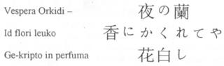
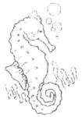
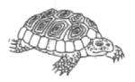
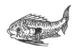
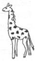
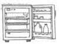
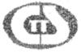

<table>
<tbody>
<tr class="odd">
<td style="text-align: center;"><h1 id="plu-glosa-nota-glosa-logo">Plu Glosa Nota </h1>
 
 
Published by Glosa Education Organisation (GEO) Reg. charity no. 298237 
P. O. Box 18, Richmond, Surrey, TW9 2GE Britain</td>
</tr>
</tbody>
</table>

  

|           |                               |                |
| :-------- | :---------------------------: | -------------: |
| Numera 89 | Decembra 2004 - Februari 2005 | ISSN 0265-6892 |

-----

  
  

## Ma Mega Europa

Mai 2004 un Europa Unio pa expande ex 15 membra landa a 25.

Plu membra landa de EU pre Mai es: Belgie, France, Deutschland, Italia,
Luxumbourg, Nederland, Danmark, Eire, UK., Helas, Portugal, Espania,
Helvetika, Suomi, e Finland. Ex 1 Mai plu deka neo membra es: Cipro,
Czek Republik, Estonia, Magyro, Latvia, Lituania, Malta, Polonia,
Slovakia e Slovenia.

U-ci developo ofere poli profito a singu membra landa; e krea u maxi
mega mo merkato in munda. Id tena cirka 450 miliona uti-pe; e id es ma
mega de u kombina de plu civi de USA e plu-la de Nipon. Pro komercia id
ofere poli ekonomi profito de plu pre e plu neo membra; exempla: id fu
sti ma mega un ekomoni in UK per iso mega de £1.75 biliona, e fu krea
300,000 ergo okasio; maxi mero mu fu es in London. Plus plu-ci ekonomi
profito; u ma mega EU krea ma mega qantita okasio pro plu civi de singu
membra landa de viagia, stude, ergo e eko extra-landa. Pe pote logi
u-ci; ex exempla de vide u transforma de plu-la ekonomi de Espania,
Portugal e Eire po mu pa juga un EU. E seqe-co, u-ci pa sti un “expande
unda” efekti, trans holo EU, de ma mega kresce e de pluto profito in plu
kresce membra landa.

U ma mega EU qi du extende orienta e austra; sti ma facili internatio
komunika e u pote de diskursi de u solve de plu komuni problema; exempla
de, terorisma, ge-organiza anti-lega aktivi, merka e vendo de plu
anti-lega farmako e kontrabanda de plu kosa e de plu persona. Plu
vicina-pe de plu EU landa pote kon ergo te stimula Euro demokrati e
respekti pro id lega e humani justi.

  

### Ma mega numera de plu lingua

Un adi de deka neo membra plus-co, adi u numera de lingua ge-uti in EU.
Pre nu id pa tena 15 membra e mo-mo oficio lingua; nu existe un adi de
cirka 73 miliona civi; e plus-co, un adi de nona natio lingua. In toto;
EU nu tena 20 duce natio lingua; plus-co, es plu ma pusi ge-uti loka
lingua; exempla: katalano, gaeliko e galis, turkish, etc. Tem solo mo-mo
lingua pa gene uti; u-ci pa signifi pa existe 110 translati bina. Sed nu
existe 380 posi translati bina; e u-ci toto ne inklude plu-la mei ge-uti
loka lingua.

Tem Augusta 2004 un UK Komercia e Investi pa proto u tri meno lingua sko
programa in Francais, Polski e Deutsch; plu buta-pe pa es plu-la
komercia-pe; qi pa du proto merka e vendo in plu EU Merkato.

U recento recerka pa indika; poli komercia-pe akorda; de mu no-sati
lingua- e kultura-ski pa sti u barira de gene sucede de merka e vendo ko
plu extra-landa komercia. 40 procenti de viagia komercia-pe pa reporta
plu no-facili de proto plu komercia-ami inter plu civi in plu hetero
landa. Mo ex penta mu pa este mu pa lose komercia pote kausa de u minus
de boni komunika.

94 procenti demo de u munda dice un hetero nati lingua de English.
Plu-la komerci-pe in London nece detekti u gru mode te komunika ko mu
extra-landa merka- e vendo-pe. Exempla; in London plu eko-pe dice ma de
300 lingua. Id es gravi; plu London komercia-pe nece developo plu boni
komunika tekno te sti kresce u globa ekonomi de u-la duce urba. Poli
komercia-pe de London habe plu klienti qi ne dice English; sed solo tri
procenti mu habe plu Inter-reti eko-lo ge-grafo in plu xeno lingua.

In Rusia, plu civi dice Ruski e ne English. Plu-la Englanda-pe qi bali
mu proto introduce grama, fax alo e-posta ge-grafo in solo English ad u
Ruski komercia probabli ne fu gene u reakti. Klu si pe ski de u certa
Ruski-pe qi logi English; id es ma profito de translati u proto-grama ad
in loka lingua; kausa plu hetero-pe ex u-la komercia-do es posi plu duce
decide-pe. Sura, pe nece akti simi-co tem grafo ad ali hetero landa
ultra England.

  

### Qe, na nece dice poli centi lingua?

Un EU fu dura kresce; exempla tem 2007 Bulgaria e Romania fu es plu
membra. Id es sti mira; plu oficiali-pe feno; volu dura u-ci konfusi de
plu lingua. U seqe de u-ci es; pe dura uti ta mega tem e ta mega valuta
e singu-pe ex singu libeli; dura sufere de no-tako komunika. Sura singu
civi e singu membra landa fu uti auto natio lingua. Sed kron panto-pe
plus-co, ski e uti un Internatio Auxi Lingua de Glosa; u-ci fu es ma
ekonomi, e ma-facili. E fo gravi, mo alo ma vicina-civi sio pote tako
komunika kon alelo.

Poli-pe protesta de plu lingua problema in EU; anti-co, feno mu ne habe
iso mega interese alo stimula te auxi solve id. Un EU fu habe qanto
membra; e fu uti qanto lingua pre plu duce oficiali-pe akti te solve
u-ci tako kresce problema?

  
  

\- pagina 2: -

  

## Plu qestio e reakti

### Qestio:

Tu nu bali PGN a qanto landa? Mi freqe cerka u Glosa in inter-reti; e mi
fo amo plu pusi textu la. Plus-co, u Glosa inter-reti lexi-lista es mega
e fo funktio. Anti-co, mi este tristi; ma-mega Glosa-ra ne es la.

Mi nu-pa lekto mero de “Interlglossa” ex Prof. Lancelot Hogben. In u-la
bibli Hogben pa grafo de publika u ma-mega Interglossa lexi-lista; mi
sio amo vide id; qe, u-ci bibli nu existe?

Ci es u Nipon ‘haiku’ (idio 5-7-5 silabi poesi). Id es de sperma-tem ex
Buson (1716-84).

Sr. Gareth Clee

Cardiff, Cymru

### Reakti:

Karo Gareth,

Mega gratia de u-ci delekti poesi. Simi tu, poli na fo amo lekto plu
brevi textu ge-translati ad in Glosa ex literature de plu hetero lingua
fonta. Plu-ci ofere lekto-ma pro plu neo stude-pe de Glosa; e
interese-ma pro plu ma-tekno lingua-pe. Panto-pe fo amo vide; mero de mu
auto boni ge-ski nati-lingua literature ge-translati ad in Glosa. In
u-ci PGN tu pote lekto pusi mero ex Portuguese literature; mi spe; id
interese tu.

PGN gene distribu a poli landa; mu nu inklude: Britain, Deutschlanda,
Espania, Belgie, Nederlanda, Australia, U.S.A., Kanada, Uganda,
Tanzania, Kenya, Rusia, Italia, Luxembourg, Brasil, France, India, Cina
e Taiwan. Ex kron a kron na bali plu PGN a plu-la civi qi ne pote paga
pro id, exempla; demanda freqe veni ex plu civi in Afrika, Asia e
orienta-Europa. Mali-fortuna oligo-ci civi freqe ne gene mu kopi kausa
de mali posta-servi alo kausa mu gene klepto; u-ci es fo frustra pro
ambi u bali-pe e u cepti-pe.

  

### Interglossa

“Interglossa -- A draft of an auxiliary for a democratic world order” pa
gene publika ex Pelikan Books, Harmondsworth & New York, tem 1943. In an
introduce epi pagina 8, Hogben pa grafo de u fu 8,000-lexi
English-Interglossa lista; u-ci ne pa gene publika. “Central Glosa” pa
es u seqe bibli simi-co.

Hogben pa grafo “Interglossa” (IG.) iso u proto-bibli. An pa petitio plu
seqe-pe de auxi developo e difusi un idea kausa an ne pa habe u tolera e
energi ad u-la tem. IG. Pa gene publika tem plu milita-anua; sura, ne u
boni tem te organisa u promoti kampania; tem e papira pa es ge-limita.
Plus-co, Hogben pa es no-sani ad u-la tem. An gutura-pato pa esce
ma-mali; e an pa sufere de u pato de fatiga alo de tro excita; e de
takikardia. Po-co, an pa habe u tiroidektomi ge-seqe per sufere plu pato
de pleuritis e pneumonia. U mali-fortuna mixa de plu pato.

Po brevi tem, kron an pa este ma-sani Hogben pa bali “Interglossa” ad
oligo persona inklude ad Unita Natio Organisatio. An pa este sura;
uno-pe alo uno-organisatio sio promoti IG. Id pa es u gru tem pro tali
un idea; qi habe u buta de auxi developo munda paci e munda ko-opera.
Hogben pa este tristi kausa ne poli persona pa monstra interese; e
zero-pe pa akti po lekto an bibli. Seqe-co, an pa kontinue de akti
hetero ergo.

An pa grafo poli eduka-papira de biologi, medika, matematika e plu
lingua-stude. Plus-co, an pa grafo oligo hetero bibli, inklude: “From
Cave Painting to Comic Strip” 1949; “Man Must Measure – the wonderful
world of mathematics” 1955; “Mathematics in the Making” 1960; “The
Mother Tongue” 1964; “Whales for the Welsh: - a tale of war and peace”
1967; e “The Vocabulary of Science”, 1969.

Po kambio plu grama e telefono kla ko Hogben Ron Clark pa petitio si an
pa lice kontinue developo IG; e po-co, de difusi id. Hogben pa es fo
hedo; e pa dice ja.

Po Ron pa grafo English-IG e IG-English lexi-lista; mi pa proto ergo kon
an. Hogben pa sugesti Ron e mi pa akti mega qantita de translati ex poli
hetero tema te examina u lexi-lista; e si nece, modifi id. An pa es la
te reakti a plu qestio e te dona konsili a Ron. Hogben pa lose bio tem
1975.

Po-co, na pa introduce oligo pusi modifi ad IG; e kausa Hogben ne nu es
la te dice de plu-ci muta; Ron pa decide de re-nina u lingua a “Glosa”.
Mo litera “s” emfasi, nu u lingua es fonetika. Na ski; Hogben pa sio
akorda ko u-la muta; an pa dice te sucede; un internatio auxi lingua
debi es fonetika. An pa proto IG. no-fonetika te indika panto lexi es
boni ge-ski. Exempla: u neo stude-pe fu probabli ma facili rekogni
*chlorophyll* vice plu lexi *kloro* e *filo*.

Suma-co, plu Glosa lexi-bibli es plu-la bibli qi seqe IG.

Tu pote lekto ma de plu bio de Clark e Hogben in artikla ge-nima “Bi sti
mira-andro de Glosa” in PGN numera 84.

  

### Inter-reti

Ex lose de Ron, mi ne pa habe sati tem e energi te difusi Glosa;
plus-co, mi auto pa du sufere mali sani ex kron a kron. Si Ron pa es ci
nu; mi este sura na sio habe poli ma textu epi Glosa inter-reti eko-lo.
U maxi mero Glosa inter-reti-ma pa gene komposi per Sr. Marcel Springer
in Deutschland; e na es fo gratia-ple pro an mega auxi; e de an kontinue
ergo ko-co. An pa stimula plu hetero Glosa-pe te kontribu e expande plu
lexi-lista e plu textu.

An bene-veni kambio de plu idea e kontribu ex panto Glosa-pe; place
auxi. Si singu-pe kontribu solo mo brevi textu; na sio habe mega ma
lekto-ma epi wwwGlosa.org

Mi nu este ma sani; e habe u buta de spende ma tem de ergo pro Glosa;
u-ci posi ne nu fu acide. Anti-co, mi spe; id sio es posi po minimu mo
alo bi anua. Ad u-la tem, mi dice fo mega gratia ad panto Glosa-pe qi
dona auxi e difusi de Glosa. E sura mi hedo bene-veni plu artikla e info
te inklude in PGN.

Wendy

  

  

\- pagina 3: -

  

## Plu ge-face lingua

### Qestio:

Mi este penite; mi ne pa grafo post longi tem. Mi pa detekti u bibli ex
Sr. Large in Bismark bibli-bo. Id inklude oligo pagina de Glosa; qe tu
ski de id e de Sr. Large?

Mi bali a tu fotokopi de plu pagina 157-161; e mi doxo tu fu este
interese de mu.

Saluta

Sr. Gary Miller,

Mandan, ND. USA.

  

### Reakti:

Ave Gary,

Fo gluko audi ex tu itera; e mega gratia de plu fotokopi; qi sti memo mi
de u-ci bibli; id es interese de lekto u-ci artikla itera. Dr.Large pa
komunika ko na tem recerka pro an bibli tem 1984. An bibli pa gene
publika tem 1986; anti-co, ex kron a kron na nu du gene oligo
qestio-grama de Glosa; ex plu lekto-pe de id.

Pro plu-la Glosa-pe qi ne ski de u-ci bibli; ci es brevi info de id. Id
es ge-nima;

  

### “The Artificial Language Movement”

ex Dr. Andrew Large, ge-publika tem 1986 ex B.H. Blackwell, Oxford,
Britain. Preci pa es £19.50.

Ad u-la kron, id pa es mo de fo oligo bibli qi; pa es toto ge-grafo de
plu internatio auxi lingua (IAL).

U bibli es in bi mero. Mero mo es de plu proto tenta de un IAL ex plu
avanti-vide civi; Medi-eva Latino; e po-co, generali interese ge-sti tem
Cent anua mo-septi.

Mero bi es de un Esperanto Movimenta e plu fili de Esperanto. Po-co, es
“Plu kompeti IAL anti Esperanto;” plu-ci inklude Interlingua e Glosa.

Mo de plu maxi proto tenta de face un IAL pa es u-la de Diodorus
Siculus; an pa es u Greko histori-pe in Cent anua mo PK. (Pre Kristo
nati). U famo Galeni (cirka 150 A.D.) plus-co, pa monstra interese. E
Sankti Hildegarde u mo-bi Cent anua abe-fe de Rupertberg in Mainz pa
face u lingua de 900 lexi e 23 litera.

Id pa es tem Cent anua mo-septi u Regi Societa de Skience sti koragi u
cerka pro un internatio mode de komunika.

Poli proto tenta pa es “a priori”; u-ci semane; mu pa gene face e pa
habe zero nexi ko ali pre-lingua. Sr. Cave Peck pa introduce “Universa
Karakteri per qi panto civi de munda pa pote logi alelo.” Singu lexi pa
habe u nume; exempla: si 3 es English lexi de urba, id plus-co vice
Deutsch Stadt, Italia citta, Francais Ville e Portuguese cidade. Pa es
plu tenta ex Wilkins e Delgarno e plus-co, Leibnitz pa uti plu nume.

Proto de Cent anua mo-okto Francais pa es u domina lingua in Europa. U
Regi Akademi de Berlin, Rosija e Italia pa uti id iso mu oficio-lingua.
Ad u-la tem Francais pa es in simi situ de English es nu-di; id pa feno
a plu-la civi; qi habe auto interese in id veri un internatio mode de
komunika.

Un hetero tenta pa es “SOLRESOL”; u-ci lingua pa gene funda ex Toni
SoLFa; septi musika toni. Pe pa pote kanta alo musika id\!

U proto veri IAL pa es “Volapuk” ge-face ex Johann Martin Schleyer. An
nati-lingua pa es Deutsch; e an pa tena plu inflexi epi plu lexi. Plu
nima-lexi pa habe tetra kaso; e es u nume hetero inter mo alo plu. Mo
Volapuk entusi-pe dice; mo akti-lexi pote habe 505,440 hetero forma\!

Post u morta de Schleyer, ne poli civi pa dura uti Volapuk; vice-co, un
IAL ex Polski andro Zamenhof, “Esperanto” pa gene nati.

Zamenhof pa habe interese de plu lingua ex an pa es fo juve. An pa dice
Ruski in an domi; e an pa stude Francais, Deutsch, Latino e Greko; e
Hebrew pa es u lingua de u sinagoga. Tem 1889 an pa habe u lista de 1000
eko-lo de plu civi qi este interese de id. Sr. Mario Pei pa deklara: tem
1965 Esperanto pa du gene doci ad minimu 16,300 stude-pe in 427 sko-do
in 37 landa.

Inter plu kompeti-lingua de Esperanto, Dr. Large lista 23 fili ex
Esperanto. Evide poli-pe pa volu muta un ur-idea te sti ma-facili id.

Un hetero interese IAL pa gene proposi ex Profesora Peano; an pa es un
Italia matemati-pe; an lingua pa gene nima “Latino minus plu inflexi”.

U seqe avanti in stori de face un IAL pa es un establi de un IAL Asocia
un IALA. U-ci organisatio pa uti tetra duce Euro-lingua: Italia,
Espania, Francais e English. Po-co, mu pa elekti plu-la lexi; qi pa es
komuni a tetra-ci; alo minimo a tri-ci Euro-lingua. So, u bibli de
25,000 lexi pa gene publika. Id pa gene nima un “Interlingua”
lexi-bibli; u duce-pe pa es Alexander Gode. E u gramitika pa gene face.
U-ci Interlingua lexi-bibli es uti-ple a plu entusi-pe de Glosa;
supra-toto a plu-la persona qi amo uti fo mega vokabulari.

“Interglossa” ex Profesora Lancelot Hogben habe plu-ra qi es fo simi kon
Interlingua. Plu duce hetero-ra es: id habe maxi ma facili e simpli
struktura; klu ma gravi; id uti poli Greko lexi. U-ci seqe konforma kon
Internatio Skience Vokabulari.

Dr. Large grafo penta pagina de “Glosa” in an bibli; mu inklude mo
pagina ex Glosa 1000 lexi-lista; e mero ex artikla ex “Plu Glosa Nota”.
Id es u justi revista de Glosa; sed na ne akorda kon an grafo: ..“Plu
grafo-pe de Glosa, W. Ashby e R. Clark, nu resuscita u lingua de Hogben;
ko poli muta”…

Plu-la muta pa es solo plu pusi muta; Glosa nu habe u ma mega elekti de
plu fini vokali. Glosa es fonetika. Id uti litera “K” pro dura English
“C” soni; e Glosa “C” nu soni simi English “CH” soni (exempla in
English lexi de
CHurCH).
Plu funda-ra de Interglossa dura es plu funda-ra de Glosa. Oligo hetero
muta pa gene dice de inter ambi Hogben e Clark; anti-co, oligo-ci ne pa
gene uti pre u morta de Hogben.

Dr. Large ne dice de an auto doxo; de solve u lingua problema. An feno
pusi pesimisti de un akorda de uti alo u certa “ge-face” alo u certa
“naturali” lingua iso u fu-IAL. An dice; Anglo-Amerika habe u solo
ekonomi domina de un USA e Britain de konsili id. E klu u-la nu du
vanesce kon emerge de poli Tele Orienta landa.

Na pa este surprise; es zero grafo de u maxi uti-ple IAL ge-nima
“Botanika Latino”.

Anti-co, “The Artificial Language Movement” dona u fo uti-ple introduce
ad IAL movementa; de id histori e de id nu stato. Id es u bibli; qi fu
interese poli Glosa-pe si mu ne a nu pa vide id.

  

\- pagina 4: -

  

*... In ge-printa PGN, sed minus in u-ci HTML-versio: "Glosa-Mekani in
Portuguese", vide MS-Word-dokumenta
[www.glosa.org/pgn/portmek.doc](portmek.doc). ...*

  

\- pagina 5: -

  
 

<table>
<colgroup>
<col style="width: 33%" />
<col style="width: 33%" />
<col style="width: 33%" />
</colgroup>
<tbody>
<tr class="odd">
<td><h2 id="a-menina-do-mar">A menina do mar</h2></td>
<td>   </td>
<td><h2 id="u-pusi-ju-fe-de-u-mari">U pusi ju-fe de u mari</h2></td>
</tr>
<tr class="even">
<td>
“Eu sou uma menina do mar. Chamo-me Menina do Mar e nao tenho outro nome. Nao onde nasci. Um dia uma gaivota trouxe-me no bico para esta praia. Pos-me numa rocha na mare vaza e o polvo, o caranguejo e o peixe tomaram conta de mim. Vivemos os quarto numa gruta muito bonita. O polvo arruma a casa, alias a areia, vai buscar a comida. E de nos todos o que trabalha mais, porque tem muitos bracos. O caranguejo e o cozinheiro. Faz caldo verde com limnos, sorvetes de espuma, e salada de algas, sopa de tartaruja, caviar e muitas outras receitas. E um grande cozinheiro.
</td>
<td>   </td>
<td>
“Mi es u pusi ju-fe de u mari. Pe nima mi Pusi ju-fe de u Mari; e mi ne habe ali hetero nima. Mi ne ski mi nati-lo. Mo di u Larus pa fero mi in id rostra ad u-ci plage. Id pa loka mi ad epi u petro tem baso mari; e un oktopus, u kancera e u piski pa kura pro mi. Tetra-na eko in u kali kaverna. Un oktopus sistema u domi; an sti liso un arena e kolekto na sito. E de panto-na, an ergo u maxi mega; kausa an habe poli braki. U kancera es u kuko-pe. An face kloro paki-supa kon alga; spuma gelata e alga salata; kelonia supa; kaviara e poli hetero formula. An es u fo boni kuko-pe.
</td>
</tr>
<tr class="odd">
<td>   </td>
<td>   </td>
<td>   </td>
</tr>
<tr class="even">
<td>
Quando a comida esta pronta o polvo poe a mesa. A toalha e uma alga branca e os pratos sao conchas. Depois, a noite, o polvo faz a ninha cama com algas muito verdes e muito macias.
</td>
<td>   </td>
<td>
Kron u sito es ge-kuko; un oktopus prepara u tabla. U tabla-te es ge-face ex leuko alga; e plu disko es plu mari konka. Ma tardo, tem nokto un oktopus face mi kli ko fo moli e fo kloro alga.
</td>
</tr>
<tr class="odd">
<td>   </td>
<td>   </td>
<td>   </td>
</tr>
<tr class="even">
<td>
Mas o costureiro dos meus vestidos e o caranguejo. E e tambem o meu ourives: ele e que faz os meus colares de buzios, de corais e de perolas.
</td>
<td>   </td>
<td>
Sed mi vesti face-pe es u kancera. Plus-co, an es mi gema-pe; an face plu cervika-zo ex plu konka-ostraka, ex plu korali e ex plu magari.
</td>
</tr>
<tr class="odd">
<td>   </td>
<td>   </td>
<td>   </td>
</tr>
<tr class="even">
<td>
O peixe nao faz nada porque nao tem maos, nem bracos com ventosas como o polvo, nem bracos com tenazes como o caranguejo. So tem barbatanas e as barbatanas servem so para nadar. Mas e o meu melhor amigo. Como nao tem bracos numca me poe de castigo. E com ele eu brinco. Quando a mare esta vazia brincamos nas rochas; quando esta mare alta damos passeios no fundo do mar.
</td>
<td>   </td>
<td>
U piski ne akti ali-ra; kausa an ne habe plu manu, ni plu braki ko plu sugo-ra simi un octopus; e ni plu braki ko plu pinceta simi u kancera. An habe solo plu pterigi; e plu pterigi es gru solo pro nekto. Sed an es mi maxi boni ami. Kausa an habe zero braki; an ne pote puni mi. Id es kon an; mi sporta. Tem mari es kata; na sporta epi plu petro; e tem mari es ana; na vaga epi funda de u mari.
</td>
</tr>
<tr class="odd">
<td>   </td>
<td>   </td>
<td>   </td>
</tr>
<tr class="even">
<td>
Tu nunca foste ao fundo do mar e nao sabes como la tudo e bonito. Ha florestas de algas jardins de anemones, prados de conchas. Ha cavalos marinhos suspensos na aguq com um ar espantado, como pontos de interrogacao. Ha flores que parecem animais e animais que parecem flores. Ha grutas misteriosas azuis-escuras, roxas, verdes e ha planicies sem fim de areia fina, branca e lisa.
</td>
<td>   </td>
<td>
Tu zero kron pa ki a funda de u mari; seqe-co, tu ne ski; panto-ra la es tanto kali. Es plu foresta de plu alga; plu horti de plu aktiniaria (mari-anemone); e plu prate de plu konka. Es plu hipokampu (mari-hipo) du pende in aqa; mu feno perplexi simi plu qestio marku. Es plu flori qi feno plu animali; e es plu animali qi feno plu flori. Es plu misterioso pusi kaverna – melano-ciano, purpura, kloro – es es plu plati-lo minus fini ko moli e liso leuko arena.
</td>
</tr>
<tr class="odd">
<td>   </td>
<td>   </td>
<td>   </td>
</tr>
<tr class="even">
<td>
Tu es da terra e se fosses ao fundo do mar morrias afogado. Mas eu sou uma Menina do Mar. Posso respirar dentro da agua como os peixes e posso respir for a da agua como os homens.
</td>
<td>   </td>
<td>
Tu veni ex tera; e si tu ki a funda de u mari tu sio lose bio. Sed mi es u Pusi Ju-fe de u Mari. Mi pote spira infra un aqa iso simi plu piski; e spira ex un aqa simi homi.
</td>
</tr>
<tr class="odd">
<td>   </td>
<td>   </td>
<td>   </td>
</tr>
<tr class="even">
<td>
E agora que ja contei a minha historia leva-me outra vez para o pe dos meus amigos que devem estar aflitissmos.”
</td>
<td>   </td>
<td>
“E nu mi pa dice a tu mi stori; place fero mi versi a plu ami de mi; mu posi habe mega anxio de mi.”
</td>
</tr>
<tr class="odd">
<td>   </td>
<td>   </td>
<td>   </td>
</tr>
<tr class="even">
<td>
O rapaz pegou na Menina do mar com muito cuidado na palma da mao e levou-a outra vez para o sitio de onde a tinha trazido. O polvo, o caranguejo e o peixe – la estavam os tres a chorar abracados.
</td>
<td>   </td>
<td>
U ju-an pa rapi u Pusi Ju-fe de u Mari, fo kura ad in palma de an manu; e pa fero fe versi ad u loka; an pa fero fe ex. Un oktopus, u kancera e u piski pa es la tri-mu lakrima in plu braki de alelo.
</td>
</tr>
<tr class="odd">
<td>   </td>
<td>   </td>
<td>   </td>
</tr>
<tr class="even">
<td>
“Estou aqui” gritou a manina do mar.
</td>
<td>   </td>
<td>
“Mi es ci” pa voci u pusi ju-fe de u mari.
</td>
</tr>
</tbody>
</table>

*U-ci es ge-brevi ex Portuguese stori “A Menina do Mar” ge-grafo ex
Sofia de Melo Breyner.*

  
  
  

|                |               |               |           |
| -------------- | ------------- | ------------- | --------- |
| **Portuguese** | **English**   | **Francais**  | **Glosa** |
| nascer         | to be born    | naitre        | ge-nati   |
| ter            | have          | avoir         | habe      |
| gaivota        | seagull       | mouette       | Larus     |
| trazer         | bring         | apporter      | fero      |
| por            | to put, place | metre         | loka      |
| cozinheira     | cook          | la cuisiniere | kuko-pe   |
| comida         | food          | nourriture    | sito      |
| sopa           | soup          | soupe         | supa      |
|                |               |               |           |
| **Portuguese** | **English**   | **Francais**  | **Glosa** |
| receita        | recipe        | recette       | formula   |
| nadar          | swim          | nager         | nekto     |
| braco          | arm           | bras          | braki     |
| castigar       | punish        | punir         | puni      |
| bonito         | beautiful     | beau, belle   | kali      |
| planicie       | plain         | plaine        | plati-lo  |
| chorar         | cry, weep     | pleurer       | lakrima   |
| gritar         | cry, shout    | crier         | voci      |

  

\- pagina 6: -

  

## U ski de u tetra-anua ju-pe

U doci-fe e Glosa-ami ge-nima Hilarie; qi eko in Milton Keynes, England;
pa bali a mi bi-ci amusa-ra. Mi doxo; plu lekto-pe de PGN fu amusa se ko
mu.

U-ci es u brevi qiz; id tena tetra qestio e establi; si tu merito de es
u “profesio-pe”.

Fotokopi u-ci kolumni; po-co, proto ad infra ko qestio tetra; plika ana
u papira te tegu singu qestio.

  

Nu lekto plu qestio; e no-plika te vide plu reakti. Mu ne es dificili.

  

**Qestio 1.** 

Komo tu loka u girafa ad in a frigi-me?

  

U korekti reakti es: aperi u porta de u frigi-me; loka ad in u girafa;

e klude u porta.

U-ci qestio examina; si tu freqe akti plu simpli-ra per ma de nece
komplika mode.

  

**Qestio 2.** 

Komo tu loka un elefa ad in u frigi-me?

  

Un ero reakti es: aperi u porta de u frigi-me; loka ad in u girafa;

e klude u porta.

  

U korekti reakti es: aperi u porta de u frigi-me.

Prende u girafa ex id; e loka ad in un elefa;

e klude u porta.

U-ci qestio examina tu puta-pote de tu plu reakti de plu certa akti de
tu.

  

**Qestio 3.**

U Leo An-regi duce u Zoa Konference; panto zoa es la; exklude mo. Qo zoa
ne es la?

  

U korekti reakti es: Un elefa. Un elefa es in frigi-me.

U-ci qestio examina tu memo-pote.

  

Bene\! Klu tu ero reakti tri-ci qestio; tu dura habe mo plus okasio te
monstra tu pote.

  

**Qestio 4.**

Es u potami; tu nece ki trans id. Sed plu krokodilus eko intra id.

Komo tu fu ki trans id?

  

U korekti reakti es: Tu nekto trans id. Panto krokodilus es topo u Zoa
Konference.

U-ci qestio examina; si tu tako gene sko de plu ero de tu.

  

Akorda Andersen Consulting Worldwide, cirka 90% (nona-ze procenti
profesio-pe de qi mu pa examina; pa ero reakti a singu qestio. Sed poli
ju-pe qi habe un eva mei de penta anua pa reakti korekti ad oligo
qestio. Andersen Consulting dice; u-ci holo falsi u teori; maxi numera
de plu profesio-pe habe u puta-pote; simi de u ju-pe; qi habe
tetra-anua.

  

  

## Puta-me anti vagona

Topo u puta-me expositi (COMDEX), Sr. Bill Gates pa kompara u puta-me
industri kon u vagona industri; an pa deklara; “Si General Motors (GM)
pa progresi ko teknologi simi u puta-me industri; nu na sio ago plu
vagona kon u preci de S25.00; e mu sio kine 1000 *mila* per *galon*.”

GM pa reakti per publika u seqe papira pro plu nova-papira-pe. Id pa
deklara:

Si GM pa developo teknologi simi *Microsoft*; na nu sio ago plu vagona
ko plu seqe karakteri” –

1\. Ka zero logika kausa; tu vagona sio krasc bi kron singu di.

2\. Singu kron pe kroma plu neo leuko line epi via; tu sio nece merka u
neo vagona.

3\. Ex kron a kron; ka zero kausa; tu vagona sio lose bio epi tako-via.
Ka-co, tu nece ago a mo latera de u via; klude panto fenestra; e sto u
vagona. Re-sti id; e re-aperi panto fenestra pre tu pote kontinue. Per
uno-ra tu sio cepti u-ci.

4\. Ex kron a kron, tem tu akti u kine, exempla: tem tropi a laevo; u
vagona sio sto funktio; e ne sio re-sti. In u-ci kaso; tu nece re-loka u
makina ad in tu vagona.

5\. Solo mo persona ad ali mo kron sio pote uti u vagona; si tu ne pa
merka u “*VagonaNT*,” sed si tu merka u-ci tu nece plus-co, merka ma
sedi-mo.

6\. *Macintosh* sio face u vagona qi gene dina ex helio; id panto kron
sio funktio fo boni; id sio kine bi kron ma tako; e id sio es bi kron ma
facili de ago. – Anti-co, id sio funktio epi solo 5% (penta procenti) de
plu via.

7\. Un oleo, aqa temperatura e sti-sto monito lampa sio gene vice per mo
“generali alexi defekti” monito lampa.

8\. Un aero-saka sistema sio petitio; “Qe tu es sura?” pre id inflati
se.

9\. Ex kron a kron, ka zero logika kausa; tu vagona sio klude tu ex id.
E ne lice tu ki in a kron tu sti leva u manu-ra de u porta; tropi u
klavi e rape un antenna.

10\. GM sio demanda; panto vagona merka-pe plus merka u fo luxu via
carta-fa ex *Rand McNally*. (nu u ge-krati komercia ex GM); no-gravi si
u merka-pe habe zero nece alo zero volu pro mu. Tenta de nega u-ci
elekti; sio mei u funktio de u vagona per 50%.

11\. Singu kron GM introduce u neo vagona; u merka-pe nece re-gene sko
de ago; kausa zero krati-me sio funktio simi u paleo vagona.

12\. Pe nece presi u “sti” butona te sto u makina.

  

### Brevi lexi-lista

De plu lexi ge-uti epi u-ci pagina.

  

|             |              |           |                |
| ----------- | ------------ | --------- | -------------- |
| **Glosa**   | **English**  | **Glosa** | **English**    |
| doci-fe     | teacher      | anti      | versus         |
| bali        | send         | puta-me   | computer       |
| profesio-pe | professional | ago       | to drive       |
| no-plika    | unfold       | krasc     | crash          |
| girafa      | giraffe      | tako-via  | free-way       |
| frigi-me    | refrigerator | uno-ra    | something      |
| elefa       | elephant     | fo luxu   | deluxe         |
| an-regi     | king         | carta-fa  | set of maps    |
| ero         | wrong        | no-gravi  | doesn't matter |
| falsi       | disprove     |           |                |

  
  

## U Futura Globa Lingua

### Akti tu mero in proto  
globa elekti de plu lingua.

U-ci neo Inter-reti eko-lo pa gene aperi 26 Novembra, 2004; ex Rainer, u
Deutsch-an qi nu eko in London, England. Id es un inter-akti eko-lo.

U proto menu tena oligo visita-lo; exempla: duce-pagina, plu qestio e
dice, hospa-bibli, bali u saluta-karta, plu interesi nexi.

U duce-pagina dona brevi info de u nece pro u globa lingua; e dice-de un
elekti de alo u natio-lingua alo un internatio-auxi-lingua. De u posi
struktura qi panto-pe panto-lo sio volu. E de komo pe gene tali u globa
lingua ge-cepti e ge-uti per singu-pe in munda. Po-co es oligo
qestio-teka; mu auxi tu decide de u posi solve; e fini tu gene invita de
registra tu auto elekti. Si tu ne es sura; tu pote visita “plu
interese-nexi” te gene ma info de plu lingua. Tu pote elekti tu auto
natio-lingua; u lingua de hetero natio alo un IAL. Singu-pe habe solo mo
elekti okasio.

Rainer emfasi; u-ci es un Inter-reti eko-lo pro kambio de positivi e
auxi kritici; id ne es te promoti solo mo certa lingua. An fo logi u
kresce problema; qi gene sti per un existe de poli kilo lingua in munda;
e an volu stimula u ma mega numera civi in na munda de dice de u
problema; e seqe-co, akti mu mero te solve id. Pro ma info e te registra
tu elekti visita:  
[www.freewebs.com/international-languages/](http://www.freewebs.com/international-languages/)

  

## Neo data basi de Eire literature

TRASNA es u dinami epi-line bibliografi de Eire literature; qi pa gene
translati ex maxi proto tem a nu. U-ci data basi tena ma de 10,000
translati ad in poli speci lingua. Pe spe; id fu es mo de plu maxi mega
projekti in u munda. Id fu inspira e auxi recerka ad in plu-ci translati
e mu kultura efekti; plus-co, id dona u fo valu sumari de qo-ra pa gene
translati; e in qo-lo.

U duce buta es de monstra u mega valu de u translati-pe iso u kultura
representi-pe. U data basi pa gene aperi ex CTTS in Dublin Cita
Universita 19 Novembra, 2004; pe dura face id; anti-co nu es mega info
la pro ali-pe de lekto. CTTS (Centra pro Translati e plu Textu Stude) pa
gene establi in 2000; id es un Universita-ge-designi recerka centra de
Dublin Universita. U duce ergo de CTTS es de sti ma mega na logi de plu
lingua e de kultura in u du krece globa munda. Plu recerka aktivi
involve; investiga panto aspekti de translati e recerka de plu aplika de
neo teknologi de u stude de plu multi-kultura dokumenta.

###  Glosa es in TRASNA

Pe pa petitio oligo kontribu ex Glosa; e sura na pa es hedo de bali plu
ge-petitio-textu. U data basi nu inklude tetra brevi stori ex Eire
grafo-an Oscar Wilde; translati ad in Glosa. Mu es: U Sfinx Minus U
Kripto, U Modela Miria-pe, Un Egoisti Giga e Un Hedo Prince.

Pro ma info e te lekto tetra Glosa stori; visita;  
[www.dcu.ie/\~ctts](http://www.dcu.ie/~ctts).

  

## Ave Maria

Ci es mi translati de u preka “Ave Maria” ad in Glosa.

Plu kordiali saluta

ex Prof. Giorgio Rosada

Venezia, Italia.

  

Ave Maria Gratia-ple.

Kirio es ko tu,

Tu es ge-bene-dice inter plu gina.

E ge-bene-dice es u frukti de tu uteri, Jesus.

Sankti Maria, matri de Teo,

Preka pro na; plu peka-pe,

Nu e in horo de na morta.

Amen.

  

E ci es English translati

  

Hail Mary full of grace.

The Lord is with you,

Blessed art thou among women,

And blessed is the fruit of thy womb, Jesus.

Holy Mary, mother of God,

Pray for us sinners now,

And in the hour of our death.

Amen.

  

  

## U Logika

   

## La razón

   

*(Ex plu ge-medita-ra de Tao-filosofi. Ge-bali ad Glosalist 2004. Glosa
translati ex Mario Montijo.)*

   

*(De "meditaciones taoistas". Enviado al grupo "Glosalista" 2004;
traducción de Mario Montijo)*

   

**U paleo sofi-pe pa ambula ko tri de an stude-pe in un horti de an
viki.**

   

Un anciano sabio se paseaba con tres de sus discípulos en el jardín de
su pueblo.

   

**Du vide u vermi; qi pa vora u vegeta, mo ex plu stude-pe pa cide id
per an pedi.**

   

Viendo un limaco que devora una lechuga el primer discípulo lo aplasta
con el pie.

   

**U persona bi dice po-co; "sko-pe, qe ne es un mali-akti de cide u-ci
vive-ra?"**

   

El segundo dice entonces: -Maestro, ¿no es pecado aplastar esta
criatura?

   

**U sko-pe reakti: "Tu habe logika, veri id es." -**

   

El maestro le responde: -Tienes razón, así es.

   

**"Sed id pa vora na sito", dice u stude-pe mo, "qe mi ne pa akti
bene?"**

   

\-Pero el comía nuestro alimento, ¿no he hecho bien?

   

**U sko-pe reakti: "Tu habe logika." -**

   

El maestro le responde: -Tienes razón.

   

**U stude-pe tri dice: "ambi dice kontra-ra; ambi ne pote habe
logika\!"**

   

El tercero dice: -Ambos dicen cosas contradictorias, no pueden los dos
tener la razón.

   

**E u sko-pe reakti: "Tu habe logika."**

   

Y el maestro le responde: -Tienes razón.

   

Te vide u-ci brevi stori kon Espanol translati visita:
[www.glosa.org/brevi/estextu.htm](../brevi/estextu.htm#logika)  
*\[Nota: un Español textu ne es in PGN, solo ci in inter-reti versio.\]*

![\[pikto: larva ko akademi-kefa-ve\]](../pic/estextu02.gif)  
  

### Brevi lexi-lista

De plu lexi ge-uti epi u-ci pagina.

|             |             |           |             |
| ----------- | ----------- | --------- | ----------- |
| **Glosa**   | **English** | **Glosa** | **English** |
| inter-reti  | Internet    | bali      | send        |
| eko-lo      | web site    | sfinx     | sphinx      |
| duce-pagina | home page   | kripto    | secret      |
| elekti      | vote        | miria-pe  | millionaire |
| civi        | citizen     | egoisti   | selfish     |
| data basi   | data base   | giga      | giant       |

  

Vide ma longi lista de plu puta-me lexi in PGN 86

  
  

*Enigma Pagina: place vide*
[www.glosa.org/pic/pgn089\_enigm.png](../pic/pgn089_enigm.png)

  
  

-----

[www.glosa.org](../index.html), 2005-06-26 ... 2008-02-26.
